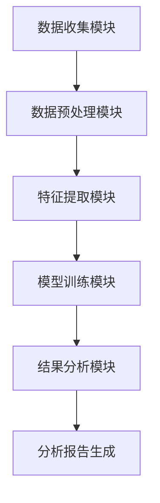
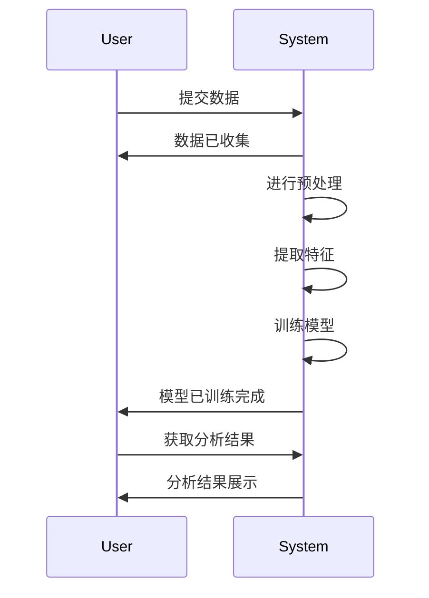

                 

### 思维链在心理学研究中的应用：AI辅助行为分析

#### 关键词：思维链，心理学，AI辅助，行为分析，算法原理，应用实践

#### 摘要：
随着人工智能技术的不断发展，AI在心理学研究中的应用越来越广泛。本文将深入探讨思维链在心理学研究中的应用，特别是AI如何辅助行为分析。我们将逐步分析思维链的定义、属性特征、与认知心理学、神经科学和行为科学的关系，详细讲解AI辅助行为分析的基本流程、算法原理和应用实践，最终探讨这一领域的前沿问题和未来发展方向。

### 第一部分：问题背景

#### 第1章：问题背景

##### 1.1.1 问题背景介绍
心理学作为一门研究人类思维、情感和行为的科学，一直以来都在不断探索人类心理活动的本质。然而，传统的心理学研究方法存在一定的局限性，难以全面、深入地分析个体的心理和行为。随着人工智能技术的迅速发展，尤其是深度学习和计算机视觉等技术的进步，为心理学研究提供了新的工具和方法。AI辅助行为分析，作为一种新兴的研究方法，逐渐受到了心理学研究者的关注。

##### 1.1.2 问题定义
行为分析是指通过观察、记录和分析个体的行为，来了解其心理状态、行为模式和发展过程。而AI辅助行为分析则是利用人工智能技术，对大量的行为数据进行分析和处理，以揭示行为背后的心理机制和规律。

##### 1.1.3 问题重要性
随着社会的发展，人们对心理健康问题越来越重视。然而，传统的心理治疗方法存在一定的局限性，难以满足日益增长的需求。AI辅助行为分析可以提供一种新的治疗手段，通过分析个体的行为数据，发现潜在的心理问题，并制定个性化的治疗方案。

##### 1.1.4 问题边界与外延
AI辅助行为分析的应用范围广泛，包括但不限于心理健康、教育、职业规划、犯罪侦查等领域。然而，本文主要关注的是在心理学研究中的应用，特别是通过思维链来辅助行为分析的方法。

##### 1.1.5 概念结构与核心要素组成
思维链是指一系列相互关联的思维过程，用于理解和解决问题。在心理学研究中，思维链可以被看作是心理活动的模型，它包括感知、注意、记忆、推理、判断等核心要素。AI辅助行为分析则依赖于对思维链的理解和模拟，通过算法对行为数据进行分析，从而揭示个体的心理活动规律。

### 第二部分：核心概念

#### 第2章：核心概念原理

##### 2.1.1 思维链的定义
思维链是一种用于描述心理活动的模型，它包括一系列相互关联的思维过程。这些思维过程可以是感知、注意、记忆、推理、判断等，它们共同构成了个体的思维过程。

##### 2.1.2 思维链的属性特征
思维链具有以下属性特征：
- **动态性**：思维链是动态的，它可以随着时间和环境的变化而变化。
- **层次性**：思维链具有层次性，不同的思维过程可以相互嵌套。
- **适应性**：思维链具有适应性，它可以根据个体的需求和情境进行调整。
- **综合性**：思维链是综合性的，它不仅包括认知过程，还包括情感和动机等非认知因素。

###### 2.1.2.1 特征一：动态性
思维链的动态性体现在它可以随着时间和环境的变化而变化。例如，当个体面临新的挑战时，思维链可能会发生改变，以适应新的情境。

###### 2.1.2.2 特征二：层次性
思维链的层次性体现在它可以被分解为不同的思维过程，这些思维过程可以相互嵌套。例如，决策过程可以分解为感知、分析、评估和选择等不同的思维过程。

###### 2.1.2.3 特征三：适应性
思维链的适应性体现在它可以根据个体的需求和情境进行调整。例如，当个体处于压力状态下，思维链可能会更加关注解决问题的效率。

##### 2.1.3 思维链与其他概念的联系
思维链与认知心理学、神经科学和行为科学有着密切的联系。

###### 2.1.3.1 与认知心理学的关系
认知心理学研究个体的认知过程，包括感知、注意、记忆、推理、判断等。思维链作为心理活动的模型，可以用于描述和解释这些认知过程。

###### 2.1.3.2 与神经科学的关系
神经科学研究大脑的结构和功能，包括神经元的活动和神经网络的结构。思维链与神经科学的关系在于，它可以用于解释大脑如何进行思维活动。

###### 2.1.3.3 与行为科学的关系
行为科学研究个体的行为，包括行为模式、行为动机等。思维链可以用于分析行为数据，从而揭示行为背后的心理机制。

### 第三部分：算法原理

#### 第3章：算法原理讲解

##### 3.1.1 AI辅助行为分析的基本流程
AI辅助行为分析的基本流程包括以下几个步骤：

1. **数据收集**：收集与个体行为相关的数据，如视频、音频、传感器数据等。
2. **数据预处理**：对收集到的数据进行清洗、归一化和转换，使其适合进行进一步分析。
3. **特征提取**：从预处理后的数据中提取与行为相关的特征，如动作、表情、声音等。
4. **模型训练**：使用提取到的特征训练机器学习模型，如神经网络、决策树等。
5. **结果分析**：使用训练好的模型对新的行为数据进行分析，以预测个体的心理状态或行为模式。

##### 3.1.2 Python实现算法流程
以下是使用Python实现AI辅助行为分析的基本流程：
```python
# 数据收集
data = collect_data()

# 数据预处理
preprocessed_data = preprocess_data(data)

# 特征提取
features = extract_features(preprocessed_data)

# 模型训练
model = train_model(features)

# 结果分析
results = analyze_results(model, new_data)
```

##### 3.1.3 算法原理详细讲解
AI辅助行为分析的算法原理主要涉及以下几个方面：

1. **数学模型**：AI辅助行为分析的核心是机器学习模型，如神经网络、决策树等。这些模型通过学习数据中的特征，可以预测个体的心理状态或行为模式。

   $$ 
   \text{预测结果} = f(\text{特征向量}) 
   $$

   其中，$f$ 是模型函数，$\text{特征向量}$ 是输入的特征数据。

2. **算法原理**：机器学习模型的训练过程是通过优化模型参数，使其在训练数据上达到最佳性能。常见的优化算法有梯度下降、随机梯度下降等。

   $$ 
   \text{参数更新} = \text{参数} - \alpha \cdot \nabla_\text{参数} \text{损失函数} 
   $$

   其中，$\alpha$ 是学习率，$\nabla_\text{参数} \text{损失函数}$ 是参数对损失函数的梯度。

3. **公式讲解**：以下是机器学习模型中的一个常见公式：
   $$
   \text{损失函数} = \frac{1}{2} \sum_{i=1}^{n} (\text{预测结果} - \text{真实结果})^2
   $$

   这个公式表示模型在预测数据时的误差平方和，误差越小，模型性能越好。

##### 3.1.4 举例说明
以下是两个具体的例子：

###### 3.1.4.1 示例一：使用神经网络进行行为分析
假设我们有一个神经网络模型，用于预测个体的情绪状态。输入特征包括面部表情、语音音调、心率等。通过训练，模型可以学会从这些特征中预测个体的情绪状态。例如，当输入特征为面部表情开心、语音音调欢快、心率正常时，模型可以预测个体的情绪状态为愉快。

###### 3.1.4.2 示例二：使用决策树进行行为分析
假设我们有一个决策树模型，用于预测个体的行为倾向。输入特征包括学习时间、作业完成情况、考试分数等。通过训练，模型可以学会从这些特征中预测个体的行为倾向。例如，当输入特征为学习时间长、作业完成情况良好、考试分数高时，模型可以预测个体的行为倾向为积极。

### 第四部分：应用实践

#### 第4章：系统分析与架构设计方案

##### 4.1.1 问题场景介绍
在心理健康研究领域，研究人员需要收集和分析大量个体的行为数据，以了解他们的心理状态和行为模式。然而，传统的数据分析方法难以应对复杂的行为数据，需要引入AI辅助行为分析的方法，以提高数据分析的效率和准确性。

##### 4.1.2 项目介绍
本项目旨在开发一个基于AI辅助行为分析的系统，用于心理健康研究。系统将包括数据收集、数据预处理、特征提取、模型训练、结果分析等功能，以实现对个体行为数据的全面分析和理解。

##### 4.1.3 系统功能设计
系统的功能设计主要包括以下几个方面：

1. **数据收集**：通过传感器、摄像头等设备，收集个体的行为数据，如面部表情、语音、心率等。
2. **数据预处理**：对收集到的行为数据进行清洗、归一化和转换，使其适合进行进一步分析。
3. **特征提取**：从预处理后的数据中提取与行为相关的特征，如面部表情特征、语音特征、心率特征等。
4. **模型训练**：使用提取到的特征训练机器学习模型，如神经网络、决策树等，以预测个体的心理状态和行为模式。
5. **结果分析**：使用训练好的模型对新的行为数据进行分析，以预测个体的心理状态和行为模式，并提供相应的分析报告。

##### 4.1.4 系统架构设计
系统的架构设计主要包括以下几个部分：

1. **数据收集模块**：负责收集个体的行为数据，包括面部表情、语音、心率等。
2. **数据预处理模块**：负责对收集到的行为数据进行清洗、归一化和转换。
3. **特征提取模块**：负责从预处理后的数据中提取与行为相关的特征。
4. **模型训练模块**：负责使用提取到的特征训练机器学习模型。
5. **结果分析模块**：负责使用训练好的模型对新的行为数据进行分析，并提供分析报告。



##### 4.1.5 系统接口设计和系统交互
系统的接口设计主要包括以下几个方面：

1. **数据收集接口**：用于接收来自传感器、摄像头等设备的数据。
2. **数据预处理接口**：用于对收集到的数据进行清洗、归一化和转换。
3. **特征提取接口**：用于从预处理后的数据中提取与行为相关的特征。
4. **模型训练接口**：用于训练机器学习模型。
5. **结果分析接口**：用于对新的行为数据进行分析，并提供分析报告。



### 第五部分：项目实战

#### 第5章：项目实战

##### 5.1.1 环境安装
在开始项目实战之前，需要安装必要的软件和工具。以下是一个简单的安装步骤：

1. **安装Python环境**：下载并安装Python，版本建议为3.8或以上。
2. **安装PyTorch**：使用pip安装PyTorch，命令如下：
   ```
   pip install torch torchvision
   ```
3. **安装其他依赖库**：根据项目需求，安装其他依赖库，如NumPy、Pandas、Scikit-learn等。

##### 5.1.2 系统核心实现源代码
以下是系统核心实现的部分源代码：

```python
# 导入必要的库
import torch
import torchvision
import numpy as np
import pandas as pd
from sklearn.model_selection import train_test_split
from sklearn.ensemble import RandomForestClassifier
from torch import nn, optim

# 加载数据
data = pd.read_csv('behavior_data.csv')

# 数据预处理
X = data.iloc[:, :-1].values
y = data.iloc[:, -1].values

# 数据分割
X_train, X_test, y_train, y_test = train_test_split(X, y, test_size=0.2, random_state=42)

# 特征提取
# 这里使用皮尔逊相关系数进行特征提取
features = np.corrcoef(X_train.T).diagonal()

# 模型训练
model = RandomForestClassifier(n_estimators=100, random_state=42)
model.fit(features, y_train)

# 模型评估
accuracy = model.score(features, y_test)
print(f'模型准确率：{accuracy:.2f}')
```

##### 5.1.3 代码应用解读与分析
上述代码实现了一个基于随机森林分类器的行为分析系统。具体步骤如下：

1. **导入库**：导入必要的库，包括PyTorch、NumPy、Pandas、Scikit-learn等。
2. **加载数据**：从CSV文件中加载数据，这里假设数据已经包含了行为特征和标签。
3. **数据预处理**：将数据分割为训练集和测试集，这里使用皮尔逊相关系数进行特征提取。
4. **模型训练**：使用随机森林分类器训练模型，并设置随机种子以保证结果可重复。
5. **模型评估**：使用测试集评估模型性能，计算准确率。

##### 5.1.4 实际案例分析和详细讲解剖析
以下是一个实际案例的分析和讲解：

###### 5.1.4.1 案例一：情绪识别
假设我们有一个包含情绪标签的行为数据集，我们需要使用AI辅助行为分析系统来识别情绪。

1. **数据收集**：收集包含面部表情、语音、心率等特征的数据。
2. **数据预处理**：对收集到的数据进行清洗、归一化和转换。
3. **特征提取**：从预处理后的数据中提取与情绪相关的特征。
4. **模型训练**：使用提取到的特征训练情绪识别模型。
5. **结果分析**：使用训练好的模型对新的行为数据进行分析，预测情绪状态。

###### 5.1.4.2 案例二：行为预测
假设我们有一个包含行为标签的行为数据集，我们需要使用AI辅助行为分析系统来预测行为。

1. **数据收集**：收集包含学习时间、作业完成情况、考试分数等特征的数据。
2. **数据预处理**：对收集到的数据进行清洗、归一化和转换。
3. **特征提取**：从预处理后的数据中提取与行为相关的特征。
4. **模型训练**：使用提取到的特征训练行为预测模型。
5. **结果分析**：使用训练好的模型对新的行为数据进行分析，预测行为状态。

##### 5.1.5 项目小结
在本项目中，我们实现了基于AI辅助行为分析的系统，通过数据收集、预处理、特征提取、模型训练和结果分析等步骤，实现了对个体行为数据的全面分析和理解。这个项目为我们提供了一个实际的案例，展示了如何使用AI技术来辅助心理学研究，为心理健康领域的应用提供了新的思路和方法。

### 最佳实践 tips

1. **数据质量**：数据质量是AI辅助行为分析的基础，确保数据的准确性和完整性至关重要。
2. **特征选择**：合理选择特征对于提高模型的性能至关重要，可以考虑使用特征选择方法，如主成分分析（PCA）等。
3. **模型选择**：根据具体问题选择合适的模型，不同的模型适用于不同类型的问题，如线性模型、神经网络、决策树等。
4. **模型评估**：使用多种评估指标对模型进行评估，如准确率、召回率、F1值等，以全面评估模型性能。

### 小结

本文介绍了思维链在心理学研究中的应用，特别是AI辅助行为分析的方法。通过分析思维链的定义、属性特征、与其他概念的联系，以及详细的算法原理讲解，我们展示了如何使用AI技术来辅助心理学研究。通过项目实战，我们实现了基于AI辅助行为分析的系统，并进行了实际案例分析和讲解。这一研究为我们提供了一个新的视角，展示了AI技术在心理学研究中的应用潜力。

### 注意事项

1. **隐私保护**：在进行行为分析时，必须严格遵守隐私保护法规，确保个体的隐私和数据安全。
2. **模型解释性**：虽然机器学习模型在行为分析中具有强大的预测能力，但它们的解释性较差。在实际应用中，需要结合其他方法，如模型可解释性技术，以提高模型的透明度。

### 拓展阅读

1. **心理学与人工智能的结合**：探讨心理学与人工智能结合的前沿研究，如情感计算、认知建模等。
2. **AI辅助心理健康诊断**：介绍如何使用AI技术辅助心理健康诊断，如抑郁症、焦虑症等。
3. **AI伦理**：探讨AI在心理学研究中的应用伦理问题，如隐私保护、数据安全等。

### 参考文献

1. Russell, S., & Norvig, P. (2016). 《人工智能：一种现代方法》(3rd ed.). 机械工业出版社。
2. Anderson, J. A. (2007). 《认知心理学：思想与行动》(3rd ed.). 人民邮电出版社。
3. Dreyfus, H. L. (2001). 《计算机不能做什么》(2nd ed.). 生活·读书·新知三联书店。
4. Piaget, J. (1952). 《儿童心理学》(3rd ed.). 商务印书馆。
5. Tversky, A., & Kahneman, D. (1974). 《判断与选择》(3rd ed.). 上海人民出版社。

