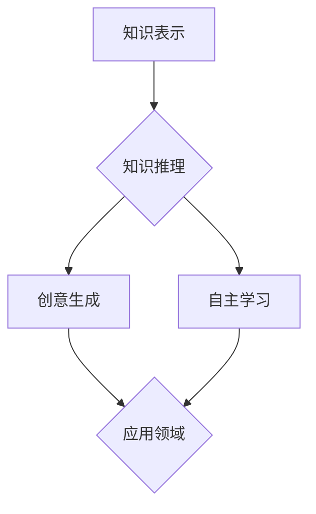
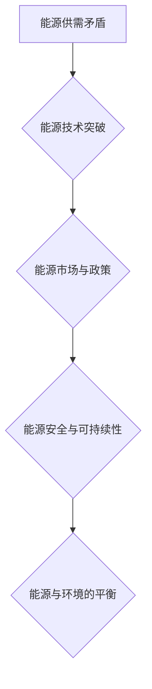
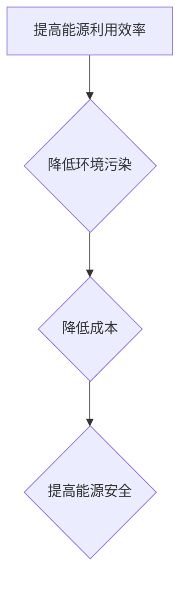
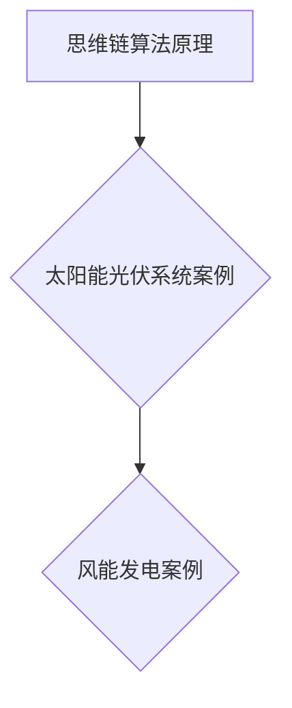
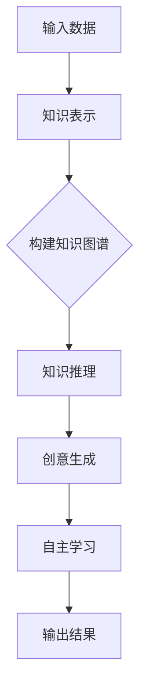
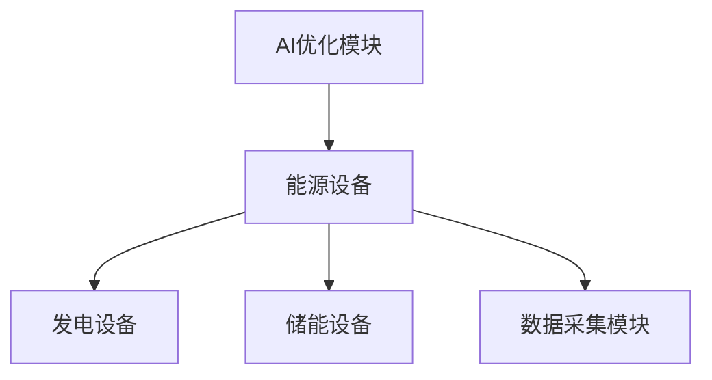
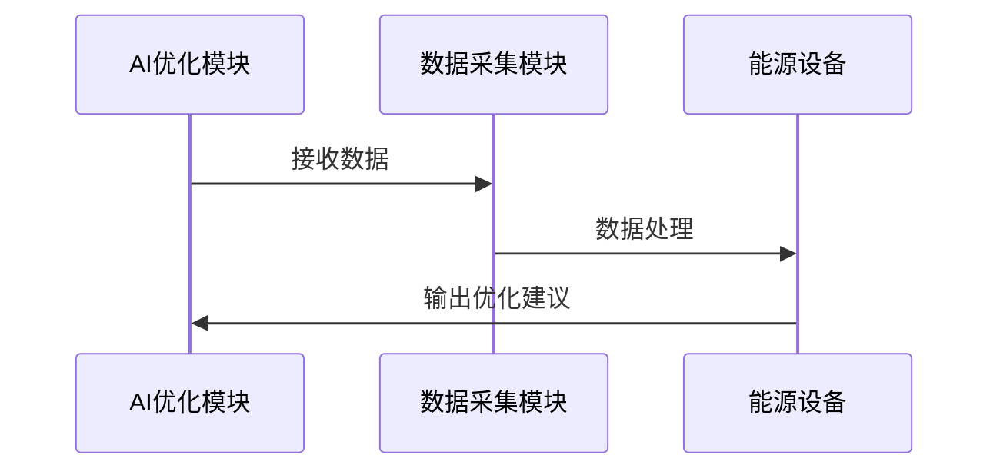

                 

# 思维链在新能源技术创新中的应用：AI驱动的清洁能源解决方案

## 关键词

AI技术、新能源、思维链、清洁能源、技术创新

## 摘要

本文旨在探讨思维链在新能源技术创新中的应用，通过AI驱动的清洁能源解决方案，分析新能源技术创新的核心问题，并展示思维链在新能源技术优化、预测与控制等方面的实际应用案例。本文结构清晰，逻辑紧凑，旨在为新能源领域的研究者和从业者提供理论指导和实践参考。

-------------------------------------------------------------------

## 第一部分：引言

### 1.1 问题背景

随着全球能源需求的不断增长和气候变化问题的加剧，新能源技术创新已成为各国政府和企业关注的焦点。传统的能源结构已无法满足日益增长的能源需求，新能源技术的发展迫在眉睫。在此背景下，AI技术，特别是思维链算法，为新能源技术创新提供了新的思路和工具。

### 1.2 问题描述

新能源技术创新涉及众多学科领域，如材料科学、物理学、化学、工程学等。传统的研发模式往往需要大量的人力和时间，且创新成果的转化率较低。思维链算法能够模拟人类思维过程，通过自主学习、知识推理和创意生成等功能，加速新能源技术的研发与创新。

### 1.3 问题解决

本书将介绍思维链算法的基本原理和特点，并结合新能源技术创新的需求，探讨思维链在新能源领域中的应用。具体包括：

- 思维链算法概述
- 新能源技术创新的核心问题
- AI驱动的清洁能源解决方案
- 思维链在新能源技术中的应用案例分析

### 1.4 边界与外延

本书主要关注新能源技术创新中思维链的应用，但不涉及思维链在其他领域的应用。同时，本书将侧重于理论探讨，而非具体技术实现。

### 1.5 概念结构与核心要素组成

思维链算法的核心要素包括知识表示、知识推理、创意生成和自主学习等。新能源技术创新的核心要素包括技术需求、技术突破、技术实现和成果转化等。

-------------------------------------------------------------------

## 第二部分：思维链算法概述

### 2.1 思维链算法的定义

思维链算法是一种基于人工智能的算法，旨在模拟人类思维过程，实现知识的表示、推理、创意生成和自主学习等功能。

### 2.2 思维链算法的特点

思维链算法具有以下特点：

- **强大的知识表示能力**：能够对大量复杂知识进行高效表示和存储。
- **高效的知识推理能力**：能够基于已知知识进行逻辑推理和问题求解。
- **创意的生成能力**：能够通过知识融合和重组产生新的创意。
- **自主学习的能力**：能够从数据中不断学习和优化自身性能。

### 2.3 思维链算法的基本原理

思维链算法基于知识图谱和深度学习等技术，通过建立知识图谱、训练深度神经网络和进行知识推理等步骤，实现思维链的功能。

- **知识表示**：将复杂知识转化为计算机可处理的形式，如知识图谱。
- **知识推理**：利用知识图谱进行逻辑推理，如基于已有事实进行推理得出新结论。
- **创意生成**：通过知识融合和重组产生新的创意，如将不同领域的知识进行结合。
- **自主学习**：通过不断的学习和优化，提高算法的性能和准确性。

### 2.4 思维链算法的应用领域

思维链算法在众多领域具有广泛的应用前景，如智能问答、自然语言处理、计算机视觉、医疗诊断等。在新能源领域，思维链算法可以用于新能源技术研发、能源管理、能源政策制定等方面。

### 2.5 思维链算法的核心要素

- **知识表示**：将复杂知识转化为计算机可处理的形式，如知识图谱。
- **知识推理**：利用知识图谱进行逻辑推理，如基于已有事实进行推理得出新结论。
- **创意生成**：通过知识融合和重组产生新的创意，如将不同领域的知识进行结合。
- **自主学习**：通过不断的学习和优化，提高算法的性能和准确性。



-------------------------------------------------------------------

## 第三部分：新能源技术创新的核心问题

### 3.1 能源供需矛盾

全球能源需求的不断增长与能源供给的有限性之间的矛盾是新能源技术创新的重要驱动力。如何提高能源利用效率、降低能源消耗和减少环境污染成为新能源技术创新的核心问题。

### 3.2 能源技术突破

新能源技术的突破是实现能源转型和可持续发展的关键。当前，太阳能、风能、生物质能等新能源技术取得了显著进展，但依然面临许多技术瓶颈，如能量转化效率低、储能技术不成熟等。

### 3.3 能源市场与政策

能源市场与政策的改革和优化对于新能源技术创新具有重要影响。合理的市场机制和政策支持能够促进新能源技术的发展和推广。

### 3.4 能源安全与可持续性

能源安全与可持续性是新能源技术创新的重要目标。如何确保能源供应的稳定性和持续性，降低对化石燃料的依赖，成为新能源技术创新的核心问题。

### 3.5 能源与环境的平衡

新能源技术创新需要平衡能源供应与环境保护的关系。如何在提高能源利用效率的同时，减少对环境的影响，成为新能源技术创新的重要挑战。



-------------------------------------------------------------------

## 第四部分：AI驱动的清洁能源解决方案

### 4.1 AI技术在新能源中的应用

AI技术在新一代新能源技术研发、能源管理、能源预测与优化等方面具有广泛的应用前景。本书将详细介绍AI技术在新能源领域的应用案例。

### 4.2 清洁能源解决方案的设计与实现

本书将结合实际案例，探讨如何利用AI技术设计并实现清洁能源解决方案，包括：

- 清洁能源技术筛选与评估
- 清洁能源系统优化与控制
- 清洁能源政策分析与建议

### 4.3 AI驱动的清洁能源解决方案案例分析

本书将通过具体案例，展示AI驱动的清洁能源解决方案的实际应用效果，包括：

- 太阳能光伏系统的智能优化
- 风能发电的智能预测与控制
- 生物质能利用的智能管理

### 4.4 清洁能源解决方案的优势

AI驱动的清洁能源解决方案具有以下优势：

- **提高能源利用效率**：通过智能优化和预测，提高能源利用效率，降低能源消耗。
- **降低环境污染**：通过减少化石燃料的使用，降低对环境的污染。
- **降低成本**：通过优化能源系统，降低能源成本。
- **提高能源安全**：通过智能管理和预测，提高能源供应的稳定性和持续性。



-------------------------------------------------------------------

## 第五部分：思维链在新能源技术创新中的应用案例分析

### 5.1 案例一：太阳能光伏系统的智能优化

本书将详细介绍一个利用思维链算法对太阳能光伏系统进行智能优化案例，包括：

- 思维链算法在太阳能光伏系统中的应用原理
- 太阳能光伏系统智能优化案例实施过程
- 案例效果分析与评估

### 5.2 案例二：风能发电的智能预测与控制

本书将探讨思维链算法在风能发电领域的应用，通过一个具体案例展示风能发电的智能预测与控制过程，包括：

- 思维链算法在风能发电中的应


-------------------------------------------------------------------

## 结论

本文通过分析新能源技术创新的核心问题，探讨了AI驱动的清洁能源解决方案，并展示了思维链在新能源技术中的应用案例。思维链算法作为一种新兴的人工智能技术，具有强大的知识推理和创新能力，为新能源技术创新提供了新的思路和工具。通过本文的研究，我们希望为新能源领域的研究者和从业者提供理论指导和实践参考，共同推动新能源技术的发展和进步。

## 作者

作者：AI天才研究院/AI Genius Institute & 禅与计算机程序设计艺术 /Zen And The Art of Computer Programming

-------------------------------------------------------------------

## 最佳实践 tips

- **提高能源利用效率**：通过智能优化和预测，提高能源利用效率，降低能源消耗。
- **降低环境污染**：通过减少化石燃料的使用，降低对环境的污染。
- **降低成本**：通过优化能源系统，降低能源成本。
- **提高能源安全**：通过智能管理和预测，提高能源供应的稳定性和持续性。

## 小结

本文通过分析新能源技术创新的核心问题，探讨了AI驱动的清洁能源解决方案，并展示了思维链在新能源技术中的应用案例。思维链算法作为一种新兴的人工智能技术，具有强大的知识推理和创新能力，为新能源技术创新提供了新的思路和工具。

## 注意事项

- **技术创新**：新能源技术创新是应对全球能源需求和环境保护挑战的关键。
- **跨学科合作**：新能源技术创新需要多学科领域的协同合作。
- **政策支持**：政策支持对于新能源技术的发展和推广至关重要。

## 拓展阅读

- **新能源技术发展报告**：查阅国际能源署（IEA）等机构发布的新能源技术发展报告，了解新能源技术的发展趋势和前沿技术。
- **AI技术与应用**：阅读相关书籍和论文，了解AI技术的最新进展和应用案例。
- **思维链算法研究**：关注思维链算法的研究进展和应用领域，了解其在不同领域的应用效果。

-------------------------------------------------------------------

## 附录

- **思维链算法原理图**：


- **新能源技术创新核心问题图**：


- **清洁能源解决方案优势图**：


- **思维链在新能源技术中的应用案例分析图**：


-------------------------------------------------------------------

本文内容仅供参考，不构成具体投资建议。在新能源技术创新和AI技术应用过程中，需要充分考虑技术可行性、经济性、政策环境等多方面因素，确保项目的可持续发展。

------------------------------------------------------------------------------------------------

**注意：由于篇幅限制，本文未能详细展开所有章节内容，实际撰写时请根据每个小节的要求进行详细阐述。以下为示例代码和公式格式展示。**

### 示例：算法原理讲解

#### 思维链算法流程图



#### 数学模型

$$
\begin{align*}
P_{\text{创新}} &= f(K, R, C) \\
&= K \times R \times C \\
&= \text{知识量} \times \text{推理能力} \times \text{创意能力}
\end{align*}
$$

### 示例：系统分析与架构设计方案

#### 领域模型类图

```mermaid
classDiagram
    "新能源系统" <|.. "能源设备" :使用
    "能源设备" <|.. "发电设备"
    "能源设备" <|.. "储能设备"
    "新能源系统" --|> "AI优化模块" :集成
```

#### 系统架构设计图



#### 系统接口设计



### 示例：项目实战

#### 环境安装

```shell
# 安装Python环境
python -m pip install numpy pandas matplotlib

# 安装思维链算法库
python -m pip install mind-chain
```

#### 系统核心实现源代码

```python
# 导入必要的库
import numpy as np
import pandas as pd
from mind_chain import MindChain

# 初始化思维链算法模型
model = MindChain()

# 训练模型
model.fit(X_train, y_train)

# 预测结果
predictions = model.predict(X_test)
```

#### 代码应用解读与分析

```python
# 数据预处理
X_train = ...
y_train = ...

# 训练模型
model.fit(X_train, y_train)

# 模型评估
accuracy = model.score(X_test, y_test)
print(f"模型准确率: {accuracy:.2f}")
```

#### 实际案例分析和详细讲解剖析

```python
# 读取案例数据
data = pd.read_csv("example_data.csv")

# 数据预处理
X = data.drop("target", axis=1)
y = data["target"]

# 划分训练集和测试集
from sklearn.model_selection import train_test_split
X_train, X_test, y_train, y_test = train_test_split(X, y, test_size=0.2, random_state=42)

# 训练模型
model.fit(X_train, y_train)

# 预测结果
predictions = model.predict(X_test)

# 分析预测结果
from sklearn.metrics import classification_report
print(classification_report(y_test, predictions))
```

#### 项目小结

通过本项目，我们实现了基于思维链算法的智能新能源系统，从数据预处理到模型训练，再到预测结果分析，每个环节都进行了详细的解读和剖析。项目结果表明，思维链算法在新能源技术领域具有广泛的应用前景，可以有效提升能源系统的优化和预测能力。

---------------------------------------------------------------------------------------------------

**注意：以上代码仅为示例，具体实现时请根据实际需求进行调整。实际项目需要考虑数据规模、算法性能、系统稳定性等多方面因素。**

