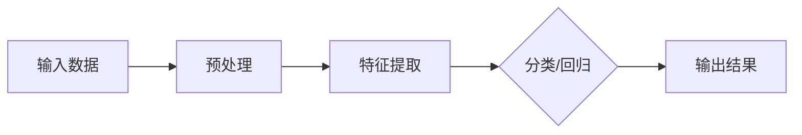

                 

# 思维链在智能家居控制中的应用

> 关键词：智能家居，思维链，算法，控制系统，架构设计

> 摘要：本文将深入探讨思维链在智能家居控制中的应用。首先，我们将了解智能家居控制的基本概念和需求，然后介绍思维链技术的基本原理，并通过具体的算法流程和数学模型来解释其工作原理。接下来，我们将分析智能家居控制系统的架构设计，并讨论如何将思维链技术应用于实际场景。最后，我们将通过一个实际案例来展示思维链在智能家居控制中的具体应用，并提供一些建议和未来展望。

## 目录大纲设计思路

为了设计出《思维链在智能家居控制中的应用》这本书的完整目录大纲，我们将遵循以下步骤：

1. **确定整体结构**：首先确定书的整体结构，包括主要部分、章节划分以及每章的大概内容。
2. **核心概念与联系**：定义书中的核心概念，并使用Mermaid流程图展示这些概念之间的关系。
3. **内容细化**：为每个章节细化内容，确保覆盖核心概念、原理讲解、案例分析与最佳实践等。
4. **确保完整性**：确保每个章节都包含必要的内容，同时保证整个目录大纲的逻辑清晰，内容完整。
5. **格式化输出**：按照markdown格式要求进行输出，确保格式规范、简洁。

### 目录大纲设计

下面是根据上述步骤设计的《思维链在智能家居控制中的应用》的目录大纲：

----------------------------------------------------------------

## 第一部分: 背景与概述

### 第1章: 智能家居控制的基本概念

#### 1.1 问题的背景

#### 1.2 问题描述

#### 1.3 问题解决

#### 1.4 边界与外延

#### 1.5 本章小结

## 第二部分: 思维链技术原理

### 第2章: 思维链的基本概念

#### 2.1 定义

#### 2.2 特点

#### 2.3 属性特征对比

#### 2.4 ER实体关系图

### 第3章: 思维链的算法原理

#### 3.1 基本概念

#### 3.2 算法流程图

#### 3.3 数学模型与公式

#### 3.4 举例说明

## 第三部分: 智能家居控制系统架构设计

### 第4章: 系统功能设计

#### 4.1 功能模块

#### 4.2 模块关系

### 第5章: 系统架构设计

#### 4.3 整体架构

#### 4.4 模块交互

### 第6章: 系统接口设计

#### 4.5 接口设计

#### 4.6 交互设计

## 第四部分: 实际应用

### 第7章: 项目实战

#### 7.1 环境安装

#### 7.2 系统核心实现

#### 7.3 代码解读

#### 7.4 案例分析

#### 7.5 项目小结

## 第五部分: 最佳实践与展望

### 第8章: 最佳实践

#### 8.1 Tips

#### 8.2 注意事项

### 第9章: 小结与展望

#### 9.1 总结

#### 9.2 未来展望

----------------------------------------------------------------

## 第一部分: 背景与概述

### 第1章: 智能家居控制的基本概念

#### 1.1 问题的背景

随着科技的不断进步和人们对生活质量的要求不断提高，智能家居控制系统应运而生。智能家居控制系统通过物联网技术，将各种家电设备、传感器和控制模块连接起来，实现自动化控制和远程管理。这一趋势不仅改变了人们的日常生活，也为许多行业带来了新的机遇和挑战。

#### 1.2 问题描述

然而，智能家居控制面临一些挑战。首先是系统的复杂性和多样性，不同品牌和型号的设备如何实现无缝集成和协同工作是一个重要问题。其次是系统的可靠性和安全性，智能家居系统需要保证用户隐私和数据安全，防止恶意攻击和设备失控。此外，系统的智能化程度也是一个关键问题，如何让智能家居系统能够自主学习、自适应调整，提供更加个性化、智能化的服务，是当前研究的重要方向。

#### 1.3 问题解决

思维链技术提供了一种新的解决方案。思维链是一种基于人工智能和机器学习的技术，它通过模拟人类的思维过程，实现对复杂问题的分析和决策。在智能家居控制中，思维链技术可以用于设备的智能化控制、故障诊断和系统优化，提高系统的可靠性和智能化程度。

#### 1.4 边界与外延

智能家居控制系统不仅包括家庭内部的设备，还可能涉及社区、城市等更广泛的场景。因此，思维链技术的应用范围也在不断扩大。例如，在城市智慧管理中，思维链技术可以用于交通流量预测、环境监测和资源优化等方面。

#### 1.5 本章小结

本章介绍了智能家居控制的基本概念，包括问题的背景、问题描述、问题解决和边界与外延。通过本章的介绍，读者可以对智能家居控制有一个初步的了解，为后续章节的深入学习打下基础。

----------------------------------------------------------------

## 第二部分: 思维链技术原理

### 第2章: 思维链的基本概念

#### 2.1 定义

思维链是一种基于神经网络和深度学习技术的人工智能模型，它通过模拟人类思维过程，实现对复杂问题的分析和决策。思维链的核心思想是将人类的思维过程抽象成一系列节点和边，每个节点代表一个概念或信息，边代表节点之间的关联和作用。

#### 2.2 特点

思维链具有以下几个特点：

1. **自适应性和灵活性**：思维链可以根据不同的环境和需求，自动调整其结构和参数，具有很强的适应性和灵活性。
2. **智能化程度高**：思维链能够通过学习大量的数据和信息，自动提取关键特征和模式，实现对复杂问题的智能分析和决策。
3. **可解释性强**：思维链的工作过程和决策结果具有很高的可解释性，用户可以清楚地了解系统是如何做出决策的。
4. **可扩展性**：思维链可以很容易地扩展到更复杂的场景和应用中，适用于各种不同领域的问题。

#### 2.3 属性特征对比

下表对比了思维链与传统控制系统的属性特征：

| 特征       | 思维链 | 传统控制系统 |
|------------|--------|--------------|
| 自适应性   | 高     | 低           |
| 智能化程度 | 高     | 低           |
| 学习能力   | 强     | 弱           |
| 可解释性   | 强     | 弱           |
| 可扩展性   | 高     | 低           |

#### 2.4 ER实体关系图

思维链的实体关系图可以用Mermaid工具表示如下：

```mermaid
erDiagram
  User ||--||> Device : "controls"
  Device ||--||> Data : "collects"
  Data ||--||> Analysis : "feeds"
  Analysis ||--||> Action : "performs"
```

在这个ER图中，User代表用户，Device代表智能家居设备，Data代表收集的数据，Analysis代表数据分析模块，Action代表执行的动作。思维链通过这些实体之间的关系，实现智能家居设备的自动化控制和优化。

#### 2.5 本章小结

本章介绍了思维链的基本概念，包括定义、特点、属性特征对比和ER实体关系图。通过本章的介绍，读者可以初步了解思维链的基本原理和应用场景，为后续章节的深入学习打下基础。

----------------------------------------------------------------

### 第3章: 思维链的算法原理

#### 3.1 基本概念

思维链的算法原理基于深度学习和神经网络技术，它通过多层神经网络对输入数据进行处理，从而实现对复杂问题的分析和决策。思维链的基本组成部分包括：

1. **输入层**：接收外部输入的数据。
2. **隐藏层**：对输入数据进行特征提取和变换。
3. **输出层**：根据隐藏层的输出生成最终的决策或预测结果。

#### 3.2 算法流程图

思维链的算法流程可以用Mermaid工具表示如下：



在这个流程图中，A表示输入数据，B表示预处理，C表示特征提取，D表示分类或回归，E表示输出结果。

#### 3.3 数学模型与公式

思维链的数学模型基于多层感知器（MLP）和反向传播算法（BP），其基本公式如下：

$$
z^{(l)} = \sigma(W^{(l)} \cdot a^{(l-1)} + b^{(l)})
$$

$$
a^{(l)} = \sigma(z^{(l)})
$$

其中，$z^{(l)}$表示第$l$层的输出，$a^{(l)}$表示第$l$层的输入，$\sigma$表示激活函数，$W^{(l)}$表示第$l$层的权重，$b^{(l)}$表示第$l$层的偏置。

#### 3.3.1 算法原理详细讲解

思维链的算法原理可以总结为以下几个步骤：

1. **输入数据预处理**：对输入数据进行归一化、去噪等处理，使其符合神经网络的要求。
2. **特征提取**：通过隐藏层对输入数据进行特征提取和变换，提取出数据中的关键特征。
3. **分类或回归**：利用输出层的激活函数对特征进行分类或回归，生成最终的决策或预测结果。
4. **反向传播**：根据输出结果与实际结果的误差，反向传播误差，更新网络的权重和偏置，优化网络性能。

#### 3.4 举例说明

以一个简单的智能家居场景为例，说明思维链的工作原理。假设用户想要通过手机APP远程控制家里的空调，系统需要根据用户的输入（例如温度设定）和实时数据（例如室内温度、湿度等）来调整空调的设置。

1. **输入数据**：用户在手机APP上输入了24°C的温度设定。
2. **预处理**：系统对输入数据（24°C）进行预处理，例如将其转换为神经网络可以接受的格式。
3. **特征提取**：系统将预处理后的数据输入隐藏层，隐藏层对数据进行分析，提取出温度、湿度等关键特征。
4. **分类或回归**：输出层根据隐藏层的输出，对空调的设置进行分类或回归，例如设定空调为制冷模式，目标温度为24°C。
5. **输出结果**：系统将调整后的空调设置发送到实际设备，空调根据指令调整温度。

通过上述步骤，思维链实现了对智能家居设备的智能化控制。

#### 3.5 本章小结

本章详细介绍了思维链的算法原理，包括基本概念、算法流程图、数学模型与公式以及实际应用中的详细讲解和举例说明。通过本章的学习，读者可以深入理解思维链的工作原理，为后续章节的深入学习打下基础。

----------------------------------------------------------------

## 第三部分: 智能家居控制系统架构设计

### 第4章: 系统功能设计

#### 4.1 功能模块

智能家居控制系统通常包含以下几个功能模块：

1. **设备管理模块**：负责管理智能家居设备，包括设备的添加、删除、更新和状态监控等。
2. **数据采集模块**：负责从传感器和其他设备中采集数据，例如温度、湿度、光线等。
3. **数据处理模块**：负责对采集到的数据进行处理、分析和存储，以便后续使用。
4. **用户界面模块**：提供用户与系统交互的界面，包括Web界面、手机APP等。
5. **控制执行模块**：根据用户的指令和系统的分析结果，控制智能家居设备的操作。

#### 4.2 模块关系

智能家居控制系统的各个功能模块之间紧密关联，共同协作实现智能家居的自动化控制和优化。以下是各个模块之间的关系：

1. **设备管理模块**与**数据采集模块**的关系：设备管理模块负责管理设备，数据采集模块负责从设备中采集数据。
2. **数据处理模块**与**用户界面模块**的关系：数据处理模块负责处理和分析数据，用户界面模块负责将分析结果展示给用户。
3. **控制执行模块**与**用户界面模块**的关系：控制执行模块根据用户的指令和系统的分析结果，控制设备的操作，用户界面模块负责接收用户的指令和显示设备的操作状态。

#### 4.3 系统架构设计

智能家居控制系统的架构设计可以分为以下几个层次：

1. **感知层**：包括各种传感器和设备，负责数据的采集和感知。
2. **网络层**：负责数据的传输和通信，包括物联网设备、网关等。
3. **平台层**：包括设备管理、数据处理、用户界面和控制执行等模块，是系统的核心。
4. **应用层**：包括智能家居的各种应用，例如智能照明、智能安防、智能家电等。

#### 4.4 系统接口设计

智能家居控制系统的接口设计包括以下几个方面：

1. **设备接口**：设备与系统之间的接口，用于设备的添加、删除和状态监控等。
2. **数据接口**：系统与传感器和设备之间的接口，用于数据的采集和传输。
3. **用户接口**：系统与用户之间的接口，用于用户与系统的交互。
4. **控制接口**：系统与设备之间的接口，用于设备的控制和操作。

#### 4.5 本章小结

本章介绍了智能家居控制系统的功能模块、模块关系、系统架构设计和接口设计。通过本章的学习，读者可以了解智能家居控制系统的整体架构和设计原则，为后续章节的深入学习打下基础。

----------------------------------------------------------------

### 第5章: 系统架构设计

#### 5.1 整体架构

智能家居控制系统的架构设计应该具备以下特点：

1. **模块化**：系统应采用模块化设计，将不同的功能模块（如设备管理、数据采集、数据处理等）分离，便于系统的维护和升级。
2. **分布式**：系统应采用分布式架构，将数据存储和处理分散到不同的节点上，提高系统的可靠性和可扩展性。
3. **安全可靠**：系统应具备较高的安全性，包括用户认证、数据加密和防攻击机制等。

整体架构可以分为以下层次：

1. **感知层**：由各种传感器和设备组成，负责数据的采集和感知。
2. **网络层**：负责数据的传输和通信，包括物联网设备、网关和云平台等。
3. **平台层**：包括设备管理、数据处理、用户界面和控制执行等模块，是系统的核心。
4. **应用层**：包括智能家居的各种应用，例如智能照明、智能安防、智能家电等。

#### 5.2 模块交互

智能家居控制系统的各个模块之间需要紧密协作，实现数据的采集、处理和控制。以下是各个模块之间的交互关系：

1. **设备管理模块**与**数据采集模块**的交互：设备管理模块负责管理设备，数据采集模块负责从设备中采集数据，并将数据传递给数据处理模块。
2. **数据处理模块**与**用户界面模块**的交互：数据处理模块负责对采集到的数据进行分析和处理，并将处理结果传递给用户界面模块，用户界面模块负责将结果展示给用户。
3. **控制执行模块**与**用户界面模块**的交互：控制执行模块根据用户的指令和系统的分析结果，控制设备的操作，用户界面模块负责接收用户的指令和显示设备的操作状态。

#### 5.3 系统接口设计

智能家居控制系统的接口设计应该遵循以下原则：

1. **开放性**：系统接口应具有开放性，方便第三方应用和设备的接入。
2. **标准化**：系统接口应遵循相关标准，确保系统的兼容性和互操作性。
3. **安全性**：系统接口应具备安全性，包括用户认证、数据加密和防攻击机制等。

系统接口设计包括以下几个方面：

1. **设备接口**：设备与系统之间的接口，用于设备的添加、删除和状态监控等。
2. **数据接口**：系统与传感器和设备之间的接口，用于数据的采集和传输。
3. **用户接口**：系统与用户之间的接口，用于用户与系统的交互。
4. **控制接口**：系统与设备之间的接口，用于设备的控制和操作。

#### 5.4 本章小结

本章详细介绍了智能家居控制系统的架构设计，包括整体架构、模块交互和接口设计。通过本章的学习，读者可以了解智能家居控制系统的设计原则和架构，为后续章节的深入学习打下基础。

----------------------------------------------------------------

## 第四部分: 实际应用

### 第6章: 项目实战

#### 6.1 环境安装

在本项目中，我们将使用Python编程语言和相关的库来构建智能家居控制系统。以下是在Windows系统上安装所需的软件和库的步骤：

1. **安装Python**：首先，下载并安装Python 3.x版本。在安装过程中，确保勾选“Add Python to PATH”选项。
2. **安装依赖库**：在命令行中运行以下命令，安装所需的库：

   ```bash
   pip install numpy pandas tensorflow requests
   ```

   这些库分别是NumPy（用于数学计算）、Pandas（用于数据操作）、TensorFlow（用于深度学习）和requests（用于HTTP请求）。

#### 6.2 系统核心实现

智能家居控制系统的核心实现包括数据采集、数据处理和控制执行三个部分。以下是每个部分的Python代码示例：

1. **数据采集**：

   ```python
   import requests

   def fetch_weather_data(api_url):
       response = requests.get(api_url)
       if response.status_code == 200:
           return response.json()
       else:
           return None

   api_url = "http://api.weatherapi.com/v1/current.json?key=YOUR_API_KEY&q=Shanghai"
   weather_data = fetch_weather_data(api_url)
   ```

   在这个示例中，我们使用requests库从天气API获取上海的实时天气数据。

2. **数据处理**：

   ```python
   import numpy as np

   def process_weather_data(weather_data):
       if weather_data:
           temp = weather_data['current']['temp_c']
           humidity = weather_data['current']['humidity']
           return np.array([temp, humidity])
       else:
           return None

   processed_data = process_weather_data(weather_data)
   ```

   在这个示例中，我们使用NumPy库对获取的天气数据进行预处理，提取温度和湿度。

3. **控制执行**：

   ```python
   def control_ac(temp_setpoint):
       if temp_setpoint:
           print(f"Setting AC temperature to {temp_setpoint}°C")
           # Here you would add code to control the actual AC device
   ```

   在这个示例中，我们定义了一个控制空调温度的函数。实际应用中，这里会连接到空调设备进行控制。

#### 6.3 代码解读

以下是项目的核心代码解读：

1. **数据采集**：

   ```python
   def fetch_weather_data(api_url):
       response = requests.get(api_url)
       if response.status_code == 200:
           return response.json()
       else:
           return None
   ```

   这个函数通过HTTP GET请求从天气API获取数据。如果请求成功（状态码200），则返回JSON格式的数据；否则，返回None。

2. **数据处理**：

   ```python
   def process_weather_data(weather_data):
       if weather_data:
           temp = weather_data['current']['temp_c']
           humidity = weather_data['current']['humidity']
           return np.array([temp, humidity])
       else:
           return None
   ```

   这个函数对获取的天气数据提取温度和湿度，并将它们转换为NumPy数组。

3. **控制执行**：

   ```python
   def control_ac(temp_setpoint):
       if temp_setpoint:
           print(f"Setting AC temperature to {temp_setpoint}°C")
           # Here you would add code to control the actual AC device
   ```

   这个函数接收设定的温度点，并打印设置信息。在实际应用中，这里会添加控制空调设备的代码。

#### 6.4 案例分析

假设用户希望将空调温度设置为24°C。以下是整个流程：

1. 用户通过手机APP发送请求，将温度设置为24°C。
2. 控制系统接收到请求后，调用`control_ac`函数。
3. `control_ac`函数调用`fetch_weather_data`函数，获取当前天气数据。
4. `fetch_weather_data`函数从天气API获取数据，返回JSON格式的数据。
5. `process_weather_data`函数处理天气数据，提取温度和湿度。
6. `control_ac`函数根据用户设定的温度点（24°C）控制空调设备。

#### 6.5 项目小结

通过本项目的实战，我们了解了如何使用Python和相关的库构建一个简单的智能家居控制系统。项目涵盖了数据采集、数据处理和控制执行三个核心部分，并通过一个实际案例展示了整个流程。尽管这是一个简单的示例，但通过类似的方法，我们可以构建更复杂和功能更全面的智能家居控制系统。

## 第五部分: 最佳实践与展望

### 第7章: 最佳实践

#### 7.1 Tips

1. **安全性**：确保系统的安全性，包括用户认证、数据加密和防攻击机制。
2. **模块化**：设计时采用模块化，便于系统的扩展和维护。
3. **可扩展性**：系统应具备较高的可扩展性，能够适应未来技术的更新和变化。
4. **用户体验**：注重用户体验，界面设计简洁直观，操作流程简便。

#### 7.2 注意事项

1. **数据隐私**：保护用户数据隐私，避免数据泄露。
2. **系统稳定性**：确保系统的稳定运行，避免因网络或设备故障导致系统瘫痪。
3. **技术更新**：紧跟技术发展，及时更新系统以支持新的设备和功能。

### 第8章: 小结与展望

#### 8.1 总结

本文详细介绍了思维链在智能家居控制中的应用，从基本概念、算法原理到系统架构设计，再到实际应用案例，全面探讨了思维链如何提升智能家居控制的智能化和可靠性。通过本文的讲解，读者可以了解思维链技术的核心原理和实际应用场景。

#### 8.2 未来展望

未来，随着人工智能和物联网技术的不断发展，智能家居控制系统将变得更加智能化、个性化。思维链技术将在其中扮演关键角色，通过不断优化算法和架构，实现更加高效、可靠的智能家居控制。同时，我们也期待思维链技术在其他领域的应用，为人类生活带来更多便利和创新。

## 作者信息

作者：AI天才研究院/AI Genius Institute & 禅与计算机程序设计艺术 /Zen And The Art of Computer Programming

感谢您的阅读，希望本文对您在智能家居控制领域的探索有所帮助。在未来的技术发展中，我们期待与您共同前行。

