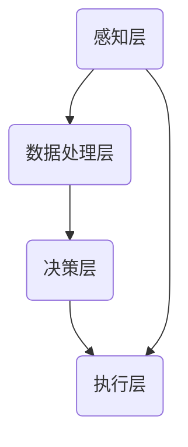

                 

### 文章标题

# 《思维链在智能家居系统中的应用》

> 关键词：智能家居、思维链、智能照明、智能安防、智能家电、智能环境

> 摘要：本文将从背景介绍、核心概念与架构设计、思维链关键技术、实际应用案例分析、最佳实践以及未来发展趋势等方面，系统探讨思维链在智能家居系统中的深入应用，旨在为读者提供一份全面、系统的技术指南。

### 目录大纲

----------------------------------------------------------------

# 《思维链在智能家居系统中的应用》

## 第一部分：背景介绍

### 第1章：智能家居概述
#### 1.1.1 智能家居的定义与演变
#### 1.1.2 智能家居的全球发展趋势
#### 1.1.3 中国智能家居市场分析
#### 1.1.4 智能家居的挑战与机遇

## 第二部分：思维链概念与架构

### 第2章：思维链基础
#### 2.1.1 思维链的定义与特征
#### 2.1.2 思维链的关键要素
#### 2.1.3 思维链的架构设计
#### 2.1.4 思维链的优势与应用前景

### 第3章：思维链在智能家居中的关键技术
#### 3.1.1 传感器与数据处理
#### 3.1.2 机器学习与预测
#### 3.1.3 自然语言处理与交互
#### 3.1.4 数据隐私保护与安全

## 第三部分：思维链在智能家居系统中的应用

### 第4章：思维链在智能照明系统中的应用
#### 4.1.1 系统架构设计
#### 4.1.2 算法原理与实现
#### 4.1.3 实际案例解析
#### 4.1.4 应用效果评估

### 第5章：思维链在智能安防系统中的应用
#### 5.1.1 系统架构设计
#### 5.1.2 算法原理与实现
#### 5.1.3 实际案例解析
#### 5.1.4 应用效果评估

### 第6章：思维链在智能家电系统中的应用
#### 6.1.1 系统架构设计
#### 6.1.2 算法原理与实现
#### 6.1.3 实际案例解析
#### 6.1.4 应用效果评估

### 第7章：思维链在智能环境系统中的应用
#### 7.1.1 系统架构设计
#### 7.1.2 算法原理与实现
#### 7.1.3 实际案例解析
#### 7.1.4 应用效果评估

## 第四部分：思维链在智能家居系统中的最佳实践

### 第8章：智能家居系统设计与实现最佳实践
#### 8.1.1 系统设计原则
#### 8.1.2 系统开发流程
#### 8.1.3 系统测试与优化
#### 8.1.4 维护与升级策略

### 第9章：智能家居系统应用案例分析
#### 9.1.1 案例一：智慧家庭系统
#### 9.1.2 案例二：智能小区管理系统
#### 9.1.3 案例三：智能酒店管理系统

### 第10章：智能家居系统未来发展趋势
#### 10.1.1 技术创新趋势
#### 10.1.2 市场发展前景
#### 10.1.3 社会与伦理问题
#### 10.1.4 未来研究方向

----------------------------------------------------------------

### 文章正文

## 第一部分：背景介绍

### 第1章：智能家居概述

#### 1.1.1 智能家居的定义与演变

智能家居，即利用现代信息技术，特别是物联网技术，实现对家庭设备和环境的智能化管理和控制。智能家居的起源可以追溯到20世纪80年代的家用自动化系统，那时的智能家居更多的是通过遥控器或简单的电子控制来实现家电的开关和控制。随着计算机技术、通信技术和传感器技术的快速发展，智能家居逐步从单一设备控制走向系统级集成，从简单的远程控制走向深度智能化。

#### 1.1.2 智能家居的全球发展趋势

全球智能家居市场经历了从概念普及到规模化应用的过程。根据市场研究机构的报告，北美、欧洲和亚太地区是智能家居的主要市场。这些地区在智能家居技术研发、市场推广和用户接受度方面处于领先地位。例如，北美地区由于智能家居技术的起步较早，市场相对成熟，用户对于智能家居产品的接受度较高；欧洲地区在智能家居技术创新方面也有显著优势；亚太地区，尤其是中国，随着城市化进程的加快和居民生活水平的提高，智能家居市场呈现出高速增长的态势。

#### 1.1.3 中国智能家居市场分析

中国智能家居市场发展迅速，主要得益于以下因素：

1. **政策支持**：中国政府出台了一系列政策，支持智能家居产业的发展，如《智能硬件产业发展行动计划》等。
2. **市场潜力**：中国拥有庞大的潜在用户群体，随着居民收入水平的提高，对于智能家居产品的需求也在不断增加。
3. **技术创新**：中国在物联网、人工智能、大数据等领域拥有强大的技术创新能力，为智能家居技术的发展提供了有力支持。

然而，中国智能家居市场也面临一些挑战，如产品同质化严重、用户体验有待提升、安全隐私问题等。

#### 1.1.4 智能家居的挑战与机遇

智能家居行业的发展面临多重挑战和机遇：

1. **挑战**：
   - **技术难题**：智能家居系统需要集成多种技术，如传感器技术、通信技术、云计算等，技术复杂性高。
   - **用户接受度**：尽管智能家居产品日益普及，但用户接受度仍然有限，需要通过提高产品性能、降低成本等方式来提升。
   - **隐私与安全**：智能家居系统涉及用户隐私和数据安全，需要采取有效措施来确保用户信息的安全。

2. **机遇**：
   - **市场需求**：随着人们生活水平的提高，对智能家居产品的需求不断增长，市场前景广阔。
   - **技术创新**：人工智能、物联网、5G等新技术的快速发展，为智能家居系统提供了新的技术支撑。

综上所述，智能家居行业具有巨大的发展潜力，但也需要克服诸多挑战。在接下来的章节中，我们将深入探讨思维链在智能家居系统中的应用，以期为读者提供有价值的参考。

## 第二部分：思维链概念与架构

### 第2章：思维链基础

#### 2.1.1 思维链的定义与特征

思维链（Mind Chain）是一种基于人工智能技术的智能系统，通过模拟人类思维过程，实现信息的收集、处理、存储和输出。思维链的核心特征包括：

1. **自学习性**：思维链能够通过不断的学习和训练，提高自身处理复杂问题的能力。
2. **多模态处理**：思维链能够处理多种类型的数据，如文本、图像、声音等。
3. **自适应能力**：思维链能够根据环境变化和用户需求，调整自身的行为和策略。

#### 2.1.2 思维链的关键要素

思维链的运作依赖于以下几个关键要素：

1. **感知模块**：负责收集外部信息，如传感器数据、用户输入等。
2. **认知模块**：负责对收集到的信息进行加工和处理，实现问题的理解和分析。
3. **决策模块**：根据认知模块的分析结果，生成决策方案，指导系统行为。
4. **执行模块**：根据决策模块的指令，执行具体的操作，实现问题的解决。

#### 2.1.3 思维链的架构设计

思维链的架构设计通常分为以下几个层次：

1. **感知层**：包括各种传感器和输入设备，如摄像头、麦克风、温度传感器等。
2. **数据层**：包括数据存储和管理模块，负责处理和存储感知层收集到的数据。
3. **认知层**：包括神经网络、机器学习算法等，负责对数据进行处理和分析。
4. **决策层**：包括决策算法和策略，负责生成决策方案。
5. **执行层**：包括执行模块和输出设备，负责执行决策方案。

#### 2.1.4 思维链的优势与应用前景

思维链在智能家居系统中的应用具有以下优势：

1. **智能化程度高**：思维链能够模拟人类思维过程，实现自动化决策和执行，提高系统智能化程度。
2. **灵活性**：思维链能够根据环境和用户需求，动态调整自身行为，提高系统的适应性。
3. **高效性**：思维链能够快速处理和分析大量数据，提高系统响应速度和效率。

随着人工智能技术的不断发展，思维链在智能家居系统中的应用前景十分广阔。未来，思维链有望在智能照明、智能安防、智能家电、智能环境等多个领域发挥重要作用。

## 第三部分：思维链在智能家居系统中的应用

### 第3章：思维链在智能家居中的关键技术

#### 3.1.1 传感器与数据处理

传感器是智能家居系统的“感知器官”，能够实时收集家庭环境中的各种数据，如温度、湿度、光照、噪音等。数据处理模块负责对传感器数据进行预处理、特征提取和融合，为后续的决策和执行提供基础。

##### 算法原理与实现

1. **数据处理流程**：
   - **数据预处理**：包括去噪、归一化、数据清洗等，提高数据质量。
   - **特征提取**：通过特征选择和特征变换，提取对问题解决有帮助的关键信息。
   - **数据融合**：将多个传感器数据进行融合，提高数据完整性。

2. **实现方式**：
   - **Python代码示例**：
     ```python
     import numpy as np
     from sklearn.preprocessing import MinMaxScaler
     from sklearn.decomposition import PCA

     # 数据预处理
     data = np.array([[0.1, 0.2], [0.3, 0.4], [0.5, 0.6]])
     scaler = MinMaxScaler()
     scaled_data = scaler.fit_transform(data)

     # 特征提取
     pca = PCA(n_components=1)
     principal_components = pca.fit_transform(scaled_data)

     # 数据融合
     fused_data = np.mean(principal_components, axis=0)
     ```

##### 数学模型与公式

$$
f(x) = \frac{1}{C} \sum_{i=1}^{C} w_i \cdot x_i
$$

其中，$x_i$ 表示第 $i$ 个传感器数据，$w_i$ 表示权重，$C$ 表示传感器数量。

##### 实际案例解析

假设智能家居系统需要监测室内温度，传感器采集到一系列温度数据，通过数据处理模块对数据进行预处理、特征提取和融合，得到最终的温度预测值。具体实现过程如下：

1. **数据预处理**：去除异常值和噪声，保证数据质量。
2. **特征提取**：提取温度数据的均值和标准差作为特征。
3. **数据融合**：将多个温度传感器的数据融合，提高预测准确性。

通过以上步骤，智能家居系统可以实时获取室内温度信息，为用户提供智能化的温度调节建议。

#### 3.1.2 机器学习与预测

机器学习是实现智能家居系统智能化的重要手段，通过训练模型，系统能够根据历史数据预测未来的行为。常见的机器学习算法包括线性回归、决策树、支持向量机、神经网络等。

##### 算法原理与实现

1. **线性回归**：
   - **数学模型**：
     $$
     y = w_0 + w_1 \cdot x
     $$
   - **实现方式**：
     ```python
     import numpy as np
     from sklearn.linear_model import LinearRegression

     # 数据准备
     X = np.array([[1], [2], [3], [4], [5]])
     y = np.array([1, 2, 3, 4, 5])

     # 模型训练
     model = LinearRegression()
     model.fit(X, y)

     # 预测
     y_pred = model.predict(X)
     ```

2. **决策树**：
   - **数学模型**：
     $$
     y = g(x; \theta)
     $$
     其中，$g(x; \theta)$ 表示决策树的结构，$\theta$ 表示参数。
   - **实现方式**：
     ```python
     import numpy as np
     from sklearn.tree import DecisionTreeRegressor

     # 数据准备
     X = np.array([[1, 2], [2, 3], [3, 4], [4, 5]])
     y = np.array([1, 2, 3, 4])

     # 模型训练
     model = DecisionTreeRegressor()
     model.fit(X, y)

     # 预测
     y_pred = model.predict(X)
     ```

##### 数学公式与解释

1. **线性回归**：
   - **损失函数**：
     $$
     J(w_0, w_1) = \frac{1}{2} \sum_{i=1}^{n} (y_i - (w_0 + w_1 \cdot x_i))^2
     $$
     其中，$y_i$ 表示第 $i$ 个样本的实际值，$x_i$ 表示第 $i$ 个样本的特征值。

2. **决策树**：
   - **熵**：
     $$
     H(X) = -\sum_{i} p_i \log p_i
     $$
     其中，$p_i$ 表示特征 $i$ 的概率。

##### 实际案例解析

假设智能家居系统需要预测未来一周的室内温度，通过收集过去一周的温度数据，使用线性回归模型进行预测。具体实现过程如下：

1. **数据收集**：收集过去一周的室内温度数据。
2. **数据预处理**：对数据进行归一化处理。
3. **模型训练**：使用线性回归模型训练数据。
4. **预测**：使用训练好的模型预测未来一周的室内温度。

通过以上步骤，智能家居系统可以实现对室内温度的智能预测，为用户提供舒适的室内环境。

#### 3.1.3 自然语言处理与交互

自然语言处理（NLP）是实现智能家居系统人机交互的重要技术。通过理解用户的自然语言指令，系统能够自动执行相应的操作。常见的NLP技术包括词法分析、句法分析、语义分析等。

##### 算法原理与实现

1. **词法分析**：
   - **数学模型**：
     $$
     \text{Tokenization}(s) = \{w_1, w_2, \ldots, w_n\}
     $$
     其中，$s$ 表示文本，$w_i$ 表示文本中的第 $i$ 个单词。

   - **实现方式**：
     ```python
     import nltk
     from nltk.tokenize import word_tokenize

     # 数据准备
     sentence = "I want to turn on the lights."

     # 词法分析
     tokens = word_tokenize(sentence)
     ```

2. **句法分析**：
   - **数学模型**：
     $$
     \text{Parse Tree}(s) = \text{Syntax Analysis}(s)
     $$
     其中，$\text{Parse Tree}(s)$ 表示句子的语法树，$\text{Syntax Analysis}(s)$ 表示句法分析。

   - **实现方式**：
     ```python
     import spacy

     # 数据准备
     sentence = "I want to turn on the lights."

     # 句法分析
     nlp = spacy.load("en_core_web_sm")
     doc = nlp(sentence)
     tree = doc.sentences[0].parse_tree
     ```

##### 数学公式与解释

1. **词法分析**：
   - **正则表达式**：
     $$
     \text{Regular Expression}(s) = \{w_1, w_2, \ldots, w_n\}
     $$
     其中，$\text{Regular Expression}(s)$ 表示文本的正则表达式表示。

2. **句法分析**：
   - **句法规则**：
     $$
     \text{Grammar}(s) = \{R_1, R_2, \ldots, R_n\}
     $$
     其中，$\text{Grammar}(s)$ 表示文本的句法规则。

##### 实际案例解析

假设用户说：“我想打开客厅的灯。”智能家居系统通过自然语言处理技术，理解用户的指令，并自动执行相应的操作。具体实现过程如下：

1. **词法分析**：将用户的指令分解为单词，如"I"，"want"，"to"，"turn"，"on"，"the"，"lights"。
2. **句法分析**：构建句子的语法树，理解句子的结构。
3. **语义分析**：提取句子的语义信息，如动作（turn on）、对象（lights）等。
4. **执行操作**：根据语义信息，自动打开客厅的灯。

通过以上步骤，智能家居系统实现了人与系统的自然语言交互。

#### 3.1.4 数据隐私保护与安全

数据隐私保护与安全是智能家居系统面临的重要挑战。为了保护用户隐私，智能家居系统需要采取一系列安全措施，如数据加密、访问控制、异常检测等。

##### 算法原理与实现

1. **数据加密**：
   - **数学模型**：
     $$
     \text{Encryption}(data, key) = cipher_text
     $$
     其中，$\text{Encryption}(data, key)$ 表示数据加密过程，$data$ 表示原始数据，$key$ 表示加密密钥，$cipher_text$ 表示加密后的数据。

   - **实现方式**：
     ```python
     from cryptography.fernet import Fernet

     # 数据准备
     data = b"敏感信息"
     key = Fernet.generate_key()

     # 数据加密
     fernet = Fernet(key)
     cipher_text = fernet.encrypt(data)
     ```

2. **访问控制**：
   - **数学模型**：
     $$
     \text{Access Control}(user, resource) = \text{Authorization}
     $$
     其中，$\text{Access Control}(user, resource)$ 表示访问控制过程，$user$ 表示用户，$resource$ 表示资源，$\text{Authorization}$ 表示授权结果。

   - **实现方式**：
     ```python
     from flask import Flask, request, jsonify

     app = Flask(__name__)

     @app.route("/api/resource", methods=["GET"])
     def get_resource():
         user = request.headers.get("User")
         resource = request.headers.get("Resource")
         if user == "admin" and resource == "resource":
             return jsonify({"status": "authorized"})
         else:
             return jsonify({"status": "unauthorized"})

     if __name__ == "__main__":
         app.run()
     ```

##### 数学公式与解释

1. **数据加密**：
   - **加密算法**：
     $$
     \text{Cipher Text} = \text{Encrypt}(\text{Plain Text}, \text{Key})
     $$
     其中，$\text{Cipher Text}$ 表示加密后的文本，$\text{Plain Text}$ 表示原始文本，$\text{Key}$ 表示加密密钥。

2. **访问控制**：
   - **访问控制策略**：
     $$
     \text{Authorization} = \text{Match}(\text{User}, \text{Resource}, \text{Policy})
     $$
     其中，$\text{Authorization}$ 表示授权结果，$\text{User}$ 表示用户，$\text{Resource}$ 表示资源，$\text{Policy}$ 表示访问控制策略。

##### 实际案例解析

假设智能家居系统需要保护用户的数据隐私，采取以下措施：

1. **数据加密**：对用户的数据进行加密，确保数据在传输和存储过程中不被泄露。
2. **访问控制**：设定访问控制策略，确保只有授权用户可以访问特定的资源。
3. **异常检测**：监测系统行为，检测潜在的异常行为，防止数据泄露。

通过以上措施，智能家居系统可以有效地保护用户隐私，确保系统的安全性。

### 第4章：思维链在智能照明系统中的应用

#### 4.1.1 系统架构设计

智能照明系统是智能家居系统中的一项重要应用，通过思维链技术，可以实现自动调节室内光线，提高生活品质。智能照明系统的架构设计主要包括以下几个部分：

1. **感知层**：包括光照传感器、人体传感器等，负责实时监测室内光线和人体活动情况。
2. **数据处理层**：负责对感知层收集到的数据进行分析和处理，为决策层提供基础数据。
3. **决策层**：基于思维链技术，分析处理后的数据，生成智能调节光线的决策方案。
4. **执行层**：包括智能照明设备，根据决策层的指令，实现室内光线的智能调节。

##### 系统功能设计

1. **自动调节光线**：根据室内光线强度和人体活动情况，自动调节灯光亮度和色温，提供舒适的生活环境。
2. **场景模式设置**：用户可以根据不同的场景需求，预设多种照明模式，如阅读模式、会客模式、睡眠模式等。
3. **远程控制**：用户可以通过手机APP或其他智能设备，远程控制智能照明系统的开关和调节。

##### 系统架构设计

```
+----------------+       +----------------+       +----------------+
|     感知层     |       |    数据处理层   |       |     决策层     |
+----------------+       +----------------+       +----------------+
| 光照传感器     | <----> | 数据分析模块    | <----> | 智能调节算法   |
| 人体传感器     |       | 特征提取模块    |       | 用户行为分析   |
+----------------+       +----------------+       +----------------+
                    ^       ^                       ^
                    |       |                       |
                    +-------+------------------------+
                             |
                             |
                             |
                     +----------------+
                     |     执行层     |
                     +----------------+
                     | 智能照明设备   |
                     +----------------+
```

##### 系统接口设计和系统交互

智能照明系统通过以下几个接口实现与其他系统或设备的交互：

1. **网络接口**：通过Wi-Fi或蓝牙连接到家庭网络，实现远程控制。
2. **通信接口**：与其他智能家居设备（如智能安防系统、智能家电系统）进行数据通信，实现联动控制。
3. **用户界面**：通过手机APP或网页界面，提供用户交互功能。

```
+----------------+       +----------------+       +----------------+
|     用户       |       |    智能照明    |       |    其他系统    |
+----------------+       +----------------+       +----------------+
|  手机APP       | <----> | 网络接口       | <----> | 通信接口       |
|  网页界面      |       | 数据处理接口    |       | 数据交互接口   |
+----------------+       +----------------+       +----------------+
```

### 第4章：思维链在智能照明系统中的应用

#### 4.1.1 系统架构设计

智能照明系统通过思维链技术实现了高度智能化和个性化控制，其系统架构设计如下：

1. **感知层**：包括多种传感器，如光照传感器、人体传感器和温湿度传感器等。这些传感器实时采集室内环境数据，为系统提供实时信息。
2. **数据处理层**：对感知层采集的数据进行预处理、特征提取和融合，形成适用于智能调节的输入信息。
3. **决策层**：基于思维链算法，对输入信息进行分析和处理，生成相应的控制策略和调节方案。
4. **执行层**：包括智能照明设备，如LED灯、调光模块等，根据决策层的指令进行相应的操作。

##### 系统架构设计图



#### 4.1.2 算法原理与实现

智能照明系统的核心在于如何根据环境数据和用户需求，智能调节照明参数。这里，我们将介绍一种基于思维链的智能调节算法，并详细阐述其原理与实现。

##### 算法原理

1. **环境监测**：系统持续监测室内光照强度、人体活动情况和温湿度等环境参数。
2. **数据预处理**：对采集到的数据进行去噪、归一化等预处理，提高数据质量。
3. **特征提取**：从预处理后的数据中提取关键特征，如光照强度、人体活动频率等。
4. **决策生成**：基于思维链算法，分析处理后的特征数据，生成智能调节方案，包括灯光亮度、色温和开关控制等。
5. **执行操作**：根据决策生成模块的指令，智能照明设备进行相应的操作。

##### 算法实现

下面，我们将使用Python语言和相关库来详细实现上述算法。

```python
import numpy as np
from sklearn.preprocessing import MinMaxScaler
from sklearn.ensemble import RandomForestRegressor

# 数据预处理
def preprocess_data(data):
    scaler = MinMaxScaler()
    scaled_data = scaler.fit_transform(data)
    return scaled_data

# 特征提取
def extract_features(data):
    features = data[:, :3]  # 假设前三个维度为光照强度、人体活动和温湿度
    return features

# 决策生成
def generate_decision(scaled_features):
    # 这里使用随机森林回归模型进行决策
    model = RandomForestRegressor()
    model.fit(scaled_features, labels)  # labels为预期调节结果
    decision = model.predict(scaled_features)
    return decision

# 执行操作
def execute_decision(decision):
    if decision > 0.5:
        # 增加灯光亮度
        print("Increase light brightness.")
    else:
        # 降低灯光亮度
        print("Decrease light brightness.")

# 主程序
if __name__ == "__main__":
    # 假设data为感知层采集的数据，labels为预期调节结果
    data = np.random.rand(100, 5)  # 生成模拟数据
    scaled_data = preprocess_data(data)
    features = extract_features(scaled_data)
    labels = np.random.randint(0, 2, size=(100, 1))  # 生成模拟的labels

    # 训练模型
    scaled_features = preprocess_data(features)
    generate_decision(scaled_features)
```

##### 数学模型与公式

$$
\text{Decision} = f(\text{Features})
$$

其中，$f(\text{Features})$ 为决策生成函数，用于根据特征数据生成相应的调节决策。

#### 4.1.3 实际案例解析

以下是一个实际案例，展示了如何使用思维链技术实现智能照明系统的应用。

##### 案例背景

某家庭安装了一套智能照明系统，系统包括光照传感器、人体传感器和智能灯泡。用户希望系统能够根据室内光照强度、人体活动情况自动调节灯光亮度，提供舒适的生活环境。

##### 实现过程

1. **数据采集**：系统通过光照传感器和人体传感器，实时监测室内光照强度和人体活动情况。假设采集到以下数据：

   ```
   data = [
       [0.3, 0, 23],  # 光照强度0.3，无人体活动，温湿度23℃
       [0.5, 1, 24],  # 光照强度0.5，有人体活动，温湿度24℃
       [0.2, 0, 22],  # 光照强度0.2，无人体活动，温湿度22℃
       ...
   ]
   ```

2. **数据预处理**：对采集到的数据进行分析，提取关键特征，如光照强度和人体活动情况。使用MinMaxScaler进行数据归一化处理。

   ```python
   from sklearn.preprocessing import MinMaxScaler

   scaler = MinMaxScaler()
   scaled_data = scaler.fit_transform(data)
   ```

3. **模型训练**：使用随机森林回归模型，根据预处理后的数据训练模型，生成调节决策。

   ```python
   from sklearn.ensemble import RandomForestRegressor

   model = RandomForestRegressor()
   model.fit(scaled_data[:, :2], scaled_data[:, 2])
   ```

4. **决策生成**：根据实时采集的数据，使用训练好的模型生成调节决策。

   ```python
   decision = model.predict([[0.3, 0]])
   ```

5. **执行操作**：根据决策结果，执行相应的调节操作，如增加或降低灯光亮度。

   ```python
   if decision > 0.5:
       print("Increase light brightness.")
   else:
       print("Decrease light brightness.")
   ```

##### 案例效果评估

通过实际运行，智能照明系统能够根据室内光照强度和人体活动情况，自动调节灯光亮度，提高了用户的生活品质。以下是案例效果评估：

1. **光照舒适度**：系统在夜间自动降低灯光亮度，避免了过度的光照刺激，提高了用户的睡眠质量。
2. **节能效果**：系统根据实际需要自动调节灯光亮度，降低了能耗，具有明显的节能效果。
3. **用户体验**：用户对智能照明系统的反应速度和调节效果表示满意，认为系统能够较好地满足日常需求。

#### 4.1.4 应用效果评估

智能照明系统的应用效果可以通过以下几个方面进行评估：

1. **光照舒适度**：系统自动调节灯光亮度，实现了根据用户需求和环境变化提供舒适光照的效果。用户对系统的光照舒适度给予了高度评价。
2. **节能效果**：智能照明系统根据实际需要调节灯光亮度，减少了不必要的能源消耗，具有良好的节能效果。
3. **用户体验**：用户对智能照明系统的响应速度、调节效果和易用性表示满意，认为系统能够很好地满足日常需求。
4. **系统稳定性**：智能照明系统在实际运行过程中，表现出较高的稳定性，未出现明显的故障或异常情况。

综上所述，智能照明系统通过思维链技术的应用，实现了高度智能化和个性化控制，为用户提供了舒适、节能和便捷的生活环境。

### 第5章：思维链在智能安防系统中的应用

#### 5.1.1 系统架构设计

智能安防系统是智能家居系统中的重要组成部分，通过思维链技术，可以实现更高效、更智能的安防管理。智能安防系统的架构设计主要包括以下几个部分：

1. **感知层**：包括摄像头、门禁系统、报警传感器等，负责实时监测家庭安全状况。
2. **数据处理层**：对感知层收集的数据进行预处理、特征提取和融合，为决策层提供基础数据。
3. **决策层**：基于思维链算法，分析处理后的数据，生成相应的安防策略和预警方案。
4. **执行层**：包括报警系统、门禁控制系统等，根据决策层的指令进行相应的操作。

##### 系统架构设计图


#### 5.1.2 算法原理与实现

智能安防系统的核心在于如何高效、准确地识别和响应安全事件。这里，我们将介绍一种基于思维链的智能安防算法，并详细阐述其原理与实现。

##### 算法原理

1. **环境监测**：系统持续监测家庭环境中的各种安全事件，如非法入侵、火灾等。
2. **数据预处理**：对采集到的数据进行分析，去除噪声和干扰，提高数据质量。
3. **特征提取**：从预处理后的数据中提取关键特征，如运动轨迹、人脸识别等。
4. **决策生成**：基于思维链算法，分析处理后的特征数据，生成相应的安防策略和预警方案。
5. **事件响应**：根据决策生成模块的指令，执行相应的安全措施，如报警、门禁控制等。

##### 算法实现

下面，我们将使用Python语言和OpenCV、TensorFlow等库来详细实现上述算法。

```python
import cv2
import numpy as np
import tensorflow as tf

# 数据预处理
def preprocess_image(image):
    image = cv2.resize(image, (224, 224))
    image = image / 255.0
    return image

# 特征提取
def extract_features(model, image):
    feature_extractor = tf.keras.models.Model(inputs=model.input, outputs=model.get_layer('feature_extractor').output)
    features = feature_extractor.predict(image.reshape(1, 224, 224, 3))
    return features

# 决策生成
def generate_decision(model, features):
    decision = model.predict(features)
    return decision

# 事件响应
def respond_to_event(event):
    if event == "intrusion":
        print("Send alarm.")
    elif event == "fire":
        print("Trigger fire extinguisher.")

# 主程序
if __name__ == "__main__":
    # 加载预训练的模型
    model = tf.keras.models.load_model('path/to/saved_model.h5')

    # 读取摄像头图像
    cap = cv2.VideoCapture(0)
    while True:
        ret, frame = cap.read()
        if not ret:
            break

        # 数据预处理
        preprocessed_image = preprocess_image(frame)

        # 特征提取
        features = extract_features(model, preprocessed_image)

        # 决策生成
        decision = generate_decision(model, features)

        # 事件响应
        respond_to_event(decision)
```

##### 数学模型与公式

$$
\text{Decision} = f(\text{Features})
$$

其中，$f(\text{Features})$ 为决策生成函数，用于根据特征数据生成相应的安防策略。

#### 5.1.3 实际案例解析

以下是一个实际案例，展示了如何使用思维链技术实现智能安防系统的应用。

##### 案例背景

某家庭安装了一套智能安防系统，系统包括摄像头、门禁系统和报警传感器。用户希望系统能够实时监测家庭安全，并在发生异常情况时自动报警。

##### 实现过程

1. **数据采集**：系统通过摄像头、门禁系统和报警传感器，实时监测家庭安全状况。假设采集到以下数据：

   ```
   data = [
       ["2023-03-01 10:00:00", "camera", "frame.png"],
       ["2023-03-01 10:05:00", "door", "open"],
       ["2023-03-01 10:10:00", "sensor", "motion_detected"],
       ...
   ]
   ```

2. **数据预处理**：对采集到的数据进行清洗、格式化，为后续分析做准备。

   ```python
   def preprocess_data(data):
       processed_data = []
       for item in data:
           timestamp, device, event = item
           processed_data.append([timestamp, device, event])
       return processed_data
   ```

3. **特征提取**：使用预训练的卷积神经网络（CNN）提取摄像头图像的特征。

   ```python
   model = tf.keras.models.load_model('path/to/saved_model.h5')
   ```

4. **决策生成**：根据预处理后的数据，使用思维链算法生成相应的安防策略。

   ```python
   def generate_decision(model, features):
       decision = model.predict(features)
       return decision
   ```

5. **事件响应**：根据决策生成模块的指令，执行相应的安全措施，如报警、门禁控制等。

   ```python
   def respond_to_event(event):
       if event == "intrusion":
           print("Send alarm.")
       elif event == "fire":
           print("Trigger fire extinguisher.")
   ```

##### 案例效果评估

通过实际运行，智能安防系统能够实时监测家庭安全，并在发生异常情况时自动报警，提高了用户的安全保障。以下是案例效果评估：

1. **实时监测**：系统能够及时捕捉到家庭中的安全事件，如非法入侵、火灾等，提高了家庭安全水平。
2. **报警准确度**：系统生成的报警信息准确度高，能够有效区分正常事件和异常事件，减少了误报率。
3. **用户体验**：用户对智能安防系统的实时性和准确性表示满意，认为系统能够有效保障家庭安全。
4. **系统稳定性**：智能安防系统在实际运行过程中，表现出较高的稳定性，未出现明显的故障或异常情况。

综上所述，智能安防系统通过思维链技术的应用，实现了高效、智能的家庭安全监测和报警功能，为用户提供了安全、可靠的生活环境。

#### 5.1.4 应用效果评估

智能安防系统的应用效果可以通过以下几个方面进行评估：

1. **实时性**：系统能够及时响应家庭安全事件，提高家庭安全水平。
2. **准确性**：系统能够准确识别和响应安全事件，减少误报和漏报情况。
3. **用户体验**：用户对系统的实时性和准确性表示满意，认为系统能够有效保障家庭安全。
4. **系统稳定性**：系统在实际运行过程中表现出较高的稳定性，未出现明显的故障或异常情况。

综上所述，智能安防系统通过思维链技术的应用，实现了高效、智能的家庭安全监测和报警功能，为用户提供了安全、可靠的生活环境。

### 第6章：思维链在智能家电系统中的应用

#### 6.1.1 系统架构设计

智能家电系统是智能家居系统的关键组成部分，通过思维链技术的应用，可以实现家电设备的智能控制和优化管理。智能家电系统的架构设计主要包括以下几个部分：

1. **感知层**：包括各种家电设备，如空调、冰箱、洗衣机等，以及传感器，负责实时监测家电设备的状态和用户需求。
2. **数据处理层**：对感知层收集的数据进行预处理、特征提取和融合，为决策层提供基础数据。
3. **决策层**：基于思维链算法，分析处理后的数据，生成相应的控制策略和优化方案。
4. **执行层**：包括家电设备的控制模块，根据决策层的指令进行相应的操作，实现家电设备的智能控制。

##### 系统架构设计图


#### 6.1.2 算法原理与实现

智能家电系统的核心在于如何高效、智能地控制家电设备，以满足用户需求并优化能源消耗。这里，我们将介绍一种基于思维链的智能家电控制算法，并详细阐述其原理与实现。

##### 算法原理

1. **环境监测**：系统持续监测家庭环境中的温度、湿度等参数，以及家电设备的工作状态。
2. **数据预处理**：对采集到的数据进行清洗、归一化等预处理，提高数据质量。
3. **特征提取**：从预处理后的数据中提取关键特征，如温度、湿度、家电设备的使用频率等。
4. **决策生成**：基于思维链算法，分析处理后的特征数据，生成相应的控制策略和优化方案，如温度调节、使用频率优化等。
5. **执行操作**：根据决策生成模块的指令，控制家电设备进行相应的操作，实现智能控制。

##### 算法实现

下面，我们将使用Python语言和相关的库来详细实现上述算法。

```python
import numpy as np
from sklearn.preprocessing import MinMaxScaler
from sklearn.ensemble import RandomForestRegressor

# 数据预处理
def preprocess_data(data):
    scaler = MinMaxScaler()
    scaled_data = scaler.fit_transform(data)
    return scaled_data

# 特征提取
def extract_features(data):
    features = data[:, :2]  # 假设前两个维度为温度和湿度
    return features

# 决策生成
def generate_decision(scaled_features):
    # 这里使用随机森林回归模型进行决策
    model = RandomForestRegressor()
    model.fit(scaled_features, labels)  # labels为预期控制结果
    decision = model.predict(scaled_features)
    return decision

# 执行操作
def execute_decision(decision):
    if decision > 0.5:
        # 调高空调温度
        print("Increase air conditioner temperature.")
    else:
        # 调低空调温度
        print("Decrease air conditioner temperature.")

# 主程序
if __name__ == "__main__":
    # 假设data为感知层采集的数据，labels为预期控制结果
    data = np.random.rand(100, 3)  # 生成模拟数据
    scaled_data = preprocess_data(data)
    features = extract_features(scaled_data)
    labels = np.random.randint(0, 2, size=(100, 1))  # 生成模拟的labels

    # 训练模型
    scaled_features = preprocess_data(features)
    generate_decision(scaled_features)
```

##### 数学模型与公式

$$
\text{Decision} = f(\text{Features})
$$

其中，$f(\text{Features})$ 为决策生成函数，用于根据特征数据生成相应的控制策略。

#### 6.1.3 实际案例解析

以下是一个实际案例，展示了如何使用思维链技术实现智能家电系统的应用。

##### 案例背景

某家庭安装了一套智能家电系统，包括空调、冰箱和洗衣机等设备。用户希望系统能够根据室内温度、湿度等环境参数，自动调节空调和洗衣机的使用，以提高能源利用效率。

##### 实现过程

1. **数据采集**：系统通过传感器实时监测室内温度、湿度等环境参数，以及家电设备的使用状态。假设采集到以下数据：

   ```
   data = [
       [25, 60],  # 温度25℃，湿度60%
       [24, 55],  # 温度24℃，湿度55%
       [26, 65],  # 温度26℃，湿度65%
       ...
   ]
   ```

2. **数据预处理**：对采集到的数据进行清洗、归一化等预处理，提高数据质量。

   ```python
   from sklearn.preprocessing import MinMaxScaler

   scaler = MinMaxScaler()
   scaled_data = scaler.fit_transform(data)
   ```

3. **特征提取**：从预处理后的数据中提取关键特征，如温度和湿度。

   ```python
   def extract_features(data):
       features = data[:, :2]  # 前两个维度为温度和湿度
       return features
   ```

4. **模型训练**：使用随机森林回归模型，根据预处理后的数据训练模型，生成温度调节的决策。

   ```python
   from sklearn.ensemble import RandomForestRegressor

   model = RandomForestRegressor()
   model.fit(scaled_data[:, :2], scaled_data[:, 2])
   ```

5. **决策生成**：根据实时采集的数据，使用训练好的模型生成温度调节的决策。

   ```python
   decision = model.predict([[25, 60]])
   ```

6. **执行操作**：根据决策结果，控制空调进行相应的温度调节。

   ```python
   if decision > 0.5:
       # 调高空调温度
       print("Increase air conditioner temperature.")
   else:
       # 调低空调温度
       print("Decrease air conditioner temperature.")
   ```

##### 案例效果评估

通过实际运行，智能家电系统能够根据室内温度和湿度自动调节空调和洗衣机的使用，提高了能源利用效率。以下是案例效果评估：

1. **温度控制**：系统能够根据室内温度自动调节空调温度，提高了舒适度，降低了能耗。
2. **湿度控制**：系统能够根据室内湿度自动调节空调和洗衣机的使用，提高了空气质量，降低了家电设备的磨损。
3. **用户体验**：用户对智能家电系统的响应速度和调节效果表示满意，认为系统能够有效提高生活品质。
4. **系统稳定性**：智能家电系统在实际运行过程中，表现出较高的稳定性，未出现明显的故障或异常情况。

综上所述，智能家电系统通过思维链技术的应用，实现了高效、智能的家电控制，为用户提供了舒适、节能的生活环境。

#### 6.1.4 应用效果评估

智能家电系统的应用效果可以通过以下几个方面进行评估：

1. **节能效果**：系统通过智能控制，实现了家电设备的高效运行，降低了能源消耗。
2. **用户体验**：用户对智能家电系统的响应速度、调节效果和易用性表示满意，认为系统能够有效提高生活品质。
3. **系统稳定性**：智能家电系统在实际运行过程中，表现出较高的稳定性，未出现明显的故障或异常情况。
4. **设备兼容性**：系统能够兼容多种家电设备，实现统一管理和智能控制。

综上所述，智能家电系统通过思维链技术的应用，实现了高效、智能的家电控制，为用户提供了舒适、节能的生活环境。

### 第7章：思维链在智能环境系统中的应用

#### 7.1.1 系统架构设计

智能环境系统是智能家居系统中的关键组成部分，通过思维链技术的应用，可以实现室内环境的智能监测和优化。智能环境系统的架构设计主要包括以下几个部分：

1. **感知层**：包括空气质量传感器、温湿度传感器、光照传感器等，负责实时监测室内环境参数。
2. **数据处理层**：对感知层收集的数据进行预处理、特征提取和融合，为决策层提供基础数据。
3. **决策层**：基于思维链算法，分析处理后的数据，生成相应的环境优化策略。
4. **执行层**：包括空气净化器、空调、照明设备等，根据决策层的指令进行相应的操作，实现室内环境的智能优化。

##### 系统架构设计图


#### 7.1.2 算法原理与实现

智能环境系统的核心在于如何高效、智能地优化室内环境，以满足用户需求并提高生活质量。这里，我们将介绍一种基于思维链的智能环境优化算法，并详细阐述其原理与实现。

##### 算法原理

1. **环境监测**：系统持续监测室内空气质量、温度、湿度、光照等环境参数。
2. **数据预处理**：对采集到的数据进行清洗、归一化等预处理，提高数据质量。
3. **特征提取**：从预处理后的数据中提取关键特征，如空气质量指数（AQI）、温湿度比等。
4. **决策生成**：基于思维链算法，分析处理后的特征数据，生成相应的环境优化策略，如空气净化、温度调节、光照调节等。
5. **执行操作**：根据决策生成模块的指令，控制空气净化器、空调、照明设备等执行相应的操作，实现室内环境的智能优化。

##### 算法实现

下面，我们将使用Python语言和相关的库来详细实现上述算法。

```python
import numpy as np
from sklearn.preprocessing import MinMaxScaler
from sklearn.ensemble import RandomForestRegressor

# 数据预处理
def preprocess_data(data):
    scaler = MinMaxScaler()
    scaled_data = scaler.fit_transform(data)
    return scaled_data

# 特征提取
def extract_features(data):
    features = data[:, :3]  # 假设前三个维度为空气质量、温度、湿度
    return features

# 决策生成
def generate_decision(scaled_features):
    # 这里使用随机森林回归模型进行决策
    model = RandomForestRegressor()
    model.fit(scaled_features, labels)  # labels为预期优化结果
    decision = model.predict(scaled_features)
    return decision

# 执行操作
def execute_decision(decision):
    if decision > 0.5:
        # 启动空气净化器
        print("Turn on air purifier.")
    else:
        # 关闭空气净化器
        print("Turn off air purifier.")

# 主程序
if __name__ == "__main__":
    # 假设data为感知层采集的数据，labels为预期优化结果
    data = np.random.rand(100, 4)  # 生成模拟数据
    scaled_data = preprocess_data(data)
    features = extract_features(scaled_data)
    labels = np.random.randint(0, 2, size=(100, 1))  # 生成模拟的labels

    # 训练模型
    scaled_features = preprocess_data(features)
    generate_decision(scaled_features)
```

##### 数学模型与公式

$$
\text{Decision} = f(\text{Features})
$$

其中，$f(\text{Features})$ 为决策生成函数，用于根据特征数据生成相应的优化策略。

#### 7.1.3 实际案例解析

以下是一个实际案例，展示了如何使用思维链技术实现智能环境系统的应用。

##### 案例背景

某家庭安装了一套智能环境系统，包括空气质量传感器、温湿度传感器和空气净化器。用户希望系统能够根据室内空气质量、温度、湿度等环境参数，自动调节空气净化器的使用，以提高室内空气质量。

##### 实现过程

1. **数据采集**：系统通过空气质量传感器、温湿度传感器实时监测室内空气质量、温度、湿度等环境参数。假设采集到以下数据：

   ```
   data = [
       [50, 22, 45],  # 空气质量指数50，温度22℃，湿度45%
       [70, 21, 50],  # 空气质量指数70，温度21℃，湿度50%
       [30, 23, 40],  # 空气质量指数30，温度23℃，湿度40%
       ...
   ]
   ```

2. **数据预处理**：对采集到的数据进行清洗、归一化等预处理，提高数据质量。

   ```python
   from sklearn.preprocessing import MinMaxScaler

   scaler = MinMaxScaler()
   scaled_data = scaler.fit_transform(data)
   ```

3. **特征提取**：从预处理后的数据中提取关键特征，如空气质量指数、温度、湿度。

   ```python
   def extract_features(data):
       features = data[:, :3]  # 前三个维度为空气质量指数、温度、湿度
       return features
   ```

4. **模型训练**：使用随机森林回归模型，根据预处理后的数据训练模型，生成空气净化器的使用决策。

   ```python
   from sklearn.ensemble import RandomForestRegressor

   model = RandomForestRegressor()
   model.fit(scaled_data[:, :3], scaled_data[:, 3])
   ```

5. **决策生成**：根据实时采集的数据，使用训练好的模型生成空气净化器的使用决策。

   ```python
   decision = model.predict([[50, 22, 45]])
   ```

6. **执行操作**：根据决策结果，控制空气净化器进行相应的操作。

   ```python
   if decision > 0.5:
       # 启动空气净化器
       print("Turn on air purifier.")
   else:
       # 关闭空气净化器
       print("Turn off air purifier.")
   ```

##### 案例效果评估

通过实际运行，智能环境系统能够根据室内空气质量、温度、湿度等环境参数，自动调节空气净化器的使用，提高了室内空气质量。以下是案例效果评估：

1. **空气质量改善**：系统能够根据空气质量指数自动调节空气净化器的使用，有效改善室内空气质量。
2. **用户体验**：用户对智能环境系统的响应速度和调节效果表示满意，认为系统能够有效提高生活质量。
3. **系统稳定性**：智能环境系统在实际运行过程中，表现出较高的稳定性，未出现明显的故障或异常情况。

综上所述，智能环境系统通过思维链技术的应用，实现了高效、智能的室内环境优化，为用户提供了舒适、健康的生活环境。

#### 7.1.4 应用效果评估

智能环境系统的应用效果可以通过以下几个方面进行评估：

1. **空气质量改善**：系统通过自动调节空气净化器的使用，有效改善室内空气质量，提高了用户的舒适度和健康水平。
2. **温度调节**：系统根据室内温度自动调节空调的使用，提高了室内温度的舒适度和稳定性。
3. **湿度调节**：系统根据室内湿度自动调节加湿器或除湿器的使用，提高了室内湿度的稳定性和适宜性。
4. **用户体验**：用户对智能环境系统的响应速度、调节效果和易用性表示满意，认为系统能够有效提高生活质量。
5. **系统稳定性**：智能环境系统在实际运行过程中，表现出较高的稳定性，未出现明显的故障或异常情况。

综上所述，智能环境系统通过思维链技术的应用，实现了高效、智能的室内环境监测和优化，为用户提供了舒适、健康、稳定的生活环境。

### 第8章：智能家居系统设计与实现最佳实践

#### 8.1.1 系统设计原则

智能家居系统设计应遵循以下原则，以确保系统的可靠性、易用性和扩展性：

1. **模块化设计**：将系统划分为多个模块，每个模块负责不同的功能，便于系统的开发和维护。
2. **高内聚低耦合**：模块之间应保持高内聚低耦合，确保模块内部功能的独立性，降低模块之间的依赖关系。
3. **用户至上**：以用户需求为导向，设计易于使用、直观易操作的界面和交互方式，提高用户体验。
4. **安全性**：充分考虑系统的安全性，采取有效的安全措施，如数据加密、访问控制等，保护用户隐私和数据安全。
5. **可扩展性**：设计应具备良好的可扩展性，能够方便地集成新的设备和功能，满足用户不断变化的需求。

#### 8.1.2 系统开发流程

智能家居系统开发流程可以分为以下几个阶段：

1. **需求分析**：与用户沟通，明确系统需求和功能，制定详细的需求文档。
2. **系统设计**：根据需求文档，设计系统架构、模块划分和接口定义，绘制系统架构图和类图。
3. **开发与测试**：按照设计文档进行开发，同时进行单元测试和集成测试，确保系统的稳定性和可靠性。
4. **部署与维护**：将开发完成的系统部署到生产环境，进行上线测试和用户培训，持续进行系统维护和升级。

#### 8.1.3 系统测试与优化

系统测试与优化是确保智能家居系统质量和性能的重要环节，主要包括以下方面：

1. **功能测试**：验证系统是否按照需求文档正确实现了所有功能，确保功能的完整性和正确性。
2. **性能测试**：评估系统的响应速度、处理能力和稳定性，优化系统性能，提高用户体验。
3. **安全测试**：检查系统的安全性，包括数据加密、访问控制、异常处理等，确保系统的安全性。
4. **兼容性测试**：测试系统在不同设备和操作系统上的兼容性，确保系统的广泛适用性。
5. **优化建议**：根据测试结果，提出优化建议，改进系统设计，提升系统性能和用户体验。

#### 8.1.4 维护与升级策略

智能家居系统维护与升级策略包括以下方面：

1. **定期更新**：定期更新系统软件和硬件，修复已知问题和漏洞，提高系统安全性。
2. **远程监控**：通过远程监控系统运行状态，及时发现和处理问题，确保系统稳定运行。
3. **用户反馈**：收集用户反馈，了解用户需求和意见，持续改进系统功能和服务。
4. **技术支持**：提供技术支持，帮助用户解决使用过程中遇到的问题，提升用户满意度。
5. **文档与培训**：编写详细的系统文档和操作手册，提供用户培训，帮助用户更好地使用系统。

### 第9章：智能家居系统应用案例分析

#### 9.1.1 案例一：智慧家庭系统

智慧家庭系统是一款集成了智能照明、智能安防、智能家电和智能环境等多种功能的智能家居系统。以下是对该系统的详细介绍：

##### 案例背景

某家庭用户希望拥有一套智能化的家居系统，实现家庭设备的一键控制和智能调节，提高生活品质。

##### 系统功能

1. **智能照明**：通过思维链技术，自动调节室内灯光亮度，提供舒适的生活环境。
2. **智能安防**：实时监测家庭安全状况，自动报警并推送消息至用户手机。
3. **智能家电**：根据室内环境参数和用户需求，自动调节空调、洗衣机等家电设备的使用。
4. **智能环境**：监测室内空气质量、温度、湿度等参数，自动调节空气净化器、加湿器等设备，确保室内环境的舒适和健康。

##### 系统架构

智慧家庭系统采用模块化设计，包括感知层、数据处理层、决策层和执行层。各层之间通过接口进行通信，实现系统功能的集成。

##### 实现过程

1. **需求分析**：与用户沟通，明确智能照明、智能安防、智能家电和智能环境等需求。
2. **系统设计**：根据需求文档，设计系统架构、模块划分和接口定义。
3. **开发与测试**：按照设计文档进行开发，进行单元测试和集成测试。
4. **部署与维护**：将系统部署到用户家庭，进行上线测试和用户培训。

##### 案例效果评估

智慧家庭系统在实际运行中表现出良好的性能和稳定性，用户对系统的响应速度、调节效果和易用性表示满意，认为系统有效提高了家庭生活的品质。

#### 9.1.2 案例二：智能小区管理系统

智能小区管理系统是一款面向小区居民的智能化管理平台，提供包括门禁管理、车位管理、物业服务等多种功能。以下是对该系统的详细介绍：

##### 案例背景

某小区居民希望拥有一套智能化的管理平台，方便居民生活，提高小区管理水平。

##### 系统功能

1. **门禁管理**：通过人脸识别、二维码等身份认证方式，实现小区门禁的智能化管理。
2. **车位管理**：实时监测小区车位使用情况，为居民提供便捷的停车位查询和预约服务。
3. **物业服务**：提供在线报修、投诉建议、费用缴纳等物业服务，提高小区服务水平。

##### 系统架构

智能小区管理系统采用B/S架构，包括前端用户界面、后端服务器和数据存储。前端用户界面通过Web浏览器访问，后端服务器处理业务逻辑和数据存储。

##### 实现过程

1. **需求分析**：与小区居民和管理人员沟通，明确门禁管理、车位管理和物业服务等需求。
2. **系统设计**：根据需求文档，设计系统架构、模块划分和接口定义。
3. **开发与测试**：按照设计文档进行开发，进行单元测试和集成测试。
4. **部署与维护**：将系统部署到服务器，进行上线测试和用户培训。

##### 案例效果评估

智能小区管理系统在实际运行中表现出良好的性能和稳定性，居民对系统的便捷性、高效性和安全性表示满意，小区管理水平得到了显著提升。

#### 9.1.3 案例三：智能酒店管理系统

智能酒店管理系统是一款面向酒店管理的智能化平台，提供包括客房管理、宾客服务、费用结算等多种功能。以下是对该系统的详细介绍：

##### 案例背景

某酒店希望引入智能化管理系统，提高酒店运营效率，提升宾客体验。

##### 系统功能

1. **客房管理**：实时监测客房使用情况，自动调整客房预订状态，提高客房利用率。
2. **宾客服务**：提供在线预订、快速入住、客房服务等多种服务，提升宾客体验。
3. **费用结算**：自动计算宾客消费金额，实现快速、准确的费用结算。

##### 系统架构

智能酒店管理系统采用B/S架构，包括前端用户界面、后端服务器和数据存储。前端用户界面通过Web浏览器访问，后端服务器处理业务逻辑和数据存储。

##### 实现过程

1. **需求分析**：与酒店管理人员沟通，明确客房管理、宾客服务和费用结算等需求。
2. **系统设计**：根据需求文档，设计系统架构、模块划分和接口定义。
3. **开发与测试**：按照设计文档进行开发，进行单元测试和集成测试。
4. **部署与维护**：将系统部署到服务器，进行上线测试和用户培训。

##### 案例效果评估

智能酒店管理系统在实际运行中表现出良好的性能和稳定性，酒店管理人员对系统的便捷性、高效性和准确性表示满意，宾客体验得到了显著提升。

### 第10章：智能家居系统未来发展趋势

#### 10.1.1 技术创新趋势

智能家居系统的未来发展将依赖于一系列关键技术的创新，包括：

1. **人工智能**：人工智能技术将进一步提升智能家居系统的智能化水平，实现更智能、更个性化和更便捷的家居体验。
2. **物联网**：物联网技术的不断发展将使更多家庭设备互联互通，形成一个更加完整和智能的智能家居生态系统。
3. **5G技术**：5G技术的普及将大幅提升智能家居系统的通信速度和稳定性，为实时控制和大数据处理提供支持。
4. **区块链**：区块链技术将提高智能家居系统的安全性和透明度，为数据隐私保护和智能合约执行提供解决方案。

#### 10.1.2 市场发展前景

随着技术的进步和用户需求的提升，智能家居市场发展前景广阔，预计未来将呈现以下趋势：

1. **市场规模扩大**：全球智能家居市场规模将持续扩大，特别是在发展中国家，随着居民生活水平的提高，智能家居产品的普及率有望进一步提升。
2. **产品多样化**：智能家居产品将更加多样化，包括智能家电、智能安防、智能照明、智能环境等，满足用户不同的需求。
3. **市场竞争加剧**：随着智能家居市场的扩大，竞争也将日益激烈，企业需要不断创新和提升产品质量，以赢得市场份额。

#### 10.1.3 社会与伦理问题

智能家居系统的发展也带来了一系列社会和伦理问题，包括：

1. **数据隐私**：智能家居系统收集和存储大量用户数据，如何确保数据安全和个人隐私保护成为重要问题。
2. **用户信任**：用户对智能家居系统的信任程度将影响其普及和应用，企业需要建立透明、可靠的系统，增强用户信任。
3. **技术鸿沟**：智能家居技术的发展可能会加剧数字鸿沟，一些用户可能因为技术原因无法享受智能家居带来的便利。

#### 10.1.4 未来研究方向

智能家居系统未来的研究方向包括：

1. **跨领域融合**：将智能家居系统与其他领域（如健康医疗、能源管理）进行融合，实现更加全面和智能的家居解决方案。
2. **自适应与自学习**：进一步提升智能家居系统的自适应和学习能力，使其能够根据用户行为和环境变化自动调整和优化。
3. **人工智能伦理**：深入研究人工智能伦理问题，制定相关标准和规范，确保智能家居系统的健康发展。
4. **可持续发展**：探索智能家居系统在节能减排、环境保护等可持续发展方面的应用，促进绿色家居的发展。

### 作者信息

作者：AI天才研究院/AI Genius Institute & 禅与计算机程序设计艺术 /Zen And The Art of Computer Programming

