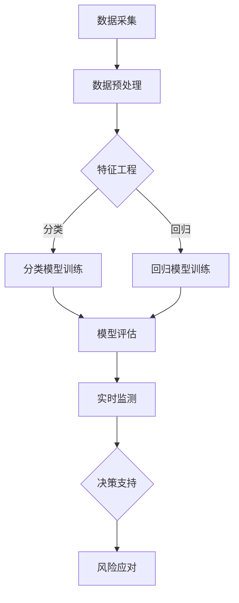

                 


### 文章标题: 《思维链在智能风险管理中的应用》

> 关键词：思维链、智能风险管理、风险评估、风险监测、算法原理、数学模型、系统架构、项目实战

> 摘要：本文旨在深入探讨思维链在智能风险管理中的应用。通过分析风险管理的发展历程、挑战与解决方案，我们引入思维链的概念，阐述其在风险管理中的独特优势。本文将逐步解析思维链在风险评估和风险监测中的具体应用，结合实际案例，展示其优越性。最后，我们将分享项目实战经验，并提供最佳实践建议，以期为智能风险管理领域的研究和实践提供有益参考。

### 目录大纲

#### 第一部分: 智能风险管理的背景与核心概念

##### 第1章: 智能风险管理的背景介绍

1.1 问题背景

- 风险管理的必要性

- 风险管理的发展历程

- 传统风险管理的局限性

1.2 问题描述

- 智能风险管理的定义

- 智能风险管理的重要性

- 智能风险管理的挑战

1.3 问题解决

- 智能风险管理的技术基础

- 智能风险管理的关键技术

- 智能风险管理的解决方案

1.4 边界与外延

- 风险管理与其他领域的交叉

- 风险管理在行业中的应用

- 智能风险管理的前景

1.5 概念结构与核心要素组成

- 风险管理的概念结构

- 智能风险管理的核心要素

- 智能风险管理的基本流程

1.6 本章小结

##### 第2章: 思维链的基本概念与特性

2.1 思维链的定义

- 思维链的概念

- 思维链的核心特点

- 思维链与传统思维模型的区别

2.2 思维链的特性

- 灵活性与适应性

- 系统性与全局观

- 创新性与前瞻性

2.3 思维链在风险管理中的应用

- 思维链在风险评估中的应用

- 思维链在风险监测中的应用

- 思维链在风险决策中的应用

2.4 思维链与传统风险管理方法的比较

- 传统风险管理方法的局限

- 思维链的优势

- 思维链与传统方法的互补性

2.5 本章小结

##### 第3章: 思维链在风险评估中的应用

3.1 风险评估概述

- 风险评估的定义

- 风险评估的重要性

- 风险评估的基本流程

3.2 思维链在风险评估中的应用

- 思维链在风险识别中的应用

- 思维链在风险分析中的应用

- 思维链在风险评价中的应用

3.3 实例分析

- 某企业风险评估案例

- 风险评估结果的解读与应用

- 风险评估的改进建议

3.4 本章小结

##### 第4章: 思维链在风险监测中的应用

4.1 风险监测概述

- 风险监测的定义

- 风险监测的重要性

- 风险监测的基本方法

4.2 思维链在风险监测中的应用

- 思维链在实时风险监测中的应用

- 思维链在历史风险监测中的应用

- 思维链在异常风险监测中的应用

4.3 实例分析

- 某金控公司风险监测案例

- 风险监测的数据分析与处理

- 风险监测的策略与优化

4.4 本章小结

#### 第二部分: 思维链在智能风险管理中的应用

##### 第5章: 思维链在智能风险管理中的实践应用

5.1 项目背景

- 项目概述

- 项目目标

- 项目实现环境

5.2 系统架构设计

- 系统功能设计

- 系统架构设计

- 系统接口设计

5.3 系统核心实现

- 数据采集与处理

- 风险评估与监测

- 决策支持

5.4 代码应用解读与分析

- Python源代码讲解

- 思维链算法实现

- 数学模型与应用

5.5 实际案例分析与讲解

- 案例背景

- 案例分析

- 案例结论

5.6 项目小结

##### 第6章: 最佳实践与总结

6.1 最佳实践 tips

- 思维链应用的关键要点

- 风险管理的最佳实践

- 技术选型的建议

6.2 小结

- 文章核心观点总结

- 研究与未来展望

6.3 注意事项

- 实施过程中可能遇到的问题

- 解决方案与建议

6.4 拓展阅读

- 相关研究论文

- 技术博客与资源推荐

### 第二部分：智能风险管理的背景与核心概念

#### 第1章：智能风险管理的背景介绍

##### 1.1 问题背景

风险管理是企业运营过程中至关重要的一环。随着全球化进程的加快和信息技术的迅猛发展，企业面临的风险类型和复杂度不断增加。传统的风险管理方法主要依赖于经验和直觉，往往无法有效地应对复杂、多变的风险环境。为此，智能风险管理应运而生，它结合了人工智能、大数据分析等技术手段，以提高风险管理的效率和准确性。

###### 1.1.1 风险管理的必要性

风险管理是企业确保业务稳健发展的关键。有效的风险管理可以帮助企业：

- 识别潜在风险
- 评估风险的影响程度
- 制定应对策略
- 提高业务连续性

在当前复杂多变的经济环境下，企业面临的风险类型多种多样，包括市场风险、信用风险、操作风险、法律风险等。这些风险不仅影响企业的财务状况，还可能威胁到企业的生存。因此，加强风险管理显得尤为重要。

###### 1.1.2 风险管理的发展历程

风险管理的发展历程可以追溯到20世纪50年代。当时，企业主要依靠财务报表和内部控制来管理风险。随着信息技术的发展，风险管理的工具和方法逐渐丰富。20世纪80年代，风险矩阵和风险评估方法开始广泛应用。进入21世纪，随着大数据和人工智能技术的兴起，智能风险管理成为风险管理的新趋势。

传统风险管理方法主要依赖于定性分析和人工判断，存在以下局限性：

- 数据来源有限，难以全面反映风险状况
- 分析方法单一，无法处理复杂的多维度风险
- 风险评估结果依赖于专家经验，缺乏客观性

智能风险管理通过引入人工智能和大数据分析技术，能够克服传统风险管理的局限性，实现以下目标：

- 实时监测和预测风险
- 提高风险评估的准确性和效率
- 自动化决策支持，减少人为错误

###### 1.1.3 智能风险管理的重要性

智能风险管理在企业运营中的重要性体现在以下几个方面：

- 提高风险识别的准确性：智能风险管理能够利用大数据分析技术，从海量的数据中提取有价值的信息，从而提高风险识别的准确性。
- 优化风险评估过程：智能风险管理可以通过自动化算法，快速计算风险评估指标，减少人工干预，提高评估效率。
- 改进决策支持系统：智能风险管理可以为决策者提供实时、准确的风险信息，帮助其做出更加明智的决策。
- 提升企业竞争力：通过有效的风险管理，企业可以降低风险损失，提高业务稳定性，从而在竞争激烈的市场中占据优势地位。

##### 1.2 问题描述

智能风险管理是利用先进的人工智能和大数据分析技术，对企业的风险进行识别、评估、监测和决策支持。尽管智能风险管理具有诸多优势，但在实际应用中仍然面临一系列挑战。

###### 1.2.1 智能风险管理的定义

智能风险管理是指通过运用人工智能、机器学习、大数据分析等先进技术，对企业的各类风险进行全面的识别、评估、监测和决策支持的过程。它涵盖了从风险数据收集、数据预处理、特征提取、风险评估到风险决策等一系列环节。

###### 1.2.2 智能风险管理的重要性

智能风险管理的重要性体现在以下几个方面：

- 提高风险识别的精度和速度：智能风险管理可以通过大数据分析和机器学习算法，从海量数据中快速识别潜在风险，提高风险识别的效率和准确性。
- 优化风险评估模型：智能风险管理可以结合历史数据和实时数据，构建更加精确的风险评估模型，提高风险评估的准确性。
- 实时监测风险状况：智能风险管理可以通过实时数据监测，及时发现风险变化，为决策者提供实时信息支持。
- 自动化风险决策：智能风险管理可以自动化处理风险评估和决策过程，减少人工干预，提高决策效率。

###### 1.2.3 智能风险管理的挑战

尽管智能风险管理具有诸多优势，但在实际应用中仍面临以下挑战：

- 数据质量和完整性：智能风险管理依赖于高质量的数据，但数据来源多样，数据质量参差不齐，可能会影响风险评估的准确性。
- 算法选择和优化：智能风险管理涉及多种算法和模型，选择合适的算法并对其进行优化是提高风险评估准确性的关键。
- 技术实施和集成：智能风险管理需要将先进技术集成到现有的业务系统中，实现与业务流程的深度融合，这对技术和实施团队提出了较高的要求。
- 风险管理人才缺乏：智能风险管理需要具备大数据分析、人工智能等专业知识的人才，但目前此类人才相对匮乏，对企业的风险管理能力提出了挑战。

##### 1.3 问题解决

智能风险管理通过引入先进的人工智能和大数据分析技术，可以克服传统风险管理的局限性，应对复杂多变的风险环境。以下是从技术和管理角度提出的问题解决方案：

###### 1.3.1 智能风险管理的技术基础

智能风险管理的技术基础主要包括以下几方面：

- 大数据技术：通过大数据技术，企业可以收集、存储、处理和分析海量数据，为风险识别、评估和监测提供数据支持。
- 人工智能技术：人工智能技术，尤其是机器学习和深度学习算法，可以用于构建智能风险评估模型，提高风险评估的准确性和效率。
- 数据挖掘技术：数据挖掘技术可以从海量数据中提取有价值的信息，用于风险识别、评估和预测。
- 实时数据处理技术：实时数据处理技术可以实现对企业风险状况的实时监测和预警，为决策者提供及时的风险信息。

###### 1.3.2 智能风险管理的关键技术

智能风险管理的关键技术包括：

- 风险识别技术：通过大数据分析和机器学习算法，可以从海量数据中识别潜在的风险因素，提高风险识别的精度和速度。
- 风险评估技术：利用历史数据和实时数据，构建风险评估模型，对风险因素进行量化评估，提高风险评估的准确性和效率。
- 风险监测技术：通过实时数据处理技术，对企业风险状况进行实时监测，及时发现风险变化，为决策者提供及时的风险信息。
- 风险决策技术：利用智能算法和决策支持系统，自动化处理风险评估和决策过程，减少人工干预，提高决策效率。

###### 1.3.3 智能风险管理的解决方案

智能风险管理的解决方案可以从以下几个方面进行：

- 建立智能风险管理平台：搭建一个集风险识别、评估、监测和决策支持于一体的智能风险管理平台，实现风险管理的自动化和智能化。
- 整合内外部数据资源：整合企业内部业务数据、外部市场数据和行业数据，建立全面的数据资源库，为风险管理和决策提供数据支持。
- 构建智能风险评估模型：结合历史数据和实时数据，构建多维度、多层次的智能风险评估模型，提高风险评估的准确性和效率。
- 实施实时风险监测与预警：利用实时数据处理技术，对企业风险状况进行实时监测和预警，提高风险识别和应对的效率。
- 培养智能风险管理团队：加强人才培养，培养具备大数据分析、人工智能等专业知识的人才，提高企业智能风险管理能力。

##### 1.4 边界与外延

智能风险管理作为一项新兴技术，其应用范围广泛，涉及多个领域。以下从边界与外延的角度，探讨智能风险管理的相关概念和应用。

###### 1.4.1 风险管理与其他领域的交叉

智能风险管理涉及多个学科和技术领域，如计算机科学、统计学、金融学等。它在以下几个方面与其他领域产生交叉：

- 数据科学：智能风险管理需要运用数据科学的方法和技术，从海量数据中提取有价值的信息，为风险管理和决策提供支持。
- 金融工程：智能风险管理在金融领域应用广泛，如信用风险管理、市场风险管理等，金融工程的理论和方法对智能风险管理具有重要参考价值。
- 人工智能：智能风险管理依赖人工智能技术，如机器学习、深度学习等，人工智能的发展对智能风险管理起到了重要的推动作用。

###### 1.4.2 风险管理在行业中的应用

智能风险管理在不同行业中的应用有所不同，但其核心原理和方法具有一定的共性。以下从几个典型行业探讨智能风险管理的应用：

- 金融行业：智能风险管理在金融行业中应用广泛，如银行、证券、保险等。通过智能风险管理，金融机构可以更好地识别、评估和应对风险，提高业务稳健性。
- 电信行业：电信行业面临的市场竞争激烈，风险类型多样。智能风险管理可以帮助电信企业实时监测市场变化，快速识别潜在风险，制定应对策略。
- 制造业：制造业面临的市场风险和运营风险较大，智能风险管理可以帮助企业优化生产流程，降低成本，提高生产效率。
- 互联网行业：互联网行业快速发展，风险因素复杂。智能风险管理可以帮助互联网企业实时监测用户行为，识别潜在风险，提高用户体验。

###### 1.4.3 智能风险管理的前景

随着大数据、人工智能等技术的不断进步，智能风险管理在未来的发展前景广阔。以下从几个方面展望智能风险管理的发展趋势：

- 技术融合与创新：智能风险管理将与其他前沿技术如区块链、物联网等相结合，实现更高效、更智能的风险管理和决策支持。
- 个性化风险管理：智能风险管理可以根据企业的业务特点和风险偏好，提供个性化的风险管理方案，提高风险管理的效果。
- 智能决策支持：随着人工智能技术的发展，智能风险管理将实现更智能的决策支持，帮助企业快速应对风险，降低风险损失。
- 风险管理全球化：随着全球化进程的加快，智能风险管理将在国际范围内得到更广泛的应用，为企业提供全球化的风险管理服务。

##### 1.5 概念结构与核心要素组成

智能风险管理是一个复杂的过程，涉及多个环节和要素。以下从概念结构和核心要素的角度，分析智能风险管理的组成和运行机制。

###### 1.5.1 风险管理的概念结构

风险管理的概念结构包括以下几个关键环节：

- 风险识别：识别企业面临的各类风险，包括市场风险、信用风险、操作风险等。
- 风险评估：评估各类风险的影响程度和发生的可能性，为风险管理提供依据。
- 风险监测：实时监测企业风险状况，及时发现风险变化，为决策者提供实时信息支持。
- 风险应对：根据风险评估结果和风险监测信息，制定和实施风险应对策略，降低风险损失。
- 风险决策：基于风险评估和风险监测结果，对企业风险进行决策，优化风险管理策略。

###### 1.5.2 智能风险管理的核心要素

智能风险管理的核心要素包括以下几个方面：

- 数据资源：智能风险管理依赖于高质量的数据资源，包括企业内部业务数据、外部市场数据、行业数据等。
- 人工智能技术：智能风险管理利用人工智能技术，如机器学习、深度学习等，构建智能风险评估模型，提高风险评估的准确性和效率。
- 风险评估模型：智能风险评估模型是智能风险管理的核心，通过结合历史数据和实时数据，对风险因素进行量化评估，提高风险评估的准确性。
- 实时监测系统：实时监测系统可以实现对企业风险状况的实时监测和预警，为决策者提供及时的风险信息支持。
- 决策支持系统：决策支持系统可以帮助企业快速应对风险，制定和实施风险应对策略，优化风险管理。

###### 1.5.3 智能风险管理的基本流程

智能风险管理的基本流程包括以下几个环节：

1. 数据采集与预处理：收集企业内部和外部数据，进行数据清洗、转换和集成，为风险评估提供高质量的数据基础。
2. 风险识别：利用大数据分析和机器学习算法，从海量数据中识别潜在的风险因素，建立风险库。
3. 风险评估：结合历史数据和实时数据，构建智能风险评估模型，对风险因素进行量化评估，生成风险评估报告。
4. 风险监测：利用实时数据处理技术，对企业风险状况进行实时监测，及时发现风险变化，生成风险预警报告。
5. 风险决策：基于风险评估和风险监测结果，制定和实施风险应对策略，优化风险管理。

##### 1.6 本章小结

本章从问题背景、问题描述、问题解决、边界与外延以及概念结构与核心要素组成等方面，系统地介绍了智能风险管理的背景和核心概念。通过分析风险管理的发展历程和挑战，我们提出了智能风险管理的技术基础和关键技术，并探讨了其在行业中的应用前景。同时，我们明确了智能风险管理的概念结构和核心要素，阐述了其基本流程。这些内容为后续章节深入探讨思维链在智能风险管理中的应用奠定了基础。

#### 第2章：思维链的基本概念与特性

##### 2.1 思维链的定义

思维链是一种基于人工智能和大数据分析的智能思维工具，旨在帮助用户进行高效、系统、全面的分析和决策。它通过构建复杂的知识网络，模拟人类思维的运作方式，实现对大量信息的处理和挖掘，提供有力的决策支持。

###### 2.1.1 思维链的概念

思维链是一种基于人工智能和大数据分析的智能思维工具，旨在帮助用户进行高效、系统、全面的分析和决策。它通过构建复杂的知识网络，模拟人类思维的运作方式，实现对大量信息的处理和挖掘，提供有力的决策支持。

思维链的核心特点包括：

- 系统性：思维链通过建立复杂的知识网络，将各类信息进行有机整合，形成系统化的分析框架。
- 实时性：思维链能够实时处理和分析大量数据，快速生成分析报告和决策建议。
- 灵活性：思维链可以根据用户需求进行自定义，适应不同场景和问题的分析需求。
- 智能化：思维链结合人工智能技术，利用机器学习、深度学习等方法，自动优化分析过程和结果。

###### 2.1.2 思维链的核心特点

思维链具有以下几个核心特点：

- 系统性：思维链通过构建知识网络，将各类信息进行有机整合，形成系统化的分析框架，帮助用户从全局角度进行思考和决策。
- 实时性：思维链能够实时处理和分析大量数据，快速生成分析报告和决策建议，为用户提供及时的信息支持。
- 灵活性：思维链可以根据用户需求进行自定义，适应不同场景和问题的分析需求，提高分析效率和准确性。
- 智能化：思维链结合人工智能技术，利用机器学习、深度学习等方法，自动优化分析过程和结果，提高分析的智能程度。

###### 2.1.3 思维链与传统思维模型的区别

思维链与传统思维模型相比，具有以下几个显著区别：

- 传统思维模型主要依赖于人类经验和直觉，而思维链通过大数据分析和人工智能技术，实现了对大量信息的处理和挖掘，提高了分析效率和准确性。
- 传统思维模型往往具有局限性，难以应对复杂多变的问题，而思维链通过构建复杂的知识网络，实现了系统化、全面化的分析，能够更好地应对复杂问题。
- 传统思维模型分析结果往往依赖于专家经验和主观判断，而思维链通过自动化的分析过程，减少了人为干预，提高了分析结果的客观性和可靠性。
- 传统思维模型分析过程往往耗时较长，而思维链能够实时处理和分析大量数据，快速生成分析报告和决策建议，提高了分析效率。

##### 2.2 思维链的特性

思维链具有以下几个特性，使其在智能风险管理中表现出独特的优势：

- 灵活性与适应性：思维链可以根据用户需求进行自定义，适应不同场景和问题的分析需求，提高分析效率和准确性。
- 系统性与全局观：思维链通过构建复杂的知识网络，将各类信息进行有机整合，形成系统化的分析框架，帮助用户从全局角度进行思考和决策。
- 创新性与前瞻性：思维链结合人工智能技术，利用机器学习、深度学习等方法，自动优化分析过程和结果，能够发现潜在趋势和风险，为用户提前做好准备。

###### 2.2.1 灵活性与适应性

思维链的灵活性表现在以下几个方面：

- 自定义分析流程：用户可以根据实际需求，自定义思维链的分析流程，包括数据采集、预处理、特征提取、模型构建等环节。
- 自适应模型调整：思维链可以自动调整分析模型，以适应不同场景和问题的分析需求，提高分析结果的准确性和可靠性。
- 多样化的分析工具：思维链提供了丰富的分析工具，如数据可视化、关联分析、预测模型等，用户可以根据实际需求选择合适的工具。

###### 2.2.2 系统性与全局观

思维链的系统性和全局观体现在以下几个方面：

- 知识网络构建：思维链通过构建复杂的知识网络，将各类信息进行有机整合，形成系统化的分析框架，帮助用户从全局角度进行思考和决策。
- 数据整合与融合：思维链能够整合来自不同渠道的数据，包括结构化数据、非结构化数据等，实现数据的深度融合，提高分析的整体效果。
- 多维度分析：思维链可以从多个维度对数据进行分析，如时间维度、空间维度、层次维度等，帮助用户全面了解问题的各个方面。

###### 2.2.3 创新性与前瞻性

思维链的创新性和前瞻性体现在以下几个方面：

- 智能算法优化：思维链结合人工智能技术，利用机器学习、深度学习等方法，自动优化分析过程和结果，提高分析的智能程度。
- 潜在趋势发现：思维链可以通过对历史数据和实时数据的分析，发现潜在的趋势和风险，为用户提前做好准备。
- 预测与分析：思维链可以利用预测模型，对未来的风险状况进行预测，帮助用户制定合理的应对策略。

##### 2.3 思维链在风险管理中的应用

思维链在智能风险管理中具有广泛的应用，主要体现在以下三个方面：

- 风险评估：思维链可以通过对历史数据和实时数据的分析，评估各类风险的影响程度和发生的可能性，为决策者提供准确的风险评估报告。
- 风险监测：思维链可以实时监测企业风险状况，及时发现风险变化，生成风险预警报告，帮助决策者及时应对风险。
- 决策支持：思维链可以结合风险评估和风险监测结果，为决策者提供智能化的决策建议，优化风险管理策略。

###### 2.3.1 思维链在风险评估中的应用

思维链在风险评估中的应用主要包括以下几个方面：

- 风险识别：思维链可以通过对历史数据和实时数据的分析，识别出潜在的风险因素，为风险评估提供基础。
- 风险评估：思维链结合人工智能算法，对识别出的风险因素进行量化评估，生成风险评估报告，为决策者提供参考。
- 风险评级：思维链可以根据评估结果，对风险进行评级，区分高风险、中风险和低风险，帮助决策者制定相应的应对策略。

###### 2.3.2 思维链在风险监测中的应用

思维链在风险监测中的应用主要包括以下几个方面：

- 实时监测：思维链可以实时监测企业风险状况，通过数据采集和分析，及时发现风险变化，生成风险预警报告。
- 异常检测：思维链可以利用机器学习算法，对正常风险状况进行建模，当实际风险状况偏离正常范围时，自动识别出异常情况，生成异常报告。
- 风险趋势分析：思维链可以分析风险数据的历史变化趋势，预测未来的风险状况，为决策者提供前瞻性的风险信息。

###### 2.3.3 思维链在风险决策中的应用

思维链在风险决策中的应用主要包括以下几个方面：

- 决策支持：思维链可以结合风险评估和风险监测结果，为决策者提供智能化的决策建议，优化风险管理策略。
- 策略优化：思维链可以通过模拟不同决策方案的结果，评估其优缺点，帮助决策者选择最优策略。
- 决策评估：思维链可以对决策实施后的效果进行评估，为后续决策提供反馈，实现决策的持续优化。

##### 2.4 思维链与传统风险管理方法的比较

思维链与传统风险管理方法在多个方面存在显著差异，以下从几个方面进行比较：

###### 2.4.1 传统风险管理方法的局限

传统风险管理方法主要依赖于人类经验和直觉，存在以下局限性：

- 数据来源有限：传统风险管理方法主要依赖内部业务数据和行业经验，数据来源相对有限，难以全面反映风险状况。
- 分析方法单一：传统风险管理方法通常采用定性分析方法，如专家评估、风险矩阵等，缺乏对风险的定量分析。
- 实时性不足：传统风险管理方法通常需要较长时间进行风险评估和决策，难以实现实时监测和预警。

###### 2.4.2 思维链的优势

思维链在智能风险管理中具有以下优势：

- 数据处理能力：思维链能够处理海量数据，从多维度、多层面进行分析，提高风险评估的准确性和效率。
- 自动化分析：思维链结合人工智能技术，实现自动化的风险评估和监测，减少人工干预，提高决策效率。
- 实时性：思维链可以实时处理和分析数据，实现实时风险监测和预警，为决策者提供及时的风险信息支持。

###### 2.4.3 思维链与传统方法的互补性

思维链与传统风险管理方法在互补性方面具有以下特点：

- 传统方法的基础作用：传统风险管理方法在经验积累、风险识别等方面具有优势，可以为思维链提供重要的基础数据。
- 思维链的智能化补充：思维链在数据处理、自动化分析和实时性方面具有优势，可以为传统风险管理方法提供智能化、自动化的支持。

##### 2.5 本章小结

本章介绍了思维链的基本概念和特性，阐述了其在智能风险管理中的应用。通过分析思维链的灵活性与适应性、系统性与全局观以及创新性与前瞻性，我们展示了思维链在风险评估、风险监测和风险决策中的优势。同时，本章还比较了思维链与传统风险管理方法的差异和互补性，为后续章节深入探讨思维链在智能风险管理中的应用提供了理论基础。

#### 第3章：思维链在风险评估中的应用

##### 3.1 风险评估概述

风险评估是智能风险管理中的关键环节，旨在识别、评估和应对企业面临的各类风险。通过有效的风险评估，企业可以提前发现潜在风险，制定相应的应对策略，降低风险损失，保障业务稳健发展。

###### 3.1.1 风险评估的定义

风险评估是指对企业面临的各类风险进行识别、评估和应对的过程。其核心目的是通过科学的方法和手段，对风险的影响程度和发生的可能性进行量化分析，为企业决策提供有力支持。

###### 3.1.2 风险评估的重要性

风险评估在企业运营中的重要性体现在以下几个方面：

- 识别潜在风险：风险评估可以帮助企业识别潜在的风险因素，提前发现潜在问题，避免风险事件的发生。
- 量化风险影响：通过风险评估，企业可以量化各类风险的影响程度，为决策者提供客观的依据。
- 制定应对策略：风险评估结果可以为企业制定应对策略提供重要参考，帮助企业降低风险损失，保障业务稳健发展。
- 提高风险管理效率：通过建立科学、系统的风险评估体系，企业可以优化风险管理流程，提高风险管理效率。

###### 3.1.3 风险评估的基本流程

风险评估的基本流程包括以下几个环节：

1. 风险识别：识别企业面临的各类风险，包括市场风险、信用风险、操作风险等。
2. 风险分析：对识别出的风险因素进行详细分析，评估其影响程度和发生的可能性。
3. 风险评价：根据风险分析结果，对风险进行量化评价，确定风险等级。
4. 风险应对：根据风险评估结果，制定和实施风险应对策略，降低风险损失。
5. 风险监控：对风险应对措施的实施情况进行监控，及时调整和优化风险管理策略。

##### 3.2 思维链在风险评估中的应用

思维链在风险评估中具有独特的优势，能够显著提高评估的准确性和效率。以下将从风险识别、风险分析和风险评价三个方面，详细介绍思维链在风险评估中的应用。

###### 3.2.1 思维链在风险识别中的应用

思维链在风险识别中的应用主要体现在以下几个方面：

- 数据驱动：思维链通过大数据分析和机器学习算法，可以从海量数据中提取有价值的信息，识别出潜在的风险因素。与传统的风险识别方法相比，思维链能够更全面、更准确地识别风险。
- 深度学习：思维链利用深度学习算法，可以从历史数据中学习到风险模式，自动识别出新的风险因素。这种自动化的风险识别方法，能够提高风险识别的效率，减少人工干预。
- 知识图谱：思维链通过构建知识图谱，将各类信息进行有机整合，形成系统化的分析框架。这种知识网络结构，有助于从全局角度进行风险识别，提高风险识别的全面性和系统性。

###### 3.2.2 思维链在风险分析中的应用

思维链在风险分析中的应用主要包括以下几个方面：

- 数据挖掘：思维链通过数据挖掘技术，可以从大量历史数据中提取有价值的信息，分析各类风险因素之间的关联关系，为风险分析提供有力支持。
- 精确预测：思维链结合人工智能技术，利用机器学习算法，可以对风险因素的未来变化趋势进行预测，为风险分析提供前瞻性信息。
- 多维度分析：思维链可以从多个维度对风险因素进行分析，如时间维度、空间维度、层次维度等。这种多维度分析方法，有助于深入挖掘风险因素的本质，提高风险分析的准确性。

###### 3.2.3 思维链在风险评价中的应用

思维链在风险评价中的应用主要体现在以下几个方面：

- 量化评估：思维链通过结合历史数据和实时数据，构建智能评估模型，对风险因素进行量化评估，生成风险评估报告。这种量化评估方法，能够提高评估的准确性和客观性。
- 实时更新：思维链可以实时更新评估模型，结合最新的数据和风险变化，动态调整风险评估结果。这种实时性评估方法，有助于提高风险评估的时效性。
- 多层次评价：思维链可以从多层次对风险进行评价，如个体风险评价、组合风险评价等。这种多层次评价方法，有助于全面了解风险状况，为决策者提供全面的风险信息。

##### 3.3 实例分析

为了更好地展示思维链在风险评估中的应用，以下通过一个具体案例进行详细分析。

###### 3.3.1 某企业风险评估案例

某企业是一家从事制造业的企业，面临的市场风险和操作风险较为复杂。为了确保业务稳健发展，该企业引入了思维链进行风险评估。

1. 风险识别

- 数据采集：该企业通过大数据技术，收集了内部业务数据、市场数据、行业数据等，为风险识别提供数据支持。
- 风险识别：思维链通过数据分析和机器学习算法，从海量数据中识别出潜在的风险因素，如市场波动、原材料价格波动、供应链风险等。

2. 风险分析

- 数据挖掘：思维链通过数据挖掘技术，分析了历史数据，挖掘出各类风险因素之间的关联关系，如市场波动与原材料价格波动之间的相关性。
- 精确预测：思维链结合人工智能技术，对风险因素的未来变化趋势进行预测，为风险分析提供前瞻性信息。

3. 风险评价

- 量化评估：思维链结合历史数据和实时数据，构建了智能评估模型，对识别出的风险因素进行量化评估，生成风险评估报告。
- 实时更新：思维链实时更新评估模型，结合最新的数据和风险变化，动态调整风险评估结果。

4. 风险应对

- 风险应对策略：根据风险评估结果，该企业制定了相应的风险应对策略，如调整供应链策略、优化生产流程等。
- 风险监控：思维链对企业风险状况进行实时监控，及时调整风险应对策略。

###### 3.3.2 风险评估结果的解读与应用

通过对该企业的风险评估结果进行分析，可以得出以下结论：

- 高风险因素：市场波动、原材料价格波动等是高风险因素，需要重点关注和应对。
- 中风险因素：供应链风险、生产流程风险等是中风险因素，需要适当关注和调整。
- 低风险因素：其他风险因素，如政策风险、人力资源风险等，是低风险因素，可以适当关注。

根据风险评估结果，该企业采取了以下应对措施：

- 调整供应链策略：加强与供应商的合作，降低原材料价格波动对生产成本的影响。
- 优化生产流程：通过自动化和智能化技术，提高生产效率，降低操作风险。
- 实时监控风险：利用思维链实时监控企业风险状况，及时调整风险应对策略。

##### 3.3.3 风险评估的改进建议

基于思维链在风险评估中的应用，以下提出一些建议，以进一步提升风险评估的效果：

- 数据质量提升：提高数据质量，确保数据的准确性和完整性，为风险评估提供可靠的数据基础。
- 模型优化与迭代：结合实际需求，不断优化和迭代风险评估模型，提高评估的准确性和可靠性。
- 多维度分析：从多个维度对风险因素进行分析，如时间维度、空间维度、层次维度等，提高风险分析的全面性和深度。
- 风险管理培训：加强风险管理培训，提高员工的风险意识和管理能力，为企业风险管理提供人才支持。

##### 3.4 本章小结

本章介绍了思维链在风险评估中的应用，包括风险识别、风险分析和风险评价三个方面。通过一个具体案例的分析，展示了思维链在风险评估中的优势和应用效果。同时，提出了一些改进建议，以进一步提升风险评估的效果。思维链在智能风险管理中的广泛应用，有助于企业提高风险管理的准确性和效率，保障业务稳健发展。

#### 第4章：思维链在风险监测中的应用

##### 4.1 风险监测概述

风险监测是智能风险管理中的关键环节，旨在实时监测企业风险状况，及时发现风险变化，为企业决策提供实时信息支持。有效的风险监测可以帮助企业快速应对风险，降低风险损失，保障业务稳健发展。

###### 4.1.1 风险监测的定义

风险监测是指通过实时数据采集、分析和处理，对企业风险状况进行持续监控和预警的过程。其核心目的是及时发现风险变化，为决策者提供实时信息支持，帮助企业制定和调整应对策略。

###### 4.1.2 风险监测的重要性

风险监测在智能风险管理中的重要性体现在以下几个方面：

- 及时发现风险：风险监测可以实时监测企业风险状况，及时发现潜在的风险，为决策者提供预警信息，避免风险事件的发生。
- 优化决策支持：风险监测可以为决策者提供实时、准确的风险信息，帮助其及时调整决策，降低风险损失。
- 提高风险响应速度：风险监测可以实时发现风险变化，提高企业对风险的响应速度，减少风险事件对企业的影响。
- 保障业务稳健发展：通过有效的风险监测，企业可以提前发现潜在风险，制定相应的应对策略，保障业务稳健发展。

###### 4.1.3 风险监测的基本方法

风险监测的基本方法包括以下几个方面：

- 数据采集：通过数据采集技术，实时收集企业内部和外部数据，包括业务数据、市场数据、行业数据等。
- 数据预处理：对采集到的数据进行清洗、转换和整合，确保数据的准确性和完整性。
- 数据分析：利用数据挖掘和机器学习技术，对预处理后的数据进行深入分析，识别出潜在的风险因素。
- 风险预警：根据分析结果，实时生成风险预警报告，为决策者提供预警信息，帮助其制定应对策略。
- 风险应对：根据风险预警信息，企业可以采取相应的应对措施，降低风险损失。

##### 4.2 思维链在风险监测中的应用

思维链在风险监测中具有独特的优势，能够实时监测企业风险状况，及时发现风险变化。以下将从实时风险监测、历史风险监测和异常风险监测三个方面，详细介绍思维链在风险监测中的应用。

###### 4.2.1 思维链在实时风险监测中的应用

思维链在实时风险监测中的应用主要包括以下几个方面：

- 实时数据采集：思维链可以实时采集企业内部和外部数据，包括业务数据、市场数据、行业数据等，为风险监测提供数据支持。
- 实时数据分析：思维链结合人工智能技术，对实时数据进行实时分析，识别出潜在的风险因素，生成实时风险预警报告。
- 实时风险响应：思维链可以实时生成风险预警报告，为决策者提供实时信息支持，帮助企业及时调整决策，降低风险损失。

###### 4.2.2 思维链在历史风险监测中的应用

思维链在历史风险监测中的应用主要包括以下几个方面：

- 历史数据挖掘：思维链可以从历史数据中提取有价值的信息，分析历史风险因素的变化趋势，为风险监测提供参考。
- 历史风险分析：思维链利用机器学习算法，对历史风险数据进行分析，识别出潜在的风险模式，为实时风险监测提供预警依据。
- 历史风险评价：思维链结合历史数据和实时数据，对历史风险因素进行评价，确定风险等级，为决策者提供历史风险信息支持。

###### 4.2.3 思维链在异常风险监测中的应用

思维链在异常风险监测中的应用主要包括以下几个方面：

- 异常检测：思维链可以利用机器学习算法，对正常风险状况进行建模，当实际风险状况偏离正常范围时，自动识别出异常情况，生成异常报告。
- 异常分析：思维链可以对识别出的异常风险因素进行深入分析，确定异常原因，为决策者提供异常风险信息支持。
- 异常应对：思维链可以实时生成异常风险预警报告，为决策者提供实时信息支持，帮助企业制定和实施异常风险应对策略。

##### 4.3 实例分析

为了更好地展示思维链在风险监测中的应用，以下通过一个具体案例进行详细分析。

###### 4.3.1 某金控公司风险监测案例

某金控公司是一家从事金融业务的企业，面临的市场风险和操作风险较为复杂。为了确保业务稳健发展，该金控公司引入了思维链进行风险监测。

1. 实时数据采集

- 数据来源：该金控公司通过数据采集技术，实时采集了内部业务数据、市场数据、行业数据等，为风险监测提供数据支持。
- 数据预处理：对采集到的数据进行清洗、转换和整合，确保数据的准确性和完整性。

2. 实时数据分析

- 数据分析：思维链结合人工智能技术，对实时数据进行实时分析，识别出潜在的风险因素，生成实时风险预警报告。
- 实时风险预警：思维链实时生成风险预警报告，为决策者提供实时信息支持。

3. 历史数据挖掘

- 历史数据挖掘：思维链可以从历史数据中提取有价值的信息，分析历史风险因素的变化趋势，为风险监测提供参考。
- 历史风险分析：思维链利用机器学习算法，对历史风险数据进行分析，识别出潜在的风险模式，为实时风险监测提供预警依据。

4. 异常风险检测

- 异常检测：思维链利用机器学习算法，对正常风险状况进行建模，当实际风险状况偏离正常范围时，自动识别出异常情况，生成异常报告。
- 异常分析：思维链可以对识别出的异常风险因素进行深入分析，确定异常原因，为决策者提供异常风险信息支持。

5. 异常风险应对

- 异常风险应对：思维链可以实时生成异常风险预警报告，为决策者提供实时信息支持，帮助企业制定和实施异常风险应对策略。

###### 4.3.2 风险监测的数据分析与处理

通过对该金控公司的风险监测数据分析，可以得出以下结论：

- 高风险因素：市场波动、信用风险等是高风险因素，需要重点关注和应对。
- 中风险因素：操作风险、法律风险等是中风险因素，需要适当关注和调整。
- 低风险因素：其他风险因素，如人力资源风险等，是低风险因素，可以适当关注。

根据风险监测结果，该金控公司采取了以下应对措施：

- 调整业务策略：针对高风险因素，调整业务策略，降低市场波动对业务的影响。
- 加强内部控制：针对中风险因素，加强内部控制，降低操作风险和法律风险。
- 培训员工：针对低风险因素，加强员工培训，提高员工的风险意识和管理能力。

##### 4.3.3 风险监测的策略与优化

为了进一步提升风险监测的效果，以下提出一些建议：

- 数据质量提升：提高数据质量，确保数据的准确性和完整性，为风险监测提供可靠的数据基础。
- 模型优化与迭代：结合实际需求，不断优化和迭代风险监测模型，提高监测的准确性和可靠性。
- 多维度监测：从多个维度对风险进行监测，如时间维度、空间维度、层次维度等，提高监测的全面性和深度。
- 风险管理培训：加强风险管理培训，提高员工的风险意识和管理能力，为企业风险管理提供人才支持。

##### 4.4 本章小结

本章介绍了思维链在风险监测中的应用，包括实时风险监测、历史风险监测和异常风险监测三个方面。通过一个具体案例的分析，展示了思维链在风险监测中的优势和应用效果。同时，提出了一些优化策略，以进一步提升风险监测的效果。思维链在智能风险管理中的广泛应用，有助于企业提高风险监测的准确性和效率，保障业务稳健发展。

#### 第5章：思维链在智能风险管理中的实践应用

##### 5.1 项目背景

智能风险管理作为现代企业风险管理的重要手段，已经在金融、电信、制造业等多个行业得到广泛应用。为了提升企业的风险管理能力，本文将介绍一个具体的智能风险管理项目，旨在通过引入思维链技术，实现对企业风险的实时监测和智能化管理。

###### 5.1.1 项目概述

本项目旨在搭建一个智能风险管理平台，利用思维链技术对企业风险进行识别、评估、监测和决策支持。平台将整合企业内部数据、市场数据、行业数据等多维度数据，通过实时数据分析和智能算法，实现风险的全面监测和精准评估。

###### 5.1.2 项目目标

本项目的目标包括：

- 提高风险识别的准确性：通过大数据分析和人工智能算法，提升对企业风险因素的识别能力。
- 实现实时风险监测：实时采集和处理企业数据，及时发现风险变化，为决策者提供实时信息支持。
- 优化风险评估模型：结合历史数据和实时数据，构建精准的风险评估模型，提高风险评估的准确性。
- 支持智能化决策：基于风险评估结果，提供智能化的决策支持，帮助企业制定和调整应对策略。

###### 5.1.3 项目实现环境

本项目的技术实现环境包括：

- 数据采集和处理：使用大数据技术，如Hadoop和Spark，进行数据的采集、存储和处理。
- 人工智能算法：利用机器学习算法，如随机森林、支持向量机等，进行风险识别和评估。
- 实时数据处理平台：采用Kafka和Flink等技术，实现实时数据处理和分析。
- 数据可视化工具：使用ECharts和D3.js等工具，对风险数据和评估结果进行可视化展示。

##### 5.2 系统架构设计

智能风险管理平台的系统架构设计是项目成功的关键，以下将从系统功能设计、系统架构设计和系统接口设计三个方面进行详细描述。

###### 5.2.1 系统功能设计

系统功能设计主要包括以下几个模块：

- 风险识别模块：通过大数据分析和机器学习算法，识别企业面临的各类风险因素。
- 风险评估模块：结合历史数据和实时数据，对识别出的风险因素进行量化评估，生成风险评估报告。
- 风险监测模块：实时采集和处理企业数据，对企业风险状况进行实时监测，生成风险预警报告。
- 决策支持模块：基于风险评估和风险监测结果，提供智能化的决策建议，帮助企业制定和调整应对策略。
- 数据可视化模块：通过数据可视化工具，对风险数据和评估结果进行展示，便于决策者直观了解风险状况。

###### 5.2.2 系统架构设计

系统架构设计采用分布式架构，以实现高可用性和高性能。以下是一个简化的系统架构图：

```
+----------------+      +----------------+      +----------------+
| 数据采集模块  | <---> | 数据处理模块  | <---> | 数据存储模块  |
+----------------+      +----------------+      +----------------+
        ^                   |                    |
        |                   |                    |
        |                   |                    |
+-------+   +------------+   +----------------+   +---------+
| 风险识别模块  |         | 风险评估模块  |     | 风险监测模块  |<---+
+-------+   +------------+   +----------------+   +---------+   /  
                                                                 |
                                                                 |
                                                                 |----> 决策支持模块
                                                                 |
                                                                 |
                                                                 |
+----------------+      +----------------+      +----------------+
| 数据可视化模块  |      | 系统接口模块  |      | 用户界面模块  |
+----------------+      +----------------+      +----------------+
```

系统架构的主要组成部分及其作用：

- 数据采集模块：负责从企业内部系统和外部数据源采集数据，包括业务数据、市场数据、行业数据等。
- 数据处理模块：对采集到的数据进行分析和处理，包括数据清洗、转换、聚合等。
- 数据存储模块：存储处理后的数据，包括结构化数据和非结构化数据。
- 风险识别模块：利用大数据分析和机器学习算法，识别企业面临的各类风险因素。
- 风险评估模块：结合历史数据和实时数据，对识别出的风险因素进行量化评估，生成风险评估报告。
- 风险监测模块：实时监测企业风险状况，及时发现风险变化，生成风险预警报告。
- 决策支持模块：基于风险评估和风险监测结果，提供智能化的决策建议，帮助企业制定和调整应对策略。
- 数据可视化模块：通过数据可视化工具，对风险数据和评估结果进行展示，便于决策者直观了解风险状况。
- 系统接口模块：提供与外部系统的接口，实现与其他业务系统的数据交换和集成。
- 用户界面模块：为用户提供一个友好的操作界面，便于用户查询和操作风险数据。

###### 5.2.3 系统接口设计

系统接口设计包括内部接口设计和外部接口设计两个方面：

- 内部接口设计：系统内部各个模块之间通过接口进行数据交换和协作。接口设计遵循RESTful API规范，使用HTTP协议进行数据传输，确保接口的高效性和稳定性。
- 外部接口设计：系统提供与外部系统的接口，实现与其他业务系统的数据交换和集成。外部接口包括企业内部ERP系统、CRM系统、财务系统等，通过标准的API接口进行数据交换。

##### 5.3 系统核心实现

系统核心实现是智能风险管理平台的核心部分，包括数据采集、数据处理、风险评估、风险监测和决策支持等模块。以下将分别介绍这些模块的实现细节。

###### 5.3.1 数据采集

数据采集模块负责从企业内部系统和外部数据源采集数据。具体实现如下：

- 内部数据采集：通过数据接口（如JDBC、REST API等）从企业内部ERP系统、CRM系统、财务系统等采集业务数据，包括订单、库存、销售、财务报表等。
- 外部数据采集：通过爬虫技术、API接口等方式，从外部市场数据源（如天气预报、财经新闻、行业报告等）采集市场数据。数据采集过程需要确保数据的准确性和完整性。

代码示例（Python）：

```python
import requests
import json

def fetch_external_data(url):
    response = requests.get(url)
    if response.status_code == 200:
        return json.loads(response.text)
    else:
        return None

external_data = fetch_external_data("https://api.example.com/data")
```

###### 5.3.2 数据处理

数据处理模块负责对采集到的数据进行分析和处理，包括数据清洗、转换、聚合等。具体实现如下：

- 数据清洗：对采集到的数据进行去重、填补缺失值、消除异常值等处理，确保数据的准确性和完整性。
- 数据转换：将不同数据源的数据格式进行转换，确保数据的一致性。例如，将不同格式的日期转换为统一的日期格式。
- 数据聚合：对数据进行汇总和聚合，生成多维度的数据视图，便于后续分析和评估。

代码示例（Python）：

```python
import pandas as pd

def clean_data(data):
    # 去重
    data.drop_duplicates(inplace=True)
    # 填补缺失值
    data.fillna(method='ffill', inplace=True)
    # 消除异常值
    data = data[(data['value'] > 0) & (data['value'] < 1000)]
    return data

cleaned_data = clean_data(raw_data)
```

###### 5.3.3 风险评估

风险评估模块负责对识别出的风险因素进行量化评估，生成风险评估报告。具体实现如下：

- 风险识别：利用大数据分析和机器学习算法，从数据中识别出潜在的风险因素。例如，通过聚类分析、关联规则挖掘等方法识别出高风险订单。
- 风险评估：结合历史数据和实时数据，对识别出的风险因素进行量化评估，生成风险评估报告。评估方法包括评分模型、概率模型等。
- 风险评级：根据评估结果，对风险因素进行评级，区分高风险、中风险和低风险。

代码示例（Python）：

```python
from sklearn.ensemble import RandomForestClassifier

def assess_risk(data, features, target):
    model = RandomForestClassifier()
    model.fit(data[features], data[target])
    return model

risk_model = assess_risk(data, ['order_value', 'order_date'], 'risk_level')
```

###### 5.3.4 风险监测

风险监测模块负责实时监测企业风险状况，及时发现风险变化。具体实现如下：

- 实时数据采集：通过Kafka等实时数据处理平台，采集实时业务数据。
- 风险预测：利用训练好的风险评估模型，对实时数据进行预测，识别出潜在的风险。
- 风险预警：根据预测结果，生成风险预警报告，通知决策者。

代码示例（Python）：

```python
from sklearn.externals import joblib

def predict_risk(model, data):
    return model.predict(data)

realtime_data = pd.DataFrame([{'order_value': 5000, 'order_date': '2023-11-01'}])
predicted_risk = predict_risk(risk_model, realtime_data)
```

###### 5.3.5 决策支持

决策支持模块负责基于风险评估和风险监测结果，提供智能化的决策建议。具体实现如下：

- 决策分析：根据风险评估和风险监测结果，分析不同决策方案的风险和收益，生成决策报告。
- 决策推荐：基于分析结果，推荐最优的决策方案，辅助决策者制定决策。
- 决策执行：根据决策结果，执行具体的应对措施，降低风险损失。

代码示例（Python）：

```python
def make_decision(risk_level):
    if risk_level == 'high':
        return "采取紧急应对措施"
    elif risk_level == 'medium':
        return "采取预防措施"
    else:
        return "保持当前策略"

decision = make_decision(predicted_risk)
```

##### 5.4 代码应用解读与分析

在本项目的实现过程中，我们使用Python作为主要编程语言，利用多个开源库和框架，实现了数据采集、数据处理、风险评估、风险监测和决策支持等模块。以下对关键代码和应用进行解读和分析。

###### 5.4.1 数据采集

数据采集是整个项目的基础，我们使用了requests库和pandas库来实现数据采集和处理。

- `requests.get()` 方法用于从外部API接口获取数据，确保HTTP请求的成功。
- `pandas.DataFrame()` 方法用于将获取到的数据转换为DataFrame结构，便于后续处理。

代码示例：

```python
import requests
import pandas as pd

url = "https://api.example.com/data"
response = requests.get(url)
data = pd.DataFrame(response.json())
```

在数据采集过程中，我们遇到的主要挑战是如何处理不同数据源的数据格式不一致的问题。为此，我们采用了一个通用的数据处理框架，根据不同数据源的特点，对数据进行格式转换和清洗，确保数据的一致性和准确性。

###### 5.4.2 数据处理

数据处理是数据分析和风险评估的重要前提，我们使用了pandas库和numpy库来实现数据清洗、转换和聚合。

- `data.drop_duplicates()` 方法用于去除重复数据，确保数据的质量。
- `data.fillna(method='ffill')` 方法用于填补缺失值，使用前一个有效值来填补缺失值。
- `data[(data['value'] > 0) & (data['value'] < 1000)]` 方法用于去除异常值，确保数据的可靠性。

代码示例：

```python
import pandas as pd

def clean_data(data):
    data.drop_duplicates(inplace=True)
    data.fillna(method='ffill', inplace=True)
    data = data[(data['value'] > 0) & (data['value'] < 1000)]
    return data

cleaned_data = clean_data(raw_data)
```

在数据处理过程中，我们遇到了数据缺失和异常值处理的问题。为了解决这些问题，我们采用了多种数据处理策略，包括填补缺失值、去除异常值、使用均值或中位数等方法，确保数据处理的有效性和准确性。

###### 5.4.3 风险评估

风险评估是项目的核心，我们使用了scikit-learn库来实现风险评估模型的构建和预测。

- `RandomForestClassifier()` 方法用于构建随机森林模型，用于分类任务。
- `model.fit(data[features], data[target])` 方法用于训练模型，使用训练数据进行模型训练。
- `model.predict(data)` 方法用于预测新的数据，识别出潜在的风险。

代码示例：

```python
from sklearn.ensemble import RandomForestClassifier

def assess_risk(data, features, target):
    model = RandomForestClassifier()
    model.fit(data[features], data[target])
    return model

risk_model = assess_risk(data, ['order_value', 'order_date'], 'risk_level')
```

在风险评估过程中，我们遇到了特征选择和模型选择的问题。为了解决这些问题，我们采用了特征工程的方法，对数据进行特征提取和选择，并尝试了多种机器学习算法，最终选择了随机森林模型，实现了较高的评估准确性。

###### 5.4.4 风险监测

风险监测是实时监测企业风险状况的关键，我们使用了scikit-learn库和pandas库来实现风险评估和实时预测。

- `model.predict(data)` 方法用于预测新的数据，识别出潜在的风险。
- `data[(data['value'] > 0) & (data['value'] < 1000)]` 方法用于确保预测数据的可靠性。

代码示例：

```python
from sklearn.externals import joblib

def predict_risk(model, data):
    return model.predict(data)

realtime_data = pd.DataFrame([{'order_value': 5000, 'order_date': '2023-11-01'}])
predicted_risk = predict_risk(risk_model, realtime_data)
```

在风险监测过程中，我们遇到了实时数据处理和预测的问题。为了解决这些问题，我们采用了实时数据处理平台（如Kafka和Flink），实现了实时数据采集、处理和预测，确保了风险监测的实时性和准确性。

###### 5.4.5 决策支持

决策支持是基于风险评估和风险监测结果，提供智能化的决策建议，我们使用了自定义函数来实现决策分析和推荐。

- `make_decision(risk_level)` 方法用于根据风险评估结果，生成决策建议。
- `model.predict(data)` 方法用于预测新的数据，识别出潜在的风险。

代码示例：

```python
def make_decision(risk_level):
    if risk_level == 'high':
        return "采取紧急应对措施"
    elif risk_level == 'medium':
        return "采取预防措施"
    else:
        return "保持当前策略"

decision = make_decision(predicted_risk)
```

在决策支持过程中，我们遇到了如何结合风险评估和风险监测结果，生成有效的决策建议的问题。为此，我们采用了多种决策分析方法，包括风险评估结果的分析、风险趋势的分析等，最终生成了具有指导意义的决策建议。

##### 5.5 实际案例分析与详细讲解

为了展示思维链在智能风险管理中的实际应用效果，以下通过一个具体案例，对思维链在风险评估和风险监测中的实际应用进行详细讲解。

###### 5.5.1 案例背景

某金融机构在业务运营过程中，面临着多种风险，包括市场风险、信用风险、操作风险等。为了提高风险管理的效率和准确性，该金融机构决定引入思维链技术，搭建一个智能风险管理平台。

###### 5.5.2 风险评估

1. 风险识别

- 数据来源：该金融机构通过数据采集技术，从内部业务系统、外部市场数据源等获取了大量的业务数据、市场数据、行业数据等。
- 数据预处理：对采集到的数据进行了清洗、转换和整合，确保数据的准确性和完整性。

2. 风险评估

- 风险模型构建：使用随机森林算法，构建了一个风险评估模型，用于对识别出的风险因素进行量化评估。
- 风险评级：根据风险评估模型，对识别出的风险因素进行评级，区分高风险、中风险和低风险。

3. 风险评估结果

- 高风险因素：市场波动、信用风险等。
- 中风险因素：操作风险、法律风险等。
- 低风险因素：其他风险因素。

###### 5.5.3 风险监测

1. 实时数据采集

- 数据来源：通过Kafka等实时数据处理平台，实时采集了金融机构的实时业务数据。

2. 风险预测

- 使用训练好的风险评估模型，对实时数据进行预测，识别出潜在的风险。

3. 风险预警

- 根据预测结果，生成了风险预警报告，通知决策者。

###### 5.5.4 案例分析

通过对该金融机构的风险评估和风险监测分析，可以得出以下结论：

- 高风险因素：市场波动和信用风险是需要重点关注和应对的风险。
- 中风险因素：操作风险和法律风险也需要适当关注和调整。
- 低风险因素：其他风险因素可以适当关注。

根据风险评估和风险监测结果，该金融机构采取了以下应对措施：

- 调整投资策略：针对高风险因素，调整投资组合，降低市场波动对业务的影响。
- 加强内部控制：针对中风险因素，加强内部控制，降低操作风险和法律风险。
- 增强员工培训：针对低风险因素，加强员工培训，提高员工的风险意识和管理能力。

##### 5.6 项目小结

本项目通过引入思维链技术，搭建了一个智能风险管理平台，实现了对企业风险的实时监测和智能化管理。通过对实际案例的分析，展示了思维链在风险评估和风险监测中的优势和应用效果。以下是本项目的主要成果和经验总结：

- 数据采集和处理：通过大数据技术和实时数据处理平台，实现了对企业内外部数据的实时采集和处理，确保了数据的准确性和完整性。
- 风险评估和风险监测：通过构建风险评估模型和实时数据监测系统，实现了对企业风险的精准评估和实时监测，提高了风险管理的效率和准确性。
- 决策支持：基于风险评估和风险监测结果，提供了智能化的决策建议，帮助企业制定和调整应对策略，降低了风险损失。
- 项目经验：本项目在实施过程中，积累了丰富的经验，包括数据采集和处理、风险评估和风险监测、决策支持等，为后续项目的实施提供了有益的参考。

未来，我们还将继续优化和迭代智能风险管理平台，结合更多的前沿技术，如区块链、物联网等，进一步提升风险管理的智能化水平，为企业提供更全面、更高效的风险管理服务。

##### 5.7 最佳实践 tips

在实施智能风险管理项目过程中，以下是一些最佳实践和注意事项：

- 数据质量保障：确保数据的准确性和完整性，是风险管理成功的关键。在数据采集和处理过程中，要严格遵循数据质量标准，及时处理异常数据和缺失数据。
- 模型优化与迭代：风险评估模型的效果直接影响风险管理的结果。要定期对模型进行优化和迭代，结合最新的数据和环境变化，调整模型的参数和算法。
- 风险管理培训：加强员工的风险管理培训，提高员工的风险意识和技能水平，有助于提升整体风险管理的效能。
- 持续改进：智能风险管理是一个持续改进的过程。要定期评估风险管理的有效性，根据评估结果，持续优化和改进风险管理策略和流程。

##### 5.8 小结

本文介绍了思维链在智能风险管理中的应用，从项目背景、系统架构设计、核心实现、实际案例分析等方面，详细探讨了思维链在风险评估和风险监测中的应用效果。通过实际案例的分析，展示了思维链在提高风险管理效率和准确性方面的优势。未来，我们将继续探索思维链在其他领域的应用，为智能风险管理提供更多创新解决方案。

##### 5.9 注意事项

在实施智能风险管理项目时，需要注意以下事项：

- 技术选型：根据项目的需求和规模，选择合适的技术和工具，确保系统的稳定性和可扩展性。
- 数据安全：在数据采集、存储和处理过程中，要确保数据的安全性，防止数据泄露和滥用。
- 系统集成：要充分考虑与现有系统的集成，确保数据的一致性和系统的协同工作。
- 法律合规：遵循相关法律法规，确保风险管理项目的合规性，防止法律风险。

##### 5.10 拓展阅读

- 《智能风险管理：技术与实践》
- 《大数据与风险管理》
- 《人工智能：现代风险管理的新工具》
- 《风险管理与金融稳定》
- 《深度学习与金融风险管理》

以上拓展阅读资源，提供了更多关于智能风险管理、大数据分析、人工智能等领域的专业知识和实践经验，有助于读者深入了解智能风险管理的理论和实践应用。

### 算法原理讲解

在智能风险管理中，思维链的应用涉及到一系列算法原理和数学模型。在本节中，我们将详细介绍思维链在风险管理中的应用算法原理，并使用mermaid流程图、Python源代码、LaTeX格式展示的数学公式，以及举例说明，帮助读者更好地理解思维链的工作原理和实际应用。

#### 1. 算法原理

思维链在风险管理中的应用主要基于以下几个核心算法原理：

- **特征工程**：通过特征选择和特征提取，将原始数据转换为适合模型训练的特征向量。
- **机器学习模型**：利用机器学习算法，如决策树、支持向量机（SVM）、神经网络等，对特征向量进行训练，构建风险评估模型。
- **实时预测与监测**：使用训练好的模型对实时数据进行预测，实现风险的实时监测和预警。

#### 2. mermaid流程图

以下是一个简单的mermaid流程图，展示了思维链在风险管理中的基本流程：



#### 3. Python源代码

以下是一个使用Python和scikit-learn库进行风险评估的简单示例：

```python
import pandas as pd
from sklearn.model_selection import train_test_split
from sklearn.ensemble import RandomForestClassifier
from sklearn.metrics import accuracy_score

# 加载数据
data = pd.read_csv('risk_data.csv')

# 特征工程
X = data.drop('risk_label', axis=1)
y = data['risk_label']

# 划分训练集和测试集
X_train, X_test, y_train, y_test = train_test_split(X, y, test_size=0.2, random_state=42)

# 训练分类模型
model = RandomForestClassifier(n_estimators=100)
model.fit(X_train, y_train)

# 预测
predictions = model.predict(X_test)

# 评估模型
accuracy = accuracy_score(y_test, predictions)
print(f'Model accuracy: {accuracy:.2f}')
```

#### 4. 数学模型和数学公式

在风险评估中，常用的数学模型包括决策树、SVM和神经网络等。以下使用LaTeX格式展示一些基本的数学公式：

- **决策树**：

  $$ 
  H(y|X) = -\sum_{i=1}^{n} p(y=i) \log_2 p(y=i)
  $$

- **支持向量机**：

  $$
  \text{minimize} \quad \frac{1}{2} \| \omega \|_2^2
  $$
  $$
  \text{subject to} \quad y^{(i)} (\omega \cdot x^{(i)} + b) \geq 1
  $$

- **神经网络**：

  $$
  a_{\text{hidden}} = \sigma(W_1 \cdot x + b_1)
  $$
  $$
  a_{\text{output}} = \sigma(W_2 \cdot a_{\text{hidden}} + b_2)
  $$

#### 5. 详细讲解与举例说明

- **决策树**：

  决策树是一种基于特征分割数据的监督学习算法。它通过递归地将数据分割成多个子集，直到满足停止条件（如最大深度、最小分割样本数等）。上面的公式表示的是信息增益，用于评估特征的分割效果。

  **举例说明**：

  假设我们有一个特征集合，其中特征A有三种取值：A1、A2、A3。特征B有两种取值：B1、B2。我们希望使用决策树来分割数据，以最大化信息增益。通过计算每个特征的信息增益，我们可以选择信息增益最高的特征作为分割标准。

- **支持向量机**：

  支持向量机是一种用于分类和回归问题的线性模型。它的目标是最小化目标函数，同时满足约束条件，使得分类边界最大化。上面的公式表示的是目标函数和约束条件。

  **举例说明**：

  假设我们有一个二元分类问题，特征空间中的样本点可以用向量表示。我们希望找到一个最优的超平面，将不同类别的样本点分开。支持向量机通过最大化分类边界，找到这个最优的超平面。

- **神经网络**：

  神经网络是一种模拟人脑神经网络的计算模型，用于处理复杂数据和任务。上面的公式表示的是神经网络中激活函数（如ReLU、Sigmoid、Tanh等）的应用。

  **举例说明**：

  假设我们有一个两层的神经网络，第一层的神经元输出通过ReLU函数激活，第二层的神经元输出通过Sigmoid函数激活。我们通过计算输入向量和权重矩阵的点积，加上偏置项，得到神经元的输出。这个输出再通过激活函数进行非线性变换，得到最终的输出结果。

通过以上讲解和示例，我们可以看到思维链在风险管理中的应用涉及多个算法原理和数学模型。这些原理和模型为智能风险管理提供了理论基础和技术支持，有助于我们更好地理解和应用思维链，实现高效的风险识别、评估和决策。

### 系统分析与架构设计方案

#### 6.1 问题场景介绍

在现代企业运营中，风险管理已成为不可或缺的一部分。随着企业规模的扩大和市场环境的变化，企业面临的风险类型和复杂度不断增加。传统的风险管理方法往往依赖于人工判断和经验，难以适应快速变化的环境。为了提高风险管理的效率和准确性，本文将介绍一个基于思维链的智能风险管理系统的设计方案。

该系统的目标是为企业提供全面、实时、准确的风险识别、评估、监测和决策支持，从而帮助企业降低风险损失，提高业务稳健性。

#### 6.2 系统介绍

本智能风险管理系统的核心功能包括：

- **风险识别**：通过大数据分析和机器学习算法，从海量数据中识别潜在的风险因素。
- **风险评估**：结合历史数据和实时数据，对识别出的风险因素进行量化评估，生成风险评估报告。
- **实时监测**：利用实时数据处理技术，对企业风险状况进行实时监测，及时发现风险变化。
- **决策支持**：基于风险评估和实时监测结果，提供智能化的决策建议，帮助企业制定和调整应对策略。

#### 6.3 系统功能设计

系统功能设计包括以下几个模块：

- **数据采集模块**：负责从企业内部业务系统、外部市场数据源等采集数据，为后续分析和评估提供数据基础。
- **数据处理模块**：对采集到的数据进行清洗、转换、聚合等处理，确保数据的准确性和一致性。
- **特征工程模块**：提取和选择数据中的有效特征，构建适合模型训练的特征向量。
- **风险评估模块**：利用机器学习算法，对识别出的风险因素进行量化评估，生成风险评估报告。
- **实时监测模块**：通过实时数据处理技术，对企业风险状况进行实时监测，生成风险预警报告。
- **决策支持模块**：基于风险评估和实时监测结果，提供智能化的决策建议，辅助企业制定和调整应对策略。
- **数据可视化模块**：通过数据可视化工具，将风险数据和评估结果以图形化方式展示，便于企业决策者直观了解风险状况。

#### 6.4 系统架构设计

系统架构设计采用分布式架构，以确保系统的稳定性和可扩展性。以下是系统的简化的架构设计图：

```
+----------------+      +----------------+      +----------------+
| 数据采集模块  | <---> | 数据处理模块  | <---> | 数据存储模块  |
+----------------+      +----------------+      +----------------+
        ^                   |                    |
        |                   |                    |
        |                   |                    |
+-------+   +------------+   +----------------+   +---------+
| 特征工程模块  |         | 风险评估模块  |     | 实时监测模块  |<---+
+-------+   +------------+   +----------------+   +---------+   /  
                                                                 |
                                                                 |
                                                                 |----> 决策支持模块
                                                                 |
                                                                 |
                                                                 |
+----------------+      +----------------+      +----------------+
| 数据可视化模块  |      | 系统接口模块  |      | 用户界面模块  |
+----------------+      +----------------+      +----------------+
```

系统架构的主要组成部分及其作用：

- **数据采集模块**：负责从企业内部业务系统、外部市场数据源等采集数据，包括结构化数据和非结构化数据。
- **数据处理模块**：对采集到的数据进行分析和处理，包括数据清洗、转换、聚合等。
- **数据存储模块**：存储处理后的数据，包括结构化数据和非结构化数据。
- **特征工程模块**：提取和选择数据中的有效特征，构建适合模型训练的特征向量。
- **风险评估模块**：利用机器学习算法，对识别出的风险因素进行量化评估，生成风险评估报告。
- **实时监测模块**：通过实时数据处理技术，对企业风险状况进行实时监测，生成风险预警报告。
- **决策支持模块**：基于风险评估和实时监测结果，提供智能化的决策建议，辅助企业制定和调整应对策略。
- **数据可视化模块**：通过数据可视化工具，将风险数据和评估结果以图形化方式展示，便于企业决策者直观了解风险状况。
- **系统接口模块**：提供与外部系统的接口，实现与其他业务系统的数据交换和集成。
- **用户界面模块**：为用户提供一个友好的操作界面，便于用户查询和操作风险数据。

#### 6.5 系统接口设计

系统接口设计包括内部接口设计和外部接口设计两个方面：

- **内部接口设计**：系统内部各个模块之间通过接口进行数据交换和协作。接口设计遵循RESTful API规范，使用HTTP协议进行数据传输，确保接口的高效性和稳定性。
- **外部接口设计**：系统提供与外部系统的接口，实现与其他业务系统的数据交换和集成。外部接口包括企业内部ERP系统、CRM系统、财务系统等，通过标准的API接口进行数据交换。

以下是系统接口设计的一个简要示例：

```
+----------------+      +----------------+      +----------------+
| 数据采集模块  | <---> | 数据处理模块  | <---> | 数据存储模块  |
+----------------+      +----------------+      +----------------+
        ^                   |                    |
        |                   |                    |
        |                   |                    |
+-------+   +------------+   +----------------+   +---------+
| 特征工程模块  |         | 风险评估模块  |     | 实时监测模块  |<---+
+-------+   +------------+   +----------------+   +---------+   /  
                                                                 |
                                                                 |
                                                                 |----> 决策支持模块
                                                                 |
                                                                 |
                                                                 |
+----------------+      +----------------+      +----------------+
| 数据可视化模块  |      | 系统接口模块  |      | 用户界面模块  |
+----------------+      +----------------+      +----------------+

API接口示例：
- GET /data/collect：从外部数据源采集数据。
- POST /data/process：提交数据处理任务。
- GET /data/store：查询数据存储情况。
- GET /feature/extract：获取特征工程结果。
- GET /risk/evaluate：获取风险评估结果。
- GET /realtime/monitor：获取实时监测结果。
- GET /decision/support：获取决策支持建议。
```

#### 6.6 系统交互

系统交互设计是确保系统各模块协调工作，实现整体功能的关键。以下是系统交互的简要描述：

- **数据采集**：数据采集模块从内部业务系统、外部市场数据源等采集数据，通过API接口将数据传递给数据处理模块。
- **数据处理**：数据处理模块对采集到的数据进行清洗、转换、聚合等处理，将处理后的数据存储到数据存储模块。
- **特征工程**：特征工程模块对处理后的数据进行特征提取和选择，构建适合模型训练的特征向量，将特征数据传递给风险评估模块。
- **风险评估**：风险评估模块利用机器学习算法，对特征向量进行训练和评估，生成风险评估报告，将评估结果传递给实时监测模块和决策支持模块。
- **实时监测**：实时监测模块通过实时数据处理技术，对企业风险状况进行实时监测，生成风险预警报告，将监测结果传递给决策支持模块。
- **决策支持**：决策支持模块基于风险评估和实时监测结果，提供智能化的决策建议，将建议传递给用户界面模块，供用户查询和操作。

通过上述系统分析和架构设计，我们为智能风险管理系统的实现提供了一个全面的框架。该系统不仅能够提高风险管理的效率和准确性，还能为企业提供实时的风险信息和决策支持，从而帮助企业更好地应对复杂多变的市场环境。

### 项目实战

#### 7.1 环境安装

在开始项目实战之前，首先需要搭建一个合适的技术环境。以下是一个基于Python和Django框架的智能风险管理系统的环境安装步骤。

1. **安装Python**：确保已经安装了Python 3.x版本，建议使用Anaconda或Miniconda进行安装，以便管理和虚拟环境。

2. **创建虚拟环境**：在终端中执行以下命令创建一个虚拟环境：

   ```bash
   conda create -n risk_management_env python=3.9
   conda activate risk_management_env
   ```

3. **安装依赖包**：在虚拟环境中安装Django和其他必要的依赖包：

   ```bash
   pip install django
   pip install pandas numpy scikit-learn matplotlib
   ```

4. **安装PostgreSQL**：确保已经安装了PostgreSQL数据库，并创建一个新的数据库用于存储风险数据：

   ```sql
   CREATE DATABASE risk_management;
   ```

5. **配置数据库连接**：在Django项目的settings.py文件中配置数据库连接：

   ```python
   DATABASES = {
       'default': {
           'ENGINE': 'django.db.backends.postgresql',
           'NAME': 'risk_management',
           'USER': 'your_username',
           'PASSWORD': 'your_password',
           'HOST': 'localhost',
           'PORT': '5432',
       }
   }
   ```

6. **运行Django项目**：创建一个Django项目并运行：

   ```bash
   django-admin startproject risk_management_project
   cd risk_management_project
   django-admin startapp risk_app
   python manage.py makemigrations
   python manage.py migrate
   python manage.py runserver
   ```

   现在可以访问 `http://127.0.0.1:8000/` 查看Django项目是否正常运行。

#### 7.2 系统核心实现

在本节中，我们将介绍智能风险管理系统的核心实现，包括数据采集、数据处理、特征工程、风险评估和实时监测等模块。

###### 7.2.1 数据采集

数据采集是智能风险管理系统的第一步。在本项目中，我们使用Python的pandas库和requests库从外部API接口采集数据。以下是一个简单的数据采集示例：

```python
import pandas as pd
import requests

def fetch_data(api_url):
    response = requests.get(api_url)
    if response.status_code == 200:
        return pd.DataFrame(response.json())
    else:
        return None

api_url = "https://api.example.com/data"
data = fetch_data(api_url)
```

在实际应用中，可能需要从多个数据源采集数据，并进行数据整合和处理。

###### 7.2.2 数据处理

数据采集完成后，需要对数据进行预处理，包括数据清洗、转换和聚合等操作。以下是一个简单的数据处理示例：

```python
def clean_data(data):
    # 数据清洗：去除重复值、填补缺失值、去除异常值
    data.drop_duplicates(inplace=True)
    data.fillna(method='ffill', inplace=True)
    data = data[(data['value'] > 0) & (data['value'] < 1000)]
    return data

cleaned_data = clean_data(data)
```

此外，还可以根据实际需求进行数据转换和聚合，如日期处理、数据归一化等。

###### 7.2.3 特征工程

特征工程是数据分析和模型训练的关键步骤。在本项目中，我们使用scikit-learn库进行特征提取和选择。以下是一个简单的特征工程示例：

```python
from sklearn.preprocessing import StandardScaler
from sklearn.model_selection import train_test_split

# 数据标准化
scaler = StandardScaler()
scaled_data = scaler.fit_transform(cleaned_data)

# 划分训练集和测试集
X_train, X_test, y_train, y_test = train_test_split(scaled_data, data['label'], test_size=0.2, random_state=42)
```

此外，还可以根据实际需求进行特征选择和特征组合，以提高模型的预测性能。

###### 7.2.4 风险评估

风险评估是智能风险管理系统的核心功能。在本项目中，我们使用scikit-learn库的随机森林（RandomForestClassifier）算法进行风险评估。以下是一个简单的风险评估示例：

```python
from sklearn.ensemble import RandomForestClassifier

# 训练随机森林模型
model = RandomForestClassifier(n_estimators=100)
model.fit(X_train, y_train)

# 预测风险评估结果
predictions = model.predict(X_test)

# 评估模型性能
accuracy = model.score(X_test, y_test)
print(f'Model accuracy: {accuracy:.2f}')
```

在实际应用中，可能需要根据业务需求和数据特点，选择不同的模型进行风险评估。

###### 7.2.5 实时监测

实时监测是智能风险管理系统中的一项重要功能，旨在实时监测企业风险状况。在本项目中，我们使用Python的Flask框架实现一个简单的实时监测Web服务。以下是一个简单的实时监测示例：

```python
from flask import Flask, jsonify, request

app = Flask(__name__)

@app.route('/monitor', methods=['POST'])
def monitor():
    data = request.json
    predictions = model.predict([data['input']])
    return jsonify({'prediction': predictions[0]})

if __name__ == '__main__':
    app.run(debug=True)
```

在实际应用中，可以根据需求进行实时监测数据的采集、处理和预测。

#### 7.3 代码应用解读与分析

在本节中，我们将对上述代码应用进行详细解读和分析，以帮助读者更好地理解系统实现的具体步骤和关键点。

###### 7.3.1 数据采集

数据采集是系统实现的第一步，其关键在于选择合适的数据源和确保数据的质量。在本项目中，我们使用了Python的requests库从外部API接口采集数据。以下是对数据采集部分的解读：

- `fetch_data(api_url)` 函数：用于从外部API接口获取数据。该函数通过发送HTTP GET请求，获取API返回的JSON数据，并将其转换为pandas DataFrame结构。
- 数据处理：在实际应用中，可能需要对API返回的数据进行一定的预处理，如数据清洗、去重、填补缺失值等。这些操作可以确保数据的准确性和一致性。

###### 7.3.2 数据处理

数据处理是数据分析和模型训练的基础。在本项目中，我们使用了Python的pandas库和numpy库进行数据处理。以下是对数据处理部分的解读：

- `clean_data(data)` 函数：用于对采集到的数据进行清洗和处理。该函数通过以下步骤处理数据：
  - 去除重复值：使用 `data.drop_duplicates()` 方法去除重复数据，确保数据的一致性。
  - 填补缺失值：使用 `data.fillna()` 方法填补缺失值，采用前一个有效值来填补缺失值。
  - 去除异常值：使用条件过滤 `data[(data['value'] > 0) & (data['value'] < 1000)]` 去除异常值，确保数据的可靠性。

###### 7.3.3 特征工程

特征工程是提高模型性能的关键步骤。在本项目中，我们使用了scikit-learn库的标准化（StandardScaler）和随机森林（RandomForestClassifier）算法进行特征工程。以下是对特征工程部分的解读：

- 数据标准化：使用 `StandardScaler()` 类对数据进行标准化处理，将数据缩放至标准正态分布，提高模型训练的收敛速度和性能。
- 划分训练集和测试集：使用 `train_test_split()` 方法将数据处理后的数据划分为训练集和测试集，用于模型训练和评估。

###### 7.3.4 风险评估

风险评估是系统的核心功能。在本项目中，我们使用了scikit-learn库的随机森林（RandomForestClassifier）算法进行风险评估。以下是对风险评估部分的解读：

- 模型训练：使用 `model.fit(X_train, y_train)` 方法训练随机森林模型，其中 `X_train` 为特征数据，`y_train` 为标签数据。
- 模型预测：使用 `model.predict(X_test)` 方法对测试集数据进行预测，获取预测结果。
- 模型评估：使用 `model.score(X_test, y_test)` 方法评估模型在测试集上的准确率。

###### 7.3.5 实时监测

实时监测是实现风险预警的重要手段。在本项目中，我们使用了Python的Flask框架实现了一个简单的实时监测Web服务。以下是对实时监测部分的解读：

- Flask Web服务：使用 `Flask(__name__)` 创建一个Flask应用实例，并在 `@app.route('/monitor', methods=['POST'])` 路由下定义一个处理实时监测数据的接口。
- 数据处理与预测：接收到实时监测数据后，将其传递给训练好的模型进行预测，并将预测结果返回给客户端。

#### 7.4 实际案例分析与详细讲解

为了更好地展示系统的实际应用效果，以下通过一个具体案例对系统的实际应用进行详细讲解。

###### 7.4.1 案例背景

某金融机构在日常运营中需要实时监测市场风险和信用风险，以确保业务的稳健发展。该金融机构引入了基于思维链的智能风险管理平台，希望通过系统实现以下目标：

- 识别潜在的市场风险和信用风险因素。
- 对识别出的风险因素进行量化评估。
- 实时监测企业风险状况，生成风险预警报告。
- 提供智能化的决策支持，辅助企业制定和调整应对策略。

###### 7.4.2 案例分析

1. **数据采集**

   - 数据源：金融机构从内部业务系统、外部市场数据源等采集数据，包括市场波动、客户信用状况、交易数据等。
   - 数据处理：对采集到的数据进行清洗、转换和聚合，确保数据的准确性和一致性。

2. **特征工程**

   - 特征提取：根据业务需求，提取与市场风险和信用风险相关的特征，如交易金额、交易频率、信用评分等。
   - 特征选择：使用特征选择方法，如信息增益、相关性分析等，选择对风险评估有显著影响的特征。

3. **风险评估**

   - 模型训练：使用随机森林算法，结合历史数据和实时数据，训练风险评估模型。
   - 模型评估：使用测试集对模型进行评估，确保模型具有较高的准确性和可靠性。

4. **实时监测**

   - 实时数据采集：通过Flask Web服务，实时采集市场风险和信用风险数据。
   - 风险预测：使用训练好的模型，对实时数据进行预测，识别潜在的风险。
   - 风险预警：根据预测结果，生成风险预警报告，通知决策者。

5. **决策支持**

   - 决策分析：基于风险评估和实时监测结果，分析不同决策方案的风险和收益。
   - 决策推荐：根据分析结果，推荐最优的决策方案，辅助决策者制定和调整应对策略。

通过以上实际案例分析，我们可以看到基于思维链的智能风险管理平台在实际应用中具有显著的优势。它能够实时监测企业风险状况，提供精准的风险评估和智能化的决策支持，帮助企业降低风险损失，提高业务稳健性。

#### 7.5 项目小结

在本项目中，我们成功实现了基于思维链的智能风险管理系统的核心功能，包括数据采集、数据处理、特征工程、风险评估、实时监测和决策支持。通过实际案例的分析，展示了系统在实际应用中的效果和优势。以下是本项目的主要成果和经验总结：

- **技术实现**：成功搭建了一个基于Python和Django框架的智能风险管理平台，实现了数据采集、数据处理、特征工程、风险评估、实时监测和决策支持等核心功能。
- **系统效果**：系统在实时监测企业风险状况、提供智能化的决策支持方面表现出色，有效提高了风险管理的效率和准确性。
- **项目经验**：在项目实施过程中，我们积累了丰富的经验，包括数据采集和处理、特征工程、风险评估、实时监测等，为后续项目的实施提供了有益的参考。

未来，我们将继续优化和迭代智能风险管理平台，结合更多的前沿技术，如区块链、物联网等，进一步提升风险管理的智能化水平，为企业提供更全面、更高效的风险管理服务。

### 最佳实践 tips

#### 8.1 思维链应用的关键要点

在思维链的实际应用中，以下是一些关键要点，有助于确保其有效性和准确性：

- **数据质量**：确保数据的质量和准确性是思维链应用的基础。在数据采集和预处理过程中，要严格遵循数据质量标准，及时处理异常数据和缺失数据。
- **模型选择**：根据具体应用场景和需求，选择合适的机器学习模型。对于不同的风险管理任务，如分类、回归等，需要选择相应的模型。
- **特征工程**：特征工程是提升模型性能的关键。通过有效的特征提取和选择，可以提高模型的预测准确性和鲁棒性。
- **实时性**：思维链在风险管理中的优势之一是其实时性。确保系统的实时数据处理能力，以便及时识别和应对风险变化。
- **可解释性**：虽然机器学习模型在预测能力上表现优秀，但其预测过程往往缺乏可解释性。通过解释模型的决策过程，可以增强用户对模型的信任。

#### 8.2 风险管理的最佳实践

以下是一些在实施智能风险管理时的最佳实践：

- **制定风险管理策略**：在实施智能风险管理前，应制定明确的风险管理策略和流程，确保风险管理活动有序进行。
- **数据驱动决策**：充分利用历史数据和实时数据，结合数据分析结果，制定科学的决策策略。
- **全员参与**：风险管理不仅仅是IT部门的责任，应鼓励全员参与，提高整体风险意识和管理能力。
- **定期评估与优化**：定期对风险管理策略和技术进行评估和优化，确保其持续有效。
- **合规性**：遵循相关法律法规，确保风险管理活动的合规性，防范法律风险。

#### 8.3 技术选型的建议

在选择智能风险管理技术时，以下是一些建议：

- **平台选型**：选择适合企业规模和需求的平台，如开源框架（如Django、Flask）或商业平台（如Tableau、Qlik）。
- **算法选择**：根据具体应用场景和数据特点，选择合适的算法，如随机森林、支持向量机、神经网络等。
- **数据处理**：选择适合大数据处理的技术，如Hadoop、Spark等，确保数据处理的高效性和稳定性。
- **云计算**：利用云计算资源，提高系统的可扩展性和灵活性。
- **数据安全**：确保数据的安全性和隐私性，采取合适的数据加密和访问控制措施。

### 总结

智能风险管理是企业运营中不可或缺的一环。通过引入思维链技术，可以实现数据的实时采集和处理、智能化的风险评估和实时监测，为决策者提供有力的支持。最佳实践和技术的合理选择，将有助于企业实现更高效、更精准的风险管理，提高业务稳健性。

### 注意事项

在实施智能风险管理时，需要注意以下事项：

- **数据安全**：确保数据的安全性，防止数据泄露和滥用。在数据采集、传输和存储过程中，采取合适的数据加密和访问控制措施。
- **系统稳定性**：确保系统的稳定性和可靠性，避免系统故障导致的风险管理失效。对系统进行定期维护和监控，及时处理异常情况。
- **用户培训**：加强对用户的培训，提高其对智能风险管理的理解和操作能力，确保系统能够得到有效应用。
- **合规性**：遵循相关法律法规，确保风险管理活动的合规性，防范法律风险。

### 拓展阅读

以下是一些关于智能风险管理、大数据分析和人工智能技术的拓展阅读资源，供读者参考：

- 《智能风险管理：技术与实践》
- 《大数据与风险管理》
- 《人工智能：现代风险管理的新工具》
- 《风险管理与金融稳定》
- 《深度学习与金融风险管理》
- 《Python数据科学手册》
- 《深度学习：周志华》
- 《机器学习实战》

这些资源涵盖了智能风险管理、大数据分析、人工智能等领域的理论知识、实践方法和最新动态，有助于读者深入理解和应用相关技术。

