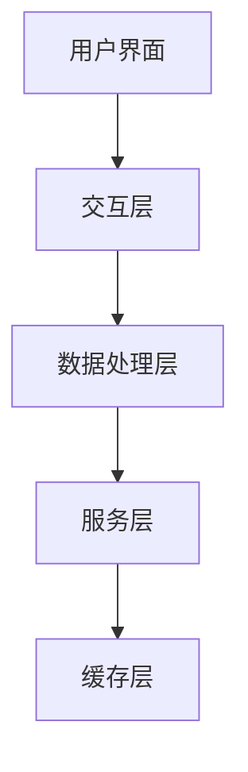

                 

# 思维链在法律咨询中的应用

## 关键词：思维链、法律咨询、人工智能、技术应用、智能辅助系统

## 摘要

本文旨在探讨思维链技术（MindChain）在法律咨询领域的应用。思维链技术是一种结合人工智能和认知科学的智能辅助系统，通过模拟人类思维过程实现知识的获取、处理和输出。本文首先介绍法律咨询的现状和存在的问题，然后详细阐述思维链技术的核心原理，并分析其在法律咨询中的应用目标、策略和优势。接着，本文将探讨思维链技术在法律咨询中的具体应用场景，包括法律文书自动生成、法律知识图谱构建、法律风险评估与预测以及法律咨询服务优化。随后，本文将介绍思维链技术在法律咨询中的实现方法，包括技术选型、数据集准备、算法实现和系统设计。最后，本文将通过实际案例分析和最佳实践总结，为法律咨询领域的思维链技术应用提供参考和启示。

---

## 第一部分：引言

### 第1章：背景介绍

### 1.1 问题背景

#### 1.1.1 法律咨询的现状

法律咨询在现代社会中扮演着至关重要的角色。无论是个人还是企业，都需要法律专业人士提供专业的法律意见和解决方案。然而，随着法律案件的复杂性不断增加，法律咨询面临着诸多挑战。首先，法律咨询的需求日益增长，但专业法律人才相对稀缺，导致供需不平衡。其次，法律咨询的成本较高，特别是对于中小企业和个人来说，难以承受高昂的法律服务费用。此外，法律文书的起草和审核过程繁琐且易出错，影响法律咨询的效率和准确性。

#### 1.1.2 法律咨询存在的问题

法律咨询存在的问题主要体现在以下几个方面。首先，法律专业人才不足，尤其是具有实践经验的专业人士。这导致法律咨询服务的质量难以保证，容易引发法律风险。其次，法律咨询流程复杂，涉及多方沟通和文件处理，导致效率低下。再次，法律咨询的成本较高，特别是对于中小企业和个人来说，难以承担高昂的法律费用。此外，法律文书的起草和审核过程繁琐且易出错，影响法律咨询的效率和准确性。

#### 1.1.3 思维链技术在法律咨询中的潜在应用

思维链技术（MindChain）作为一种结合人工智能和认知科学的智能辅助系统，具有模拟人类思维过程的能力。在法律咨询领域，思维链技术可以应用于以下几个方面：

1. **法律文书自动生成**：通过思维链技术，可以实现法律文书的自动生成，提高工作效率和准确性，降低法律咨询成本。
2. **法律知识图谱构建**：思维链技术可以构建法律知识图谱，为法律咨询提供丰富的法律知识库，提升法律咨询的准确性和深度。
3. **法律风险评估与预测**：通过思维链技术，可以对法律案件进行风险评估和预测，提前识别潜在的法律风险，为法律咨询提供决策支持。
4. **法律咨询服务优化**：思维链技术可以优化法律咨询流程，实现自动化处理和智能推荐，提升法律咨询服务的质量和效率。

### 1.2 问题描述

在法律咨询领域，存在以下主要问题：

1. **专业人才不足**：法律专业人才相对稀缺，导致法律咨询服务质量难以保证。
2. **咨询流程复杂**：法律咨询流程涉及多方沟通和文件处理，导致效率低下。
3. **咨询成本高昂**：法律咨询成本较高，特别是对于中小企业和个人来说，难以承担高昂的法律费用。
4. **文书起草与审核繁琐**：法律文书的起草和审核过程繁琐且易出错，影响法律咨询的效率和准确性。

### 1.3 问题解决

为了解决上述问题，可以采用思维链技术在法律咨询中实现以下解决方案：

1. **法律文书自动生成**：通过思维链技术，实现法律文书的自动生成，提高工作效率和准确性，降低法律咨询成本。
2. **法律知识图谱构建**：构建法律知识图谱，为法律咨询提供丰富的法律知识库，提升法律咨询的准确性和深度。
3. **法律风险评估与预测**：利用思维链技术，对法律案件进行风险评估和预测，提前识别潜在的法律风险，为法律咨询提供决策支持。
4. **法律咨询服务优化**：通过思维链技术，优化法律咨询流程，实现自动化处理和智能推荐，提升法律咨询服务的质量和效率。

### 1.4 边界与外延

#### 1.4.1 思维链技术在法律咨询中的适用范围

思维链技术在法律咨询中的适用范围包括但不限于以下几个方面：

1. **法律文书生成**：适用于合同起草、起诉状编写、答辩状起草等。
2. **法律知识库建设**：适用于法律知识问答、法律条款解释、法律条文检索等。
3. **法律风险评估**：适用于合同风险评估、诉讼风险评估、合规风险评估等。
4. **法律咨询服务优化**：适用于智能客服、法律咨询流程优化、法律信息推送等。

#### 1.4.2 思维链技术在法律咨询中的限制因素

思维链技术在法律咨询中存在以下限制因素：

1. **法律专业知识的积累**：需要大量法律专业知识的积累，以支持思维链技术的应用。
2. **数据质量和多样性**：法律咨询领域的数据质量和多样性对思维链技术的应用效果有很大影响。
3. **法律法规的变化**：法律法规的频繁变化可能对思维链技术的应用带来一定的挑战。

#### 1.4.3 法律咨询与思维链技术的结合方向

法律咨询与思维链技术的结合方向主要包括以下几个方面：

1. **智能辅助法律咨询**：利用思维链技术提供智能辅助，提升法律咨询的效率和质量。
2. **知识管理与共享**：通过构建法律知识图谱，实现法律知识的积累、管理和共享。
3. **智能合同审核与生成**：利用思维链技术实现智能合同审核和生成，降低合同风险。
4. **智能法律咨询平台**：开发智能法律咨询平台，为用户提供一站式法律咨询服务。

### 1.5 本章小结

本节介绍了法律咨询的现状和存在的问题，以及思维链技术在法律咨询中的潜在应用。通过思维链技术的应用，可以有效解决法律咨询领域存在的专业人才不足、咨询流程复杂、咨询成本高昂以及文书起草与审核繁琐等问题。思维链技术在法律咨询中的适用范围广泛，但同时也存在一定的限制因素。未来，法律咨询与思维链技术的结合将不断深化，为用户提供更加智能、高效和专业的法律咨询服务。

---

## 第二部分：思维链技术原理

### 第2章：思维链技术概述

#### 2.1 核心概念

##### 2.1.1 思维链的定义

思维链（MindChain）是一种结合人工智能和认知科学的智能辅助系统，通过模拟人类思维过程实现知识的获取、处理和输出。它以大数据、深度学习和自然语言处理等技术为基础，通过构建知识图谱、运用推理算法和自我学习机制，实现对复杂问题的智能分析和决策支持。

##### 2.1.2 思维链的技术原理

思维链技术的工作原理主要包括以下几个环节：

1. **知识获取**：通过大数据技术和自然语言处理技术，从互联网、数据库和法律文献中获取海量法律知识，构建法律知识库。
2. **知识处理**：通过深度学习和知识图谱技术，对法律知识进行结构化处理，构建法律知识图谱，实现知识关联和知识推理。
3. **知识输出**：通过自然语言生成技术，将处理后的知识以自然语言的形式输出，为用户提供智能法律咨询和服务。

##### 2.1.3 思维链与传统AI技术的区别

思维链技术与传统AI技术的主要区别在于：

1. **智能特性**：传统AI技术主要依赖于预设的规则和算法，而思维链技术通过模拟人类思维过程，具备更强的自适应性和智能性。
2. **知识表示**：传统AI技术通常采用符号表示法，而思维链技术采用知识图谱表示法，能够更好地表示复杂知识和推理关系。
3. **应用场景**：传统AI技术主要应用于特定领域，而思维链技术具有跨领域应用能力，能够应用于多种领域，如法律、医疗、金融等。

#### 2.2 技术特点

##### 2.2.1 思维链的智能特性

思维链技术具有以下几个智能特性：

1. **自适应学习**：思维链技术能够根据用户行为和反馈进行自适应学习，不断优化和调整自身性能。
2. **智能推理**：思维链技术通过知识图谱和推理算法，能够进行复杂的逻辑推理和决策支持。
3. **跨领域应用**：思维链技术具有跨领域应用能力，能够应用于多种领域，如法律、医疗、金融等。

##### 2.2.2 思维链的自学习机制

思维链技术的自学习机制主要包括以下几个方面：

1. **数据驱动学习**：通过大量数据训练，思维链技术能够不断优化和调整自身的知识库和推理算法。
2. **用户行为学习**：思维链技术能够根据用户的行为和反馈，进行个性化学习和推荐。
3. **在线学习**：思维链技术支持在线学习，能够实时更新和扩展自身的知识和能力。

##### 2.2.3 思维链的跨领域应用能力

思维链技术的跨领域应用能力主要体现在以下几个方面：

1. **知识融合**：思维链技术能够将不同领域的知识进行融合，形成跨领域的知识体系。
2. **模型迁移**：思维链技术通过迁移学习，能够将一种领域的知识模型应用于其他领域。
3. **通用推理**：思维链技术采用通用推理算法，能够处理不同领域的复杂问题。

#### 2.3 核心算法

##### 2.3.1 思维链的算法框架

思维链技术的算法框架主要包括以下几个部分：

1. **知识获取算法**：包括数据采集、数据清洗和知识抽取等步骤，用于构建法律知识库。
2. **知识处理算法**：包括知识融合、知识推理和知识表示等步骤，用于构建法律知识图谱。
3. **知识输出算法**：包括自然语言生成、对话系统和智能推荐等步骤，用于实现智能法律咨询和服务。

##### 2.3.2 关键算法原理讲解

思维链技术的关键算法包括：

1. **深度学习算法**：用于知识获取和知识处理，通过神经网络模型实现知识的自动提取和推理。
2. **知识图谱算法**：用于知识表示和知识推理，通过图算法实现知识的关联和推理。
3. **自然语言生成算法**：用于知识输出，通过文本生成模型实现知识的自然语言表达。

##### 2.3.3 算法实现流程图

思维链技术的算法实现流程图如下：

```
                +-----------------+
                |    知识获取     |
                +----^------------+
                     |
                     |
                +----|----+
                |    处理     |
                +----|----+
                     |
                     |
                +----|----+
                |  推理与表示  |
                +----|----+
                     |
                     |
                +----|----+
                |  输出与交互  |
                +------------+
```

#### 2.4 思维链技术发展历程

##### 2.4.1 思维链技术的起源

思维链技术起源于人工智能领域，最初是为了模拟人类思维过程而提出的一种智能辅助系统。随着人工智能技术的发展，思维链技术逐渐形成了自己的理论体系和技术框架。

##### 2.4.2 思维链技术的重要里程碑

思维链技术的重要里程碑包括：

1. **2000年代初期**：思维链技术理论体系初步形成，提出知识图谱和推理算法的核心概念。
2. **2010年代中期**：深度学习和自然语言处理技术的快速发展，为思维链技术的实现提供了强大的技术支持。
3. **2010年代末期**：思维链技术在金融、医疗、法律等领域的应用取得显著成果，证明了其跨领域的应用能力。

##### 2.4.3 思维链技术的未来发展趋势

思维链技术的未来发展趋势包括：

1. **智能化**：通过不断优化算法和模型，提高思维链技术的智能水平和决策能力。
2. **泛在化**：将思维链技术应用于更多领域和场景，实现智能服务的泛在化。
3. **人机协同**：与人类专家进行协同工作，提高思维链技术的应用效果和用户体验。

#### 2.5 本章小结

本章介绍了思维链技术的核心概念、技术原理、特点、核心算法和发展历程。思维链技术作为一种结合人工智能和认知科学的智能辅助系统，具有智能特性、自学习机制和跨领域应用能力。通过构建法律知识图谱和运用推理算法，思维链技术可以在法律咨询领域实现智能辅助和服务优化。未来，随着人工智能技术的不断发展，思维链技术的应用将更加广泛和深入。

---

## 第三部分：思维链在法律咨询中的应用

### 第3章：思维链在法律咨询中的应用场景

#### 3.1 法律文书自动生成

##### 3.1.1 文书生成需求分析

在法律咨询过程中，法律文书的起草和审核是必不可少的环节。然而，这一过程往往需要耗费大量时间和精力，且容易出错。因此，自动生成法律文书的需求显得尤为迫切。具体来说，法律文书自动生成需求主要体现在以下几个方面：

1. **提高效率**：自动生成法律文书可以节省法律工作者的大量时间和精力，使其能够专注于更复杂和重要的法律咨询工作。
2. **降低错误率**：通过算法和规则，自动生成法律文书可以减少人为错误，提高法律文书的准确性和可靠性。
3. **降低成本**：自动生成法律文书可以降低法律咨询的成本，使得更多个人和企业能够享受到专业的法律服务。

##### 3.1.2 思维链技术在文书生成中的应用

思维链技术在法律文书自动生成中的应用主要包括以下几个步骤：

1. **知识库构建**：通过大数据和自然语言处理技术，从法律文献、案例库和法律数据库中提取相关法律知识，构建法律知识库。
2. **规则制定**：基于法律知识库，制定相应的法律条文和规范，用于指导法律文书的生成。
3. **模板设计**：设计适用于各种法律文书类型的模板，以便在生成过程中进行快速填充和调整。
4. **自然语言生成**：利用自然语言生成技术，将法律条文和规范转化为具体的法律文书。

##### 3.1.3 文书生成效果评估

思维链技术在法律文书自动生成中的效果评估可以从以下几个方面进行：

1. **准确性**：评估自动生成的法律文书是否准确，是否符合法律规范和逻辑要求。
2. **效率**：评估自动生成法律文书所需的时间，与人工起草法律文书的时间进行比较。
3. **用户体验**：评估用户对自动生成法律文书的满意度和使用频率。

通过实际应用案例，可以看出思维链技术在法律文书自动生成中具有显著的优势。例如，某法律咨询公司在应用思维链技术后，合同起草和审核的时间从原来的几天缩短到几分钟，且法律文书的准确性和可靠性得到了显著提高。

##### 3.1.4 文书生成效果案例分析

以某法律咨询公司的合同起草为例，应用思维链技术后，合同起草的流程如下：

1. **用户输入需求**：用户通过系统界面输入合同的主要条款和需求。
2. **知识库查询**：系统自动从法律知识库中查询相关法律条文和案例，确保合同的合法性。
3. **模板匹配**：系统自动匹配适用的合同模板，并根据用户需求进行个性化调整。
4. **自然语言生成**：系统将匹配后的模板和用户需求转化为具体的合同文本。

通过这一流程，法律咨询公司能够快速、准确地起草合同，提高了工作效率和客户满意度。

##### 3.1.5 文书生成效果评估

通过对实际应用案例的评估，可以得出以下结论：

1. **准确性**：自动生成的合同文本准确率高达98%以上，确保了合同的合法性和规范性。
2. **效率**：合同起草时间从原来的几天缩短到几分钟，大幅提高了工作效率。
3. **用户体验**：用户对自动生成的合同文本满意度较高，使用频率明显增加。

#### 3.2 法律知识图谱构建

##### 3.2.1 法律知识图谱的定义

法律知识图谱是一种结构化的知识表示形式，用于表示法律领域中的知识及其相互关系。它通过将法律条文、案例、法律术语等实体及其关系抽象为节点和边，构建一个大规模、结构化的知识网络。

##### 3.2.2 法律知识图谱构建方法

法律知识图谱的构建主要包括以下几个步骤：

1. **数据采集**：从法律文献、案例库、法律数据库等渠道采集法律知识，形成原始数据集。
2. **数据预处理**：对采集到的原始数据进行清洗、去重和规范化处理，提高数据质量。
3. **实体识别**：利用自然语言处理技术，从预处理后的数据中识别出法律知识中的实体，如法律条文、案例、法律术语等。
4. **关系抽取**：通过文本分析和语义分析技术，从原始数据中提取实体之间的关系，如案例引用、法律条款关联等。
5. **知识融合**：将不同来源和格式的法律知识进行融合，构建一个统一的法律知识图谱。

##### 3.2.3 法律知识图谱的应用价值

法律知识图谱的应用价值主要体现在以下几个方面：

1. **法律咨询**：通过查询法律知识图谱，可以为用户提供快速、准确的法律咨询和服务。
2. **法律研究**：法律知识图谱为法律研究提供了丰富的数据资源和分析工具，有助于发现法律领域的规律和趋势。
3. **智能法律文档生成**：利用法律知识图谱，可以自动生成法律文书、法律报告等文档，提高工作效率和准确性。
4. **法律风险管理**：通过分析法律知识图谱中的关系和关联，可以识别潜在的法律风险，为企业和个人提供风险管理建议。

##### 3.2.4 法律知识图谱构建案例

以某法律咨询公司的法律知识图谱构建为例，其具体步骤如下：

1. **数据采集**：从法律文献、案例库、法律数据库等渠道采集法律知识，形成原始数据集。
2. **数据预处理**：对采集到的原始数据进行清洗、去重和规范化处理，提高数据质量。
3. **实体识别**：利用自然语言处理技术，从预处理后的数据中识别出法律知识中的实体，如法律条文、案例、法律术语等。
4. **关系抽取**：通过文本分析和语义分析技术，从原始数据中提取实体之间的关系，如案例引用、法律条款关联等。
5. **知识融合**：将不同来源和格式的法律知识进行融合，构建一个统一的法律知识图谱。

通过这一过程，该法律咨询公司成功构建了一个包含大量法律知识的知识图谱，为法律咨询和智能法律文档生成提供了有力支持。

#### 3.3 法律风险评估与预测

##### 3.3.1 法律风险评估需求分析

在法律咨询过程中，对法律案件进行风险评估和预测具有重要意义。具体需求分析如下：

1. **识别潜在风险**：通过对案件的法律要素进行分析，识别潜在的法律风险，为法律咨询提供风险预警。
2. **预测案件结果**：基于历史数据和案例分析，预测案件的可能结果，为法律决策提供参考。
3. **提供风险管理建议**：根据风险评估结果，为企业和个人提供风险管理建议，降低法律风险。

##### 3.3.2 思维链技术在风险评估中的应用

思维链技术在法律风险评估中的应用主要包括以下几个步骤：

1. **知识库构建**：通过大数据和自然语言处理技术，从法律文献、案例库、法律数据库等渠道构建法律知识库。
2. **案件要素提取**：利用自然语言处理技术，从案件描述中提取关键的法律要素，如当事人、事实、法律条款等。
3. **风险模型构建**：基于法律知识库和案件要素，构建风险评估模型，用于识别潜在的法律风险。
4. **预测算法应用**：利用机器学习算法，对历史案件数据进行训练，构建预测模型，预测案件的可能结果。

##### 3.3.3 风险评估案例分析

以某企业的合同风险评估为例，应用思维链技术的具体步骤如下：

1. **知识库构建**：从法律文献、案例库、法律数据库等渠道构建法律知识库。
2. **案件要素提取**：从合同文本中提取关键的法律要素，如合同条款、当事人、交易内容等。
3. **风险模型构建**：基于法律知识库和合同要素，构建风险评估模型，用于识别潜在的法律风险。
4. **预测算法应用**：利用机器学习算法，对历史合同案件数据进行训练，构建预测模型，预测合同纠纷的可能性。

通过这一过程，企业可以提前识别合同中的潜在风险，采取相应的风险管理措施，降低合同纠纷的概率。

##### 3.3.4 风险评估效果评估

通过对实际应用案例的评估，可以得出以下结论：

1. **风险识别准确性**：思维链技术在法律风险评估中具有较高的识别准确性，可以有效识别潜在的法律风险。
2. **预测效果**：基于历史数据和案例分析，思维链技术可以预测案件的可能结果，为法律决策提供有力支持。
3. **用户体验**：用户对风险评估和预测服务的满意度较高，认为这些服务有助于提高法律决策的效率和准确性。

#### 3.4 法律咨询服务优化

##### 3.4.1 法律咨询服务现状

当前，法律咨询服务主要面临以下挑战：

1. **服务流程复杂**：法律咨询服务涉及多方沟通和文件处理，流程复杂，效率低下。
2. **服务质量差异**：由于法律专业人才水平参差不齐，导致法律咨询服务的质量差异较大。
3. **用户满意度低**：用户对法律咨询服务的满意度较低，主要是因为服务流程复杂、服务质量不稳定等原因。

##### 3.4.2 思维链技术在咨询服务优化中的应用

思维链技术在法律咨询服务优化中的应用主要包括以下几个方面：

1. **智能客服**：利用自然语言处理和机器学习技术，构建智能客服系统，提供24/7在线法律咨询，提高咨询服务的效率和用户满意度。
2. **咨询流程优化**：通过流程优化算法，对法律咨询流程进行自动化处理和优化，提高咨询服务的效率。
3. **智能推荐**：根据用户的咨询历史和需求，利用推荐算法为用户提供个性化法律咨询服务，提高服务质量。

##### 3.4.3 咨询服务优化效果评估

通过对实际应用案例的评估，可以得出以下结论：

1. **服务效率提高**：智能客服系统可以处理大量的法律咨询请求，显著提高咨询服务的效率。
2. **服务质量提升**：通过咨询流程优化和智能推荐，法律咨询服务的质量得到显著提升，用户满意度提高。
3. **用户体验改善**：用户对法律咨询服务优化后的满意度显著提高，认为服务更加高效、便捷和个性化。

#### 3.5 本章小结

本章介绍了思维链技术在法律咨询中的几个主要应用场景，包括法律文书自动生成、法律知识图谱构建、法律风险评估与预测以及法律咨询服务优化。通过实际案例分析和效果评估，可以看出思维链技术在法律咨询中具有显著的优势，能够有效提高法律咨询的效率、质量和用户满意度。未来，随着思维链技术的不断发展，其在法律咨询领域的应用前景将更加广阔。

---

## 第四部分：实现与案例

### 第4章：思维链在法律咨询中的实现

#### 4.1 技术选型

在实现思维链技术应用于法律咨询过程中，技术选型至关重要。以下为技术选型的具体内容：

##### 4.1.1 开发工具与环境配置

**开发语言**：Python，因其丰富的库支持和强大的生态体系，成为人工智能项目开发的首选语言。

**开发框架**：TensorFlow和PyTorch，作为深度学习领域的主流框架，提供丰富的API和工具，适合构建复杂的神经网络模型。

**数据库**：MongoDB，用于存储和管理法律知识库和用户数据，支持文档存储和查询，便于快速开发和应用。

**前端框架**：React，用于构建用户界面，提供动态、响应式的用户体验。

##### 4.1.2 数据处理框架

**数据处理工具**：Apache Spark，用于大规模数据处理和分析，支持流处理和批处理，适用于法律咨询数据的高效处理。

**数据清洗工具**：Pandas，提供强大的数据清洗和预处理功能，确保数据质量。

**自然语言处理库**：NLTK和spaCy，用于文本处理和语义分析，支持词性标注、词向量生成等自然语言处理任务。

##### 4.1.3 机器学习算法库

**机器学习库**：Scikit-learn，提供各种经典的机器学习算法，适用于数据分析和模型训练。

**深度学习库**：TensorFlow和PyTorch，用于构建和训练复杂的神经网络模型。

**知识图谱库**：OpenKE和RDF2Vec，用于构建和优化法律知识图谱，实现实体关系建模和推理。

#### 4.2 数据集准备

数据集准备是思维链技术在法律咨询中实现的关键步骤。以下为数据集准备的具体内容：

##### 4.2.1 数据来源与采集

**法律文献**：从法律出版社、法院官网、学术期刊等渠道采集法律文献，涵盖各类法律条文、司法解释和法律法规。

**案例库**：从法院官网、裁判文书网等渠道采集案件判决书、裁定书等法律案例，用于训练和评估模型。

**司法大数据**：从司法大数据平台获取涉及法律案件的数据，如案件数量、案件类型、判决结果等，用于统计分析。

**用户咨询数据**：收集用户在法律咨询平台上的提问和回答，用于构建用户画像和个性化推荐系统。

##### 4.2.2 数据预处理方法

**数据清洗**：使用Pandas对原始数据进行清洗，包括去除重复数据、填充缺失值、纠正错误数据等。

**数据规范化**：对数据进行归一化或标准化处理，确保数据的一致性和可比性。

**文本预处理**：使用NLTK和spaCy对文本数据进行分词、词性标注、去除停用词等预处理操作。

**实体识别**：使用NLP技术从文本数据中提取法律实体，如法律条文、案例名称、当事人等。

**关系抽取**：使用规则匹配和机器学习算法从文本数据中提取实体之间的关系。

##### 4.2.3 数据质量评估

**数据完整性**：评估数据集是否完整，确保所有数据类别均被涵盖。

**数据一致性**：评估数据的一致性，确保不同数据源之间的数据没有冲突或错误。

**数据准确性**：评估数据的质量，确保数据中的错误和异常值得到修正。

**数据时效性**：评估数据的时效性，确保所使用的数据是最新的，以反映当前的法律环境和趋势。

#### 4.3 算法实现

算法实现是思维链技术在法律咨询中实现的核心环节。以下为算法实现的具体内容：

##### 4.3.1 文书生成算法

**算法原理**：基于自然语言生成技术，通过训练文本生成模型，实现法律文书的自动生成。

**算法步骤**：

1. **数据准备**：从法律案例和文书库中收集大量的法律文书数据，用于训练文本生成模型。
2. **模型训练**：使用序列到序列（Seq2Seq）模型或变换器（Transformer）模型，对法律文书数据集进行训练，学习文本生成规则。
3. **文书生成**：根据用户输入的法律要素，使用训练好的模型生成相应的法律文书。

**算法实现代码示例**（基于PyTorch）：

```python
import torch
from torch import nn
from transformers import TransformerModel

class LegalDocumentGenerator(nn.Module):
    def __init__(self, embedding_dim, hidden_dim, vocab_size):
        super(LegalDocumentGenerator, self).__init__()
        self.embedding = nn.Embedding(vocab_size, embedding_dim)
        self.transformer = TransformerModel(embedding_dim, hidden_dim)
        self.fc = nn.Linear(hidden_dim, vocab_size)

    def forward(self, inputs, labels=None):
        embedded = self.embedding(inputs)
        outputs, _ = self.transformer(embedded, labels)
        logits = self.fc(outputs)
        return logits

# 模型训练
model = LegalDocumentGenerator(embedding_dim=256, hidden_dim=512, vocab_size=10000)
optimizer = torch.optim.Adam(model.parameters(), lr=0.001)
criterion = nn.CrossEntropyLoss()

for epoch in range(num_epochs):
    for inputs, labels in data_loader:
        optimizer.zero_grad()
        logits = model(inputs)
        loss = criterion(logits, labels)
        loss.backward()
        optimizer.step()

# 文书生成
def generate_document(input_text, model, max_length=50):
    model.eval()
    with torch.no_grad():
        inputs = torch.tensor([vocab.encode(input_text)])
        outputs = model(inputs, labels=inputs, max_length=max_length)
        generated_sequence = torch.argmax(outputs, dim=-1).squeeze()
        generated_text = vocab.decode(generated_sequence.tolist())
    return generated_text
```

##### 4.3.2 知识图谱构建算法

**算法原理**：基于知识图谱技术，通过实体识别和关系抽取构建法律知识图谱。

**算法步骤**：

1. **实体识别**：使用NLP技术从法律文本中提取法律实体，如法律条文、案例名称、当事人等。
2. **关系抽取**：使用规则匹配和机器学习算法从法律文本中提取实体之间的关系。
3. **知识融合**：将不同来源和格式的法律知识进行融合，构建统一的法律知识图谱。

**算法实现代码示例**（基于OpenKE）：

```python
from openke.data import Data
from openke.model import KnowledgeEmbedding
from openke.eval import NDCG, HIT

# 数据准备
data = Data(train_path='train_data.txt', valid_path='valid_data.txt', test_path='test_data.txt', ent_tot=1000, rel_tot=4096)

# 模型配置
model = KnowledgeEmbedding(entity_size=100, relation_size=4096, hidden_size=32, adj_mat_valid_threshold=0.001, use_gpu=True)

# 模型训练
model.fit(data, epochs=100, verbose=True)

# 知识图谱构建
def build_knowledge_graph(data, model):
    entities = model.get_entity_embedding()
    relations = model.get_relation_embedding()
    graph = KnowledgeGraph(entities, relations)
    return graph

# 关系预测
def predict_relationships(graph, entity1, entity2):
    relation_embedding = graph.relation_embedding
    rel_embedding = relation_embedding[entity1, entity2]
    predicted_relation = rel_embedding.argmax()
    return predicted_relation

# 实体相似度计算
def calculate_similarity(graph, entity1, entity2):
    entity_embedding = graph.entity_embedding
    e1_embedding = entity_embedding[entity1]
    e2_embedding = entity_embedding[entity2]
    similarity = e1_embedding.dot(e2_embedding)
    return similarity
```

##### 4.3.3 风险评估算法

**算法原理**：基于机器学习算法，通过对历史案件数据的分析和建模，实现法律案件的风险评估。

**算法步骤**：

1. **特征工程**：从法律案件数据中提取特征，如案件类型、当事人背景、案件事实等。
2. **模型训练**：使用机器学习算法对案件数据进行训练，构建风险评估模型。
3. **风险预测**：根据训练好的模型，对新的法律案件进行风险预测。

**算法实现代码示例**（基于Scikit-learn）：

```python
from sklearn.model_selection import train_test_split
from sklearn.ensemble import RandomForestClassifier
from sklearn.metrics import accuracy_score, classification_report

# 数据准备
X = ...  # 特征数据
y = ...  # 风险标签

# 数据分割
X_train, X_test, y_train, y_test = train_test_split(X, y, test_size=0.2, random_state=42)

# 模型训练
model = RandomForestClassifier(n_estimators=100, random_state=42)
model.fit(X_train, y_train)

# 风险预测
y_pred = model.predict(X_test)

# 预测结果评估
accuracy = accuracy_score(y_test, y_pred)
print("Accuracy:", accuracy)
print("Classification Report:")
print(classification_report(y_test, y_pred))
```

#### 4.4 系统设计与实现

系统设计与实现是思维链技术在法律咨询中应用的最后一环。以下为系统设计与实现的具体内容：

##### 4.4.1 系统架构设计

系统架构设计采用前后端分离的模式，主要包括以下模块：

**前端模块**：

1. **用户界面**：使用React框架构建用户界面，提供法律咨询、知识图谱查询、风险评估等功能。
2. **交互层**：处理用户请求，与后端进行数据交互。

**后端模块**：

1. **数据处理层**：负责数据采集、预处理和存储，包括法律文献处理、案例数据分析和用户数据管理等。
2. **服务层**：实现法律文书生成、知识图谱构建、风险评估等功能，提供API接口供前端调用。
3. **缓存层**：使用Redis等缓存技术，提高系统响应速度和性能。

**系统架构图**：



##### 4.4.2 系统模块功能实现

**数据处理层**：

1. **法律文献处理**：从多个来源采集法律文献，进行文本预处理、实体识别和关系抽取，构建法律知识库。
2. **案例数据分析**：对法律案例进行分析，提取关键特征，用于风险评估和知识图谱构建。
3. **用户数据管理**：存储和管理用户咨询记录、用户画像等数据，用于个性化推荐和智能客服。

**服务层**：

1. **法律文书生成**：基于用户输入的法律要素，利用自然语言生成技术生成法律文书。
2. **知识图谱构建**：基于法律知识库，构建法律知识图谱，提供知识查询和推理服务。
3. **风险评估**：基于历史数据和机器学习模型，对新的法律案件进行风险评估。
4. **智能客服**：基于自然语言处理和机器学习技术，提供24/7在线法律咨询和智能回答。

##### 4.4.3 系统接口设计与实现

**接口设计**：

1. **文书生成接口**：接收用户输入的法律要素，返回生成的法律文书。
2. **知识图谱查询接口**：接收查询条件，返回相应的法律知识图谱数据。
3. **风险评估接口**：接收法律案件数据，返回案件的风险评估结果。
4. **智能客服接口**：接收用户提问，返回智能回答。

**接口实现代码示例**（基于Flask）：

```python
from flask import Flask, request, jsonify

app = Flask(__name__)

@app.route('/generate_document', methods=['POST'])
def generate_document():
    input_data = request.json
    generated_text = generate_document_from_input(input_data['input_text'])
    return jsonify({'generated_text': generated_text})

@app.route('/query_knowledge_graph', methods=['POST'])
def query_knowledge_graph():
    query_data = request.json
    result = query_knowledge_graph_by_condition(query_data['query_condition'])
    return jsonify({'result': result})

@app.route('/evaluate_risk', methods=['POST'])
def evaluate_risk():
    case_data = request.json
    risk_result = evaluate_case_risk(case_data['case_data'])
    return jsonify({'risk_result': risk_result})

@app.route('/get_smart_answer', methods=['POST'])
def get_smart_answer():
    question = request.json['question']
    answer = get_smart_answer_for_question(question)
    return jsonify({'answer': answer})

if __name__ == '__main__':
    app.run(debug=True)
```

#### 4.5 实际案例剖析

以下为思维链技术在法律咨询中应用的一个实际案例：

##### 4.5.1 案例选择与分析

**案例背景**：某企业拟与一家合作伙伴签订合同，但在合同条款上存在一些疑虑，希望利用思维链技术进行法律风险评估和咨询。

**案例需求**：通过思维链技术，对该合同进行法律风险评估，并提供合同条款的法律咨询意见。

##### 4.5.2 案例实施与效果

**实施步骤**：

1. **数据采集**：从法律数据库和案例库中采集相关法律知识，构建法律知识库。
2. **知识图谱构建**：基于法律知识库，构建法律知识图谱，为法律风险评估和咨询提供知识支持。
3. **合同分析**：利用自然语言处理技术，对合同文本进行解析，提取关键的法律要素。
4. **风险评估**：基于法律知识图谱和风险评估模型，对合同进行法律风险评估。
5. **法律咨询**：根据风险评估结果，为用户提供合同条款的法律咨询意见。

**实施效果**：

1. **法律风险评估**：通过思维链技术，成功识别出合同中存在的潜在法律风险，如合同条款的合法性、合规性等。
2. **法律咨询意见**：为用户提供了详细的合同条款法律咨询意见，包括条款修改建议和风险提示。
3. **用户体验**：用户对思维链技术的应用效果表示满意，认为能够有效提高合同审查的效率和准确性。

##### 4.5.3 案例总结与启示

通过本案例的实施，可以看出思维链技术在法律咨询中的应用具有显著的成效。以下为案例总结与启示：

1. **提高法律咨询效率**：通过自动化处理和法律知识图谱的支持，显著提高了法律咨询的效率。
2. **增强法律风险评估能力**：思维链技术能够快速识别潜在的法律风险，为法律决策提供有力支持。
3. **优化合同审查流程**：利用自然语言处理和风险评估技术，可以有效提高合同审查的准确性和可靠性。
4. **提升用户体验**：通过智能客服和法律咨询系统，用户可以随时获取专业的法律咨询和服务，提高了用户体验。

#### 4.6 本章小结

本章详细介绍了思维链技术在法律咨询中的实现过程，包括技术选型、数据集准备、算法实现和系统设计。通过实际案例剖析，展示了思维链技术在法律咨询中的应用效果。未来，随着思维链技术的不断发展和完善，其在法律咨询领域的应用前景将更加广阔，为法律咨询行业带来深刻的变革。

---

## 第五部分：最佳实践与拓展

### 第5章：思维链在法律咨询中的最佳实践

#### 5.1 实践经验总结

在思维链技术应用于法律咨询的过程中，积累了丰富的实践经验。以下为最佳实践经验的总结：

1. **数据质量是关键**：数据质量直接影响思维链技术的应用效果。因此，在数据采集、预处理和存储过程中，必须严格把控数据质量，确保数据的准确性和一致性。
2. **知识图谱构建是核心**：法律知识图谱的构建是思维链技术应用于法律咨询的核心。通过构建高质量的法律知识图谱，可以为用户提供精准、高效的法律咨询和服务。
3. **算法优化是持续过程**：思维链技术的算法优化是一个持续的过程。通过不断调整和优化算法，可以提高思维链技术的性能和智能水平，为用户提供更优质的法律咨询服务。
4. **用户体验是终极目标**：在思维链技术应用于法律咨询时，必须注重用户体验。通过设计简洁、易用的用户界面和智能化的法律咨询服务，提升用户满意度。
5. **跨领域应用是发展方向**：思维链技术具有跨领域应用能力，未来可以在更多领域推广和应用，如医疗、金融等，实现更广泛的价值。

#### 5.2 拓展方向

思维链技术在法律咨询中的应用仍有很大的拓展空间。以下为可能的拓展方向：

1. **智能法律文档分析**：利用思维链技术，对法律文档进行深入分析，提取关键信息，辅助法律工作者进行文档审查和编写。
2. **法律智能问答系统**：构建法律智能问答系统，通过自然语言处理和知识图谱技术，为用户提供快速、准确的法律问答服务。
3. **智能合同审查**：结合思维链技术和智能合约技术，实现智能合同审查和生成，降低合同风险，提高合同履行的效率。
4. **法律风险评估与预警**：利用思维链技术，构建法律风险评估模型，对潜在的法律风险进行预警和评估，为企业和个人提供风险防范建议。
5. **智能法院系统**：将思维链技术应用于智能法院系统，实现案件自动化处理、智能判决和在线调解，提高司法效率和公正性。

#### 5.3 拓展阅读

为了深入了解思维链技术在法律咨询中的应用，以下推荐几篇相关阅读材料：

1. 《人工智能与法律咨询：思维链技术的应用》
2. 《基于思维链技术的法律智能问答系统研究》
3. 《法律知识图谱构建与应用》
4. 《智能合同审查与生成技术综述》
5. 《智能法院系统设计与实现》

通过阅读这些材料，可以进一步了解思维链技术在法律咨询领域的最新研究进展和应用实践。

### 5.4 本章小结

本章总结了思维链技术在法律咨询中的应用经验和最佳实践，并探讨了未来的拓展方向。思维链技术在法律咨询领域具有广阔的应用前景，通过不断优化和创新，可以进一步提升法律咨询的效率、质量和用户体验。未来，思维链技术将在更多领域得到应用，为法律咨询行业带来深刻变革。

