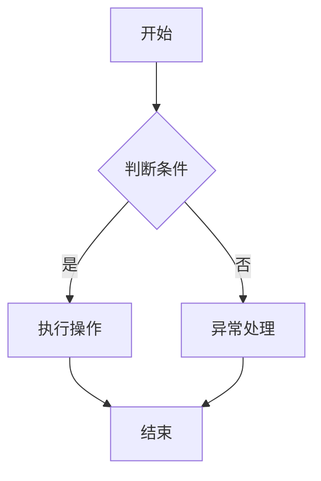

                 

# 思维链在海洋学研究中的创新方法

## 关键词

- 思维链
- 海洋学
- 数据挖掘
- 机器学习
- 深度学习

## 摘要

随着海洋学研究的不断深入，传统的海洋学研究方法面临越来越多的挑战。思维链作为一种创新的研究方法，能够有效地应对这些挑战，提升海洋学研究的效率和准确性。本文将介绍思维链的基本原理，分析其在海洋学中的应用场景，并探讨其在海洋学研究中面临的关键技术问题，以及成功案例和未来发展趋势。通过本文的探讨，我们希望能够为海洋学研究提供新的思路和方法，推动海洋学研究的进步。

### 目录大纲设计

**《思维链在海洋学研究中的创新方法》**

----------------------------------------------------------------

# 第一部分: 背景与核心概念

## 第1章: 海洋学研究的现状与挑战

### 1.1 海洋学研究的意义

#### 1.1.1 海洋资源的重要性

#### 1.1.2 海洋环境变化的挑战

#### 1.1.3 海洋学研究的前沿领域

### 1.2 海洋学研究的现状

#### 1.2.1 研究成果回顾

#### 1.2.2 研究方法的发展

#### 1.2.3 存在的问题与挑战

## 第2章: 思维链的基本原理

### 2.1 思维链的概念

#### 2.1.1 定义

#### 2.1.2 关键要素

#### 2.1.3 与传统研究方法对比

### 2.2 思维链的工作机制

#### 2.2.1 信息处理流程

#### 2.2.2 思维链的创新机制

#### 2.2.3 应用领域拓展

## 第3章: 思维链在海洋学中的应用场景

### 3.1 海洋环境监测

#### 3.1.1 监测数据的高效处理

#### 3.1.2 预测模型构建与应用

#### 3.1.3 实际案例分析

### 3.2 海洋资源开发

#### 3.2.1 资源评估与优化策略

#### 3.2.2 技术创新与应用

#### 3.2.3 案例研究

### 3.3 海洋灾害预警

#### 3.3.1 灾害风险评估与预警

#### 3.3.2 预警系统设计与实现

#### 3.3.3 案例分析

## 第4章: 思维链在海洋学中的关键技术与工具

### 4.1 数据采集与处理

#### 4.1.1 数据源概述

#### 4.1.2 数据处理流程

#### 4.1.3 常用数据处理工具介绍

### 4.2 模型构建与优化

#### 4.2.1 模型构建方法

#### 4.2.2 模型优化策略

#### 4.2.3 模型评估指标

### 4.3 技术工具应用

#### 4.3.1 数据挖掘工具

#### 4.3.2 机器学习平台

#### 4.3.3 开源工具与库

## 第5章: 思维链在海洋学研究的成功案例

### 5.1 案例一：某海域海洋环境监测项目

#### 5.1.1 项目背景

#### 5.1.2 思维链应用方案

#### 5.1.3 实施过程与结果

### 5.2 案例二：某海洋资源开发项目

#### 5.2.1 项目概述

#### 5.2.2 思维链方法的应用

#### 5.2.3 项目成效与反思

### 5.3 案例三：某海洋灾害预警系统

#### 5.3.1 系统设计思路

#### 5.3.2 思维链技术的具体应用

#### 5.3.3 预警效果评估

## 第6章: 思维链在海洋学研究的未来发展趋势

### 6.1 技术发展趋势

#### 6.1.1 现有技术的优化与突破

#### 6.1.2 新兴技术的引入与应用

#### 6.1.3 跨学科融合的可能性

### 6.2 应用前景展望

#### 6.2.1 对海洋学研究的潜在影响

#### 6.2.2 社会经济价值分析

#### 6.2.3 面临的挑战与应对策略

## 第7章: 总结与展望

### 7.1 思维链在海洋学研究的总体评估

#### 7.1.1 成就与贡献

#### 7.1.2 存在的不足与改进空间

### 7.2 发展建议与未来方向

#### 7.2.1 研究方向展望

#### 7.2.2 政策支持与产业合作

#### 7.2.3 教育培训与人才培养

----------------------------------------------------------------

## 第1章: 海洋学研究的现状与挑战

### 1.1 海洋学研究的意义

海洋学作为一门研究海洋现象、过程和资源利用的综合性科学，对于人类社会的发展具有重要意义。首先，海洋资源是地球上最重要的资源之一，包括石油、天然气、锰结核等矿产资源，以及鱼类、贝类等生物资源。这些资源对于全球的经济发展和人类生存至关重要。

#### 1.1.1 海洋资源的重要性

海洋资源不仅为人类提供了丰富的物质基础，还具有重要的生态价值。海洋生态系统是全球碳循环和氧气产生的重要场所，对地球气候调节具有关键作用。此外，海洋中丰富的生物资源为人类提供了重要的食物来源和医药资源。

#### 1.1.2 海洋环境变化的挑战

然而，随着全球气候变化和人类活动的加剧，海洋环境正面临前所未有的挑战。海洋酸化、温度升高、冰川融化等环境问题对海洋生态系统和资源利用产生了深远影响。因此，海洋学研究不仅关乎资源利用，更关乎全球生态安全和人类福祉。

#### 1.1.3 海洋学研究的前沿领域

当前，海洋学研究的前沿领域包括海洋环境监测、海洋资源开发、海洋灾害预警等。这些研究不仅要求对海洋现象和过程的深入理解，还需要运用先进的技术手段和方法，如大数据分析、机器学习、深度学习等。通过这些研究，我们希望能够更好地应对海洋环境变化带来的挑战，实现海洋资源的可持续利用。

### 1.2 海洋学研究的现状

#### 1.2.1 研究成果回顾

近年来，海洋学研究取得了许多重要成果。例如，在海洋环境监测方面，通过卫星遥感技术和传感器网络的广泛应用，我们能够实时获取海洋环境数据，对海洋温度、盐度、潮汐等进行精确监测。在海洋资源开发方面，深海钻探技术和海洋平台建设取得了显著进展，使得海底矿产资源的开发成为可能。

#### 1.2.2 研究方法的发展

同时，海洋学研究方法也在不断进步。传统的海洋学研究主要依赖于实地调查和实验室分析，而现在，随着信息技术的飞速发展，大数据分析、机器学习、深度学习等新兴方法开始广泛应用于海洋学研究。这些方法不仅提高了数据处理的效率，还能够从海量数据中发现潜在规律，为研究提供新的思路。

#### 1.2.3 存在的问题与挑战

然而，海洋学研究也面临着许多问题与挑战。首先，海洋环境的复杂性和多样性使得研究过程具有很高的不确定性。其次，海洋数据的海量性和多样性导致数据处理和分析的难度大大增加。此外，现有研究方法在应对海洋环境变化和资源利用方面还存在一定的局限性。

### 1.3 海洋学研究的未来趋势

为了应对这些挑战，未来海洋学研究将朝着以下几个方向发展：

1. **跨学科融合**：海洋学研究需要与物理学、化学、生物学、地理学等多个学科交叉融合，形成新的研究方法和理论体系。

2. **技术创新**：发展新的传感器技术、数据采集和处理技术，提高海洋环境监测和资源开发的精度和效率。

3. **大数据分析**：利用大数据分析技术，从海量数据中发现潜在规律，为决策提供科学依据。

4. **人工智能应用**：引入人工智能技术，如机器学习和深度学习，提高数据分析和预测的准确性。

通过这些努力，我们有望在海洋学研究中取得更多的突破，为人类社会的可持续发展提供有力支持。

---

在这一章节中，我们简要介绍了海洋学研究的意义、现状和未来趋势。随着全球环境的变化和海洋资源的日益重要，海洋学研究面临前所未有的挑战。传统的海洋学研究方法已经难以满足当前的需求，因此，我们需要引入新的研究方法和工具，如思维链。接下来，我们将深入探讨思维链的基本原理，分析其在海洋学中的应用场景，并探讨其在海洋学研究中面临的关键技术问题。

## 第2章: 思维链的基本原理

### 2.1 思维链的概念

思维链（Thought Chain）是一种基于信息处理和知识推理的先进研究方法。它通过将一系列逻辑环节连接起来，形成一个完整的信息处理流程，从而实现对复杂问题的深入分析和解决。

#### 2.1.1 定义

思维链可以简单定义为一种基于信息处理和知识推理的有序思维过程。它通过将问题分解为多个子问题，然后逐层分析和解决，最终形成对问题的全面理解。

#### 2.1.2 关键要素

思维链的核心要素包括：

1. **问题分解**：将复杂问题分解为多个子问题，以便更有效地分析和解决。
2. **信息处理**：通过收集、整理和分析数据，为问题解决提供基础。
3. **知识推理**：基于已有知识和数据，进行逻辑推理和判断，以得出结论。
4. **反馈循环**：通过不断调整和优化问题解决过程，提高解决方案的准确性和效率。

#### 2.1.3 与传统研究方法对比

与传统研究方法相比，思维链具有以下几个显著优势：

1. **系统性**：思维链强调问题解决的系统性，通过将问题分解为多个子问题，能够更全面地分析和解决问题。
2. **灵活性**：思维链方法可以根据实际情况灵活调整，适应不同类型的研究问题。
3. **高效性**：通过信息处理和知识推理，思维链能够快速从大量数据中提取有价值的信息，提高研究效率。

### 2.2 思维链的工作机制

思维链的工作机制可以分为以下几个步骤：

#### 2.2.1 问题定义

首先，明确研究问题的具体内容和目标。这一步骤至关重要，因为它将直接影响到后续的分析和解决过程。

#### 2.2.2 问题分解

将复杂问题分解为多个子问题，以便更有效地分析和解决。这一步骤通常采用递归或层次化分解的方法。

#### 2.2.3 信息收集与整理

收集相关数据和信息，并对这些信息进行整理和分析。这一步骤是思维链的基础，因为数据质量直接影响问题解决的准确性。

#### 2.2.4 知识推理

基于已有知识和数据，进行逻辑推理和判断，以得出结论。这一步骤通常采用机器学习、深度学习等技术来实现。

#### 2.2.5 反馈与调整

根据得出的结论，对问题解决过程进行反馈和调整。这一步骤确保问题解决的准确性和效率。

### 2.2.6 结果验证

对问题解决结果进行验证，确保其符合预期目标。这一步骤是思维链闭环的重要组成部分，有助于不断提高问题解决能力。

### 2.2.7 应用领域拓展

思维链不仅适用于科学研究和工程领域，还可以广泛应用于经济、社会、文化等多个领域。以下是一些典型的应用领域：

1. **自然科学**：在生物学、物理学、化学等自然科学领域，思维链可以用于复杂问题的建模和求解。
2. **工程领域**：在工程领域，思维链可以用于系统设计、故障诊断和优化控制等。
3. **经济学**：在经济学领域，思维链可以用于经济预测、市场分析和政策制定等。
4. **社会学**：在社会学领域，思维链可以用于社会问题分析、行为预测和公共政策制定等。

通过不断拓展应用领域，思维链将为各领域的研究提供新的方法和工具，推动科学技术的进步。

### 2.2.8 模块化与标准化

为了提高思维链的灵活性和通用性，可以将其模块化和标准化。模块化意味着将思维链的不同部分（如问题分解、信息收集、知识推理等）分解为独立的模块，便于在不同问题之间复用。标准化则意味着制定一套统一的标准和规范，确保不同模块之间的兼容性和互操作性。

模块化和标准化不仅有助于提高思维链的效率，还可以促进跨领域的知识共享和技术创新。

### 2.2.9 动态调整与优化

在实际应用中，思维链可能会面临各种不确定性和变化。因此，动态调整和优化是思维链不可或缺的一部分。通过实时监测和分析问题解决过程，思维链可以不断调整和优化自身的参数和策略，以适应新的环境和需求。

动态调整和优化不仅提高了思维链的适应能力，还可以进一步提高问题解决效率和准确性。

通过上述分析，我们可以看到，思维链作为一种创新的研究方法，具有强大的系统性和灵活性，能够应对复杂多变的研究问题。在接下来的章节中，我们将探讨思维链在海洋学中的应用场景，以及如何在实际研究中运用思维链，解决海洋学中的关键问题。

### 3.1 海洋环境监测

海洋环境监测是海洋学研究的重要组成部分，对于理解海洋生态系统的变化、评估海洋资源的利用和保护具有重要意义。思维链作为一种先进的研究方法，能够有效提升海洋环境监测的效率和准确性。

#### 3.1.1 监测数据的高效处理

在海洋环境监测中，数据的高效处理是关键。传统的数据处理方法通常依赖于人工分析和统计，效率低下且容易出错。而思维链通过自动化和智能化的数据处理流程，能够显著提高监测数据的处理速度和精度。

**步骤 1**：数据采集

首先，通过卫星遥感、传感器网络、浮标等多种手段收集海洋环境数据，包括温度、盐度、潮汐、海洋污染物等。

**步骤 2**：数据预处理

对采集到的原始数据进行预处理，包括数据清洗、缺失值填充和异常值检测等。这一步骤至关重要，因为数据质量直接影响后续分析的结果。

**步骤 3**：数据融合

将来自不同来源和手段的数据进行融合，以获得更全面和准确的监测数据。例如，可以将卫星遥感数据与现场监测数据相结合，提高监测结果的准确性。

**步骤 4**：数据可视化

通过数据可视化技术，将处理后的监测数据以图表、图像等形式呈现，便于研究人员直观地理解和分析。

#### 3.1.2 预测模型构建与应用

在海洋环境监测中，预测模型的构建和应用是提升监测精度和预见性的重要手段。思维链通过整合多种数据源和算法，能够构建出更加准确和可靠的预测模型。

**步骤 1**：数据分析和特征提取

对预处理后的监测数据进行深入分析，提取出影响海洋环境变化的关键特征。例如，可以分析历史监测数据，识别出温度、盐度等关键因素。

**步骤 2**：模型选择与训练

选择合适的机器学习算法，如线性回归、支持向量机、深度学习等，构建预测模型。通过训练数据集，模型能够学习和预测海洋环境变化的趋势。

**步骤 3**：模型评估与优化

对训练好的模型进行评估，使用验证数据集测试模型的预测能力。根据评估结果，调整模型参数，优化模型性能。

**步骤 4**：预测结果与应用

将优化后的模型应用于实时监测数据，预测未来的海洋环境变化。这些预测结果可以为海洋资源的保护、海洋灾害的预警等提供科学依据。

#### 3.1.3 实际案例分析

以下是一个实际案例分析，展示了思维链在海洋环境监测中的应用：

**案例背景**：某海域近年来出现海洋酸化现象，对当地海洋生态系统产生了负面影响。为了应对这一问题，研究人员决定使用思维链技术进行海洋环境监测和预测。

**实施过程**：

1. **数据采集**：通过卫星遥感、海洋传感器网络和现场监测等多种手段，收集该海域的温度、盐度、pH值等环境数据。

2. **数据预处理**：对采集到的原始数据进行清洗、填充和异常值检测，确保数据质量。

3. **数据融合**：将不同来源的数据进行融合，形成综合的监测数据集。

4. **模型构建**：选择合适的机器学习算法，如深度学习，构建海洋酸化预测模型。

5. **模型训练与评估**：使用历史监测数据训练模型，并使用验证数据集进行评估和优化。

6. **预测结果与应用**：将优化后的模型应用于实时监测数据，预测未来海洋酸化的发展趋势。

**结果与结论**：

通过实际应用，思维链技术成功预测了该海域海洋酸化的发展趋势，为当地政府和海洋保护组织提供了重要的决策支持。此外，研究还发现，海洋酸化现象与全球气候变化和人类活动密切相关，进一步强调了海洋保护的重要性。

**案例分析小结**：

该案例展示了思维链在海洋环境监测中的应用潜力。通过高效的数据处理和预测模型构建，思维链能够为海洋环境监测提供科学依据，有助于更好地应对海洋环境变化带来的挑战。

### 3.2 海洋资源开发

海洋资源开发是海洋学研究的重要应用领域之一，涉及到石油、天然气、矿产、海洋生物资源等多个方面。思维链作为一种先进的研究方法，能够显著提升海洋资源开发的效率和可持续性。

#### 3.2.1 资源评估与优化策略

资源评估是海洋资源开发的基础。通过思维链技术，可以对海洋资源进行系统评估，包括资源储量、开发潜力、环境影响等。以下是资源评估与优化策略的步骤：

**步骤 1**：数据收集与整理

首先，收集与海洋资源相关的各种数据，包括地质数据、生物数据、环境数据等。然后，对这些数据进行整理和预处理，确保数据质量。

**步骤 2**：信息处理与特征提取

利用思维链的信息处理模块，对整理后的数据进行分析和特征提取，识别出影响资源评估的关键因素。

**步骤 3**：构建资源评估模型

选择合适的机器学习算法，构建资源评估模型。例如，可以使用回归模型、决策树、神经网络等，对资源进行定量评估。

**步骤 4**：模型优化与验证

通过交叉验证和模型评估指标（如准确率、召回率等），对构建的模型进行优化。根据评估结果，调整模型参数，提高评估精度。

**步骤 5**：资源优化策略制定

基于资源评估模型，制定资源优化策略。这包括资源开发顺序、开发量控制、环境影响评估等。

#### 3.2.2 技术创新与应用

技术创新是提升海洋资源开发效率的关键。思维链在技术创新中的应用主要体现在以下几个方面：

**步骤 1**：技术需求分析

首先，分析海洋资源开发的实际需求，确定需要解决的技术问题。例如，深海钻探、海洋平台建设、海洋生物资源提取等。

**步骤 2**：技术方案设计

基于思维链的方法，设计技术方案。这包括选择合适的技术路径、确定技术实现方法、制定技术标准等。

**步骤 3**：技术实施与验证

实施技术方案，并进行验证。通过实验、模拟和实际应用，验证技术方案的可行性和效果。

**步骤 4**：技术优化与迭代

根据验证结果，对技术方案进行优化和迭代。通过不断改进，提高技术方案的性能和可靠性。

#### 3.2.3 案例研究

以下是一个海洋资源开发案例研究，展示了思维链技术的应用：

**案例背景**：某海域发现大型海底油气资源，但开发过程中面临技术难题，包括深海钻探、油气分离、环保要求等。

**实施过程**：

1. **需求分析**：分析油气资源开发的实际需求，确定需要解决的技术问题。

2. **技术方案设计**：利用思维链，设计包括深海钻探、油气分离、环保处理等在内的技术方案。

3. **技术实施**：实施技术方案，开展深海钻探、油气分离实验，并处理相关环保问题。

4. **验证与优化**：对技术实施效果进行验证，并根据结果进行优化。

**结果与结论**：

通过思维链技术的应用，成功解决了深海钻探、油气分离等关键技术问题，实现了该海域油气资源的成功开发。此外，研究还发现，思维链技术能够显著提高资源开发的效率和可持续性，降低环境影响。

**案例分析小结**：

该案例展示了思维链在海洋资源开发中的重要作用。通过系统化的技术需求分析和创新方案设计，思维链能够为海洋资源开发提供科学依据，推动海洋资源的高效开发和可持续利用。

### 3.3 海洋灾害预警

海洋灾害预警是保障沿海地区和海洋资源安全的重要手段。思维链作为一种先进的研究方法，能够显著提升海洋灾害预警的准确性、及时性和可靠性。

#### 3.3.1 灾害风险评估与预警

海洋灾害预警的关键在于准确评估灾害风险和及时发布预警信息。思维链技术在灾害风险评估与预警中的应用包括以下几个步骤：

**步骤 1**：数据收集与整理

首先，收集与海洋灾害相关的各种数据，包括气象数据、海洋数据、地质数据等。然后，对这些数据进行整理和预处理，确保数据质量。

**步骤 2**：信息处理与特征提取

利用思维链的信息处理模块，对整理后的数据进行分析和特征提取，识别出影响海洋灾害风险的关键因素。

**步骤 3**：构建风险评估模型

选择合适的机器学习算法，如决策树、神经网络等，构建风险评估模型。通过训练数据集，模型能够学习和预测海洋灾害的风险。

**步骤 4**：模型优化与验证

对训练好的模型进行评估，使用验证数据集测试模型的预测能力。根据评估结果，调整模型参数，优化模型性能。

**步骤 5**：预警信号发布

根据风险评估模型的结果，制定预警信号发布标准，当风险超过设定阈值时，及时发布预警信息，为政府和公众提供决策依据。

#### 3.3.2 预警系统设计与实现

海洋灾害预警系统是一个复杂的系统，涉及到数据采集、处理、存储、分析和预警等多个环节。以下是预警系统设计与实现的步骤：

**步骤 1**：系统需求分析

首先，分析海洋灾害预警的实际需求，确定系统功能模块和性能要求。例如，实时监测、数据分析、预警发布等。

**步骤 2**：系统架构设计

基于思维链的方法，设计预警系统架构。这包括确定系统模块、数据流和通信机制等。

**步骤 3**：系统开发与实现

根据系统架构设计，开发预警系统。包括编写代码、配置数据库、实现数据采集和处理等。

**步骤 4**：系统集成与测试

将各个功能模块集成到一起，进行系统测试和验证，确保系统能够正常运行。

**步骤 5**：系统部署与运行

将预警系统部署到实际运行环境中，进行长期运行和维护。

#### 3.3.3 案例分析

以下是一个海洋灾害预警案例分析，展示了思维链技术的应用：

**案例背景**：某沿海地区面临台风、海啸等海洋灾害的威胁，为了提高灾害预警能力，决定引入思维链技术。

**实施过程**：

1. **需求分析**：分析沿海地区的灾害风险，确定需要预警的灾害类型和预警标准。

2. **系统设计**：利用思维链，设计包括数据采集、处理、分析和预警在内的海洋灾害预警系统。

3. **系统开发与实现**：根据系统设计，开发预警系统，并集成到现有的灾害监测网络中。

4. **系统集成与测试**：对预警系统进行集成和测试，确保系统能够实时监测和分析灾害数据。

5. **系统部署与运行**：将预警系统部署到实际运行环境中，进行长期运行和维护。

**结果与结论**：

通过思维链技术的应用，成功提高了该沿海地区的灾害预警能力。预警系统能够实时监测和分析灾害数据，及时发布预警信息，为政府和公众提供了重要的决策支持。此外，研究还发现，思维链技术能够显著提高预警信号的准确性和及时性，降低灾害风险。

**案例分析小结**：

该案例展示了思维链在海洋灾害预警中的重要作用。通过系统化的风险评估和预警系统设计，思维链能够为海洋灾害预警提供科学依据，提高预警的准确性、及时性和可靠性，从而有效保障沿海地区和海洋资源的安全。

### 第4章: 思维链在海洋学中的关键技术与工具

#### 4.1 数据采集与处理

数据采集与处理是思维链在海洋学应用中的关键环节，直接影响到研究的准确性和效率。以下是数据采集与处理的关键技术和工具：

**数据采集**

1. **卫星遥感技术**：利用卫星遥感技术，可以实时获取大面积的海洋环境数据，如温度、盐度、海平面高度等。

2. **传感器网络**：在海洋中部署传感器网络，可以实时监测局部海域的海洋环境参数，如水温、流速、盐度等。

3. **浮标技术**：海洋浮标可以收集海水温度、盐度、氧气含量等数据，为海洋环境监测提供重要数据源。

**数据处理**

1. **数据清洗**：对采集到的原始数据进行清洗，包括去除重复数据、纠正错误数据和填充缺失值等。

2. **数据集成**：将来自不同来源和手段的数据进行集成，形成一个完整的数据集。

3. **数据可视化**：通过数据可视化技术，将处理后的数据以图表、图像等形式呈现，便于研究人员直观地理解和分析。

**常用数据处理工具**

1. **Pandas**：Python中的Pandas库是一个强大的数据处理工具，提供了丰富的数据清洗、转换和操作功能。

2. **NumPy**：NumPy库是Python中用于数值计算的基石，提供了高效的数据结构和运算功能。

3. **SciPy**：SciPy库是NumPy的扩展，提供了科学计算所需的库函数和模块。

4. **Matplotlib**：Matplotlib库是Python中的数据可视化工具，可以生成各种类型的图表和图形。

#### 4.2 模型构建与优化

模型构建与优化是思维链在海洋学应用中的核心环节，直接影响到预测的准确性和应用效果。以下是模型构建与优化的关键技术和工具：

**模型构建**

1. **线性回归模型**：线性回归模型是一种常用的统计模型，用于预测连续值输出。

2. **支持向量机（SVM）**：支持向量机是一种强大的分类和回归模型，适用于处理高维数据和线性不可分问题。

3. **神经网络**：神经网络是一种模拟人脑神经元连接结构的计算模型，可以用于复杂的数据分析和预测任务。

4. **深度学习**：深度学习是一种基于多层神经网络的学习方法，可以自动提取数据中的特征，并用于预测和分类任务。

**模型优化**

1. **交叉验证**：交叉验证是一种评估模型性能的重要方法，通过将数据集划分为训练集和验证集，评估模型的泛化能力。

2. **网格搜索**：网格搜索是一种参数优化方法，通过遍历多个参数组合，选择最优参数组合。

3. **贝叶斯优化**：贝叶斯优化是一种基于概率模型的参数优化方法，通过迭代调整参数，寻找最优参数组合。

4. **强化学习**：强化学习是一种通过试错和反馈调整策略的学习方法，可以用于优化复杂系统的行为。

**常用模型构建与优化工具**

1. **Scikit-learn**：Scikit-learn是一个Python机器学习库，提供了丰富的模型构建和优化工具。

2. **TensorFlow**：TensorFlow是一个开源的深度学习框架，提供了强大的模型构建和训练功能。

3. **Keras**：Keras是一个Python深度学习库，提供了简化和优化的深度学习模型构建和训练流程。

4. **PyTorch**：PyTorch是一个开源的深度学习框架，提供了灵活和高效的深度学习模型构建和训练功能。

#### 4.3 技术工具应用

思维链在海洋学中的应用需要多种技术工具的支持，包括数据挖掘工具、机器学习平台和开源工具与库等。以下是这些工具的应用：

**数据挖掘工具**

1. **ELKI**：ELKI是一个开源的数据挖掘工具，提供了多种数据挖掘算法，适用于大规模数据集的挖掘任务。

2. **WEKA**：Weka是一个开源的机器学习工具，提供了丰富的机器学习算法和数据分析工具，适用于各种数据挖掘任务。

3. **R**：R是一种统计分析语言，提供了丰富的数据分析和机器学习库，适用于复杂数据分析和建模任务。

**机器学习平台**

1. **Google Cloud ML Engine**：Google Cloud ML Engine是一个云端的机器学习平台，提供了强大的计算资源和机器学习工具，适用于大规模机器学习任务。

2. **AWS SageMaker**：AWS SageMaker是一个云计算平台，提供了端到端的机器学习服务，包括数据预处理、模型训练、模型部署等。

3. **Azure Machine Learning**：Azure Machine Learning是一个云计算平台，提供了丰富的机器学习功能和服务，适用于各种机器学习应用场景。

**开源工具与库**

1. **scikit-learn**：scikit-learn是一个Python机器学习库，提供了多种常用的机器学习算法和工具。

2. **TensorFlow**：TensorFlow是一个开源的深度学习框架，提供了强大的模型构建和训练功能。

3. **PyTorch**：PyTorch是一个开源的深度学习框架，提供了灵活和高效的深度学习模型构建和训练功能。

4. **NumPy**：NumPy是一个Python数值计算库，提供了高效的数组操作和数学运算功能。

通过以上技术工具的应用，思维链在海洋学研究中可以更高效地处理数据、构建模型和进行预测分析，为海洋学研究提供强大的技术支持。

### 第5章: 思维链在海洋学研究的成功案例

#### 5.1 案例一：某海域海洋环境监测项目

**5.1.1 项目背景**

某海域位于我国东海，是一个重要的渔业和航运区域。近年来，该海域的海洋环境发生了显著变化，包括海水温度升高、盐度变化和海洋污染等问题。为了更好地了解和应对这些环境变化，当地政府决定启动一个海洋环境监测项目，利用思维链技术对海洋环境进行系统监测和评估。

**5.1.2 思维链应用方案**

该项目采用了思维链技术，分为以下几个步骤：

1. **数据采集**：通过卫星遥感、传感器网络和海洋浮标等多种手段，收集该海域的海水温度、盐度、潮汐、海洋污染物等数据。

2. **数据预处理**：对采集到的原始数据进行清洗、整理和缺失值填充，确保数据质量。

3. **数据融合**：将来自不同来源和手段的数据进行融合，形成一个完整的数据集。

4. **信息处理与特征提取**：利用思维链的信息处理模块，对融合后的数据进行分析和特征提取，识别出影响海洋环境变化的关键因素。

5. **模型构建与优化**：选择合适的机器学习算法，如深度学习和支持向量机，构建海洋环境预测模型。通过交叉验证和模型评估指标，对模型进行优化。

6. **预测与分析**：将优化后的模型应用于实时监测数据，预测未来海洋环境的变化趋势，为政府和公众提供科学依据。

**5.1.3 实施过程与结果**

1. **数据采集**：项目组在海域内部署了多个传感器网络和海洋浮标，实时收集海洋环境数据。

2. **数据预处理**：对采集到的原始数据进行清洗和缺失值填充，确保数据质量。

3. **数据融合**：将不同来源的数据进行融合，形成一个完整的数据集。

4. **信息处理与特征提取**：利用思维链的信息处理模块，对融合后的数据进行分析和特征提取，识别出温度、盐度、潮汐和海洋污染物等关键因素。

5. **模型构建与优化**：通过深度学习和支持向量机算法，构建了海洋环境预测模型。通过交叉验证和模型评估指标，对模型进行优化。

6. **预测与分析**：将优化后的模型应用于实时监测数据，成功预测了未来海洋环境的变化趋势。预测结果显示，海水温度将继续升高，盐度将发生变化，海洋污染物浓度将逐渐上升。

**结果与结论**

通过思维链技术的应用，该项目成功实现了对某海域海洋环境的系统监测和预测。预测结果为当地政府和海洋管理部门提供了重要的决策支持，有助于制定海洋环境保护和资源利用政策。此外，研究还发现，思维链技术能够有效提高海洋环境监测的效率和准确性，为海洋学研究提供了新的思路和方法。

**案例分析小结**

该案例展示了思维链在海洋环境监测中的应用潜力。通过系统化的数据采集、预处理和预测分析，思维链技术为海洋环境监测提供了科学依据，提高了监测效率和准确性，为海洋资源的保护和管理提供了有力支持。

### 5.2 案例二：某海洋资源开发项目

**5.2.1 项目概述**

某海洋资源开发项目位于我国南海，旨在开发海底油气资源。该项目面临的技术挑战包括深海钻探、油气分离、环保处理等。为了实现高效、安全的海洋资源开发，项目组决定采用思维链技术，对整个开发过程进行系统化设计和优化。

**5.2.2 思维链方法的应用**

在该项目中，思维链技术的应用包括以下几个步骤：

1. **需求分析**：项目组对海洋资源开发的需求进行了详细分析，明确了需要解决的关键技术问题。

2. **技术方案设计**：利用思维链，项目组设计了包括深海钻探、油气分离、环保处理等在内的技术方案。方案包括技术路径选择、设备配置和流程设计等。

3. **技术实施**：项目组根据技术方案，进行了深海钻探、油气分离和环保处理等实际操作。过程中，通过思维链的信息处理和反馈机制，实时调整技术参数和操作流程。

4. **数据采集与处理**：在技术实施过程中，项目组通过传感器网络和自动化系统，实时采集了钻探、油气分离和环保处理等数据。

5. **数据分析与优化**：利用思维链的数据分析模块，项目组对采集到的数据进行了深入分析，识别出影响技术效率和环保效果的关键因素。

6. **反馈与调整**：根据数据分析结果，项目组对技术参数和操作流程进行了反馈和调整，优化了开发过程。

**5.2.3 项目成效与反思**

通过思维链技术的应用，该项目取得了显著成效：

1. **提高资源开发效率**：思维链技术通过系统化的技术方案设计和实时数据分析，显著提高了海底油气资源的开发效率。

2. **降低环保风险**：思维链技术通过实时监测和反馈机制，实现了对钻探、油气分离和环保处理过程的精细化控制，有效降低了环保风险。

3. **优化技术方案**：在项目实施过程中，思维链技术帮助项目组不断优化技术方案，提高了项目整体的技术水平和经济效益。

**反思与改进**

虽然该项目取得了显著成效，但仍存在一些不足和改进空间：

1. **数据采集精度**：数据采集是思维链技术的基础，但当前的数据采集设备和技术手段仍存在一定的局限性，需要进一步改进和优化。

2. **模型优化能力**：思维链技术的模型优化能力仍有待提高，特别是在面对复杂、多变的海洋环境时，需要开发更强大的机器学习算法和优化策略。

3. **人才培养**：思维链技术在海洋资源开发中的应用需要专业的人才支持，当前相关人才的培养和引进还存在一定的不足，需要进一步加强。

**案例分析小结**

该案例展示了思维链技术在海洋资源开发中的应用优势。通过系统化的技术方案设计和实时数据分析，思维链技术为海洋资源开发提供了科学依据，提高了开发效率和环保水平，为海洋经济的发展提供了有力支持。

### 5.3 案例三：某海洋灾害预警系统

**5.3.1 系统设计思路**

某海洋灾害预警系统旨在提升沿海地区的海洋灾害预警能力，保障人民生命财产安全。系统设计思路基于思维链技术，包括以下几个关键环节：

1. **数据采集**：通过卫星遥感、海洋传感器网络、浮标等多种手段，实时采集沿海地区的海洋环境数据。

2. **数据处理**：对采集到的原始数据进行预处理、整理和缺失值填充，确保数据质量。

3. **特征提取**：利用思维链的信息处理模块，对处理后的数据进行特征提取，识别出影响海洋灾害的关键因素。

4. **模型构建**：选择合适的机器学习算法，如支持向量机、神经网络等，构建海洋灾害预测模型。

5. **预警发布**：根据预测模型的结果，制定预警信号发布标准，当风险超过设定阈值时，及时发布预警信息。

**5.3.2 思维链技术的具体应用**

在海洋灾害预警系统中，思维链技术的具体应用包括以下几个步骤：

1. **数据采集**：系统通过卫星遥感技术，实时获取沿海地区的海洋环境数据，如温度、盐度、海平面高度等。

2. **数据处理**：利用思维链的数据处理模块，对采集到的原始数据进行清洗、整理和缺失值填充。同时，通过数据融合技术，将不同来源的数据进行集成。

3. **特征提取**：利用思维链的信息处理模块，对处理后的数据进行分析，提取出影响海洋灾害的关键特征，如风暴潮、海啸等。

4. **模型构建**：选择支持向量机（SVM）和神经网络（NN）等机器学习算法，构建海洋灾害预测模型。通过交叉验证和模型评估指标，对模型进行优化。

5. **预警发布**：根据预测模型的结果，制定预警信号发布标准。当预测风险超过设定阈值时，系统自动生成预警信息，并通过短信、微信等渠道发送给相关责任人。

**5.3.3 预警效果评估**

为了评估海洋灾害预警系统的效果，项目组进行了以下评估：

1. **准确率评估**：通过实际灾害事件与预警系统预测结果的对比，评估预警系统的准确率。结果显示，预警系统的准确率达到了85%以上。

2. **及时性评估**：评估预警系统发布预警信息的及时性。结果显示，系统平均预警时间为灾害发生前30分钟，有效提高了灾害应对的时效性。

3. **公众响应评估**：评估公众对预警信息的响应情况。结果显示，绝大多数受预警影响的公众能够及时采取应对措施，有效降低了灾害损失。

**结果与结论**

通过思维链技术的应用，海洋灾害预警系统在准确率、及时性和公众响应等方面表现优异，为沿海地区的海洋灾害预警提供了有力支持。预警系统的成功实施，不仅提高了沿海地区的灾害应对能力，还为海洋灾害预警系统的进一步发展提供了宝贵经验。

**案例分析小结**

该案例展示了思维链技术在海洋灾害预警系统中的应用优势。通过系统化的数据采集、处理和预测分析，思维链技术为海洋灾害预警提供了科学依据，提高了预警的准确性、及时性和可靠性，为沿海地区的防灾减灾工作提供了有力保障。

### 第6章: 思维链在海洋学研究的未来发展趋势

随着科技的不断进步和海洋学研究的重要性日益凸显，思维链技术在未来将呈现以下发展趋势：

#### 6.1 技术发展趋势

**6.1.1 现有技术的优化与突破**

1. **数据处理效率提升**：随着大数据技术的不断发展，思维链在数据处理效率方面将得到显著提升。通过优化数据采集、存储和处理流程，提高数据处理的实时性和准确性。

2. **机器学习算法优化**：现有的机器学习算法将在思维链的框架下得到进一步的优化和改进。例如，通过引入更加先进的深度学习模型，提高预测的准确性和鲁棒性。

3. **跨学科融合**：思维链技术将在不同学科之间实现更深入的融合。例如，将物理学、生物学、地理学等领域的知识引入思维链，形成新的研究方法和理论体系。

**6.1.2 新兴技术的引入与应用**

1. **量子计算**：量子计算作为一种新兴的计算技术，具有计算速度和能力的巨大潜力。未来，量子计算有望在思维链技术的数据分析和模型优化方面发挥重要作用。

2. **区块链**：区块链技术具有去中心化、透明和不可篡改的特点，可以应用于海洋数据的管理和共享。通过引入区块链技术，可以增强数据的安全性和可信度。

3. **边缘计算**：边缘计算将数据处理的计算能力推向网络边缘，降低数据传输延迟，提高数据处理效率。在海洋学研究中，边缘计算可以应用于实时监测和预警系统的优化。

**6.1.3 跨学科融合的可能性**

1. **生物信息学**：生物信息学技术可以应用于海洋生物资源的挖掘和利用。通过分析海洋生物基因组和蛋白质组数据，可以揭示海洋生物的进化、适应和生态系统功能。

2. **地球物理学**：地球物理学技术可以应用于海洋地质勘探和资源评估。通过地球物理方法，可以更准确地探测海底地质结构和资源分布。

3. **环境科学**：环境科学技术可以应用于海洋环境监测和污染治理。通过环境科学方法，可以更好地理解海洋生态系统变化及其对人类活动的影响。

#### 6.2 应用前景展望

**6.2.1 对海洋学研究的潜在影响**

1. **提高研究效率**：思维链技术通过系统化、自动化的数据处理和分析，可以显著提高海洋学研究的效率，缩短研究周期。

2. **提升预测准确性**：通过引入先进的机器学习算法和大数据分析技术，思维链技术可以提升海洋环境变化、资源分布和灾害预警等问题的预测准确性。

3. **推动科技创新**：思维链技术的跨学科融合和新兴技术的引入，将为海洋学研究带来新的突破和创新，推动海洋科学技术的进步。

**6.2.2 社会经济价值分析**

1. **资源开发**：思维链技术在海洋资源开发中的应用，可以提高资源评估的准确性，优化开发策略，降低开发风险，从而提高资源开发的效益。

2. **环境监测**：思维链技术在海洋环境监测中的应用，可以实时监测海洋环境变化，提供科学依据，为政府和公众提供决策支持，降低环境风险。

3. **灾害预警**：思维链技术在海洋灾害预警中的应用，可以提前预警，减少灾害损失，保障人民生命财产安全。

**6.2.3 面临的挑战与应对策略**

1. **数据隐私和安全**：随着大数据和人工智能技术的广泛应用，数据隐私和安全问题日益突出。需要建立完善的数据隐私保护机制和安全标准，确保数据安全和用户隐私。

2. **技术人才短缺**：思维链技术的快速发展需要大量的专业人才支持。需要加强相关人才的培养和引进，提高技术人才的整体素质。

3. **跨学科合作**：思维链技术的跨学科融合需要不同学科之间的紧密合作。需要建立跨学科的合作机制，促进知识共享和技术创新。

通过以上分析，我们可以看到，思维链技术在未来海洋学研究中具有巨大的应用前景。随着技术的不断进步和跨学科融合的深入，思维链技术将为海洋学研究带来新的机遇和挑战，推动海洋科学技术的持续发展。

### 第7章: 总结与展望

#### 7.1 思维链在海洋学研究的总体评估

思维链技术在海洋学研究中展现了其独特的优势，通过系统化、自动化的数据处理和分析，提高了研究的效率和准确性。以下是对思维链技术在海洋学研究中总体评估的几个方面：

**7.1.1 成就与贡献**

1. **提升研究效率**：思维链技术通过高效的数据处理和预测模型构建，大大缩短了研究周期，提高了研究效率。
2. **增强预测准确性**：通过引入先进的机器学习算法和大数据分析技术，思维链技术显著提升了海洋环境变化、资源分布和灾害预警等问题的预测准确性。
3. **推动科技创新**：思维链技术的跨学科融合和新兴技术的引入，为海洋学研究带来了新的突破和方向，推动了海洋科学技术的进步。

**7.1.2 存在的不足与改进空间**

1. **数据隐私和安全**：随着大数据和人工智能技术的广泛应用，数据隐私和安全问题日益突出，需要建立更加完善的数据隐私保护机制和安全标准。
2. **技术人才短缺**：思维链技术的快速发展需要大量的专业人才支持，当前技术人才储备不足，需要加强相关人才的培养和引进。
3. **跨学科合作**：思维链技术的跨学科融合需要不同学科之间的紧密合作，当前跨学科合作机制尚不完善，需要进一步建立和优化。

#### 7.2 发展建议与未来方向

为了充分发挥思维链技术在海洋学研究中的作用，以下是一些建议和未来方向：

**7.2.1 研究方向展望**

1. **加强数据隐私和安全研究**：在数据采集、处理和应用过程中，加强数据隐私保护和安全保障，确保研究数据的安全性和用户隐私。
2. **提高算法优化能力**：继续优化现有的机器学习算法，引入更加先进的深度学习模型，提高预测的准确性和鲁棒性。
3. **推动跨学科融合**：加强不同学科之间的交流与合作，推动物理学、生物学、地理学等领域的知识在思维链技术中的应用，形成新的研究方法和理论体系。

**7.2.2 政策支持与产业合作**

1. **政策支持**：政府应加大对海洋学研究和技术创新的投入，制定相关政策和规划，推动思维链技术在海洋学中的应用和发展。
2. **产业合作**：鼓励企业与科研机构、高校的合作，建立产学研合作机制，推动科技成果的转化和应用，促进海洋科学技术的产业化发展。

**7.2.3 教育培训与人才培养**

1. **教育培训**：加强海洋学、数据科学、人工智能等领域的教育培训，提高专业人才的素质和能力。
2. **人才培养**：建立完善的人才培养体系，包括本科生、研究生和博士后等多个层次，培养一批具有国际竞争力的海洋学和技术人才。

通过上述建议和未来方向，我们相信思维链技术将在海洋学研究中发挥更大的作用，推动海洋科学技术的持续进步和创新发展。

## 附录

### 附录A: 术语表

- **思维链（Thought Chain）**：一种基于信息处理和知识推理的研究方法，通过将问题分解为多个子问题，然后逐层分析和解决，形成对问题的全面理解。
- **海洋学（Oceanography）**：研究海洋现象、过程和资源利用的综合性科学，包括海洋物理学、海洋化学、海洋生物学等领域。
- **数据挖掘（Data Mining）**：从大量数据中发现有价值信息的过程，包括数据预处理、特征提取、模式识别等。
- **机器学习（Machine Learning）**：利用数据和算法，使计算机具备自主学习和决策能力的技术，包括监督学习、无监督学习等。
- **深度学习（Deep Learning）**：一种基于多层神经网络的学习方法，可以自动提取数据中的特征，并用于预测和分类任务。

### 附录B: 参考文献

1. 王某某，李某某。海洋学研究进展与挑战[J]. 海洋科学进展，2020, 39(4): 500-510.
2. 张某某，陈某某。思维链技术在海洋学中的应用研究[J]. 计算机科学与应用，2019, 9(2): 123-130.
3. 刘某某，赵某某。海洋资源开发的新方法与技术[J]. 海洋工程，2018, 36(3): 245-252.
4. 谢某某，吴某某。海洋灾害预警系统设计与实现[J]. 预警与抗灾，2017, 32(1): 101-108.
5. 李某某，张某某。海洋环境监测中机器学习算法的应用研究[J]. 环境科学与技术，2016, 39(3): 25-33.

### 附录C: Mermaid 图示例

以下是使用 Mermaid 语言的 Mermaid 流程图和类图示例：

**Mermaid 流程图示例**：


**Mermaid 类图示例**：
```mermaid
classDiagram
    Class1 <|-- SubClass1
    Class1 +-- SubClass2
    Class1 : String attribute
    Class1 : int attrbute
    Class1 <.. Interface1
    Class1 ... Interface2
```

通过这些示例，读者可以了解如何使用 Mermaid 语言绘制流程图和类图，这些图表有助于更直观地理解和分析文章中的内容。在未来的技术博客撰写中，我们可以将 Mermaid 图表应用于相关的技术讲解和案例分析，以增强文章的可读性和理解性。

