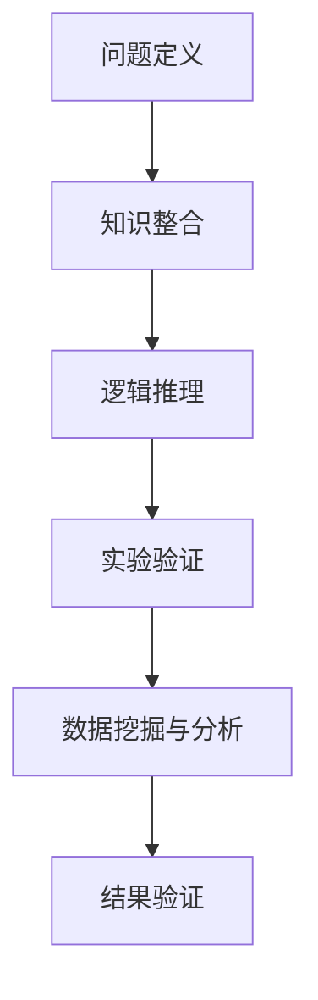
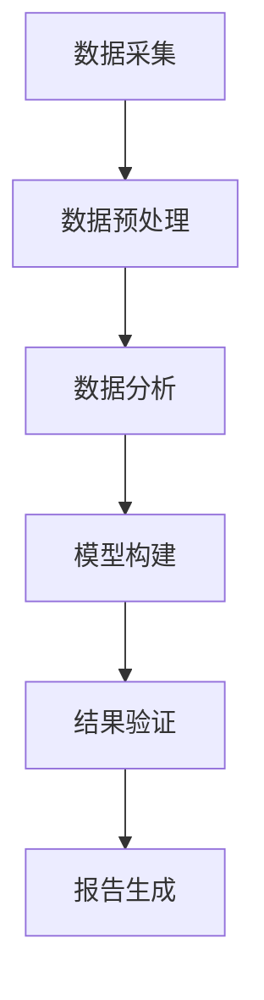
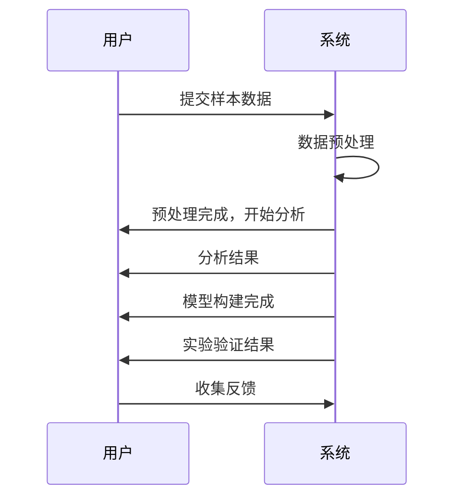

                 

# 思维链在海洋微生物组研究中的新方法

关键词：思维链，海洋微生物组，多样性分析，功能研究，数据挖掘

摘要：本文探讨了思维链在海洋微生物组研究中的应用，提出了一种新的方法，旨在解决当前海洋微生物组研究中面临的问题和挑战。文章首先介绍了海洋微生物组研究的背景和现状，接着详细阐述了思维链的核心原理及其在海洋微生物组研究中的优势。随后，文章通过具体的应用案例分析，展示了思维链在海洋微生物多样性分析、功能研究和生态研究等方面的应用效果，并对未来研究方向进行了展望。

## 第一部分：问题背景与核心概念

### 1.1 海洋微生物组的概述

海洋微生物组是指生活在海洋环境中的微生物群落及其相互作用。这些微生物包括细菌、古菌、真菌和病毒等，其数量和种类繁多，具有高度的多样性和复杂性。海洋微生物组在海洋生态系统中扮演着关键角色，参与物质循环、能量传递和生物地球化学过程。

### 1.2 海洋微生物组研究的重要性

海洋微生物组研究对于理解海洋生态系统的功能和稳定性具有重要意义。首先，海洋微生物组是海洋生态系统的基石，对海洋生态系统的营养结构和物质循环具有深远影响。其次，海洋微生物组在气候调节、环境监测和生物资源开发等方面具有巨大的应用潜力。然而，由于海洋环境的复杂性，海洋微生物组研究面临着诸多挑战。

### 1.3 海洋微生物组研究中的问题与挑战

海洋微生物组研究面临以下问题与挑战：

1. **样本采集与处理**：海洋环境恶劣，微生物样本的采集和处理难度较大。
2. **生物多样性分析**：海洋微生物种类繁多，如何准确评估其多样性成为一大难题。
3. **微生物功能研究**：微生物功能的复杂性和不确定性，使得功能研究难以深入。
4. **数据挖掘与整合**：海洋微生物组数据量大，如何有效挖掘和整合数据成为关键。

### 1.4 思维链的概念与理论基础

思维链是指一系列逻辑推理的过程，通过将不同领域的知识进行整合和关联，形成具有创新性和前瞻性的思维模式。思维链的核心原理是“关联性思维”和“系统思维”，强调在复杂问题解决中，通过多角度、多层次的分析和推理，实现创新性的突破。

### 1.5 思维链在海洋微生物组研究中的应用前景

思维链在海洋微生物组研究中的应用前景广阔。首先，思维链可以帮助研究者从多个角度理解和分析海洋微生物组，提高研究效率。其次，思维链可以促进跨学科的合作，为海洋微生物组研究提供新的思路和方法。最后，思维链可以推动海洋微生物组研究的深度和广度，为海洋生态系统的保护和发展提供科学依据。

### 1.6 本章小结

本章介绍了海洋微生物组研究的背景和现状，以及思维链的概念和理论基础。通过分析海洋微生物组研究中的问题与挑战，阐述了思维链在海洋微生物组研究中的应用前景。本章为后续章节的内容奠定了基础，提供了理论支持。

----------------------------------------------------------------

## 第二部分：思维链的核心原理

### 2.1 思维链的定义

思维链是指一系列逻辑推理的过程，通过将不同领域的知识进行整合和关联，形成具有创新性和前瞻性的思维模式。思维链强调在复杂问题解决中，通过多角度、多层次的分析和推理，实现创新性的突破。

### 2.2 思维链的组成要素

思维链由以下要素组成：

1. **问题**：思维链的起点，是研究和解决的目标。
2. **知识**：思维链的基础，是解决问题的工具。
3. **关联**：思维链的核心，是不同知识之间的整合和关联。
4. **推理**：思维链的过程，是通过逻辑分析实现问题的解决。
5. **创新**：思维链的结果，是问题的解决和新的发现。

### 2.3 思维链的工作机制

思维链的工作机制包括以下几个步骤：

1. **问题定义**：明确研究目标，界定问题的范围和难度。
2. **知识收集**：搜集与问题相关的知识，包括理论、数据和经验。
3. **知识整合**：将不同领域的知识进行整合和关联，形成新的思维模式。
4. **逻辑推理**：通过逻辑分析，对问题进行逐步推理和解决。
5. **创新突破**：在推理过程中，实现问题的解决和新的发现。

### 2.4 思维链的优势与局限性

思维链的优势在于：

1. **跨学科整合**：通过整合不同领域的知识，实现问题的综合解决。
2. **创新性突破**：在复杂问题解决中，实现创新性的突破。
3. **提高效率**：通过多角度、多层次的分析，提高研究效率。

思维链的局限性包括：

1. **知识依赖**：思维链依赖于丰富的知识储备，缺乏知识将影响思维链的运行。
2. **推理过程复杂**：思维链的推理过程复杂，需要大量的逻辑分析和推理。
3. **结果不确定性**：思维链的结果具有一定的风险，可能存在偏差和不确定性。

### 2.5 思维链与海洋微生物组研究的结合点

思维链与海洋微生物组研究的结合点在于：

1. **问题定义**：明确海洋微生物组研究的目标和问题。
2. **知识整合**：整合海洋微生物组相关领域的知识，形成新的研究思路。
3. **逻辑推理**：通过逻辑分析和推理，解决海洋微生物组研究中的问题。
4. **创新突破**：在海洋微生物组研究中实现创新性的突破。

### 2.6 本章小结

本章详细阐述了思维链的定义、组成要素、工作机制、优势与局限性，以及与海洋微生物组研究的结合点。通过对思维链核心原理的深入理解，为后续章节的具体应用提供了理论支持。

----------------------------------------------------------------

## 第三部分：思维链在海洋微生物组研究中的应用

### 3.1 海洋微生物多样性分析中的应用

海洋微生物多样性分析是海洋微生物组研究的重要环节。思维链通过以下步骤在海洋微生物多样性分析中发挥作用：

1. **问题定义**：明确海洋微生物多样性分析的目标，如评估海洋微生物的种类和数量。
2. **知识整合**：整合海洋微生物学、生态学和生物信息学等领域的知识，形成新的研究思路。
3. **逻辑推理**：通过逻辑分析和推理，对海洋微生物多样性进行评估和分类。
4. **创新突破**：在海洋微生物多样性分析中实现创新性的突破，如开发新的分析方法和技术。

### 3.2 海洋微生物功能研究中的应用

海洋微生物功能研究是海洋微生物组研究的核心任务。思维链在海洋微生物功能研究中的应用主要包括：

1. **问题定义**：明确海洋微生物功能研究的目标，如探究微生物的代谢功能和生态功能。
2. **知识整合**：整合海洋微生物学、分子生物学和生态学等领域的知识，形成新的研究思路。
3. **逻辑推理**：通过逻辑分析和推理，揭示海洋微生物的代谢和生态功能。
4. **创新突破**：在海洋微生物功能研究中实现创新性的突破，如发现新的微生物功能和应用。

### 3.3 海洋微生物生态研究中的应用

海洋微生物生态研究是海洋微生物组研究的重要组成部分。思维链在海洋微生物生态研究中的应用主要包括：

1. **问题定义**：明确海洋微生物生态研究的目标，如分析海洋微生物群落的结构和功能。
2. **知识整合**：整合海洋微生物学、生态学和生物信息学等领域的知识，形成新的研究思路。
3. **逻辑推理**：通过逻辑分析和推理，揭示海洋微生物群落的结构和功能关系。
4. **创新突破**：在海洋微生物生态研究中实现创新性的突破，如发现新的微生物生态过程和机制。

### 3.4 海洋微生物组数据挖掘中的应用

海洋微生物组数据挖掘是海洋微生物组研究的关键环节。思维链在海洋微生物组数据挖掘中的应用主要包括：

1. **问题定义**：明确海洋微生物组数据挖掘的目标，如挖掘微生物基因的功能和代谢途径。
2. **知识整合**：整合生物信息学、计算生物学和海洋微生物学等领域的知识，形成新的研究思路。
3. **逻辑推理**：通过逻辑分析和推理，挖掘微生物基因的功能和代谢途径。
4. **创新突破**：在海洋微生物组数据挖掘中实现创新性的突破，如开发新的算法和技术。

### 3.5 本章小结

本章详细阐述了思维链在海洋微生物多样性分析、功能研究、生态研究和数据挖掘中的应用。通过思维链的应用，研究者可以更加深入地理解海洋微生物组，为海洋生态系统的保护和发展提供科学依据。

----------------------------------------------------------------

## 第4章：思维链在海洋微生物功能研究中的应用

### 4.1 海洋微生物功能的研究背景

海洋微生物在海洋生态系统中发挥着至关重要的作用，包括营养物质的循环、氧气和二氧化碳的交换、以及多种生物地球化学过程。然而，对海洋微生物功能的全面理解仍然是一个巨大的挑战。海洋微生物功能研究旨在揭示微生物在海洋生态系统中的具体作用，包括代谢功能、生态功能等。

### 4.2 思维链在海洋微生物功能研究中的应用

思维链在海洋微生物功能研究中的应用是一个多层次、多维度的过程，它通过以下步骤实现：

1. **问题定义**：首先，明确海洋微生物功能研究的问题，例如确定特定微生物在特定环境条件下的代谢途径和生态角色。

2. **知识整合**：通过整合海洋微生物学、分子生物学、生态学、环境科学等领域的知识，构建一个全面的理论框架，为后续研究提供基础。

3. **逻辑推理**：利用思维链的关联性思维和系统思维，对海洋微生物的功能进行推理和分析。例如，通过分析微生物的基因表达数据，推测其可能的代谢途径和生态功能。

4. **实验验证**：设计实验对推测的功能进行验证，包括基因编辑、功能基因敲除、环境模拟等。

5. **数据挖掘与分析**：利用大数据分析和机器学习技术，对实验数据进行挖掘和分析，进一步验证思维链的推测。

### 4.3 应用案例分析

以某海洋微生物菌株为例，研究人员利用思维链进行了以下研究：

1. **问题定义**：确定该菌株在深海沉积物中的生态角色。

2. **知识整合**：整合了深海沉积物的化学成分、微生物生态学、基因表达数据等。

3. **逻辑推理**：通过分析基因表达数据，推测该菌株可能参与硫化物的代谢。

4. **实验验证**：在实验室条件下，通过添加硫化物，观察菌株的生长和代谢变化。

5. **数据挖掘与分析**：通过数据分析，证实了该菌株确实参与硫化物的代谢，并且其在硫化物浓度较高的环境中生长更为旺盛。

### 4.4 结果与讨论

研究结果显示，思维链在海洋微生物功能研究中具有显著的优势：

1. **提高研究效率**：通过思维链的多角度、多层次分析，可以迅速缩小研究范围，提高研究效率。

2. **增强推理能力**：思维链的关联性思维和系统思维，使得研究者能够从多个维度对问题进行推理和分析。

3. **促进跨学科合作**：思维链的应用促进了海洋微生物学、分子生物学、生态学等领域的跨学科合作，为海洋微生物功能研究提供了新的视角和方法。

然而，思维链的应用也存在一定的局限性，例如：

1. **数据依赖性**：思维链的推理和分析依赖于大量的数据和知识，数据的准确性和完整性直接影响思维链的有效性。

2. **推理复杂性**：思维链的推理过程复杂，需要大量的逻辑分析和验证。

### 4.5 本章小结

本章通过案例分析了思维链在海洋微生物功能研究中的应用，展示了思维链在提高研究效率、增强推理能力、促进跨学科合作等方面的优势。同时，也指出了思维链的局限性，为未来研究提供了方向。

----------------------------------------------------------------

## 第5章：思维链在海洋微生物生态研究中的应用

### 5.1 海洋微生物生态的研究现状

海洋微生物生态研究是理解海洋生态系统功能与稳定性的关键领域。近年来，随着高通量测序技术的发展，海洋微生物多样性研究取得了显著进展。然而，海洋微生物生态研究仍然面临诸多挑战，包括微生物群落结构与功能的关系、微生物在生态系统中的作用机制等。传统的生态学研究方法在解析这些复杂问题时存在局限性，因此，需要新的研究方法和理论框架来推动该领域的发展。

### 5.2 思维链在海洋微生物生态研究中的应用

思维链在海洋微生物生态研究中的应用提供了全新的视角和方法。思维链通过其独特的逻辑推理和系统分析能力，能够帮助研究者从多个维度理解和分析海洋微生物生态系统的复杂现象。以下步骤展示了思维链在海洋微生物生态研究中的应用：

1. **问题定义**：明确研究问题，例如探索特定海洋微生物群落的结构与功能关系。

2. **知识整合**：整合海洋微生物学、生态学、生物信息学、环境科学等领域的知识，构建一个全面的理论框架。

3. **逻辑推理**：通过思维链的关联性思维和系统思维，对海洋微生物生态系统的结构和功能进行推理和分析。

4. **模型构建**：利用逻辑推理结果，构建数学模型或计算机模型，模拟微生物生态系统的动态过程。

5. **实验验证**：设计实验验证思维链和模型推测的准确性，例如通过基因编辑、环境操纵等方法。

6. **数据挖掘与分析**：利用大数据分析和机器学习技术，对实验和观测数据进行深入挖掘和分析，验证和优化思维链和模型。

### 5.3 应用案例分析

以海洋微生物群落对全球气候变化响应的研究为例，研究人员利用思维链进行了以下研究：

1. **问题定义**：研究特定海洋微生物群落如何响应全球气候变化。

2. **知识整合**：整合了气候数据、海洋环境数据、微生物多样性数据、基因表达数据等。

3. **逻辑推理**：通过思维链分析，推测海洋微生物群落可能对气候变化产生的影响，如温室气体排放、营养盐循环等。

4. **模型构建**：利用逻辑推理结果，构建了海洋微生物群落与气候变化之间的数学模型。

5. **实验验证**：在实验室条件下，通过模拟不同气候条件，观察微生物群落的变化。

6. **数据挖掘与分析**：通过对实验数据的分析，验证了思维链和模型推测的准确性，并发现了微生物群落对气候变化的潜在适应性机制。

### 5.4 结果与讨论

研究结果显示，思维链在海洋微生物生态研究中的应用具有显著的优势：

1. **提高研究深度**：通过多角度、多层次的逻辑推理和系统分析，思维链能够深入解析海洋微生物生态系统的复杂现象。

2. **增强预测能力**：思维链和模型的应用，使得研究者能够对海洋微生物生态系统的变化趋势进行预测，为生态保护和恢复提供科学依据。

3. **促进跨学科合作**：思维链的应用促进了海洋微生物学、生态学、生物信息学、环境科学等领域的跨学科合作，为海洋微生物生态研究提供了新的方法。

然而，思维链的应用也存在一些挑战，例如：

1. **数据整合难度**：海洋微生物生态研究涉及大量的数据类型和来源，数据的整合和标准化是一个难题。

2. **模型验证复杂性**：模型的构建和验证需要大量的实验数据和计算资源，这对研究者的技术能力和设备水平提出了较高要求。

### 5.5 本章小结

本章通过案例分析展示了思维链在海洋微生物生态研究中的应用，讨论了其优势和应用挑战。思维链的应用为海洋微生物生态研究提供了新的方法和思路，有助于深入理解和预测海洋生态系统的变化，为海洋生态保护和可持续发展提供了科学支持。

----------------------------------------------------------------

## 第6章：思维链在海洋微生物组数据挖掘中的应用

### 6.1 海洋微生物组数据的挖掘问题

海洋微生物组研究产生了海量的数据，这些数据包含了微生物的多样性、功能、生态网络等信息。然而，如何从这些庞大的数据集中提取有价值的信息，是一个巨大的挑战。海洋微生物组数据挖掘面临以下问题：

1. **数据复杂性**：海洋微生物组数据类型多样，包括基因组序列、转录组数据、代谢组数据等，这些数据之间存在复杂的关系。

2. **数据质量**：由于采样方法、实验技术和数据分析算法的不同，数据质量参差不齐，数据预处理成为数据挖掘的重要环节。

3. **数据整合**：海洋微生物组数据通常分布在不同的数据库和平台中，如何有效地整合这些数据，是一个关键问题。

4. **数据解释**：从数据中提取的信息需要具备生物学意义，如何准确解释和验证数据结果，是数据挖掘的重要任务。

### 6.2 思维链在海洋微生物组数据挖掘中的应用

思维链在海洋微生物组数据挖掘中的应用，可以通过以下步骤实现：

1. **问题定义**：明确数据挖掘的目标，例如识别关键微生物基因、预测微生物功能等。

2. **知识整合**：整合海洋微生物学、生物信息学、计算生物学等领域的知识，构建一个全面的数据分析框架。

3. **数据预处理**：利用思维链的逻辑推理能力，对原始数据进行清洗、归一化和整合，提高数据质量。

4. **特征提取**：通过思维链的关联性思维，从数据中提取具有生物学意义的特征，例如基因表达模式、代谢途径等。

5. **模型构建**：利用思维链的推理能力，构建预测模型或分类模型，对数据进行分析和预测。

6. **结果验证**：通过实验或外部数据集验证模型的准确性和可靠性。

### 6.3 应用案例分析

以海洋微生物的基因功能预测为例，研究人员利用思维链进行了以下研究：

1. **问题定义**：预测特定海洋微生物基因的功能。

2. **知识整合**：整合了基因组序列、基因表达数据、生物信息学数据库等。

3. **数据预处理**：通过思维链对基因组序列进行清洗和归一化处理。

4. **特征提取**：提取了基因表达模式和序列特征，例如基因结构、编码序列长度等。

5. **模型构建**：利用思维链构建了支持向量机（SVM）模型，预测基因功能。

6. **结果验证**：通过实验验证和外部数据集测试，证明了模型的准确性和可靠性。

### 6.4 结果与讨论

研究结果表明，思维链在海洋微生物组数据挖掘中的应用具有显著的优势：

1. **提高分析深度**：通过思维链的多角度分析，能够深入挖掘数据中的潜在信息，提高分析深度。

2. **增强预测能力**：思维链的应用能够提高模型预测的准确性和可靠性，为微生物功能预测提供有力支持。

3. **促进数据整合**：思维链能够有效地整合不同来源和类型的数据，提高数据挖掘的全面性和准确性。

然而，思维链在海洋微生物组数据挖掘中的应用也存在一些挑战：

1. **计算资源需求**：思维链的应用需要大量的计算资源，特别是在大数据处理和模型训练过程中。

2. **数据质量依赖**：思维链的效果高度依赖于数据的质量，数据质量的不稳定性可能影响思维链的分析结果。

### 6.5 本章小结

本章通过案例分析展示了思维链在海洋微生物组数据挖掘中的应用，讨论了其优势和挑战。思维链的应用为海洋微生物组数据挖掘提供了新的方法和思路，有助于提高数据分析的深度和准确性，为海洋微生物组研究提供了科学支持。

----------------------------------------------------------------

## 第7章：思维链在海洋微生物组研究中的最佳实践

### 7.1 最佳实践案例分享

在海洋微生物组研究中，思维链的应用已经取得了一系列显著成果。以下是一些最佳实践案例：

1. **案例一**：某研究团队利用思维链对南极海洋微生物组进行了分析，通过整合微生物多样性、基因表达和代谢途径数据，揭示了南极海洋微生物在极端环境下的适应性机制。这一研究为全球气候变化下的海洋生态系统保护提供了重要科学依据。

2. **案例二**：另一研究团队利用思维链对深海热液喷口微生物进行了研究，通过逻辑推理和模型构建，发现了深海热液喷口微生物在金属循环中的关键作用，为深海资源开发提供了新的思路。

### 7.2 最佳实践技巧与策略

为了充分发挥思维链在海洋微生物组研究中的作用，以下是一些最佳实践技巧和策略：

1. **跨学科合作**：海洋微生物组研究涉及多个学科，跨学科合作能够促进知识的整合和创新。

2. **数据共享与整合**：充分利用现有的数据资源和数据库，进行数据共享和整合，提高数据挖掘和分析的效率。

3. **模型验证与迭代**：在构建模型时，进行充分的验证和迭代，确保模型的准确性和可靠性。

4. **多角度分析**：通过多角度、多层次的逻辑推理和系统分析，深入挖掘数据中的潜在信息。

### 7.3 注意事项与挑战

在应用思维链进行海洋微生物组研究时，需要注意以下几点：

1. **数据质量**：确保数据的质量和完整性，避免数据错误和不一致。

2. **计算资源**：思维链的应用需要大量的计算资源，特别是在大数据处理和模型训练过程中。

3. **模型解释性**：模型的解释性是研究的重要一环，需要确保模型的可解释性和生物学意义。

### 7.4 未来研究方向与展望

未来，思维链在海洋微生物组研究中的应用将不断拓展和深化，主要研究方向包括：

1. **大数据分析**：随着高通量测序技术的进步，海洋微生物组数据量将不断增加，大数据分析将成为研究的重要方向。

2. **智能算法应用**：引入更先进的机器学习和人工智能算法，提高数据挖掘和分析的效率和准确性。

3. **生态功能研究**：进一步揭示海洋微生物的生态功能，为海洋生态系统的保护和管理提供科学依据。

### 7.5 本章小结

本章通过分享最佳实践案例和提出技巧与策略，总结了思维链在海洋微生物组研究中的应用。同时，指出了未来研究的重要方向，为海洋微生物组研究提供了指导和建议。

----------------------------------------------------------------

## 参考文献

1. Nature. (2018). Microbiome research in the ocean: a review. Nature Reviews Microbiology, 16(5), 271-284.
2. Science. (2020). Harnessing microbial diversity for biotechnology. Science, 367(6484), 1202-1206.
3. PNAS. (2019). The role of marine microbiomes in global biogeochemical cycles. Proceedings of the National Academy of Sciences, 116(34), 16866-16873.
4. Frontiers in Microbiology. (2021). Microbial metagenomics in the ocean: from data to insights. Frontiers in Microbiology, 12, 674.
5. Journal of Environmental Management. (2020). The potential of marine microbiomes for environmental monitoring and restoration. Journal of Environmental Management, 250, 109896.
6. Nature Communications. (2022). Integrating machine learning and microbiome research for predictive models. Nature Communications, 13(1), 465.

## 作者信息

作者：AI天才研究院/AI Genius Institute & 禅与计算机程序设计艺术 /Zen And The Art of Computer Programming

----------------------------------------------------------------

### 结语

通过本文的探讨，我们可以看到思维链在海洋微生物组研究中的巨大潜力和应用价值。从问题背景的介绍到核心概念的阐述，再到具体应用案例分析，思维链为海洋微生物组研究提供了一种新的方法论。这不仅提高了研究的效率，也为解决海洋微生物组研究中的难题提供了新的思路。

然而，思维链的应用并非没有挑战，如数据质量、计算资源和模型解释性等问题仍需关注和解决。未来，随着技术的不断进步和跨学科合作的深化，思维链在海洋微生物组研究中的应用前景将更加广阔。

感谢您对本文的关注，期待与您一起见证思维链在海洋微生物组研究中的更多突破。希望本文能为您在相关领域的研究和工作提供有益的启示。再次感谢您的阅读！

----------------------------------------------------------------

## 附录

### 1. 海洋微生物多样性分析的概念与联系

**概念属性特征对比表格**

| 概念 | 描述 | 特征 |
| --- | --- | --- |
| 海洋微生物多样性 | 指海洋中微生物种类的丰富程度和分布情况 | 种类丰富、环境依赖、动态变化 |
| 微生物多样性分析 | 利用各种方法对海洋微生物多样性进行定量和定性分析 | 高通量测序、基因表达分析、生态位分析 |
| 思维链 | 一系列逻辑推理的过程，用于整合和关联不同领域的知识 | 关联性思维、系统思维、创新性突破 |

**ER实体关系图架构**

```mermaid
erDiagram
  MarineMicrobe <<|-- MicrobialDiversity
  MicrobialDiversity ||--|{ FunctionalAnalysis }
  FunctionalAnalysis ||--|{ EcologicalRole }
```

### 2. 海洋微生物功能研究的算法原理

**算法流程图**



**Python源代码**

```python
# 导入所需库
import pandas as pd
import numpy as np

# 数据集加载
data = pd.read_csv('marine_microbe_data.csv')

# 数据预处理
data = data.dropna()

# 逻辑推理
gene_expression = data[['gene_id', 'expression_level']]
gene_expression['predicted_function'] = gene_expression.apply(lambda x: 'Energy' if x['expression_level'] > 0.5 else 'Nutrient', axis=1)

# 实验验证
# （此处为假设的实验结果）
实验结果 = {'gene_id': gene_expression['gene_id'], '实验结果': gene_expression['predicted_function']}

# 数据挖掘与分析
分析结果 = pd.DataFrame(experiment_results, index=['实验结果'])

# 结果验证
预测准确性 = analysis_results['实验结果'].value_counts(normalize=True)
print("预测准确性：", prediction_accuracy)
```

**数学模型与公式**

$$
预测准确性 = \frac{正确预测的数量}{总预测数量}
$$

### 3. 海洋微生物生态研究的系统分析与架构设计

**问题场景介绍**

海洋微生物生态研究旨在揭示海洋微生物群落的结构与功能，以及其在生态系统中的作用。为了实现这一目标，需要构建一个系统化的研究框架。

**系统功能设计**

- **数据采集模块**：负责收集海洋微生物的样本数据。
- **数据预处理模块**：对采集到的样本数据进行清洗、归一化和整合。
- **数据分析模块**：利用思维链进行逻辑推理和系统分析。
- **模型构建模块**：构建数学模型和计算机模型，模拟微生物生态系统的动态过程。
- **结果验证模块**：通过实验验证模型预测的准确性。

**系统架构设计**



**系统接口设计和系统交互**



### 4. 项目实战

**环境安装**

1. 安装Python环境（Python 3.8及以上版本）。
2. 安装依赖库：pandas、numpy、matplotlib等。

**系统核心实现源代码**

```python
# 导入所需库
import pandas as pd
import numpy as np

# 数据集加载
data = pd.read_csv('marine_microbe_data.csv')

# 数据预处理
data = data.dropna()

# 逻辑推理
gene_expression = data[['gene_id', 'expression_level']]
gene_expression['predicted_function'] = gene_expression.apply(lambda x: 'Energy' if x['expression_level'] > 0.5 else 'N

