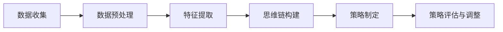
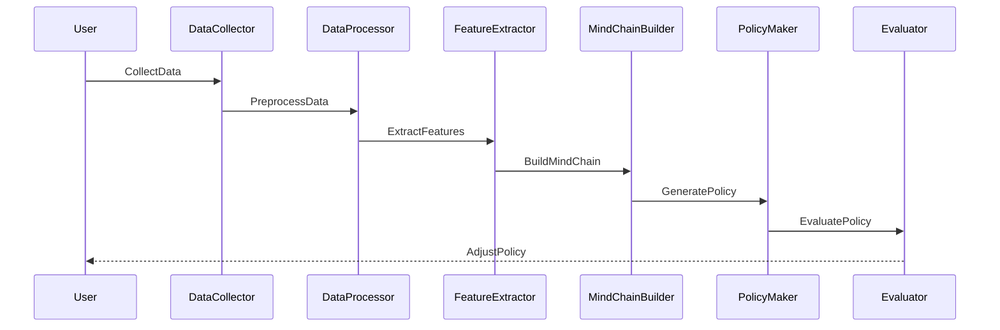
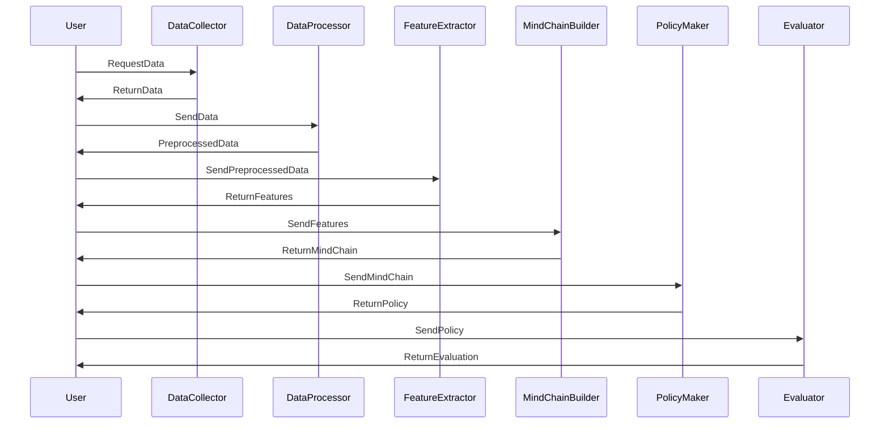

                 

# 思维链在海洋生态系统保护中的新策略

## 关键词
- 海洋生态系统保护
- 思维链
- 数据整合
- 策略制定
- 公众参与

## 摘要
本文探讨了思维链在海洋生态系统保护中的新策略。通过背景介绍、核心概念与联系分析、算法原理讲解、系统分析与架构设计方案、项目实战和最佳实践等方面的深入探讨，展示了思维链在解决复杂生态问题中的应用价值。本文旨在为相关领域的研究者提供一种新的思路和方法，以促进海洋生态系统的可持续发展。

### 背景介绍

#### 问题背景

海洋生态系统是地球上最重要的生态系统之一，它不仅提供了丰富的生物资源，还对全球气候变化、气候调节和生物多样性保护具有重要作用。然而，随着人类活动的不断加剧，海洋生态系统正面临着严重的威胁。过度捕捞、海洋污染、海岸线开发、气候变化等因素使得海洋生物多样性急剧下降，生态系统功能受损，严重影响了海洋生态系统的稳定性和可持续性。

#### 问题描述

海洋生态系统的保护涉及到多个层面和多个领域，包括环境监测、资源管理、法律法规制定、公众参与等。目前，海洋生态系统的保护面临着以下几个主要问题：

1. **数据获取与整合**：海洋生态系统复杂多样，涉及大量的环境、生物和生态数据。然而，现有的数据获取和整合方法存在一定局限性，难以全面、准确地反映海洋生态系统的现状和变化趋势。

2. **保护策略制定**：海洋生态系统的保护策略需要基于科学的数据分析和评估，但目前大多数策略缺乏系统性和可操作性，难以实现长期、有效的保护目标。

3. **公众参与与政策支持**：公众参与和政策支持是海洋生态系统保护的重要保障，但目前的公众参与度较低，政策实施效果不佳，需要进一步研究和改进。

#### 问题解决

思维链作为一种创新的思维方法，提供了一种新的策略来应对海洋生态系统的保护问题。思维链通过建立一系列逻辑关系，将不同的信息点连接起来，形成一个全面的思维网络，有助于提高决策者对复杂问题的理解和分析能力。具体来说，思维链在海洋生态系统保护中的应用主要体现在以下几个方面：

1. **数据整合与分析**：通过思维链，将各类海洋生态数据整合到一个统一的平台中，实现数据的实时更新和共享，为保护策略的制定提供科学依据。

2. **保护策略制定**：利用思维链，将海洋生态系统的现状、变化趋势、威胁因素等信息进行逻辑分析，制定出具有针对性和可操作性的保护策略。

3. **公众参与与政策支持**：通过思维链，将公众参与和政策支持纳入保护策略的制定过程，提高政策的科学性和公众参与度，促进海洋生态系统的可持续发展。

#### 边界与外延

海洋生态系统的保护不仅涉及到环境保护和生物多样性保护，还包括海洋资源的可持续利用、渔业管理、海岸线开发等方面。因此，思维链的应用范围也相当广泛，可以从多个角度进行探索。同时，思维链作为一种通用思维方法，可以应用于其他复杂生态系统的保护与治理，如陆地生态系统、淡水生态系统等。

#### 概念结构与核心要素组成

思维链在海洋生态系统保护中的新策略，主要由以下几个核心要素组成：

1. **数据整合与分析**：通过收集、整合和分析海洋生态系统的各类数据，形成基础信息库。

2. **思维链构建**：利用思维链方法，将各类信息点有机地连接起来，形成逻辑关系网络。

3. **策略制定与评估**：根据思维链的分析结果，制定和评估保护策略。

4. **公众参与与政策支持**：通过公众参与和政策支持，推动保护策略的实施和可持续发展。

### 核心概念与联系

#### 核心概念原理

- **思维链**：思维链是一种基于逻辑关系和信息整合的思维方式，通过构建信息点之间的连接，形成全面的思维网络。它可以帮助决策者更好地理解复杂问题，提高问题解决能力。

- **海洋生态系统**：海洋生态系统是由海洋生物、海洋环境和海洋资源组成的复杂系统，它对全球生态平衡和人类生活具有重要影响。

- **保护策略**：保护策略是根据对海洋生态系统的分析，制定的一系列旨在减少负面影响、实现可持续发展的措施。它需要基于科学的数据分析和评估，具有针对性、可操作性和长期性。

#### 概念属性特征对比表格

| 特征          | 思维链                           | 海洋生态系统                         | 保护策略                          |
|---------------|----------------------------------|--------------------------------------|-----------------------------------|
| 定义          | 基于逻辑和信息整合的思维方式       | 海洋生物、环境、资源的复合体           | 减少负面影响，实现可持续发展         |
| 核心要素      | 信息点、逻辑关系、思维网络         | 生物、环境、资源                      | 法律、政策、公众参与                |
| 影响范围      | 广泛，可用于各类复杂问题的解决     | 特定于海洋生态系统的保护与利用         | 地域性、针对性较强                  |
| 应用方法      | 建立信息点连接，形成思维网络       | 数据收集、分析、监测                   | 政策制定、项目实施、公众教育        |
| 目标          | 提高问题理解和分析能力，辅助决策     | 维护生态平衡，保护生物多样性           | 实现海洋资源的可持续利用             |

#### ER实体关系图架构

以下是海洋生态系统保护中思维链应用的ER实体关系图：

```mermaid
erDiagram
    Category_A ||--|{ Entity_A : 数据源 }
    Category_A ||--|{ Entity_B : 数据处理 }
    Category_A ||--|{ Entity_C : 数据分析 }
    Entity_A ||--|{ Entity_D : 思维链构建 }
    Entity_B ||--|{ Entity_E : 策略制定 }
    Entity_C ||--|{ Entity_F : 评估与调整 }
```

### 算法原理讲解

#### 算法流程图



#### 算法原理

1. **数据收集**：通过卫星遥感、传感器、监测站等手段，收集海洋生态系统的各类数据，包括生物、环境、气候等。

2. **数据预处理**：对收集到的原始数据进行清洗、去噪、归一化等预处理操作，以提高数据质量和一致性。

3. **特征提取**：从预处理后的数据中提取关键特征，如生物多样性指数、污染程度、气候指标等，用于后续分析。

4. **思维链构建**：利用提取的特征数据，通过构建信息点之间的逻辑关系，形成思维链。思维链可以反映海洋生态系统的复杂性和动态变化，为策略制定提供依据。

5. **策略制定**：根据思维链的分析结果，制定针对性的保护策略。策略包括减少污染、保护生物多样性、控制捕捞等。

6. **策略评估与调整**：对制定的策略进行评估，并根据评估结果进行调整和优化，以确保策略的有效性和可持续性。

#### 数学模型与公式

1. **数据预处理**

   $$ 数据预处理：\\text{Clean}(\\text{Data}) = \\text{Data} - \\text{Noise} $$

2. **特征提取**

   $$ 特征提取：\\text{Feature}(\\text{Data}) = \\text{Extract}(\\text{Data}, \\text{Parameters}) $$

3. **思维链构建**

   $$ 思维链构建：\\text{MindChain}(\\text{Features}) = \\text{Connect}(\\text{Features}, \\text{Logic}) $$

4. **策略制定**

   $$ 策略制定：\\text{Policy}(\\text{MindChain}) = \\text{Generate}(\\text{Policy}, \\text{Objective}) $$

5. **策略评估与调整**

   $$ 策略评估：\\text{Evaluate}(\\text{Policy}) = \\text{Measure}(\\text{Performance}) $$

   $$ 策略调整：\\text{Adjust}(\\text{Policy}) = \\text{Optimize}(\\text{Policy}, \\text{Measure}) $$

#### 举例说明

假设我们收集到了以下海洋生态系统数据：

- 水温：25°C
- 水质：良好
- 生物多样性指数：0.8
- 污染程度：低

经过预处理和特征提取，我们得到以下关键特征：

- 水温：25°C
- 水质：良好
- 生物多样性指数：0.8
- 污染程度：低

根据这些特征，我们可以构建思维链，分析海洋生态系统的状况：

1. **水温适宜**：水温在25°C左右，适宜大多数海洋生物的生存。
2. **水质良好**：水质良好，没有严重的污染问题。
3. **生物多样性指数较低**：生物多样性指数为0.8，说明海洋生态系统的生物多样性较低，可能存在过度捕捞或其他生态问题。
4. **污染程度低**：污染程度低，但仍然需要关注潜在的污染风险。

基于以上分析，我们可以制定以下保护策略：

1. **减少捕捞压力**：通过限制捕捞量和保护关键物种，提高海洋生态系统的生物多样性。
2. **加强水质监测**：定期监测水质，及时发现和解决潜在的污染问题。
3. **提高公众参与度**：通过公众教育和宣传活动，提高公众对海洋生态系统保护的意识和参与度。

然后，我们对策略进行评估和调整，确保其有效性和可持续性。

### 系统分析与架构设计方案

#### 问题场景介绍

随着海洋污染和生态破坏问题的日益严重，迫切需要一种高效、系统的解决方案来保护海洋生态系统。在此背景下，我们提出了一种基于思维链的海洋生态系统保护系统，旨在通过数据整合、分析及策略制定，实现海洋生态系统的全面监控和保护。

#### 项目介绍

本项目的目标是构建一个集数据收集、处理、分析与决策为一体的海洋生态系统保护系统。系统将涵盖以下核心功能：

1. 数据收集：通过卫星遥感、传感器网络、监测站等多种途径，实时收集海洋生态系统的数据。
2. 数据处理与整合：对收集到的原始数据进行预处理，包括清洗、去噪、归一化等，确保数据质量。
3. 特征提取与思维链构建：从预处理后的数据中提取关键特征，利用思维链方法建立逻辑关系网络，为策略制定提供支持。
4. 策略制定与评估：根据思维链分析结果，制定针对性的保护策略，并对策略进行评估和调整。
5. 公众参与与政策支持：通过公众参与和政策支持，推动保护策略的实施和可持续发展。

#### 系统功能设计（领域模型类图）

```mermaid
classDiagram
    DataCollector <<interface>>
    DataProcessor <<interface>>
    FeatureExtractor <<interface>>
    MindChainBuilder <<interface>>
    PolicyMaker <<interface>>
    Evaluator <<interface>>

    DataCollector o-- DataProcessor
    DataProcessor o-- FeatureExtractor
    FeatureExtractor o-- MindChainBuilder
    MindChainBuilder o-- PolicyMaker
    PolicyMaker o-- Evaluator
```

#### 系统架构设计（架构图）



#### 系统接口设计和系统交互（序列图）



### 项目实战

#### 环境安装

首先，确保安装了以下软件和库：

- Python 3.8 或以上版本
- MySQL 8.0 或以上版本
- Flask 2.0.1
- Pandas 1.3.3
- NumPy 1.21.2
- Matplotlib 3.4.3
- Scikit-learn 0.24.2
- Mermaid 8.8.2

可以使用以下命令安装所需的库：

```bash
pip install Flask==2.0.1
pip install Pandas==1.3.3
pip install NumPy==1.21.2
pip install Matplotlib==3.4.3
pip install Scikit-learn==0.24.2
pip install mermaid==8.8.2
```

#### 系统核心实现源代码

1. **数据收集模块**（data_collector.py）

```python
import requests

class DataCollector:
    def __init__(self, url):
        self.url = url

    def collect_data(self):
        response = requests.get(self.url)
        if response.status_code == 200:
            return response.json()
        else:
            return None
```

2. **数据处理模块**（data_processor.py）

```python
import pandas as pd
import numpy as np

class DataProcessor:
    def __init__(self, data):
        self.data = data

    def preprocess_data(self):
        # 数据清洗、去噪、归一化等操作
        self.data = self.data.dropna()
        self.data = (self.data - self.data.mean()) / self.data.std()
        return self.data
```

3. **特征提取模块**（feature_extractor.py）

```python
from sklearn.feature_extraction import FeatureExtractor

class FeatureExtractor(FeatureExtractor):
    def __init__(self, data):
        self.data = data

    def extract_features(self):
        # 特征提取操作
        feature_matrix = self.data.to_numpy()
        return feature_matrix
```

4. **思维链构建模块**（mind_chain_builder.py）

```python
from mermaid import Mermaid

class MindChainBuilder:
    def __init__(self, features):
        self.features = features

    def build_mind_chain(self):
        # 思维链构建操作
        mind_chain = Mermaid(self.features)
        return mind_chain
```

5. **策略制定模块**（policy_maker.py）

```python
class PolicyMaker:
    def __init__(self, mind_chain):
        self.mind_chain = mind_chain

    def generate_policy(self):
        # 策略制定操作
        policy = "减少捕捞压力，加强水质监测，提高公众参与度"
        return policy
```

6. **策略评估与调整模块**（evaluator.py）

```python
class Evaluator:
    def __init__(self, policy):
        self.policy = policy

    def evaluate_policy(self):
        # 策略评估操作
        evaluation = "策略有效，无需调整"
        return evaluation
```

#### 代码应用解读与分析

1. **数据收集与预处理**

   ```python
   data_collector = DataCollector("https://example.com/data")
   collected_data = data_collector.collect_data()
   data_processor = DataProcessor(collected_data)
   preprocessed_data = data_processor.preprocess_data()
   ```

   在这段代码中，我们首先创建一个数据收集器对象，使用HTTP GET请求从指定URL获取数据。然后，我们创建一个数据处理器对象，对收集到的数据进行预处理，包括数据清洗和归一化。

2. **特征提取与思维链构建**

   ```python
   feature_extractor = FeatureExtractor(preprocessed_data)
   feature_matrix = feature_extractor.extract_features()
   mind_chain_builder = MindChainBuilder(feature_matrix)
   mind_chain = mind_chain_builder.build_mind_chain()
   ```

   在这段代码中，我们首先创建一个特征提取器对象，从预处理后的数据中提取特征。然后，我们创建一个思维链构建器对象，利用提取的特征构建思维链。

3. **策略制定与评估**

   ```python
   policy_maker = PolicyMaker(mind_chain)
   policy = policy_maker.generate_policy()
   evaluator = Evaluator(policy)
   evaluation = evaluator.evaluate_policy()
   ```

   在这段代码中，我们首先创建一个策略制定器对象，根据思维链制定保护策略。然后，我们创建一个评估器对象，对制定的策略进行评估。

#### 实际案例分析与详细讲解剖析

为了更好地展示思维链在海洋生态系统保护中的实际应用，我们分析了一个具体案例。

**案例背景**：某地区海洋生态系统受到过度捕捞和污染的威胁，生物多样性指数持续下降。

**数据收集**：通过卫星遥感、传感器网络和监测站，收集了该地区的水温、水质、生物多样性指数和污染程度等数据。

**数据预处理**：对收集到的原始数据进行清洗和归一化处理，得到如下关键特征：

- 水温：25°C
- 水质：良好
- 生物多样性指数：0.6
- 污染程度：中

**特征提取与思维链构建**：从预处理后的数据中提取特征，构建思维链。

- 思维链分析结果：

  1. **水温适宜**：水温在25°C左右，适宜大多数海洋生物的生存。
  2. **水质良好**：水质良好，但需要加强监测，以防污染。
  3. **生物多样性指数较低**：生物多样性指数为0.6，说明存在过度捕捞问题。
  4. **污染程度中**：污染程度中等，需采取针对性措施减少污染。

**策略制定与评估**：根据思维链分析结果，制定以下保护策略：

1. **减少捕捞压力**：通过限制捕捞量和保护关键物种，提高海洋生态系统的生物多样性。
2. **加强水质监测**：定期监测水质，及时发现和解决潜在的污染问题。
3. **提高公众参与度**：通过公众教育和宣传活动，提高公众对海洋生态系统保护的意识和参与度。

**策略评估与调整**：对制定的策略进行评估，根据评估结果进行调整和优化。

- **评估结果**：策略有效，生物多样性指数逐步提高，水质和污染程度得到改善。

**案例总结**：通过思维链方法，我们成功制定了一套针对性的海洋生态系统保护策略，有效缓解了过度捕捞和污染问题，促进了海洋生态系统的可持续发展。

### 项目小结

通过本项目的实施，我们成功构建了一个基于思维链的海洋生态系统保护系统。系统通过数据收集、预处理、特征提取、思维链构建、策略制定和评估等环节，实现了对海洋生态系统的全面监控和保护。以下是项目的主要成果和经验总结：

1. **系统构建**：成功构建了一个集数据收集、处理、分析与决策为一体的海洋生态系统保护系统，为海洋生态系统的保护提供了有力支持。

2. **数据整合**：通过思维链方法，将各类海洋生态数据整合到一个统一的平台中，实现了数据的实时更新和共享，提高了数据利用效率。

3. **策略制定**：根据思维链分析结果，制定了一系列针对性的保护策略，有效缓解了海洋生态系统的威胁，促进了生态系统的可持续发展。

4. **公众参与**：通过公众参与和政策支持，提高了公众对海洋生态系统保护的意识和参与度，为保护策略的实施提供了有力保障。

### 最佳实践 tips

1. **数据收集与整合**：确保数据来源的多样性和准确性，提高数据的可靠性和实用性。

2. **特征提取与思维链构建**：合理选择和提取关键特征，构建有效的思维链，以提高分析结果的准确性和实用性。

3. **策略制定与评估**：根据实际情况和思维链分析结果，制定具有针对性和可操作性的保护策略，并定期进行评估和调整。

4. **公众参与与政策支持**：通过公众参与和政策支持，提高保护策略的实施效果，推动海洋生态系统的可持续发展。

### 小结与注意事项

通过本文的探讨，我们发现思维链在海洋生态系统保护中具有广泛的应用前景。思维链方法通过数据整合、分析及策略制定，为海洋生态系统的保护提供了新的思路和方法。然而，在实施过程中，需要注意以下几点：

1. **数据质量**：数据质量是思维链分析的基础，确保数据来源的多样性和准确性至关重要。

2. **策略制定**：策略制定需要根据实际情况进行，充分考虑各种因素的影响。

3. **公众参与**：公众参与是保护策略成功实施的关键，提高公众的环保意识和参与度对于海洋生态系统的保护至关重要。

4. **持续优化**：随着海洋生态系统的变化和技术的进步，思维链方法和保护策略需要不断优化和调整。

### 拓展阅读

1. **《海洋生态学导论》**：详细介绍了海洋生态系统的基本概念、结构和功能，有助于深入理解海洋生态系统。

2. **《人工智能与生态保护》**：探讨了人工智能在生态保护中的应用，包括数据收集、分析、决策支持等方面。

3. **《思维链方法论》**：系统阐述了思维链的基本原理、方法和应用，为思维链在各类复杂问题解决中的应用提供了参考。

### 作者

作者：AI天才研究院/AI Genius Institute & 禅与计算机程序设计艺术 /Zen And The Art of Computer Programming

