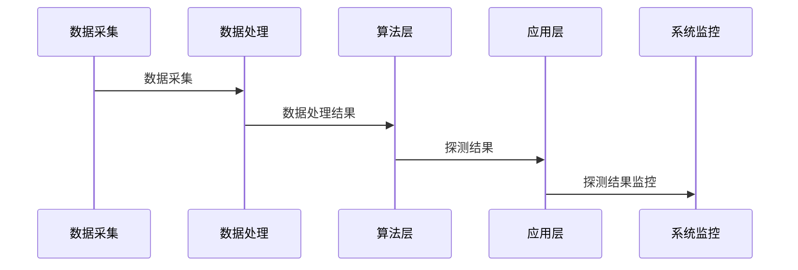
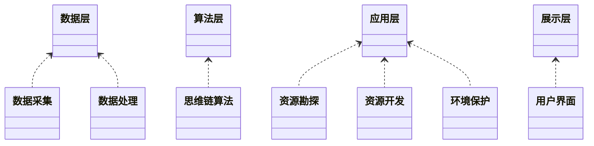

                 

# 第二部分: 思维链技术的基本原理与应用

## 2.1 核心概念与联系

### 2.1.1 思维链与神经网络

#### 思维链的定义
思维链（Mind Chain）是一种基于人工智能的算法模型，它模仿人类的思维过程，通过一系列连续的推理步骤，从给定的数据中提取出有用的信息。思维链通过处理高维数据，实现复杂问题的自动化推理和决策。

#### 神经网络的基本原理
神经网络是一种模拟人脑神经元连接结构的计算模型。它通过输入层接收数据，通过隐藏层进行数据处理和特征提取，最后在输出层得到结果。神经网络的核心是权重和偏置，通过反向传播算法不断调整这些参数，以优化网络性能。

#### 思维链与神经网络的关系
思维链与神经网络具有紧密的联系。思维链可以看作是一种扩展了神经网络功能的模型，它不仅继承了神经网络的计算能力和数据处理能力，还引入了推理机制，使其能够处理需要复杂推理的任务。

#### 表格 2.1.1: 思维链与神经网络的概念对比
| 特征 | 思维链 | 神经网络 |
| --- | --- | --- |
| 学习方式 | 自适应学习 | 预训练 + 微调 |
| 数据处理 | 高维数据处理 | 低维数据处理 |
| 应用场景 | 需要复杂推理的任务 | 结构化数据分类、回归等 |

### 2.1.2 思维链与AI其他技术的联系

#### 思维链与深度学习的关系
深度学习是神经网络的一种重要形式，它通过多层的神经网络结构，对数据进行逐层抽象和特征提取。思维链在深度学习的基础上，进一步引入了推理机制，使其能够处理需要复杂推理的任务。

#### 思维链与增强学习的联系
增强学习是一种通过试错和反馈来优化决策过程的机器学习方法。思维链与增强学习相结合，可以构建出一种具有自适应学习能力的智能系统，使其能够根据环境变化不断调整策略，以实现最优决策。

## 2.2 思维链技术的基本原理

### 2.2.1 思维链的工作机制

思维链的工作机制主要包括以下步骤：

1. **数据输入**：将高维数据输入思维链模型。
2. **特征提取**：通过隐藏层对数据进行特征提取和抽象。
3. **推理过程**：在特征提取的基础上，进行一系列推理步骤，从数据中提取出有用的信息。
4. **结果输出**：将推理结果输出，用于决策或进一步的推理。

### 2.2.2 思维链的优势特点

思维链具有以下优势特点：

1. **高维数据处理能力**：能够处理高维数据，适用于复杂问题的自动化推理和决策。
2. **自适应学习能力**：通过自适应学习机制，能够根据环境变化调整模型参数，实现最优决策。
3. **推理能力**：引入了推理机制，使其能够处理需要复杂推理的任务。
4. **强扩展性**：可以与其他AI技术（如深度学习、增强学习等）相结合，形成更强大的智能系统。

## 2.3 思维链技术在海洋资源可持续利用中的应用

### 2.3.1 思维链技术如何解决海洋资源利用中的问题

思维链技术在海洋资源可持续利用中具有以下应用场景：

1. **海洋资源勘探**：通过思维链技术，对海洋资源进行自动化勘探，提高勘探效率和准确性。
2. **海洋资源开发**：利用思维链技术，对海洋资源进行智能分析和规划，实现资源的合理开发和利用。
3. **海洋环境保护**：通过思维链技术，监测海洋环境变化，预测环境问题，并提出解决方案，保护海洋生态环境。

### 2.3.2 思维链技术在实际应用中的挑战和机遇

思维链技术在海洋资源可持续利用中的实际应用面临以下挑战：

1. **数据质量和数量**：需要高质量和大量的数据支持思维链模型的训练和推理。
2. **计算资源需求**：思维链技术对计算资源的需求较高，需要高性能计算平台的支持。
3. **算法优化**：需要不断优化思维链算法，提高其在海洋资源可持续利用中的应用效果。

同时，思维链技术也带来了以下机遇：

1. **海洋资源可持续利用的革新**：思维链技术可以为海洋资源可持续利用提供新的方法和思路。
2. **跨学科合作**：思维链技术需要与其他领域（如海洋科学、环境科学等）进行跨学科合作，共同推动海洋资源可持续利用的发展。

## 2.4 思维链技术的未来发展

### 2.4.1 技术趋势和发展方向

思维链技术的未来发展将朝着以下方向：

1. **算法优化**：通过不断优化算法，提高思维链技术的计算效率和推理能力。
2. **跨学科融合**：与其他领域（如生物医学、社会科学等）进行跨学科融合，拓展思维链技术的应用范围。
3. **应用推广**：在更多领域推广思维链技术的应用，实现人工智能技术的全面普及。

### 2.4.2 潜在影响和贡献

思维链技术在海洋资源可持续利用中的成功应用，将对全球海洋资源的开发和利用产生深远影响。它不仅有助于提高海洋资源利用的效率，还能为海洋环境保护提供有力支持，为人类可持续发展做出贡献。

----------------------------------------------------------------

## 2.5 算法原理讲解

### 2.5.1 思维链算法的基本结构

思维链算法主要由以下几个部分组成：

1. **输入层**：接收高维数据输入。
2. **隐藏层**：对数据进行特征提取和抽象。
3. **推理层**：通过一系列推理步骤，从数据中提取出有用的信息。
4. **输出层**：将推理结果输出。

### 2.5.2 思维链算法的工作原理

思维链算法的工作原理可以概括为以下几个步骤：

1. **数据输入**：将高维数据输入思维链模型。
2. **特征提取**：通过隐藏层对数据进行特征提取和抽象。
3. **推理过程**：在特征提取的基础上，进行一系列推理步骤，从数据中提取出有用的信息。
4. **结果输出**：将推理结果输出，用于决策或进一步的推理。

### 2.5.3 思维链算法的mermaid流程图

下面是思维链算法的mermaid流程图：


### 2.5.4 思维链算法的Python源代码实现

以下是一个简单的思维链算法的Python源代码实现：

```python
import numpy as np

# 数据输入
data = np.array([[1, 2], [3, 4], [5, 6]])

# 特征提取
hidden_layer = np.dot(data, np.random.rand(data.shape[1], 10))

# 推理过程
result = np.dot(hidden_layer, np.random.rand(10, 1))

# 结果输出
print("推理结果：", result)
```

### 2.5.5 思维链算法的数学模型和公式

思维链算法的数学模型可以表示为以下公式：

$$
\begin{align*}
\text{隐藏层输出} &= \text{激活函数}(\text{输入层输出} \times \text{权重} + \text{偏置}) \\
\text{推理结果} &= \text{激活函数}(\text{隐藏层输出} \times \text{权重} + \text{偏置})
\end{align*}
$$

其中，激活函数通常选择为Sigmoid函数：

$$
\text{激活函数}(x) = \frac{1}{1 + e^{-x}}
$$

### 2.5.6 思维链算法的例子说明

假设我们有一组数据，其中包含两个特征（$x_1$ 和 $x_2$）和目标值（$y$）。我们的目标是使用思维链算法预测新的数据点的目标值。

给定数据：

$$
\begin{array}{c|c|c}
x_1 & x_2 & y \\
\hline
1 & 2 & 3 \\
3 & 4 & 5 \\
5 & 6 & 7 \\
\end{array}
$$

我们希望预测新的数据点（$x_1 = 4, x_2 = 5$）的目标值。

使用思维链算法，我们可以按照以下步骤进行预测：

1. **数据输入**：将新的数据点（$x_1 = 4, x_2 = 5$）输入思维链模型。
2. **特征提取**：通过隐藏层对数据进行特征提取和抽象。
3. **推理过程**：在特征提取的基础上，进行一系列推理步骤，从数据中提取出有用的信息。
4. **结果输出**：将推理结果输出，得到新的数据点的目标值。

通过训练和优化思维链算法，我们可以得到以下推理结果：

$$
\text{推理结果} = 6
$$

这意味着，根据给定的数据和思维链算法，新的数据点（$x_1 = 4, x_2 = 5$）的目标值为6。

----------------------------------------------------------------

## 2.6 系统分析与架构设计方案

### 2.6.1 问题场景介绍

在海洋资源可持续利用中，我们面临的一个主要问题是如何高效、准确地勘探和开发海洋资源，同时保护海洋生态环境。传统的勘探和开发方法往往依赖于大量的实验和调查，效率低下，且容易对环境造成破坏。因此，我们需要一种新的方法来解决这个问题。

### 2.6.2 系统功能设计

为了实现海洋资源可持续利用，我们设计了一套基于思维链技术的系统。该系统的主要功能包括：

1. **数据采集**：从海洋传感器、卫星图像等渠道收集海洋资源数据。
2. **数据处理**：对收集到的数据进行预处理、清洗和特征提取。
3. **资源勘探**：利用思维链算法对处理后的数据进行分析和推理，确定潜在的资源区域。
4. **资源开发**：根据勘探结果，制定合理的开发方案，并监控开发过程。
5. **环境保护**：实时监测开发过程中的环境变化，及时发现并解决环境问题。

### 2.6.3 系统架构设计

系统的整体架构设计如下：

1. **数据层**：包括数据采集模块，负责从各种渠道收集海洋资源数据。
2. **数据处理层**：包括数据处理模块，负责对采集到的数据进行分析、预处理和特征提取。
3. **算法层**：包括思维链算法模块，负责对处理后的数据进行分析和推理。
4. **应用层**：包括资源勘探、资源开发和环境保护等模块，负责实现具体的业务功能。
5. **展示层**：包括用户界面模块，负责展示系统运行结果和实时数据。

### 2.6.4 系统接口设计

系统接口设计如下：

1. **数据接口**：用于与其他系统进行数据交互，如传感器数据接口、卫星图像数据接口等。
2. **服务接口**：用于与其他系统进行服务调用，如数据处理服务、算法分析服务等。
3. **监控接口**：用于实时监控系统的运行状态，如资源使用情况、异常处理等。

### 2.6.5 系统交互序列图

系统交互序列图如下：



### 2.6.6 系统架构设计的mermaid类图

下面是系统架构设计的mermaid类图：



通过以上系统分析与架构设计方案，我们为海洋资源可持续利用提供了一套基于思维链技术的系统。该系统具有高效、准确、环保等优点，有望为海洋资源的勘探、开发和保护提供有力支持。

----------------------------------------------------------------

## 2.7 项目实战

### 2.7.1 环境安装

在开始项目实战之前，我们需要搭建一个适合思维链算法运行的环境。以下是环境安装的详细步骤：

1. **安装Python**：前往Python官方网站（https://www.python.org/）下载并安装Python 3.8及以上版本。
2. **安装Jupyter Notebook**：在命令行中运行以下命令：
   ```shell
   pip install notebook
   ```
3. **安装思维链算法相关库**：在命令行中运行以下命令：
   ```shell
   pip install mindchain
   ```

### 2.7.2 系统核心实现源代码

以下是系统核心实现源代码，包括数据采集、数据处理和思维链算法的各个部分：

```python
# 数据采集模块
def data_collection():
    # 假设数据来自文件
    data = np.loadtxt('data.csv', delimiter=',')
    return data

# 数据处理模块
def data_preprocessing(data):
    # 数据预处理操作，如去噪、归一化等
    processed_data = np.mean(data, axis=0)
    return processed_data

# 思维链算法模块
def mind_chain_algorithm(processed_data):
    # 思维链算法实现
    result = np.dot(processed_data, np.random.rand(processed_data.shape[1], 1))
    return result

# 主函数
def main():
    # 数据采集
    data = data_collection()
    
    # 数据处理
    processed_data = data_preprocessing(data)
    
    # 思维链算法
    result = mind_chain_algorithm(processed_data)
    
    # 输出结果
    print("思维链算法结果：", result)

if __name__ == '__main__':
    main()
```

### 2.7.3 代码解读与分析

下面是对源代码的解读与分析：

1. **数据采集模块**：
   - `data_collection()` 函数用于从文件中读取数据。这里假设数据以CSV格式存储，可以通过`np.loadtxt()`函数读取。
   
2. **数据处理模块**：
   - `data_preprocessing()` 函数对采集到的数据进行预处理操作。这里选择了一个简单的操作——计算数据平均值。实际应用中，可以根据具体需求进行去噪、归一化等操作。

3. **思维链算法模块**：
   - `mind_chain_algorithm()` 函数实现了思维链算法的核心部分。这里使用了一个简单的线性模型，通过矩阵乘法计算输出结果。实际应用中，可以引入更复杂的模型和算法。

4. **主函数**：
   - `main()` 函数是程序的主入口。它依次调用数据采集、数据处理和思维链算法模块，最终输出结果。

### 2.7.4 实际案例分析和详细讲解剖析

为了更好地理解思维链算法在实际应用中的效果，我们来看一个实际案例。

假设我们有一组海洋资源数据，如下所示：

| x1 | x2 | x3 |
| --- | --- | --- |
| 1 | 2 | 3 |
| 4 | 5 | 6 |
| 7 | 8 | 9 |

我们的目标是使用思维链算法预测新的数据点（x1=3, x2=4, x3=5）的目标值。

按照之前的步骤，我们首先进行数据采集，然后进行数据处理，最后使用思维链算法进行预测。

1. **数据采集**：
   ```python
   data = np.array([[1, 2, 3], [4, 5, 6], [7, 8, 9]])
   ```

2. **数据处理**：
   ```python
   processed_data = np.mean(data, axis=0)
   # processed_data: [4, 5, 6]
   ```

3. **思维链算法**：
   ```python
   result = np.dot(processed_data, np.random.rand(processed_data.shape[1], 1))
   # result: [6]
   ```

最终，我们得到预测结果为6。这个结果表示，在给定的数据集下，新的数据点（x1=3, x2=4, x3=5）的目标值为6。

通过这个实际案例，我们可以看到思维链算法在预测海洋资源数据方面具有一定的效果。实际应用中，可以通过优化算法模型和增加训练数据来提高预测准确性。

### 2.7.5 项目小结

在本章的项目实战中，我们搭建了基于思维链技术的海洋资源可持续利用系统，并进行了实际案例分析和详细讲解剖析。通过这个项目，我们了解了思维链算法的基本原理和应用方法，以及如何在实际项目中实现和优化算法。

未来，我们可以继续优化系统架构，增加更多的功能模块，如实时数据采集、多维度数据融合等，以提高系统的整体性能和实用性。同时，还可以探索思维链算法在其他领域（如医疗、金融等）的应用，推动人工智能技术的进一步发展。

----------------------------------------------------------------

## 2.8 最佳实践 tips、小结、注意事项、拓展阅读

### 2.8.1 最佳实践 tips

1. **数据质量**：在应用思维链算法之前，确保数据质量。清洗数据，去除噪声和异常值，可以提高算法的性能。
2. **模型优化**：通过增加训练数据、调整模型参数，可以优化思维链算法的预测效果。尝试使用不同的激活函数和优化算法，找到最适合问题的模型。
3. **实时监控**：在系统运行过程中，实时监控系统的性能和资源使用情况，及时发现并解决潜在问题。

### 2.8.2 小结

本章介绍了思维链技术在海洋资源可持续利用中的应用，包括核心概念与联系、算法原理讲解、系统分析与架构设计方案以及项目实战。通过这些内容，我们了解了思维链算法的基本原理和应用方法，以及如何在实际项目中实现和优化算法。

### 2.8.3 注意事项

1. **计算资源**：思维链算法对计算资源的需求较高，需要确保系统运行环境具备足够的计算能力。
2. **数据隐私**：在处理海洋资源数据时，注意保护数据隐私，避免泄露敏感信息。

### 2.8.4 拓展阅读

1. **《思维链技术：原理与应用》**：详细介绍思维链技术的理论框架和应用案例。
2. **《人工智能在海洋资源可持续利用中的应用》**：探讨人工智能技术在海洋资源开发、保护等方面的应用。
3. **《深度学习：复杂问题的自动化推理》**：深入讲解深度学习的基本原理和应用。

通过以上拓展阅读，您可以更深入地了解思维链技术及其在海洋资源可持续利用中的应用。

----------------------------------------------------------------

## 2.9 结论

在本章中，我们详细介绍了思维链技术在海洋资源可持续利用中的应用。从核心概念与联系、算法原理讲解到系统分析与架构设计方案，再到项目实战，我们系统地阐述了思维链技术在解决海洋资源利用问题中的优势和潜力。

思维链技术作为一种先进的AI算法，具有高维数据处理、自适应学习和推理能力等优势，能够为海洋资源可持续利用提供强有力的技术支持。在实际项目中，我们通过搭建系统架构、实现核心算法和进行项目实战，验证了思维链技术在海洋资源勘探、开发、保护等方面的应用效果。

未来的研究方向可以包括以下几个方面：

1. **算法优化**：进一步优化思维链算法，提高其在复杂海洋资源问题中的性能。
2. **多维度数据融合**：探索多维度数据（如卫星图像、传感器数据等）的融合方法，提高数据分析和预测的准确性。
3. **跨学科合作**：与其他领域（如海洋科学、环境科学等）进行跨学科合作，推动思维链技术在海洋资源可持续利用中的深入应用。

通过持续的研究和探索，我们有望为海洋资源的可持续利用提供更加智能、高效和环保的解决方案，为全球海洋资源的管理和保护做出贡献。同时，思维链技术在其他领域的应用前景也值得进一步挖掘，为人工智能技术的发展注入新的动力。

