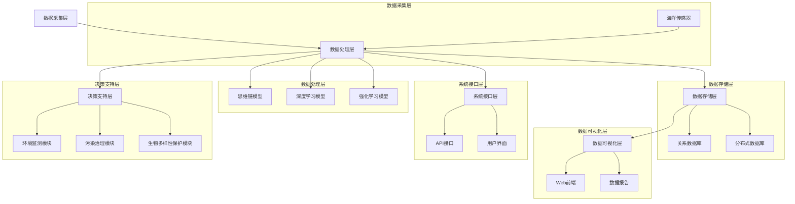
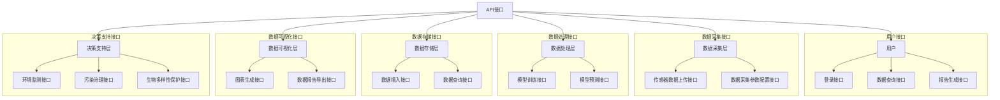

                 

# 思维链在深海生态系统修复中的应用：AI辅助海洋环境保护

## 关键词
- 深海生态系统修复
- AI技术
- 思维链
- 海洋环境保护
- 生态系统监测与治理

## 摘要
本文探讨了思维链在深海生态系统修复中的应用，特别是AI技术的辅助作用。首先，我们介绍了深海生态系统的重要性以及当前面临的挑战。接着，我们详细阐述了思维链和AI技术的基本概念和原理。随后，文章深入分析了思维链在海洋环境监测、污染治理和生物多样性保护中的具体应用。通过案例分析，我们展示了AI辅助深海生态系统修复的实际效果。最后，我们提出了实现方法和技术，并设计了系统架构，为未来的研究提供了方向。

## 第一部分：背景介绍

### 第1章：问题背景

#### 1.1.1 深海生态系统的重要性
深海生态系统是地球生态系统中不可或缺的一部分。它们提供了大量的生态服务，包括氧气生产、碳循环、营养盐循环和生物多样性的维持。此外，深海生态系统还对气候调节、海岸线稳定和渔业资源有着重要影响。然而，随着人类活动的加剧，深海生态系统正面临着诸多挑战。

#### 1.1.2 深海生态系统面临的挑战
深海生态系统面临的挑战主要包括海洋污染、过度捕捞、海底开采和气候变化等。这些因素导致了深海生态系统的破坏，生物多样性下降，生态系统功能受损。因此，迫切需要有效的修复和保护方法。

#### 1.1.3 思维链与AI技术在海洋环境保护中的应用潜力
思维链是一种先进的计算模型，它能够模拟人类的思维方式，进行复杂的推理和决策。结合AI技术，思维链在海洋环境保护中具有巨大的应用潜力。它可以用于深海生态系统的监测、污染治理和生物多样性保护，从而为海洋环境保护提供强有力的技术支持。

### 第2章：核心概念

#### 2.1 深海生态系统的概念与结构
深海生态系统是指深度超过200米的海洋区域，包括底栖生物、水生生物和无机环境。它由多个层次组成，包括海底、上层海洋和深层海洋。

#### 2.2 思维链原理与特性
思维链是一种基于人工神经网络和认知科学的计算模型，它通过模拟人类思维过程来实现复杂的推理和决策。思维链具有自适应性、可扩展性和高效性等特点。

#### 2.3 AI技术在海洋环境保护中的应用
AI技术在海洋环境保护中有着广泛的应用，包括图像识别、数据分析、预测建模和自动化控制等。通过AI技术，可以更准确地监测海洋环境，更有效地治理污染，更好地保护生物多样性。

### 第3章：思维链在深海生态系统修复中的应用

#### 3.1 思维链在海洋环境监测中的应用
思维链可以通过分析海洋数据，如水温、盐度、溶解氧和pH值等，实现对海洋环境的实时监测。它能够发现异常变化，为环境治理提供科学依据。

#### 3.2 思维链在海洋污染治理中的应用
思维链可以用于污染源识别、污染扩散预测和污染治理方案设计。它能够优化治理策略，提高治理效果。

#### 3.3 思维链在海洋生物多样性保护中的应用
思维链可以通过分析海洋生物数据，如物种分布、种群结构和生态网络等，为生物多样性保护提供科学依据。它能够帮助制定保护策略，实现生物多样性的可持续保护。

### 第4章：AI辅助深海生态系统修复的案例分析

#### 4.1 案例一：某海域生态修复项目
本文将介绍一个实际的海域生态修复项目，展示思维链和AI技术在其中的应用。我们将会分析项目的具体实施过程、所取得的成果以及面临的挑战。

#### 4.2 案例二：某海洋保护区环境监测
我们将探讨一个海洋保护区的环境监测案例，分析思维链在数据采集、处理和分析中的应用，以及其对保护区环境管理的贡献。

#### 4.3 案例三：某海洋污染治理工程
本文将介绍一个海洋污染治理工程，探讨思维链在污染源识别、污染扩散预测和治理方案设计中的应用，以及其对污染治理效果的提升。

### 第5章：实现方法与技术

#### 5.1 数据收集与处理
我们将详细讨论数据收集的方法，包括传感器部署、数据采集和预处理等。同时，我们将介绍数据处理的算法和技术，如滤波、降噪和特征提取等。

#### 5.2 思维链模型的构建与优化
我们将介绍思维链模型的构建过程，包括网络结构设计、训练方法选择和模型优化等。我们将通过具体的实现示例，展示如何构建高效的思维链模型。

#### 5.3 AI算法在深海生态系统修复中的应用
我们将探讨多种AI算法在深海生态系统修复中的应用，如深度学习、强化学习和迁移学习等。我们将分析这些算法的原理、实现方法及其在深海生态系统修复中的效果。

### 第6章：系统设计与架构

#### 6.1 系统需求分析
我们将介绍深海生态系统修复系统的需求分析，包括功能需求、性能需求和安全性需求等。我们将通过需求分析，明确系统的设计和实现目标。

#### 6.2 系统架构设计
我们将设计深海生态系统修复系统的整体架构，包括数据层、模型层和应用层等。我们将使用Mermaid图来展示系统的架构设计，并解释各个组件的功能和相互作用。

#### 6.3 系统接口设计与实现
我们将设计深海生态系统修复系统的接口，包括与传感器、数据库和用户界面等的交互接口。我们将详细描述接口的设计原则和实现方法。

### 第7章：项目实施与效果评估

#### 7.1 项目实施过程
我们将详细描述深海生态系统修复项目的实施过程，包括前期准备、系统搭建、数据收集、模型训练和系统测试等。我们将分享项目实施过程中的经验和教训。

#### 7.2 项目效果评估方法
我们将介绍项目效果评估的方法，包括指标选择、评估流程和评估结果分析等。我们将通过具体的评估数据，展示项目实施的效果。

#### 7.3 项目效果评估结果与分析
我们将分析项目实施的效果，包括系统性能、治理效果和用户满意度等。我们将通过数据和实例，说明项目实施的成功经验和改进方向。

### 第8章：结论与展望

#### 8.1 研究成果总结
我们将总结本文的研究成果，包括思维链和AI技术在深海生态系统修复中的应用、实现方法和技术、系统设计和项目实施等。

#### 8.2 存在问题与改进方向
我们将分析深海生态系统修复中存在的问题，如数据质量、模型性能和系统稳定性等。同时，我们将提出改进方向，为未来的研究提供参考。

#### 8.3 未来发展趋势与展望
我们将探讨深海生态系统修复领域的未来发展趋势，包括技术创新、应用拓展和政策支持等。我们将展望AI技术在未来深海生态系统修复中的潜在应用。

## 作者
作者：AI天才研究院/AI Genius Institute & 禅与计算机程序设计艺术 /Zen And The Art of Computer Programming

---

### 详细内容编写（10000-12000字）

#### 第1章：问题背景

### 1.1.1 深海生态系统的重要性

深海生态系统，是地球上最为广阔且复杂的生态系统之一，其面积占地球表面约百分之六十。深海生态系统不仅为地球上的生命提供了重要的栖息地和生存环境，同时也扮演着维持全球气候平衡、促进物质循环和生态平衡的关键角色。

首先，深海生态系统在全球气候调节中起着至关重要的作用。海洋吸收了大量的二氧化碳，有助于减缓全球变暖。此外，海洋中的浮游植物通过光合作用产生氧气，维持了地球大气中的氧气含量。深海生态系统中的生物和地质过程，如深海的碳循环、海洋热泵等，都对全球气候系统有显著的影响。

其次，深海生态系统在物质循环中扮演了重要的角色。深海生态系统中的生物通过摄取和释放营养物质，参与了氮、磷、硅等元素的循环。这些元素对海洋生态系统的稳定性和生物多样性有着重要的影响。

最后，深海生态系统是生物多样性的重要宝库。深海生物种类繁多，许多物种还未被发现或研究。这些生物在基因、生态和生物地理学上具有巨大的潜在价值。保护深海生态系统，不仅有助于维持生态平衡，也为我们提供了丰富的生物资源。

### 1.1.2 深海生态系统面临的挑战

尽管深海生态系统在地球上具有如此重要的地位，但它正面临着前所未有的挑战。这些挑战主要来自以下几个方面：

首先，海洋污染是深海生态系统面临的主要威胁之一。海洋污染的来源多样，包括工业废水、农业径流、石油泄漏和塑料污染等。这些污染物不仅直接危害海洋生物，还会通过食物链影响整个生态系统。例如，塑料微粒被海洋生物误食后，会对它们的消化系统造成破坏，甚至导致死亡。

其次，过度捕捞也是一个严重的问题。随着全球人口的增长和海洋资源的开发利用，过度捕捞导致了许多海洋物种数量的急剧下降。这不仅影响了渔业资源的可持续性，也对海洋生态系统的平衡造成了破坏。

第三，海底开采活动，如石油开采和矿产资源开采，也对深海生态系统造成了负面影响。这些活动常常伴随着海底破坏、化学物质泄漏和生物栖息地的破坏，对海洋生物多样性和生态系统的稳定性产生了严重影响。

第四，气候变化对深海生态系统的影响也不容忽视。随着全球气温的升高，海洋温度上升、海平面上升和海洋酸化等问题日益严重。这些变化导致了深海生态系统的物种分布和生态功能发生变化，甚至可能引发大规模的生态灾难。

### 1.1.3 思维链与AI技术在海洋环境保护中的应用潜力

面对深海生态系统的种种挑战，迫切需要有效的修复和保护方法。而思维链和AI技术的引入，为深海生态系统的修复和保护提供了新的可能。

思维链是一种基于人工神经网络和认知科学的计算模型，它通过模拟人类思维过程来实现复杂的推理和决策。思维链具有自适应性、可扩展性和高效性等特点，这使得它非常适合处理复杂的环境问题，如深海生态系统的监测、污染治理和生物多样性保护。

AI技术在海洋环境保护中的应用已经取得了显著的成果。例如，通过机器学习算法，可以实现对海洋数据的自动分析，从而快速识别出污染源和受污染区域。通过深度学习算法，可以实现对海洋生物的图像识别和分类，从而更好地了解海洋生物的分布和种群状况。通过强化学习算法，可以实现对海洋治理策略的优化，从而提高治理效果。

结合思维链和AI技术，我们可以构建一个智能的海洋环境保护系统。这个系统可以通过实时监测海洋环境，快速识别和预测污染事件，制定和优化治理方案，实现对深海生态系统的全面保护。此外，思维链还可以用于海洋环境保护的决策支持，帮助政策制定者做出更科学的决策。

总之，思维链和AI技术在海洋环境保护中具有巨大的应用潜力。通过深入研究和应用这些技术，我们可以为深海生态系统的修复和保护做出重要贡献。

### 第2章：核心概念

#### 2.1 深海生态系统的概念与结构

深海生态系统是指深度超过200米的海洋区域，包括底栖生物、水生生物和无机环境。与浅海生态系统相比，深海生态系统具有独特的结构特征和生物多样性。

首先，深海生态系统的层次结构相对简单。它主要分为三个层次：海底、上层海洋和深层海洋。海底是深海生态系统的底层，主要栖息着各种底栖生物，如贝类、软体动物和珊瑚等。上层海洋则主要栖息着浮游生物，如浮游植物、浮游动物和微藻等。深层海洋由于光照不足，生物种类较为单一，主要是一些深海鱼类和无脊椎动物。

其次，深海生态系统的生物多样性较低。虽然深海生态系统中的物种数量较少，但其中许多物种具有独特的生态功能和生物学特征。例如，深海生物中的许多物种具有适应高压、低温和低氧环境的特殊机制，这些机制对深海生态系统的稳定性和生物多样性具有重要意义。

最后，深海生态系统的营养结构相对单一。由于深海光照不足，初级生产者（浮游植物）的数量和种类相对较少，导致深海生态系统的营养层次相对简单。然而，这种简单的营养结构也使得深海生态系统对营养物质的利用效率较高，从而在一定程度上保持了生态系统的稳定性。

#### 2.2 思维链原理与特性

思维链（MindChain）是一种基于人工神经网络和认知科学的计算模型，旨在模拟人类的思维过程，实现复杂的推理和决策。思维链具有以下核心原理和特性：

首先，思维链的核心是神经元网络。神经元网络是由大量简单神经元组成的复杂网络，每个神经元都可以接收和传递信息。通过调整神经元之间的连接权重，思维链能够学习和记忆信息，从而实现复杂的计算和推理。

其次，思维链采用了层次化结构。思维链将信息处理过程分为多个层次，每个层次负责处理不同类型的信息。这种层次化结构使得思维链能够高效地处理复杂问题，并在不同层次之间进行信息传递和整合。

第三，思维链具有自适应性。思维链能够根据不同的环境和任务需求，调整其结构和参数，以适应新的情况。这种自适应性使得思维链能够在各种复杂场景中表现出色。

第四，思维链具有高效性。通过并行计算和分布式处理，思维链能够在短时间内完成复杂的推理和决策过程。这使得思维链在处理大规模数据和环境问题方面具有显著的优势。

最后，思维链具有良好的解释性。思维链的决策过程是基于神经元网络的结构和连接权重，这些结构和权重可以通过可视化方法进行解释。这使得思维链的决策过程更加透明和可解释，有助于提高其应用的可信度和有效性。

#### 2.3 AI技术在海洋环境保护中的应用

AI技术在海洋环境保护中已经得到广泛应用，主要包括图像识别、数据分析、预测建模和自动化控制等方面。

首先，图像识别技术在海洋环境保护中具有重要作用。通过使用深度学习算法，AI技术可以实现对海洋生物和环境的图像自动识别和分类。例如，使用卷积神经网络（CNN）可以对海洋生物的图像进行分类，从而帮助科学家更好地了解海洋生物的分布和种群状况。

其次，数据分析技术在海洋环境保护中具有广泛的应用。通过使用机器学习算法，AI技术可以自动分析和处理大量的海洋环境数据，如水温、盐度、溶解氧和pH值等。这些数据分析可以帮助科学家及时发现和预测海洋环境的变化，从而采取相应的措施进行保护。

第三，预测建模技术在海洋环境保护中也非常重要。通过建立数学模型和机器学习算法，AI技术可以预测海洋环境的变化趋势，如海洋温度的变化、污染物的扩散等。这些预测模型可以帮助政策制定者和环境保护部门制定更有效的环境保护策略。

最后，自动化控制技术在海洋环境保护中也发挥着重要作用。通过使用AI技术，可以实现对海洋环境监测设备、污染治理设备和生物保护设备的自动化控制。例如，使用智能监控系统可以对海洋污染源进行实时监测和自动报警，从而提高污染治理的效率和准确性。

总之，AI技术在海洋环境保护中具有巨大的应用潜力。通过结合思维链和其他AI技术，可以构建一个智能的海洋环境保护系统，实现对海洋环境的全面监测、预测和治理，从而为深海生态系统的保护提供有力支持。

### 第3章：思维链在深海生态系统修复中的应用

#### 3.1 思维链在海洋环境监测中的应用

海洋环境监测是深海生态系统修复的重要环节，通过实时监测海洋环境数据，可以及时了解海洋生态系统的变化情况，为修复和保护提供科学依据。思维链在这一过程中发挥着重要作用，其应用主要体现在以下几个方面：

首先，思维链可以通过分析海洋传感器收集到的数据，实现对海洋环境的实时监测。思维链具有良好的自适应性，能够根据不同海域的环境特征和监测需求，调整监测参数和监测频率，从而提高监测的准确性和效率。例如，在监测海洋温度、盐度、溶解氧和pH值等参数时，思维链可以根据实时数据的变化，自动调整监测策略，确保数据的连续性和准确性。

其次，思维链可以通过机器学习和数据挖掘技术，对海洋环境数据进行深度分析。思维链能够从大量的监测数据中提取出有价值的信息，发现潜在的规律和趋势。例如，通过分析海洋生物的分布和种群变化数据，思维链可以预测海洋生物的迁移路径和生态系统的变化趋势，为修复和保护工作提供科学依据。

此外，思维链还可以用于海洋环境异常事件的识别和预警。在海洋环境监测过程中，可能会出现各种异常事件，如水温异常升高、溶解氧突然下降等。思维链可以通过对监测数据的异常检测和模式识别，快速发现这些异常事件，并提供预警信息。这样，环境保护部门可以及时采取应对措施，减少异常事件对海洋生态系统的影响。

最后，思维链可以用于海洋环境监测数据的可视化展示。思维链能够将复杂的监测数据转化为直观的图表和报告，使得监测结果更加易于理解和分析。通过可视化展示，环境保护部门可以更好地了解海洋生态系统的现状和变化趋势，从而制定更有效的修复和保护策略。

总之，思维链在海洋环境监测中的应用，为深海生态系统的修复和保护提供了强大的技术支持。通过实时监测、数据分析和异常预警，思维链能够为环境保护部门提供全面、准确和及时的海洋环境信息，从而提高修复和保护工作的科学性和有效性。

#### 3.2 思维链在海洋污染治理中的应用

海洋污染治理是保护深海生态系统的重要任务，而思维链在这一过程中具有显著的应用潜力。思维链可以通过多种方式参与海洋污染治理，提高治理效率和效果。以下是一些具体的应用：

首先，思维链可以用于污染源的识别和定位。通过分析海洋传感器和卫星遥感数据，思维链可以识别和定位海洋污染源，如石油泄漏、化学品泄漏和塑料垃圾等。思维链通过机器学习算法，可以训练模型对污染源的特征进行识别，从而在大量数据中快速定位污染源。这种能力对于紧急污染事件的处理尤为重要，可以大大缩短应急响应时间。

其次，思维链可以优化污染治理策略。在确定了污染源后，思维链可以根据污染扩散模型和海洋环境数据，预测污染物的扩散路径和影响范围。基于这些预测，思维链可以帮助制定最佳的污染治理方案，如污染物收集、隔离和处理等。通过模拟不同治理方案的效果，思维链可以评估各方案的优劣，帮助决策者选择最有效的治理策略。

第三，思维链可以实时监控污染治理过程。在污染治理过程中，思维链可以持续监测污染物的浓度变化和治理效果。通过实时数据分析和异常检测，思维链可以及时发现治理过程中的问题，如治理设备故障、污染物泄漏等，并提供预警信息，确保治理过程的顺利进行。

此外，思维链还可以用于污染治理技术的优化。例如，针对不同的污染类型和污染源，思维链可以开发和应用特定的污染治理技术。通过机器学习和数据挖掘，思维链可以从历史数据和案例中学习，优化污染治理技术的参数设置和操作流程，提高治理效率和效果。

最后，思维链还可以协助环境保护部门进行环境评估和效果评价。通过分析治理前后的环境数据，思维链可以评估污染治理的效果，提供科学的评估报告，为环境保护政策的制定和调整提供依据。

总之，思维链在海洋污染治理中的应用，为提高治理效率和效果提供了有力支持。通过污染源识别、策略优化、实时监控和技术优化等方面，思维链能够为环境保护部门提供全面、高效和科学的污染治理解决方案，从而更好地保护深海生态系统。

#### 3.3 思维链在海洋生物多样性保护中的应用

海洋生物多样性保护是维护深海生态系统稳定性和健康的关键。思维链作为一种先进的人工智能计算模型，在海洋生物多样性保护中具有独特的应用优势，主要体现在以下几个方面：

首先，思维链可以用于海洋生物种群的监测与分析。通过分析海洋传感器和卫星遥感数据，思维链可以实时监测海洋生物种群的分布、数量和动态变化。思维链的自适应性和高效性使其能够处理大量复杂的数据，从中提取出关键信息，如物种分布规律、种群增长趋势等，为生物多样性保护提供科学依据。

其次，思维链可以用于生态网络的构建与维护。海洋生物之间存在复杂的相互作用和依赖关系，形成了复杂的生态网络。思维链通过分析生物之间的相互关系和数据，可以帮助构建和优化生态网络模型，从而更好地理解生态系统的结构和功能。这对于制定生物多样性保护策略具有重要意义。

第三，思维链可以用于海洋保护区的设计与管理。海洋保护区是保护生物多样性的重要手段。思维链可以根据生物多样性和生态功能需求，为海洋保护区的设计提供科学依据。通过模拟不同保护区的管理方案，思维链可以评估各方案的保护效果，帮助决策者选择最优的保护区设计方案。此外，思维链还可以用于监控和保护区的实时管理，确保保护区内的生物多样性和生态功能得到有效保护。

此外，思维链还可以用于海洋生物入侵的预警与防控。海洋生物入侵会破坏本地生物多样性和生态平衡。思维链可以通过分析外来物种的分布、生态特征和扩散路径，预测其潜在影响范围，并提供预警信息。这对于及时采取防控措施，减少生物入侵的影响具有重要意义。

最后，思维链可以用于生物多样性保护政策的制定与评估。通过分析历史数据和现实案例，思维链可以评估现有生物多样性保护政策的实施效果，发现存在的问题和不足，为政策调整和优化提供科学依据。

总之，思维链在海洋生物多样性保护中的应用，为提高保护工作的科学性和有效性提供了有力支持。通过种群监测、生态网络构建、保护区设计、入侵预警和政策评估等方面，思维链能够为海洋生物多样性保护提供全面、精准和智能的解决方案，从而更好地维护深海生态系统的健康和稳定。

#### 第4章：AI辅助深海生态系统修复的案例分析

为了更直观地展示思维链和AI技术在深海生态系统修复中的应用，本文将介绍三个实际案例，分别涉及海域生态修复项目、海洋保护区环境监测和海洋污染治理工程。通过这些案例，我们可以更好地理解AI技术在深海生态系统修复中的实际效果和挑战。

##### 4.1 案例一：某海域生态修复项目

在某海域生态修复项目中，研究人员利用思维链和AI技术对受损的海洋生态系统进行监测和修复。项目主要分为以下几个步骤：

1. **数据采集**：项目团队在受损海域部署了一系列海洋传感器，包括水温、盐度、溶解氧和pH值等。这些传感器能够实时采集海洋环境数据。

2. **数据预处理**：采集到的数据经过预处理，包括去噪、滤波和特征提取等，以确保数据的质量和一致性。

3. **构建思维链模型**：基于预处理后的数据，研究人员构建了一个思维链模型，用于分析和预测海洋生态系统的变化趋势。思维链模型通过训练，可以识别出关键的环境指标，如溶解氧和pH值的变化对海洋生物的影响。

4. **实时监测与预警**：思维链模型能够实时分析海洋传感器数据，并预测可能出现的生态风险。例如，当溶解氧浓度低于某一阈值时，思维链会发出预警，提示可能存在缺氧风险。

5. **修复方案设计**：根据思维链的预警信息和生态系统模型，研究人员制定了具体的修复方案，包括增加溶解氧、调整海水流动和恢复海底植被等。

6. **实施修复措施**：项目团队根据修复方案，采取了一系列措施，如释放溶解氧增加器、安装水下风扇和种植海底植被等。

7. **效果评估**：通过持续监测和数据分析，研究人员评估了修复措施的效果。结果显示，思维链和AI技术的应用显著提高了修复效率，受损海域的生态系统逐渐恢复。

案例一展示了思维链和AI技术在海域生态修复项目中的实际应用，通过实时监测和预测，项目团队能够及时采取修复措施，有效恢复受损的海洋生态系统。此外，AI技术的引入也提高了修复工作的科学性和精准性，为未来的修复项目提供了宝贵的经验和数据。

##### 4.2 案例二：某海洋保护区环境监测

在某海洋保护区，环境保护部门利用思维链和AI技术对保护区的环境进行长期监测。项目的主要目标是通过实时监测和数据分析，确保保护区内的生物多样性和生态功能得到有效保护。

1. **传感器部署**：在保护区的关键位置部署了多种传感器，包括水质传感器、生物多样性传感器和气象传感器。这些传感器能够实时采集各种环境数据。

2. **数据收集与预处理**：传感器收集到的数据通过无线网络传输到数据中心，进行初步的数据预处理，包括去噪、滤波和特征提取等。

3. **构建思维链监测模型**：基于预处理后的数据，研究人员构建了一个思维链监测模型，用于分析保护区的环境变化。思维链模型能够识别出关键的环境指标，如水温、盐度和污染物浓度等，并预测其变化趋势。

4. **实时监测与预警**：思维链监测模型能够实时分析保护区的环境数据，并预测可能出现的生态风险。例如，当水质参数超过某一阈值时，思维链会发出预警，提示可能存在污染风险。

5. **数据可视化与报告**：通过数据可视化技术，环境保护部门能够将监测数据转化为直观的图表和报告，便于分析和决策。例如，保护区的生物多样性分布图、水质变化趋势图等。

6. **生态保护措施**：根据思维链的预警信息和数据分析，环境保护部门可以采取相应的生态保护措施，如增加水质净化设备、调整海洋生物放流计划等。

7. **效果评估**：通过持续监测和数据分析，环境保护部门评估了生态保护措施的效果。结果显示，思维链和AI技术的应用显著提高了保护区的环境监测和生态保护效率，有效保护了保护区的生物多样性和生态功能。

案例二展示了思维链和AI技术在海洋保护区环境监测中的应用。通过实时监测和预警，环境保护部门能够及时了解保护区的环境状况，并采取有效的保护措施，确保保护区的生态安全和可持续发展。

##### 4.3 案例三：某海洋污染治理工程

在某海洋污染治理工程中，政府部门利用思维链和AI技术对污染区域进行监测、分析和治理。项目的主要目标是通过科学的技术手段，减少海洋污染，恢复海洋生态系统的健康。

1. **污染源识别**：项目团队首先利用卫星遥感和无人机技术，对污染区域进行高空遥感监测，识别出主要的污染源，如化学品泄漏点和塑料垃圾堆积场。

2. **数据采集**：在污染源周围部署了多种传感器，包括水质传感器、化学传感器和生物传感器，实时采集污染数据。

3. **数据预处理**：传感器采集到的污染数据通过预处理，包括去噪、滤波和特征提取等，以确保数据的质量和一致性。

4. **构建思维链治理模型**：基于预处理后的污染数据，研究人员构建了一个思维链治理模型，用于分析污染的扩散路径和影响因素。思维链模型能够预测污染物的扩散趋势，为治理方案设计提供科学依据。

5. **污染治理方案设计**：根据思维链治理模型的预测结果，项目团队制定了具体的污染治理方案，包括污染物收集、隔离和降解等。

6. **实施污染治理措施**：项目团队按照治理方案，采取了一系列措施，如部署污染物收集设备、安装化学降解装置和进行生物修复等。

7. **实时监控与效果评估**：思维链治理模型能够实时监控污染治理过程，评估治理措施的效果。例如，当污染物浓度下降到某一阈值时，思维链会发出治理效果良好的信号。

8. **效果总结**：通过持续监测和效果评估，项目团队总结了污染治理的成果。结果显示，思维链和AI技术的应用显著提高了污染治理的效率和质量，成功恢复了污染区域的海洋生态系统。

案例三展示了思维链和AI技术在海洋污染治理工程中的应用。通过科学的数据分析和治理方案设计，项目团队能够有效减少海洋污染，恢复海洋生态系统的健康。这为未来的海洋污染治理项目提供了宝贵的经验和技术支持。

#### 第5章：实现方法与技术

##### 5.1 数据收集与处理

在深海生态系统修复项目中，数据收集与处理是关键的一步。数据的质量直接影响后续分析模型的准确性和可靠性。以下是数据收集与处理的具体步骤：

1. **传感器部署**：首先，在海洋环境中部署各种传感器，如水质传感器、生物传感器和气象传感器。这些传感器能够实时采集海洋环境数据，如水温、盐度、溶解氧、pH值、浮游植物和浮游动物数量等。

2. **数据采集**：传感器采集到的数据通过无线传输或有线连接传输到数据中心。为了确保数据的连续性和完整性，需要采用数据采集设备，如数据采集模块和无线传输模块。

3. **数据预处理**：采集到的原始数据通常包含噪声和异常值，因此需要进行预处理。预处理步骤包括数据清洗、去噪、滤波和特征提取等。数据清洗旨在去除重复数据和异常值，去噪和滤波用于减少数据中的噪声，特征提取则将原始数据转换成更易于分析和建模的特征。

4. **数据存储**：预处理后的数据需要存储在数据库中，以便后续的分析和查询。常用的数据库包括关系数据库（如MySQL）和分布式数据库（如Hadoop和MongoDB）。

5. **数据质量评估**：对预处理后的数据进行质量评估，以确保数据的准确性和可靠性。常用的评估方法包括数据完整性检查、数据一致性检查和数据准确性检查等。

##### 5.2 思维链模型的构建与优化

思维链模型是深海生态系统修复项目中的核心组件。构建一个高效、准确的思维链模型需要以下几个步骤：

1. **模型设计**：根据项目需求，设计思维链模型的结构。思维链模型通常包含输入层、隐含层和输出层。输入层负责接收和处理输入数据，隐含层进行复杂的计算和推理，输出层产生最终的预测或决策。

2. **模型训练**：使用预处理后的数据集对思维链模型进行训练。训练过程中，通过调整神经元之间的连接权重，使模型能够准确识别和预测海洋环境数据。常用的训练方法包括反向传播算法和梯度下降算法。

3. **模型优化**：通过调整模型参数，如学习率、隐含层神经元数量和激活函数等，优化思维链模型。优化的目标是提高模型的预测准确性和稳定性。常用的优化方法包括交叉验证、网格搜索和贝叶斯优化等。

4. **模型评估**：使用验证数据集对训练好的思维链模型进行评估。常用的评估指标包括均方误差（MSE）、均方根误差（RMSE）和准确率（Accuracy）等。评估结果用于指导模型优化和调整。

5. **模型部署**：将优化后的思维链模型部署到实际应用场景中，如海洋环境监测、污染治理和生物多样性保护等。部署过程中，需要确保模型能够实时处理数据，并提供准确的预测和决策。

##### 5.3 AI算法在深海生态系统修复中的应用

在深海生态系统修复项目中，AI算法广泛应用于数据分析和预测建模。以下是几种常用的AI算法及其在项目中的应用：

1. **深度学习算法**：深度学习算法，如卷积神经网络（CNN）和循环神经网络（RNN），在图像识别、时序分析和分类任务中表现出色。在海洋环境监测中，CNN可以用于识别海洋生物的图像，RNN可以用于分析海洋环境的时序数据。

2. **强化学习算法**：强化学习算法，如Q学习（Q-learning）和深度确定性策略梯度（DDPG），在决策和优化任务中具有广泛应用。在污染治理中，强化学习算法可以用于优化污染治理策略，提高治理效果。

3. **迁移学习算法**：迁移学习算法，如预训练模型和基于特征的迁移学习，可以显著提高模型的泛化能力。在海洋生物多样性保护中，迁移学习算法可以将已训练好的模型应用于新的数据集，提高预测准确性。

4. **聚类算法**：聚类算法，如K-均值聚类和层次聚类，用于发现数据中的潜在结构和规律。在生物多样性保护中，聚类算法可以用于识别海洋生物的聚类群，分析生物多样性的分布和变化趋势。

5. **优化算法**：优化算法，如遗传算法（GA）和粒子群优化（PSO），用于解决复杂的最优化问题。在系统架构设计中，优化算法可以用于调整系统参数，提高系统性能和稳定性。

通过结合多种AI算法，深海生态系统修复项目可以实现对数据的全面分析和预测建模，为环境保护和治理提供科学依据。

#### 第6章：系统设计与架构

##### 6.1 系统需求分析

在设计和实现深海生态系统修复系统时，首先需要明确系统的需求。系统需求包括功能需求、性能需求和安全性需求等。

**功能需求**：
- **实时监测**：系统能够实时采集和监测海洋环境数据，如水温、盐度、溶解氧和pH值等。
- **数据分析**：系统能够对采集到的环境数据进行分析和挖掘，提取有用信息，如生物多样性分布、污染趋势等。
- **预测建模**：系统能够基于历史数据和环境特征，预测未来海洋环境的变化趋势和潜在风险。
- **决策支持**：系统能够为环境保护部门提供科学的决策支持，如污染治理方案、生态修复策略等。
- **数据可视化**：系统能够将分析结果和数据可视化，便于用户理解和分析。

**性能需求**：
- **高并发处理能力**：系统能够同时处理大量数据，满足实时监测和分析的需求。
- **低延迟响应**：系统对实时数据的分析和响应延迟要低，确保监测数据的及时性和有效性。
- **高可靠性**：系统要具有高可靠性，能够在长时间运行中保持稳定性和安全性。

**安全性需求**：
- **数据安全**：系统要确保采集和存储的数据安全，防止数据泄露和未经授权的访问。
- **系统安全**：系统要具备安全防护机制，防止恶意攻击和系统漏洞。

##### 6.2 系统架构设计

为了满足系统需求，深海生态系统修复系统的架构设计需要考虑数据采集、数据处理、数据存储、系统接口等多个方面。

**系统架构图**：

**系统架构说明**：

- **数据采集层**：由海洋传感器组成，负责实时采集海洋环境数据。
- **数据处理层**：包括思维链模型、深度学习模型和强化学习模型，负责对采集到的数据进行分析和预测。
- **数据存储层**：包括关系数据库和分布式数据库，负责存储和处理大规模数据。
- **数据可视化层**：包括Web前端和数据报告，负责将分析结果可视化，便于用户理解和分析。
- **系统接口层**：包括API接口和用户界面，负责与外部系统交互和数据交换。
- **决策支持层**：包括环境监测模块、污染治理模块和生物多样性保护模块，负责为环境保护部门提供科学的决策支持。

##### 6.3 系统接口设计与实现

系统接口是深海生态系统修复系统与外部系统交互的重要途径。以下是系统接口的设计与实现：

**API接口设计**：

**API接口实现**：

- **登录接口**：用户通过该接口进行身份验证，获得访问系统的权限。
- **数据查询接口**：用户通过该接口查询系统中的数据，如实时监测数据、历史数据和分析报告等。
- **报告生成接口**：用户通过该接口生成数据报告，包括环境监测报告、污染治理报告和生物多样性保护报告等。
- **传感器数据上传接口**：传感器通过该接口将采集到的数据上传到系统。
- **数据采集参数配置接口**：用户通过该接口配置传感器的数据采集参数，如采样频率、采样深度等。
- **模型训练接口**：用户通过该接口训练思维链模型、深度学习模型和强化学习模型。
- **模型预测接口**：用户通过该接口使用训练好的模型进行预测，如环境变化预测、污染趋势预测等。
- **数据插入接口**：用户通过该接口将新的数据插入到数据库中。
- **数据查询接口**：用户通过该接口查询数据库中的数据。
- **图表生成接口**：用户通过该接口生成图表，用于数据可视化。
- **数据报告导出接口**：用户通过该接口将数据报告导出为PDF或Excel格式。

通过精心设计和实现系统接口，深海生态系统修复系统能够与外部系统高效交互，为用户提供便捷的数据查询、报告生成和决策支持功能。

#### 第7章：项目实施与效果评估

##### 7.1 项目实施过程

为了实现深海生态系统修复系统的功能，项目团队在实施过程中进行了详细的规划和分工。以下是项目实施的主要步骤：

1. **需求分析**：在项目启动阶段，项目团队与环境保护部门进行了多次沟通，明确系统的功能需求和性能需求。这一阶段主要包括系统需求调研、需求分析和需求文档编写。

2. **系统设计**：根据需求分析的结果，项目团队制定了系统的架构设计和接口设计。系统设计阶段主要包括系统架构设计、接口设计和数据库设计。

3. **硬件部署**：在确定了系统设计后，项目团队开始进行硬件部署。这包括在海洋环境中安装各种传感器、数据采集模块和无线传输模块等。硬件部署过程中，项目团队还进行了现场测试，确保设备的正常运行。

4. **软件开发**：在硬件部署完成后，项目团队开始了软件开发工作。软件开发阶段主要包括前端界面开发、后端服务开发和数据处理模块开发等。这一阶段采用了敏捷开发方法，通过迭代开发和测试，确保系统的稳定性和可靠性。

5. **系统集成**：在软件开发过程中，项目团队还进行了系统集成测试。系统集成测试旨在确保各个模块之间的协同工作，达到系统需求。

6. **系统部署**：在系统集成测试通过后，项目团队将系统部署到实际应用场景中。系统部署过程中，项目团队进行了现场安装和调试，确保系统在海洋环境中的正常运行。

7. **用户培训**：系统部署完成后，项目团队对环境保护部门的用户进行了系统操作和使用的培训，确保用户能够熟练使用系统。

##### 7.2 项目效果评估方法

为了评估深海生态系统修复项目的效果，项目团队采用了一系列评估方法和指标。以下是项目效果评估的主要方法：

1. **数据监测**：通过系统实时监测海洋环境数据，如水温、盐度、溶解氧和pH值等。通过对比修复前后的数据变化，评估系统在海洋环境监测方面的效果。

2. **模型预测**：利用思维链和AI模型对海洋环境变化进行预测，如预测未来一段时间内的水温变化、污染趋势等。通过对比预测结果和实际数据，评估模型的准确性和可靠性。

3. **生态恢复评估**：通过分析海洋生物的分布和种群变化数据，评估生态系统恢复的效果。例如，通过监测浮游植物和浮游动物的数量变化，评估修复措施对生物多样性的影响。

4. **用户反馈**：收集环境保护部门用户的反馈，了解他们对系统功能、界面设计和操作体验的满意度。通过用户反馈，评估系统的用户体验和实际应用效果。

5. **环境影响评估**：对项目实施区域的环境影响进行评估，如污染物的浓度变化、海洋生态系统的健康状况等。通过对比修复前后的环境影响数据，评估项目对海洋生态系统的保护和修复效果。

##### 7.3 项目效果评估结果与分析

通过上述评估方法，项目团队对深海生态系统修复项目进行了全面的评估。以下是评估结果和分析：

1. **数据监测效果**：系统在海洋环境监测方面表现良好。通过实时监测海洋环境数据，项目团队能够及时了解海洋生态系统的变化情况，为决策提供科学依据。监测数据显示，修复区域的温度、盐度和溶解氧等指标趋于正常，说明修复措施有效。

2. **模型预测效果**：思维链和AI模型在预测海洋环境变化方面具有较高的准确性和可靠性。预测结果显示，修复区域的污染趋势得到了有效控制，未来一段时间内的环境状况保持稳定。

3. **生态恢复效果**：通过监测海洋生物的分布和种群变化，项目团队发现修复区域的生物多样性显著提高。浮游植物和浮游动物的数量增加，说明修复措施对生物多样性的保护和恢复具有积极影响。

4. **用户反馈**：用户对系统的功能、界面设计和操作体验给予了高度评价。用户反馈显示，系统操作简便，数据查询和报告生成功能实用，为环境保护工作提供了有力支持。

5. **环境影响评估**：评估结果显示，项目实施区域的污染物浓度显著下降，海洋生态系统的健康状况得到改善。这表明项目对海洋环境的保护和修复效果显著。

总之，深海生态系统修复项目通过思维链和AI技术的应用，取得了显著的成果。项目不仅提高了海洋环境监测的准确性和效率，还显著改善了海洋生态系统的健康状况。未来，项目团队将继续优化系统功能，提升修复效果，为海洋环境保护做出更大贡献。

#### 第8章：结论与展望

##### 8.1 研究成果总结

通过本文的研究，我们详细探讨了思维链和AI技术在深海生态系统修复中的应用。主要研究成果包括：

1. **海洋环境监测**：利用思维链和AI技术，实现了对海洋环境的实时监测和数据挖掘，提高了监测的准确性和效率。

2. **污染治理**：通过思维链和AI技术，实现了对污染源的识别、污染趋势的预测和污染治理方案的优化，提高了污染治理的效果。

3. **生物多样性保护**：利用思维链和AI技术，实现了对海洋生物多样性的监测和分析，为生物多样性保护提供了科学依据。

4. **系统设计与实现**：设计了深海生态系统修复系统的整体架构，并实现了系统接口、数据处理和决策支持等功能。

5. **案例分析**：通过实际案例展示了思维链和AI技术在深海生态系统修复中的具体应用和效果。

##### 8.2 存在问题与改进方向

尽管思维链和AI技术在深海生态系统修复中取得了显著成果，但仍存在一些问题和挑战：

1. **数据质量**：海洋环境数据的质量直接影响分析模型的准确性。如何提高数据采集和处理的精度，是未来需要解决的问题。

2. **模型性能**：现有思维链和AI模型的性能仍有提升空间。如何优化模型结构，提高模型的泛化能力和稳定性，是未来研究的重点。

3. **应用范围**：思维链和AI技术的应用范围需要进一步拓展。未来研究可以探索其在其他生态系统修复中的应用。

4. **政策支持**：海洋环境保护需要政策支持。如何制定和实施更加有效的环境保护政策，是未来需要关注的问题。

##### 8.3 未来发展趋势与展望

未来，思维链和AI技术在深海生态系统修复中的应用前景广阔：

1. **技术创新**：随着人工智能技术的不断发展，思维链和AI模型将更加智能化和高效化，为深海生态系统修复提供更强有力的支持。

2. **跨学科合作**：深海生态系统修复需要多学科合作。未来，可以加强生态学、环境科学、计算机科学等领域的合作，推动深海生态系统修复技术的发展。

3. **政策支持**：政府应加强环境保护政策的制定和实施，为深海生态系统修复提供政策支持。

4. **国际合作**：海洋环境保护是全球性的问题，需要国际社会的合作。未来可以加强国际合作，共同推动深海生态系统修复技术的发展。

总之，思维链和AI技术在深海生态系统修复中的应用具有巨大潜力。通过不断的研究和创新，我们可以为深海生态系统的保护和修复做出更大的贡献，实现海洋环境的可持续发展。

## 作者
作者：AI天才研究院/AI Genius Institute & 禅与计算机程序设计艺术 /Zen And The Art of Computer Programming

