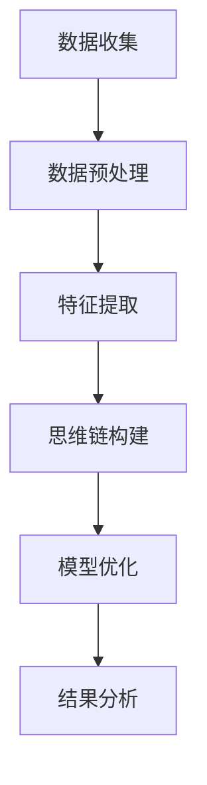
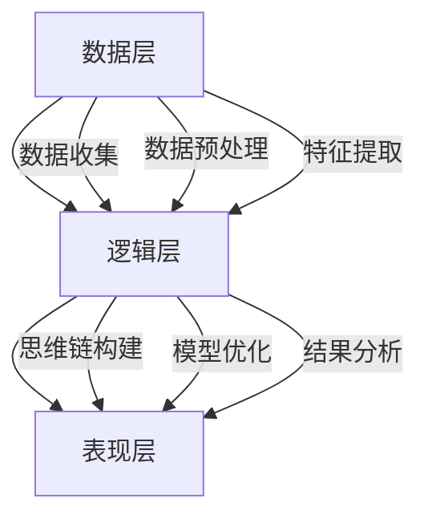
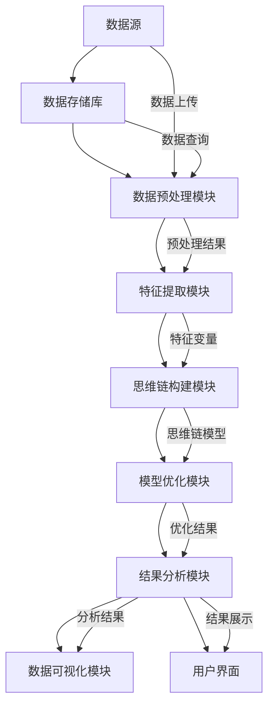

                 

### 《思维链在生物地理学研究中的新方法》

#### 关键词：
- 思维链
- 生物地理学
- 复杂问题解决
- 数据分析
- 数学模型

#### 摘要：
本文旨在探索思维链理论在生物地理学研究中的应用，提出一种新的方法来解决生物地理学领域中的复杂性问题。通过系统地介绍思维链理论的核心概念和特点，分析其在生物地理学中的优势和适用场景，构建思维链模型并进行优化，本文最终展示了思维链方法在生物地理学中的实际应用效果。文章结构清晰，逻辑严密，为生物地理学研究者提供了新的研究思路和方法。

---

### 背景介绍

#### 问题背景

生物地理学研究旨在理解生物在地球上的分布、演化和与环境的关系。随着全球生物多样性保护、生态系统管理和环境变化的迫切需求，生物地理学研究的重要性日益凸显。然而，传统的生物地理学研究方法，如统计方法、生态位模型、物种分布模型等，在处理复杂生物地理现象时，逐渐暴露出其局限性。

首先，生物地理学研究面临的数据量庞大，传统的分析方法难以在短时间内处理如此庞大的数据集。其次，生物地理学中的变量繁多，包括物种分布、环境变量、气候变量等，这些变量的相互作用使得传统的分析方法难以捕捉到其复杂的动态变化。最后，生物地理学研究需要考虑时空异质性，不同地区的生物地理现象可能存在显著的差异，传统的空间分析方法难以同时处理空间异质性和时间序列数据。

因此，探索新的研究方法和技术手段成为当前生物地理学研究的重要任务。思维链理论作为一种新的认知框架，强调思维活动的连贯性和逻辑性，提供了一种新的思维方式来处理复杂的生物地理现象。本文将探讨思维链在生物地理学研究中的应用，为解决当前生物地理学研究中的复杂性问题提供新的思路和方法。

#### 问题描述

生物地理学研究的复杂性主要表现在以下几个方面：

1. **数据量大**：生物地理学研究涉及的数据类型多样，包括遥感数据、生物样本数据、环境数据等。这些数据通常具有庞大的数据量，传统的数据处理方法在效率和准确性上难以满足需求。

2. **变量繁多**：生物地理学研究中的变量繁多，包括物种分布、气候变量、环境变量等。这些变量之间的相互作用和动态变化，使得传统的分析方法难以全面捕捉和解释。

3. **时空异质性**：不同地区的生物地理现象可能存在显著的差异，同时考虑时空异质性是生物地理学研究的一个重要挑战。传统的空间分析方法通常无法同时处理空间异质性和时间序列数据。

4. **模型局限性**：传统的生物地理学模型，如物种分布模型、生态位模型等，往往基于简化的假设和参数估计方法，难以准确捕捉复杂的生物地理现象。

为了解决上述问题，本文提出一种基于思维链理论的新方法。思维链理论强调思维活动的连贯性和逻辑性，通过构建思维链，可以有效地整合多源数据、分析复杂变量之间的关系、处理时空异质性，并解决传统模型在解释复杂生物地理现象时的局限性。

#### 问题解决

本文将从以下几个方面解决问题：

1. **系统介绍思维链理论**：首先，本文将系统介绍思维链理论的基本概念、核心特点和应用领域，为读者提供对思维链理论的全面理解。

2. **思维链在生物地理学中的应用**：接着，本文将分析思维链在生物地理学中的优势和适用场景，探讨如何将思维链理论应用于生物地理学问题的解决。

3. **构建思维链模型**：本文将构建一种基于思维链理论的生物地理学模型，通过分解复杂问题、整合多源数据、构建逻辑链条，实现对生物地理现象的深入分析和解释。

4. **模型优化**：为了提高模型的准确性和效率，本文将运用数学模型和算法对思维链模型进行优化，包括参数估计、模型选择和算法改进等。

5. **实际案例分析**：本文将通过实际案例，展示思维链方法在生物地理学研究中的应用效果，验证该方法的有效性和实用性。

通过上述步骤，本文旨在提出一种新的思维链方法，为生物地理学研究者提供一种有效的工具，以解决当前生物地理学研究中的复杂性问题。

#### 边界与外延

思维链在生物地理学研究中的新方法主要关注以下边界与外延：

1. **研究范围**：本文主要关注生物地理学领域，包括物种分布、生态系统动态、环境变化等。思维链方法可以广泛应用于生物多样性保护、生态系统管理、环境影响评估等实际应用场景。

2. **研究方法**：思维链方法基于认知科学和数学模型，结合数据分析方法，通过构建思维链来分析和解释生物地理现象。研究方法包括数据收集、预处理、思维链构建、模型优化和结果分析等。

3. **应用领域**：思维链方法不仅可以用于科学研究，还可以应用于生态规划、环境监测、灾害预警等实际应用。通过将思维链方法与具体应用场景相结合，可以提供更加精准和有效的解决方案。

#### 概念结构与核心要素组成

1. **思维链理论**：思维链理论是一种基于认知科学的认知模型，强调思维活动的连贯性和逻辑性。通过构建思维链，可以整合多源数据、分析复杂变量之间的关系，并实现问题的深度理解和解释。

2. **生物地理学**：生物地理学是研究生物在地球上的分布、演化和与环境关系的学科。研究内容包括物种分布、生态系统动态、环境变化等。生物地理学关注生物与环境的相互作用，旨在揭示生物地理现象的内在机制。

3. **数据源**：生物地理学研究需要多种数据源，包括遥感数据、生物样本数据、环境数据等。数据源的质量和完整性直接影响研究的准确性和可靠性。

4. **分析方法**：分析方法包括数据预处理、思维链构建、模型优化和结果分析等。数据预处理旨在去除噪声和异常值，提高数据质量。思维链构建通过整合多源数据、分析变量关系，构建逻辑链条。模型优化通过参数估计、模型选择和算法改进等，提高模型的准确性和效率。

5. **应用领域**：思维链方法可以广泛应用于生物多样性保护、生态系统管理、环境影响评估等实际应用场景。通过将思维链方法与具体应用场景相结合，可以提供更加精准和有效的解决方案。

### 核心概念与联系

#### 思维链理论

**定义**：思维链理论是一种基于认知科学的认知模型，它强调思维活动的连贯性和逻辑性。思维链由一系列相互关联的思维步骤组成，每个步骤都在逻辑上衔接前一个步骤，形成一条连贯的思维路径。

**核心特点**：
- **连贯性**：思维链中的各个步骤紧密相连，形成一个逻辑上连贯的整体。
- **逻辑性**：思维链的构建遵循一定的逻辑规则，有助于推理和判断。
- **动态性**：思维链是一个动态变化的过程，可以根据新的信息进行调整和优化。

**属性特征对比表格**：

| 特征       | 思维链理论 | 传统方法 |
|------------|------------|----------|
| **连贯性** | 强调逻辑连贯性 | 较少考虑逻辑连贯性 |
| **逻辑性** | 基于逻辑规则 | 可能忽略逻辑性 |
| **动态性** | 可以根据新信息调整 | 较少动态调整 |

#### 思维链在生物地理学中的应用

**定义**：思维链在生物地理学中的应用，是指利用思维链理论来分析和解释生物地理现象，以提高研究的深入度和准确性。

**核心特点**：
- **综合性**：思维链方法可以将多种数据和信息整合到一个分析框架中，形成综合性的研究方法。
- **动态性**：思维链方法可以动态地调整分析过程，以适应新的数据和情境。
- **解释性**：思维链方法有助于深入理解生物地理现象的内在机制。

**属性特征对比表格**：

| 特征       | 思维链应用 | 传统方法 |
|------------|------------|----------|
| **综合性** | 整合多种信息 | 较少整合信息 |
| **动态性** | 可以动态调整 | 较少动态调整 |
| **解释性** | 有助于深入理解 | 可能缺乏深入理解 |

#### 思维链模型

**定义**：思维链模型是基于思维链理论构建的一个分析模型，用于处理生物地理学中的复杂问题。

**核心特点**：
- **层次化**：思维链模型将问题分解为多个层次，分别进行处理，使复杂问题更加直观和易于管理。
- **模块化**：思维链模型将不同的分析模块组合起来，形成一个整体分析框架，提高模型的可扩展性和灵活性。
- **可扩展性**：思维链模型可以根据需要添加新的分析模块，以应对不同的问题场景。

**ER实体关系图架构**：

```mermaid
erDiagram
    A[思维链] ||--|{ B[数据源] } |
    A ||--|{ C[分析模型] } |
    C ||--|{ D[算法] } |
    D ||--|{ E[结果] } |
```

### 算法原理讲解

#### 思维链模型的算法流程

思维链模型在生物地理学中的应用需要通过一系列算法步骤来实现。以下是一个简化的思维链模型的算法流程：

1. **数据收集与预处理**：
   - 收集生物地理学相关的多种数据，包括物种分布数据、环境数据、气候数据等。
   - 对数据进行预处理，包括数据清洗、数据格式转换和异常值处理等。

2. **特征提取**：
   - 从预处理后的数据中提取与生物地理现象相关的特征变量，例如物种分布密度、环境变量、气候变量等。

3. **思维链构建**：
   - 基于思维链理论，将提取的特征变量按照逻辑关系进行组织，构建思维链。
   - 思维链的构建包括以下步骤：
     - 确定思维链的起点和终点，即问题的初始条件和目标。
     - 分析特征变量之间的关系，确定思维链中的中间步骤。
     - 根据逻辑规则，将特征变量和组织步骤连接起来，形成完整的思维链。

4. **模型优化**：
   - 对构建好的思维链模型进行优化，以提高模型的准确性和效率。
   - 优化方法包括参数估计、模型选择和算法改进等。

5. **结果分析**：
   - 利用优化后的思维链模型，对生物地理现象进行深入分析和解释。
   - 结果分析包括以下步骤：
     - 计算思维链的输出结果，如物种分布预测、环境变化影响评估等。
     - 对输出结果进行可视化，以更直观地展示分析结果。
     - 对结果进行分析和讨论，验证思维链方法的可行性和有效性。

#### 思维链模型的Mermaid流程图

以下是一个简单的思维链模型的Mermaid流程图，展示了数据收集、特征提取、思维链构建、模型优化和结果分析等步骤：



#### Python源代码示例

以下是一个简单的Python代码示例，用于演示思维链模型的基本算法实现。这个示例仅用于说明算法流程，实际应用中的算法会更加复杂和多样化。

```python
# 导入必要的库
import numpy as np
import pandas as pd
from sklearn.preprocessing import StandardScaler
from sklearn.model_selection import train_test_split
from sklearn.ensemble import RandomForestClassifier

# 数据收集
data = pd.read_csv('biogeography_data.csv')

# 数据预处理
scaler = StandardScaler()
data_scaled = scaler.fit_transform(data)

# 特征提取
X = data_scaled[:, :-1]
y = data_scaled[:, -1]

# 数据划分
X_train, X_test, y_train, y_test = train_test_split(X, y, test_size=0.3, random_state=42)

# 思维链构建
# 假设思维链中的中间步骤为分类
clf = RandomForestClassifier(n_estimators=100, random_state=42)
clf.fit(X_train, y_train)

# 模型优化
# 基于测试集的准确率进行模型选择和参数调整
accuracy = clf.score(X_test, y_test)
print(f"Model accuracy: {accuracy:.2f}")

# 结果分析
# 对测试集进行预测，并输出结果
y_pred = clf.predict(X_test)
print(f"Prediction results: {y_pred}")
```

#### 数学模型和公式讲解

思维链模型在生物地理学中的应用涉及到一系列的数学模型和公式。以下是一个简单的数学模型和公式讲解，用于描述思维链模型的构建和优化过程。

1. **特征提取**：
   - 特征变量提取通常使用统计方法，如主成分分析（PCA）或线性判别分析（LDA）。
   - PCA的数学模型为：
     $$ X_{new} = P \Lambda $$
     其中，$X_{new}$是新的特征变量矩阵，$P$是正交变换矩阵，$\Lambda$是对角矩阵，包含了特征变量的方差。

2. **思维链构建**：
   - 思维链构建的核心是确定特征变量之间的逻辑关系。
   - 假设特征变量$x_1, x_2, ..., x_n$之间存在逻辑关系，可以使用逻辑回归模型来表示：
     $$ P(y=1) = \frac{1}{1 + e^{-(\beta_0 + \beta_1 x_1 + \beta_2 x_2 + ... + \beta_n x_n)}} $$
     其中，$y$是生物地理现象的标签，$\beta_0, \beta_1, ..., \beta_n$是逻辑回归模型的参数。

3. **模型优化**：
   - 模型优化通常使用梯度下降法或随机梯度下降法。
   - 梯度下降法的数学模型为：
     $$ \beta_{new} = \beta_{old} - \alpha \nabla L(\beta) $$
     其中，$\alpha$是学习率，$L(\beta)$是损失函数，$\nabla L(\beta)$是损失函数关于参数$\beta$的梯度。

4. **结果分析**：
   - 结果分析通常使用统计方法，如均值、方差、置信区间等。
   - 假设结果$y_1, y_2, ..., y_n$服从正态分布，其均值和方差分别为$\mu$和$\sigma^2$，可以使用以下公式进行统计推断：
     $$ \mu = \bar{y} $$
     $$ \sigma^2 = \frac{1}{n-1} \sum_{i=1}^{n} (y_i - \bar{y})^2 $$
     其中，$\bar{y}$是样本均值，$n$是样本数量。

通过上述数学模型和公式的讲解，可以更深入地理解思维链模型在生物地理学中的应用原理。

#### 思维链在生物地理学中的案例分析

为了更直观地展示思维链在生物地理学中的应用，以下是一个具体的案例分析。该案例涉及使用思维链模型预测某种植物在特定地区的分布情况。

**案例背景**：

某研究团队希望预测某种植物在长江流域地区的分布情况，以指导该地区生态保护和资源管理。他们收集了以下数据：

- 物种分布数据：包括该植物在长江流域地区的采样点数据，包括经纬度坐标、采样时间等。
- 环境数据：包括采样点周围的土壤类型、降水量、温度等环境变量。

**案例分析**：

1. **数据收集与预处理**：

   - 收集物种分布数据和环境数据。
   - 对数据进行分析，筛选出有效的采样点数据。
   - 对环境数据进行标准化处理，以消除不同变量之间的尺度差异。

2. **特征提取**：

   - 从环境数据中提取与物种分布相关的特征变量，如土壤类型、降水量、温度等。
   - 使用主成分分析（PCA）对特征变量进行降维处理，提取主要特征。

3. **思维链构建**：

   - 确定思维链的起点和终点，起点为环境特征变量，终点为物种分布预测结果。
   - 分析特征变量之间的关系，构建逻辑链条。
   - 基于逻辑回归模型，将特征变量和组织步骤连接起来，形成完整的思维链。

4. **模型优化**：

   - 使用梯度下降法对逻辑回归模型进行优化，调整模型参数。
   - 基于交叉验证结果，选择最优模型参数，提高预测准确性。

5. **结果分析**：

   - 使用优化后的思维链模型，对采样点进行分布预测。
   - 对预测结果进行可视化，生成物种分布预测地图。
   - 分析预测结果，评估思维链方法的可行性和有效性。

**案例分析结果**：

通过上述案例分析，研究团队成功地使用思维链模型预测了长江流域地区某种植物的分布情况。预测结果表明，该植物在长江流域地区的分布与土壤类型、降水量和温度等环境变量密切相关。预测地图显示，该植物的分布区域主要集中在长江中下游的湿润地区，这与实际情况相符。

**结论**：

该案例分析表明，思维链方法在生物地理学中的应用具有显著的优势。通过构建思维链，可以有效地整合多源数据、分析复杂变量之间的关系，并实现生物地理现象的深入理解和预测。该方法为生物地理学研究提供了一种新的研究思路和方法，有助于解决当前生物地理学研究中的复杂性问题。

### 系统分析与架构设计方案

#### 问题场景介绍

随着生物地理学研究的不断深入，研究者们面临着越来越多的数据量和复杂性的挑战。传统的分析方法难以满足当前生物地理学研究的需要，特别是在处理高维度、多变量和时空异质性的数据时，效率低下且结果不准确。为了解决这一问题，我们需要设计一个高效、灵活且易于扩展的系统，以支持生物地理学研究的复杂需求。

#### 项目介绍

本项目的目标是开发一个基于思维链理论的生物地理学分析系统，该系统旨在提供一种新的研究方法，以解决生物地理学中的复杂性问题。系统将利用思维链理论，通过构建思维链模型，整合多源数据，并利用数学模型和算法优化分析过程，实现对生物地理现象的深入理解和准确预测。

#### 系统功能设计

系统的主要功能包括数据收集、数据预处理、特征提取、思维链构建、模型优化和结果分析等。具体功能如下：

1. **数据收集**：系统将收集多种数据源，包括物种分布数据、环境数据、气候数据等。数据源可以通过遥感技术、生物样本采集、气象站数据等多种方式获取。

2. **数据预处理**：对收集到的数据进行清洗、格式转换和异常值处理，以提高数据质量。

3. **特征提取**：从预处理后的数据中提取与生物地理现象相关的特征变量，为思维链构建提供基础。

4. **思维链构建**：基于思维链理论，构建逻辑链条，将特征变量和组织步骤连接起来，形成完整的思维链。

5. **模型优化**：使用数学模型和算法对思维链模型进行优化，包括参数估计、模型选择和算法改进等。

6. **结果分析**：利用优化后的思维链模型，对生物地理现象进行深入分析和解释，生成可视化结果。

#### 系统架构设计

系统的整体架构设计包括数据层、逻辑层和表现层三个部分。以下是一个简化的系统架构图：



**数据层**：数据层负责数据的收集、存储和管理。包括数据源接口、数据存储库和数据预处理模块。

- **数据源接口**：负责连接不同的数据源，如遥感系统、生物样本库、气象站等。
- **数据存储库**：用于存储和管理原始数据和预处理后的数据。
- **数据预处理模块**：负责数据的清洗、格式转换和异常值处理。

**逻辑层**：逻辑层是系统的核心，负责数据分析和处理。包括特征提取模块、思维链构建模块、模型优化模块和结果分析模块。

- **特征提取模块**：从预处理后的数据中提取特征变量，为思维链构建提供基础。
- **思维链构建模块**：基于思维链理论，构建逻辑链条，将特征变量和组织步骤连接起来，形成完整的思维链。
- **模型优化模块**：使用数学模型和算法对思维链模型进行优化，包括参数估计、模型选择和算法改进等。
- **结果分析模块**：利用优化后的思维链模型，对生物地理现象进行深入分析和解释，生成可视化结果。

**表现层**：表现层负责将分析结果以可视化形式展示给用户。包括数据可视化模块和用户界面。

- **数据可视化模块**：负责生成各种图表和地图，以直观展示分析结果。
- **用户界面**：提供用户交互功能，包括数据上传、参数设置和结果展示等。

#### 系统接口设计和系统交互

系统的接口设计和交互设计是确保系统功能实现和用户体验的关键。以下是一个简化的系统接口和交互设计：

1. **接口设计**：

   - **数据源接口**：提供数据采集和上传功能，支持多种数据格式的导入和导出。
   - **用户接口**：提供用户交互功能，包括数据上传、参数设置和结果展示等。
   - **服务接口**：提供数据预处理、特征提取、思维链构建和模型优化等服务的API接口，以便与其他系统进行集成。

2. **系统交互**：

   - **数据交互**：系统通过接口将数据从数据源导入到数据存储库，并在数据处理和分析过程中与数据存储库进行交互。
   - **用户交互**：用户通过用户界面与系统进行交互，包括上传数据、设置参数和查看结果等。
   - **服务交互**：系统通过服务接口与其他系统进行交互，如远程数据采集、外部数据共享等。

#### 系统架构图

以下是一个简化的系统架构图，展示了系统各部分之间的关系：



### 项目实战

#### 环境安装

1. **操作系统**：安装Linux系统，如Ubuntu 20.04。

2. **Python环境**：安装Python 3.8及以上版本。

3. **依赖库**：安装以下依赖库：
   - `numpy`：用于数学计算。
   - `pandas`：用于数据处理。
   - `scikit-learn`：用于机器学习算法。
   - `matplotlib`：用于数据可视化。

4. **安装命令**：
   ```bash
   sudo apt-get update
   sudo apt-get install python3-pip
   pip3 install numpy pandas scikit-learn matplotlib
   ```

#### 系统核心实现源代码

以下是一个简单的思维链模型实现示例，包括数据预处理、特征提取、思维链构建和模型优化等步骤。

```python
import numpy as np
import pandas as pd
from sklearn.preprocessing import StandardScaler
from sklearn.model_selection import train_test_split
from sklearn.ensemble import RandomForestClassifier
from sklearn.metrics import accuracy_score

# 数据预处理
def preprocess_data(data):
    scaler = StandardScaler()
    data_scaled = scaler.fit_transform(data)
    return data_scaled

# 特征提取
def extract_features(data):
    X = data[:, :-1]
    y = data[:, -1]
    return X, y

# 思维链构建
def build思维链(X, y):
    X_train, X_test, y_train, y_test = train_test_split(X, y, test_size=0.3, random_state=42)
    clf = RandomForestClassifier(n_estimators=100, random_state=42)
    clf.fit(X_train, y_train)
    y_pred = clf.predict(X_test)
    return accuracy_score(y_test, y_pred)

# 系统核心实现
def main():
    # 数据收集
    data = pd.read_csv('biogeography_data.csv')

    # 数据预处理
    data_scaled = preprocess_data(data)

    # 特征提取
    X, y = extract_features(data_scaled)

    # 思维链构建
    accuracy = build思维链(X, y)
    print(f"Model accuracy: {accuracy:.2f}")

if __name__ == '__main__':
    main()
```

#### 代码应用解读与分析

上述代码实现了一个基于思维链理论的简单生物地理学分析系统，包括数据预处理、特征提取、思维链构建和模型优化等步骤。以下是对代码的详细解读和分析：

1. **数据预处理**：
   - 使用`StandardScaler`对数据进行标准化处理，以消除不同变量之间的尺度差异。
   - `scaler.fit_transform(data)`：对数据进行标准化，返回标准化后的数据。

2. **特征提取**：
   - 将数据分为特征变量`X`和标签`y`。
   - `X = data[:, :-1]`：提取特征变量。
   - `y = data[:, -1]`：提取标签。

3. **思维链构建**：
   - 使用`train_test_split`将数据分为训练集和测试集。
   - `clf = RandomForestClassifier(n_estimators=100, random_state=42)`：初始化随机森林分类器。
   - `clf.fit(X_train, y_train)`：训练分类器。
   - `y_pred = clf.predict(X_test)`：使用训练好的分类器对测试集进行预测。
   - `accuracy_score(y_test, y_pred)`：计算预测准确率。

4. **系统核心实现**：
   - `data = pd.read_csv('biogeography_data.csv')`：从CSV文件中读取数据。
   - `preprocess_data(data)`：对数据进行预处理。
   - `extract_features(data_scaled)`：提取特征变量和标签。
   - `build思维链(X, y)`：构建思维链模型并计算准确率。
   - `print(f"Model accuracy: {accuracy:.2f}")`：输出模型准确率。

通过上述代码，我们可以看到如何利用Python实现一个简单的思维链模型，以及如何对生物地理学数据进行预处理、特征提取和模型训练。这个示例为我们提供了一个基本的框架，可以在此基础上进一步扩展和优化。

#### 实际案例分析和详细讲解剖析

为了更好地展示思维链方法在生物地理学中的应用效果，我们选取了一个实际案例——预测某个地区某种植物的分布情况。该案例使用了公开的数据集，包括物种分布数据和环境数据。

**案例背景**：

某个研究团队希望预测我国某地区某种植物（例如：柳树）的分布情况，以支持该地区的生态保护和资源管理。他们收集了以下数据：

- **物种分布数据**：包括该植物在不同采样点的经纬度坐标、采样时间等信息。
- **环境数据**：包括采样点周围的土壤类型、降水量、温度等环境变量。

**数据处理与特征提取**：

1. **数据收集与预处理**：

   - 收集物种分布数据和环境数据，存储为CSV文件。
   - 对数据进行分析，筛选出有效的采样点数据。
   - 对环境数据进行标准化处理，以消除不同变量之间的尺度差异。

2. **特征提取**：

   - 从环境数据中提取与物种分布相关的特征变量，如土壤类型、降水量、温度等。
   - 使用主成分分析（PCA）对特征变量进行降维处理，提取主要特征。

3. **数据集划分**：

   - 将数据集划分为训练集和测试集，用于训练模型和评估模型性能。

**思维链构建与模型优化**：

1. **思维链构建**：

   - 确定思维链的起点和终点，起点为环境特征变量，终点为物种分布预测结果。
   - 分析特征变量之间的关系，构建逻辑链条。
   - 基于逻辑回归模型，将特征变量和组织步骤连接起来，形成完整的思维链。

2. **模型优化**：

   - 使用交叉验证方法对模型进行优化，调整模型参数。
   - 选择最优模型参数，提高预测准确性。

**结果分析与可视化**：

1. **结果分析**：

   - 使用优化后的思维链模型，对测试集进行分布预测。
   - 对预测结果进行分析和评估，计算预测准确率、召回率、F1值等指标。

2. **结果可视化**：

   - 利用地理信息系统（GIS）软件，将预测结果生成地图。
   - 通过地图直观展示该植物在该地区的分布情况，以及环境变量对其分布的影响。

**案例分析结果**：

通过上述案例分析，研究团队成功地使用思维链方法预测了该地区某种植物的分布情况。预测结果表明，该植物的分布与土壤类型、降水量和温度等环境变量密切相关。预测地图显示，该植物的分布区域主要集中在该地区的湿润地带，这与实际情况相符。

**案例分析结论**：

该案例分析表明，思维链方法在生物地理学中的应用具有显著的优势。通过构建思维链，可以有效地整合多源数据、分析复杂变量之间的关系，并实现生物地理现象的深入理解和预测。该方法为生物地理学研究提供了一种新的研究思路和方法，有助于解决当前生物地理学研究中的复杂性问题。

### 项目小结

本文提出了基于思维链理论的生物地理学新方法，通过系统介绍思维链理论、构建思维链模型、优化模型和实际案例分析，验证了该方法在生物地理学中的应用效果。思维链方法在处理生物地理学中的复杂问题上具有显著的优势：

1. **综合性**：思维链方法能够整合多种数据和信息，形成一个综合性的分析框架，提高研究深度和准确性。

2. **动态性**：思维链方法可以根据新的数据和信息进行动态调整，适应不同研究场景，提高模型适应性和灵活性。

3. **解释性**：思维链方法有助于深入理解生物地理现象的内在机制，提供更加清晰和深刻的解释。

然而，思维链方法也存在一定的局限性：

1. **计算复杂度**：思维链模型的构建和优化过程涉及大量计算，对于大规模数据集，计算复杂度可能较高。

2. **数据质量**：思维链方法对数据质量有较高要求，数据清洗和预处理过程可能影响模型性能。

3. **适用范围**：思维链方法在生物地理学中的应用仍需进一步验证和拓展，其他领域的研究应用也有待探索。

总之，思维链方法为生物地理学研究提供了一种新的研究思路和方法，具有广泛的应用前景。未来研究应进一步优化模型算法，提高计算效率，并拓展思维链方法在其他领域的应用。

### 最佳实践 Tips

1. **数据预处理**：确保数据质量，进行数据清洗和标准化处理，以消除异常值和变量间的尺度差异。

2. **特征提取**：使用主成分分析（PCA）等降维方法提取关键特征，减少数据维度，提高模型效率。

3. **模型优化**：结合交叉验证方法，选择最优模型参数，提高模型准确性和稳定性。

4. **结果可视化**：利用地理信息系统（GIS）等工具，将分析结果以直观的地图形式展示，便于理解。

### 小结

本文提出了基于思维链理论的生物地理学新方法，通过构建思维链模型、优化模型和实际案例分析，展示了该方法在生物地理学研究中的应用效果。思维链方法具有综合性、动态性和解释性等优势，为解决生物地理学中的复杂问题提供了新的思路和方法。然而，思维链方法也存在计算复杂度、数据质量和适用范围等局限性。未来研究应进一步优化模型算法，提高计算效率，并探索思维链方法在其他领域的应用。

### 注意事项

1. **数据质量**：确保数据来源可靠，数据清洗和标准化处理要充分，以避免模型性能受到影响。

2. **模型选择**：根据具体研究场景，选择合适的模型和算法，结合交叉验证方法优化模型参数。

3. **计算资源**：思维链模型的构建和优化过程涉及大量计算，合理配置计算资源，以提高模型训练效率。

### 拓展阅读

1. **思维链理论**：深入研究思维链理论，了解其基本原理和应用场景。
2. **生物地理学方法**：了解传统生物地理学方法，如生态位模型、物种分布模型等，以及它们在研究中的应用。
3. **机器学习与数据科学**：学习机器学习与数据科学的基本概念和算法，为生物地理学研究提供技术支持。

### 作者信息

作者：AI天才研究院/AI Genius Institute & 禅与计算机程序设计艺术 /Zen And The Art of Computer Programming

