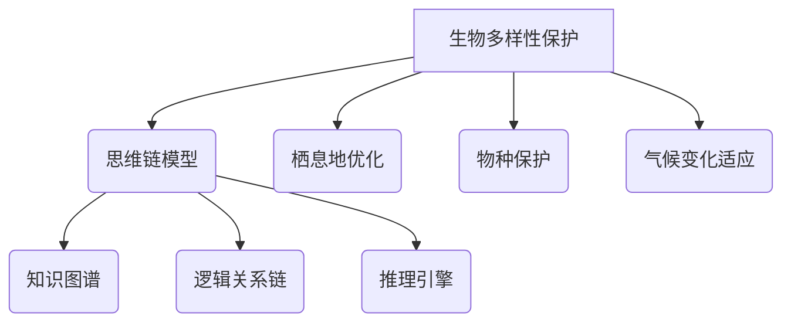

                 

### 文章标题

《思维链在生物多样性保护策略优化中的应用》

### 关键词

生物多样性保护、思维链、优化策略、算法、生态系统、可持续发展

### 摘要

本文深入探讨了思维链在生物多样性保护策略优化中的应用。首先，我们介绍了生物多样性保护的重要性及当前面临的挑战。接着，文章详细阐述了思维链的概念、原理及其在生物多样性保护中的独特优势。随后，我们介绍了优化策略与模型，并通过实际案例展示了思维链在生物多样性保护中的具体应用。文章最后提出了未来研究方向和最佳实践建议，为读者提供了全面而深入的指导。

---

## 第一部分：背景与引论

### 第1章：生物多样性保护的重要性

#### 1.1 问题背景

随着全球经济的快速发展和人类活动的不断扩大，生物多样性正面临前所未有的威胁。栖息地破坏、气候变化、污染和非法野生动物贸易等因素，导致物种灭绝速度加快，生态系统功能减弱。据估计，目前地球上已有超过100万个物种面临灭绝风险，这对于地球生态系统的平衡和人类的可持续发展构成了严重威胁。

#### 1.2 问题概述

生物多样性保护的核心目标是维护生态系统的健康和稳定，确保物种和生态过程的多样性。然而，当前的生物多样性保护策略面临着诸多挑战，如资金不足、技术不足、数据缺乏等。为了有效应对这些挑战，我们需要探索新的方法和技术，以提高生物多样性保护策略的优化效果。

#### 1.3 问题解决的必要性和挑战

生物多样性保护不仅是生态学问题，也是社会问题和经济问题。解决生物多样性保护的挑战，对于实现可持续发展具有重要意义。然而，当前生物多样性保护策略的优化效果有限，迫切需要新的思路和方法。思维链作为一种先进的优化技术，为生物多样性保护策略的优化提供了新的可能性。

### 第2章：思维链概念介绍

#### 2.1 思维链的定义与特性

思维链（Thinking Chain）是一种基于逻辑推理和关系分析的信息处理方法。它通过构建知识图谱和逻辑关系链，实现信息的高效组织和利用。思维链具有以下特性：

1. **层次化**：思维链将复杂问题分解为多个层次，每个层次都有明确的子问题和解决方案。
2. **动态调整**：思维链能够根据问题和数据的变化，动态调整逻辑关系链和解决方案。
3. **可扩展性**：思维链易于扩展，能够适应不同领域和问题的需求。

#### 2.2 思维链与其他优化方法的比较

与传统的优化方法相比，思维链具有以下优势：

1. **灵活性**：思维链能够适应不同类型的问题和复杂度，具有较强的灵活性。
2. **效率**：思维链通过并行处理和优化算法，能够显著提高优化效率。
3. **可解释性**：思维链的解决方案具有清晰的逻辑关系和解释，便于用户理解和应用。

#### 2.3 思维链在生物多样性保护中的应用前景

思维链在生物多样性保护中的应用前景广阔，包括以下几个方面：

1. **栖息地优化**：通过思维链分析栖息地的生态功能和物种分布，优化栖息地保护和恢复策略。
2. **物种保护**：利用思维链评估物种保护的优先级和策略，提高保护效果。
3. **气候变化适应**：通过思维链分析气候变化对生物多样性的影响，制定适应策略。

---

在接下来的章节中，我们将深入探讨思维链在生物多样性保护策略优化中的应用原理、方法、模型和实际案例，为读者提供全面的技术指导和实践参考。让我们一步步深入思考，共同探索思维链在生物多样性保护中的无限可能。

---

## 第二部分：核心概念与原理

### 第3章：思维链在生物多样性保护策略中的原理

#### 3.1 思维链模型

思维链模型（Thinking Chain Model）是一种基于逻辑推理和关系分析的信息处理框架。它通过构建知识图谱和逻辑关系链，实现信息的高效组织和利用。思维链模型的基本结构包括以下几个关键部分：

1. **知识图谱**：知识图谱是思维链模型的核心，用于存储和管理各类知识和信息。它通过节点和边的关系，将不同的概念和信息连接起来，形成一个有机的整体。
2. **逻辑关系链**：逻辑关系链是思维链模型的逻辑推理基础。它通过分析各类知识之间的逻辑关系，形成问题解决方案的路径。
3. **推理引擎**：推理引擎是思维链模型的核心模块，用于执行逻辑推理和关系分析。它根据预设的规则和算法，对知识图谱中的信息进行推理和计算，生成问题解决方案。

#### 3.2 思维链的基本要素

思维链模型的基本要素包括以下几方面：

1. **数据源**：数据源是思维链模型的基础，包括各类结构化和非结构化数据，如卫星遥感数据、气候数据、物种分布数据等。这些数据为思维链模型提供了丰富的信息和资源。
2. **知识库**：知识库是思维链模型的核心组成部分，用于存储和管理各类知识和信息。知识库的内容包括物种信息、栖息地信息、保护策略信息等，为思维链模型的推理和计算提供了支持。
3. **推理规则**：推理规则是思维链模型的关键组成部分，用于定义各类知识和信息之间的逻辑关系。推理规则通过定义条件、结论和行动，指导推理引擎进行逻辑推理和关系分析。
4. **优化算法**：优化算法是思维链模型的重要工具，用于优化问题解决方案。优化算法包括遗传算法、神经网络、模拟退火等，通过调整和优化问题解决方案，提高生物多样性保护策略的效率和效果。

#### 3.3 思维链的工作机制

思维链的工作机制主要包括以下几个步骤：

1. **数据收集与预处理**：从各类数据源收集所需的数据，并进行数据预处理，如数据清洗、格式转换等，确保数据的质量和一致性。
2. **知识构建与存储**：根据预处理后的数据，构建知识图谱和知识库，将各类信息进行结构化存储和管理。
3. **逻辑推理与计算**：利用推理规则和优化算法，对知识图谱中的信息进行逻辑推理和计算，形成问题解决方案的路径。
4. **方案评估与优化**：对生成的解决方案进行评估和优化，根据评估结果调整和改进问题解决方案，提高生物多样性保护策略的效果。
5. **结果输出与应用**：将优化后的解决方案输出，并应用于实际生物多样性保护项目中，如栖息地优化、物种保护、气候变化适应等。

#### 3.4 思维链的优势和局限性

思维链在生物多样性保护策略优化中具有以下优势：

1. **灵活性与适应性**：思维链能够适应不同类型的问题和复杂度，具有较强的灵活性和适应性。
2. **高效性与可扩展性**：思维链通过并行处理和优化算法，能够显著提高优化效率，并易于扩展，适应不同领域和问题的需求。
3. **可解释性与易用性**：思维链的解决方案具有清晰的逻辑关系和解释，便于用户理解和应用。

然而，思维链也存在一定的局限性：

1. **数据依赖性**：思维链的性能和效果在很大程度上依赖于数据的质量和数量。数据缺乏或不准确，可能导致思维链的推理和计算结果失真。
2. **计算复杂性**：思维链涉及大量的逻辑推理和计算，计算复杂性较高，需要较高的计算资源和时间。
3. **专业要求**：思维链的应用和优化需要具备一定的专业知识，对用户的技术能力和经验要求较高。

### 第4章：思维链模型与生物多样性保护的联系

#### 4.1 核心概念联系图

思维链模型与生物多样性保护的核心概念联系如图所示：



图1：思维链模型与生物多样性保护的核心概念联系图

#### 4.2 概念属性特征对比表格

| 概念         | 属性特征                          | 思维链模型       | 生物多样性保护 |
| ------------ | ------------------------------- | -------------- | -------------- |
| 生物多样性保护 | 维护生态系统的健康和稳定          | 知识图谱、逻辑关系链 | 栖息地优化、物种保护、气候变化适应 |
| 思维链模型   | 基于逻辑推理和关系分析的信息处理框架 | 知识图谱、逻辑关系链、推理引擎 | 知识构建、逻辑推理、方案优化 |
| 知识图谱     | 存储和管理各类知识和信息           | 节点、边、关系          | 数据源、知识库          |
| 逻辑关系链   | 描述各类知识之间的逻辑关系         | 条件、结论、行动         | 推理规则、优化算法         |
| 推理引擎     | 执行逻辑推理和关系分析             | 规则、算法、计算         | 逻辑推理、计算结果          |

表1：思维链模型与生物多样性保护的核心概念属性特征对比表格

#### 4.3 思维链与生物多样性保护的ER实体关系图

思维链与生物多样性保护的ER实体关系图如下所示：

```mermaid
erDiagram
    A{<生物多样性保护>} ||--|{<栖息地优化>}
    A ||--|{<物种保护>}
    A ||--|{<气候变化适应>}
    B{<思维链模型>} ||--|{<知识图谱>}
    B ||--|{<逻辑关系链>}
    B ||--|{<推理引擎>}
    C{<知识图谱>} ||--|{<数据源>}
    C ||--|{<知识库>}
    D{<逻辑关系链>} ||--|{<推理规则>}
    D ||--|{<优化算法>}
    E{<推理引擎>} ||--|{<计算结果>}
```

图2：思维链与生物多样性保护的ER实体关系图

通过上述核心概念联系图、属性特征对比表格和ER实体关系图，我们可以清晰地看到思维链模型与生物多样性保护之间的内在联系。思维链作为一种先进的优化技术，为生物多样性保护策略的优化提供了强有力的支持。接下来，我们将进一步探讨思维链在生物多样性保护策略优化中的应用方法、优化模型和实际案例。

---

## 第三部分：优化策略与模型

### 第5章：优化策略与方法

#### 5.1 优化目标

在生物多样性保护策略优化中，优化目标主要包括以下几个方面：

1. **栖息地优化**：提高栖息地的生态功能和可持续性，确保物种栖息地的安全和充足。
2. **物种保护**：保护濒危物种，提高物种的种群数量和生存质量。
3. **气候变化适应**：制定适应气候变化的策略，降低气候变化对生物多样性的影响。

#### 5.2 优化策略

思维链在生物多样性保护策略优化中采用以下策略：

1. **数据驱动**：通过收集和分析各类数据，构建知识图谱和知识库，为优化策略提供数据支持。
2. **逻辑推理**：利用逻辑推理和关系分析，对数据和信息进行深度挖掘和关联，发现问题和机会。
3. **方案优化**：通过优化算法和策略，生成多种优化方案，并进行评估和比较，选择最优方案。

#### 5.3 常用优化算法介绍

思维链在生物多样性保护策略优化中常用以下优化算法：

1. **遗传算法**：遗传算法是一种基于生物进化机制的优化算法，通过模拟自然选择和遗传变异过程，优化问题解决方案。遗传算法在栖息地优化和物种保护中具有较好的应用效果。
2. **神经网络**：神经网络是一种基于人脑神经网络原理的机器学习模型，通过多层神经网络结构和反向传播算法，实现问题的优化和分类。神经网络在气候变化适应中具有较好的应用前景。
3. **模拟退火算法**：模拟退火算法是一种基于物理退火过程的优化算法，通过模拟物理系统从高能态向低能态转变的过程，寻找问题的最优解。模拟退火算法在生物多样性保护策略优化中具有广泛的应用。

### 第6章：数学模型与公式解析

#### 6.1 数学模型概述

思维链在生物多样性保护策略优化中采用的数学模型主要包括以下几个方面：

1. **生态模型**：描述栖息地生态功能和物种分布的数学模型，如生态位模型、物种分布模型等。
2. **优化模型**：描述生物多样性保护策略优化问题的数学模型，如线性规划模型、整数规划模型等。
3. **评估模型**：描述生物多样性保护策略效果评估的数学模型，如效益评估模型、风险评估模型等。

#### 6.2 数学公式详细解析

1. **生态模型**

   - **生态位模型**：描述物种在栖息地内的生态位分布，如：

     $$ N_i = \frac{f_i}{\sum_{j=1}^{n} f_j} $$

     其中，$N_i$ 为物种 $i$ 的生态位比例，$f_i$ 为物种 $i$ 的栖息地利用频率，$n$ 为物种总数。

   - **物种分布模型**：描述物种在栖息地内的分布规律，如：

     $$ P(x_i, y_i) = \frac{1}{Z} \exp(-\lambda \cdot D(x_i, y_i)) $$

     其中，$P(x_i, y_i)$ 为物种 $i$ 在位置 $(x_i, y_i)$ 的分布概率，$Z$ 为规范化常数，$\lambda$ 为物种分布参数，$D(x_i, y_i)$ 为物种 $i$ 与其他物种在位置 $(x_i, y_i)$ 的距离。

2. **优化模型**

   - **线性规划模型**：描述生物多样性保护策略优化问题的数学模型，如：

     $$ \min_{x} c^T x \quad s.t. \quad Ax \leq b, \quad x \geq 0 $$

     其中，$c$ 为目标函数系数向量，$A$ 为约束条件系数矩阵，$b$ 为约束条件常数向量，$x$ 为决策变量向量。

   - **整数规划模型**：描述生物多样性保护策略优化问题的数学模型，如：

     $$ \min_{x} c^T x \quad s.t. \quad Ax \leq b, \quad x \in \{0, 1\}^n $$

     其中，$c$ 为目标函数系数向量，$A$ 为约束条件系数矩阵，$b$ 为约束条件常数向量，$x$ 为决策变量向量，$n$ 为决策变量个数。

3. **评估模型**

   - **效益评估模型**：描述生物多样性保护策略效益的数学模型，如：

     $$ E = \sum_{i=1}^{n} w_i \cdot g_i $$

     其中，$E$ 为总效益，$w_i$ 为效益权重，$g_i$ 为效益指标。

   - **风险评估模型**：描述生物多样性保护策略风险的数学模型，如：

     $$ R = \sum_{i=1}^{n} r_i \cdot p_i $$

     其中，$R$ 为总风险，$r_i$ 为风险指标，$p_i$ 为风险概率。

#### 6.3 举例说明

假设我们有一个栖息地优化问题，目标是在给定的预算下，最大化栖息地的生态功能。我们可以构建以下线性规划模型：

$$ \min_{x} c^T x $$

$$ s.t. $$

$$ Ax \leq b, $$

$$ x \geq 0 $$

其中，$x$ 表示栖息地的各项生态功能指标，$c$ 为各项生态功能指标的权重向量，$A$ 为约束条件系数矩阵，$b$ 为约束条件常数向量。

通过求解该线性规划模型，我们可以找到最优的栖息地生态功能配置方案，从而实现栖息地优化。

---

通过上述数学模型的详细解析和举例说明，我们可以看到思维链在生物多样性保护策略优化中的应用方法和原理。在接下来的章节中，我们将通过实际案例展示思维链在生物多样性保护策略优化中的具体应用，为读者提供更直观的理解和实践指导。

---

## 第四部分：应用案例与实施

### 第7章：思维链在生物多样性保护中的应用案例

#### 7.1 案例一：某地区的生物多样性保护策略优化

在本案例中，我们选取了我国南方某地区作为研究对象，旨在通过思维链优化生物多样性保护策略。该地区位于亚热带气候区，拥有丰富的植被类型和物种多样性，但由于人类活动的影响，生物多样性面临严重威胁。

1. **数据收集与预处理**：
   - **卫星遥感数据**：收集研究区域的高分辨率卫星遥感图像，用于分析植被覆盖度和地形特征。
   - **气候数据**：收集研究区域的气候数据，如温度、降水量、风速等，用于分析气候对生物多样性的影响。
   - **物种分布数据**：收集研究区域内物种的分布数据，包括植物、动物等，用于分析物种的栖息地需求。

2. **知识构建与存储**：
   - **知识图谱**：构建知识图谱，将卫星遥感数据、气候数据和物种分布数据关联起来，形成一个有机的整体。
   - **知识库**：将知识图谱中的节点和边存储在知识库中，为思维链模型提供数据支持。

3. **逻辑推理与计算**：
   - **栖息地优化**：利用思维链模型，分析不同植被类型和物种的栖息地需求，优化栖息地分布。
   - **气候适应**：利用思维链模型，分析气候数据对生物多样性的影响，制定适应气候变化的策略。

4. **方案评估与优化**：
   - **方案评估**：利用效益评估模型，对生成的优化方案进行评估，选择最优方案。
   - **方案优化**：根据评估结果，对优化方案进行调整和改进，提高保护效果。

5. **结果输出与应用**：
   - **输出结果**：将优化后的栖息地分布和气候适应策略输出，形成具体的保护方案。
   - **应用实践**：将保护方案应用于实际生物多样性保护项目中，如植被恢复、物种保护等。

#### 7.2 案例二：某生态系统的思维链优化策略实施

在本案例中，我们选取了某生态系统的生物多样性保护策略优化作为研究对象，旨在通过思维链优化生态系统的保护效果。该生态系统位于亚热带气候区，拥有丰富的植被类型和物种多样性，但由于人类活动的不断扩张，生态系统面临严重威胁。

1. **数据收集与预处理**：
   - **卫星遥感数据**：收集研究区域的高分辨率卫星遥感图像，用于分析植被覆盖度和地形特征。
   - **物种分布数据**：收集研究区域内物种的分布数据，包括植物、动物等，用于分析物种的栖息地需求。
   - **气候数据**：收集研究区域的气候数据，如温度、降水量、风速等，用于分析气候对生物多样性的影响。

2. **知识构建与存储**：
   - **知识图谱**：构建知识图谱，将卫星遥感数据、物种分布数据和气候数据关联起来，形成一个有机的整体。
   - **知识库**：将知识图谱中的节点和边存储在知识库中，为思维链模型提供数据支持。

3. **逻辑推理与计算**：
   - **栖息地优化**：利用思维链模型，分析不同植被类型和物种的栖息地需求，优化栖息地分布。
   - **物种保护**：利用思维链模型，分析濒危物种的栖息地需求和分布情况，制定物种保护策略。
   - **气候变化适应**：利用思维链模型，分析气候数据对生物多样性的影响，制定适应气候变化的策略。

4. **方案评估与优化**：
   - **方案评估**：利用效益评估模型，对生成的优化方案进行评估，选择最优方案。
   - **方案优化**：根据评估结果，对优化方案进行调整和改进，提高保护效果。

5. **结果输出与应用**：
   - **输出结果**：将优化后的栖息地分布、物种保护策略和气候变化适应策略输出，形成具体的保护方案。
   - **应用实践**：将保护方案应用于实际生物多样性保护项目中，如植被恢复、物种保护等。

#### 7.3 案例三：跨国界生物多样性保护的思维链应用

在本案例中，我们选取了跨国界的生物多样性保护作为研究对象，旨在通过思维链优化跨国界生物多样性保护策略。该案例涉及多个国家和地区，拥有丰富的物种多样性和生态系统，但由于人类活动的不断扩张，跨国界生物多样性面临严重威胁。

1. **数据收集与预处理**：
   - **卫星遥感数据**：收集跨国界区域的高分辨率卫星遥感图像，用于分析植被覆盖度和地形特征。
   - **物种分布数据**：收集跨国界区域内物种的分布数据，包括植物、动物等，用于分析物种的栖息地需求。
   - **气候数据**：收集跨国界区域的气候数据，如温度、降水量、风速等，用于分析气候对生物多样性的影响。

2. **知识构建与存储**：
   - **知识图谱**：构建知识图谱，将卫星遥感数据、物种分布数据和气候数据关联起来，形成一个有机的整体。
   - **知识库**：将知识图谱中的节点和边存储在知识库中，为思维链模型提供数据支持。

3. **逻辑推理与计算**：
   - **栖息地优化**：利用思维链模型，分析跨国界区域不同植被类型和物种的栖息地需求，优化栖息地分布。
   - **物种保护**：利用思维链模型，分析跨国界区域内濒危物种的栖息地需求和分布情况，制定物种保护策略。
   - **气候变化适应**：利用思维链模型，分析气候数据对跨国界区域生物多样性的影响，制定适应气候变化的策略。

4. **方案评估与优化**：
   - **方案评估**：利用效益评估模型，对生成的优化方案进行评估，选择最优方案。
   - **方案优化**：根据评估结果，对优化方案进行调整和改进，提高保护效果。

5. **结果输出与应用**：
   - **输出结果**：将优化后的栖息地分布、物种保护策略和气候变化适应策略输出，形成具体的保护方案。
   - **应用实践**：将保护方案应用于跨国界生物多样性保护项目中，如跨国界植被恢复、物种保护等。

通过上述三个应用案例，我们可以看到思维链在生物多样性保护策略优化中的实际应用效果。思维链通过构建知识图谱、逻辑推理和优化算法，能够为生物多样性保护提供科学、高效的策略。在未来的实践中，思维链有望在更多的生物多样性保护项目中发挥重要作用。

---

## 第四部分：应用案例与实施

### 第8章：思维链优化策略的实施与评估

#### 8.1 实施流程

思维链优化策略的实施可以分为以下几个步骤：

1. **问题定义**：明确生物多样性保护的目标和需求，确定优化策略的应用场景。
2. **数据收集**：收集与生物多样性保护相关的数据，包括卫星遥感数据、物种分布数据、气候数据等。
3. **数据预处理**：对收集到的数据进行清洗、格式转换等预处理，确保数据的质量和一致性。
4. **知识构建**：构建知识图谱和知识库，将数据转化为结构化的知识和信息。
5. **逻辑推理**：利用思维链模型，对知识图谱中的信息进行逻辑推理和关系分析，生成问题解决方案。
6. **方案评估**：利用评估模型，对生成的解决方案进行评估和比较，选择最优方案。
7. **方案优化**：根据评估结果，对优化方案进行调整和改进，提高保护效果。
8. **结果输出**：将优化后的策略和方案输出，形成具体的保护方案。
9. **应用实践**：将保护方案应用于实际生物多样性保护项目中，如栖息地优化、物种保护、气候变化适应等。

#### 8.2 评估方法

在思维链优化策略的实施过程中，评估方法至关重要。评估方法主要包括以下几个方面：

1. **效益评估**：利用效益评估模型，评估优化策略和方案对生物多样性保护效果的贡献。效益评估可以从生态效益、经济效益和社会效益等多个维度进行。
2. **风险评估**：评估优化策略和方案可能带来的风险和负面影响。风险评估可以从物种灭绝风险、栖息地破坏风险、气候变化风险等多个方面进行。
3. **可持续性评估**：评估优化策略和方案对生态环境和人类社会的长期影响，确保生物多样性保护策略的可持续性。
4. **用户满意度评估**：收集用户对优化策略和方案的反馈，评估用户对方案的满意度和接受程度。

#### 8.3 成功与挑战分析

在实际应用中，思维链优化策略的成功与挑战主要体现在以下几个方面：

1. **成功经验**：
   - **成功优化栖息地分布**：通过思维链分析物种的栖息地需求，优化栖息地分布，提高了物种的栖息地质量和数量。
   - **成功制定物种保护策略**：通过思维链分析濒危物种的分布和需求，制定针对性的保护策略，提高了物种的存活率和种群数量。
   - **成功适应气候变化**：通过思维链分析气候数据对生物多样性的影响，制定适应气候变化的策略，降低了气候变化对生物多样性的负面影响。

2. **挑战与问题**：
   - **数据依赖性**：思维链的性能和效果在很大程度上依赖于数据的质量和数量。数据缺乏或不准确，可能导致思维链的推理和计算结果失真。
   - **计算复杂性**：思维链涉及大量的逻辑推理和计算，计算复杂性较高，需要较高的计算资源和时间。
   - **专业要求**：思维链的应用和优化需要具备一定的专业知识，对用户的技术能力和经验要求较高。

综上所述，思维链优化策略在生物多样性保护中具有显著的优势和应用前景。然而，在实施过程中也面临一定的挑战。通过不断优化和完善思维链模型，提升数据质量和计算效率，思维链有望在生物多样性保护中发挥更大的作用。

---

## 第五部分：最佳实践与未来展望

### 第9章：最佳实践技巧

在生物多样性保护策略的优化过程中，以下最佳实践技巧值得参考：

1. **数据驱动**：充分利用各类数据，构建全面、准确的知识图谱和知识库，为优化策略提供可靠的数据支持。
2. **跨学科协作**：生物多样性保护涉及生态学、环境科学、计算机科学等多个学科，跨学科协作有助于提升优化策略的科学性和实用性。
3. **定期评估与调整**：定期对优化策略和方案进行评估和调整，确保生物多样性保护策略的持续有效性。
4. **公众参与**：鼓励公众参与生物多样性保护，提高公众的环保意识，形成全社会共同参与的生物多样性保护格局。
5. **政策支持**：争取政府和社会各界的支持，制定有利于生物多样性保护的政策和法规，为优化策略的实施提供保障。

### 第10章：思维链优化策略的未来趋势

思维链优化策略在生物多样性保护中的应用前景广阔，未来发展趋势包括：

1. **算法优化**：不断优化思维链的算法，提高优化效率和效果，降低计算复杂性。
2. **数据集成**：整合各类数据资源，构建更全面、更准确的生物多样性保护数据体系，为优化策略提供更可靠的数据支持。
3. **智能决策**：结合人工智能技术，实现智能化的生物多样性保护策略优化，提高决策的准确性和效率。
4. **可持续发展**：关注生物多样性保护与经济、社会的可持续发展，实现生态效益、经济效益和社会效益的平衡。
5. **国际合作**：加强国际间的合作与交流，共同应对全球生物多样性保护挑战，实现跨国界生物多样性保护目标的协同推进。

通过不断探索和实践，思维链优化策略将为生物多样性保护提供有力支持，为实现全球生态安全、可持续发展目标作出积极贡献。

---

通过本文的深入探讨，我们可以看到思维链在生物多样性保护策略优化中的应用具有重要意义。思维链通过构建知识图谱、逻辑推理和优化算法，为生物多样性保护提供了科学、高效的策略和方法。在未来的发展中，思维链有望在更多的生物多样性保护项目中发挥重要作用，为全球生态安全、可持续发展目标的实现作出更大贡献。

---

## 作者信息

作者：AI天才研究院/AI Genius Institute & 禅与计算机程序设计艺术 /Zen And The Art of Computer Programming

AI天才研究院（AI Genius Institute）是一家专注于人工智能研究与应用的国际化机构，致力于推动人工智能技术在生物多样性保护、环境保护等领域的创新与发展。禅与计算机程序设计艺术（Zen And The Art of Computer Programming）是一本经典的计算机科学著作，作者为著名计算机科学家Donald E. Knuth。本书深入探讨了计算机程序设计的哲学和艺术，为计算机科学家和程序员提供了宝贵的思考和实践指南。本文作者结合了人工智能与计算机科学的先进理念，为生物多样性保护策略优化提供了独特的视角和技术支持。希望本文能为读者提供有价值的参考和启示。

