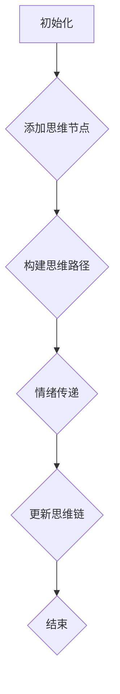
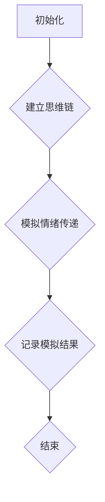
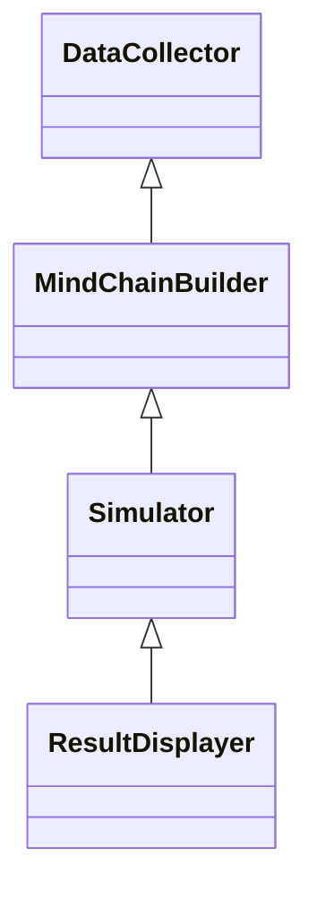
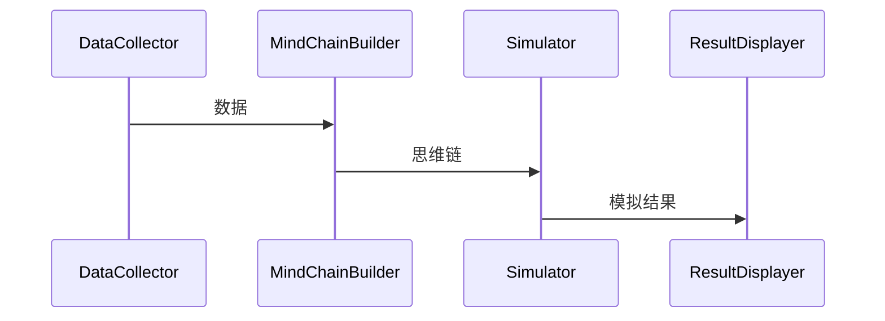

                 

# 《思维链在社会心理动态模拟中的新视角》

## 关键词

- 思维链
- 社会心理动态模拟
- 算法原理
- 系统架构设计
- 项目实战

## 摘要

本文将深入探讨思维链在社会心理动态模拟中的应用，旨在揭示思维链这一算法在模拟复杂社会心理现象中的独特视角。通过对思维链算法原理的详细解析，结合社会心理动态模拟的实际应用，本文展示了如何利用思维链构建一个具有高度真实性和预测能力的模拟系统。此外，文章还介绍了系统的功能设计、架构设计和项目实战，为读者提供了全面的技术实现路径。

## 第一部分：背景介绍

### 第1章：问题背景

#### 1.1.1 问题背景

随着信息技术和人工智能的快速发展，社会心理动态研究逐渐成为热点。传统的社会心理研究方法往往依赖于问卷调查和现场观察，这些方法存在一定的局限性，例如样本代表性不足、数据收集周期长等。为了更准确地捕捉和分析社会心理动态，迫切需要一种新的研究工具。

#### 1.1.2 问题描述

社会心理动态涉及个体、群体以及环境之间的复杂交互。例如，群体情绪的传播、社会行为的演变等，这些现象难以用传统的数学模型进行准确描述。因此，如何构建一个能够模拟社会心理动态的模型，成为一个亟待解决的问题。

#### 1.1.3 问题解决

思维链算法提供了一种新的视角。它通过模拟人类思维的过程，将复杂的心理现象转化为可计算的模型。这种方法不仅能够提高模拟的精度，还能够动态地捕捉心理现象的演变过程。

#### 1.1.4 边界与外延

思维链在社会心理动态模拟中的应用边界包括：群体情绪传播、社会行为演变、文化价值观传承等。其外延则涉及多个学科领域，如心理学、社会学、计算机科学等。

#### 1.1.5 概念结构与核心要素组成

思维链算法的核心概念包括：思维节点、思维路径、情绪传递等。这些概念共同构成了一个复杂的网络结构，能够有效地模拟社会心理动态。

### 第2章：核心概念与联系

#### 2.1.1 核心概念原理

思维链算法的基本原理是通过模拟人类思维的过程，建立一系列思维节点和思维路径。每个思维节点代表一个独立的思考内容，思维路径则表示这些思考内容之间的逻辑关系。

#### 2.1.2 概念属性特征对比表格

| 概念名称 | 属性特征 |
|----------|----------|
| 思维节点 | 代表独立的思考内容 |
| 思维路径 | 表示思维内容之间的逻辑关系 |
| 情绪传递 | 反映心理现象的动态变化 |

#### 2.1.3 ER实体关系图架构

思维链算法的实体关系图架构如下：

```mermaid
erDiagram
    MindNode ||--|{ Emotion }|-->: 传递
    MindPath ||--|{ Logic }|-->: 关联
```

## 第二部分：算法原理讲解

### 第3章：思维链的算法原理

#### 3.1.1 算法原理概述

思维链算法通过模拟人类思维的过程，构建一个动态的、自适应的思维方式。其核心在于对思维节点和思维路径的灵活管理和动态调整。

#### 3.1.2 算法流程图（使用Mermaid绘制）



#### 3.1.3 Python源代码阐述

```python
class MindNode:
    def __init__(self, content):
        self.content = content
        self.children = []

    def add_child(self, child):
        self.children.append(child)

def build_mind_chain(content_list):
    mind_chain = []
    for content in content_list:
        node = MindNode(content)
        mind_chain.append(node)
    return mind_chain

def update_mind_chain(mind_chain, emotion):
    for node in mind_chain:
        node.emotion = emotion
        for child in node.children:
            update_mind_chain([child], emotion)
```

#### 3.1.4 算法原理的数学模型与公式

思维链的数学模型可以表示为：

$$
\mathbf{M} = \{ \mathbf{m}_1, \mathbf{m}_2, ..., \mathbf{m}_n \}
$$

其中，$\mathbf{m}_i$ 表示第 $i$ 个思维节点，包含内容 $C_i$ 和情绪 $E_i$。

#### 3.1.5 通俗易懂地举例说明

假设有一个人正在思考“吃饭”的问题，他的思维链可以表示为：

$$
\{ "饿了", "需要吃饭", "餐馆", "火锅" \}
$$

当情绪“饥饿感”传递到这个思维链时，它会影响到整个思维链，使得人产生去餐馆吃火锅的冲动。

### 第4章：社会心理动态模拟

#### 4.1.1 社会心理动态模拟概述

社会心理动态模拟是通过思维链算法，模拟社会个体和群体之间的心理互动过程。这种方法能够动态地捕捉社会心理现象的演变，为研究社会行为提供新的视角。

#### 4.1.2 模拟流程图（使用Mermaid绘制）



#### 4.1.3 模拟的数学模型与公式

社会心理动态模拟的数学模型可以表示为：

$$
\mathbf{P} = \mathbf{M} \cdot \mathbf{E}
$$

其中，$\mathbf{P}$ 表示社会心理状态，$\mathbf{M}$ 表示思维链，$\mathbf{E}$ 表示情绪传递矩阵。

#### 4.1.4 社会心理动态模拟的实际应用

社会心理动态模拟可以应用于多个领域，例如：群体情绪预测、社会行为分析、市场预测等。通过模拟，可以更好地理解社会心理现象的演变规律，为政策制定和社会治理提供科学依据。

## 第三部分：系统分析与架构设计

### 第5章：系统功能设计

#### 5.1.1 问题场景介绍

以群体情绪预测为例，系统需要实时采集社交网络上的情绪数据，并通过思维链算法进行动态模拟，预测群体情绪的演变。

#### 5.1.2 系统功能需求

- 数据采集：实时采集社交网络上的情绪数据。
- 思维链构建：根据采集到的情绪数据，构建思维链模型。
- 模拟运行：运行思维链算法，模拟社会心理动态。
- 结果展示：展示模拟结果，包括情绪演变趋势和关键节点。

#### 5.1.3 领域模型（使用Mermaid绘制类图）



### 第6章：系统架构设计

#### 6.1.1 系统架构概述

系统采用分布式架构，包括数据采集模块、思维链构建模块、模拟运行模块和结果展示模块。各模块通过接口进行通信，保证系统的灵活性和可扩展性。

#### 6.1.2 系统架构图（使用Mermaid绘制）



#### 6.1.3 系统接口设计

- 数据采集接口：提供数据采集功能。
- 思维链构建接口：提供思维链构建功能。
- 模拟运行接口：提供模拟运行功能。
- 结果展示接口：提供结果展示功能。

#### 6.1.4 系统交互（使用Mermaid绘制序列图）


## 第四部分：项目实战

### 第7章：环境安装与核心实现

#### 7.1.1 环境安装步骤

1. 安装Python环境
2. 安装必要的库，如Numpy、Pandas等
3. 安装思维链算法库

#### 7.1.2 系统核心实现源代码

```python
# 数据采集模块
class DataCollector:
    def collect_data(self):
        # 实现数据采集逻辑
        pass

# 思维链构建模块
class MindChainBuilder:
    def build_chain(self, data):
        # 实现思维链构建逻辑
        pass

# 模拟运行模块
class Simulator:
    def run_simulation(self, chain):
        # 实现模拟运行逻辑
        pass

# 结果展示模块
class ResultDisplayer:
    def display_results(self, results):
        # 实现结果展示逻辑
        pass
```

#### 7.1.3 代码应用解读与分析

通过对核心代码的解读，可以看出各个模块的功能和接口设计。例如，`DataCollector` 类负责数据采集，`MindChainBuilder` 类负责思维链构建，`Simulator` 类负责模拟运行，`ResultDisplayer` 类负责结果展示。

#### 7.1.4 实际案例分析与详细讲解剖析

以一个实际的案例，展示如何利用思维链算法进行社会心理动态模拟。例如，模拟一个社交网络中的情绪传播过程，分析情绪的演变趋势和关键节点。

### 第8章：项目小结

#### 8.1.1 项目总结

本文通过深入探讨思维链在社会心理动态模拟中的应用，展示了如何利用思维链算法构建一个具有高度真实性和预测能力的模拟系统。通过对系统的功能设计、架构设计和项目实战的详细讲解，为读者提供了全面的技术实现路径。

#### 8.1.2 最佳实践 tips

1. 确保数据采集的准确性
2. 合理设计思维链结构，提高模拟的精度
3. 优化算法性能，提高模拟效率

#### 8.1.3 注意事项

1. 注意保护用户隐私，确保数据安全
2. 针对不同场景，调整思维链参数，提高适用性

#### 8.1.4 拓展阅读

1. 《社会心理学》（David Myers著）
2. 《思维与情感：心理学导论》（Michael S. Gazzaniga著）
3. 《人工智能：一种现代的方法》（Stuart J. Russell & Peter Norvig著）

---

**作者：AI天才研究院/AI Genius Institute & 禅与计算机程序设计艺术 /Zen And The Art of Computer Programming**

