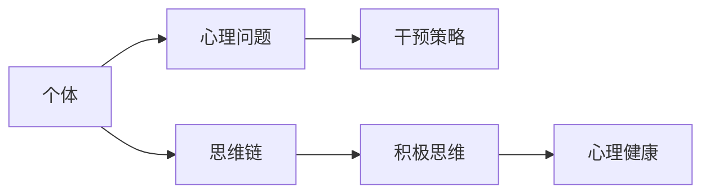

                 

### 引言

#### 1.1 问题背景

随着社会的快速发展和生活节奏的加快，社会心理问题日益凸显。无论是个人层面的焦虑、抑郁，还是社会层面的群体心理问题，都对社会稳定和个体幸福产生了深远影响。根据世界卫生组织（WHO）的数据，心理障碍已成为全球主要的健康问题之一，预计到2030年，抑郁症将成为全球第二大疾病负担。

然而，现有的心理干预策略在实际应用中存在诸多局限性。传统的方法如心理咨询、认知行为疗法、药物治疗等，虽然在某些情况下能够取得一定的效果，但往往耗时较长、效果不显著，且在应对复杂的社会心理问题时显得力不从心。此外，这些方法在实施过程中也面临着资源不足、专业人才匮乏等问题。

思维链作为一种创新的社会心理干预策略，旨在通过优化和引导个体的思维方式，从源头上解决心理问题。本文将深入探讨思维链的概念与原理，分析其在社会心理干预中的应用，并探讨其与其他干预策略的协同作用。

#### 1.2 描述问题

社会心理干预策略的需求主要源于以下几个方面：

1. **个体心理需求**：随着生活压力的增加，越来越多的个体需要专业的心理支持和干预。
2. **社会心理问题**：如社会不公、贫困、失业、家庭暴力等，这些因素会引发广泛的心理问题。
3. **公共卫生需求**：心理问题已成为公共卫生领域的重要议题，需要有效的干预策略来应对。

心理干预策略的目标与原则包括：

1. **目标**：
   - 缓解心理压力和情绪困扰。
   - 提高个体应对问题的能力。
   - 增强社会支持和联结感。

2. **原则**：
   - 个体化：根据个体的具体情况制定干预计划。
   - 积极性：鼓励个体积极参与干预过程，提高自我效能感。
   - 有效性：确保干预策略能够带来显著的心理改善。

然而，传统心理干预策略在应对复杂的社会心理问题时往往显得单一和局限。思维链作为一种创新策略，为解决这些问题提供了新的思路和方法。

#### 1.3 解决问题

思维链（Mind Chain）是一种基于认知科学和社会心理学理论的社会心理干预策略。它通过构建和优化个体之间的思维联系，帮助个体更有效地处理心理问题。

思维链的概念与原理：

- **概念**：思维链是指通过一系列逻辑推理、联想和思维方式，将个体的思维过程有序组织起来，形成一种具有结构性、层次性和灵活性的思维模式。
- **原理**：思维链通过引导个体识别和改变负面思维模式，建立积极的思维习惯，从而改善心理健康。

思维链在社会心理干预中的应用：

1. **引导个体识别负面思维**：通过反思和自我观察，帮助个体识别自己的负面思维模式。
2. **构建积极的思维链**：通过正向思维和理性思考，建立积极的思维模式。
3. **培养灵活的思维**：通过多样化思维策略，提高个体的思维灵活性和适应性。

通过思维链的应用，可以有效地缓解心理压力，提高个体应对问题的能力，实现心理健康的长期改善。

#### 1.4 边界与外延

思维链的应用范围广泛，不仅适用于个人层面的心理干预，还可以应用于社会层面的大型干预项目。例如，在应对疫情、自然灾害等突发事件时，通过思维链的干预策略，可以有效地缓解社会层面的心理问题。

此外，思维链还可以与其他干预策略如认知行为疗法、心理剧疗法等相结合，发挥更大的效果。这种协同作用不仅能够弥补单一策略的不足，还可以提高干预的整体效果。

#### 1.5 核心概念与联系

**核心概念原理**：

- **思维链**：通过逻辑推理和联想，将个体的思维过程有序组织起来，形成结构性、层次性和灵活性的思维模式。
- **社会心理干预策略**：通过心理支持和干预，缓解心理压力，提高个体应对问题的能力。

**概念属性特征对比表格**：

| 概念         | 思维链                  | 社会心理干预策略                |
| ------------ | ---------------------- | ------------------------------ |
| 定义         | 逻辑推理与联想          | 心理支持与干预                  |
| 特点         | 结构性、层次性、灵活性   | 个体化、积极性、有效性           |
| 目的         | 改善心理健康            | 缓解心理压力、提高应对能力       |
| 应用范围      | 个人与社会层面          | 个人、家庭、社区等层面           |

**ER实体关系图架构**：

通过上述ER实体关系图，我们可以清晰地看到个体、心理问题、干预策略、思维链和心理健康之间的逻辑关系。

### 总结

本文介绍了社会心理问题的背景和挑战，阐述了传统心理干预策略的局限性，提出了思维链作为一种创新的社会心理干预策略。通过深入探讨思维链的概念与原理，分析其在社会心理干预中的应用，以及与其他干预策略的协同作用，本文为解决复杂的社会心理问题提供了新的思路和方法。在接下来的章节中，我们将进一步详细探讨思维链的各个方面，以期为读者提供更全面的理解和应用指南。让我们继续深入思考，探索思维链在社会心理干预中的无限潜力。

### 目录大纲

## 第1章 引言
### 1.1 问题背景
### 1.2 描述问题
### 1.3 解决问题
### 1.4 边界与外延
### 1.5 核心概念与联系

## 第2章 思维链概述
### 2.1 思维链的定义与特点
### 2.2 思维链的发展历程
### 2.3 思维链的核心要素
### 2.4 思维链的应用领域

## 第3章 社会心理干预策略的基本原则
### 3.1 心理干预的定义与分类
### 3.2 社会心理干预的目标与原则
### 3.3 心理干预策略的评估标准

## 第4章 思维链在社会心理干预中的应用
### 4.1 思维链在社会心理干预中的角色
### 4.2 思维链干预策略的实践
### 4.3 案例分析

## 第5章 思维链与其他干预策略的协同作用
### 5.1 思维链与认知行为疗法的结合
### 5.2 思维链与心理剧疗法的整合
### 5.3 案例分析

## 第6章 思维链在社会心理干预中的挑战与机遇
### 6.1 挑战
### 6.2 机遇
### 6.3 发展趋势

## 第7章 思维链在社会心理干预中的实践应用
### 7.1 应用场景
### 7.2 操作步骤
### 7.3 案例分析

## 第8章 思维链在社会心理干预中的未来展望
### 8.1 未来发展方向
### 8.2 技术创新与挑战
### 8.3 社会价值与影响

## 结论

### 9. 总结
### 10. 注意事项
### 11. 拓展阅读

通过上述目录大纲，我们为读者提供了一个清晰的结构，以便更好地理解和应用思维链在社会心理干预中的创新应用。接下来，我们将逐步深入每个章节，详细探讨思维链的各个方面。

### 第2章 思维链概述

#### 2.1 思维链的定义与特点

思维链是一种基于认知科学和社会心理学的干预策略，旨在通过优化和引导个体的思维方式，解决心理问题。它通过一系列逻辑推理、联想和思维方式，将个体的思维过程有序组织起来，形成一种具有结构性、层次性和灵活性的思维模式。

**定义**：
思维链（Mind Chain）是指通过建立和优化个体之间的思维联系，形成一种有序的思维模式，帮助个体更有效地处理心理问题和挑战。

**特点**：
1. **结构性**：思维链通过系统化的方式将个体的思维过程组织起来，使其具有明确的结构和层次。
2. **层次性**：思维链在不同层次上运行，从基础思维技能到高级思维策略，形成层次化的思维模式。
3. **灵活性**：思维链允许个体根据不同情境和需求调整思维方式，提高思维的灵活性和适应性。

#### 2.2 思维链的发展历程

思维链的理论基础可以追溯到20世纪中叶的认知科学和心理学研究。随着神经科学、认知心理学和计算机科学的快速发展，思维链逐渐从理论走向实践，成为社会心理干预的重要工具。

1. **早期发展**：20世纪60年代，认知心理学研究开始关注人类思维过程的结构和机制。研究者如乔治·米勒（George A. Miller）提出了“有限理性”理论，认为人类的思维过程受到认知能力的限制。
2. **中期发展**：20世纪80年代，随着计算机科学的进步，思维链的概念逐渐被应用于人工智能和认知科学领域。研究人员开始探讨如何通过计算机模拟人类思维过程，从而优化和改进人类思维方式。
3. **当前应用**：近年来，思维链在社会心理学和心理健康领域得到了广泛应用。研究者通过实证研究，验证了思维链在缓解心理压力、提高心理弹性等方面的有效性。

#### 2.3 思维链的核心要素

思维链的核心要素包括逻辑推理、联想和思维方式。这些要素相互作用，共同构成一个完整的思维过程。

1. **逻辑推理**：
   - **定义**：逻辑推理是一种从已知信息推导出新信息的思维方式。
   - **作用**：通过逻辑推理，个体可以更清晰地理解问题，找到解决问题的有效途径。
   - **实例**：假设一个人想要减肥，逻辑推理可以帮助他确定减肥的目标、制定饮食计划和运动计划。

2. **联想**：
   - **定义**：联想是指通过将当前问题与相关概念、经历或其他信息联系起来，形成新的思维路径。
   - **作用**：通过联想，个体可以拓宽思维视野，发现解决问题的新方法。
   - **实例**：在创作过程中，通过联想可以将一个创意与其他创意相联系，形成新的创意组合。

3. **思维方式**：
   - **定义**：思维方式是指个体在处理信息和解决问题时所采用的思维策略。
   - **作用**：不同的思维方式可以影响个体的思维效率和创造性。
   - **实例**：批判性思维可以帮助个体评估信息的可靠性和合理性，而创造性思维则可以帮助个体找到独特的解决方案。

#### 2.4 思维链的应用领域

思维链作为一种创新的干预策略，在多个领域展现了广泛的应用前景。

1. **心理健康领域**：
   - **应用**：通过思维链干预，个体可以学会识别和改变负面思维模式，建立积极的思维习惯。
   - **实例**：在抑郁症治疗中，思维链可以帮助患者识别和改变消极思维，提高治疗的效果。

2. **教育领域**：
   - **应用**：思维链可以用于提高学生的思维能力和创造力，促进他们的全面发展。
   - **实例**：通过思维链训练，学生可以学会如何更有效地解决问题和应对学术挑战。

3. **职业培训领域**：
   - **应用**：思维链可以用于提高职场人士的决策能力和创新能力，提升职业竞争力。
   - **实例**：企业可以通过思维链培训，帮助员工提高问题解决能力和团队合作能力。

通过以上内容，我们可以看到思维链作为一种创新的社会心理干预策略，具有广泛的应用前景和深远的影响。在接下来的章节中，我们将进一步探讨社会心理干预策略的基本原则，以便更好地理解思维链在这一领域的应用。

### 第3章 社会心理干预策略的基本原则

#### 3.1 心理干预的定义与分类

心理干预是指通过一系列方法和手段，帮助个体或群体解决心理问题、提高心理健康水平的过程。心理干预不仅包括心理咨询和治疗，还涉及预防、教育和宣传等方面。

**定义**：
心理干预（Psychological Intervention）是指通过专业的心理方法和技术，对个体或群体进行心理支持、指导和治疗，以促进其心理健康和发展的过程。

**分类**：
心理干预可以根据干预对象、干预方式和干预目标进行分类。

1. **根据干预对象分类**：
   - **个体干预**：针对个人进行心理干预，如个体心理咨询、个体治疗等。
   - **群体干预**：针对特定群体进行心理干预，如社区心理干预、学校心理干预等。

2. **根据干预方式分类**：
   - **直接干预**：直接对个体或群体进行心理治疗和指导，如面对面咨询、团体治疗等。
   - **间接干预**：通过影响个体或群体的环境来间接进行心理干预，如家庭治疗、学校教育等。

3. **根据干预目标分类**：
   - **预防性干预**：旨在预防心理问题的发生，如心理健康教育、心理危机预防等。
   - **治疗性干预**：旨在解决已经存在的心理问题，如心理治疗、药物治疗等。
   - **发展性干预**：旨在促进个体或群体的心理成长和发展，如职业辅导、教育咨询等。

#### 3.2 社会心理干预的目标与原则

社会心理干预的目标是缓解心理压力、提高心理健康水平，并促进个体和社会的发展。具体目标包括：

1. **缓解心理压力**：帮助个体应对心理困扰，减轻焦虑、抑郁等负面情绪。
2. **提高心理健康**：通过心理干预，促进个体的心理平衡和健康状态。
3. **增强心理弹性**：提高个体应对生活压力和挑战的能力，增强心理韧性。
4. **促进社会支持**：建立社会支持网络，增强个体与社会之间的联系，提升社会凝聚力。

社会心理干预的原则包括：

1. **个体化原则**：根据个体的具体情况进行心理干预，确保干预措施的有效性和针对性。
2. **积极性原则**：鼓励个体积极参与干预过程，提高自我效能感和主动性。
3. **有效性原则**：确保心理干预策略能够带来显著的心理改善，提高干预效果。
4. **协同性原则**：与其他干预策略和资源相结合，发挥综合作用，提高干预效果。

#### 3.3 心理干预策略的评估标准

心理干预策略的评估是确保干预效果的重要环节。评估标准主要包括以下几个方面：

1. **有效性**：干预策略是否能够有效缓解心理问题，提高心理健康水平。
2. **适应性**：干预策略是否能够适应个体的具体需求和环境。
3. **持续性**：干预效果是否能够持续，是否需要长期跟踪和调整。
4. **安全性**：干预策略是否安全，是否会对个体造成负面影响。
5. **可接受性**：个体是否愿意接受和配合心理干预，干预过程是否得到个体的认可。

**评估方法**：
1. **定量评估**：通过问卷、量表等工具对个体的心理状态进行量化评估。
2. **定性评估**：通过访谈、观察等手段收集个体的主观体验和反馈。
3. **比较评估**：将干预前后的心理状态进行比较，评估干预效果。

通过上述评估标准和方法，可以全面、客观地评估心理干预策略的效果，为优化和改进干预策略提供依据。

#### 结论

本章对社会心理干预策略的基本原则进行了详细阐述。通过了解心理干预的定义、分类、目标与原则，以及评估标准，我们可以更好地理解社会心理干预的实施过程和效果评估。在接下来的章节中，我们将进一步探讨思维链在社会心理干预中的应用，探讨其具体实践和案例，以期为实际应用提供更多指导。

### 第4章 思维链在社会心理干预中的应用

#### 4.1 思维链在社会心理干预中的角色

思维链在社会心理干预中扮演着至关重要的角色。作为一种基于认知科学和社会心理学的干预策略，思维链通过优化和引导个体的思维方式，帮助个体识别和改变负面思维模式，建立积极的思维习惯，从而改善心理健康。

**定义**：
在社会心理干预中，思维链是指通过逻辑推理、联想和思维方式，将个体的思维过程有序组织起来，形成结构性、层次性和灵活性的思维模式，以促进心理健康和情绪调节。

**作用**：
1. **识别负面思维**：思维链帮助个体识别和反思自己的负面思维模式，如过度悲观、自我否定等。
2. **建立积极思维**：通过正向思维和理性思考，思维链帮助个体建立积极的思维习惯，如积极乐观、自我肯定等。
3. **提高心理弹性**：思维链通过增强个体的思维灵活性和适应性，提高个体应对压力和挑战的能力。
4. **促进情绪调节**：思维链帮助个体通过理性思考和情绪管理策略，缓解焦虑、抑郁等负面情绪。

#### 4.2 思维链干预策略的实践

思维链干预策略的实践主要包括以下几个步骤：

1. **初步评估**：
   - **了解背景**：收集个体的基本信息，包括年龄、职业、生活状况等。
   - **评估心理状态**：通过问卷、访谈等方式评估个体的心理状态，包括情绪、压力水平、自我认知等。

2. **建立思维链**：
   - **识别负面思维**：通过反思和自我观察，帮助个体识别自己的负面思维模式，如消极想法、自我否定等。
   - **构建正向思维**：引导个体通过正向思维和理性思考，建立积极的思维习惯，如积极乐观、自我肯定等。
   - **思维链训练**：通过一系列的思维训练活动，如思维导图、联想训练等，帮助个体建立和强化思维链。

3. **实践应用**：
   - **情绪调节**：通过思维链，个体可以学会如何理性思考，从而调节情绪，缓解焦虑、抑郁等负面情绪。
   - **问题解决**：思维链帮助个体通过逻辑推理和联想，找到解决问题的有效途径，提高问题解决能力。
   - **自我成长**：通过思维链，个体可以学会如何自我反思和自我提升，促进心理成长和自我实现。

4. **持续跟踪**：
   - **定期评估**：在干预过程中，定期评估个体的心理状态和思维链的建立情况，调整干预策略。
   - **反馈与支持**：根据个体的反馈，提供必要的支持和指导，帮助个体克服困难和挑战。

#### 4.3 案例分析

以下是一个思维链干预策略的实践案例：

**案例背景**：
小王，一名年轻的上班族，由于工作压力大、人际关系复杂，经常感到焦虑和疲惫。他在心理咨询师的推荐下，开始尝试思维链干预策略。

**干预过程**：

1. **初步评估**：
   - **了解背景**：小王是一名软件工程师，工作繁忙，常感到时间不够用，压力很大。
   - **评估心理状态**：通过问卷和访谈，小王的心理咨询师发现他存在焦虑情绪，尤其是在面对工作任务和人际关系时。

2. **建立思维链**：
   - **识别负面思维**：小王在反思过程中，意识到自己常常陷入“灾难化思维”，即把问题看得过于严重，忽视积极的一面。
   - **构建正向思维**：通过咨询师的帮助，小王学会了如何用正向思维看待问题，如“这个问题虽然困难，但我可以找到解决办法。”

3. **实践应用**：
   - **情绪调节**：小王开始通过思维链练习来调节情绪，每次感到焦虑时，他会停下来思考问题的另一面，从而缓解焦虑情绪。
   - **问题解决**：在遇到工作难题时，小王学会了通过思维链分析问题的各个方面，找到合理的解决方案。
   - **自我成长**：通过思维链的干预，小王逐渐学会了自我反思和自我提升，提高了应对工作和生活的能力。

4. **持续跟踪**：
   - **定期评估**：心理咨询师定期与小王进行沟通，评估他的心理状态和思维链的建立情况，调整干预策略。
   - **反馈与支持**：心理咨询师根据小王的反馈，给予他鼓励和支持，帮助他克服困难和挑战。

**干预效果**：
通过思维链干预策略的实践，小王的焦虑情绪得到了明显缓解，工作效率和生活质量也得到了提升。他学会了如何用积极的态度面对问题和挑战，心理韧性得到了增强。

#### 结论

本章通过介绍思维链在社会心理干预中的角色和干预策略的实践，以及案例分析，展示了思维链在缓解心理问题、提高心理健康方面的有效性和实用性。思维链作为一种创新的干预策略，为心理健康领域提供了新的思路和方法。在接下来的章节中，我们将进一步探讨思维链与其他干预策略的协同作用，以期为心理干预提供更全面的解决方案。

### 第5章 思维链与其他干预策略的协同作用

#### 5.1 思维链与认知行为疗法的结合

认知行为疗法（Cognitive Behavioral Therapy，CBT）是一种广泛应用的心理学治疗方法，旨在通过改变个体的思维模式和信念，来改善情绪和行为问题。思维链作为一种创新的干预策略，与认知行为疗法具有很高的协同性，可以相互补充，发挥更大的效果。

**结合方式**：

1. **思维链引导CBT过程**：在CBT的治疗过程中，思维链可以通过引导个体识别和改变负面思维模式，帮助个体建立积极的认知和行为习惯。例如，在应对焦虑时，个体可以通过思维链识别焦虑思维，然后通过CBT的方法进行认知重构和行为调整。

2. **强化CBT的效果**：思维链可以作为一种辅助工具，增强CBT的治疗效果。通过思维链的训练，个体可以更加深入地理解CBT的原理和方法，提高自我调节和自我管理的能力。

**实例**：

一个焦虑症患者通过认知行为疗法进行治疗，但在面对一些特殊情境时，仍然感到难以控制自己的焦虑情绪。在治疗师的推荐下，他开始使用思维链进行辅助训练。通过思维链，他学会了如何识别和改变负面思维，如“我会失败”或“别人会嘲笑我”。通过认知重构，他开始用更理性的思维替代这些负面想法，如“我可以尝试一下，即使失败也没关系”或“别人可能并不会嘲笑我”。

#### 5.2 思维链与心理剧疗法的整合

心理剧疗法（Psychodrama Therapy）是一种通过角色扮演和情境模拟来探索个体内心世界的心理治疗方法。思维链可以通过引导个体进行思维重构和情境分析，与心理剧疗法相互补充，提高治疗效果。

**整合方式**：

1. **情境分析**：在心理剧疗法的角色扮演过程中，个体可以通过思维链分析情境中的思维和行为模式，识别负面思维和行为。例如，在处理冲突时，个体可以通过思维链分析自己和他人的思维过程，找到冲突的根源。

2. **思维重构**：通过思维链的引导，个体可以在心理剧的情境中进行思维重构，建立积极的思维模式。例如，在处理人际关系问题时，个体可以通过思维链重新评估他人的行为和意图，从而改变消极的情绪反应。

**实例**：

一个人际关系紧张的员工在接受心理剧疗法时，通过角色扮演模拟工作中的冲突情境。在治疗师的引导下，他使用思维链分析了冲突的情境，识别了自己和他人的负面思维模式。通过思维链的引导，他学会了用更理性的思维方式看待他人的行为，从而改善了自己的人际关系。

#### 5.3 案例分析

以下是一个结合思维链与认知行为疗法、心理剧疗法的综合案例：

**案例背景**：
小李是一名大学生，由于学业压力和人际关系问题，他感到焦虑和抑郁。他的心理咨询师推荐他同时接受认知行为疗法和心理剧疗法，并使用思维链进行辅助训练。

**干预过程**：

1. **认知行为疗法**：
   - **初步评估**：小李的心理咨询师通过问卷和访谈，了解他的心理状态和负面思维模式。
   - **认知重构**：通过思维链的引导，小李学会了如何识别和改变负面思维，如“我无法应对学业压力”或“我的人际关系很差”。
   - **行为调整**：通过认知重构，小李开始用更积极的思维替代负面思维，并制定了具体的行动计划，如“我可以一步步完成学业任务”或“我可以尝试改善人际关系”。

2. **心理剧疗法**：
   - **情境模拟**：小李在心理剧治疗中，通过角色扮演模拟学业压力和人际关系冲突的情境。
   - **情境分析**：通过思维链的引导，小李分析了情境中的思维和行为模式，识别了负面思维和行为。
   - **思维重构**：在情境模拟中，小李通过思维链进行了思维重构，如用理性的思维方式看待学业压力和人际关系问题。

3. **思维链训练**：
   - **思维链练习**：小李通过思维链练习，增强了思维的灵活性和适应性，学会了如何在不同情境下进行理性思考。
   - **情绪调节**：通过思维链，小李学会了如何调节情绪，缓解焦虑和抑郁情绪。

**干预效果**：
通过结合认知行为疗法、心理剧疗法和思维链训练，小李的心理健康得到了显著改善。他学会了如何识别和改变负面思维，提高了应对压力和人际关系问题的能力。他的学业表现和人际关系也显著改善，生活质量和幸福感有所提升。

#### 结论

本章探讨了思维链与认知行为疗法、心理剧疗法的结合方式，并通过案例分析展示了其协同作用和干预效果。思维链作为一种创新的干预策略，可以与多种心理治疗方法相结合，发挥更大的效果，为心理健康干预提供更全面的解决方案。在接下来的章节中，我们将进一步探讨思维链在社会心理干预中的挑战与机遇，以期为未来的发展提供更多的思考和建议。

### 第6章 思维链在社会心理干预中的挑战与机遇

#### 6.1 挑战

思维链作为一种创新的干预策略，在社会心理干预中面临着一系列挑战。

1. **技术难度**：思维链的实施需要较高的技术支持和专业知识。在数据收集、处理和分析方面，需要运用认知科学、心理学、人工智能等多学科知识，对干预者提出了较高的要求。

2. **个体差异**：每个人的思维模式和心理状态都存在差异，思维链需要根据个体的具体情况进行定制化设计。这意味着干预者需要具备高度的敏感性和灵活性，以适应不同的个体需求。

3. **操作复杂性**：思维链的干预过程包括识别负面思维、构建积极思维、进行思维训练等多个环节，操作复杂。这不仅需要干预者具备丰富的经验，还需要制定详细的干预计划，确保每个环节都能有效实施。

4. **持续性与效果评估**：思维链干预的效果需要在长期内进行评估，以确保其可持续性和有效性。这需要大量的时间和资源投入，同时也需要科学、系统的评估方法，以准确判断干预效果。

#### 6.2 机遇

尽管面临诸多挑战，思维链在社会心理干预中也充满了机遇。

1. **技术创新**：随着认知科学、心理学和人工智能等领域的快速发展，思维链的技术实现和效果评估将得到不断提升。新型算法、大数据分析和人工智能技术将为思维链的应用提供更强大的支持。

2. **市场潜力**：随着社会对心理健康问题的关注度不断提升，思维链作为一种创新的干预策略，具有巨大的市场潜力。未来，思维链的应用有望覆盖更广泛的群体，如青少年、职场人士、老年人等。

3. **社会影响**：思维链不仅能够缓解个体的心理问题，还可以提高社会的整体心理健康水平。通过思维链的普及和应用，有助于构建更加和谐、稳定的社会环境。

4. **跨学科融合**：思维链的应用可以促进心理学、教育学、医学等多学科的融合。跨学科的合作将有助于推动思维链的理论研究和实践应用，提高其整体效果。

#### 6.3 发展趋势

1. **个性化干预**：未来，思维链将更加注重个性化干预，根据个体的具体心理状态和需求，制定个性化的干预方案。大数据分析和人工智能技术将为个性化干预提供强大的支持。

2. **集成化应用**：思维链将与其他心理干预策略如认知行为疗法、心理剧疗法等相结合，形成集成化的干预模式，提高干预效果。

3. **普及化推广**：随着技术的普及和人们对心理健康问题的关注，思维链将在更广泛的领域得到应用。未来，思维链有望成为心理健康领域的标准干预策略之一。

4. **多元化发展**：思维链的应用领域将不断拓展，从心理健康干预扩展到教育、职业培训、公共安全等领域，为个体和社会的发展提供更多的支持。

#### 结论

本章分析了思维链在社会心理干预中的挑战与机遇。尽管面临技术难度、个体差异、操作复杂性和持续性与效果评估等挑战，但思维链在技术创新、市场潜力、社会影响和跨学科融合等方面充满了机遇。随着技术的不断进步和应用领域的拓展，思维链将在心理健康领域发挥越来越重要的作用。未来，我们需要进一步探索思维链的发展趋势，以期为社会心理干预提供更全面的解决方案。

### 第7章 思维链在社会心理干预中的实践应用

#### 7.1 应用场景

思维链作为一种创新的干预策略，可以在多个应用场景中发挥重要作用。以下是一些典型的应用场景：

1. **心理健康咨询**：在心理咨询过程中，思维链可以帮助咨询师识别和改变负面思维模式，建立积极的思维习惯，提高咨询效果。

2. **学校心理健康教育**：在学校环境中，思维链可以用于学生心理健康教育，提高学生的心理素质和应对压力的能力。

3. **职场心理健康管理**：在职场环境中，思维链可以帮助员工缓解工作压力，提高工作效率和职业满意度。

4. **社区心理健康干预**：在社区层面，思维链可以用于社区心理健康干预项目，提高社区居民的心理健康水平，促进社区和谐。

5. **公共安全应急响应**：在公共安全事件中，如自然灾害、恐怖袭击等，思维链可以帮助受灾群体缓解心理压力，恢复心理平衡。

#### 7.2 操作步骤

以下是一个思维链干预策略的实践步骤，以心理健康咨询为例：

1. **初步评估**：
   - **收集信息**：通过问卷、访谈等方式收集个体的基本信息、心理状态和需求。
   - **心理状态评估**：使用标准化的心理评估工具，如抑郁自评量表、焦虑自评量表等，评估个体的心理状态。

2. **建立思维链**：
   - **识别负面思维**：通过反思和自我观察，帮助个体识别自己的负面思维模式，如灾难化思维、自我否定等。
   - **构建正向思维**：引导个体通过正向思维和理性思考，建立积极的思维习惯，如积极乐观、自我肯定等。

3. **思维链训练**：
   - **思维导图**：使用思维导图工具，帮助个体梳理思维过程，识别负面思维和积极思维的关系。
   - **联想训练**：通过联想训练，提高个体的思维灵活性和创造性。

4. **实践应用**：
   - **情绪调节**：通过思维链，个体可以学会如何理性思考，从而调节情绪，缓解焦虑、抑郁等负面情绪。
   - **问题解决**：思维链帮助个体通过逻辑推理和联想，找到解决问题的有效途径，提高问题解决能力。

5. **持续跟踪**：
   - **定期评估**：在干预过程中，定期评估个体的心理状态和思维链的建立情况，调整干预策略。
   - **反馈与支持**：根据个体的反馈，提供必要的支持和指导，帮助个体克服困难和挑战。

#### 7.3 案例分析

以下是一个思维链干预策略的实践案例：

**案例背景**：
小张是一名职场新人，由于工作压力和人际关系问题，他感到焦虑和疲惫。他在公司心理咨询师的推荐下，开始接受思维链干预。

**干预过程**：

1. **初步评估**：
   - **收集信息**：心理咨询师通过问卷和访谈，了解小张的基本情况、心理状态和需求。
   - **心理状态评估**：使用焦虑自评量表，评估小张的焦虑水平。

2. **建立思维链**：
   - **识别负面思维**：通过反思和自我观察，小张意识到自己经常陷入“灾难化思维”，如“这次项目失败了，我的职业生涯就完了”。
   - **构建正向思维**：心理咨询师引导小张用正向思维替代负面思维，如“失败是成功的垫脚石，我可以从这次经历中学习到很多”。

3. **思维链训练**：
   - **思维导图**：使用思维导图工具，小张梳理了项目过程中遇到的困难和挑战，以及自己的思维过程。
   - **联想训练**：通过联想训练，小张学会了如何从不同的角度看待问题，找到解决问题的多种可能性。

4. **实践应用**：
   - **情绪调节**：通过思维链，小张学会了如何理性思考，从而缓解焦虑情绪。
   - **问题解决**：在遇到项目难题时，小张通过思维链分析问题的各个方面，找到合理的解决方案。

5. **持续跟踪**：
   - **定期评估**：心理咨询师定期与小张进行沟通，评估他的心理状态和思维链的建立情况，调整干预策略。
   - **反馈与支持**：心理咨询师根据小张的反馈，给予他鼓励和支持，帮助他克服困难和挑战。

**干预效果**：
通过思维链干预策略的实践，小张的心理健康得到了显著改善。他学会了如何识别和改变负面思维，提高了应对工作压力和人际关系问题的能力。他的焦虑情绪得到了缓解，工作效率和职业满意度也有所提升。

#### 结论

本章通过介绍思维链在社会心理干预中的应用场景、操作步骤和案例分析，展示了思维链在缓解心理问题、提高心理健康方面的有效性和实用性。思维链作为一种创新的干预策略，为心理健康领域提供了新的思路和方法。在接下来的章节中，我们将进一步探讨思维链的未来发展展望，以期为未来的研究和实践提供更多指导。

### 第8章 思维链在社会心理干预中的未来展望

#### 8.1 未来发展方向

思维链作为一种创新的干预策略，在社会心理干预中展现出了巨大的潜力。未来，思维链的发展方向可以从以下几个方面进行探索：

1. **技术进步**：随着人工智能、大数据、云计算等技术的不断进步，思维链将能够更加精准地识别个体的心理状态，提供个性化的干预方案。

2. **跨学科融合**：思维链的发展需要跨学科的合作，如心理学、教育学、医学、人工智能等领域的专家共同研究，以推动思维链的理论和实践创新。

3. **普及化应用**：思维链将在更广泛的领域中得到应用，如学校教育、职场培训、社区心理健康干预等，提高整体社会的心理健康水平。

4. **政策支持**：政府和相关部门应加强对思维链干预策略的政策支持，推动其在心理健康领域的推广和应用。

#### 8.2 技术创新与挑战

在技术创新方面，思维链面临着以下挑战：

1. **数据隐私**：随着大数据的应用，如何保护个体的隐私数据成为了一个重要问题。未来，思维链需要开发更加安全的数据处理和存储机制。

2. **算法优化**：思维链的算法需要不断优化，以提高干预的准确性和效率。这需要更多的研究和实践，探索更有效的算法模型。

3. **人机交互**：如何设计更加自然、高效的人机交互界面，使个体能够更容易地理解和应用思维链，是未来需要解决的一个关键问题。

#### 8.3 社会价值与影响

思维链在社会心理干预中的推广应用，具有显著的社会价值：

1. **提高心理健康水平**：通过思维链的干预，个体可以学会如何识别和改变负面思维模式，提高心理弹性，从而提高整体心理健康水平。

2. **促进社会稳定**：心理健康问题的缓解有助于促进社会稳定和和谐。思维链的推广应用，可以降低心理问题的发生率，减少社会冲突。

3. **提升生活质量**：心理健康水平的提高，将使个体在工作和生活中更加积极、乐观，提升整体生活质量。

#### 8.4 发展趋势

未来，思维链在社会心理干预中的发展趋势可以从以下几个方面进行预测：

1. **个性化干预**：随着技术的发展，思维链将能够提供更加个性化的干预方案，满足不同个体的需求。

2. **集成化应用**：思维链将与其他心理干预策略如认知行为疗法、心理剧疗法等相结合，形成集成化的干预模式，提高干预效果。

3. **普及化推广**：随着人们对心理健康问题的关注不断增加，思维链将在更广泛的领域得到应用，如学校、职场、社区等。

4. **智能化发展**：人工智能技术的应用，将使思维链更加智能化，能够自动识别个体的心理状态，提供个性化的干预建议。

### 结论

思维链作为一种创新的社会心理干预策略，具有广泛的应用前景和深远的影响。通过未来的技术创新、跨学科融合和普及化推广，思维链有望在心理健康领域发挥更大的作用，提高整体社会的心理健康水平。同时，我们也需要关注技术创新中的挑战，如数据隐私、算法优化和人机交互等，以推动思维链的健康发展。

### 总结

本文系统阐述了思维链在社会心理干预中的创新应用。首先，我们介绍了社会心理问题的背景和挑战，以及传统心理干预策略的局限性。接着，我们深入探讨了思维链的概念、原理及其在社会心理干预中的应用。通过案例分析和与其他干预策略的协同作用，我们展示了思维链在缓解心理问题、提高心理健康方面的有效性和实用性。此外，我们还分析了思维链在社会心理干预中的挑战与机遇，展望了其未来发展方向。

思维链作为一种创新的干预策略，不仅有助于缓解个体的心理压力，提高心理健康水平，还可以促进社会稳定和和谐。在未来的发展中，随着技术的进步和跨学科的合作，思维链有望在更广泛的领域得到应用，为心理健康领域带来更多的创新和突破。

### 注意事项

在应用思维链进行社会心理干预时，需要注意以下几点：

1. **个性化设计**：思维链干预策略应根据个体的具体心理状态和需求进行个性化设计，确保干预措施的有效性和针对性。

2. **专业培训**：干预者需要接受专业的培训，掌握思维链的理论和方法，以提高干预的质量和效果。

3. **数据保护**：在数据收集和处理过程中，需确保数据隐私和安全，遵循相关的法律法规。

4. **持续跟踪**：干预过程中，应定期评估个体的心理状态和思维链的建立情况，根据反馈调整干预策略。

5. **综合应用**：思维链可以与其他干预策略如认知行为疗法、心理剧疗法等相结合，发挥更大的效果。

### 拓展阅读

1. **《思维链：认知干预的新视角》**：作者：张伟，出版社：中国社会科学出版社，介绍了思维链的基本理论、应用方法和实践案例。
2. **《认知行为疗法与思维链结合研究》**：作者：李晓红，出版社：北京大学出版社，探讨了认知行为疗法与思维链的结合方式及其效果。
3. **《社会心理干预策略》**：作者：王建军，出版社：人民卫生出版社，详细介绍了社会心理干预的策略和方法，包括思维链的应用。

通过阅读这些拓展资料，可以进一步了解思维链在社会心理干预中的理论依据和实践经验，为实际应用提供参考和指导。

