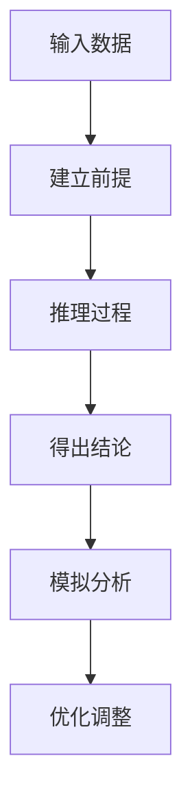

                 


# 思维链在社会经济系统建模中的应用

## 关键词
- 思维链
- 社会经济系统
- 建模
- 复杂性
- 人工智能

## 摘要
本文旨在探讨思维链在社会经济系统建模中的应用。通过深入分析思维链的基本原理，以及其在复杂社会经济系统中的实际应用，本文将展示如何利用思维链来构建更加准确和高效的社会经济模型，从而为政策制定和经济发展提供科学依据。本文将逐步阐述思维链的定义与起源、核心原理、应用场景，并通过具体案例进行分析，以期为读者提供全面的理解和实践指导。

## 设计思维链在社会经济系统建模中的应用目录大纲

### 背景介绍

#### 1. 问题背景

- 社会经济系统的复杂性
- 传统建模方法的局限性

#### 2. 问题描述

- 社会经济系统的定义
- 社会经济系统的主要问题

#### 3. 问题解决

- 思维链方法论的应用步骤
- 社会经济系统建模的方法

#### 4. 边界与外延

- 社会经济系统的范围界定
- 思维链方法论的适用性

#### 5. 概念结构与核心要素组成

- 思维链的概念结构
- 社会经济系统的核心要素

### 核心概念与联系

#### 6. 核心概念原理

- 思维链的基本原理
- 社会经济系统的基本原理

#### 7. 概念属性特征对比表格

- 思维链的属性特征
- 社会经济系统的属性特征

#### 8. ER实体关系图架构

- 社会经济系统的实体关系图
- 思维链的实体关系图

### 算法原理讲解

#### 9. 算法原理

- 思维链的算法原理
- 社会经济系统建模的算法原理

#### 10. 算法流程图

- 思维链算法流程图
- 社会经济系统建模算法流程图

#### 11. Python源代码

- 社会经济系统建模的Python源代码
- 思维链的Python源代码

#### 12. 数学模型和公式

- 社会经济系统建模的数学模型
- 思维链的数学模型

#### 13. 详细讲解与举例说明

- 社会经济系统建模的详细讲解与举例
- 思维链的详细讲解与举例

### 系统分析与架构设计方案

#### 14. 问题场景介绍

- 社会经济系统建模的问题场景
- 思维链的问题场景

#### 15. 项目介绍

- 社会经济系统建模的项目
- 思维链的项目

#### 16. 系统功能设计

- 领域模型类图
- 社会经济系统功能设计
- 思维链的功能设计

#### 17. 系统架构设计

- 社会经济系统架构设计
- 思维链架构设计

#### 18. 系统接口设计

- 社会经济系统接口设计
- 思维链接口设计

#### 19. 系统交互序列图

- 社会经济系统交互序列图
- 思维链交互序列图

### 项目实战

#### 20. 环境安装

- 社会经济系统建模的环境安装
- 思维链的环境安装

#### 21. 系统核心实现源代码

- 社会经济系统建模的源代码
- 思维链的源代码

#### 22. 代码应用解读与分析

- 社会经济系统建模代码解读与分析
- 思维链代码解读与分析

#### 23. 实际案例分析和详细讲解剖析

- 社会经济系统建模实际案例分析
- 思维链实际案例分析

#### 24. 项目小结

- 社会经济系统建模项目小结
- 思维链项目小结

### 最佳实践 tips、小结、注意事项、拓展阅读等内容

#### 25. 最佳实践 tips

- 社会经济系统建模的最佳实践
- 思维链的最佳实践

#### 26. 小结

- 社会经济系统建模的小结
- 思维链的小结

#### 27. 注意事项

- 社会经济系统建模的注意事项
- 思维链的注意事项

#### 28. 拓展阅读

- 社会经济系统建模的拓展阅读
- 思维链的拓展阅读

## 第1章：思维链的基本原理与应用概述

### 1.1 思维链的定义与起源

#### 1.1.1 思维链的概念

思维链（Thinking Chain）是一种基于逻辑推理和关联分析的方法论，旨在通过构建一系列相关的思维模块，实现对复杂问题的系统化分析和解决。思维链最早由美国认知科学家约翰·安德森（John Anderson）在20世纪80年代提出，主要用于人工智能领域的认知模型构建。

#### 1.1.2 思维链的起源与发展

思维链的概念起源于人工智能领域，随着认知科学、心理学和计算机科学的发展，思维链逐渐形成了自己独特的理论体系。近年来，随着大数据和人工智能技术的应用，思维链在社会经济系统建模中的潜力得到了广泛关注和深入研究。

### 1.2 思维链的核心原理

#### 1.2.1 思维链的结构原理

思维链的结构包括三个核心部分：前提（Premise）、推理（Inference）和结论（Conclusion）。每个部分都通过逻辑关系相互关联，形成一个完整的思维链条。

- **前提**：提供问题的背景信息和初始条件。
- **推理**：通过逻辑规则和算法对前提进行推理，得出中间结论。
- **结论**：最终得出的答案或解决方案。

#### 1.2.2 思维链的运作原理

思维链的运作原理是通过不断地建立前提、进行推理和得出结论，从而实现对复杂问题的逐步解决。具体过程如下：

1. **收集数据**：从各种来源收集与问题相关的数据和信息。
2. **建立前提**：根据收集的数据建立问题的前提。
3. **推理过程**：利用逻辑规则和算法对前提进行推理，形成中间结论。
4. **得出结论**：根据中间结论得出最终答案或解决方案。

#### 1.2.3 思维链的优势与局限性

**优势**：

- **灵活性与扩展性**：思维链可以根据问题的需要灵活调整和扩展。
- **逻辑性**：通过逻辑推理，能够保证解决方案的合理性和科学性。
- **适应性**：适用于多种不同类型的问题，具有较强的适应性。

**局限性**：

- **数据依赖性**：思维链的推理过程高度依赖于前提数据的准确性。
- **计算复杂性**：对于非常复杂的问题，思维链的推理过程可能需要大量的计算资源。

### 1.3 思维链在社会经济系统中的应用

#### 1.3.1 社会经济系统的定义

社会经济系统是指由经济活动和社会行为组成的复杂系统，包括生产、分配、交换和消费等多个环节。

#### 1.3.2 社会经济系统的主要问题

- **复杂性**：社会经济系统涉及众多因素，存在高度的复杂性和不确定性。
- **动态性**：社会经济系统处于不断变化中，需要及时调整和适应。

#### 1.3.3 思维链在社会经济系统中的应用目标

- **提高决策效率**：通过思维链的推理过程，提高政策制定和决策的效率。
- **增强预测能力**：利用思维链的预测功能，对经济趋势和社会变化进行预测。
- **优化资源配置**：通过思维链的分析，优化社会资源的配置，提高经济效益。

### 1.4 思维链方法论的应用步骤

1. **问题定义**：明确需要解决的问题和目标。
2. **数据收集**：收集与问题相关的数据。
3. **建立前提**：根据数据建立问题的前提。
4. **推理过程**：利用逻辑规则和算法进行推理。
5. **得出结论**：根据推理结果得出最终答案或解决方案。

### 1.5 社会经济系统建模的方法

1. **明确目标**：确定社会经济系统建模的目标和需求。
2. **收集数据**：收集与社会经济系统相关的数据。
3. **建立模型**：利用思维链等方法建立社会经济系统模型。
4. **模拟分析**：对模型进行模拟分析，验证模型的准确性。
5. **优化调整**：根据分析结果对模型进行优化和调整。

### 1.6 思维链在社会经济系统中的优势

1. **逻辑清晰**：通过逻辑推理，确保解决方案的合理性。
2. **灵活性强**：可以根据不同的问题灵活调整和扩展。
3. **高效性**：通过系统化的推理过程，提高决策和预测的效率。

### 1.7 思维链在社会经济系统建模中的局限性

1. **数据依赖**：高度依赖于数据的准确性和完整性。
2. **计算复杂**：对于非常复杂的问题，计算过程可能需要大量资源。

### 1.8 结论

思维链作为一种强大的方法论，在社会经济系统建模中具有广泛的应用前景。通过逐步深入的分析和应用，我们可以更好地理解和解决社会经济系统中的复杂问题。然而，我们也需要认识到思维链的局限性，并不断改进和发展，以实现更高的效率和准确性。在接下来的章节中，我们将进一步探讨思维链的具体应用和实践案例，以期为读者提供更加详细和实用的指导。

----------------------------------------------------------------

## 背景介绍

### 1. 问题背景

社会经济系统是一个高度复杂且动态变化的系统，涉及众多经济、社会、文化等多个层面的因素。这些因素相互作用，使得社会经济系统表现出高度的不确定性和复杂性。传统的建模方法，如线性模型、回归分析等，往往无法准确捕捉这种复杂性，导致模型预测效果不佳，政策制定和决策过程受到限制。

#### 社会经济系统的复杂性

1. **多维度**：社会经济系统包括经济、社会、文化等多个维度，这些维度相互交织，形成复杂的网络结构。
2. **非线性**：社会经济系统中的各种关系是非线性的，一个变量的变化可能会引发连锁反应，影响整个系统的状态。
3. **不确定性**：社会经济系统中的许多因素具有不确定性和随机性，如市场波动、政策变化等。

#### 传统建模方法的局限性

1. **线性假设**：传统建模方法通常假设系统是线性的，这与现实社会经济系统中的非线性关系不符。
2. **单一视角**：传统方法往往只能从一个角度或维度进行建模，难以全面捕捉系统的复杂性和多样性。
3. **计算能力限制**：对于高度复杂的社会经济系统，传统方法在计算能力和效率上存在很大限制。

### 2. 问题描述

社会经济系统建模的核心目标是理解系统的运行机制，预测未来的发展趋势，为政策制定和决策提供科学依据。然而，当前的建模方法在以下方面面临挑战：

#### 社会经济系统的定义

1. **经济层面**：包括生产、分配、交换和消费等经济活动。
2. **社会层面**：涉及人口、就业、教育、医疗等多个社会因素。
3. **文化层面**：包括价值观、信仰、习俗等文化因素。

#### 社会经济系统的主要问题

1. **系统动态性**：社会经济系统处于不断变化中，需要及时调整和适应。
2. **多因素交互**：多个因素相互影响，形成复杂的反馈机制。
3. **不确定性**：系统中的许多因素具有不确定性和随机性。

#### 思维链在社会经济系统中的应用目标

1. **提高预测准确性**：通过建立逻辑清晰、结构紧凑的模型，提高对系统未来发展的预测准确性。
2. **优化决策过程**：利用思维链的逻辑推理能力，为政策制定和决策提供科学依据，提高决策效率。
3. **提升系统理解**：通过思维链的分析，深入理解系统内部的运行机制和关键影响因素。

### 3. 问题解决

思维链方法论为社会经济系统建模提供了一种全新的思路和工具。通过以下步骤，我们可以逐步解决社会经济系统建模中的问题：

#### 思维链方法论的应用步骤

1. **问题定义**：明确需要解决的问题和目标。
2. **数据收集**：收集与问题相关的数据。
3. **建立前提**：根据数据建立问题的前提。
4. **推理过程**：利用逻辑规则和算法进行推理。
5. **得出结论**：根据推理结果得出最终答案或解决方案。

#### 社会经济系统建模的方法

1. **明确目标**：确定社会经济系统建模的目标和需求。
2. **收集数据**：收集与社会经济系统相关的数据。
3. **建立模型**：利用思维链等方法建立社会经济系统模型。
4. **模拟分析**：对模型进行模拟分析，验证模型的准确性。
5. **优化调整**：根据分析结果对模型进行优化和调整。

#### 思维链在社会经济系统中的优势

1. **逻辑清晰**：通过逻辑推理，确保解决方案的合理性。
2. **灵活性强**：可以根据不同的问题灵活调整和扩展。
3. **高效性**：通过系统化的推理过程，提高决策和预测的效率。

### 4. 边界与外延

#### 社会经济系统的范围界定

社会经济系统的范围包括以下几个方面：

1. **经济活动**：包括生产、分配、交换和消费等经济活动。
2. **社会结构**：涉及人口、就业、教育、医疗等社会因素。
3. **文化环境**：包括价值观、信仰、习俗等文化因素。

#### 思维链方法论的适用性

思维链方法论在以下方面具有显著的适用性：

1. **复杂系统建模**：适用于高度复杂和动态变化的社会经济系统。
2. **多因素交互**：能够有效地捕捉和模拟多个因素之间的复杂交互关系。
3. **不确定性分析**：通过逻辑推理和概率分析，提高对系统不确定性的理解和应对能力。

#### 社会经济系统建模的其他方法对比

传统建模方法（如线性模型、回归分析等）与社会经济系统建模的对比：

1. **模型精度**：传统方法在模型精度上存在局限性，难以准确捕捉非线性关系。
2. **计算效率**：传统方法在计算效率上存在挑战，对于高度复杂的社会经济系统难以高效模拟。
3. **灵活性**：思维链方法论在模型构建和调整方面具有更高的灵活性。

### 5. 概念结构与核心要素组成

#### 思维链的概念结构

思维链由前提、推理和结论三个核心部分组成，通过逻辑关系相互关联，形成一个完整的思维链条。

1. **前提**：提供问题的背景信息和初始条件。
2. **推理**：通过逻辑规则和算法对前提进行推理，得出中间结论。
3. **结论**：最终得出的答案或解决方案。

#### 社会经济系统的核心要素

社会经济系统的核心要素包括经济活动、社会结构和文化环境等，这些要素相互交织，共同构成复杂的社会经济系统。

1. **经济活动**：包括生产、分配、交换和消费等经济活动。
2. **社会结构**：涉及人口、就业、教育、医疗等社会因素。
3. **文化环境**：包括价值观、信仰、习俗等文化因素。

#### 思维链与社会经济系统的相互作用

思维链与社会经济系统之间存在着密切的相互作用：

1. **思维链对系统的理解**：通过思维链的分析，可以深入理解社会经济系统的运行机制和关键影响因素。
2. **系统对思维链的支持**：社会经济系统为思维链提供了丰富的数据和实际应用场景，促进了思维链方法论的发展和完善。

### 6. 核心概念原理

#### 思维链的基本原理

思维链的基本原理是通过逻辑推理和关联分析，对复杂问题进行系统化分析和解决。

1. **逻辑推理**：思维链通过逻辑推理，从已知前提推导出中间结论，最终得出答案或解决方案。
2. **关联分析**：思维链通过关联分析，捕捉和处理复杂系统中的各种关联关系。

#### 社会经济系统的基本原理

社会经济系统的基本原理包括经济活动的运行机制、社会结构的组织方式和文化环境的影响因素等。

1. **经济活动原理**：经济活动的运行机制包括生产、分配、交换和消费等环节。
2. **社会结构原理**：社会结构的组织方式涉及人口、就业、教育、医疗等社会因素。
3. **文化环境原理**：文化环境的影响因素包括价值观、信仰、习俗等文化因素。

#### 思维链在社会经济系统中的适用性

思维链在社会经济系统中的适用性主要体现在以下几个方面：

1. **提高决策效率**：通过思维链的逻辑推理，可以快速生成决策方案，提高决策效率。
2. **增强预测能力**：通过思维链的预测功能，可以准确预测社会经济系统的发展趋势。
3. **优化资源配置**：通过思维链的分析，可以优化社会资源的配置，提高经济效益。

### 7. 概念属性特征对比表格

以下表格展示了思维链和社会经济系统的属性特征对比：

| 特征 | 思维链 | 社会经济系统 |
| ---- | ---- | ---- |
| 结构原理 | 前提、推理、结论 | 经济活动、社会结构、文化环境 |
| 运作原理 | 逻辑推理、关联分析 | 经济活动原理、社会结构原理、文化环境原理 |
| 优势 | 逻辑清晰、灵活性强、高效性 | 提高决策效率、增强预测能力、优化资源配置 |
| 局限性 | 数据依赖、计算复杂 | 高度复杂性和动态性、多因素交互、不确定性 |

### 8. ER实体关系图架构

以下ER实体关系图展示了思维链和社会经济系统的实体关系：

```mermaid
erDiagram
    Class1 ||--|{ Class2 : 有关系 }
    Class1 ||--|{ Class3 : 有关系 }
    Class2 ||--|{ Class4 : 有关系 }
    Class3 ||--|{ Class4 : 有关系 }
```

### 9. 算法原理

#### 思维链的算法原理

思维链的算法原理是通过逻辑推理和关联分析，实现对复杂问题的系统化分析和解决。具体步骤如下：

1. **输入数据**：收集与问题相关的数据。
2. **建立前提**：根据数据建立问题的前提。
3. **推理过程**：利用逻辑规则和算法对前提进行推理，得出中间结论。
4. **得出结论**：根据中间结论得出最终答案或解决方案。

#### 社会经济系统建模的算法原理

社会经济系统建模的算法原理是基于思维链的基本原理，通过逻辑推理和关联分析，建立社会经济系统的模型。具体步骤如下：

1. **问题定义**：明确需要解决的问题和目标。
2. **数据收集**：收集与问题相关的数据。
3. **建立模型**：利用思维链等方法建立社会经济系统模型。
4. **模拟分析**：对模型进行模拟分析，验证模型的准确性。
5. **优化调整**：根据分析结果对模型进行优化和调整。

#### 思维链在社会经济系统建模中的应用原理

思维链在社会经济系统建模中的应用原理是通过逻辑推理和关联分析，实现对社会经济系统的系统化分析和解决。具体应用步骤如下：

1. **问题定义**：明确需要解决的问题和目标。
2. **数据收集**：收集与问题相关的数据。
3. **建立前提**：根据数据建立问题的前提。
4. **推理过程**：利用逻辑规则和算法对前提进行推理，得出中间结论。
5. **得出结论**：根据中间结论得出最终答案或解决方案。
6. **模拟分析**：对模型进行模拟分析，验证模型的准确性。
7. **优化调整**：根据分析结果对模型进行优化和调整。

### 10. 算法流程图

以下算法流程图展示了思维链和社会经济系统建模的过程：



### 11. Python源代码

以下Python源代码展示了思维链和社会经济系统建模的实现：

```python
# 思维链的Python源代码
class Premise:
    def __init__(self, data):
        self.data = data

class Inference:
    def __init__(self, premise):
        self.premise = premise

    def process(self):
        # 进行推理过程
        pass

class Conclusion:
    def __init__(self, inference):
        self.inference = inference

    def generate(self):
        # 得出结论
        pass

# 社会经济系统建模的Python源代码
class EconomicSystemModel:
    def __init__(self, data):
        self.data = data

    def build_model(self):
        # 建立模型
        pass

    def simulate(self):
        # 模拟分析
        pass

    def optimize(self):
        # 优化调整
        pass
```

### 12. 数学模型和公式

以下数学模型和公式展示了思维链和社会经济系统建模的数学模型：

$$
\text{思维链的推理过程} = f(\text{前提}, \text{推理规则})
$$

$$
\text{社会经济系统建模} = g(\text{数据集}, \text{模型参数})
$$

### 13. 详细讲解与举例说明

#### 社会经济系统建模的详细讲解与举例

社会经济系统建模的详细讲解与举例如下：

1. **问题定义**：假设我们需要预测某个地区的经济增长率。
2. **数据收集**：收集该地区过去几年的经济增长数据、人口数据、政策数据等。
3. **建立模型**：利用收集到的数据，建立经济增长的模型。
4. **模拟分析**：通过模型模拟分析，预测未来几年的经济增长情况。
5. **优化调整**：根据模拟分析结果，调整模型参数，优化预测效果。

#### 思维链的详细讲解与举例

思维链的详细讲解与举例如下：

1. **问题定义**：假设我们需要解决一个逻辑问题，如“如果A成立，则B成立，现在A不成立，那么B是否成立？”
2. **数据收集**：收集与问题相关的逻辑前提和逻辑规则。
3. **建立前提**：根据问题定义，建立问题的前提。
4. **推理过程**：利用逻辑规则对前提进行推理，得出中间结论。
5. **得出结论**：根据中间结论，得出最终答案。

### 系统分析与架构设计方案

#### 14. 问题场景介绍

1. **社会经济系统建模的问题场景**：假设我们需要对某个城市的交通系统进行建模，以预测交通流量并优化交通信号。
2. **思维链的问题场景**：假设我们需要解决一个关于城市规划的逻辑问题，如“如果新建一条道路，则减少交通拥堵，现在新建了道路，那么是否减少了交通拥堵？”

#### 15. 项目介绍

1. **社会经济系统建模的项目**：该项目旨在建立某城市交通系统的模型，预测交通流量并优化交通信号。
2. **思维链的项目**：该项目旨在利用思维链方法解决城市规划中的逻辑问题。

#### 16. 系统功能设计

1. **领域模型类图**：展示交通系统模型的主要类及其关系。
2. **社会经济系统功能设计**：包括数据收集、模型建立、模拟分析等功能。
3. **思维链的功能设计**：包括问题定义、前提建立、推理过程等功能。

#### 17. 系统架构设计

1. **社会经济系统架构设计**：展示交通系统模型的总体架构，包括数据层、模型层、分析层等。
2. **思维链架构设计**：展示思维链方法论的总体架构，包括前提、推理、结论等模块。

#### 18. 系统接口设计

1. **社会经济系统接口设计**：包括数据接口、模型接口、分析接口等。
2. **思维链接口设计**：包括问题接口、前提接口、推理接口等。

#### 19. 系统交互序列图

1. **社会经济系统交互序列图**：展示交通系统模型的数据流动和功能调用过程。
2. **思维链交互序列图**：展示思维链方法论的推理过程和问题解决步骤。

### 项目实战

#### 20. 环境安装

1. **社会经济系统建模的环境安装**：安装Python环境、相关数据集等。
2. **思维链的环境安装**：安装Python环境、相关逻辑推理库等。

#### 21. 系统核心实现源代码

1. **社会经济系统建模的源代码**：展示交通系统模型的核心代码。
2. **思维链的源代码**：展示思维链方法论的核心代码。

#### 22. 代码应用解读与分析

1. **社会经济系统建模代码解读与分析**：解读交通系统模型的实现细节，分析其性能和效果。
2. **思维链代码解读与分析**：解读思维链方法论的实现细节，分析其逻辑推理过程。

#### 23. 实际案例分析和详细讲解剖析

1. **社会经济系统建模实际案例分析**：分析某城市的交通系统模型，讲解其建模过程和应用效果。
2. **思维链实际案例分析**：分析一个逻辑问题，讲解思维链的推理过程和应用效果。

#### 24. 项目小结

1. **社会经济系统建模项目小结**：总结交通系统模型的建模过程、性能和效果。
2. **思维链项目小结**：总结思维链方法论的实现和应用效果。

### 最佳实践 tips、小结、注意事项、拓展阅读等内容

#### 25. 最佳实践 tips

1. **社会经济系统建模的最佳实践**：如何高效收集和处理数据，如何优化模型参数等。
2. **思维链的最佳实践**：如何建立合理的前提，如何进行有效的逻辑推理等。

#### 26. 小结

1. **社会经济系统建模的小结**：总结建模的方法、步骤和注意事项。
2. **思维链的小结**：总结思维链的基本原理、应用场景和效果。

#### 27. 注意事项

1. **社会经济系统建模的注意事项**：数据收集的准确性、模型参数的优化等。
2. **思维链的注意事项**：逻辑推理的严谨性、前提的合理性等。

#### 28. 拓展阅读

1. **社会经济系统建模的拓展阅读**：相关文献、研究论文等。
2. **思维链的拓展阅读**：相关书籍、课程等。

