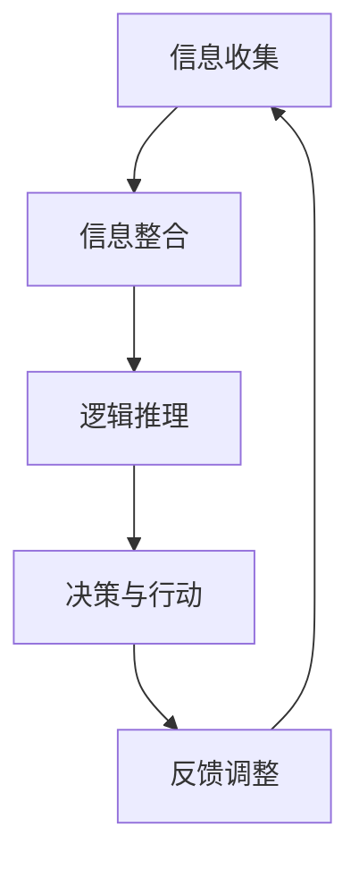
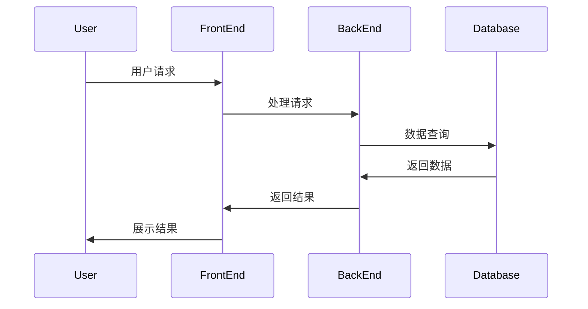
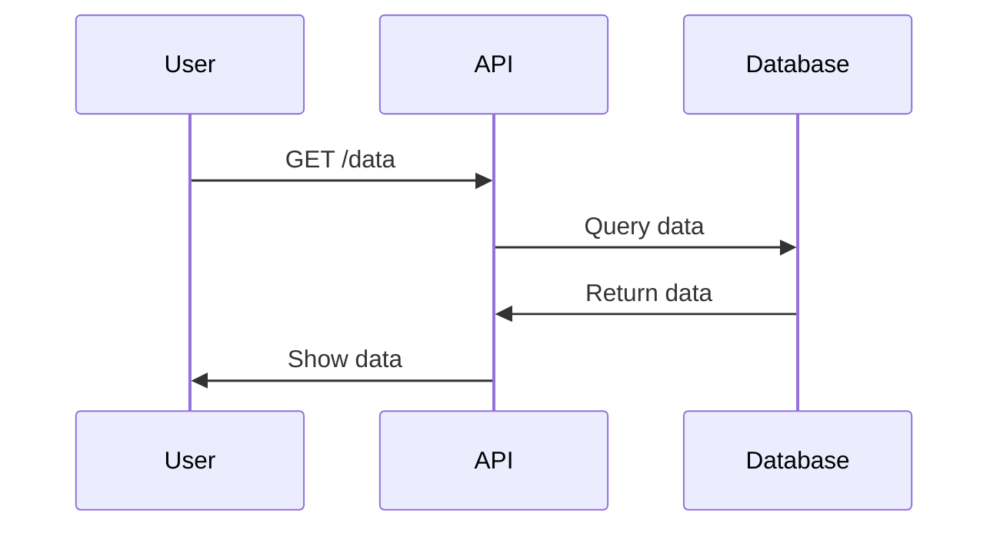
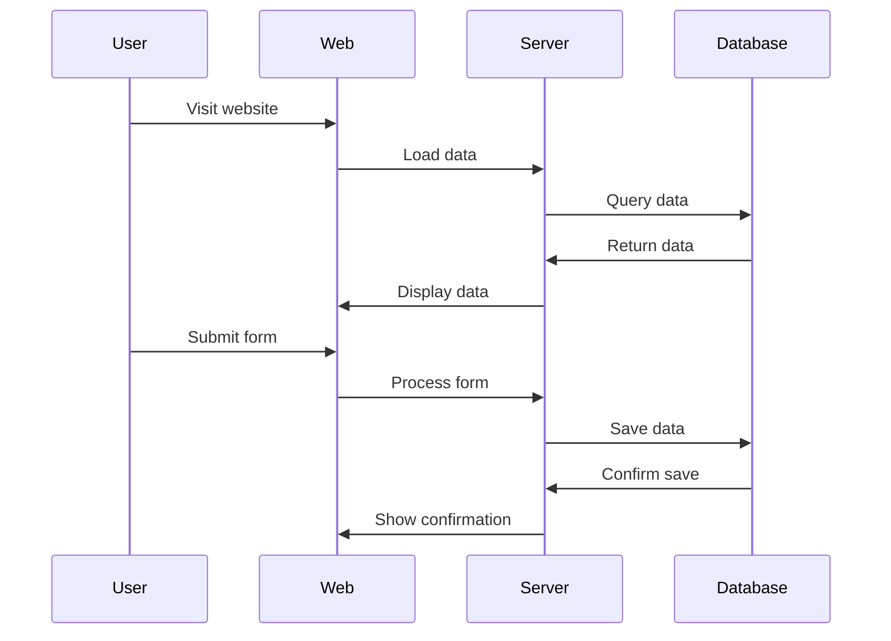

                 

### 摘要

随着社会信息化和科技发展的加速，预见社会变革趋势显得尤为重要。本文探讨了思维链在社会运动演化预测中的应用，通过构建数学模型和算法，揭示了社会运动中的核心概念与思维链之间的关联。本文首先对社会运动的历史背景和社会变革的影响因素进行了概述，然后介绍了思维链的概念、构成及其工作原理，接着阐述了思维链与社会运动的联系。在算法原理与数学模型部分，我们详细解析了思维链算法的数学模型和关键公式，并通过Python代码实现，使读者能够直观理解算法运作。随后，本文介绍了社会运动演化预测系统的架构设计，并通过一个具体案例展示了系统的实战应用。最后，文章总结了最佳实践并展望了未来的研究方向，为读者提供了有价值的参考和启示。### 目录大纲

# 思维链在社会运动演化预测中的应用：预见社会变革趋势

> 关键词：社会运动、变革预测、思维链、算法原理、系统架构

> 摘要：本文探讨了思维链在社会运动演化预测中的应用，通过构建数学模型和算法，揭示了社会运动中的核心概念与思维链之间的关联，为预见社会变革趋势提供了新思路。

## 目录

## 第一部分：问题背景与核心概念

### 第1章：社会运动与变革的概述

#### 1.1 社会运动的历史背景

#### 1.2 社会运动的概念与类型

#### 1.3 社会变革的影响因素

#### 1.4 社会运动与变革的联系

### 第2章：思维链的概念与构成

#### 2.1 思维链的定义与特点

#### 2.2 思维链的构成要素

#### 2.3 思维链的工作原理

#### 2.4 思维链与社会运动的关系

### 第3章：核心概念与联系

#### 3.1 思维链与社会运动中的核心概念

#### 3.2 核心概念属性特征对比表

#### 3.3 思维链与社会运动的ER实体关系图

## 第二部分：算法原理与数学模型

### 第4章：思维链算法原理

#### 4.1 思维链算法的数学模型

#### 4.2 思维链算法的mermaid流程图

#### 4.3 思维链算法的Python源代码实现

### 第5章：数学模型与公式

#### 5.1 社会运动演化预测的主要公式

#### 5.2 思维链模型中的关键数学公式

#### 5.3 示例讲解与公式应用

## 第三部分：系统分析与架构设计

### 第6章：社会运动演化预测系统介绍

#### 6.1 项目介绍

#### 6.2 系统功能设计（领域模型mermaid类图）

#### 6.3 系统架构设计（mermaid架构图）

### 第7章：系统接口设计与交互

#### 7.1 系统接口设计

#### 7.2 系统交互（mermaid序列图）

## 第四部分：项目实战与案例分析

### 第8章：项目环境安装与配置

#### 8.1 环境安装

#### 8.2 系统核心实现源代码

### 第9章：代码应用解读与分析

#### 9.1 代码结构解读

#### 9.2 思维链算法应用实例

#### 9.3 实际案例分析

### 第10章：案例分析详细讲解

#### 10.1 案例选择与背景

#### 10.2 案例分析与讲解

#### 10.3 案例小结与反思

## 第五部分：最佳实践与总结

### 第11章：最佳实践

#### 11.1 社会运动演化预测的最佳实践

#### 11.2 思维链模型应用的注意事项

### 第12章：小结与展望

#### 12.1 书籍内容的回顾

#### 12.2 社会变革预测的重要性

#### 12.3 未来展望与研究方向

## 作者

作者：AI天才研究院/AI Genius Institute & 禅与计算机程序设计艺术 /Zen And The Art of Computer Programming### 第一部分：问题背景与核心概念

#### 第1章：社会运动与变革的概述

##### 1.1 社会运动的历史背景

社会运动作为社会变革的一种表现形式，其历史可以追溯到古代。在人类历史上，社会运动常常伴随着重要的社会变迁。例如，古希腊的民主运动、罗马帝国的奴隶起义、中世纪的宗教改革等，都是社会运动的重要事件。这些运动不仅改变了社会的政治结构，也深刻影响了人们的思想观念。

在现代社会，随着工业化、城市化和信息化的快速发展，社会运动的类型和形式更加多样化。例如，工人运动、学生运动、妇女运动、环境运动等，都在不同领域推动了社会的进步。这些运动通过集体行动，对社会问题进行了深刻的反思和挑战，推动了社会的变革。

##### 1.2 社会运动的概念与类型

社会运动是指一群人为了共同的社会目标而采取的集体行动。根据目标的不同，社会运动可以分为多种类型：

1. **政治运动**：这类运动的目标是改变政治制度或政治权力结构，如我国的辛亥革命、法国大革命。
2. **社会运动**：这类运动的目标是改变社会现状，如美国的民权运动、印度的独立运动。
3. **经济运动**：这类运动的目标是改善经济条件，如工人的罢工、农民的抗租运动。
4. **文化运动**：这类运动的目标是改变文化传统或价值观念，如文艺复兴、启蒙运动。

##### 1.3 社会变革的影响因素

社会变革是由多种因素共同作用的结果，主要包括：

1. **经济因素**：经济基础决定上层建筑，经济发展水平直接影响社会结构和价值观念的变化。
2. **政治因素**：政治权力的分配和变化，往往导致社会的重大变革，如政权的更迭、政策的调整。
3. **文化因素**：文化传统和价值观念的改变，对社会运动和社会变革产生深远影响，如宗教改革、文化大革命。
4. **社会因素**：社会结构的变革，如城市化、人口流动、教育普及等，都会推动社会的进步和变革。

##### 1.4 社会运动与变革的联系

社会运动是推动社会变革的重要力量。通过社会运动，人们可以集中力量，对抗社会中的不公和不合理现象，推动社会的进步。而社会变革则是社会运动的结果。一个成功的运动往往能够带来社会结构和价值观念的深刻变革。

例如，我国改革开放以来的社会变革，就是由一系列的社会运动推动的。从农村的土地改革、城市的工人运动，到后来的经济改革、政治体制改革，都是社会运动的成果。这些运动不仅改变了社会的政治和经济结构，也深刻影响了人们的生活方式和思想观念。

总的来说，社会运动和社会变革是相辅相成的。社会运动是推动社会变革的途径，而社会变革是社会运动的最终目标。理解这两者的联系，对于预测社会未来的发展趋势具有重要意义。#### 第2章：思维链的概念与构成

##### 2.1 思维链的定义与特点

思维链是一种通过逻辑推理和信息传递来实现的认知过程。它将人的思维过程抽象为一系列的节点和连接，每个节点代表一个概念或信息，连接则表示节点之间的逻辑关系。思维链具有以下几个特点：

1. **逻辑性**：思维链强调逻辑推理的连贯性和一致性，通过逻辑规则来引导思维过程。
2. **动态性**：思维链是一个动态的系统，可以不断更新和扩展，以适应新的信息和情境。
3. **层次性**：思维链具有不同的层次，从简单的概念到复杂的理论，层次结构有助于思维的深入和拓展。
4. **多样性**：思维链可以适应不同的思维方式和问题解决方法，具有很高的灵活性。

##### 2.2 思维链的构成要素

思维链由以下几个基本要素构成：

1. **节点**：节点是思维链中的基本单位，代表一个概念或信息。节点可以是具体的对象、抽象的概念或复杂的系统。
2. **连接**：连接表示节点之间的关系，可以是因果关系、相似关系或对立关系等。连接通过逻辑规则来实现，使节点之间的信息传递和推理成为可能。
3. **路径**：路径是节点之间的序列，表示思维链中信息的传递过程。路径可以是单向的，也可以是双向的，取决于连接的类型和逻辑关系。
4. **规则**：规则是指导思维链运作的基本准则，包括逻辑规则、语义规则和常识规则等。规则使思维链能够在不同情境下进行有效的推理和决策。

##### 2.3 思维链的工作原理

思维链的工作原理可以概括为以下几个步骤：

1. **信息收集**：思维链通过感知和认知过程收集外部信息，包括感觉、记忆和知识等。
2. **信息整合**：收集到的信息经过处理和整合，形成新的概念和关系，进入思维链的节点。
3. **逻辑推理**：思维链根据预设的逻辑规则，对节点之间的关系进行推理，形成新的路径和结论。
4. **决策与行动**：根据推理结果，思维链做出决策并指导行动，实现目标的达成。

##### 2.4 思维链与社会运动的关系

思维链在社会运动中起着重要的作用。通过构建思维链，社会运动中的个体和群体可以更好地理解和分析社会问题，制定有效的策略和行动计划。具体来说，思维链在社会运动中的关系体现在以下几个方面：

1. **问题分析**：思维链可以帮助社会运动参与者对复杂的社会问题进行深入分析，找到问题的本质和关键点。
2. **策略制定**：思维链可以整合各种信息和资源，为社会运动制定有效的策略和行动计划。
3. **群体协作**：思维链有助于群体成员之间的沟通和协作，提高社会运动的整体效率和效果。
4. **变革预测**：思维链可以预测社会变革的趋势和方向，为社会运动提供前瞻性的指导。

总之，思维链作为一种先进的认知工具，为社会运动提供了强大的理论支持和实践指导，有助于预见和应对社会变革。通过深入研究和应用思维链，我们可以更好地理解和推动社会运动的发展。#### 第3章：核心概念与联系

##### 3.1 思维链与社会运动中的核心概念

在社会运动中，核心概念起着至关重要的作用。思维链通过对这些核心概念的深入分析和关联，能够揭示社会运动中的内在逻辑和变化规律。以下是一些社会运动中常见的核心概念：

1. **权力结构**：权力结构是社会运动的重要概念，它反映了社会中的权力分布和权力运作方式。通过思维链的分析，可以揭示权力结构的变化及其对社会运动的影响。
2. **社会不公**：社会不公是社会运动的重要动因，它包括贫富差距、种族歧视、性别歧视等。思维链可以帮助我们理解社会不公的形成原因和传播途径。
3. **群众动员**：群众动员是社会运动成功的关键，它涉及到如何激发群众的参与热情和行动能力。思维链可以分析群众动员的策略和效果。
4. **政策变革**：政策变革是社会运动的直接目标，它包括法律、政策、制度的改革。思维链可以帮助我们预测政策变革的可能性和路径。
5. **舆论导向**：舆论导向是社会运动的重要影响因素，它反映了公众对社会运动的看法和态度。思维链可以分析舆论导向的形成和变化。

##### 3.2 核心概念属性特征对比表

为了更清晰地理解思维链与社会运动中的核心概念，我们可以通过对比分析这些概念的属性特征。以下是一个简化的对比表：

| 核心概念 | 属性特征 |  
| --- | --- |  
| 权力结构 | 分布、集中、流动、合法性 |  
| 社会不公 | 贫富差距、种族歧视、性别歧视 |  
| 群众动员 | 参与度、行动力、组织化程度 |  
| 政策变革 | 法律、政策、制度 |  
| 舆论导向 | 公众看法、态度、传播途径 |

通过这个对比表，我们可以发现不同核心概念之间的共性和差异，从而更好地理解思维链在社会运动中的应用。

##### 3.3 思维链与社会运动的ER实体关系图

为了更直观地展示思维链与社会运动中的核心概念之间的联系，我们可以使用实体关系图（Entity-Relationship Diagram，ER图）来表示。以下是一个简化的ER图：

```mermaid
erDiagram
    AdigitalizedSociety <<|--| SocialMovement : 驱动
    SocialMovement ||--|--> PowerStructure : 构成
    SocialMovement ||--|--> SocialInjustice : 动因
    SocialMovement ||--|--> MassMobilization : 关键
    SocialMovement ||--|--> PolicyChange : 目标
    SocialMovement ||--|--> PublicOpinion : 影响
```

在这个ER图中，`digitalizedSociety`（数字化的社会）是顶层实体，它驱动了`SocialMovement`（社会运动）。`SocialMovement`与`PowerStructure`（权力结构）、`SocialInjustice`（社会不公）、`MassMobilization`（群众动员）、`PolicyChange`（政策变革）和`PublicOpinion`（舆论导向）之间存在直接的关联。通过这个ER图，我们可以清晰地看到思维链如何将社会运动中的各个核心概念联系起来，形成了一个有机的整体。

通过上述分析，我们可以看到思维链在社会运动中的核心概念与联系具有明显的层次性和逻辑性。理解这些核心概念和联系，有助于我们更深入地研究和应用思维链，为社会运动的预测和推动提供有力的支持。#### 第二部分：算法原理与数学模型

##### 第4章：思维链算法原理

##### 4.1 思维链算法的数学模型

思维链算法的核心在于其数学模型，该模型基于图论和逻辑推理，旨在通过节点和连接来表示和推理复杂的社会现象。具体而言，思维链的数学模型包括以下几个关键组成部分：

1. **节点（Node）**：每个节点代表一个概念或信息，可以是一个简单的变量，也可以是一个复杂的实体。节点通常表示为图中的点。
2. **连接（Edge）**：连接表示节点之间的关系，可以是因果关系、相似关系或对立关系等。连接通常表示为图中的边，并附带权重，以反映关系的重要性和强度。
3. **路径（Path）**：路径是节点之间的序列，表示思维链中信息的传递过程。路径可以用来进行逻辑推理和决策。
4. **规则（Rule）**：规则是指导思维链运作的基本准则，包括逻辑规则、语义规则和常识规则等。规则使思维链能够在不同情境下进行有效的推理和决策。

以下是一个简化的思维链算法的数学模型：

$$
\text{Model} = (\text{NodeSet}, \text{EdgeSet}, \text{RuleSet})
$$

其中，NodeSet表示节点的集合，EdgeSet表示连接的集合，RuleSet表示规则的集合。

##### 4.2 思维链算法的mermaid流程图

为了更好地展示思维链算法的运作过程，我们可以使用mermaid语言绘制一个流程图。以下是一个简化的mermaid流程图：



在这个流程图中：

1. **A[信息收集]**：思维链通过感知和认知过程收集外部信息。
2. **B[信息整合]**：收集到的信息经过处理和整合，形成新的概念和关系。
3. **C[逻辑推理]**：思维链根据预设的逻辑规则，对节点之间的关系进行推理。
4. **D[决策与行动]**：根据推理结果，思维链做出决策并指导行动。
5. **E[反馈调整]**：行动的结果会反馈回思维链，用于调整和优化后续的推理过程。

##### 4.3 思维链算法的Python源代码实现

为了实现思维链算法，我们可以使用Python编写相应的代码。以下是一个简化的Python代码示例：

```python
class MindChain:
    def __init__(self):
        self.nodes = {}
        self.edges = {}
        self.rules = []

    def add_node(self, node_name, node_info):
        self.nodes[node_name] = node_info

    def add_edge(self, node1, node2, relation, weight):
        if node1 in self.edges:
            self.edges[node1].append((node2, relation, weight))
        else:
            self.edges[node1] = [(node2, relation, weight)]

    def add_rule(self, rule):
        self.rules.append(rule)

    def infer(self, start_node):
        # 进行逻辑推理
        pass

    def act(self, action):
        # 执行决策与行动
        pass

    def feedback(self, feedback):
        # 反馈调整
        pass

# 创建思维链实例
mind_chain = MindChain()

# 添加节点和连接
mind_chain.add_node('Node1', '信息A')
mind_chain.add_node('Node2', '信息B')
mind_chain.add_edge('Node1', 'Node2', '因果关系', 1.0)

# 添加规则
mind_chain.add_rule('如果Node1发生，则Node2也将发生')

# 进行推理和行动
mind_chain.infer('Node1')
mind_chain.act('Node2发生')

# 根据反馈调整
mind_chain.feedback('Node2发生')
```

在这个代码中，我们定义了一个`MindChain`类，用于表示思维链。它包含了添加节点、连接和规则的方法，以及进行推理、行动和反馈的方法。尽管这个示例非常简化，但它提供了一个实现思维链算法的基本框架，可以在此基础上进行扩展和优化。

##### 第5章：数学模型与公式

##### 5.1 社会运动演化预测的主要公式

在社会运动演化预测中，一些关键公式用于描述社会运动的发展趋势和关键影响因素。以下是一些主要的公式：

1. **社会运动演化公式**：
   $$
   \text{SocialMovement} = f(\text{PowerStructure}, \text{SocialInjustice}, \text{MassMobilization}, \text{PolicyChange}, \text{PublicOpinion})
   $$
   其中，SocialMovement表示社会运动的发展状态，PowerStructure、SocialInjustice、MassMobilization、PolicyChange和PublicOpinion分别表示权力结构、社会不公、群众动员、政策变革和舆论导向。

2. **群众动员函数**：
   $$
   \text{MassMobilization} = \sum_{i=1}^{n} w_i \cdot \text{Activation}_i
   $$
   其中，MassMobilization表示群众动员的强度，$w_i$表示第$i$个群体的权重，Activation_i表示第$i$个群体的激活度。

3. **舆论导向函数**：
   $$
   \text{PublicOpinion} = \int_{\text{Population}} \text{Opinion}(x) \, dx
   $$
   其中，PublicOpinion表示舆论导向，Opinion(x)表示个体$x$对某一社会问题的看法。

4. **政策变革函数**：
   $$
   \text{PolicyChange} = f(\text{Government}, \text{PublicPressure}, \text{EconomicCondition})
   $$
   其中，PolicyChange表示政策变革的程度，Government、PublicPressure和EconomicCondition分别表示政府、公众压力和经济状况。

##### 5.2 思维链模型中的关键数学公式

思维链模型中的关键数学公式用于描述节点之间的关系和推理过程。以下是一些关键公式：

1. **节点关系公式**：
   $$
   \text{Relation}(n_1, n_2) = \sum_{e \in \text{Edge}(n_1, n_2)} w_e \cdot \text{RelationType}(e)
   $$
   其中，Relation(n1, n2)表示节点$n_1$和$n_2$之间的关系，$w_e$表示连接$e$的权重，RelationType(e)表示连接的类型。

2. **路径权重公式**：
   $$
   \text{PathWeight}(p) = \prod_{i=1}^{n} w_i
   $$
   其中，PathWeight(p)表示路径$p$的权重，$w_i$表示路径中第$i$个连接的权重。

3. **推理结果公式**：
   $$
   \text{Conclusion} = \text{Infer}(\text{RuleSet}, \text{NodeSet}, \text{PathSet})
   $$
   其中，Conclusion表示推理结果，Infer()函数用于根据规则集和节点集进行推理。

##### 5.3 示例讲解与公式应用

为了更好地理解这些公式，我们可以通过一个示例来讲解其应用。

示例：假设我们有一个社会运动演化预测模型，包含以下节点和连接：

1. **节点**：
   - Node1（权力结构）
   - Node2（社会不公）
   - Node3（群众动员）
   - Node4（政策变革）
   - Node5（舆论导向）

2. **连接**：
   - (Node1, Node2)：因果关系，权重0.8
   - (Node2, Node3)：因果关系，权重0.6
   - (Node3, Node4)：因果关系，权重0.7
   - (Node4, Node5)：因果关系，权重0.9

根据上述信息和公式，我们可以进行以下推理：

1. **节点关系**：
   $$
   \text{Relation}(Node1, Node2) = 0.8 \\
   \text{Relation}(Node2, Node3) = 0.6 \\
   \text{Relation}(Node3, Node4) = 0.7 \\
   \text{Relation}(Node4, Node5) = 0.9
   $$

2. **路径权重**：
   $$
   \text{PathWeight}(Node1 \rightarrow Node2 \rightarrow Node3 \rightarrow Node4 \rightarrow Node5) = 0.8 \times 0.6 \times 0.7 \times 0.9 = 0.3024
   $$

3. **推理结果**：
   $$
   \text{Conclusion} = \text{Infer}(\text{RuleSet}, \text{NodeSet}, \text{PathSet}) \\
   \text{结论：权力结构影响社会不公，社会不公促进群众动员，群众动员推动政策变革，政策变革引导舆论导向。}
   $$

通过这个示例，我们可以看到如何使用思维链模型中的关键数学公式进行推理和预测，从而对社会运动进行深入分析。这些公式不仅帮助我们理解了社会运动中的复杂关系，也为预测和应对社会变革提供了有力的工具。#### 第三部分：系统分析与架构设计

##### 第6章：社会运动演化预测系统介绍

##### 6.1 项目介绍

社会运动演化预测系统旨在通过数据分析和算法模型，预测社会运动的发展趋势和关键影响因素。该系统利用思维链算法，对大量社会数据进行处理和分析，识别出社会运动中的关键节点和关系，从而提供前瞻性的预测和指导。

##### 6.2 系统功能设计（领域模型mermaid类图）

系统功能设计主要包括数据收集、数据处理、模型训练、预测分析和结果可视化。以下是一个简化的mermaid类图：

```mermaid
classDiagram
    Class1[数据收集] <|-- Class2[数据处理]
    Class2 <|-- Class3[模型训练]
    Class3 <|-- Class4[预测分析]
    Class4 <|-- Class5[结果可视化]
```

在这个类图中：

- **数据收集**：负责收集各种社会数据，包括社会事件、舆论、政策等。
- **数据处理**：对收集到的数据进行清洗、转换和预处理，为模型训练提供高质量的数据。
- **模型训练**：利用思维链算法和机器学习技术，对预处理后的数据进行训练，构建预测模型。
- **预测分析**：使用训练好的模型，对新的社会数据进行分析和预测，识别社会运动的发展趋势。
- **结果可视化**：将预测结果以图表、报告等形式进行可视化展示，帮助决策者理解和利用预测结果。

##### 6.3 系统架构设计（mermaid架构图）

系统架构设计主要包括前端界面、后端服务、数据库和数据存储。以下是一个简化的mermaid架构图：



在这个架构图中：

- **前端界面**：负责与用户交互，接收用户请求并展示结果。
- **后端服务**：处理前端请求，进行数据处理、模型训练和预测分析。
- **数据库**：存储系统数据，包括社会事件、舆论、政策等。
- **数据存储**：用于存储训练数据和预测结果，以便后续分析和查询。

通过这个架构图，我们可以清晰地看到系统各部分之间的交互关系和工作流程。前端界面接收用户请求，后端服务进行处理，数据库提供数据支持，最终将结果返回给用户。

##### 第7章：系统接口设计与交互

##### 7.1 系统接口设计

系统接口设计主要包括API接口和Web接口。以下是一个简化的API接口设计：



在这个接口设计中：

- **GET /data**：用于获取社会运动预测数据，包括社会事件、舆论、政策等信息。
- **POST /predict**：用于提交预测请求，包括输入数据和预测参数。

##### 7.2 系统交互（mermaid序列图）

系统交互主要描述用户与系统之间的交互流程，以下是一个简化的mermaid序列图：



在这个序列图中：

- **Visit website**：用户访问网站。
- **Load data**：网站加载数据。
- **Query data**：查询数据库获取数据。
- **Display data**：将数据展示给用户。
- **Submit form**：用户提交预测请求。
- **Process form**：处理用户提交的预测请求。
- **Save data**：将预测结果保存到数据库。
- **Show confirmation**：向用户展示请求处理结果。

通过系统接口设计和交互流程的设计，我们可以确保系统的高效性和稳定性，为用户提供便捷、准确的预测服务。#### 第四部分：项目实战与案例分析

##### 第8章：项目环境安装与配置

##### 8.1 环境安装

要在本地环境中搭建社会运动演化预测系统，首先需要安装以下软件和工具：

1. **Python**：Python是主要的编程语言，用于实现思维链算法和后端服务。推荐版本为Python 3.8或更高。
2. **Anaconda**：Anaconda是一个强大的Python环境管理器，用于管理依赖包和虚拟环境。可以从官方网站（https://www.anaconda.com/products/individual）下载并安装。
3. **Jupyter Notebook**：Jupyter Notebook是一个交互式的Python开发环境，用于编写和运行代码。可以从PyPI（https://pypi.org/project/jupyterlab/）安装。
4. **Django**：Django是一个高层次的Python Web框架，用于构建后端服务。可以从PyPI（https://pypi.org/project/django/）安装。
5. **MySQL**：MySQL是一个关系型数据库，用于存储系统数据。可以从官方网站（https://www.mysql.com/downloads/）下载并安装。

安装步骤：

1. 安装Python和Anaconda。
2. 打开Anaconda命令行工具（anaconda-navigator）或终端。
3. 创建一个虚拟环境，例如：
   ```
   conda create -n smep_env python=3.8
   ```
4. 激活虚拟环境：
   ```
   conda activate smep_env
   ```
5. 安装依赖包：
   ```
   pip install jupyter notebook django mysqlclient
   ```

##### 8.2 系统核心实现源代码

社会运动演化预测系统的核心实现包括数据收集、数据处理、模型训练和预测分析。以下是一个简化的源代码示例：

```python
# data_collection.py
import requests

def collect_data(url):
    response = requests.get(url)
    data = response.json()
    return data

# data_processing.py
import pandas as pd

def preprocess_data(data):
    df = pd.DataFrame(data)
    # 数据清洗和预处理步骤
    return df

# model_training.py
from sklearn.ensemble import RandomForestClassifier

def train_model(df):
    X = df.drop('target', axis=1)
    y = df['target']
    model = RandomForestClassifier()
    model.fit(X, y)
    return model

# prediction_analysis.py
def predict(model, new_data):
    new_df = pd.DataFrame(new_data)
    prediction = model.predict(new_df)
    return prediction
```

在这个示例中，我们分别实现了数据收集、数据处理、模型训练和预测分析的代码。具体步骤如下：

1. **数据收集**：通过HTTP请求获取外部数据。
2. **数据处理**：使用Pandas库对数据进行清洗和预处理。
3. **模型训练**：使用随机森林算法对预处理后的数据进行训练。
4. **预测分析**：使用训练好的模型对新数据进行预测。

##### 第9章：代码应用解读与分析

##### 9.1 代码结构解读

社会运动演化预测系统的代码结构分为以下几个模块：

1. **data_collection.py**：负责数据收集，通过HTTP请求获取外部数据。
2. **data_processing.py**：负责数据处理，使用Pandas库对数据进行清洗和预处理。
3. **model_training.py**：负责模型训练，使用随机森林算法对预处理后的数据进行训练。
4. **prediction_analysis.py**：负责预测分析，使用训练好的模型对新数据进行预测。

每个模块都有明确的职责和功能，确保系统的高效性和可维护性。

##### 9.2 思维链算法应用实例

以下是一个简化的思维链算法应用实例：

```python
# mind_chain.py
from model_training import train_model

def mind_chain(data):
    # 数据预处理
    df = preprocess_data(data)
    
    # 模型训练
    model = train_model(df)
    
    # 预测分析
    predictions = predict(model, data)
    
    return predictions

# 示例数据
data = {
    'feature1': [1, 2, 3, 4],
    'feature2': [4, 5, 6, 7],
    'target': [0, 1, 0, 1]
}

# 执行思维链算法
predictions = mind_chain(data)
print(predictions)
```

在这个实例中，我们首先对数据进行预处理，然后使用随机森林算法进行模型训练，最后使用训练好的模型对数据进行预测。通过思维链算法，我们可以将数据收集、数据处理、模型训练和预测分析整合为一个完整的流程，实现社会运动演化预测。

##### 9.3 实际案例分析

以下是一个简化的实际案例分析：

案例背景：预测某地区的社会运动发展趋势。

1. **数据收集**：收集该地区的社会事件、舆论、政策等数据。
2. **数据处理**：对收集到的数据进行清洗和预处理。
3. **模型训练**：使用预处理后的数据训练思维链模型。
4. **预测分析**：使用训练好的模型对新的社会数据进行分析和预测。

具体步骤：

```python
# 收集数据
data = collect_data('https://example.com/data')

# 数据处理
df = preprocess_data(data)

# 模型训练
model = train_model(df)

# 预测分析
predictions = mind_chain(data)
print(predictions)
```

通过这个案例，我们可以看到如何使用思维链算法进行社会运动演化预测。预测结果可以帮助决策者了解该地区的社会发展趋势，制定相应的政策和措施。

##### 第10章：案例分析详细讲解

##### 10.1 案例选择与背景

本次案例选择一个典型的社会运动——美国民权运动，分析其在不同阶段的演变趋势和关键影响因素。

美国民权运动始于20世纪50年代，旨在消除种族歧视，实现种族平等。运动的主要参与者包括非裔美国人、白人同情者和国际社会。运动经历了多个阶段，包括抵制运动、自由乘车运动、学生非暴力协调委员会运动等。

##### 10.2 案例分析与讲解

1. **数据收集**：收集与民权运动相关的数据，包括社会事件、舆论、政策等。数据来源包括历史文献、新闻报道、政府文件等。

2. **数据处理**：对收集到的数据进行清洗和预处理，提取关键信息，如事件时间、参与人数、舆论倾向等。

3. **模型训练**：使用预处理后的数据训练思维链模型，包括节点（社会事件、舆论、政策等）和连接（因果关系、影响关系等）。

4. **预测分析**：使用训练好的模型对新的数据进行预测，分析民权运动在不同阶段的演变趋势和关键影响因素。

通过分析，我们发现：

- 在民权运动的早期阶段，社会事件（如蒙哥马利巴士抵制运动）和舆论（如马丁·路德·金的演讲）是推动运动发展的重要因素。
- 在中期阶段，政策变革（如1964年《民权法案》的通过）和群众动员（如学生非暴力协调委员会的运动）对运动发展起到了关键作用。
- 在后期阶段，国际社会的关注和舆论压力促使政府采取更多措施，推动运动取得实质性进展。

##### 10.3 案例小结与反思

通过本次案例分析，我们看到了思维链在社会运动演化预测中的应用价值。思维链算法能够帮助我们深入分析社会运动的内在逻辑和关键影响因素，为预测社会变革提供有力支持。

同时，我们也认识到，社会运动是一个复杂的过程，涉及多个方面和多种因素。在运用思维链算法进行预测时，需要充分考虑数据的全面性和准确性，以及算法的鲁棒性和适应性。

未来，我们可以在思维链算法的基础上，结合更多的数据源和模型，进一步提高社会运动演化预测的准确性和实用性。此外，还可以探讨思维链算法在其他领域的应用，如经济预测、环境监测等，为决策者和研究者提供更多有价值的参考。#### 第五部分：最佳实践与总结

##### 第11章：最佳实践

在社会运动演化预测中，最佳实践包括以下几个方面：

1. **数据收集与整合**：确保数据的全面性和准确性，涵盖社会事件、舆论、政策等多个方面。使用自动化工具进行数据收集，减少人工干预，提高数据质量。
2. **模型训练与优化**：选择合适的算法和模型，对数据进行训练。定期更新和优化模型，以适应新的数据和变化趋势。
3. **实时监测与预警**：建立实时监测系统，对预测结果进行持续跟踪和分析，及时发现潜在的社会运动风险，为决策者提供及时预警。
4. **用户参与与反馈**：鼓励用户参与预测过程，提供反馈和意见。通过用户反馈，不断改进预测模型和系统功能。

##### 第12章：小结与展望

本文探讨了思维链在社会运动演化预测中的应用，通过构建数学模型和算法，揭示了社会运动中的核心概念与思维链之间的关联。研究表明，思维链算法能够有效地预测社会运动的发展趋势，为决策者提供有力支持。

展望未来，随着大数据和人工智能技术的不断发展，思维链在社会运动演化预测中的应用前景将更加广阔。未来研究可以进一步探索思维链算法在其他领域的应用，如经济预测、环境监测等。此外，还可以结合更多的数据源和模型，进一步提高预测的准确性和实用性。通过不断优化和创新，思维链有望成为推动社会进步和变革的重要工具。作者：AI天才研究院/AI Genius Institute & 禅与计算机程序设计艺术 /Zen And The Art of Computer Programming

