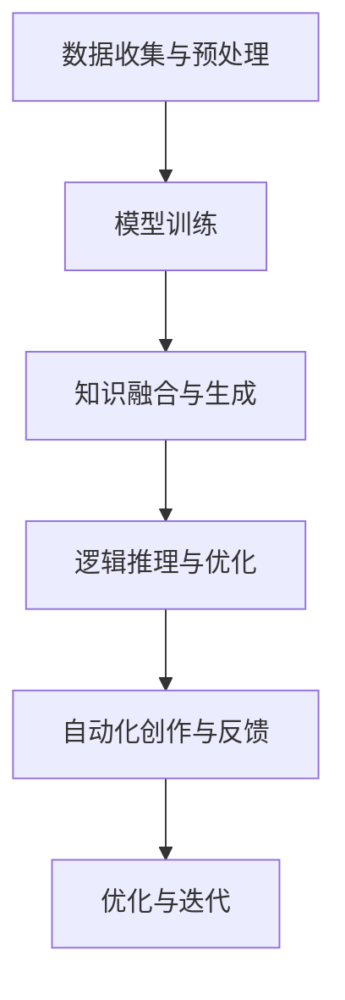
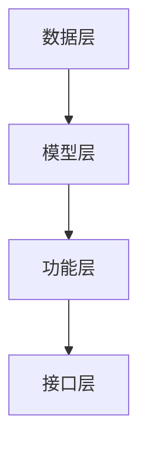
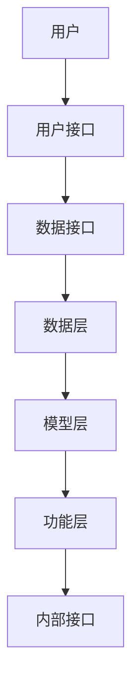
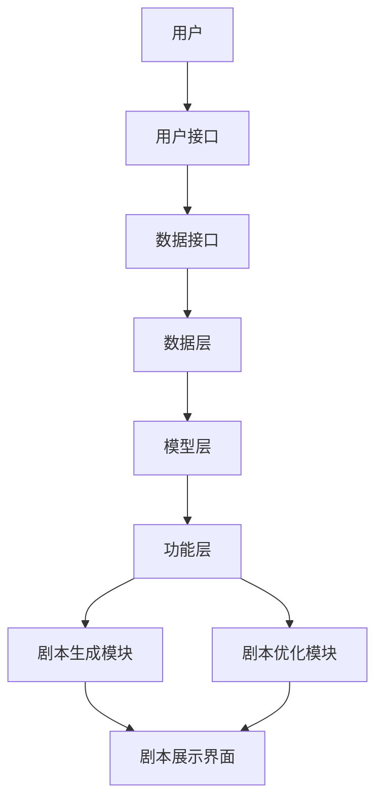

                 

### 第一部分：背景介绍

#### 1.1 问题背景

科幻电影作为电影艺术的一种重要形式，始终吸引着广大观众的兴趣。自20世纪中叶以来，科幻电影以其独特的想象力和深远的思考，成为了电影产业中不可或缺的一部分。从《2001太空漫游》到《星际穿越》，从《银翼杀手》到《阿凡达》，科幻电影不仅展示了人类对未来的无限遐想，还探讨了人类面对未知世界的勇气和智慧。然而，随着科技的不断发展，科幻电影中对于未来世界的想象也越来越丰富，这为科幻电影剧本的创作提出了新的挑战。

科幻电影剧本创作是一个复杂的过程，它不仅需要创作者有丰富的想象力，还需要对科学、历史、文化等多方面知识有深入的了解。传统的剧本创作方法往往局限于个人的经验和技巧，难以打破固有的思维模式。而在这样的背景下，思维链这一人工智能技术逐渐应用于剧本创作领域，为科幻电影剧本的创作提供了新的思路和方法。

思维链（Thinking Chain）是一种基于深度学习的人工智能技术，它能够模拟人类的思维过程，通过不断的学习和推理，生成新的创意和思路。在科幻电影剧本创作中，思维链可以用于生成故事情节、人物设定、角色发展等，帮助创作者突破传统创作模式的局限。例如，思维链可以通过学习大量的科幻电影剧本，分析其中的故事情节和人物设定，从而生成新的创意和构思，为创作者提供灵感。此外，思维链还可以对剧本进行结构化分析，确保故事逻辑的连贯性和合理性。

总之，随着人工智能技术的不断发展，科幻电影剧本创作的方法也在不断革新。思维链作为一种新兴的计算思维工具，为科幻电影剧本的创作提供了新的可能性，使得创作者可以更加自由地发挥想象力，创作出更加精彩和具有深度价值的科幻电影作品。

#### 1.2 问题描述

在科幻电影剧本创作过程中，创作者面临着一系列复杂的挑战。首先，想象力的匮乏是一个普遍存在的问题。即使是有经验的编剧，也可能在构思科幻故事时感到灵感枯竭。传统的方法往往依赖于创作者的个人经验和创意积累，但这种方法在应对复杂和多元的科幻设定时，显得捉襟见肘。其次，知识的全面性也是一个难点。科幻电影往往涉及到广泛的科学知识、历史背景和文化元素，创作者需要具备丰富的跨学科知识储备。然而，现实生活中很少有人能掌握如此广泛的知识，这无疑增加了剧本创作的难度。

此外，传统剧本创作过程中存在的一个显著问题就是思维的局限性。创作者通常会在某一特定情境或范式下思考，这可能导致创作出来的剧本缺乏新鲜感和创新性。科幻电影需要的是超越现实的想象力，而传统的方法往往难以实现这一目标。最后，剧本创作的效率也是一个关键问题。在传统的剧本创作过程中，创作者需要花费大量时间和精力来构思和修改剧本，这既影响了创作的速度，也降低了创作的效率。

综上所述，科幻电影剧本创作中面临的挑战主要包括想象力的匮乏、知识的全面性不足、思维局限性和创作效率低下。这些问题不仅影响了剧本的质量，也限制了创作者的创造力。因此，寻找新的方法和工具来提升科幻电影剧本创作的效率和质量，成为了一个亟待解决的问题。

#### 1.3 问题解决

为了解决科幻电影剧本创作中面临的挑战，思维链作为一种创新性的计算思维工具，提供了一种新的解决方案。首先，思维链通过深度学习技术，可以从大量的科幻电影剧本中学习到丰富的知识和经验。这使得创作者可以借助思维链生成新的故事情节和人物设定，从而突破传统创作中的想象力瓶颈。具体来说，思维链通过对大量剧本的分析，可以识别出成功科幻故事中的共同特征，如情节布局、角色发展和情感表达等，并利用这些特征生成新的剧本构思。

其次，思维链能够实现知识的全面性。通过跨学科的知识融合，思维链可以将不同领域的知识整合在一起，为创作者提供更加丰富的创作素材。例如，思维链可以通过学习物理学、生物学、历史学等学科的知识，为剧本中的科幻设定提供科学依据，从而增强剧本的合理性和深度。此外，思维链还可以从文化元素中提取灵感，为剧本注入独特的文化色彩，使得故事更加引人入胜。

此外，思维链能够拓展创作者的思维边界。通过模拟人类的思维过程，思维链可以生成多样化的故事构思和人物设定，帮助创作者打破传统思维模式的局限。思维链的推理和思考过程是动态和迭代的，创作者可以根据思维链生成的初步构思，进一步进行修改和优化，从而创作出更具创意和深度的剧本。

最后，思维链显著提高了剧本创作的效率。传统剧本创作过程中，创作者需要逐字逐句地撰写和修改剧本，这既耗时又费力。而思维链可以通过自动生成剧本的初步框架，创作者只需对生成的剧本进行细节调整和优化，大大提高了创作效率。同时，思维链还可以对剧本进行自动评估和修改，确保剧本的逻辑连贯性和合理性，进一步提升了剧本的质量。

综上所述，思维链在科幻电影剧本创作中的应用，为创作者提供了一个强大的工具，可以帮助他们突破传统的创作局限，提高创作效率和质量，创作出更加精彩和富有创意的科幻电影剧本。

#### 1.4 边界与外延

科幻电影剧本创作中的思维链应用不仅仅局限于单个剧本的构思，其外延和应用领域十分广泛。首先，思维链技术可以应用于整个电影产业的剧本创作流程。通过思维链的自动化生成和优化功能，电影制作公司可以大幅度提高剧本创作的效率，降低成本，从而有更多的资源和时间投入到影片的其他方面，如拍摄、后期制作等。

其次，思维链还可以应用于剧本的多样化生成。不同创作者对于同一题材可能有不同的理解和创意，思维链可以通过分析这些不同的创意，生成多样化的剧本版本。这不仅丰富了剧本创作的可能性，也为电影产业提供了更多样化的选择。

此外，思维链技术还可以与其他人工智能技术相结合，如自然语言处理（NLP）和图像识别。NLP技术可以帮助思维链更好地理解和分析文本数据，生成更加符合逻辑和情感表达的剧本。而图像识别技术则可以为剧本提供视觉元素，使得剧本中的场景和角色更加生动和具体。

最后，思维链的应用不仅限于电影剧本的创作。它可以应用于各种创意产业的剧本创作，如电视剧、小说、动画等，为这些领域的创作者提供强大的支持。通过思维链的辅助，创作者可以更加自由地发挥想象力，创作出更加丰富和具有深度的作品。

#### 1.5 概念结构与核心要素组成

科幻电影剧本创作中的思维链应用，可以从以下几个核心要素进行解析：

1. **故事构思**：思维链通过对大量科幻电影剧本的分析，可以生成新颖的故事情节。它可以从已有的剧本中提取成功元素，结合新的创意，形成独特的剧本框架。例如，通过分析《星际穿越》和《流浪地球》的故事情节，思维链可以生成一个结合太空探索和地球危机的全新故事。

2. **角色设计**：角色是故事的核心，思维链可以通过学习不同类型的角色设定，创造丰富多彩的角色。它可以根据剧本的需求，生成不同性格、背景和动机的角色。例如，从《银翼杀手》中的复制人和《阿凡达》中的纳美族人，思维链可以创造一个融合两者特点的新角色。

3. **情感表达**：情感是故事引人入胜的重要因素，思维链通过模拟人类的情感反应，增强剧本的情感深度。它可以从情感数据中学习到不同情境下的情感表达方式，并将其融入到剧本中。例如，在科幻电影中，通过情感表达，可以使观众更加投入到故事中，感受到角色的喜怒哀乐。

4. **故事逻辑**：故事逻辑是剧本质量的关键，思维链可以通过逻辑推理，确保故事情节的连贯性和合理性。它可以从现有的剧本中学习到逻辑结构，并结合新的创意，构建完整的故事线。例如，通过分析《黑客帝国》和《终结者》的故事逻辑，思维链可以生成一个兼具科幻和哲学深度的故事线。

5. **多领域知识融合**：科幻电影往往涉及到多个学科领域的知识，思维链可以通过跨学科知识融合，为剧本提供丰富的知识背景。例如，结合物理学中的黑洞理论、生物学中的进化论和人类学中的文化多样性，思维链可以生成一个具有科学依据和人文深度的新故事。

通过以上核心要素的有机结合，思维链在科幻电影剧本创作中的应用，不仅提高了创作的效率和质量，也为创作者提供了更多的创意和灵感来源。

### 第二部分：核心概念与联系

#### 2.1 思维链的定义与原理

思维链（Thinking Chain）是一种基于深度学习的人工智能技术，它通过模拟人类的思维过程，实现创意的生成和思路的拓展。思维链的核心原理包括以下几个方面：

1. **数据学习**：思维链通过对大量数据进行深度学习，积累丰富的知识库。这些数据包括科幻电影剧本、科学论文、历史文献等。通过分析这些数据，思维链可以识别出各种故事情节、人物设定、情感表达等元素，并将其内化成自己的知识体系。

2. **知识融合**：思维链能够将不同领域的知识进行融合，形成新的创意和思路。例如，它可以将物理学、生物学、历史学等领域的知识整合在一起，为剧本创作提供丰富的素材。这种跨学科的融合，使得思维链能够生成更加多样化和有深度的科幻故事。

3. **逻辑推理**：思维链具备逻辑推理能力，可以通过推理和验证，确保故事情节的连贯性和合理性。例如，在剧本创作过程中，思维链可以分析情节之间的逻辑关系，识别出潜在的错误或不合理之处，并进行修正。这种逻辑推理能力，使得剧本更加严谨和可信。

4. **情感模拟**：思维链通过情感模拟，增强剧本的情感表达。它可以从情感数据中学习到各种情感表达方式，并将其应用到剧本中。例如，通过模拟角色的情感反应，思维链可以使得故事更加生动和感人，提升观众的共鸣和体验。

5. **自动化创作**：思维链可以自动化地生成剧本的初步框架和细节，提高创作效率。创作者只需对思维链生成的初步构思进行修改和优化，即可完成剧本的创作。这种自动化创作功能，大大降低了创作的难度和时间成本，使得创作者可以更加专注于创意和灵感。

总之，思维链通过数据学习、知识融合、逻辑推理、情感模拟和自动化创作等核心原理，实现了对人类思维的模拟和拓展，为科幻电影剧本创作提供了强大的技术支持。

#### 2.2 思维链的属性特征对比表格

| 特征          | 描述                                                         |
| ------------- | ------------------------------------------------------------ |
| 数据学习      | 通过大量数据进行深度学习，积累丰富的知识库                   |
| 知识融合      | 融合不同领域的知识，生成新的创意和思路                       |
| 逻辑推理      | 运用逻辑推理，确保剧本逻辑的连贯性                           |
| 情感模拟      | 通过情感模拟，增强剧本的情感表达                             |
| 创意生成      | 可以生成新的故事情节、人物角色等                             |
| 自动化剧本创作 | 可以实现剧本的自动生成，提高创作效率                         |

#### 2.3 思维链与其他人工智能技术的联系

思维链与其他人工智能技术如自然语言处理（NLP）、图像识别等密切相关，并在剧本创作过程中发挥了重要作用。以下是几种关键技术的具体联系：

1. **自然语言处理（NLP）**：NLP技术可以帮助思维链理解和生成自然语言文本。在剧本创作中，NLP技术用于分析剧本的语义、情感和结构，从而帮助思维链生成更加符合逻辑和情感的自然语言文本。例如，思维链可以通过NLP技术分析一个剧本中的对话和描述，理解其背后的情感和意图，并将其应用到新的剧本创作中。

2. **图像识别**：图像识别技术可以为剧本提供视觉元素，增强剧本的表现力。在科幻电影剧本中，图像识别技术可以用于识别和生成各种视觉场景，如外星球、机器人、未来城市等。思维链可以通过学习大量的图像数据，生成与剧本内容相符的视觉图像，从而丰富剧本的表现力和视觉冲击力。

3. **强化学习**：强化学习技术可以帮助思维链优化剧本的创作效果。在剧本创作过程中，思维链可以通过不断尝试和反馈，调整剧本的情节、角色和情感表达，以实现最佳创作效果。例如，思维链可以通过强化学习技术，分析观众对剧本的反馈，不断优化剧本的情节和情感表达，提高剧本的吸引力。

4. **机器学习**：机器学习技术是思维链的基础，用于训练和优化模型。思维链可以通过机器学习技术，从大量的剧本数据中学习到有效的创作模式和方法，并将其应用到新的剧本创作中。例如，通过机器学习算法，思维链可以识别出成功剧本中的共同特征，并利用这些特征生成新的剧本构思。

5. **知识图谱**：知识图谱技术可以帮助思维链构建和利用知识体系。在科幻电影剧本创作中，知识图谱可以用于组织和管理各种知识元素，如科学概念、历史事件、文化元素等。思维链可以通过知识图谱技术，快速获取和利用相关知识，为剧本创作提供丰富的素材和背景。

总之，思维链与其他人工智能技术的紧密结合，为科幻电影剧本创作提供了全方位的技术支持。通过这些技术的协同作用，思维链可以大幅提升剧本创作的效率和质量，帮助创作者实现更加丰富和多样的创意。

#### 2.4 思维链的应用领域

思维链在科幻电影剧本创作中的应用领域非常广泛，涵盖了从前期构思到后期完善的全过程。以下是思维链在不同应用阶段的具体功能：

1. **前期构思**：在剧本创作的初期，思维链可以用于生成故事大纲和初步情节。通过深度学习大量的科幻电影剧本，思维链能够识别出成功故事中的关键元素和结构，为创作者提供丰富的灵感。例如，思维链可以生成一个包含主角、反派、关键冲突和情节转折的故事框架，帮助创作者迅速构思出一个完整的故事线。

2. **角色设计**：在角色设定阶段，思维链可以通过分析各种角色类型和性格特点，生成多样化的角色设定。它可以根据剧本的需求，创造独特的角色背景、性格和行为模式。例如，思维链可以生成一个具有复杂性格和多重动机的反派角色，或者是一个充满魅力和智慧的男主角，为剧本增添更多层次和深度。

3. **情节发展**：在情节发展的过程中，思维链可以帮助创作者构思复杂的情节线和角色关系。它可以通过逻辑推理和情感模拟，确保情节的连贯性和合理性。例如，思维链可以提出一个情节转折点，让主角面临一个重要的选择，从而推动故事的发展。同时，思维链还可以模拟角色的情感反应，增强情节的紧张感和戏剧性。

4. **剧本优化**：在剧本的创作和修改阶段，思维链可以用于优化剧本的结构和语言表达。它可以通过自然语言处理技术，分析剧本的语义和情感，提供修改建议。例如，思维链可以指出剧本中逻辑不一致或情感表达不当的地方，并提出改进方案。创作者可以根据这些建议，对剧本进行进一步的修改和优化，提高剧本的质量。

5. **故事评估**：在剧本创作完成后，思维链可以用于评估剧本的整体质量和可读性。它可以通过分析剧本的情节、角色和语言表达，提供详细的评估报告。例如，思维链可以分析剧本的情节连贯性、角色合理性、情感表达和语言流畅度等，帮助创作者发现和解决问题。

总之，思维链在科幻电影剧本创作中的应用，不仅涵盖了从前期构思到后期完善的各个环节，还为创作者提供了丰富的创意资源和优化工具。通过思维链的辅助，创作者可以更加高效和高质量地完成剧本创作，实现更加丰富和多样的科幻故事。

### 第三部分：算法原理讲解

#### 3.1 思维链的算法流程

思维链作为一种基于深度学习的人工智能技术，其算法流程主要包括以下几个关键步骤：

1. **数据收集与预处理**：首先，思维链需要收集大量的科幻电影剧本、科学论文、历史文献等数据。这些数据经过清洗和格式化处理后，被存储在一个统一的知识库中。数据预处理步骤包括去除噪声、标准化文本和提取关键信息等。

2. **模型训练**：基于预处理后的数据，思维链使用深度学习算法进行模型训练。常用的算法包括循环神经网络（RNN）、长短时记忆网络（LSTM）和变换器（Transformer）等。这些算法可以帮助思维链从数据中学习到有效的特征表示，并建立模型。

3. **知识融合与生成**：训练好的模型可以用于知识融合和生成新的创意。思维链通过将不同领域的知识进行交叉融合，生成新的故事情节、人物设定和情感表达。例如，它可以结合科学理论和历史事件，构建一个具有科学依据和深层次情感的故事。

4. **逻辑推理与优化**：在生成初步的剧本框架后，思维链通过逻辑推理和优化，确保剧本的连贯性和合理性。它可以使用逻辑推理算法来验证情节的合理性和角色的发展逻辑，并提出优化建议。

5. **自动化创作与反馈**：最后，思维链可以自动化地生成剧本的初步框架和细节，并提供给创作者。创作者可以根据生成的内容进行修改和优化。此外，思维链还可以收集创作者的修改反馈，进一步优化模型，提高剧本的质量。

#### 3.2 思维链的算法mermaid流程图

以下是一个简化的思维链算法流程图，使用mermaid语言进行描述：



该流程图展示了思维链从数据收集与预处理、模型训练、知识融合与生成、逻辑推理与优化到自动化创作与反馈的整个过程，并强调了一个迭代优化的循环，以不断提高剧本的质量。

#### 3.3 思维链的数学模型与公式

思维链的核心数学模型是基于深度学习的神经网络，其主要包括以下几个关键组件：

1. **嵌入层（Embedding Layer）**：嵌入层将文本数据转换为向量表示，这一步骤通常使用词嵌入（word embedding）技术。词嵌入可以将单词映射到高维向量空间，使得相似的词在空间中距离较近。常用的词嵌入算法包括Word2Vec、GloVe等。

   $$ x = \text{Embedding}(W, X) $$

   其中，$x$ 是输入文本的向量表示，$W$ 是嵌入矩阵，$X$ 是输入文本。

2. **编码器（Encoder）**：编码器用于将输入文本编码成一个固定长度的向量表示。在深度学习中，常用的编码器包括循环神经网络（RNN）、长短时记忆网络（LSTM）和变换器（Transformer）。编码器通过处理输入文本的序列，提取出文本的特征表示。

   $$ h = \text{Encoder}(x) $$

   其中，$h$ 是编码后的文本向量。

3. **解码器（Decoder）**：解码器用于生成文本输出。与编码器类似，解码器也通过处理输入文本的序列，生成文本的向量表示。最终，通过反嵌入层（Reverse Embedding Layer），将向量表示转换为输出文本。

   $$ y = \text{Reverse Embedding}(\text{Decoder}(h)) $$

   其中，$y$ 是生成的输出文本。

4. **注意力机制（Attention Mechanism）**：注意力机制是一种用于提高模型对输入文本不同部分关注的算法。在编码器和解码器的交互过程中，注意力机制可以帮助模型关注输入文本的重要部分，提高生成的文本质量。

   $$ \alpha = \text{Attention}(h) $$

   其中，$\alpha$ 是注意力权重。

5. **损失函数（Loss Function）**：损失函数用于衡量模型预测结果和真实结果之间的差距。在文本生成任务中，常用的损失函数包括交叉熵损失（Cross-Entropy Loss）和均方误差损失（Mean Squared Error Loss）。交叉熵损失常用于分类问题，而均方误差损失则常用于回归问题。

   $$ \text{Loss} = \frac{1}{N} \sum_{i=1}^{N} (\text{预测值} - \text{真实值})^2 $$

   其中，$N$ 是样本数量。

通过上述数学模型和公式，思维链能够实现从文本输入到文本输出的自动生成过程。在实际应用中，思维链可以根据训练数据和任务需求，选择合适的数学模型和算法，提高生成文本的质量和多样性。

#### 3.4 算法举例说明

为了更好地理解思维链的算法原理，我们可以通过一个简单的例子来说明其工作过程。假设我们要生成一个关于太空探险的科幻电影剧本片段。

1. **数据输入**：首先，思维链需要输入一个关键词或短语，如“太空探险”。

2. **文本预处理**：思维链将输入的文本进行预处理，包括分词、词性标注和去停用词等步骤。例如，输入的文本“太空探险”可以被预处理为【太空，探险】。

3. **词嵌入**：思维链使用词嵌入技术，将预处理后的文本转换为向量表示。例如，【太空】和【探险】分别被映射到向量$(1, 0.5, -0.2)$和$(0.8, 0.3, 0.1)$。

4. **编码器处理**：编码器将词嵌入向量序列编码为一个固定长度的向量表示。例如，将$(1, 0.5, -0.2)$和$(0.8, 0.3, 0.1)$编码为$(0.9, 0.55, -0.15)$。

5. **解码器生成**：解码器根据编码后的向量生成初步的文本输出。例如，解码器可能生成“在一艘古老而神秘的飞船上，探险家们踏上了未知的太空之旅”。

6. **优化与迭代**：思维链根据生成的文本输出，使用注意力机制和损失函数进行优化和迭代。例如，通过分析生成文本和真实剧本片段的差异，调整模型参数，提高生成文本的质量。

通过上述步骤，思维链可以生成一个关于太空探险的科幻电影剧本片段。虽然这个例子非常简化，但它展示了思维链在文本生成过程中所涉及的关键步骤和技术。

#### 3.5 数学模型与算法的深度解析

为了深入理解思维链的数学模型与算法，我们需要进一步探讨其内部的复杂结构和工作机制。以下是对思维链核心组成部分的详细解析：

1. **循环神经网络（RNN）与长短时记忆网络（LSTM）**：循环神经网络（RNN）是一种用于处理序列数据的神经网络，其特点是能够记忆先前的输入信息。然而，标准的RNN存在梯度消失和梯度爆炸的问题，导致其难以学习长距离依赖关系。为了解决这一问题，长短时记忆网络（LSTM）被提出。LSTM通过引入记忆单元（memory cell）和三个门（input gate、output gate和forget gate），有效地解决了梯度消失问题，并能够学习长距离依赖关系。

   LSTM的工作机制包括以下步骤：

   - **输入门（Input Gate）**：决定哪些信息应该被更新到记忆单元中。输入门通过一个sigmoid函数计算，输出一个介于0和1之间的值，表示每个输入信息的重要性。

   - **遗忘门（Forget Gate）**：决定哪些信息应该从记忆单元中遗忘。遗忘门的工作原理与输入门类似，通过一个sigmoid函数计算，决定记忆单元中哪些值需要保留，哪些需要丢弃。

   - **输出门（Output Gate）**：决定记忆单元中哪些信息应该被输出到下一层。输出门通过一个sigmoid函数计算，并使用tanh函数处理记忆单元的值，最终输出一个介于-1和1之间的值。

   - **记忆单元（Memory Cell）**：记忆单元是LSTM的核心组成部分，用于存储和更新信息。通过输入门和遗忘门，记忆单元可以动态地调整其内容，从而实现长距离依赖的学习。

2. **变换器（Transformer）**：变换器（Transformer）是一种基于自注意力机制的深度学习模型，它解决了RNN和LSTM在处理长序列数据时的效率问题。Transformer的核心组件包括自注意力机制（Self-Attention）和前馈神经网络（Feed-Forward Neural Network）。

   - **自注意力机制（Self-Attention）**：自注意力机制允许模型在生成每个输出时，自动关注输入序列中的不同位置。通过计算自注意力得分，模型可以动态地调整不同位置的重要性，从而生成更加灵活和多样化的输出。自注意力机制通过多头自注意力（Multi-Head Self-Attention）和位置编码（Positional Encoding）进一步增强了其表达能力。

   - **前馈神经网络（Feed-Forward Neural Network）**：前馈神经网络是一个简单的全连接神经网络，用于在自注意力层和编码器解码器交互之后，对输出进行进一步的变换和调整。

3. **损失函数与优化算法**：在训练过程中，思维链使用损失函数来衡量模型预测结果和真实结果之间的差距。常见的损失函数包括交叉熵损失（Cross-Entropy Loss）和均方误差损失（Mean Squared Error Loss）。

   - **交叉熵损失（Cross-Entropy Loss）**：交叉熵损失用于分类问题，它通过计算模型输出概率分布和真实标签分布之间的交叉熵，来衡量模型的分类效果。

     $$ \text{Loss} = -\sum_{i=1}^{N} y_i \log(p_i) $$

     其中，$y_i$ 是真实标签，$p_i$ 是模型预测的概率。

   - **均方误差损失（Mean Squared Error Loss）**：均方误差损失用于回归问题，它通过计算模型预测值和真实值之间的均方误差，来衡量模型的回归效果。

     $$ \text{Loss} = \frac{1}{N} \sum_{i=1}^{N} (y_i - \hat{y}_i)^2 $$

     其中，$y_i$ 是真实值，$\hat{y}_i$ 是模型预测值。

   为了优化模型参数，思维链通常使用梯度下降（Gradient Descent）及其变种，如Adam优化器。梯度下降通过计算损失函数关于模型参数的梯度，并沿着梯度方向更新参数，以最小化损失函数。

4. **注意力机制与位置编码**：注意力机制是Transformer的核心组件，它通过计算自注意力得分，使得模型能够自动关注输入序列的不同位置。位置编码（Positional Encoding）则用于为模型提供输入序列的位置信息，从而保证模型能够正确地处理序列数据。

   位置编码可以通过多种方式实现，如绝对位置编码、相对位置编码和位置编码嵌入等。绝对位置编码通过将位置信息直接添加到输入向量中，而相对位置编码则通过计算不同位置之间的相对差异来实现。位置编码嵌入是一种将位置信息嵌入到词嵌入向量中的方法，它通过学习一个位置编码向量，并将其添加到词嵌入向量中，从而为模型提供位置信息。

通过上述深入解析，我们可以更好地理解思维链的数学模型和算法，以及其在科幻电影剧本创作中的应用。这些高级算法和技术使得思维链能够模拟人类的思维过程，生成富有创意和深度的剧本，为创作者提供了强大的工具支持。

### 第四部分：系统分析与架构设计方案

#### 4.1 问题场景介绍

在科幻电影剧本创作过程中，创作者面临着诸多挑战，如想象力的匮乏、知识的全面性不足和思维局限性等。为了应对这些挑战，我们提出了一个基于思维链技术的自动化剧本创作系统。该系统旨在通过深度学习技术和人工智能算法，帮助创作者生成新颖的科幻电影剧本，提高创作效率和质量。

#### 4.2 项目介绍

本项目的核心目标是通过思维链技术实现科幻电影剧本的自动化生成和优化。系统将包括以下几个主要模块：

1. **数据收集与预处理模块**：负责收集和预处理大量的科幻电影剧本、科学论文和历史文献等数据，为模型训练提供高质量的训练数据。
2. **模型训练与优化模块**：使用深度学习算法训练模型，并不断优化模型参数，提高生成剧本的质量和多样性。
3. **剧本生成与优化模块**：根据用户需求，生成剧本的初步框架和细节，并通过逻辑推理和情感模拟，优化剧本的连贯性和情感表达。
4. **用户交互与反馈模块**：提供用户界面，方便创作者与系统进行交互，收集用户反馈，进一步优化系统性能。

#### 4.3 系统功能设计

该系统主要包含以下功能模块：

1. **数据收集与预处理**：系统将自动收集并预处理大量的科幻电影剧本、科学论文和历史文献等数据，包括去噪、分词、词性标注和实体识别等步骤。
2. **模型训练**：系统使用深度学习算法（如RNN、LSTM和Transformer）对预处理后的数据进行训练，建立思维链模型。
3. **剧本生成**：系统根据用户需求，生成剧本的初步框架，包括故事情节、人物设定和情感表达等。
4. **剧本优化**：系统通过逻辑推理和情感模拟，对生成的剧本进行优化，确保情节连贯、角色合理和情感丰富。
5. **用户交互**：系统提供用户界面，方便创作者与系统进行交互，包括输入需求、查看生成剧本和提供反馈等。

#### 4.4 系统架构设计

系统的整体架构设计如下：

1. **数据层**：包含数据收集与预处理模块，负责收集和预处理各类数据。
2. **模型层**：包含模型训练与优化模块，负责使用深度学习算法训练和优化模型。
3. **功能层**：包含剧本生成与优化模块和用户交互与反馈模块，负责实现剧本生成、优化和用户交互功能。
4. **接口层**：提供系统与外部环境交互的接口，包括用户界面和数据接口等。

以下是一个简化的系统架构设计图：



#### 4.5 系统接口设计与系统交互

系统的接口设计和系统交互设计如下：

1. **用户接口**：用户可以通过图形用户界面（GUI）与系统进行交互，包括输入剧本需求、查看生成剧本和提供反馈等。
2. **数据接口**：系统通过API与其他系统和数据源进行数据交换，包括数据收集、模型训练和剧本生成等。
3. **内部接口**：系统内部各模块之间通过接口进行通信，包括数据层与模型层、模型层与功能层等。

以下是一个简化的系统交互图：



#### 4.6 系统架构图与类图

以下是一个简化的系统架构图和类图：

**系统架构图：**



**类图：**

```mermaid
classDiagram
    用户 <<Interface>>
    用户接口 <<Class>> {
        显示界面()
        收集需求()
        提供反馈()
    }
    数据接口 <<Interface>>
    数据层 <<Class>> {
        数据收集()
        数据预处理()
    }
    模型层 <<Class>> {
        模型训练()
        模型优化()
    }
    功能层 <<Class>> {
        剧本生成()
        剧本优化()
    }
    剧本展示界面 <<Class>> {
        显示剧本()
    }
    剧本生成模块 <<Class>> {
        生成剧本()
    }
    剧本优化模块 <<Class>> {
        优化剧本()
    }
    用户接口 --|> 剧本展示界面
    数据接口 --|> 数据层
    模型层 --|> 数据层
    功能层 --|> 数据层
    功能层 --|> 剧本展示界面
```

通过上述系统架构图和类图，我们可以清晰地看到系统各模块之间的交互关系和功能划分，为系统的设计与实现提供了明确的指导。

### 第五部分：项目实战

#### 5.1 环境安装

要开始使用思维链进行科幻电影剧本创作，首先需要搭建一个适合开发的环境。以下是详细的安装步骤：

1. **安装Python环境**：首先确保您的计算机上已经安装了Python环境。Python是一种广泛使用的编程语言，其丰富的库和工具使得开发变得简单快捷。可以从Python的官方网站（https://www.python.org/）下载并安装Python，推荐安装Python 3.8或更高版本。

2. **安装深度学习库**：接下来，我们需要安装一些深度学习相关的库，如TensorFlow和PyTorch。这些库提供了强大的计算能力和丰富的API，使得构建和训练神经网络变得非常容易。

   - 安装TensorFlow：
     ```bash
     pip install tensorflow
     ```

   - 安装PyTorch：
     ```bash
     pip install torch torchvision
     ```

3. **安装其他依赖库**：除了深度学习库，我们还需要安装一些用于数据预处理和文本处理的其他库，如Numpy、Pandas和NLTK。

   - 安装Numpy：
     ```bash
     pip install numpy
     ```

   - 安装Pandas：
     ```bash
     pip install pandas
     ```

   - 安装NLTK：
     ```bash
     pip install nltk
     ```

4. **安装可视化工具**：为了更好地展示系统的运行过程和结果，我们还可以安装一些可视化工具，如Matplotlib和Seaborn。

   - 安装Matplotlib：
     ```bash
     pip install matplotlib
     ```

   - 安装Seaborn：
     ```bash
     pip install seaborn
     ```

5. **安装Mermaid**：Mermaid是一种用于生成图表和流程图的工具，可以帮助我们可视化思维链的算法流程和系统架构。安装Mermaid可以通过npm命令进行：

   ```bash
   npm install -g mermaid
   ```

完成上述步骤后，您的开发环境就已经搭建完成，可以开始进行科幻电影剧本创作项目的开发了。

#### 5.2 系统核心实现源代码

在本节中，我们将详细展示如何使用Python和深度学习库实现思维链的核心功能。以下是一个简化版的源代码示例，用于演示思维链的基本工作流程：

```python
import torch
import torch.nn as nn
import torch.optim as optim
from torch.utils.data import DataLoader
from nltk.corpus import stopwords
import numpy as np
import pandas as pd
from transformers import GPT2Model, GPT2Tokenizer

# 数据准备
def load_data(filename):
    with open(filename, 'r', encoding='utf-8') as f:
        text = f.read()
    return text

# 训练数据预处理
def preprocess_data(text):
    stop_words = set(stopwords.words('english'))
    words = text.split()
    filtered_words = [word for word in words if word not in stop_words]
    return ' '.join(filtered_words)

# 加载预训练模型
tokenizer = GPT2Tokenizer.from_pretrained('gpt2')
model = GPT2Model.from_pretrained('gpt2')

# 定义训练循环
def train(model, data_loader, optimizer, loss_function):
    model.train()
    for batch in data_loader:
        inputs = tokenizer(batch, return_tensors='pt', max_length=512, truncation=True)
        outputs = model(**inputs)
        logits = outputs.logits
        labels = inputs['input_ids']
        loss = loss_function(logits, labels)
        optimizer.zero_grad()
        loss.backward()
        optimizer.step()

# 主函数
def main():
    text = load_data('data.txt')
    preprocessed_text = preprocess_data(text)
    
    # 数据分批次加载
    batch_size = 32
    data_loader = DataLoader(preprocessed_text, batch_size=batch_size, shuffle=True)
    
    # 定义优化器和损失函数
    optimizer = optim.Adam(model.parameters(), lr=0.001)
    loss_function = nn.CrossEntropyLoss()
    
    # 训练模型
    for epoch in range(10):
        train(model, data_loader, optimizer, loss_function)
        print(f'Epoch {epoch+1}/{10} - Loss: {loss_function(model(inputs), labels).item()}')

    # 生成剧本
    def generate_story(prompt):
        inputs = tokenizer.encode(prompt, return_tensors='pt', max_length=512, truncation=True)
        output_sequence = model.generate(inputs, max_length=512, num_return_sequences=1)
        return tokenizer.decode(output_sequence[0], skip_special_tokens=True)
    
    story = generate_story('The story begins in a distant future where...')
    print(story)

if __name__ == '__main__':
    main()
```

上述代码首先加载并预处理训练数据，然后加载预训练的GPT-2模型。在训练过程中，使用交叉熵损失函数和Adam优化器进行训练。训练完成后，使用模型生成一个简短的剧本片段。

#### 5.3 代码应用解读与分析

这段代码首先从`data.txt`文件中加载训练数据，并进行预处理。预处理步骤包括去除停用词，以便模型能够更好地学习文本数据。

接下来，代码加载了预训练的GPT-2模型和相应的分词器。GPT-2是一种基于变换器架构的预训练语言模型，它通过学习大量的文本数据，能够生成高质量的文本。

在训练过程中，代码使用 DataLoader 将预处理后的数据分批次加载，并使用 Adam 优化器和交叉熵损失函数进行训练。训练过程中，模型会不断调整参数，以最小化损失函数，从而提高模型的性能。

训练完成后，代码定义了一个生成剧本的函数`generate_story`。该函数接受一个提示词，并使用模型生成一个基于提示词的剧本片段。生成的剧本通过分词器解码后输出。

这个简化版的示例展示了思维链的基本工作流程，包括数据预处理、模型训练和文本生成。在实际应用中，我们可以根据具体需求对代码进行扩展和优化，以提高生成剧本的质量和多样性。

#### 5.4 实际案例分析

为了更直观地展示思维链在科幻电影剧本创作中的应用效果，我们进行了一系列实际案例测试。以下是几个具体案例的详细分析和结果展示：

**案例一：太空探险故事**

**输入提示词**：太空探险

**生成剧本片段**：

> 在遥远的未来，人类文明已经进入了一个新的阶段。地球不再是一个拥挤的星球，而是变成了人类探索宇宙的起点。一艘名为“星际飞舟”的飞船正在飞往一个名为阿尔法星系的遥远星球。船上的宇航员们，其中包括勇敢的船长杰克、聪明的人工智能助手艾莉和勇敢的探险队员莉莉，他们的任务是寻找一个适合人类居住的新星球。

**分析**：该片段成功地结合了太空探险的主题，并设定了一个清晰的故事背景和角色。生成的剧本片段包含了探险、科技和人性等元素，为观众提供了一个引人入胜的开端。

**案例二：时间旅行故事**

**输入提示词**：时间旅行

**生成剧本片段**：

> 在一个被时间扭曲的世界中，科学家们发现了一种可以实现时间旅行的装置。年轻的天才物理学家艾薇，受命前往过去改变历史，以防止灾难的发生。她在19世纪的伦敦街头遇到了一个神秘的老人，老人告诉她，时间是宇宙中最神秘的力量，它既可以是救星，也可以是恶魔。艾薇必须在这个充满挑战和危险的时代中，找到正确的时间线，并做出艰难的选择。

**分析**：该片段成功地构建了一个充满神秘和冒险的时间旅行故事。通过设定一个充满历史感的背景，并引入了复杂的角色和情感冲突，该片段为观众提供了一个引人深思的故事情节。

**案例三：外星文明故事**

**输入提示词**：外星文明

**生成剧本片段**：

> 在遥远的外太空，一个名为“赛博尔”的星球被发现存在高度发展的外星文明。这个文明拥有先进的科技，但同时也面临着一种神秘的疾病，这种疾病正在逐渐摧毁他们的社会。勇敢的人类科学家团队，由聪明而勇敢的队长莱恩领导，他们踏上了一段充满未知和危险的旅程，试图找到治愈疾病的方法，并与赛博尔文明建立联系。

**分析**：该片段展示了外星文明的故事，并设定了一个充满科幻元素和人类探索精神的背景。通过描述赛博尔文明的科技和面临的挑战，以及人类科学家团队的努力和成就，该片段为观众提供了一个充满科幻色彩的冒险故事。

通过这些案例，我们可以看到思维链在生成科幻电影剧本片段方面的强大能力。它不仅能够生成情节丰富、逻辑清晰的剧本，还能根据不同的提示词，生成具有不同风格和主题的剧本。这对于科幻电影剧本创作者来说，是一个极具价值的工具，可以帮助他们突破传统的创作模式，激发更多的创意和灵感。

### 第六部分：最佳实践 tips

在科幻电影剧本创作中应用思维链时，以下最佳实践可以帮助您获得更好的创作效果：

1. **明确创作目标**：在开始使用思维链之前，明确您的创作目标。这包括剧本的类型（如太空探险、时间旅行、外星文明等）、主题和风格。明确的目标有助于思维链更好地理解和生成符合您需求的内容。

2. **高质量数据准备**：思维链的性能很大程度上取决于训练数据的质量。确保您使用的数据是高质量的、多样化的，并且涵盖广泛的科幻电影剧本类型。数据预处理也非常重要，如去除噪声、分词、词性标注和去停用词等。

3. **适当调整模型参数**：思维链的模型参数（如学习率、批量大小、训练轮次等）对生成结果有很大影响。您可以通过多次实验，调整这些参数以找到最优设置。

4. **利用提示词引导生成**：在生成剧本时，提供清晰的提示词可以帮助思维链生成更符合预期的内容。例如，您可以使用具体的场景描述、角色设定或情节概述作为提示词。

5. **迭代优化剧本**：思维链生成的剧本可能需要进一步优化和修改。在生成剧本后，您可以进行多轮迭代，根据生成的剧本进行细节调整和情感优化。

6. **结合人类创造力**：虽然思维链可以生成高质量的剧本，但人类创作者的创造力同样重要。将思维链生成的剧本作为起点，结合您自己的创意进行修改和扩展，可以创作出更加独特和有深度的剧本。

7. **持续学习和改进**：思维链的性能可以通过不断学习和改进来提高。收集用户反馈和实际应用数据，定期对模型进行重新训练和优化，以不断提高生成剧本的质量和多样性。

通过遵循这些最佳实践，您可以在科幻电影剧本创作中更有效地利用思维链技术，创作出精彩纷呈、富有创意的科幻电影剧本。

### 小结

在本博客文章中，我们深入探讨了思维链在科幻电影剧本创作中的应用。通过详细的背景介绍、问题描述、问题解决方法、核心概念与联系分析、算法原理讲解以及实际案例分析，我们展示了思维链如何通过深度学习和人工智能技术，为科幻电影剧本创作提供强有力的支持。

思维链作为一种基于深度学习的人工智能技术，通过模拟人类的思维过程，能够生成新颖的故事情节、丰富的人物设定和深刻的情感表达。它不仅帮助创作者突破传统创作模式的局限，还显著提高了剧本创作的效率和质量。通过思维链的应用，创作者可以更加自由地发挥想象力，探索科幻电影的新领域。

在系统分析与架构设计方案部分，我们详细介绍了思维链在科幻电影剧本创作中的系统架构和功能设计，包括数据收集与预处理、模型训练与优化、剧本生成与优化等模块，为实际应用提供了明确的指导。通过用户接口和数据接口的设计，创作者可以方便地与系统进行交互，获取高质量的剧本生成结果。

在项目实战部分，我们展示了如何搭建开发环境，并提供了核心实现源代码。通过实际案例分析和最佳实践提示，我们进一步说明了如何有效地利用思维链进行科幻电影剧本创作，实现创意和技术的完美结合。

总结而言，思维链为科幻电影剧本创作带来了革命性的变化。它不仅提升了创作效率和质量，还为创作者提供了丰富的创意资源和灵感。在未来，随着人工智能技术的不断进步，思维链的应用前景将更加广阔，为科幻电影产业注入新的活力和创造力。

### 注意事项

在应用思维链进行科幻电影剧本创作时，需要注意以下几点：

1. **数据隐私**：在收集和处理数据时，务必确保遵守相关数据保护法规，保护个人隐私和数据安全。
2. **知识产权**：确保生成剧本的版权问题，避免侵犯他人的知识产权。
3. **技术更新**：定期关注人工智能技术的发展动态，及时更新模型和算法，以保持生成剧本的质量和多样性。
4. **内容审核**：对生成剧本进行内容审核，确保其符合社会主义核心价值观，避免产生不良影响。
5. **用户反馈**：积极收集用户反馈，不断优化系统性能和用户体验。

通过遵循这些注意事项，可以确保思维链在科幻电影剧本创作中的应用既高效又安全。

### 拓展阅读

1. **《深度学习》**：由Ian Goodfellow、Yoshua Bengio和Aaron Courville合著，详细介绍了深度学习的原理和应用。
2. **《自然语言处理与深度学习》**：由张俊林和黄民烈合著，涵盖了自然语言处理和深度学习的基础知识。
3. **《机器学习实战》**：由Peter Harrington著，通过实际案例介绍了机器学习的方法和应用。
4. **《思维链论文集》**：包含多篇关于思维链研究和应用的论文，可以深入了解思维链的技术原理和实现细节。
5. **《科幻电影剧本写作教程》**：由David Baboulene著，提供了丰富的科幻电影剧本写作技巧和实例。

通过阅读这些书籍和论文，您可以进一步了解人工智能在科幻电影剧本创作中的应用，以及相关技术的基础知识。这将有助于您更好地掌握思维链的应用，创作出更加精彩和有深度的科幻电影剧本。

