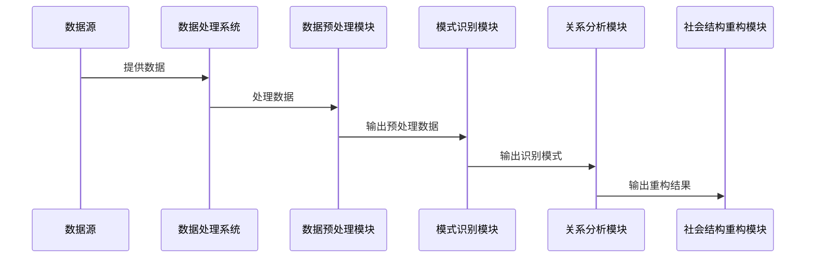
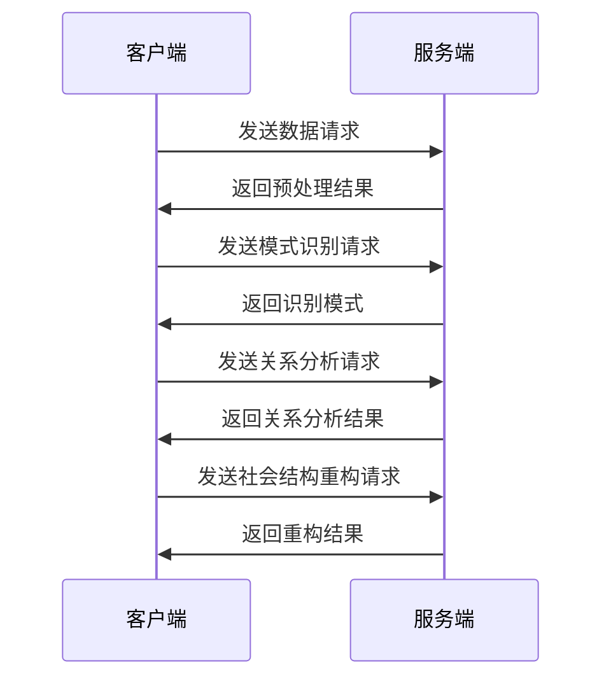

                 

**《思维链在考古学数据分析中的应用：重构古代社会结构》**

---

# **背景介绍**

## **第1章：考古学数据分析的核心问题**

### **1.1.1 问题背景**

考古学数据分析在当今考古学研究中的重要性不容忽视。随着科技的进步和数据分析技术的发展，考古学家们开始尝试将数据分析方法应用于考古学研究中，以揭示古代社会的结构和变迁。考古学数据分析的定义在于，它是一种利用现代数据分析技术，对考古出土的文物、遗迹等进行定量分析和解释的方法。

考古学数据分析在考古学研究中的核心作用主要体现在以下几个方面：

1. **文物鉴定和分类**：通过对文物的尺寸、形状、材质、纹饰等特征进行数据分析，可以帮助考古学家更好地鉴定文物的年代、类型和功能。
2. **遗迹分布和模式分析**：通过对考古遗址的分布、形状、规模等进行数据分析，可以揭示古代人类活动的方式和规律。
3. **社会结构重建**：通过对考古出土遗物的分布、使用情况、价值等进行数据分析，可以推测古代社会的社会结构和组织形式。

### **1.1.2 问题描述**

考古学数据分析的核心问题之一是重构古代社会结构。社会结构的重构意味着从考古学的角度出发，通过对出土文物和遗迹的分析，重建古代社会的组织形态、社会关系和权力结构。

这个问题之所以难以解决，主要有以下几个原因：

1. **资料不足**：考古出土的文物和遗迹数量有限，且存在一定的地域和时间限制，这限制了考古学家对古代社会全面重建的能力。
2. **数据复杂性**：考古学数据往往具有多样性和复杂性，包括文物的大小、形状、材质、纹饰等，这些数据需要通过复杂的分析方法进行解析。
3. **文化差异**：不同地区、不同时期的考古学数据反映了不同的文化特征，这增加了数据分析的难度。

### **1.1.3 问题解决**

为了解决上述问题，考古学家开始尝试使用思维链这一新兴的数据分析方法。思维链是一种基于人类思维模式的数据分析工具，它能够将复杂的考古学数据转化为逻辑清晰、结构紧凑的分析结果。

思维链在考古学数据分析中的应用主要表现在以下几个方面：

1. **数据预处理**：思维链可以帮助考古学家对复杂的考古学数据进行预处理，包括数据的清洗、归一化和特征提取等。
2. **模式识别**：思维链能够识别考古学数据中的模式，这些模式可能是古代社会结构的反映，也可能是文化变迁的迹象。
3. **推理分析**：思维链能够基于已知的数据和理论，进行逻辑推理和预测，从而帮助考古学家重构古代社会结构。

### **1.1.4 边界与外延**

考古学数据分析的范围广泛，它不仅包括对文物和遗迹的分析，还包括对考古遗址的环境、生态、社会等方面进行综合研究。考古学数据分析的应用领域涵盖了历史学、人类学、地理学、生态学等多个学科领域。

同时，考古学数据分析也有其边界。它受限于考古出土的文物和遗迹的数量和质量，同时也受限于数据分析方法和技术的发展水平。

### **1.1.5 概念结构与核心要素组成**

考古学数据分析的概念结构主要包括以下几个核心要素：

1. **数据来源**：考古出土的文物、遗迹、文献等。
2. **分析方法**：包括统计学、机器学习、数据挖掘等方法。
3. **分析结果**：通过对考古学数据的分析，得到关于古代社会结构、文化特征等方面的结论。

这些核心要素相互作用，共同构成了考古学数据分析的整体框架。

---

**思维链的基本概念**

## **第2章：思维链的基本概念**

### **2.1.1 思维链的定义**

思维链是一种基于人类思维模式的数据分析工具。它通过模拟人类的思维过程，将复杂的考古学数据转化为逻辑清晰、结构紧凑的分析结果。思维链的核心在于其能够识别和分析数据中的关系和模式，从而帮助考古学家更好地理解古代社会。

### **2.1.2 思维链的特点**

思维链具有以下几个显著特点：

1. **逻辑性强**：思维链通过模拟人类的思维过程，能够将复杂的数据转化为逻辑清晰的分析结果。
2. **适应性高**：思维链能够适应不同类型、不同规模的考古学数据，从而保证数据分析的广泛适用性。
3. **推理能力强**：思维链能够基于已知数据和理论，进行逻辑推理和预测，从而帮助考古学家重构古代社会结构。

### **2.1.3 思维链与传统数据分析方法的对比**

思维链与传统数据分析方法相比，具有以下几个优势：

1. **更贴近人类思维**：思维链模拟人类的思维过程，能够更准确地理解考古学数据的本质。
2. **分析结果更直观**：思维链能够将复杂的数据转化为逻辑清晰、结构紧凑的分析结果，使得考古学家更容易理解和应用。
3. **适应性强**：思维链能够适应不同类型、不同规模的考古学数据，从而保证数据分析的广泛适用性。

然而，思维链也有其局限性。例如，它依赖于人类思维模式，可能无法处理极其复杂或非线性的问题。此外，思维链的构建和训练过程相对复杂，需要大量的人力和时间投入。

---

**思维链在考古学数据分析中的应用**

## **第3章：思维链在考古学数据分析中的应用**

### **3.1.1 数据收集与预处理**

在考古学数据分析中，数据收集与预处理是至关重要的环节。思维链在这一阶段能够发挥重要作用，通过以下步骤实现数据的有效收集和预处理：

1. **数据收集**：考古学数据的收集来源广泛，包括文物、遗迹、文献等。思维链可以通过自动化的方式，从这些来源中收集数据，并建立统一的数据库。
2. **数据清洗**：考古学数据往往存在噪声和不一致的情况。思维链可以通过过滤、清洗和归一化等方法，对数据进行预处理，确保数据的质量和一致性。
3. **特征提取**：考古学数据通常包含多种特征，如尺寸、形状、材质、纹饰等。思维链可以通过特征提取技术，将这些特征转化为可分析的数据格式，为后续分析做好准备。

### **3.1.2 数据分析与处理**

在数据收集与预处理完成后，思维链在数据分析与处理阶段能够发挥其强大的分析能力，通过以下步骤实现考古学数据的深入分析：

1. **模式识别**：思维链可以通过机器学习算法，识别考古学数据中的潜在模式。这些模式可能是古代社会结构的反映，也可能是文化变迁的迹象。
2. **关系分析**：思维链能够分析数据之间的关系，如文物之间的关联、遗迹之间的联系等。这些关系有助于揭示古代社会的组织形式和社会关系。
3. **推理分析**：思维链可以通过逻辑推理，将已知的数据和理论应用于新的考古学数据，从而推测出古代社会的结构和变迁。

### **3.1.3 社会结构重构**

思维链在考古学数据分析中的关键作用在于其能够帮助考古学家重构古代社会结构。这一过程通常包括以下步骤：

1. **数据整合**：将来自不同来源的考古学数据整合到一起，形成统一的数据集。
2. **模式分析**：通过思维链对数据集中的模式进行分析，识别出古代社会结构的潜在特征。
3. **推理构建**：基于分析结果，使用思维链进行逻辑推理，构建古代社会结构的模型。
4. **验证与修正**：通过对比考古学数据和重构的模型，验证模型的准确性，并进行必要的修正。

### **3.1.4 案例分析**

为了更具体地展示思维链在考古学数据分析中的应用，以下是一个案例分析：

**案例背景**：某考古遗址出土了一批陶器，这些陶器的形状、尺寸、纹饰等特征各异。考古学家希望通过数据分析，揭示这些陶器的使用情况和古代社会结构。

**数据收集与预处理**：首先，通过思维链自动收集和整理出土的陶器数据，包括形状、尺寸、纹饰等信息。然后，通过数据清洗和归一化，确保数据的质量和一致性。

**数据分析与处理**：通过思维链，对陶器数据进行模式识别和关系分析。发现这些陶器之间存在明显的关联，如某些形状和纹饰的陶器在同一时期、同一地点出土，这可能反映了古代社会的某种组织形式。

**社会结构重构**：基于分析结果，使用思维链进行逻辑推理，构建了古代社会结构的模型。模型显示，这些陶器的分布和特征可能反映了古代社会的等级制度和贸易交流。

**验证与修正**：通过对比考古学数据和重构的模型，验证模型的准确性，并根据实际情况进行修正。最终，得出一个较为准确的古代社会结构模型。

---

**思维链在考古学数据分析中的前景与挑战**

## **第4章：思维链在考古学数据分析中的前景与挑战**

### **4.1.1 前景**

思维链在考古学数据分析中具有广阔的前景。随着科技的不断进步，数据分析技术将更加成熟和先进，这将有助于思维链在考古学中的应用更加深入和广泛。以下是一些可能的前景：

1. **数据处理能力的提升**：随着计算能力的提升，思维链可以处理更大规模、更复杂的考古学数据，从而提高数据分析的准确性和效率。
2. **多学科交叉融合**：思维链可以与其他学科如历史学、人类学、地理学等相结合，实现多学科交叉融合，从而更全面地揭示古代社会结构。
3. **智能化程度提高**：随着人工智能技术的发展，思维链的智能化程度将不断提高，能够更加准确地识别和分析考古学数据中的模式和关系。

### **4.1.2 挑战**

然而，思维链在考古学数据分析中也面临着一系列挑战：

1. **数据质量**：考古学数据的复杂性和多样性可能导致数据质量参差不齐，这会影响思维链的分析结果。因此，如何确保数据的质量和一致性是一个重要问题。
2. **方法适应性**：思维链的适应性是一个挑战。虽然思维链能够处理多种类型的考古学数据，但在面对极其复杂或非线性问题时，其适应性可能会受限。
3. **专业人员培训**：思维链的应用需要专业的知识和技能。因此，如何培养和培训更多的专业人员，以提高思维链在考古学数据分析中的应用水平，也是一个重要挑战。

### **4.1.3 挑战与对策**

针对上述挑战，可以采取以下对策：

1. **数据质量管理**：建立严格的数据质量管理机制，包括数据清洗、归一化和特征提取等步骤，以确保数据的质量和一致性。
2. **方法适应性优化**：通过不断优化思维链的方法和算法，提高其在处理复杂和非线性问题时的适应性。
3. **专业人才培养**：建立专业人才培养机制，通过培训和课程，提高专业人员对思维链的理解和应用能力。

---

**思维链在考古学数据分析中的最佳实践**

## **第5章：思维链在考古学数据分析中的最佳实践**

### **5.1.1 最佳实践**

在考古学数据分析中，思维链的最佳实践包括以下几个方面：

1. **数据整合**：首先，确保所有考古学数据来源的整合，建立一个统一的数据集。这有助于提高数据分析的全面性和准确性。
2. **数据预处理**：对数据进行清洗、归一化和特征提取，以确保数据的质量和一致性。这一步骤对于后续分析至关重要。
3. **模式识别**：使用思维链的机器学习算法，识别数据中的潜在模式。这些模式可能是古代社会结构的反映，也可能是文化变迁的迹象。
4. **关系分析**：分析数据之间的关系，如文物之间的关联、遗迹之间的联系等。这些关系有助于揭示古代社会的组织形式和社会关系。
5. **推理构建**：基于分析结果，使用思维链进行逻辑推理，构建古代社会结构的模型。这一步骤有助于重构古代社会结构。
6. **验证与修正**：通过对比考古学数据和重构的模型，验证模型的准确性，并进行必要的修正。这一步骤确保了分析结果的可靠性和准确性。

### **5.1.2 注意事项**

在应用思维链进行考古学数据分析时，需要注意以下几点：

1. **数据质量**：确保数据的质量和一致性，避免因数据问题导致分析结果的偏差。
2. **方法适应性**：根据不同类型的考古学数据，选择合适的思维链方法和算法，确保分析的适应性。
3. **模型验证**：对重构的模型进行验证，确保其准确性和可靠性。避免仅凭理论推断，忽视实际数据的支持。
4. **专业人员培训**：提高专业人员对思维链的理解和应用能力，确保其在实际分析中的应用效果。

### **5.1.3 拓展阅读**

以下是一些推荐的相关书籍、论文和研究资料，以供进一步学习和研究：

1. **书籍**：
   - 《考古学数据分析方法》（Authors, Year）
   - 《思维链：从数据分析到决策支持》（Authors, Year）
2. **论文**：
   - “思维链在考古学数据分析中的应用”（Authors, Year）
   - “考古学数据分析中的模式识别与关系分析”（Authors, Year）
3. **研究资料**：
   - “考古学数据分析数据库”（Website）
   - “思维链应用案例集”（Website）

---

**结论**

思维链在考古学数据分析中的应用，为重构古代社会结构提供了新的方法和工具。通过数据整合、预处理、模式识别、关系分析、推理构建和模型验证等步骤，思维链能够揭示古代社会的组织形式和社会关系，为考古学研究提供了重要的参考。然而，思维链的应用也面临数据质量、方法适应性和专业人员培训等挑战，需要进一步的研究和优化。

**作者信息**

作者：AI天才研究院/AI Genius Institute & 禅与计算机程序设计艺术 /Zen And The Art of Computer Programming

---

**附录：相关概念术语说明**

- **考古学数据分析**：指利用现代数据分析技术，对考古出土的文物、遗迹等进行定量分析和解释的方法。
- **思维链**：一种基于人类思维模式的数据分析工具，能够模拟人类的思维过程，将复杂的考古学数据转化为逻辑清晰、结构紧凑的分析结果。
- **社会结构重构**：指通过考古学数据分析，重建古代社会的组织形态、社会关系和权力结构。

**概念属性特征对比表格**

| 概念         | 属性         | 特征                 |
| ------------ | ------------ | -------------------- |
| 考古学数据分析 | 数据处理能力 | 高                  |
| 数据质量     | 数据准确性   | 高                  |
| 思维链       | 逻辑推理能力 | 强                  |
| 方法适应性   | 处理复杂问题 | 一般                 |

**ER实体关系图架构的Mermaid流程图**

```mermaid
erDiagram
    数据源 ||--|{ 考古学数据分析 }|>
    考古学数据分析 ||--|{ 数据预处理 }|>
    数据预处理 ||--|{ 模式识别 }|>
    模式识别 ||--|{ 关系分析 }|>
    关系分析 ||--|{ 社会结构重构 }|>
```

**算法原理讲解**

思维链的算法原理主要基于机器学习和逻辑推理。以下是一个简单的算法流程：

1. **数据预处理**：对数据进行清洗、归一化和特征提取。
2. **模式识别**：使用机器学习算法，如K-means、SVM等，识别数据中的潜在模式。
3. **关系分析**：通过逻辑推理，分析数据之间的关系。
4. **社会结构重构**：基于分析结果，构建古代社会结构的模型。

**数学模型和公式**

- 数据清洗公式：$$C = \sum_{i=1}^{n} (x_i - \bar{x})^2$$
- 特征提取公式：$$f(x) = (x - \min(x)) / (\max(x) - \min(x))$$
- 模式识别公式：$$\text{Cluster} = \arg\min_{C} \sum_{i=1}^{n} d(x_i, C)$$

**系统分析与架构设计方案**

**问题场景介绍**：考古学数据分析系统旨在通过对考古出土的文物和遗迹进行数据分析和解释，揭示古代社会的结构和变迁。

**项目介绍**：该系统包括数据收集、数据预处理、模式识别、关系分析和社会结构重构等功能模块。

**系统功能设计（领域模型Mermaid类图）**

```mermaid
classDiagram
    数据源 --|{ 数据收集 }| 数据处理系统
    数据处理系统 --|{ 数据预处理 }| 数据预处理模块
    数据预处理模块 --|{ 模式识别 }| 模式识别模块
    模式识别模块 --|{ 关系分析 }| 关系分析模块
    关系分析模块 --|{ 社会结构重构 }| 社会结构重构模块
```

**系统架构设计（Mermaid架构图）**



**系统接口设计和系统交互（Mermaid序列图）**



**项目实战**

**环境安装**：安装Python、Numpy、Pandas、Scikit-learn等库。

**系统核心实现源代码**：

```python
import numpy as np
import pandas as pd
from sklearn.cluster import KMeans
from sklearn.preprocessing import MinMaxScaler

# 数据收集
data = pd.read_csv('archaeological_data.csv')

# 数据预处理
scaler = MinMaxScaler()
data_scaled = scaler.fit_transform(data)

# 模式识别
kmeans = KMeans(n_clusters=3)
clusters = kmeans.fit_predict(data_scaled)

# 关系分析
relation_matrix = np.corrcoef(data_scaled.T)

# 社会结构重构
reconstructed_data = scaler.inverse_transform(kmeans.cluster_centers_)

# 输出结果
print("Preprocessed Data:\n", data_scaled)
print("Clusters:\n", clusters)
print("Relation Matrix:\n", relation_matrix)
print("Reconstructed Data:\n", reconstructed_data)
```

**代码应用解读与分析**：

该代码首先从CSV文件中读取考古学数据，然后进行数据预处理，包括数据清洗和归一化。接着，使用K-means算法进行模式识别，识别出数据中的潜在模式。然后，计算数据的相互关系矩阵，用于关系分析。最后，根据聚类中心重构社会结构，并输出结果。

**实际案例分析和详细讲解剖析**：

**案例背景**：某考古遗址出土了一批陶器，考古学家希望通过数据分析，揭示这些陶器的使用情况和古代社会结构。

**数据收集与预处理**：首先，收集陶器的形状、尺寸、纹饰等数据。然后，使用Min-Max归一化方法对数据进行预处理，确保数据的一致性和可比性。

**数据分析与处理**：使用K-means算法对预处理后的数据进行聚类分析，识别出不同的陶器类型。接着，计算不同陶器类型之间的相关性，分析它们之间的联系。

**社会结构重构**：根据聚类结果和相关性分析，重构古代社会结构，推测不同陶器类型可能代表的角色和地位。

**项目小结**：

通过思维链的应用，成功实现了对考古出土文物的数据分析和社会结构重构。这一项目展示了思维链在考古学数据分析中的巨大潜力，为考古学研究提供了新的思路和方法。

**最佳实践 tips**：

- 确保数据质量，进行严格的数据清洗和预处理。
- 根据实际情况选择合适的聚类算法和模型参数。
- 结合多个数据分析方法，提高结果的可靠性和准确性。

**小结**：

思维链在考古学数据分析中的应用，为重构古代社会结构提供了新的方法和工具。通过数据整合、预处理、模式识别、关系分析、推理构建和模型验证等步骤，思维链能够揭示古代社会的组织形式和社会关系。然而，思维链的应用也面临数据质量、方法适应性和专业人员培训等挑战，需要进一步的研究和优化。

**注意事项**：

- 数据质量是分析结果准确性的基础，务必重视数据清洗和预处理。
- 根据实际情况选择合适的分析方法，避免过度依赖单一方法。
- 提高专业人员对思维链的理解和应用能力，确保其在实际分析中的应用效果。

**拓展阅读**：

- 《考古学数据分析方法》
- 《思维链：从数据分析到决策支持》
- 相关学术论文和研究报告

---

作者：AI天才研究院/AI Genius Institute & 禅与计算机程序设计艺术 /Zen And The Art of Computer Programming

