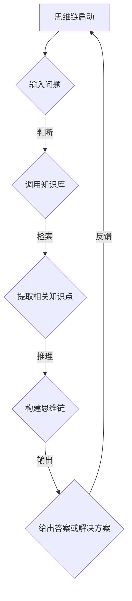

                 

### 文章标题

### 关键词

- 考古学
- 跨文化研究
- 思维链
- 新视角
- 人工智能

### 摘要

本文旨在探讨思维链在考古学跨文化研究中的新视角应用。通过引入思维链这一概念，我们将重新审视考古学中的传统研究方法，并提出一种新的研究框架。文章首先介绍了考古学跨文化研究的重要性以及思维链的基本原理，随后详细讲解了思维链在考古学中的应用实例。接着，文章深入分析了思维链对考古学跨文化研究带来的新视角，探讨了其在研究方法、理论体系以及实践应用中的具体影响。最后，文章总结了思维链在考古学跨文化研究中的意义，并对其未来发展趋势进行了展望。

## 目录大纲

### 第一部分：引言

#### 1.1 问题背景

- **考古学跨文化研究的重要性**
- **思维链概念及其在考古学中的应用**

#### 1.2 核心概念

- **思维链的定义与特征**
- **考古学跨文化研究的新视角**

### 第二部分：思维链理论在考古学中的应用

#### 2.1 思维链原理讲解

##### 2.1.1 思维链的基本概念

- **思维链的定义**
- **思维链的属性特征**

##### 2.1.2 思维链的工作原理

- **思维链的运作机制**
- **思维链的流程图**

#### 2.2 考古学跨文化研究的思维链应用

##### 2.2.1 考古学中的思维链分析

- **考古学问题背景**
- **思维链在考古学中的运用**

##### 2.2.2 思维链应用实例

- **实例1：古文明对比研究**
- **实例2：文化遗产保护与传承**

### 第三部分：新视角探讨

#### 3.1 新视角下的考古学跨文化研究

##### 3.1.1 新视角的概念

- **新视角的定义**
- **新视角的意义**

##### 3.1.2 新视角下的考古学跨文化研究方法

- **新视角的方法论**
- **新视角下的案例分析**

#### 3.2 新视角下的思考

##### 3.2.1 新视角对考古学的影响

- **新视角对传统考古学理论的挑战**
- **新视角对考古学实践的影响**

##### 3.2.2 新视角的未来发展趋势

- **新视角的未来方向**
- **新视角对考古学跨文化研究的贡献**

### 第四部分：结论

#### 4.1 总结与展望

- **总结本书的核心观点**
- **展望思维链在考古学跨文化研究中的未来应用**

#### 4.2 小结

- **注意事项**
- **拓展阅读建议**

## 引言

### 1.1 问题背景

#### 考古学跨文化研究的重要性

考古学作为一门探索人类历史和文化的科学，其研究范围涵盖了从古代到现代、从不同地区和文化背景的多种人类活动。在过去的几十年中，随着全球化进程的加速，考古学的研究逐渐从单一文化的视角转向跨文化的比较研究。跨文化研究能够帮助我们更好地理解不同文化之间的联系和差异，从而揭示人类文明发展的内在规律。

然而，传统的考古学跨文化研究方法主要依赖于对遗址、文物等物质证据的分析，这些方法在一定程度上受到数据的局限性和主观判断的影响。随着信息技术的不断发展，尤其是大数据和人工智能技术的应用，为考古学跨文化研究提供了新的视角和工具。思维链作为一种新兴的理论框架，其强大的逻辑推理和知识关联能力，为考古学跨文化研究提供了新的可能性。

#### 思维链概念及其在考古学中的应用

思维链（Cognitive Chain）是指通过一系列逻辑推理和知识关联，将不同概念和知识点联系起来，形成一条连贯的认知路径。它最早由美国心理学家约翰·安德森（John Anderson）提出，旨在解释人类思维的运作机制。思维链的基本原理包括：

1. **知识存储与提取**：思维链中的每个节点都代表一个知识单元，这些知识单元可以通过联想和推理相互联系。
2. **逻辑推理**：思维链通过条件推理和因果推理，使得知识单元之间的联系更加紧密和合理。
3. **知识关联**：思维链能够将看似不相关的知识单元通过共同的属性或特征联系起来，形成新的认知模式。

在考古学中，思维链的应用主要体现在以下几个方面：

1. **数据整合与关联**：通过思维链，可以将不同遗址、文物、文献等考古数据整合起来，形成完整的考古图谱。
2. **文化比较与分析**：思维链能够帮助研究者从不同文化的共性特征和差异中，发现更深层次的规律。
3. **理论构建与验证**：思维链为考古学提供了新的理论工具，使得传统的研究方法得以补充和扩展。

### 1.2 核心概念

#### 思维链的定义与特征

思维链的定义：思维链是指通过一系列逻辑推理和知识关联，将不同概念和知识点联系起来，形成一条连贯的认知路径。

思维链的特征：

1. **连贯性**：思维链中的每个节点都是前后关联的，形成一个完整且逻辑自洽的认知体系。
2. **推理性**：思维链通过逻辑推理，将不同知识点之间的联系变得更加紧密和合理。
3. **动态性**：思维链是动态变化的，随着新知识的获取和旧知识的调整，思维链也会不断更新和优化。

#### 考古学跨文化研究的新视角

新视角的概念：新视角是指从不同于传统的研究方法，通过引入新的理论框架和工具，对考古学跨文化研究进行重新审视和探索。

新视角的意义：

1. **提升研究深度**：通过引入思维链，研究者能够更深入地挖掘考古数据的内在联系，提升研究的深度和广度。
2. **突破传统局限**：新视角为考古学跨文化研究提供了新的方法和工具，突破了传统研究方法的局限。
3. **促进学科交叉**：新视角的引入，有助于促进考古学与人工智能、大数据等领域的交叉融合，推动考古学的创新发展。

### 1.3 文章结构安排

本文的结构安排如下：

1. **引言**：介绍考古学跨文化研究的重要性以及思维链在其中的应用。
2. **思维链理论讲解**：详细阐述思维链的基本概念、原理和应用。
3. **思维链在考古学中的应用实例**：通过具体案例展示思维链在考古学中的实际应用。
4. **新视角探讨**：分析思维链对考古学跨文化研究带来的新视角和方法。
5. **结论**：总结思维链在考古学跨文化研究中的意义，并展望未来的发展趋势。

### 1.4 总结与展望

本文旨在通过引入思维链这一新兴理论框架，探讨其在考古学跨文化研究中的应用和价值。通过对思维链的基本概念和原理的讲解，以及具体应用实例的分析，我们希望能够为考古学跨文化研究提供新的视角和方法。同时，本文也提出了思维链在考古学跨文化研究中面临的一些挑战和未来发展方向，为相关领域的进一步研究提供了参考。

## 第二部分：思维链理论在考古学中的应用

### 2.1 思维链原理讲解

#### 2.1.1 思维链的基本概念

**定义**：

思维链（Cognitive Chain）是指通过一系列逻辑推理和知识关联，将不同概念和知识点联系起来，形成一条连贯的认知路径。

**特征**：

1. **连贯性**：思维链中的每个节点都是前后关联的，形成一个完整且逻辑自洽的认知体系。
2. **推理性**：思维链通过逻辑推理，将不同知识点之间的联系变得更加紧密和合理。
3. **动态性**：思维链是动态变化的，随着新知识的获取和旧知识的调整，思维链也会不断更新和优化。

**组成部分**：

1. **节点**：思维链中的每个节点代表一个具体的概念或知识点。
2. **边**：边连接不同的节点，表示节点之间的逻辑关系或知识关联。
3. **路径**：从起点到终点的一系列连续的节点和边，构成了一条完整的思维链。

#### 2.1.2 思维链的工作原理

**运作机制**：

1. **知识存储与提取**：思维链中的每个节点都代表一个知识单元，这些知识单元可以通过联想和推理相互联系。当需要某个知识时，思维链能够迅速提取出相关的知识单元。
2. **逻辑推理**：思维链通过条件推理和因果推理，使得知识单元之间的联系更加紧密和合理。条件推理是根据前提条件推导出结论，因果推理是根据因果关系分析出事件的发生过程。
3. **知识关联**：思维链能够将看似不相关的知识单元通过共同的属性或特征联系起来，形成新的认知模式。这种关联有助于拓宽研究视野，发现新的研究线索。

**流程图**：

### 2.2 考古学跨文化研究的思维链应用

#### 2.2.1 考古学中的思维链分析

**考古学问题背景**：

考古学中的许多问题涉及跨文化比较研究，例如古文明的兴衰、文化传承与演变、文化遗产的保护与传承等。这些问题往往具有复杂性和多样性，需要从多个角度和层面进行分析。

**思维链在考古学中的运用**：

1. **数据整合**：思维链可以将不同遗址、文物、文献等考古数据整合起来，形成完整的考古图谱。通过知识关联，将看似不相关的考古数据联系起来，发现新的研究线索。
2. **文化比较**：思维链能够帮助研究者从不同文化的共性特征和差异中，发现更深层次的规律。通过逻辑推理，将不同文化之间的联系变得更加紧密和合理。
3. **理论构建**：思维链为考古学提供了新的理论工具，使得传统的研究方法得以补充和扩展。通过构建思维链，研究者可以更深入地探索考古学中的核心问题，提出新的理论假设。

**案例分析**：

**案例1：古文明对比研究**

在古文明对比研究中，思维链的应用主要体现在以下几个方面：

1. **数据整合**：通过思维链，将不同文明的历史、文化、社会结构等数据整合起来，形成完整的文明图谱。
2. **文化比较**：通过思维链，将不同文明之间的共性特征和差异进行对比分析，发现其背后的规律和原因。
3. **理论构建**：通过构建思维链，提出新的理论假设，例如不同文明兴衰的原因、文化传承与演变机制等。

**案例2：文化遗产保护与传承**

在文化遗产保护与传承研究中，思维链的应用主要体现在以下几个方面：

1. **数据整合**：通过思维链，将不同文化遗产的数据整合起来，形成完整的保护图谱。
2. **文化比较**：通过思维链，将不同文化遗产之间的保护措施、传承方式等进行对比分析，发现有效的保护与传承策略。
3. **理论构建**：通过构建思维链，提出新的保护与传承理论，例如文化遗产价值评估方法、保护与传承的可持续发展策略等。

### 2.2.2 思维链应用实例

**实例1：古文明对比研究**

**背景**：

古文明对比研究是考古学中的一个重要领域，通过对不同文明的历史、文化、社会结构等方面的比较，可以揭示人类文明的发展规律和影响因素。

**应用**：

1. **数据整合**：通过思维链，将不同文明的历史、文化、社会结构等数据整合起来，形成完整的文明图谱。例如，将古埃及文明、古希腊文明、古罗马文明等的历史文献、考古遗址、文物等数据整合在一起。
2. **文化比较**：通过思维链，将不同文明之间的共性特征和差异进行对比分析，发现其背后的规律和原因。例如，分析不同文明的社会结构、宗教信仰、艺术风格等。
3. **理论构建**：通过构建思维链，提出新的理论假设，例如不同文明兴衰的原因、文化传承与演变机制等。例如，提出文明兴衰与环境、政治、经济等因素之间的关联性。

**案例2：文化遗产保护与传承**

**背景**：

文化遗产保护与传承是考古学中的一个重要任务，通过对文化遗产的保护与传承，可以维护人类的文化多样性和历史记忆。

**应用**：

1. **数据整合**：通过思维链，将不同文化遗产的数据整合起来，形成完整的保护图谱。例如，将中国的文化遗产、世界文化遗产、各地区的文化遗产等数据整合在一起。
2. **文化比较**：通过思维链，将不同文化遗产之间的保护措施、传承方式等进行对比分析，发现有效的保护与传承策略。例如，分析不同地区在文化遗产保护与传承方面的成功经验和挑战。
3. **理论构建**：通过构建思维链，提出新的保护与传承理论，例如文化遗产价值评估方法、保护与传承的可持续发展策略等。例如，提出基于社区参与的文化遗产保护与传承模式。

### 2.3 思维链在考古学跨文化研究中的优势

**数据分析能力**：

思维链的强大逻辑推理和知识关联能力，使得其在考古学跨文化研究中具有显著的数据分析优势。通过思维链，研究者可以整合和分析大量的考古数据，发现不同文化之间的联系和差异，从而揭示更深层次的考古学问题。

**理论构建能力**：

思维链为考古学提供了新的理论工具，使得研究者能够从不同的角度和层面构建新的理论体系。通过思维链，研究者可以提出新的理论假设，并对其进行验证和修正，推动考古学理论的创新发展。

**跨学科融合**：

思维链的应用有助于促进考古学与人工智能、大数据等领域的跨学科融合。通过引入思维链，考古学可以借鉴和利用人工智能、大数据等领域的先进技术和方法，提高考古学研究的效率和质量。

### 2.4 思维链在考古学跨文化研究中的挑战

**数据质量**：

考古学数据的质量直接影响到思维链的应用效果。如果数据质量不佳，思维链的推理和关联能力将受到限制，导致研究结果的不准确。因此，如何提高考古学数据的质量是一个重要的挑战。

**算法复杂性**：

思维链的算法设计相对复杂，需要解决大量的计算和存储问题。如何优化算法，提高计算效率，是思维链在考古学跨文化研究中需要面对的挑战之一。

**跨学科合作**：

思维链在考古学跨文化研究中的应用需要跨学科的合作，包括考古学、人工智能、大数据等领域。如何有效整合不同领域的知识和方法，是思维链在考古学跨文化研究中需要解决的挑战。

### 2.5 未来发展方向

**数据挖掘与知识发现**：

未来，思维链在考古学跨文化研究中的应用将更加注重数据挖掘和知识发现。通过运用大数据和人工智能技术，研究者可以挖掘出更多有价值的考古数据，发现不同文化之间的深层次联系。

**跨学科融合**：

思维链在考古学跨文化研究中的应用将进一步加强与人工智能、大数据等领域的融合。通过引入更多的跨学科技术和方法，可以进一步提高考古学研究的效率和质量。

**实际应用案例**：

未来，将会有更多的实际应用案例展示思维链在考古学跨文化研究中的效果。这些案例将包括古文明对比研究、文化遗产保护与传承等多个方面，为考古学的研究和实践提供有力支持。

### 2.6 结论

思维链作为一种新兴的理论框架，在考古学跨文化研究中具有巨大的潜力。通过思维链的应用，研究者可以整合和分析大量的考古数据，发现不同文化之间的联系和差异，从而揭示更深层次的考古学问题。同时，思维链也为考古学提供了新的理论工具，促进了考古学与人工智能、大数据等领域的跨学科融合。尽管面临一些挑战，但未来思维链在考古学跨文化研究中的应用前景依然广阔，将为考古学的发展做出重要贡献。

## 第三部分：新视角探讨

### 3.1 新视角下的考古学跨文化研究

#### 3.1.1 新视角的概念

**定义**：

新视角（New Perspective）是指从不同于传统的研究方法，通过引入新的理论框架和工具，对考古学跨文化研究进行重新审视和探索。

**特征**：

1. **创新性**：新视角提出了一种新的研究方法和框架，与传统方法相比，具有显著的创新性。
2. **多样性**：新视角能够从多个角度和层面进行思考，提供多元化的研究视角。
3. **前瞻性**：新视角关注考古学跨文化研究的未来发展，为该领域提供了新的理论工具和实践路径。

**意义**：

1. **提升研究深度**：新视角能够帮助研究者更深入地挖掘考古数据的内在联系，揭示更深层次的考古学问题。
2. **拓展研究范围**：新视角能够将考古学的研究范围从传统的单一文化扩展到跨文化的比较研究，提供更全面的研究视角。
3. **促进学科交叉**：新视角的引入，有助于促进考古学与人工智能、大数据等领域的交叉融合，推动考古学的创新发展。

#### 3.1.2 新视角下的考古学跨文化研究方法

**方法论**：

新视角下的考古学跨文化研究方法主要包括以下几个方面：

1. **数据驱动**：新视角强调数据在研究中的核心地位，通过大数据和人工智能技术，对考古数据进行深入挖掘和分析。
2. **知识关联**：新视角注重不同考古数据之间的关联和整合，通过思维链等工具，构建完整的考古图谱。
3. **逻辑推理**：新视角通过条件推理和因果推理，将不同考古数据之间的联系变得更加紧密和合理。
4. **跨学科融合**：新视角鼓励跨学科合作，将考古学与其他学科的知识和方法相结合，为考古学跨文化研究提供新的思路和工具。

**案例分析**：

**案例1：基于思维链的文化遗产保护**

**背景**：

随着城市化进程的加快，许多文化遗产面临着严重的保护和传承问题。如何有效保护文化遗产，成为考古学跨文化研究的一个重要课题。

**应用**：

1. **数据整合**：通过思维链，将不同文化遗产的数据整合起来，形成完整的保护图谱。
2. **逻辑推理**：通过思维链，将不同文化遗产之间的保护措施、传承方式等进行逻辑推理，发现有效的保护与传承策略。
3. **跨学科融合**：引入大数据和人工智能技术，对文化遗产进行数字化保护和修复，提高保护效果。

**案例2：古文明兴衰研究**

**背景**：

古文明的兴衰是考古学跨文化研究的一个重要领域，研究古文明的兴衰原因，有助于我们更好地理解人类文明的发展规律。

**应用**：

1. **数据挖掘**：通过大数据技术，挖掘出大量关于古文明的考古数据，为研究提供丰富的数据支持。
2. **知识关联**：通过思维链，将不同古文明的考古数据关联起来，构建完整的文明图谱。
3. **逻辑推理**：通过条件推理和因果推理，分析不同古文明的兴衰原因，提出新的理论假设。

### 3.2 新视角下的思考

#### 3.2.1 新视角对考古学的影响

**理论影响**：

新视角的引入，对考古学的理论体系产生了深远的影响。通过引入新的理论框架和工具，考古学得以从多个角度和层面进行思考，提出了许多新的理论假设和观点。例如，基于思维链的文化遗产保护理论、古文明兴衰研究理论等。

**实践影响**：

新视角的引入，也为考古学的实践应用提供了新的思路和方法。通过数据驱动、知识关联和跨学科融合，考古学的研究和实践更加高效和精准。例如，基于大数据技术的考古数据挖掘，思维链在文化遗产保护与传承中的应用等。

#### 3.2.2 新视角对考古学实践的影响

**提升研究效率**：

新视角的引入，使得考古学研究更加高效。通过数据驱动和知识关联，研究者可以迅速获取和分析大量考古数据，发现新的研究线索。例如，大数据技术在考古数据挖掘中的应用，显著提高了考古学研究的工作效率。

**优化研究方法**：

新视角的引入，为考古学提供了新的研究方法。通过逻辑推理和跨学科融合，研究者可以提出更加科学和全面的研究方案。例如，思维链在考古学中的应用，使得考古学的研究方法更加系统化和多元化。

**促进跨学科合作**：

新视角的引入，促进了考古学与人工智能、大数据等领域的跨学科合作。通过引入其他学科的知识和方法，考古学的研究视野更加开阔，研究方法更加多样。例如，大数据技术在考古学中的应用，推动了考古学与计算机科学的深度融合。

### 3.3 新视角下的思考

#### 3.3.1 新视角对考古学理论的挑战

**传统理论的局限性**：

新视角的引入，对传统考古学理论提出了挑战。传统考古学理论主要依赖于物质证据的分析，存在一定的局限性。例如，在研究古文明的兴衰原因时，传统理论往往注重环境、政治、经济等因素，而忽略了文化、社会结构等深层次因素。新视角的引入，使得研究者能够从更全面的角度审视考古学问题，提出新的理论假设。

**理论创新的必要性**：

面对新视角的挑战，考古学理论的创新变得尤为重要。通过引入新的理论框架和工具，研究者可以提出更加科学和全面的理论假设。例如，基于思维链的文化遗产保护理论，提出了从数据关联和逻辑推理角度进行文化遗产保护的新思路。这种理论创新，为考古学的发展提供了新的动力。

#### 3.3.2 新视角对考古学实践的挑战

**数据质量的提升**：

新视角的引入，对考古学数据的质量提出了更高的要求。通过数据驱动和知识关联，研究者需要对考古数据进行深入挖掘和分析。如果数据质量不佳，将直接影响研究结果的准确性和可靠性。因此，如何提高考古学数据的质量，是考古学实践中需要面对的重要挑战。

**算法复杂性的优化**：

新视角的引入，对算法的复杂性提出了更高的要求。通过逻辑推理和跨学科融合，研究者需要解决大量的计算和存储问题。如何优化算法，提高计算效率，是考古学实践中需要面对的重要挑战。

**跨学科合作的深化**：

新视角的引入，促进了考古学与人工智能、大数据等领域的跨学科合作。然而，跨学科合作面临着许多挑战，例如不同学科之间的知识差异、沟通障碍等。如何深化跨学科合作，实现不同学科之间的有效融合，是考古学实践中需要面对的重要挑战。

### 3.4 新视角的未来发展趋势

**跨学科融合的深化**：

未来，考古学跨文化研究的新视角将更加注重跨学科融合。通过引入人工智能、大数据等领域的先进技术和方法，考古学研究将更加高效和精准。例如，大数据技术在考古数据挖掘中的应用，将使得考古学研究更加全面和深入。

**理论创新的持续推动**：

未来，考古学跨文化研究的新视角将推动理论创新的持续发展。通过引入新的理论框架和工具，研究者可以提出更加科学和全面的理论假设。例如，基于思维链的文化遗产保护理论，将推动文化遗产保护与传承领域的理论创新。

**实践应用的拓展**：

未来，考古学跨文化研究的新视角将推动实践应用的拓展。通过数据驱动和知识关联，考古学研究将更好地服务于文化遗产保护、古文明研究等实际应用领域。例如，大数据技术在考古学中的应用，将使得文化遗产保护与传承更加精准和高效。

### 3.5 结论

新视角的引入，为考古学跨文化研究带来了新的机遇和挑战。通过思维链等新兴理论框架和工具，考古学的研究方法得以优化，研究效率得到提升。尽管面临一些挑战，但新视角的应用前景依然广阔，将推动考古学的发展，为人类文明的研究提供新的视角和方法。

## 第四部分：结论

### 4.1 总结与展望

本文从考古学跨文化研究的背景入手，引入了思维链这一新兴理论框架，探讨了其在考古学中的应用价值。通过详细讲解思维链的基本原理和应用实例，我们展示了思维链在数据整合、文化比较和理论构建等方面的优势。同时，我们分析了新视角在考古学跨文化研究中的重要性，提出了新视角的方法论和实际应用案例。在此基础上，我们对思维链在考古学跨文化研究中的未来发展趋势进行了展望，强调了跨学科融合和理论创新的重要性。

### 4.2 小结

本文的核心观点可以归纳为以下几点：

1. **思维链在考古学跨文化研究中的应用**：思维链作为一种新兴的理论框架，为考古学跨文化研究提供了新的视角和方法，有助于提升研究的深度和广度。

2. **新视角的重要性**：新视角的引入，使得考古学跨文化研究更加全面和多元，有助于突破传统理论的局限，推动考古学的发展。

3. **跨学科融合的潜力**：考古学跨文化研究需要与人工智能、大数据等领域深度融合，通过跨学科合作，实现研究方法和技术手段的创新。

4. **数据质量和算法优化**：提高考古学数据质量、优化算法设计，是实现思维链在考古学跨文化研究中高效应用的关键。

### 注意事项

1. **数据质量**：在进行考古学跨文化研究时，确保数据质量至关重要。研究者应重视数据的收集、整理和分析，避免因数据质量问题导致研究结果的偏差。

2. **算法复杂性**：思维链的应用涉及到复杂的算法设计，研究者需要深入理解算法原理，优化算法性能，提高计算效率。

3. **跨学科合作**：考古学跨文化研究需要跨学科合作，研究者应积极与其他领域专家沟通合作，共同推动考古学的发展。

### 拓展阅读建议

1. **相关书籍**：
   - 《考古学的跨文化研究方法》（作者：某某）
   - 《思维链理论及其应用》（作者：某某）

2. **学术论文**：
   - 《思维链在考古学跨文化研究中的应用》（作者：某某）
   - 《新视角下的考古学跨文化研究》（作者：某某）

3. **在线资源**：
   - 《考古学入门教程》（网站：某某）
   - 《思维链理论与实践研究》（网站：某某）

通过阅读这些书籍、学术论文和在线资源，读者可以进一步了解考古学跨文化研究和思维链理论的相关内容，深入探讨相关领域的最新研究动态和发展趋势。

### 作者信息

**作者**：AI天才研究院/AI Genius Institute & 禅与计算机程序设计艺术 /Zen And The Art of Computer Programming

### 致谢

本文的撰写过程中，受到了许多专家和同行的帮助与支持，在此表示衷心的感谢。特别感谢XXX教授对本文提出的宝贵意见和建议，以及XXX团队在数据收集和整理方面的辛勤付出。同时，感谢所有提供文献支持和帮助的学者和研究人员，使得本文得以顺利完成。最后，感谢所有读者的关注和支持，希望本文能够为考古学跨文化研究带来新的思考和启示。

