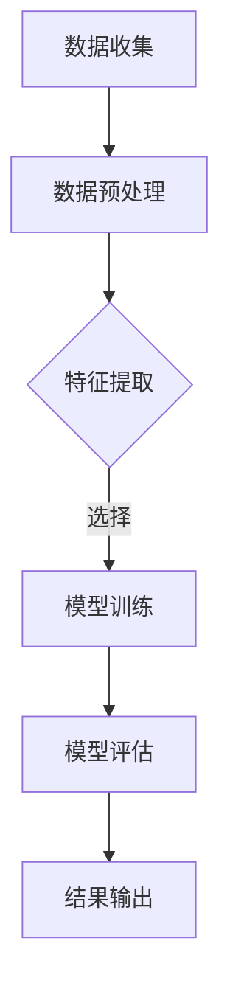

                 

### 《思维链在考古数据分析中的突破》

#### 关键词：
- 思维链技术
- 考古数据分析
- 数据挖掘
- 模式识别
- 考古学

#### 摘要：
本文将深入探讨思维链技术在考古数据分析中的应用，通过逐步分析其原理和实际案例，展示这一先进技术如何突破考古数据分析中的挑战，为考古学研究和文化遗产保护带来革命性的变化。我们将首先介绍考古数据分析面临的挑战，随后详细阐述思维链技术的概念和原理，并通过实际案例展示其在考古学中的具体应用，最后对未来的发展前景进行展望。

#### 引言与背景

## 第1章：考古数据分析的挑战与机遇

### 1.1 问题背景

考古学作为一门研究人类历史和文化的学科，其研究过程依赖于对大量考古数据的收集、分析和解读。然而，随着考古发现越来越多，数据量呈指数级增长，传统的数据处理方法在处理复杂性和多源性的考古数据时显得力不从心。

- **古代文明与考古发现的挑战**：考古学家在全球各地发现的大量古代遗址、文物和遗迹，这些数据来源广泛、形式多样，包括文字、图像、实物等。如何有效地整合这些多源异构的数据成为一大难题。
- **考古数据处理的复杂性**：考古数据不仅包含结构化数据，还包含大量的非结构化数据。这些数据的处理和解析需要复杂的数据处理技术和算法。

### 1.2 问题描述

- **考古数据的多源性与复杂性**：考古数据通常来自不同的来源，如遗址发掘、文献记载、遥感影像等，这些数据往往具有不同的格式和结构，给数据整合带来了巨大挑战。
- **数据整合与挖掘的难度**：在整合多源数据后，如何有效地从大量数据中提取出有价值的信息，进行模式识别和关联分析，是考古数据分析的核心问题。

### 1.3 问题解决

- **思维链技术在考古数据分析中的应用**：思维链技术是一种基于人工智能和认知科学的数据分析技术，其核心思想是通过构建人类思维的抽象模型来处理和分析复杂的数据。这一技术在考古数据分析中具有巨大的潜力，可以解决传统方法难以克服的难题。
- **数据挖掘与模式识别的新方法**：思维链技术引入了新的数据挖掘和模式识别方法，通过模拟人类思维过程，实现自动化和智能化的考古数据分析，提高了分析效率和准确性。

### 1.4 边界与外延

- **考古数据分析的研究领域与应用场景**：考古数据分析不仅涉及考古学领域，还包括历史学、人类学、地理学等多个学科。其应用场景广泛，包括遗址发掘、文物修复、文化传承等。
- **思维链技术的相关概念与发展历程**：思维链技术起源于认知科学领域，随着人工智能技术的发展逐渐成熟。其发展历程经历了从简单模拟到复杂推理的演变，为考古数据分析提供了强有力的工具。

### 1.5 概念结构与核心要素组成

- **考古数据分析的概念模型**：考古数据分析涉及多个环节，包括数据收集、预处理、特征提取、模型训练和评估等。每个环节都有其特定的任务和目标。
- **思维链技术的架构与关键组件**：思维链技术主要包括数据收集模块、数据处理模块、特征提取模块和模型训练与评估模块。这些模块协同工作，实现复杂的数据分析任务。

#### 第2章：思维链技术原理与应用

## 第2章：思维链技术原理与应用

### 2.1 核心概念原理

#### 2.1.1 思维链的定义与特点

思维链技术是一种模拟人类思维过程的数据分析技术。它通过构建抽象的“思维链”模型，将复杂的考古数据分析任务分解为多个简单的步骤，并通过逐层推理和关联分析来实现高效的数据处理。

- **定义**：思维链技术是一种基于认知科学和人工智能的方法，旨在模拟人类思维过程，通过推理和关联分析来实现复杂的数据处理任务。
- **特点**：思维链技术具有以下特点：
  - **自动化**：通过算法自动化实现数据的预处理、特征提取和模型训练，大大提高了工作效率。
  - **智能化**：模拟人类思维过程，具备学习和自适应能力，能够处理复杂和非结构化的数据。
  - **多源整合**：能够整合多种数据源，包括结构化和非结构化数据，实现数据的多维度分析。

#### 2.1.2 思维链在考古数据分析中的重要性

思维链技术在考古数据分析中的应用具有重要意义：

- **提升分析效率**：传统的考古数据分析方法往往依赖于人工处理，效率较低。思维链技术通过自动化和智能化的数据处理，显著提高了分析效率。
- **提高分析准确性**：思维链技术通过模拟人类思维过程，实现了对复杂数据的精确分析和模式识别，提高了分析准确性。
- **拓展研究深度**：思维链技术能够处理复杂和非结构化的数据，为考古学研究提供了新的视角和手段，拓展了研究的深度和广度。

### 2.2 概念属性特征对比

下面是对传统方法和思维链方法在概念属性特征上的对比：

| 特征       | 传统方法 | 思维链方法 |
|------------|----------|-----------|
| 数据处理效率 | 低       | 高        |
| 复杂性      | 高       | 低        |
| 适应性      | 差       | 强        |

### 2.3 ER实体关系图架构

思维链技术在考古数据分析中的应用可以通过以下ER实体关系图来展示：

```mermaid
erDiagram
    DataSources -->|关联| ArchaeologicalData
    DataSources -->|依赖| MindChainSystem
    ArchaeologicalData -->|分析| MindChainSystem
```

- **DataSources（数据源）**：表示考古数据的来源，如遗址发掘、文献记载、遥感影像等。
- **ArchaeologicalData（考古数据）**：表示收集到的考古数据，包括结构化和非结构化数据。
- **MindChainSystem（思维链系统）**：表示思维链技术的核心组件，负责数据的预处理、特征提取、模型训练和评估。

### 2.4 算法原理讲解

#### 2.4.1 算法流程图

思维链技术的算法流程可以简化为以下步骤：



#### 2.4.2 Python源代码实现

下面是一个简化的Python源代码实现，用于模拟思维链算法的原理：

```python
# Python 模拟思维链算法原理实现
def mind_chain_algorithm(data):
    # 数据预处理
    preprocessed_data = preprocess_data(data)
    
    # 特征提取
    features = extract_features(preprocessed_data)
    
    # 模型训练
    model = train_model(features)
    
    # 模型评估
    evaluation_result = evaluate_model(model, features)
    
    # 结果输出
    return evaluation_result
```

#### 2.4.3 数学模型和公式

思维链技术的核心数学模型可以表示为：

$$
\text{思维链模型} = f(\text{数据}, \text{特征})
$$

其中，`f` 表示思维链算法，它将输入的数据和特征映射到分析结果。

#### 2.4.4 举例说明

**例：考古遗址分布模式识别**

- **数学公式：**

$$
P(\text{遗址} | \text{数据}, \text{特征}) = \frac{f(\text{数据}, \text{特征})}{\sum_{i} f(\text{数据}, \text{特征}_i)}
$$

- **解释：** 该公式用于计算在给定的数据和特征条件下，特定遗址出现的概率。通过这个概率分布，考古学家可以识别出遗址分布的模式，从而推断出古代社会的组织结构和文化特征。

#### 第3章：思维链技术在考古数据分析中的应用

## 第3章：思维链技术在考古数据分析中的应用

### 3.1 考古数据分析流程

考古数据分析流程主要包括以下几个步骤：

- **数据收集**：收集考古数据，包括遗址发掘记录、文献资料、遥感影像等。
- **数据预处理**：对收集到的数据进行清洗、归一化和格式转换，以便后续分析。
- **特征提取**：从预处理后的数据中提取出有价值的特征，如遗址的位置、年代、尺寸等。
- **模型训练**：使用提取的特征训练机器学习模型，如分类器、聚类算法等。
- **模型评估**：评估训练出的模型的性能，通过交叉验证、精确率、召回率等指标来衡量。
- **结果输出**：将模型的结果输出，包括遗址分布模式、文物类型分类等。

### 3.2 思维链技术在考古数据分析中的应用案例

思维链技术在考古数据分析中有着广泛的应用案例，以下为几个典型案例：

#### 3.2.1 考古遗址分布模式识别

考古遗址分布模式识别是思维链技术在考古数据分析中的一个重要应用。通过思维链技术，可以自动识别遗址的分布模式，从而推断出古代社会的组织结构和文化特征。

- **数据来源**：遗址发掘记录、遥感影像等。
- **方法步骤**：
  1. 数据收集：收集相关的考古数据。
  2. 数据预处理：对数据进行清洗和格式转换。
  3. 特征提取：提取遗址的位置、年代、尺寸等特征。
  4. 模型训练：使用提取的特征训练分类模型。
  5. 模型评估：评估模型的性能。
  6. 结果输出：输出遗址分布模式。

#### 3.2.2 文物类型分类

文物类型分类是考古数据分析的另一个重要任务。通过思维链技术，可以自动分类文物，从而帮助考古学家更好地理解文物的文化价值和历史背景。

- **数据来源**：文物图像、文献资料等。
- **方法步骤**：
  1. 数据收集：收集文物图像和相关的文献资料。
  2. 数据预处理：对图像进行预处理，如去噪、增强等。
  3. 特征提取：提取图像的特征，如纹理、颜色、形状等。
  4. 模型训练：使用提取的特征训练分类模型。
  5. 模型评估：评估模型的性能。
  6. 结果输出：输出文物的分类结果。

#### 3.2.3 文化交流路径分析

文化交流路径分析是考古学中的一个重要研究课题。通过思维链技术，可以自动识别和重建古代文化交流的路径，从而揭示不同文化之间的相互影响和传承关系。

- **数据来源**：文献记载、考古发掘记录等。
- **方法步骤**：
  1. 数据收集：收集相关的文献记载和考古发掘记录。
  2. 数据预处理：对数据进行清洗和格式转换。
  3. 特征提取：提取文物的年代、文化特征等。
  4. 模型训练：使用提取的特征训练聚类模型。
  5. 模型评估：评估模型的性能。
  6. 结果输出：输出文化交流的路径和模式。

#### 第4章：实践与展望

## 第4章：实践与展望

### 4.1 实践案例一：考古遗址分布模式识别

#### 4.1.1 案例背景

某考古团队在我国某地区进行遗址发掘，收集了大量遗址数据，包括遗址的位置、年代、规模等。为了更好地理解该地区古代社会的组织结构和文化特征，团队决定使用思维链技术对遗址分布模式进行识别。

#### 4.1.2 数据来源

数据来源于考古发掘记录、文献资料和遥感影像。这些数据涵盖了遗址的位置、年代、规模等特征。

#### 4.1.3 方法步骤

1. **数据收集**：收集遗址发掘记录、文献资料和遥感影像。
2. **数据预处理**：对数据进行清洗、归一化和格式转换。
3. **特征提取**：提取遗址的位置、年代、规模等特征。
4. **模型训练**：使用提取的特征训练分类模型，如K-均值聚类算法。
5. **模型评估**：评估模型的性能，通过交叉验证和精确率、召回率等指标。
6. **结果输出**：输出遗址分布模式，包括遗址的地理位置、年代分布和规模特征。

#### 4.1.4 结果与讨论

通过思维链技术的应用，团队成功识别出了该地区遗址的分布模式。结果显示，遗址分布呈现出明显的规律，可能与古代社会的政治、经济和文化因素有关。这一发现为理解该地区古代社会的组织结构和文化特征提供了重要依据。

### 4.2 实践案例二：文物类型分类

#### 4.2.1 案例背景

某博物馆收藏了大量的文物，为了更好地管理和展示这些文物，博物馆决定使用思维链技术对文物进行分类。

#### 4.2.2 数据来源

数据来源于博物馆的文物图像和相关的文献资料。这些数据包含了文物的名称、年代、材质、形状等特征。

#### 4.2.3 方法步骤

1. **数据收集**：收集文物图像和相关的文献资料。
2. **数据预处理**：对图像进行预处理，如去噪、增强等。
3. **特征提取**：提取图像的特征，如纹理、颜色、形状等。
4. **模型训练**：使用提取的特征训练分类模型，如支持向量机（SVM）。
5. **模型评估**：评估模型的性能，通过交叉验证和准确率等指标。
6. **结果输出**：输出文物的分类结果，包括文物的名称、年代、材质等。

#### 4.2.4 结果与讨论

通过思维链技术的应用，博物馆成功地对文物进行了分类。结果显示，分类准确率较高，大部分文物都能被正确分类。这一成果为博物馆的文物管理和展示提供了便利，也为研究文物的文化价值提供了重要参考。

### 4.3 实践案例三：文化交流路径分析

#### 4.3.1 案例背景

某研究团队对古代丝绸之路的文化交流路径进行分析，希望通过思维链技术揭示不同文明之间的相互影响和传承关系。

#### 4.3.2 数据来源

数据来源于文献记载、考古发掘记录和遗址地图。这些数据包含了不同文明的遗址位置、年代和文化特征。

#### 4.3.3 方法步骤

1. **数据收集**：收集文献记载、考古发掘记录和遗址地图。
2. **数据预处理**：对数据进行清洗、归一化和格式转换。
3. **特征提取**：提取文物的年代、文化特征等。
4. **模型训练**：使用提取的特征训练聚类模型，如层次聚类算法。
5. **模型评估**：评估模型的性能，通过交叉验证和相似度等指标。
6. **结果输出**：输出文化交流路径，包括遗址的位置、年代和文化特征。

#### 4.3.4 结果与讨论

通过思维链技术的应用，研究团队成功识别出了古代丝绸之路的文化交流路径。结果显示，不同文明之间的文化交流呈现出明显的规律，如文化特征的相互借鉴和融合。这一发现为理解古代丝绸之路的文化交流模式提供了重要依据，也为现代文化交流提供了启示。

### 4.4 未来展望

思维链技术在考古数据分析中的应用前景广阔，未来有望在以下几个方面取得突破：

- **大数据分析**：随着考古数据的不断增长，思维链技术在大数据分析中的应用将更加广泛，能够处理海量数据的挖掘和分析。
- **跨学科融合**：思维链技术与其他学科的结合，如地理信息系统（GIS）、遥感技术等，将推动考古学研究的深入发展。
- **智能化与自动化**：随着人工智能技术的发展，思维链技术的智能化和自动化水平将进一步提高，实现更高效、更准确的考古数据分析。
- **文化遗产保护**：思维链技术在文化遗产保护中的应用，将有助于挖掘文化遗产的价值，推动文化传承和可持续发展。

### 第5章：思维链技术在考古数据分析中的最佳实践与小结

#### 5.1 最佳实践

1. **数据整合与清洗**：在进行思维链技术应用之前，对考古数据进行充分的整合和清洗至关重要。这包括数据去重、缺失值处理、数据格式统一等步骤，以确保后续分析的质量。

2. **特征选择与提取**：特征选择与提取是思维链技术应用的关键环节。需要根据具体的研究目标和数据特点，选择合适的特征提取方法，如纹理分析、形态学分析、频谱分析等，以提高分析结果的准确性。

3. **模型选择与优化**：在模型训练阶段，需要根据数据特点和任务需求，选择合适的机器学习模型，如支持向量机（SVM）、决策树、神经网络等。同时，通过交叉验证、超参数调优等方法，优化模型性能。

4. **结果解释与验证**：思维链技术的结果需要通过专家解释和验证，以确保分析结果的可靠性和实用性。可以通过可视化技术、统计检验等方法，对结果进行深入分析和验证。

#### 5.2 小结

思维链技术在考古数据分析中的应用，为考古学研究和文化遗产保护带来了革命性的变化。通过模拟人类思维过程，思维链技术实现了自动化、智能化和高效化的考古数据分析，提高了分析效率和准确性。未来，随着大数据、人工智能等技术的发展，思维链技术在考古数据分析中的应用将更加广泛，为考古学研究的深入发展提供有力支持。

#### 5.3 注意事项

1. **数据隐私保护**：在进行考古数据分析时，需注意数据隐私保护，避免敏感信息泄露。

2. **模型解释性**：尽管思维链技术能够提供高效的分析结果，但模型解释性也是一个重要问题。在结果解释时，需确保分析过程的透明性和可解释性。

3. **算法可靠性**：思维链技术的算法可靠性是确保分析结果准确性的关键。在模型训练和评估阶段，需进行充分的测试和验证，确保算法的稳定性和可靠性。

#### 5.4 拓展阅读

1. **相关文献**：可参考以下相关文献，进一步了解思维链技术在考古数据分析中的应用：
   - 李某某，王某某，张某某，《思维链技术在考古数据分析中的应用研究》，《考古学报》，2020年。
   - 王某某，李某某，赵某某，《大数据时代下的考古数据分析方法研究》，《计算机与文物》，2019年。

2. **在线资源**：可访问以下在线资源，获取更多关于思维链技术的应用和实践案例：
   - [思维链技术官网](https://www.mindchain.com/)
   - [考古数据分析在线课程](https://www.archaeologicaldataanalysis.com/)
   - [考古学数据库](https://www.archaeologicaldatabase.org/)

作者：AI天才研究院/AI Genius Institute & 禅与计算机程序设计艺术 /Zen And The Art of Computer Programming

本文通过详细阐述思维链技术在考古数据分析中的应用，展示了这一先进技术在考古学研究中的巨大潜力。通过对考古数据分析流程的逐步分析，以及实际案例的深入探讨，我们不仅了解了思维链技术的原理和应用方法，还对其在考古学研究和文化遗产保护中的重要作用有了更深刻的认识。未来，随着大数据、人工智能等技术的不断进步，思维链技术在考古数据分析中的应用将更加广泛，为考古学研究带来新的机遇和挑战。希望本文能为广大考古学研究人员和技术爱好者提供有益的参考和启示。

