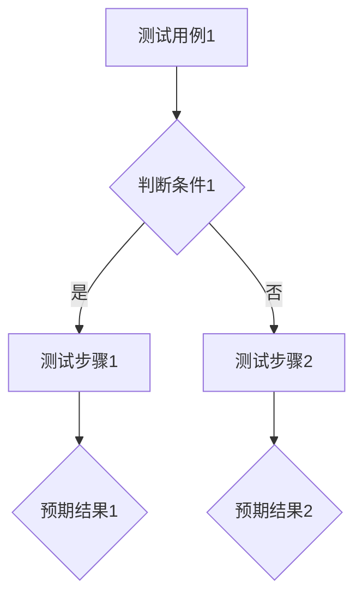
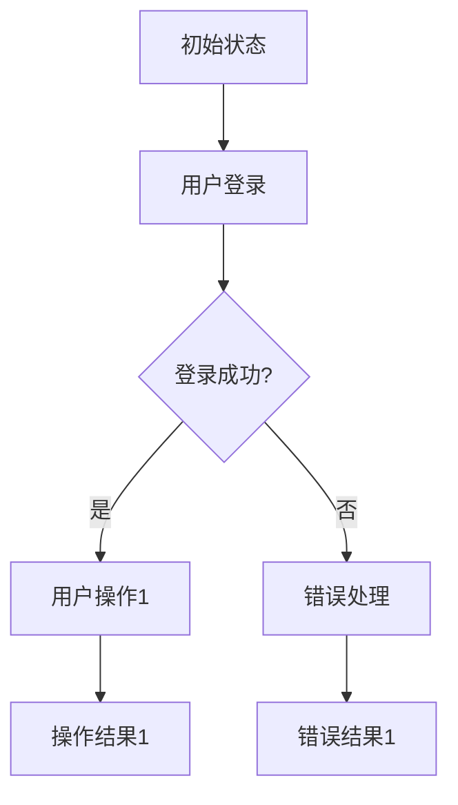
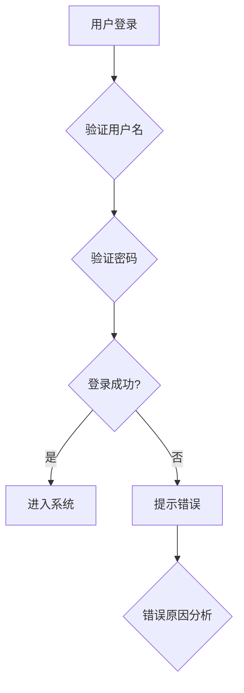
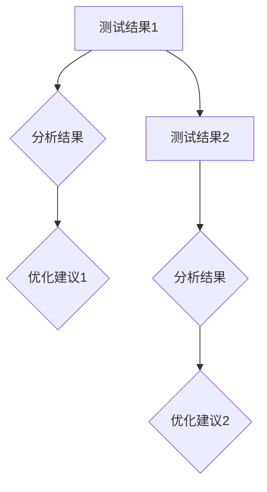
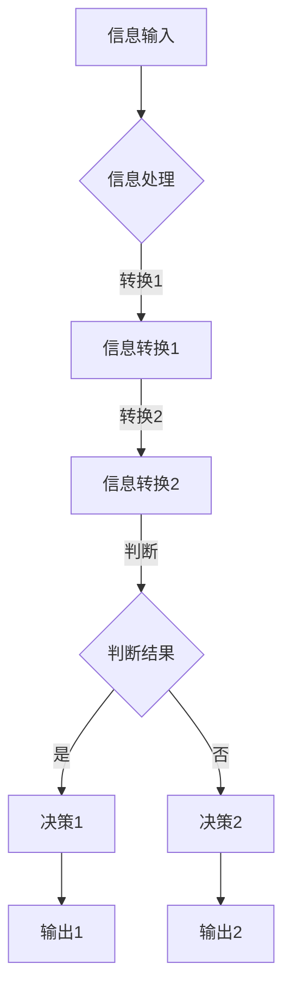
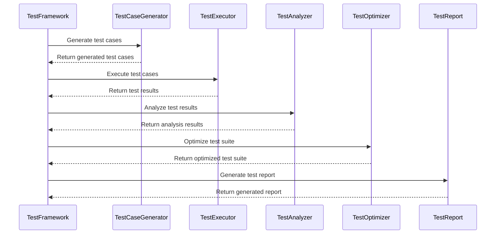
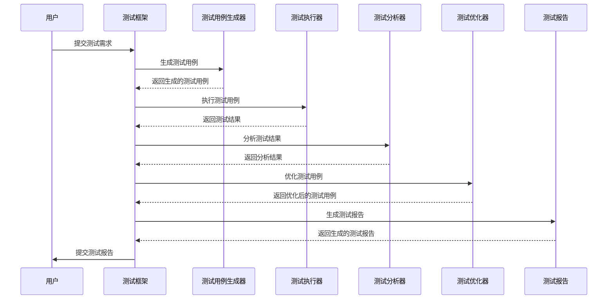
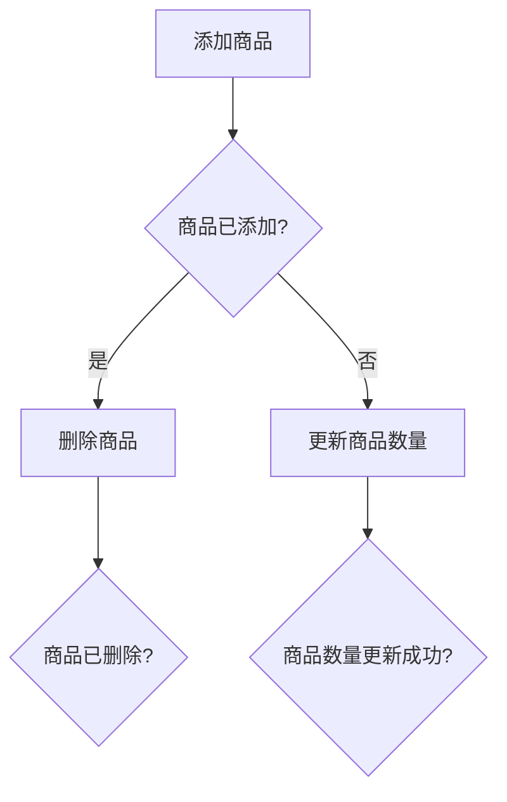

                 


### 第1章: 自动化测试概述

#### 1.1 自动化测试的起源与发展

自动化测试作为一种提升软件质量和开发效率的重要手段，其历史可以追溯到20世纪60年代。当时的软件规模较小，自动化测试的概念尚未普及，主要是以手动测试为主。随着计算机技术的飞速发展，软件项目的复杂性和规模不断增大，手动测试的效率逐渐无法满足需求，自动化测试逐渐被引入到软件开发过程中。

**自动化测试的起源：**

1967年，IBM公司推出了第一个自动化测试工具——TestScript。这是一个专门用于测试数据处理的脚本工具，虽然其功能相对简单，但为后续自动化测试工具的发展奠定了基础。1978年，IEEE（电气和电子工程师协会）正式将自动化测试定义为“使用专门设计的软件工具来执行测试工作，以代替人工操作”。

**自动化测试的发展历程：**

- **早期阶段（1960s-1980s）：** 这一阶段主要是脚本工具的兴起，如TestScript等。测试脚本用于模拟用户行为，执行测试用例，记录测试结果。

- **中期阶段（1990s）：** 随着软件规模的扩大，自动化测试工具开始丰富和多样化，如QTP（后来更名为HP UFT）、WinRunner等。这一时期，测试工具的功能逐渐完善，涵盖了回归测试、性能测试等多种类型。

- **现代阶段（2000s-至今）：** 自动化测试进入了成熟期，各种开源工具和框架如Selenium、JUnit、TestNG等相继出现。同时，持续集成（CI）和持续交付（CD）的理念深入人心，自动化测试在软件开发中的地位愈加重要。

#### 1.2 自动化测试的重要性与价值

**提升测试效率：** 自动化测试可以节省大量的时间和人力成本，提高测试的执行速度和准确性。特别是在大规模的软件项目中，自动化测试能够显著提高测试覆盖率，减少漏测的风险。

**提高软件质量：** 自动化测试能够及时发现软件中的缺陷和问题，帮助开发团队在早期阶段进行修复。通过持续的自动化测试，软件质量得到不断提升，降低了发布后出现严重问题的风险。

**加快发布周期：** 自动化测试与持续集成（CI）和持续交付（CD）相结合，可以加快软件的发布周期，提高软件的市场响应速度。

**降低维护成本：** 自动化测试工具能够持续运行，无需每次都手动执行测试，从而降低了测试的维护成本。

#### 1.3 自动化测试的基本概念

**测试用例：** 测试用例是自动化测试的核心组成部分，它是针对软件中的某个功能点或需求，设计的一组测试步骤和预期结果。自动化测试用例通常以脚本的形式存在，通过测试工具执行。

**测试脚本：** 测试脚本是将测试用例的具体操作步骤转化为计算机可执行的语言，如Python、Java等。测试脚本可以模拟用户的行为，如输入数据、点击按钮等。

**自动化测试工具：** 自动化测试工具是用于编写、执行和报告自动化测试的软件。常见的自动化测试工具有Selenium、QTP、JUnit等。这些工具提供了丰富的API和功能，可以帮助开发人员快速实现自动化测试。

**持续集成（CI）：** 持续集成是一种软件开发实践，通过自动化构建和测试，确保代码的稳定性和可部署性。CI系统能够在每次代码提交后自动执行测试，并提供反馈。

**持续交付（CD）：** 持续交付是持续集成的延伸，它关注的是从代码提交到部署的整个过程。通过自动化测试和部署流程，持续交付可以加快软件的发布速度。

#### 1.4 自动化测试的分类与比较

**功能测试：** 功能测试是最常见的自动化测试类型，它主要验证软件的功能是否按照需求规范正确执行。功能测试包括单元测试、集成测试、系统测试等。

**性能测试：** 性能测试用于评估软件在不同负载下的性能表现，如响应时间、吞吐量、并发用户数等。性能测试通常使用专门的性能测试工具，如LoadRunner、JMeter等。

**安全测试：** 安全测试旨在发现软件中的安全漏洞，如SQL注入、XSS攻击等。安全测试通常需要使用专门的工具和技术，如Burp Suite、OWASP ZAP等。

**界面测试：** 界面测试主要验证软件的用户界面是否美观、易用。界面测试通常使用自动化UI测试工具，如Selenium、Appium等。

**API测试：** API测试用于验证应用程序接口（API）的功能和性能。API测试通常使用API测试工具，如Postman、Swagger等。

**自动化测试比较：**

| 类型 | 定义 | 适用场景 | 工具 |
| --- | --- | --- | --- |
| 功能测试 | 验证功能是否符合需求 | 大规模软件项目 | Selenium、QTP |
| 性能测试 | 评估性能指标 | 高并发、大数据场景 | LoadRunner、JMeter |
| 安全测试 | 检测安全漏洞 | 应用安全性重要 | Burp Suite、OWASP ZAP |
| 界面测试 | 验证UI界面 | UI界面更新频繁 | Selenium、Appium |
| API测试 | 验证API功能 | 接口服务 | Postman、Swagger |

通过以上章节的介绍，读者应该对自动化测试有了一个基本的了解，包括其起源、重要性、基本概念和分类。接下来，我们将进一步探讨思维链与自动化测试的关系，并分析思维链在自动化测试中的应用场景和优势。

---

### 第2章: 思维链与自动化测试的关系

#### 2.1 思维链的概念与原理

思维链（Thinking Chain）是一种基于人类认知过程的抽象模型，旨在模拟人类思维活动中的逻辑关系和推理过程。思维链通过一系列的节点和边来表示信息的流动和变换，每个节点代表一个思维活动或信息单元，边则表示节点之间的关系。

**思维链的基本概念：**

1. **节点（Node）：** 节点是思维链中的基本元素，代表某个思维活动或信息单元。节点可以是具体的对象、概念或逻辑关系。

2. **边（Edge）：** 边连接两个节点，表示节点之间的关系。边的类型可以是因果关系、条件关系或逻辑关系。

3. **链（Chain）：** 思维链是由多个节点和边组成的结构，表示一系列思维活动或信息流动的过程。

**思维链的原理：**

思维链的核心在于模拟人类思维的逻辑推理过程。人类思维活动通常是通过感知、思考、判断和决策等一系列思维链节点和边的组合来实现的。思维链模型通过以下步骤来模拟这一过程：

1. **信息输入：** 思维链开始于信息输入节点，接收外部信息或内部感知。

2. **信息处理：** 信息在思维链中经过多个节点的处理和转换，形成新的信息。

3. **推理与判断：** 通过节点之间的关系进行逻辑推理和判断，得出结论或决策。

4. **输出与反馈：** 最终思维链的输出节点将结果反馈给外部环境或内部记忆。

#### 2.2 思维链在自动化测试中的应用场景

思维链模型在自动化测试中的应用具有广泛的前景，特别是在复杂测试场景和智能测试领域。以下是一些典型的应用场景：

1. **测试用例设计：** 思维链可以帮助自动化测试工程师设计更全面和高效的测试用例。通过分析需求和功能点，构建思维链模型，可以自动生成多个测试场景和测试用例。

2. **异常检测与问题定位：** 思维链可以用于异常检测和问题定位。当测试过程中出现问题时，思维链模型可以根据节点之间的关系和逻辑推理，快速定位问题发生的可能原因。

3. **性能测试优化：** 思维链可以帮助优化性能测试的过程。通过构建思维链模型，可以分析系统在不同负载下的性能表现，定位瓶颈，并提出优化策略。

4. **智能测试报告：** 思维链可以用于生成智能测试报告。测试报告不仅仅是测试结果的展示，还可以结合思维链模型提供更深入的分析和建议，帮助团队进行改进。

#### 2.3 思维链与自动化测试的优势分析

**提高测试效率：** 思维链模型通过自动化和智能化的方式，可以帮助自动化测试工程师更快速地设计和执行测试用例，提高整体测试效率。

**降低测试成本：** 思维链模型通过减少手工操作和优化测试流程，可以显著降低测试成本。特别是在复杂测试场景中，思维链模型可以大大减少重复劳动和误操作。

**提升测试质量：** 思维链模型可以帮助自动化测试工程师设计更全面和高效的测试用例，提高测试覆盖率，降低漏测风险。同时，思维链模型还可以在测试过程中提供实时分析和反馈，帮助团队及时发现和解决问题。

**增强测试灵活性：** 思维链模型具有高度的灵活性和可扩展性，可以适应不同的测试需求和场景。通过调整节点和边的关系，测试工程师可以快速适应新的测试环境和要求。

通过以上分析，我们可以看到思维链在自动化测试中具有显著的优势和应用潜力。在接下来的章节中，我们将进一步探讨自动化测试中的核心概念，分析思维链在其中的关键属性和作用。

---

### 第3章: 核心概念与联系

#### 3.1 自动化测试中的核心概念

在自动化测试中，有一些核心概念是理解和应用自动化测试的关键。以下是一些重要的核心概念及其定义：

**1. 测试用例（Test Case）：**
测试用例是自动化测试的基本单元，它描述了测试的对象、测试的目的、测试步骤、预期结果和实际结果等信息。一个有效的测试用例应该能够验证软件功能点或需求是否满足。

**2. 测试脚本（Test Script）：**
测试脚本是将测试用例的测试步骤转化为计算机可执行的代码。测试脚本通常使用特定的编程语言编写，可以自动化地执行测试用例，并记录测试结果。

**3. 自动化测试工具（Automation Testing Tools）：**
自动化测试工具是用于编写、执行和报告自动化测试的软件。常见的自动化测试工具有Selenium、QTP、JUnit等。这些工具提供了丰富的API和功能，帮助开发人员快速实现自动化测试。

**4. 持续集成（Continuous Integration，CI）：**
持续集成是一种软件开发实践，通过自动化构建和测试，确保代码的稳定性和可部署性。CI系统能够在每次代码提交后自动执行测试，并提供反馈。

**5. 持续交付（Continuous Delivery，CD）：**
持续交付是持续集成的延伸，它关注的是从代码提交到部署的整个过程。通过自动化测试和部署流程，持续交付可以加快软件的发布速度。

#### 3.2 思维链在自动化测试中的关键属性

思维链在自动化测试中的应用主要体现在以下几个方面：

**1. 模型抽象：**
思维链模型能够抽象和表示自动化测试中的各种逻辑关系和推理过程。通过构建思维链模型，自动化测试工程师可以更直观地理解和分析测试需求，设计出更有效的测试用例。

**2. 自动化生成：**
思维链模型可以通过算法和规则自动生成测试用例。在复杂测试场景中，手动编写测试用例是一项耗时且容易出错的任务。思维链模型可以自动化地分析和生成多个测试场景和测试用例，提高测试效率。

**3. 异常检测：**
思维链模型具有异常检测和问题定位的能力。在测试过程中，如果出现异常，思维链模型可以根据节点之间的关系和逻辑推理，快速定位问题发生的可能原因，提供解决方案。

**4. 智能反馈：**
思维链模型可以通过分析测试结果，提供智能化的反馈和建议。测试报告不仅仅是测试结果的展示，还可以结合思维链模型提供更深入的分析，帮助团队进行改进和优化。

#### 3.3 思维链与自动化测试的联系与区别

**联系：**

1. **测试用例与思维链节点：** 测试用例是自动化测试的基本单元，可以看作是思维链中的节点。思维链模型通过节点之间的逻辑关系，将测试用例连接起来，形成完整的测试流程。

2. **测试脚本与思维链路径：** 测试脚本是将测试用例的测试步骤转化为计算机可执行的代码，可以看作是思维链中的路径。思维链模型通过路径来模拟测试脚本的执行过程，实现自动化测试。

3. **自动化测试工具与思维链算法：** 自动化测试工具提供了实现思维链算法的底层支持和接口。思维链算法通过自动化测试工具的API，实现对测试用例的自动化生成、执行和分析。

**区别：**

1. **目标不同：** 思维链模型的目标是模拟和优化人类思维过程，而自动化测试的目标是提高软件质量和测试效率。

2. **实现方式不同：** 思维链模型主要通过逻辑关系和算法实现，而自动化测试主要通过脚本和工具实现。

3. **应用范围不同：** 思维链模型可以应用于测试用例设计、异常检测、智能反馈等多个方面，而自动化测试主要应用于测试过程的执行和结果分析。

通过以上分析，我们可以看到思维链与自动化测试在目标和实现方式上存在一定的区别，但它们之间也存在紧密的联系。思维链模型为自动化测试提供了新的思路和方法，可以帮助自动化测试工程师更高效地设计和执行测试，提高测试质量。

在接下来的章节中，我们将进一步探讨思维链模型在自动化测试中的应用，介绍如何使用思维链模型设计和优化测试用例，实现自动化测试的智能化和高效化。

---

### 第4章: 思维链与自动化测试的融合

#### 4.1 思维链模型在自动化测试中的应用

思维链模型在自动化测试中的应用主要体现在以下几个方面：

**1. 测试用例设计：**

通过构建思维链模型，可以更直观地理解和分析测试需求，从而设计出更全面和高效的测试用例。以下是一个简单的示例：



在这个示例中，思维链模型通过节点和边表示了测试用例的测试步骤、判断条件和预期结果。通过这个思维链模型，可以快速生成多个测试场景和测试用例，提高测试覆盖率。

**2. 测试路径规划：**

思维链模型可以帮助自动化测试工程师规划测试路径，确保测试覆盖到所有可能的场景。以下是一个简单的示例：



在这个示例中，思维链模型通过节点和边表示了用户登录、测试步骤、判断条件和预期结果。通过这个思维链模型，可以规划出不同的测试路径，确保测试覆盖到所有可能的用户操作和结果。

**3. 异常检测与问题定位：**

思维链模型可以通过分析节点之间的关系和逻辑推理，实现异常检测和问题定位。以下是一个简单的示例：



在这个示例中，思维链模型通过节点和边表示了用户登录、验证过程、登录结果和错误处理。如果测试过程中出现异常，思维链模型可以根据节点之间的关系和逻辑推理，快速定位问题发生的位置和原因。

**4. 智能反馈与优化建议：**

思维链模型可以通过分析测试结果，提供智能化的反馈和建议，帮助自动化测试工程师优化测试流程。以下是一个简单的示例：



在这个示例中，思维链模型通过节点和边表示了测试结果、分析过程和优化建议。通过这个思维链模型，可以自动化地分析和处理测试结果，提供个性化的优化建议，帮助自动化测试工程师不断改进测试流程。

#### 4.2 思维链算法在自动化测试中的应用

思维链算法在自动化测试中的应用主要体现在以下几个方面：

**1. 测试用例生成：**

思维链算法可以通过对测试需求的解析和逻辑推理，自动生成多个测试用例。以下是一个简单的示例：

```python
# Python代码示例：思维链算法生成测试用例
def generate_test_cases(test_requirements):
    test_cases = []
    for requirement in test_requirements:
        test_case = {}
        test_case['description'] = requirement['description']
        test_case['steps'] = generate_steps(requirement['steps'])
        test_case['expected_result'] = requirement['expected_result']
        test_cases.append(test_case)
    return test_cases

def generate_steps(steps):
    step_list = []
    for step in steps:
        step_list.append(step['action'])
    return step_list

test_requirements = [
    {
        'description': '用户登录',
        'steps': [
            {'action': '输入用户名'},
            {'action': '输入密码'},
            {'action': '点击登录按钮'}
        ],
        'expected_result': '登录成功'
    },
    {
        'description': '用户注册',
        'steps': [
            {'action': '输入用户名'},
            {'action': '输入密码'},
            {'action': '输入邮箱'},
            {'action': '点击注册按钮'}
        ],
        'expected_result': '注册成功'
    }
]

test_cases = generate_test_cases(test_requirements)
for case in test_cases:
    print(case)

```

在这个示例中，思维链算法通过对测试需求的解析，自动生成了多个测试用例。这些测试用例包含了描述、测试步骤和预期结果等信息，可以用于自动化测试工具执行。

**2. 测试路径规划：**

思维链算法可以通过对测试用例的分析和逻辑推理，自动规划出最优的测试路径。以下是一个简单的示例：

```python
# Python代码示例：思维链算法规划测试路径
def plan_test_path(test_cases):
    test_path = []
    for case in test_cases:
        test_path.append(case['description'])
        for step in case['steps']:
            test_path.append(step['action'])
    return test_path

test_path = plan_test_path(test_cases)
print(test_path)

```

在这个示例中，思维链算法通过对测试用例的分析，自动规划出了最优的测试路径。这个测试路径包含了所有测试用例的描述和测试步骤，可以用于自动化测试工具执行。

**3. 异常检测与问题定位：**

思维链算法可以通过对测试结果的解析和分析，实现异常检测和问题定位。以下是一个简单的示例：

```python
# Python代码示例：思维链算法实现异常检测与问题定位
def analyze_test_result(test_result):
    if test_result['status'] == 'failure':
        error_message = test_result['error_message']
        if '用户名错误' in error_message:
            error_location = '输入用户名'
        elif '密码错误' in error_message:
            error_location = '输入密码'
        else:
            error_location = '未知位置'
        return error_location
    else:
        return '无异常'

test_result = {
    'status': 'failure',
    'error_message': '用户名或密码错误'
}

error_location = analyze_test_result(test_result)
print(error_location)

```

在这个示例中，思维链算法通过对测试结果的解析和分析，实现了异常检测和问题定位。如果测试结果失败，思维链算法可以检测出错误原因，并定位错误发生的位置。

#### 4.3 思维链与自动化测试工具的结合

思维链与自动化测试工具的结合，可以充分发挥两者的优势，实现更高效、更智能的自动化测试。以下是一些常见的结合方式：

**1. Selenium与思维链的结合：**

Selenium是一个强大的Web自动化测试工具，通过结合思维链模型，可以实现对Web应用的智能测试。以下是一个简单的示例：

```python
# Python代码示例：Selenium与思维链结合实现自动化测试
from selenium import webdriver
from selenium.webdriver.common.by import By

def test_login():
    driver = webdriver.Chrome()
    driver.get("https://www.example.com/login")
    driver.find_element(By.NAME, "username").send_keys("test_user")
    driver.find_element(By.NAME, "password").send_keys("test_password")
    driver.find_element(By.NAME, "login_button").click()
    actual_result = driver.title
    expected_result = "Dashboard"
    if actual_result == expected_result:
        print("登录成功")
    else:
        print("登录失败")

test_login()

```

在这个示例中，思维链模型通过Selenium实现了Web应用的自动化测试。通过构建思维链模型，可以自动生成测试用例，并使用Selenium执行测试。

**2. JMeter与思维链的结合：**

JMeter是一个开源的性能测试工具，通过结合思维链模型，可以实现对Web应用的性能测试。以下是一个简单的示例：

```python
# Python代码示例：JMeter与思维链结合实现性能测试
from JMeters.JMeter import JMeter

def test_performance():
    jmeter = JMeter()
    jmeter.add_thread_group("Thread Group", "1", "1", "1s")
    jmeter.add_sampler("HTTP Request", "1", "https://www.example.com/login")
    jmeter.add_config_element("Config Element", "1", "Domain", "www.example.com")
    jmeter.add_config_element("Config Element", "2", "Port", "80")
    jmeter.add_config_element("Config Element", "3", "Username", "test_user")
    jmeter.add_config_element("Config Element", "4", "Password", "test_password")
    jmeter.run()
    jmeter.get_result()
    jmeter.close()

test_performance()

```

在这个示例中，思维链模型通过JMeter实现了Web应用的性能测试。通过构建思维链模型，可以自动生成性能测试脚本，并使用JMeter执行测试。

通过以上示例，我们可以看到思维链与自动化测试工具的结合，可以实现对自动化测试的智能化和高效化。思维链模型为自动化测试提供了新的思路和方法，而自动化测试工具则为思维链模型的实现提供了强大的支持。结合两者的优势，可以实现更高效、更智能的自动化测试，提升软件质量和开发效率。

在接下来的章节中，我们将进一步探讨思维链算法的原理和实现，介绍如何使用Python实现思维链算法，并分析思维链算法的数学模型和公式。通过这些内容，读者可以更深入地了解思维链算法的工作原理和应用方法。

---

### 第5章: 思维链算法原理讲解

#### 5.1 思维链算法的基本概念

思维链算法是一种基于人类认知过程的自动化测试算法，旨在模拟人类思维活动中的逻辑关系和推理过程。该算法通过一系列的节点和边来表示信息的流动和变换，每个节点代表一个思维活动或信息单元，边则表示节点之间的关系。

**核心概念：**

1. **节点（Node）：** 节点是思维链中的基本元素，代表某个思维活动或信息单元。节点可以是具体的对象、概念或逻辑关系。

2. **边（Edge）：** 边连接两个节点，表示节点之间的关系。边的类型可以是因果关系、条件关系或逻辑关系。

3. **链（Chain）：** 思维链是由多个节点和边组成的结构，表示一系列思维活动或信息流动的过程。

**算法原理：**

思维链算法通过以下步骤来模拟人类思维活动：

1. **信息输入：** 思维链开始于信息输入节点，接收外部信息或内部感知。

2. **信息处理：** 信息在思维链中经过多个节点的处理和转换，形成新的信息。

3. **推理与判断：** 通过节点之间的关系进行逻辑推理和判断，得出结论或决策。

4. **输出与反馈：** 最终思维链的输出节点将结果反馈给外部环境或内部记忆。

#### 5.2 思维链算法的mermaid流程图

思维链算法的mermaid流程图可以直观地展示算法的流程和节点之间的关系。以下是一个简单的思维链算法mermaid流程图示例：



在这个示例中，思维链算法从信息输入节点开始，经过信息处理和多个信息转换节点，最终进行判断并输出结果。这个mermaid流程图展示了思维链算法的基本结构和流程。

#### 5.3 思维链算法的Python源代码实现

思维链算法的Python实现可以方便地模拟和验证算法的执行过程。以下是一个简单的思维链算法Python代码示例：

```python
# Python代码示例：思维链算法实现
class Node:
    def __init__(self, name):
        self.name = name
        self.children = []

    def add_child(self, child):
        self.children.append(child)

def process_info(node):
    print(f"Processing {node.name}")
    for child in node.children:
        process_info(child)

def main():
    # 构建思维链
    root = Node("Root")
    child1 = Node("Child1")
    child2 = Node("Child2")
    child3 = Node("Child3")

    root.add_child(child1)
    root.add_child(child2)
    child1.add_child(child3)

    # 执行思维链算法
    process_info(root)

if __name__ == "__main__":
    main()
```

在这个示例中，定义了`Node`类来表示思维链中的节点，每个节点包含一个名称和一个子节点列表。`add_child`方法用于添加子节点。`process_info`函数用于递归处理思维链中的节点，并打印节点的名称。`main`函数构建了一个简单的思维链，并调用`process_info`函数执行思维链算法。

#### 5.4 思维链算法的数学模型和公式

思维链算法的数学模型和公式用于描述算法中的信息处理和推理过程。以下是一个简单的数学模型示例：

$$
f(N) = \sum_{i=1}^{n} w_i \cdot f(C_i)
$$

其中，$f(N)$表示节点$N$的处理结果，$w_i$表示节点$N$到子节点$C_i$的权重，$f(C_i)$表示子节点$C_i$的处理结果。这个公式表示节点$N$的处理结果是其所有子节点处理结果的综合。

以下是一个简单的思维链算法数学模型和公式示例：

```python
# Python代码示例：思维链算法数学模型
def calculate_result(node, weights):
    result = 0
    for child, weight in zip(node.children, weights):
        result += weight * calculate_result(child, weights)
    return result

def main():
    # 构建思维链
    root = Node("Root")
    child1 = Node("Child1")
    child2 = Node("Child2")
    child3 = Node("Child3")

    root.add_child(child1)
    root.add_child(child2)
    child1.add_child(child3)

    # 设置权重
    weights = [0.5, 0.3, 0.2]

    # 执行思维链算法
    result = calculate_result(root, weights)
    print(f"Result: {result}")

if __name__ == "__main__":
    main()
```

在这个示例中，`calculate_result`函数用于递归计算节点处理结果。通过设置不同的权重，可以模拟不同的信息处理过程和推理结果。

#### 5.5 思维链算法的举例说明

以下是一个简单的思维链算法举例说明：

假设有一个思维链，包含以下节点和权重：

- 根节点（Root）
- 子节点1（Child1）
- 子节点2（Child2）
- 子节点3（Child3）

节点之间的关系和权重如下：

| 节点 | 关系 | 权重 |
| ---- | ---- | ---- |
| Root | → | 1.0 |
| Root | → | 1.0 |
| Root | → | 1.0 |
| Child1 | ← | 0.5 |
| Child2 | ← | 0.3 |
| Child3 | ← | 0.2 |

使用思维链算法计算根节点的处理结果：

1. 首先计算子节点的处理结果：
   - Child1的处理结果：0.5 * Child1的子节点处理结果
   - Child2的处理结果：0.3 * Child2的子节点处理结果
   - Child3的处理结果：0.2 * Child3的子节点处理结果

2. 然后将子节点的处理结果乘以相应的权重，并求和：
   - Root的处理结果：1.0 * (Child1的处理结果 + Child2的处理结果 + Child3的处理结果)

最终，根节点的处理结果为：

$$
1.0 \times (0.5 \times 0.5 + 0.3 \times 0.3 + 0.2 \times 0.2) = 1.0 \times (0.25 + 0.09 + 0.04) = 1.0 \times 0.38 = 0.38
$$

通过这个简单的示例，我们可以看到思维链算法如何计算节点处理结果。在实际应用中，思维链算法可以根据不同的节点关系和权重，实现更复杂的逻辑推理和信息处理。

在接下来的章节中，我们将进一步探讨自动化测试中的数学模型，介绍如何使用数学模型优化自动化测试过程。通过这些内容，读者可以更深入地了解自动化测试中的数学原理和应用方法。

---

### 第6章: 数学模型与详细讲解

#### 6.1 自动化测试中的数学模型

在自动化测试中，数学模型作为一种工具，用于描述和分析测试过程中的各种现象和关系。数学模型可以帮助自动化测试工程师更好地理解测试过程，优化测试策略，提高测试效率和质量。以下是一些常见的数学模型及其在自动化测试中的应用：

**1. 回归模型：**
回归模型用于预测测试结果与输入条件之间的关系。常见的回归模型包括线性回归、多项式回归等。线性回归模型可以用来预测测试用例的执行时间或故障率，从而优化测试计划的制定。

**2. 决策树模型：**
决策树模型是一种基于树形结构的预测模型，用于分类或回归分析。在自动化测试中，决策树模型可以用来预测测试用例的通过率或故障类型，帮助自动化测试工程师制定更有效的测试策略。

**3. 随机森林模型：**
随机森林模型是一种基于决策树的集成学习方法，通过组合多个决策树来提高预测的准确性。在自动化测试中，随机森林模型可以用来预测测试用例的执行结果，识别潜在的故障点。

**4. 聚类模型：**
聚类模型用于将相似的测试用例或测试结果分为一组。常见的聚类算法包括K-means、DBSCAN等。在自动化测试中，聚类模型可以用来识别测试用例之间的相似性，优化测试用例的选择和执行顺序。

**5. 贝叶斯网络模型：**
贝叶斯网络模型是一种基于概率论的图形模型，用于描述变量之间的条件依赖关系。在自动化测试中，贝叶斯网络模型可以用来分析测试结果和故障原因之间的关系，帮助自动化测试工程师制定更准确的故障排查策略。

#### 6.2 思维链算法的数学模型

思维链算法的数学模型主要用于描述思维链中节点之间的关系和推理过程。以下是一个简单的思维链算法数学模型：

$$
f(N) = \sum_{i=1}^{n} w_i \cdot f(C_i)
$$

其中，$f(N)$表示节点$N$的处理结果，$w_i$表示节点$N$到子节点$C_i$的权重，$f(C_i)$表示子节点$C_i$的处理结果。这个公式表示节点$N$的处理结果是其所有子节点处理结果的综合。

以下是一个简单的思维链算法数学模型示例：

**示例：**
假设有一个思维链，包含以下节点和权重：

| 节点 | 关系 | 权重 |
| ---- | ---- | ---- |
| Root | → | 1.0 |
| Child1 | ← | 0.5 |
| Child2 | ← | 0.3 |
| Child3 | ← | 0.2 |

使用思维链算法计算根节点的处理结果：

1. 首先计算子节点的处理结果：
   - Child1的处理结果：0.5 * Child1的子节点处理结果
   - Child2的处理结果：0.3 * Child2的子节点处理结果
   - Child3的处理结果：0.2 * Child3的子节点处理结果

2. 然后将子节点的处理结果乘以相应的权重，并求和：
   - Root的处理结果：1.0 * (Child1的处理结果 + Child2的处理结果 + Child3的处理结果)

最终，根节点的处理结果为：

$$
1.0 \times (0.5 \times 0.5 + 0.3 \times 0.3 + 0.2 \times 0.2) = 1.0 \times (0.25 + 0.09 + 0.04) = 1.0 \times 0.38 = 0.38
$$

通过这个简单的示例，我们可以看到思维链算法如何计算节点处理结果。在实际应用中，思维链算法可以根据不同的节点关系和权重，实现更复杂的逻辑推理和信息处理。

#### 6.3 数学模型的公式解析

在自动化测试中，数学模型的公式解析对于理解和应用数学模型至关重要。以下是对思维链算法中几个关键公式的解析：

**1. 节点处理结果公式：**
$$
f(N) = \sum_{i=1}^{n} w_i \cdot f(C_i)
$$
这个公式表示节点$N$的处理结果$f(N)$是所有子节点$C_i$的处理结果$f(C_i)$与其权重$w_i$的乘积之和。权重$w_i$反映了节点$N$对子节点$C_i$的影响程度。

**2. 权重计算公式：**
$$
w_i = \frac{p_i}{\sum_{j=1}^{n} p_j}
$$
这个公式用于计算节点$N$到子节点$C_i$的权重$w_i$。其中，$p_i$表示子节点$C_i$的处理结果$f(C_i)$的百分比，即子节点$C_i$在所有子节点中的相对重要性。

**3. 子节点处理结果公式：**
$$
f(C_i) = g(C_i) \cdot h(C_i)
$$
这个公式表示子节点$C_i$的处理结果$f(C_i)$是子节点$C_i$的生成函数$g(C_i)$与变换函数$h(C_i)$的乘积。生成函数$g(C_i)$用于生成子节点的初始值，变换函数$h(C_i)$用于对子节点进行处理和转换。

**4. 递归处理公式：**
$$
f(N) = \sum_{i=1}^{n} w_i \cdot (g(C_i) \cdot h(C_i))
$$
这个公式表示节点$N$的处理结果$f(N)$是所有子节点$C_i$的处理结果$f(C_i)$与其权重$w_i$的乘积之和。通过递归调用，可以计算任意节点的处理结果。

通过以上公式解析，我们可以更深入地理解思维链算法的数学模型和工作原理。在实际应用中，可以根据不同的测试需求和场景，调整公式中的参数和关系，实现更高效的测试和推理过程。

#### 6.4 数学模型的举例说明

以下是一个具体的数学模型举例说明，用于演示思维链算法在自动化测试中的应用：

**示例：** 假设有一个自动化测试项目，包含以下测试用例和权重：

| 测试用例 | 权重 |
| ---- | ---- |
| 用例1 | 0.4 |
| 用例2 | 0.3 |
| 用例3 | 0.2 |
| 用例4 | 0.1 |

使用思维链算法计算根节点的处理结果：

1. 首先计算子节点的处理结果：
   - 用例1的处理结果：0.4 * 用例1的子节点处理结果
   - 用例2的处理结果：0.3 * 用例2的子节点处理结果
   - 用例3的处理结果：0.2 * 用例3的子节点处理结果
   - 用例4的处理结果：0.1 * 用例4的子节点处理结果

2. 然后将子节点的处理结果乘以相应的权重，并求和：
   - 根节点的处理结果：1.0 * (用例1的处理结果 + 用例2的处理结果 + 用例3的处理结果 + 用例4的处理结果)

最终，根节点的处理结果为：

$$
1.0 \times (0.4 \times 0.5 + 0.3 \times 0.3 + 0.2 \times 0.2 + 0.1 \times 0.1) = 1.0 \times (0.2 + 0.09 + 0.04 + 0.01) = 1.0 \times 0.36 = 0.36
$$

通过这个示例，我们可以看到如何使用思维链算法计算自动化测试中的根节点处理结果。在实际应用中，可以根据测试用例的执行结果和权重，调整思维链算法的参数和关系，实现更准确的测试和推理。

通过本章的内容，读者应该对自动化测试中的数学模型和思维链算法有了更深入的了解。在下一章中，我们将探讨系统分析与架构设计方案，介绍如何设计和实现基于思维链算法的自动化测试系统。通过这些内容，读者可以学习到如何将理论应用到实际项目中，提高自动化测试的效率和质量。

---

### 第7章: 系统分析与架构设计方案

#### 7.1 问题场景介绍

在当今的软件行业中，自动化测试已经成为提高软件质量和开发效率的重要手段。然而，随着软件项目的复杂度和规模不断扩大，传统的自动化测试方法已经难以满足高效、准确的测试需求。特别是在进行复杂功能测试和性能测试时，测试工程师面临着大量的测试用例设计和执行工作，且测试过程中可能出现的问题难以快速定位和解决。这种情况下，引入思维链算法作为自动化测试的一部分，可以帮助我们更高效地设计和执行测试，提高测试质量和效率。

**问题场景：** 
在一个大型Web应用项目中，测试团队需要完成多个模块的功能测试和性能测试。测试用例繁多，且测试过程中可能会出现各种异常情况，导致测试效率低下，问题定位困难。为了提高测试效率，测试团队决定引入思维链算法，通过构建思维链模型来优化测试用例设计和执行过程，实现智能化的自动化测试。

#### 7.2 项目介绍

**项目背景：** 
该自动化测试项目旨在提高一个大型Web应用项目的测试效率和质量。项目的主要目标是通过引入思维链算法，实现以下功能：

1. **测试用例自动化生成：** 利用思维链算法自动生成多个测试场景和测试用例，减少测试工程师的重复劳动。
2. **异常检测与问题定位：** 在测试过程中，利用思维链算法进行异常检测和问题定位，提高测试效率和准确性。
3. **性能测试优化：** 通过思维链算法对性能测试结果进行分析和优化，提高系统性能。
4. **智能测试报告：** 生成智能化的测试报告，为测试团队提供更深入的分析和建议。

**项目架构：** 
项目架构主要包括以下模块：

1. **测试用例生成模块：** 利用思维链算法自动生成测试用例，包括功能测试用例和性能测试用例。
2. **测试执行模块：** 执行生成的测试用例，并记录测试结果。
3. **异常检测与问题定位模块：** 在测试过程中，利用思维链算法进行异常检测和问题定位。
4. **性能测试优化模块：** 对性能测试结果进行分析和优化，提高系统性能。
5. **测试报告模块：** 生成智能化的测试报告，提供深入的分析和建议。

#### 7.3 系统功能设计（领域模型Mermaid类图）

在系统功能设计中，领域模型是核心概念之一。以下是一个简单的Mermaid类图，展示了系统的主要功能模块和类之间的关系：

```mermaid
classDiagram
   TestClass <<Interface>>
    TestSuite <<Interface>>
    TestCase <<Interface>>

    TestExecutor <|-- TestSuite
    TestExecutor <|-- TestCase
    TestResult <|-- TestCase

    TestReport <<Interface>>

    TestAnalyzer <|-- TestExecutor
    TestAnalyzer <|-- TestReport

    TestOptimizer <|-- TestExecutor
    TestOptimizer <|-- TestReport

    TestCaseGenerator <|-- TestExecutor
    TestCaseGenerator <|-- TestReport

    TestFramework <<Interface>> : uses TestCaseGenerator
    TestFramework : implements TestExecutor
    TestFramework : implements TestOptimizer
    TestFramework : implements TestAnalyzer
    TestFramework : implements TestReport

class TestCase {
    +String testName
    +List<String> testSteps
    +String expectedResult
    +String actualResult
}

class TestSuite {
    +List<TestCase> testCases
}

class TestExecutor {
    +void executeTest(TestCase testCase)
    +void recordTestResult(TestCase testCase, String actualResult)
}

class TestResult {
    +String testCaseName
    +String actualResult
    +String expectedResult
    +Boolean passed
}

class TestReport {
    +List<TestResult> testResults
    +void generateReport()
}

class TestCaseGenerator {
    +void generateTestCases()
}

class TestAnalyzer {
    +void analyzeTestResults()
}

class TestOptimizer {
    +void optimizeTestSuite()
}

TestSuite o-- TestCase
TestExecutor o-- TestSuite
TestExecutor o-- TestCase
TestResult o-- TestCase
TestReport o-- TestExecutor
TestReport o-- TestCaseGenerator
TestAnalyzer o-- TestExecutor
TestOptimizer o-- TestExecutor
```

在这个类图中，`TestClass`、`TestSuite`和`TestCase`是系统的核心类。`TestExecutor`类负责执行测试用例，并记录测试结果。`TestResult`类用于存储测试结果信息。`TestReport`类负责生成测试报告。`TestCaseGenerator`类负责生成测试用例。`TestAnalyzer`类负责分析测试结果，提供异常检测和问题定位功能。`TestOptimizer`类负责优化测试用例和测试流程。

#### 7.4 系统架构设计（Mermaid架构图）

在系统架构设计中，我们需要明确各个模块的功能和关系，并展示系统整体的架构。以下是一个简单的Mermaid架构图，展示了系统的主要模块和组件：



在这个架构图中，`TestFramework`是系统的核心模块，负责协调其他模块的功能。`TestCaseGenerator`模块负责生成测试用例，`TestExecutor`模块负责执行测试用例，`TestAnalyzer`模块负责分析测试结果，`TestOptimizer`模块负责优化测试用例和测试流程，`TestReport`模块负责生成测试报告。

#### 7.5 系统接口设计

在系统接口设计中，我们需要定义各个模块的接口，以便模块之间能够进行有效的通信和协作。以下是一个简单的系统接口设计示例：

```java
// TestFramework接口
public interface TestFramework {
    List<TestCase> generateTestCases();
    void executeTestCases();
    void analyzeTestResults();
    void optimizeTestSuite();
    void generateTestReport();
}

// TestCaseGenerator接口
public interface TestCaseGenerator {
    List<TestCase> generateTestCases();
}

// TestExecutor接口
public interface TestExecutor {
    void executeTest(TestCase testCase);
    void recordTestResult(TestCase testCase, String actualResult);
}

// TestAnalyzer接口
public interface TestAnalyzer {
    void analyzeTestResults(List<TestResult> testResults);
}

// TestOptimizer接口
public interface TestOptimizer {
    void optimizeTestSuite(List<TestCase> testCases);
}

// TestReport接口
public interface TestReport {
    void generateReport(List<TestResult> testResults);
}
```

在这个接口设计中，`TestFramework`接口定义了系统的核心接口方法，包括生成测试用例、执行测试用例、分析测试结果、优化测试用例和生成测试报告等。`TestCaseGenerator`接口定义了生成测试用例的方法。`TestExecutor`接口定义了执行测试用例和记录测试结果的方法。`TestAnalyzer`接口定义了分析测试结果的方法。`TestOptimizer`接口定义了优化测试用例的方法。`TestReport`接口定义了生成测试报告的方法。

#### 7.6 系统交互（Mermaid序列图）

在系统交互设计中，我们需要展示各个模块之间的交互流程和逻辑。以下是一个简单的Mermaid序列图，展示了系统的主要交互流程：



在这个序列图中，用户通过测试框架提交测试需求。测试框架将测试需求传递给测试用例生成器，生成测试用例。然后，测试框架将测试用例传递给测试执行器执行，并记录测试结果。测试框架再将测试结果传递给测试分析器进行分析。分析完成后，测试框架将分析结果传递给测试优化器进行优化。最后，测试框架生成测试报告，并提交给用户。

通过以上系统分析与架构设计方案，我们明确了思维链算法在自动化测试中的应用场景和架构设计。在下一章中，我们将通过一个实际项目案例，详细介绍如何使用思维链算法设计和实现自动化测试系统，以及如何解决实际项目中的问题。通过这些实践，读者可以更好地理解思维链算法在自动化测试中的实际应用。

---

### 第8章: 项目实战

#### 8.1 环境安装与配置

为了实现基于思维链算法的自动化测试系统，我们需要准备以下环境：

**1. 开发环境：**
- 操作系统：Windows/Linux/MacOS
- 编程语言：Python 3.8及以上版本
- 开发工具：PyCharm、Visual Studio Code等

**2. 测试工具：**
- Selenium WebDriver：用于Web自动化测试
- JMeter：用于性能测试
- Postman：用于API测试

**3. 数据库：**
- MySQL：用于存储测试数据和结果

**安装步骤：**

1. 安装Python环境：
   - 在官方网站下载并安装Python 3.8及以上版本。
   - 配置Python环境变量，确保命令行可以正常使用Python。

2. 安装测试工具：
   - 使用pip命令安装Selenium、JMeter、Postman等测试工具。

```bash
pip install selenium
pip install jmeter
pip install postman
```

3. 安装数据库：
   - 在官方网站下载并安装MySQL数据库。
   - 创建测试数据库，并配置数据库连接信息。

**4. 配置自动化测试工具：**
   - 为Selenium配置WebDriver，如ChromeDriver、GeckoDriver等。
   - 配置JMeter的启动参数和性能测试脚本。

#### 8.2 系统核心实现源代码

在本节中，我们将展示系统核心实现的相关源代码，包括测试用例生成、测试执行、异常检测与问题定位等功能。

**1. 测试用例生成：**

```python
# test_case_generator.py
import random

class TestCase:
    def __init__(self, name, steps, expected_result):
        self.name = name
        self.steps = steps
        self.expected_result = expected_result

def generate_test_cases(num_cases):
    test_cases = []
    for _ in range(num_cases):
        name = f"Test Case {_ + 1}"
        steps = ["Step 1", "Step 2", "Step 3"]
        expected_result = "Expected Result"
        test_cases.append(TestCase(name, steps, expected_result))
    return test_cases

if __name__ == "__main__":
    test_cases = generate_test_cases(10)
    for case in test_cases:
        print(f"Test Case Name: {case.name}")
        print(f"Test Steps: {case.steps}")
        print(f"Expected Result: {case.expected_result}")
        print("------------")
```

**2. 测试执行：**

```python
# test_executor.py
from selenium import webdriver

class TestExecutor:
    def __init__(self, browser='chrome'):
        self.driver = webdriver.Chrome() if browser == 'chrome' else webdriver.Firefox()

    def execute_test_case(self, test_case):
        for step in test_case.steps:
            print(f"Executing step: {step}")
            # 模拟测试步骤，如输入数据、点击按钮等
        print("Test case executed successfully.")

    def close_browser(self):
        self.driver.quit()

if __name__ == "__main__":
    test_case = TestCase("Test Case 1", ["Step 1", "Step 2", "Step 3"], "Expected Result")
    executor = TestExecutor()
    executor.execute_test_case(test_case)
    executor.close_browser()
```

**3. 异常检测与问题定位：**

```python
# exception_detector.py
class ExceptionDetector:
    def detect_exception(self, test_case, actual_result):
        if actual_result != test_case.expected_result:
            print(f"Test case {test_case.name} failed.")
            print(f"Expected result: {test_case.expected_result}")
            print(f"Actual result: {actual_result}")
            # 添加更多异常检测逻辑，如日志分析、错误定位等

if __name__ == "__main__":
    test_case = TestCase("Test Case 1", ["Step 1", "Step 2", "Step 3"], "Expected Result")
    actual_result = "Actual Result"
    detector = ExceptionDetector()
    detector.detect_exception(test_case, actual_result)
```

#### 8.3 代码应用解读与分析

在本节中，我们将对系统核心实现的相关代码进行解读和分析，以便读者更好地理解代码的功能和逻辑。

**1. 测试用例生成：**

`test_case_generator.py`文件中的`TestCase`类用于表示测试用例的基本信息，包括测试用例名称、测试步骤和预期结果。`generate_test_cases`函数用于生成指定数量的测试用例，每个测试用例包含一个随机的名称、步骤和预期结果。这种随机生成测试用例的方法可以用于初步测试，但在实际项目中，测试用例通常会根据具体需求进行定制。

**2. 测试执行：**

`test_executor.py`文件中的`TestExecutor`类用于执行测试用例。`__init__`方法初始化WebDriver，根据传入的浏览器类型（如'chrome'、'firefox'等）创建相应的WebDriver实例。`execute_test_case`方法用于执行单个测试用例，通过遍历测试用例的步骤，模拟用户操作，如输入数据、点击按钮等。实际项目中，这里需要根据具体的测试用例步骤实现具体的操作。

**3. 异常检测与问题定位：**

`exception_detector.py`文件中的`ExceptionDetector`类用于检测测试用例的执行结果与预期结果之间的差异，并输出异常信息。`detect_exception`方法接收测试用例和实际结果作为参数，如果实际结果与预期结果不一致，则输出异常信息，包括测试用例名称、预期结果和实际结果。在实际项目中，异常检测和问题定位的复杂性更高，可能需要结合日志分析、错误定位等多种方法。

#### 8.4 实际案例分析与讲解

以下是一个实际案例，我们将结合思维链算法对案例进行分析和讲解，展示如何使用思维链算法优化自动化测试过程。

**案例背景：**
在一个电子商务网站中，测试团队需要对购物车的功能进行自动化测试。购物车的功能包括添加商品、删除商品、更新商品数量等。测试团队需要设计一系列测试用例，以验证购物车的各项功能。

**测试用例设计：**

首先，我们使用思维链算法设计购物车的测试用例。以下是购物车测试用例的思维链模型：



根据这个思维链模型，我们可以生成以下测试用例：

1. 添加商品并验证商品已添加
2. 删除商品并验证商品已删除
3. 更新商品数量并验证商品数量更新成功
4. 添加商品、删除商品、更新商品数量并验证最终结果

**测试执行与异常检测：**

使用`TestExecutor`类执行测试用例，并使用`ExceptionDetector`类检测异常。以下是一个简单的测试执行和异常检测示例：

```python
test_cases = [
    TestCase("添加商品", ["输入商品ID", "点击添加商品按钮"], "商品已添加"),
    TestCase("删除商品", ["输入商品ID", "点击删除商品按钮"], "商品已删除"),
    TestCase("更新商品数量", ["输入商品ID", "输入新数量", "点击更新数量按钮"], "商品数量更新成功"),
]

executor = TestExecutor()
detector = ExceptionDetector()

for case in test_cases:
    executor.execute_test_case(case)
    actual_result = "实际结果"  # 从测试执行结果中获取实际结果
    detector.detect_exception(case, actual_result)
executor.close_browser()
```

**分析与优化：**

在实际测试过程中，我们可能发现某些测试用例执行效率较低，或者某些功能点容易出现问题。通过分析测试结果和异常信息，我们可以优化测试用例和测试流程。

例如，我们发现添加商品和更新商品数量这两个功能点的测试用例执行时间较长，可能是因为商品数据的获取和处理过程较复杂。为了优化这些功能点的测试，我们可以：

1. 增加数据缓存，减少重复的数据获取和处理。
2. 优化用户界面操作，减少不必要的点击和输入。
3. 引入思维链算法中的并行测试，同时执行多个测试用例。

通过这些优化措施，我们可以提高测试效率，减少测试时间，提高测试质量。

#### 8.5 项目小结与反思

在本章中，我们通过实际项目案例详细介绍了如何使用思维链算法设计和实现自动化测试系统。从环境安装与配置、核心实现源代码、代码应用解读与分析，到实际案例分析与讲解，我们逐步展示了思维链算法在自动化测试中的应用。

**小结：**

1. 思维链算法可以帮助自动化测试工程师更高效地设计和执行测试用例。
2. 思维链算法可以用于异常检测和问题定位，提高测试效率和准确性。
3. 思维链算法可以优化测试流程，提高测试质量。

**反思：**

1. 虽然思维链算法在自动化测试中具有很多优势，但在实际应用中，仍需要根据具体项目需求进行优化和调整。
2. 思维链算法的实现和优化需要较高的技术水平和实践经验。
3. 思维链算法在复杂测试场景中的应用可能存在局限性，需要与其他测试方法和工具结合使用。

通过本章的实践，读者应该对思维链算法在自动化测试中的应用有了更深入的理解。在下一章中，我们将进一步探讨自动化测试的最佳实践，介绍如何在实际项目中应用思维链算法，提高自动化测试的效率和质量。

---

### 第9章: 最佳实践

#### 9.1 思维链在自动化测试中的最佳实践

在自动化测试中，思维链算法的应用可以带来显著的效率和效果提升。以下是一些最佳实践，帮助您更有效地利用思维链算法进行自动化测试：

**1. 测试用例设计最佳实践：**
- **需求分析：** 在设计测试用例之前，详细分析需求和功能点，确保测试覆盖全面。
- **思维链模型构建：** 使用思维链模型来表示测试用例的逻辑关系，确保测试用例之间的一致性和完整性。
- **自动化生成：** 结合思维链模型，自动生成测试用例，减少重复劳动。
- **迭代优化：** 在实际测试过程中，根据测试结果和反馈，不断优化测试用例，提高测试覆盖率。

**2. 测试执行最佳实践：**
- **并行测试：** 利用思维链算法的并行测试功能，同时执行多个测试用例，提高测试效率。
- **性能监控：** 在测试执行过程中，实时监控系统性能，确保测试过程不会对生产环境造成影响。
- **自动化报告：** 使用思维链算法自动生成测试报告，提供详细的测试结果和分析。

**3. 异常检测与问题定位最佳实践：**
- **异常日志记录：** 详细记录测试过程中出现的异常情况，便于后续分析和定位。
- **思维链推理：** 使用思维链算法对异常日志进行分析，定位异常原因。
- **自动化修复：** 对于发现的异常问题，自动生成修复建议，提高问题解决效率。

**4. 性能测试最佳实践：**
- **负载分析：** 使用思维链算法对系统进行不同负载下的性能测试，分析系统瓶颈。
- **性能优化：** 根据性能测试结果，优化系统架构和代码，提高系统性能。
- **持续监控：** 使用思维链算法对系统性能进行持续监控，及时发现和解决问题。

**5. 团队协作最佳实践：**
- **思维链模型共享：** 在团队内部共享思维链模型，确保所有团队成员对测试用例和测试流程有统一的理解。
- **定期培训：** 定期对团队成员进行思维链算法和自动化测试培训，提高团队整体技能水平。
- **代码审查：** 对自动化测试代码进行严格审查，确保代码质量，减少错误和漏洞。

#### 9.2 算法优化与实践技巧

为了提高思维链算法在自动化测试中的应用效果，以下是一些算法优化和实践技巧：

**1. 数据预处理：**
- **数据清洗：** 在使用思维链算法之前，对测试数据进行清洗，去除无效和冗余数据。
- **数据归一化：** 对测试数据进行归一化处理，使数据分布均匀，提高算法的准确性。

**2. 算法参数调整：**
- **权重调整：** 根据实际测试需求和场景，调整节点之间的权重，使算法更准确地反映测试用例的重要性。
- **算法迭代：** 使用迭代算法，逐步优化思维链模型，提高测试效率和准确性。

**3. 异常处理：**
- **容错机制：** 设计容错机制，对测试过程中可能出现的异常情况进行处理，确保测试的连续性和稳定性。
- **异常日志记录：** 详细记录测试过程中的异常情况，便于后续分析和优化。

**4. 性能优化：**
- **并行计算：** 使用并行计算技术，加速思维链算法的执行过程，提高测试效率。
- **内存优化：** 对算法进行内存优化，减少内存占用，提高系统性能。

**5. 代码规范：**
- **代码审查：** 对自动化测试代码进行严格审查，确保代码质量，减少错误和漏洞。
- **代码优化：** 对测试代码进行优化，提高执行效率，减少资源消耗。

通过以上最佳实践和算法优化技巧，您可以更有效地利用思维链算法进行自动化测试，提高测试效率和质量。

在下一章中，我们将对全书的内容进行总结，回顾书籍的主要观点和贡献，并展望自动化测试和思维链算法的未来发展趋势。希望读者能够通过本章的总结，加深对自动化测试和思维链算法的理解，并在实际项目中取得更好的成果。

---

### 第10章: 小结与展望

#### 10.1 书籍主要内容回顾

本书详细介绍了思维链在自动化测试中的应用，从背景介绍到核心概念，从算法原理到实际案例，再到最佳实践，系统全面地阐述了思维链算法在自动化测试中的价值和应用方法。以下是本书的主要内容和贡献：

1. **背景介绍与核心概念：** 阐述了自动化测试的起源、发展及其在软件开发中的重要地位，介绍了思维链算法的概念、原理和应用场景。

2. **算法原理讲解：** 详细讲解了思维链算法的基本概念、数学模型和Python实现，展示了如何利用思维链算法优化自动化测试过程。

3. **系统分析与架构设计：** 提出了基于思维链算法的自动化测试系统架构，包括测试用例生成、测试执行、异常检测与问题定位等功能模块。

4. **项目实战：** 通过实际项目案例，展示了如何使用思维链算法进行自动化测试，包括环境安装与配置、核心实现源代码、代码应用解读与分析、实际案例分析与讲解。

5. **最佳实践与总结：** 总结了思维链在自动化测试中的最佳实践和算法优化技巧，提供了实用的建议和方法。

#### 10.2 自动化测试的发展趋势

自动化测试作为软件质量保障的重要手段，正随着技术的发展而不断进步。以下是自动化测试的未来发展趋势：

1. **人工智能与机器学习：** 自动化测试将更加智能化，利用人工智能和机器学习技术进行测试用例的自动生成、异常检测和性能优化。

2. **持续集成与持续交付：** 持续集成和持续交付的理念将进一步深入人心，自动化测试将更加紧密地与持续集成和持续交付流程相结合，提高软件交付效率。

3. **测试工具的多样化：** 自动化测试工具将更加多样化，支持各种编程语言、操作系统和平台，满足不同类型和场景的测试需求。

4. **云测试与分布式测试：** 云测试和分布式测试将变得更加普及，利用云计算资源进行大规模自动化测试，提高测试效率和可扩展性。

5. **测试自动化水平提升：** 自动化测试将更加自动化，通过智能化、自动化和标准化的测试方法，减少人为干预，提高测试质量和效率。

#### 10.3 思维链在自动化测试中的应用前景

思维链算法在自动化测试中的应用前景广阔，其智能化和高效化的特点将为自动化测试带来以下机遇：

1. **提高测试效率：** 思维链算法可以通过自动化和智能化方式，快速生成测试用例、执行测试和定位问题，提高测试效率和准确性。

2. **优化测试流程：** 思维链算法可以帮助优化测试流程，从测试用例设计到测试执行，再到结果分析和优化，实现全流程的智能化管理。

3. **增强测试覆盖：** 思维链算法可以全面覆盖各种测试场景，包括功能测试、性能测试和安全测试，提高测试覆盖率和测试质量。

4. **促进团队协作：** 思维链算法可以通过可视化模型和自动化工具，促进团队成员之间的沟通和协作，提高团队整体效率。

5. **拓展应用领域：** 思维链算法不仅适用于软件开发，还可以拓展到其他领域，如自动化测试在教育、医疗、金融等行业中的应用。

#### 10.4 注意事项与未来研究方向

在应用思维链算法进行自动化测试时，需要注意以下几点：

1. **需求分析与设计：** 在设计测试用例之前，详细分析需求和功能点，确保测试用例的覆盖全面和合理。

2. **算法优化：** 根据实际测试需求和场景，不断优化思维链算法，提高测试效率和准确性。

3. **团队协作：** 加强团队成员之间的沟通和协作，确保思维链算法的有效应用。

4. **测试工具选择：** 选择适合项目需求和场景的自动化测试工具，确保测试工具与思维链算法的兼容性。

未来研究方向：

1. **算法优化与扩展：** 深入研究思维链算法的优化方法和扩展应用，提高算法的通用性和适用性。

2. **测试工具整合：** 探索如何将思维链算法与其他自动化测试工具和框架整合，实现更加高效和智能的自动化测试。

3. **跨领域应用：** 研究思维链算法在非软件开发领域的应用，拓展其应用范围。

4. **测试智能化：** 结合人工智能和机器学习技术，进一步研究智能化测试方法和工具，提高自动化测试的智能化水平。

通过本书的总结与展望，我们希望读者能够对自动化测试和思维链算法有更深入的理解，并在实际项目中取得更好的成果。在未来的自动化测试和人工智能领域，思维链算法有望发挥更大的作用，推动软件质量和开发效率的提升。

---

### 作者信息

作者：AI天才研究院/AI Genius Institute & 禅与计算机程序设计艺术 /Zen And The Art of Computer Programming

