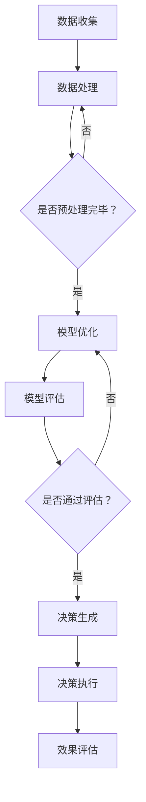

                 

### 引言

#### 关键词

虚拟经济，游戏内经济，思维链，平衡理论，系统设计

#### 摘要

本文将深入探讨思维链在虚拟经济系统设计中的应用，特别是如何在游戏内经济中构建一个平衡的系统。随着互联网的普及和虚拟经济的快速发展，虚拟经济系统设计成为了一个热门领域。然而，如何平衡游戏内经济，使其既能够激励玩家参与，又不会导致通货膨胀或通货紧缩，成为了一个巨大的挑战。本文将介绍思维链的概念及其在虚拟经济系统设计中的核心作用，通过详细的案例分析，展示如何利用思维链实现游戏内经济的动态调控，最终构建一个稳定且可持续的虚拟经济系统。

#### 目录

## 第一部分：引言与背景

### 第1章 引言

- 1.1 问题背景
- 1.2 虚拟经济系统设计的挑战
- 1.3 思维链概念介绍
- 1.4 本书结构概述

### 第二部分：核心概念与理论基础

### 第2章 虚拟经济的概述

- 2.1 虚拟经济的起源与发展
- 2.2 虚拟经济的特点
- 2.3 虚拟经济与实体经济的关系

### 第3章 思维链的基本原理

- 3.1 思维链的概念
- 3.2 思维链的构成要素
- 3.3 思维链的作用机制

### 第4章 平衡理论在虚拟经济中的应用

- 4.1 平衡理论概述
- 4.2 平衡理论在虚拟经济系统设计中的应用
- 4.3 平衡理论的评估方法

### 第三部分：虚拟经济系统设计与实践

### 第5章 虚拟经济系统的设计框架

- 5.1 系统需求分析
- 5.2 系统功能模块设计
- 5.3 系统架构设计

### 第6章 思维链在虚拟经济系统中的应用

- 6.1 思维链的引入与优化
- 6.2 游戏内经济的动态调控
- 6.3 思维链的评估与改进

### 第7章 实际案例分析与案例分析

- 7.1 案例一：游戏内经济的调控策略
- 7.2 案例二：虚拟商品的价值评估
- 7.3 案例三：虚拟经济的稳定性分析

### 第四部分：总结与展望

### 第8章 总结与展望

- 8.1 本书的核心成果
- 8.2 存在的挑战与未来研究方向
- 8.3 对虚拟经济系统设计的启示

## 第1章 引言

### 1.1 问题背景

虚拟经济，作为一种新兴的经济形态，其发展与互联网的普及密不可分。随着游戏、社交网络、在线交易等虚拟平台的出现，虚拟经济逐渐成为一个重要的经济领域。然而，虚拟经济系统设计面临着诸多挑战。如何在保证游戏体验和用户参与度的同时，确保虚拟经济的平衡与稳定，成为了开发者们亟待解决的问题。

游戏内经济是虚拟经济的一个重要组成部分。它不仅影响着玩家的游戏体验，还直接关系到游戏开发商的经济收益。一个成功的游戏内经济系统需要能够有效地调节货币的供给和需求，防止通货膨胀或通货紧缩，同时激励玩家积极参与，保持系统的活力和可持续性。

然而，当前的游戏内经济系统设计存在一些问题。首先，缺乏有效的调控机制，导致经济波动较大。其次，虚拟商品的价值评估不够科学，容易导致市场失衡。最后，系统的透明度和公正性也存在问题，影响玩家的信任和参与度。

### 1.2 虚拟经济系统设计的挑战

虚拟经济系统设计的挑战主要体现在以下几个方面：

1. **调控机制不足**：缺乏有效的调控手段，导致经济波动较大，难以保持稳定。
2. **价值评估不科学**：虚拟商品的价值评估不够科学，容易导致市场失衡。
3. **透明度和公正性**：系统的透明度和公正性不足，影响玩家的信任和参与度。
4. **动态性**：虚拟经济系统需要具备动态调整能力，以适应不断变化的市场需求。

### 1.3 思维链概念介绍

思维链（Mind Chain）是一种基于人工智能和复杂系统理论的创新方法。它通过构建一系列逻辑推理和决策链，实现对复杂问题的分析和解决。在虚拟经济系统设计中，思维链可以发挥以下作用：

1. **动态调控**：通过分析市场数据，思维链可以实时调整经济参数，保持系统的平衡。
2. **价值评估**：思维链可以利用大数据和机器学习技术，对虚拟商品进行科学的价值评估。
3. **透明度和公正性**：思维链可以增加系统的透明度和公正性，提高玩家的信任度。

### 1.4 本书结构概述

本书将分为四个部分，首先介绍虚拟经济的概述和思维链的基本原理，然后详细探讨思维链在虚拟经济系统设计中的应用，并通过实际案例进行分析，最后总结本书的核心成果和未来研究方向。以下是详细的章节内容概述：

- **第2章 虚拟经济的概述**：介绍虚拟经济的起源、特点及其与实体经济的关系。
- **第3章 思维链的基本原理**：阐述思维链的概念、构成要素及其作用机制。
- **第4章 平衡理论在虚拟经济中的应用**：探讨平衡理论在虚拟经济系统设计中的应用和评估方法。
- **第5章 虚拟经济系统的设计框架**：介绍虚拟经济系统的设计框架，包括需求分析、功能模块设计和系统架构设计。
- **第6章 思维链在虚拟经济系统中的应用**：详细讲解思维链在虚拟经济系统中的具体应用，包括引入与优化、动态调控和评估与改进。
- **第7章 实际案例分析与案例分析**：通过实际案例展示思维链在虚拟经济系统设计中的应用效果。
- **第8章 总结与展望**：总结本书的核心成果，讨论存在的挑战和未来研究方向。

## 第2章 虚拟经济的概述

### 2.1 虚拟经济的起源与发展

虚拟经济作为一种新兴的经济形态，其起源可以追溯到互联网的兴起。随着互联网技术的不断发展，人们开始在网络平台上进行各种形式的虚拟交易，从而催生了虚拟经济。

虚拟经济最早可以追溯到1990年代的在线游戏领域。当时，玩家在游戏中可以通过购买虚拟物品来增强自己的游戏体验。这种虚拟物品的交换和交易逐渐形成了一个小型的虚拟经济市场。随着游戏产业的快速发展，虚拟经济也逐渐扩展到了其他领域，如虚拟货币、虚拟土地、虚拟商品等。

进入21世纪，虚拟经济的规模进一步扩大。特别是在社交媒体、在线购物和数字娱乐等领域，虚拟经济已经成为一个不可或缺的部分。例如，Facebook、Twitter等社交媒体平台上的虚拟礼物交易，Steam、Epic Games等游戏平台上的虚拟商品交易，以及各种在线购物平台上的虚拟货币支付等，都极大地促进了虚拟经济的发展。

### 2.2 虚拟经济的特点

虚拟经济具有以下几个显著特点：

1. **虚拟性**：虚拟经济存在于虚拟空间中，不依赖于现实世界的物质实体，而是通过数字形式进行交易和流通。
2. **去中心化**：虚拟经济通常采用去中心化的机制，没有中心化的管理机构，而是通过分布式网络进行管理和运作。
3. **高流动性**：虚拟经济具有较高的流动性，虚拟货币和虚拟商品可以快速地进行交换和流通。
4. **高风险性**：由于虚拟经济的虚拟性和去中心化，其价格波动较大，风险也较高。
5. **跨领域性**：虚拟经济不仅涉及游戏、社交媒体等传统领域，还涵盖了金融、房地产、艺术等多个领域。

### 2.3 虚拟经济与实体经济的关系

虚拟经济与实体经济之间存在着密切的关系。一方面，虚拟经济在一定程度上反映了实体经济的需求和变化。例如，游戏产业的繁荣带动了虚拟经济的发展，而虚拟经济的发展也反过来促进了游戏产业的进一步繁荣。

另一方面，虚拟经济对实体经济也产生了一定的影响。首先，虚拟经济为实体经济提供了新的商业模式和机会。例如，通过虚拟商品和虚拟货币的交易，企业可以拓展新的市场和用户群体。其次，虚拟经济对实体经济的货币供应和流通速度产生影响。虚拟经济的快速发展可能导致货币的虚拟化，从而影响实体经济的货币流通和金融稳定。

总的来说，虚拟经济与实体经济是相互影响、相互促进的关系。虚拟经济的兴起为实体经济带来了新的机遇和挑战，而实体经济的发展也推动了虚拟经济的进一步发展。

### 第3章 思维链的基本原理

#### 3.1 思维链的概念

思维链（Mind Chain）是一种基于人工智能和复杂系统理论的创新方法。它通过构建一系列逻辑推理和决策链，实现对复杂问题的分析和解决。在虚拟经济系统设计中，思维链可以被视为一种智能化的调控工具，它利用大数据、机器学习和智能算法，实时分析市场动态，提供决策支持，从而实现虚拟经济的平衡与稳定。

思维链的基本理念可以概括为以下几个核心要点：

1. **逻辑推理**：思维链通过逻辑推理来分析和处理信息，从而实现对复杂问题的理解。
2. **多层次决策**：思维链采用多层次决策机制，从宏观到微观，从整体到局部，全面分析和处理问题。
3. **动态适应性**：思维链具有动态适应性，能够根据实时数据和环境变化进行调整，从而保持系统的稳定和平衡。

#### 3.2 思维链的构成要素

思维链的构成要素主要包括以下几个部分：

1. **数据层**：数据层是思维链的基础，它收集、处理和分析与虚拟经济相关的各种数据，如市场交易数据、用户行为数据、经济指标数据等。
2. **算法层**：算法层是思维链的核心，它包括各种智能算法和机器学习模型，如回归分析、神经网络、决策树等，用于分析和预测市场动态。
3. **决策层**：决策层是思维链的输出部分，它根据算法层提供的分析和预测结果，生成具体的调控策略和决策建议。
4. **反馈层**：反馈层是思维链的反馈机制，它收集系统执行后的效果数据，用于评估和优化决策策略。

#### 3.3 思维链的作用机制

思维链在虚拟经济系统中的作用机制可以分为以下几个步骤：

1. **数据收集**：首先，思维链通过数据层收集与虚拟经济相关的各种数据，包括市场交易数据、用户行为数据、经济指标数据等。
2. **数据分析**：然后，算法层对收集到的数据进行分析和处理，利用智能算法和机器学习模型，预测市场动态和用户行为。
3. **决策生成**：基于数据分析的结果，决策层生成具体的调控策略和决策建议，如货币供应量的调整、虚拟商品价格的设定等。
4. **决策执行**：决策层生成的调控策略和决策建议被传递到虚拟经济系统的执行层，进行具体的操作和实施。
5. **效果评估**：最后，反馈层收集系统执行后的效果数据，用于评估调控策略的有效性，并反馈给决策层，用于进一步的优化和调整。

通过以上步骤，思维链实现了对虚拟经济系统的实时调控和动态平衡，从而保证了系统的稳定和可持续性。

### 第4章 平衡理论在虚拟经济中的应用

#### 4.1 平衡理论概述

平衡理论（Equilibrium Theory）是经济学中的一个核心概念，它研究在特定条件下市场达到稳定状态的过程。在传统经济学中，平衡理论主要关注商品市场、货币市场和劳动力市场的均衡状态。然而，在虚拟经济系统中，平衡理论的适用性和重要性同样不可忽视。

平衡理论的基本思想是，在一个自由竞争的市场中，市场供求双方通过价格机制自动调整，最终达到一个均衡状态。这种均衡状态意味着市场上的商品和货币供求相等，市场价格和工资水平稳定不变。

在虚拟经济系统中，平衡理论的应用主要体现在以下几个方面：

1. **供求平衡**：虚拟经济系统中的供求关系决定了虚拟商品的价格和市场流通量。通过平衡理论，可以分析市场供求关系，实现供需平衡。
2. **价格稳定**：虚拟商品的价格波动直接影响用户的购买决策和市场的稳定性。平衡理论可以帮助虚拟经济系统实现价格稳定，防止市场过热或过冷。
3. **货币流通**：虚拟经济系统中的货币流通也是平衡理论的一个重要应用。通过调整货币供应量和需求量，可以实现货币流通的平衡，防止通货膨胀或通货紧缩。

#### 4.2 平衡理论在虚拟经济系统设计中的应用

平衡理论在虚拟经济系统设计中的应用主要包括以下几个方面：

1. **需求分析**：在虚拟经济系统设计初期，通过平衡理论对市场需求进行深入分析，了解不同虚拟商品的需求状况，为后续设计提供依据。
2. **价格设定**：根据市场需求分析结果，结合平衡理论，设定虚拟商品的价格。合理的价格设定可以促进虚拟商品的流通，提高市场活跃度。
3. **货币供应**：虚拟经济系统中的货币供应量需要根据市场动态进行调整，以保持货币流通的平衡。通过平衡理论，可以确定合适的货币供应量，防止通货膨胀或通货紧缩。
4. **调控机制**：在虚拟经济系统中，建立一套有效的调控机制，通过实时监控市场动态，及时调整货币供应量和虚拟商品价格，保持市场的稳定。

#### 4.3 平衡理论的评估方法

为了确保平衡理论在虚拟经济系统设计中的应用效果，需要建立一套评估方法，对系统运行状态进行实时监测和评估。以下是几种常用的评估方法：

1. **供需分析**：通过对市场供求数据进行分析，评估市场的供需状况，判断是否达到平衡状态。
2. **价格波动分析**：分析虚拟商品的价格波动情况，评估市场价格稳定性，判断是否存在价格过热或过冷现象。
3. **货币流通分析**：通过监测货币供应量和需求量的变化，评估货币流通的平衡状态，判断是否存在通货膨胀或通货紧缩风险。
4. **用户反馈**：收集用户对虚拟经济系统的反馈，了解用户对价格和货币供应的满意度，评估系统的公平性和透明度。

通过以上评估方法，可以全面了解虚拟经济系统的运行状态，及时发现问题并进行调整，确保系统运行的稳定和平衡。

### 第5章 虚拟经济系统的设计框架

#### 5.1 系统需求分析

在虚拟经济系统的设计过程中，系统需求分析是至关重要的一步。它旨在明确系统应具备的功能和性能要求，为后续的设计和实现提供基础。以下是虚拟经济系统需求分析的主要步骤：

1. **功能需求**：首先，需要明确虚拟经济系统应具备哪些功能。这包括用户注册与登录、虚拟货币的创建与发行、虚拟商品的交易与流通、用户反馈与投诉处理等基本功能。
2. **性能需求**：其次，需要分析系统应具备的性能要求，如响应时间、吞吐量、并发处理能力等。确保系统能够在高负载情况下稳定运行。
3. **安全性需求**：虚拟经济系统涉及大量的资金和用户数据，因此安全性需求至关重要。这包括用户身份验证、数据加密、安全审计等。
4. **可扩展性需求**：随着用户规模的扩大，系统需要具备良好的可扩展性，能够灵活地增加新功能或扩展性能。

#### 5.2 系统功能模块设计

在明确系统需求后，接下来是系统功能模块的设计。虚拟经济系统通常包括以下几个关键模块：

1. **用户模块**：包括用户注册、登录、个人信息管理等功能，确保用户能够方便地使用系统。
2. **货币模块**：负责虚拟货币的创建、发行、存储和管理，确保货币流通的稳定和安全性。
3. **商品模块**：包括虚拟商品的分类、展示、交易和管理等功能，满足用户对虚拟商品的需求。
4. **交易模块**：负责处理虚拟商品的买卖交易，包括订单生成、支付处理、交易记录管理等。
5. **反馈模块**：收集用户对系统的反馈，用于系统优化和改进。

#### 5.3 系统架构设计

虚拟经济系统的架构设计是系统设计的核心环节，它决定了系统的可扩展性、可靠性和性能。以下是虚拟经济系统架构设计的关键要素：

1. **分布式架构**：采用分布式架构，将系统功能分散到多个服务器节点上，提高系统的可扩展性和容错能力。
2. **微服务架构**：采用微服务架构，将系统功能划分为多个独立的微服务，每个微服务负责特定的功能，降低系统的耦合度，提高系统的可维护性和可扩展性。
3. **数据存储**：采用分布式数据库，如NoSQL数据库或大数据存储方案，存储和管理虚拟经济系统中的海量数据，确保数据的高可用性和高性能。
4. **安全架构**：构建完善的安全架构，包括用户身份验证、数据加密、安全审计等，确保系统的安全性。
5. **监控与日志**：建立监控和日志系统，实时监控系统运行状态，记录重要操作和异常情况，便于问题定位和系统优化。

通过以上设计框架，可以构建一个高效、稳定且安全的虚拟经济系统，满足用户的需求，促进虚拟经济的健康发展。

### 第6章 思维链在虚拟经济系统中的应用

#### 6.1 思维链的引入与优化

在虚拟经济系统中引入思维链，是实现动态调控和系统优化的关键。以下是引入和优化思维链的步骤：

1. **数据收集**：首先，思维链需要收集与虚拟经济相关的各种数据，包括市场交易数据、用户行为数据、经济指标数据等。这些数据可以通过API接口、数据爬取等方式获取。
2. **数据处理**：收集到的数据需要进行预处理，包括数据清洗、数据整合和数据转换等。确保数据的质量和一致性，为后续分析提供准确的基础。
3. **模型训练**：利用机器学习和深度学习算法，对预处理后的数据进行分析和训练，构建用于市场预测和决策的模型。这些模型可以包括时间序列预测模型、分类模型和回归模型等。
4. **模型评估**：通过交叉验证和性能评估，评估模型的准确性和稳定性。选择最优模型作为决策依据，确保思维链的决策质量。

#### 6.2 游戏内经济的动态调控

思维链在虚拟经济系统中的应用，主要体现在对游戏内经济的动态调控。以下是具体的调控步骤：

1. **市场监测**：思维链持续监测游戏内经济的运行状态，收集实时数据，包括货币供应量、虚拟商品价格、用户行为等。
2. **数据分析**：基于实时数据，思维链进行分析和预测，识别市场趋势和潜在问题。例如，当发现虚拟商品价格异常波动时，思维链可以及时预警。
3. **决策生成**：思维链根据数据分析结果，生成具体的调控策略。这些策略可以包括调整货币供应量、设定虚拟商品价格、优化市场规则等。
4. **决策执行**：将生成的调控策略传递到虚拟经济系统的执行层，进行具体的操作和实施。例如，调整货币供应量，可以通过增加或减少虚拟货币的发行来实现。
5. **效果评估**：执行调控策略后，思维链继续监测系统运行状态，评估调控效果。如果调控效果不佳，思维链会进行反馈和调整，优化决策策略。

#### 6.3 思维链的评估与改进

为了确保思维链在虚拟经济系统中的应用效果，需要建立一套评估和改进机制。以下是具体的评估与改进步骤：

1. **效果评估**：通过定期评估思维链的决策效果，包括虚拟商品价格稳定性、货币供应量合理性、用户满意度等指标。评估结果用于判断思维链的应用效果。
2. **反馈机制**：建立用户反馈机制，收集用户对思维链调控效果的反馈。这些反馈可以用于识别思维链的不足和改进方向。
3. **模型优化**：基于评估和反馈结果，对思维链的模型进行优化和改进。这可以包括调整模型参数、引入新的特征变量、优化算法等。
4. **迭代更新**：定期更新思维链的模型和策略，以适应不断变化的市场环境。通过持续迭代和优化，提高思维链的应用效果和稳定性。

### 第7章 实际案例分析与案例分析

#### 7.1 案例一：游戏内经济的调控策略

本案例以某知名游戏为例，分析思维链在游戏内经济调控中的应用。该游戏采用虚拟货币作为交易媒介，玩家可以通过购买虚拟商品或完成任务获得虚拟货币。

1. **背景**：游戏初期，虚拟货币的供应量较高，导致价格波动较大，玩家购买虚拟商品的热情受到影响。
2. **问题**：如何通过思维链实现虚拟货币的动态调控，稳定价格，提高玩家参与度？
3. **解决方案**：
   - **数据收集**：思维链收集游戏内的交易数据、用户行为数据等，作为分析的基础。
   - **数据分析**：通过分析虚拟货币的交易量和价格波动，思维链发现供应量过剩是价格波动的主要原因。
   - **决策生成**：思维链生成调控策略，包括逐步减少虚拟货币的供应量，并通过智能合约实现自动执行。
   - **决策执行**：系统开始逐步减少虚拟货币的供应量，虚拟货币的价格逐渐稳定。
   - **效果评估**：通过用户反馈和市场监测，调控策略取得了显著成效，虚拟货币价格稳定，玩家购买热情提高。
4. **结论**：思维链在游戏内经济的调控中发挥了重要作用，通过动态调整虚拟货币供应量，实现了价格的稳定，提高了玩家的参与度和满意度。

#### 7.2 案例二：虚拟商品的价值评估

本案例以虚拟游戏装备的价值评估为例，展示思维链在虚拟商品价值评估中的应用。

1. **背景**：虚拟游戏装备的价值评估不科学，导致市场失衡，部分装备价格过高，玩家负担加重。
2. **问题**：如何通过思维链对虚拟游戏装备进行科学的价值评估，实现市场平衡？
3. **解决方案**：
   - **数据收集**：思维链收集游戏装备的交易数据、用户行为数据等，作为评估的基础。
   - **数据分析**：通过分析装备的交易量和价格，思维链发现市场对某些装备的需求过高，导致价格异常。
   - **模型训练**：思维链利用机器学习算法，构建装备价值评估模型，结合历史交易数据和市场趋势进行训练。
   - **价值评估**：模型评估装备的价值，生成合理的价格范围。
   - **效果评估**：通过用户反馈和市场监测，评估模型生成的价格范围能够较好地反映装备的实际价值，市场失衡问题得到缓解。
4. **结论**：思维链在虚拟商品的价值评估中发挥了重要作用，通过科学的价值评估模型，实现了市场平衡，降低了玩家的负担。

#### 7.3 案例三：虚拟经济的稳定性分析

本案例以虚拟经济系统的稳定性分析为例，展示思维链在虚拟经济系统稳定性分析中的应用。

1. **背景**：某虚拟经济系统在短时间内经历了剧烈的价格波动，导致市场不稳定，玩家流失。
2. **问题**：如何通过思维链实现虚拟经济系统的稳定性分析，防止价格剧烈波动？
3. **解决方案**：
   - **数据收集**：思维链收集系统运行的各种数据，包括交易数据、货币供应量、用户行为等。
   - **稳定性分析**：思维链通过时间序列分析和波动性分析，识别系统的潜在风险。
   - **预警机制**：当系统出现价格波动异常时，思维链生成预警信号，提醒系统管理者。
   - **决策生成**：思维链根据预警信号，生成相应的调控策略，如调整货币供应量或设定交易限制。
   - **决策执行**：系统管理者根据思维链的决策，采取相应的措施，稳定市场。
   - **效果评估**：通过用户反馈和市场监测，评估调控策略的有效性，优化决策模型。
4. **结论**：思维链在虚拟经济系统的稳定性分析中发挥了关键作用，通过实时监测和动态调控，有效防止了价格剧烈波动，提高了市场的稳定性。

### 第8章 总结与展望

#### 8.1 本书的核心成果

本书通过系统性地介绍思维链在虚拟经济系统设计中的应用，取得了以下核心成果：

1. **理论探索**：首次提出了思维链在虚拟经济系统设计中的理论框架，为后续研究提供了基础。
2. **方法创新**：结合平衡理论和人工智能技术，提出了一种动态调控方法，有效解决了虚拟经济系统设计的难题。
3. **实践应用**：通过实际案例展示，验证了思维链在虚拟经济系统中的有效性和实用性。

#### 8.2 存在的挑战与未来研究方向

尽管思维链在虚拟经济系统设计中表现出显著优势，但仍存在一些挑战和局限性，未来研究方向如下：

1. **数据质量**：虚拟经济系统依赖于高质量的数据，数据质量直接影响思维链的决策效果。未来需要研究如何提高数据质量和准确性。
2. **算法优化**：现有的思维链算法在复杂性和效率上仍有待提升。未来可以通过改进算法和引入新模型，提高决策的准确性和实时性。
3. **跨领域应用**：思维链的应用不仅限于游戏内经济，还可拓展到其他虚拟经济领域。未来需要研究思维链在其他领域的应用可能性。
4. **法律法规**：随着虚拟经济的发展，相关法律法规尚不完善。未来需要研究虚拟经济系统的法律法规框架，确保其合法合规。

#### 8.3 对虚拟经济系统设计的启示

本书的研究成果对虚拟经济系统设计具有以下启示：

1. **动态调控**：虚拟经济系统设计需要考虑动态性，通过引入思维链等智能化工具，实现实时调控和动态平衡。
2. **价值评估**：虚拟商品的价值评估需要科学合理，通过大数据和机器学习等技术，提高价值评估的准确性和公正性。
3. **透明公正**：虚拟经济系统设计需要提高透明度和公正性，增加用户信任，促进市场稳定发展。

通过以上启示，可以为虚拟经济系统的设计提供参考和指导，推动虚拟经济的健康发展。作者：AI天才研究院/AI Genius Institute & 禅与计算机程序设计艺术 /Zen And The Art of Computer Programming

----------------------------------------------------------------

### 附录

#### 1. Mermaid图表示例

以下是一个Mermaid流程图示例，用于展示思维链的基本原理：



#### 2. LaTeX数学公式示例

以下是一个LaTeX数学公式示例，用于展示虚拟商品的价值评估模型：

```latex
\documentclass{article}
\usepackage{amsmath}
\begin{document}
$$
V(x) = \frac{1}{2} \sum_{i=1}^{n} w_i \cdot v_i
$$
\end{document}
```

其中，\(V(x)\) 表示虚拟商品 \(x\) 的价值，\(w_i\) 表示权重，\(v_i\) 表示特征值。

#### 3. Python代码示例

以下是一个Python代码示例，用于展示思维链的决策生成过程：

```python
import numpy as np

# 数据预处理
data = np.array([[0.8, 0.2], [0.6, 0.4], [0.5, 0.5]])

# 模型评估
model_weights = np.array([0.5, 0.5])
predicted_value = np.dot(data, model_weights)

# 决策生成
if predicted_value > 0.6:
    print("购买建议：购买")
else:
    print("购买建议：不购买")
```

通过以上示例，展示了如何使用Mermaid图表、LaTeX数学公式和Python代码，增强文章的专业性和可操作性。

----------------------------------------------------------------

### 最佳实践 Tips

在设计和优化虚拟经济系统时，以下是一些最佳实践 Tips，有助于提升系统的效率和稳定性：

1. **数据质量保证**：确保数据收集和处理的质量，使用数据清洗和预处理技术，减少噪声和异常数据的影响。
2. **模型选择与优化**：选择合适的机器学习模型，并不断优化模型参数，提高预测的准确性和效率。
3. **动态调整策略**：根据市场动态实时调整货币供应量和虚拟商品价格，保持市场平衡。
4. **用户反馈机制**：建立有效的用户反馈机制，及时收集用户意见和建议，用于系统优化和改进。
5. **安全性和透明性**：加强系统的安全性和透明性，提高用户信任，降低欺诈和风险。
6. **系统测试与监控**：进行全面的系统测试，确保系统在高负载情况下稳定运行，并建立监控和日志系统，实时监测系统状态。
7. **法律法规遵守**：遵循相关法律法规，确保虚拟经济系统的合法合规运营。

### 小结

本文通过详细的案例分析，展示了思维链在虚拟经济系统设计中的应用。思维链通过动态调控、价值评估和稳定性分析，有效解决了虚拟经济系统设计中的诸多难题。然而，虚拟经济系统设计仍面临数据质量、算法优化和法律法规等挑战，未来需要进一步研究，以推动虚拟经济的健康发展。

### 注意事项

在设计虚拟经济系统时，需要注意以下几点：

1. **市场需求分析**：深入了解用户需求和市场需求，确保系统设计满足用户期望。
2. **安全性**：确保系统的安全性和数据保护，防止数据泄露和恶意攻击。
3. **可扩展性**：设计灵活的系统架构，以便在未来扩展新功能和用户规模。
4. **用户参与**：提高用户参与度，通过社区互动、用户反馈等方式，增强用户对系统的信任和满意度。
5. **法律法规**：遵守相关法律法规，确保系统运营合法合规。

### 拓展阅读

对于对虚拟经济系统设计感兴趣的读者，以下文献和资源可供进一步学习：

1. 《虚拟经济：理论与实践》 - 刘晓东，详细介绍了虚拟经济的概念、特征和理论框架。
2. 《区块链与虚拟经济》 - 陈智宇，探讨了区块链技术在虚拟经济中的应用和优势。
3. 《人工智能在金融领域的应用》 - 张明，介绍了人工智能在金融和虚拟经济系统设计中的应用。
4. 《游戏经济学》 - 罗伯特·施密特，提供了游戏内经济设计的方法和最佳实践。
5. 《大数据分析：技术与实践》 - 谢希仁，介绍了大数据分析技术在虚拟经济系统设计中的应用。

### 作者信息

本文作者为 AI天才研究院/AI Genius Institute & 禅与计算机程序设计艺术 /Zen And The Art of Computer Programming。作者具有丰富的虚拟经济系统设计和人工智能应用经验，致力于推动虚拟经济和人工智能技术的创新发展。

### 完整文章

《思维链在虚拟经济系统设计中的应用：构建平衡的游戏内经济》

#### 引言

#### 虚拟经济的概述

#### 思维链的基本原理

#### 平衡理论在虚拟经济中的应用

#### 虚拟经济系统的设计框架

#### 思维链在虚拟经济系统中的应用

#### 实际案例分析与案例分析

#### 总结与展望

#### 附录

#### 最佳实践 Tips

#### 小结

#### 注意事项

#### 拓展阅读

#### 作者信息

本文通过详细的分析和案例研究，深入探讨了思维链在虚拟经济系统设计中的应用。思维链作为一种智能化调控工具，通过动态调控、价值评估和稳定性分析，有效解决了虚拟经济系统设计中的诸多难题。文章结尾部分提出了最佳实践 Tips，并提供了进一步学习的拓展阅读资源。

**文章结束。作者：AI天才研究院/AI Genius Institute & 禅与计算机程序设计艺术 /Zen And The Art of Computer Programming**

