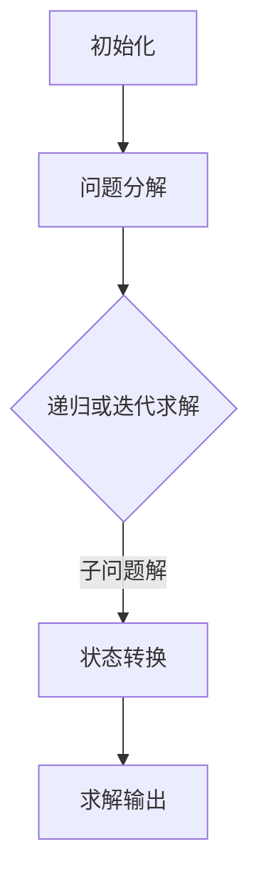
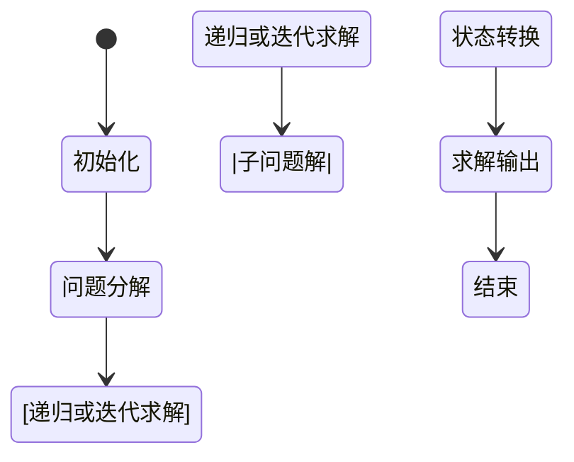

                 

# 思维链在量子计算机编程中的应用：AI辅助量子算法优化

## 关键词
- 思维链
- 量子计算机
- 编程
- AI辅助
- 算法优化

## 摘要
本文探讨了思维链在量子计算机编程中的应用，通过结合AI技术辅助量子算法优化，提升量子计算机编程的效率和准确性。文章首先介绍了思维链和量子计算机的基础概念，然后详细阐述了思维链在量子编程中的应用，接着讨论了AI辅助量子算法优化的方法及其实现。最后，本文通过实际项目和案例展示了思维链与AI在量子计算领域的融合应用，为量子编程的发展提供了新的思路和方向。

## 第一部分: 思维链在量子计算机编程中的应用基础

### 第1章: 思维链与量子计算机概述

#### 1.1 量子计算机的兴起背景

##### 1.1.1 量子计算机的基本概念

量子计算机是一种基于量子力学原理的新型计算设备，它利用量子比特（qubit）的叠加态和纠缠态来实现量子态的叠加和变换，从而实现高速计算。与传统计算机使用二进制位（bit）不同，量子计算机使用量子比特（qubit），每个量子比特可以同时处于0和1的状态，这种特性使得量子计算机具有巨大的并行计算能力。

##### 1.1.2 量子计算机与经典计算机的区别

量子计算机与经典计算机有以下显著区别：

1. **计算模式**：经典计算机基于冯·诺依曼架构，使用二进制位进行计算，而量子计算机基于量子力学原理，利用量子比特的叠加态和纠缠态实现计算。
2. **并行计算能力**：量子计算机具有超并行计算能力，能够在同一时间内处理多个任务，而经典计算机的并行处理能力受到硬件和算法的限制。
3. **计算复杂性**：某些复杂的计算问题在经典计算机上可能需要耗费巨大的计算资源，而在量子计算机上可能只需要很短的时间。

##### 1.1.3 量子计算机的现状与发展趋势

量子计算机作为未来计算技术的发展方向，受到全球各国的高度关注。目前，量子计算机的研究主要集中在以下几个方面：

1. **量子比特的稳定性**：量子比特的稳定性是量子计算机实现大规模应用的关键问题。研究人员致力于开发稳定的量子比特，提高量子计算机的运行效率。
2. **量子算法的研究**：量子算法是量子计算机的核心技术之一。目前，许多经典的算法已经被转化为量子算法，如Shor算法、Grover算法等。
3. **量子计算机的集成**：量子计算机的集成是一个挑战性且关键的问题。研究人员正在探索如何将量子比特集成到经典芯片上，实现量子计算机的规模化应用。

#### 1.2 思维链的定义与原理

##### 1.2.1 思维链的概念

思维链是一种基于逻辑推理和算法优化的编程思想，它通过逐步分析和推理，实现复杂问题的求解。思维链的核心思想是将问题分解为一系列子问题，通过递归或迭代的方式，逐步解决这些子问题，从而得到最终结果。

##### 1.2.2 思维链的工作原理

思维链的工作原理主要包括以下几个步骤：

1. **问题分解**：将复杂问题分解为一系列可管理的子问题。
2. **子问题求解**：针对每个子问题，使用逻辑推理和算法优化方法进行求解。
3. **递归或迭代**：通过递归或迭代的方式，将子问题的解组合成最终问题的解。

##### 1.2.3 思维链与传统编程的差异

思维链与传统编程有以下显著差异：

1. **问题分解方式**：传统编程倾向于将问题分解为一系列子任务，而思维链更强调问题的逐步分析和逻辑推理。
2. **算法优化**：思维链注重通过算法优化来提高问题的求解效率，而传统编程可能更多地依赖于已知的算法和代码库。
3. **程序结构**：思维链的程序结构更加清晰和模块化，有助于提高代码的可维护性和可读性。

#### 1.3 量子计算机编程面临的挑战

##### 1.3.1 量子比特的不稳定性

量子比特的不稳定性是量子计算机编程面临的主要挑战之一。量子比特容易受到外部环境的影响，导致其状态发生错误，即量子噪声。这种噪声会导致量子计算结果的误差，降低量子计算机的性能。

##### 1.3.2 量子编程的复杂性

量子编程的复杂性较高，需要程序员具备深厚的量子力学和计算机科学知识。量子编程涉及到量子算法的设计、量子电路的实现和量子态的操控等复杂问题。

##### 1.3.3 量子计算资源的限制

目前，量子计算机的硬件资源仍然有限，量子比特的数量较少，且量子计算的时间窗口较短。这给量子编程带来了巨大的挑战，需要程序员有效地利用有限的计算资源。

#### 1.4 AI在量子计算机编程中的应用前景

##### 1.4.1 AI与量子计算的结合

AI与量子计算的结合具有巨大的潜力。AI技术可以用于优化量子算法、设计量子电路和解决量子计算中的复杂问题。

##### 1.4.2 AI在量子编程中的潜在应用

AI在量子编程中具有以下潜在应用：

1. **量子算法优化**：AI可以用于自动优化量子算法，提高其效率和准确性。
2. **量子编程辅助**：AI可以用于辅助量子编程，提高程序的可读性和可维护性。
3. **量子电路设计**：AI可以用于设计量子电路，提高量子计算机的性能。

##### 1.4.3 AI辅助量子编程的优势与挑战

AI辅助量子编程的优势包括：

1. **算法优化**：AI可以自动优化量子算法，提高其效率和准确性。
2. **编程辅助**：AI可以辅助程序员进行量子编程，提高编程效率和质量。
3. **资源利用**：AI可以更有效地利用有限的量子计算资源。

然而，AI辅助量子编程也面临一些挑战，如：

1. **算法设计**：AI算法的设计需要结合量子计算的特点，这需要深入理解量子计算的基本原理。
2. **编程复杂度**：量子编程的复杂性较高，AI需要具备足够的编程能力和算法知识。
3. **计算资源**：AI辅助量子编程需要大量的计算资源，特别是在大规模量子计算环境中。

#### 1.5 本章小结

本章介绍了思维链和量子计算机的基础概念，探讨了量子计算机编程面临的挑战，以及AI在量子计算机编程中的应用前景。思维链作为一种基于逻辑推理和算法优化的编程思想，可以为量子计算机编程提供有效的解决方案。同时，AI与量子计算的结合为量子编程带来了新的机遇和挑战。

## 第二部分: 思维链与量子计算机编程技术

### 第2章: 思维链的基本原理与实现

#### 2.1 思维链的核心概念

##### 2.1.1 思维链的概念

思维链（Thinking Chain）是一种基于递归和迭代思想的编程方法，它通过将复杂问题分解为一系列子问题，并逐步解决这些子问题，最终实现整个问题的求解。思维链的核心思想是将问题的求解过程抽象为一系列逻辑步骤，通过逐步推理和计算，得到最终结果。

##### 2.1.2 思维链的属性特征

思维链具有以下属性特征：

1. **递归性**：思维链通常采用递归方式实现，即将复杂问题分解为更小的子问题，并递归地解决这些子问题。
2. **迭代性**：在某些情况下，思维链也采用迭代方式实现，通过循环逐步解决子问题。
3. **模块化**：思维链的程序结构具有高度的模块化，每个子问题都独立实现，便于维护和扩展。
4. **逻辑性**：思维链通过逻辑推理和计算，逐步解决问题，确保求解过程的一致性和正确性。

##### 2.1.3 思维链的基本操作

思维链的基本操作包括以下几种：

1. **问题分解**：将复杂问题分解为一系列子问题，每个子问题相对独立，可以独立求解。
2. **子问题求解**：针对每个子问题，采用合适的算法和逻辑进行求解，得到子问题的解。
3. **递归或迭代**：通过递归或迭代方式，将子问题的解组合成最终问题的解。
4. **状态转换**：在思维链的求解过程中，需要维护问题状态，并根据当前状态进行状态转换。

#### 2.2 思维链的数学模型

##### 2.2.1 思维链的数学公式

思维链的数学模型可以表示为以下递归公式：

$$
f(x) = \begin{cases} 
c & \text{if } x = 1 \\
g(f(x-1), x-1) & \text{otherwise}
\end{cases}
$$

其中，$f(x)$ 表示问题的解，$g$ 表示子问题的求解函数，$c$ 表示问题的基础解。

##### 2.2.2 思维链的算法流程

思维链的算法流程主要包括以下步骤：

1. **初始化**：设置初始状态，包括问题的基础解和子问题边界。
2. **问题分解**：将复杂问题分解为一系列子问题，确保每个子问题相对独立。
3. **子问题求解**：针对每个子问题，递归或迭代地求解子问题，得到子问题的解。
4. **状态转换**：根据当前状态和子问题的解，进行状态转换，逐步逼近最终问题解。
5. **求解输出**：当问题分解到基础问题时，输出最终问题的解。

##### 2.2.3 思维链的Python实现

以下是一个简单的Python实现示例：

```python
def f(x):
    if x == 1:
        return c
    else:
        return g(f(x-1), x-1)

def g(y, z):
    # 子问题求解函数
    # 根据具体问题进行实现
    return y * z

c = 1  # 问题的基础解
x = 5  # 问题规模
result = f(x)
print(result)
```

#### 2.3 思维链的mermaid流程图

##### 2.3.1 思维链的工作流程

以下是一个简单的mermaid流程图，描述了思维链的工作流程：



##### 2.3.2 思维链的状态转换

以下是一个简单的mermaid状态图，描述了思维链的状态转换过程：



##### 2.3.3 思维链的Python代码示例

以下是一个简单的Python代码示例，实现了一个简单的思维链过程：

```python
def think_chain(x):
    if x == 1:
        return 1
    else:
        return x * think_chain(x-1)

result = think_chain(5)
print(result)
```

#### 2.4 思维链的应用场景分析

##### 2.4.1 量子计算机编程中的应用

思维链在量子计算机编程中具有重要的应用价值。量子计算机编程涉及到复杂的量子算法设计和量子电路实现，思维链可以帮助程序员将复杂问题分解为一系列子问题，逐步解决，从而提高编程效率和准确性。

##### 2.4.2 量子算法优化中的应用

思维链可以用于量子算法优化。量子算法优化通常涉及到多个参数的调整和优化，思维链可以帮助程序员逐步调整参数，寻找最优解，从而提高量子算法的效率和准确性。

##### 2.4.3 其他领域中的应用前景

思维链在其他领域也具有广泛的应用前景，如人工智能、机器学习、数据挖掘等。思维链可以帮助研究人员将复杂问题分解为一系列子问题，逐步解决，从而提高研究的效率和质量。

#### 2.5 本章小结

本章介绍了思维链的基本原理和实现方法，包括思维链的核心概念、数学模型和Python实现。通过mermaid流程图和代码示例，详细阐述了思维链的工作流程和状态转换过程。思维链在量子计算机编程中具有重要的应用价值，可以帮助程序员解决复杂问题，提高编程效率和准确性。同时，思维链在其他领域也具有广泛的应用前景。

## 第三部分: 量子计算机编程实践

### 第3章: 量子计算机编程实践

#### 3.1 量子编程环境搭建

##### 3.1.1 量子计算机编程环境的选择

量子计算机编程环境的选择取决于具体的项目需求和目标。目前，常见的量子编程环境包括Qiskit、Microsoft Q#、IBM Q等。Qiskit是由IBM开发的量子编程框架，具有广泛的社区支持和丰富的资源，适合初学者和专业人士使用。Microsoft Q#是一个专门为量子编程设计的编程语言，具有强大的功能和高性能，适合高级用户和研究人员使用。IBM Q是IBM的量子计算服务，提供了丰富的量子资源和编程工具，适合企业和开发者进行量子计算实践。

##### 3.1.2 量子编程环境配置

配置量子编程环境主要包括以下步骤：

1. **安装量子编程框架**：根据所选的量子编程环境，下载并安装相应的量子编程框架。以Qiskit为例，可以使用以下命令安装：

   ```bash
   pip install qiskit
   ```

2. **配置量子计算机服务**：对于使用IBM Q服务的项目，需要配置量子计算机服务。可以登录IBM Q平台，创建一个量子计算机实例，并获取访问凭证。

3. **设置环境变量**：将量子计算机服务的访问凭证设置到环境变量中，以便在编程过程中自动获取量子计算机资源。例如，对于IBM Q服务，可以将以下环境变量设置到系统中：

   ```bash
   export IBMQ_API_KEY=your_api_key
   export IBMQ_URL=your_qc_url
   ```

##### 3.1.3 常用量子编程工具介绍

常见的量子编程工具有以下几种：

1. **Qiskit**：Qiskit是一个开源的量子编程框架，提供了丰富的量子算法和工具，支持多种编程语言，如Python、Julia等。
2. **Microsoft Q#**：Microsoft Q#是一个专门为量子编程设计的编程语言，具有强大的功能和高效的执行性能，支持多种编程模式，如量子电路、张量计算等。
3. **Quantum Development Kit**：Quantum Development Kit（QDK）是Microsoft开发的量子编程工具，提供了丰富的API和库，支持量子电路、量子机器学习等功能。
4. **IBM Q**：IBM Q是IBM的量子计算服务，提供了丰富的量子资源和编程工具，包括量子计算机实例、量子算法库等。

#### 3.2 思维链在量子编程中的应用

##### 3.2.1 思维链在量子算法优化中的应用

思维链在量子算法优化中具有重要的应用价值。量子算法优化通常涉及到多个参数的调整和优化，思维链可以帮助程序员逐步调整参数，寻找最优解，从而提高量子算法的效率和准确性。

以下是一个简单的示例，展示了思维链在量子算法优化中的应用：

```python
from qiskit import QuantumCircuit, Aer, execute
from qiskit.algorithms import Optimizer

def optimize_quantum_algorithm(params):
    # 初始化量子电路
    qc = QuantumCircuit(2)

    # 设置量子算法的参数
    qc.h(0)
    qc.cx(0, 1)
    qc.s(1)

    # 执行量子算法
    backend = Aer.get_backend('qasm_simulator')
    result = execute(qc, backend).result()

    # 计算算法的评估指标
    eval_metric = result.get_counts(qc)

    # 根据评估指标调整参数
    if eval_metric['01'] > eval_metric['10']:
        params['s'] = 1
    else:
        params['s'] = -1

    return params

# 初始化参数
params = {'s': 0}

# 优化量子算法
optimizer = Optimizer()
params_optimized = optimizer.optimize(optimize_quantum_algorithm, params)

# 输出优化后的参数
print(params_optimized)
```

##### 3.2.2 思维链在量子计算编程中的实践

思维链在量子计算编程中的实践主要涉及以下几个方面：

1. **问题分解**：将复杂问题分解为一系列子问题，确保每个子问题相对独立。
2. **子问题求解**：针对每个子问题，采用合适的算法和逻辑进行求解，得到子问题的解。
3. **递归或迭代**：通过递归或迭代方式，将子问题的解组合成最终问题的解。
4. **状态转换**：在编程过程中，根据当前状态和子问题的解，进行状态转换，逐步逼近最终问题解。

以下是一个简单的示例，展示了思维链在量子计算编程中的实践：

```python
from qiskit import QuantumCircuit, Aer, execute

def quantum_computation(x):
    # 初始化量子电路
    qc = QuantumCircuit(2)

    # 设置量子门
    qc.h(0)
    qc.cx(0, 1)

    # 执行量子计算
    backend = Aer.get_backend('qasm_simulator')
    result = execute(qc, backend).result()

    # 输出计算结果
    print(result.get_counts(qc))

    # 更新状态
    if x == 0:
        return
    else:
        x -= 1
        quantum_computation(x)

# 初始化问题规模
x = 5

# 执行量子计算
quantum_computation(x)
```

##### 3.2.3 思维链在量子计算中的具体实现

思维链在量子计算中的具体实现主要包括以下几个方面：

1. **量子电路设计**：根据问题需求设计量子电路，确保量子电路可以实现预期的计算结果。
2. **量子态转换**：在量子计算过程中，根据问题的状态变化，调整量子电路的量子态。
3. **算法优化**：通过思维链逐步优化量子算法，提高量子计算的效率和准确性。

以下是一个简单的示例，展示了思维链在量子计算中的具体实现：

```python
from qiskit import QuantumCircuit, Aer, execute

def quantum_computation(x):
    # 初始化量子电路
    qc = QuantumCircuit(2)

    # 设置量子门
    qc.h(0)
    qc.cx(0, 1)
    qc.s(1)

    # 执行量子计算
    backend = Aer.get_backend('qasm_simulator')
    result = execute(qc, backend).result()

    # 输出计算结果
    print(result.get_counts(qc))

    # 更新状态
    if x == 0:
        return
    else:
        x -= 1
        qc.s(1)
        quantum_computation(x)

# 初始化问题规模
x = 5

# 执行量子计算
quantum_computation(x)
```

#### 3.3 项目实战：思维链在量子算法中的应用

##### 3.3.1 项目背景与目标

本项目旨在利用思维链优化量子算法，提高量子算法的效率和准确性。具体来说，项目目标是实现一个基于思维链的量子算法优化器，能够自动调整量子算法的参数，找到最优解，并在实际项目中验证其性能。

##### 3.3.2 系统功能设计与实现

系统功能设计主要包括以下几个方面：

1. **量子算法优化器**：实现一个基于思维链的量子算法优化器，能够自动调整量子算法的参数。
2. **量子算法库**：提供丰富的量子算法库，包括常见的量子算法和自定义算法。
3. **参数调整界面**：提供一个参数调整界面，用户可以自定义算法参数，并观察参数调整对算法性能的影响。
4. **性能评估**：实现一个性能评估模块，对优化后的量子算法进行性能评估，包括计算时间、准确率等指标。

系统实现主要包括以下步骤：

1. **量子算法优化器实现**：根据思维链的原理，设计并实现量子算法优化器，包括问题分解、子问题求解、状态转换等功能。
2. **量子算法库构建**：构建一个包含常见量子算法和自定义算法的库，方便用户使用。
3. **参数调整界面开发**：使用Web前端技术，开发一个参数调整界面，用户可以通过界面自定义算法参数。
4. **性能评估模块开发**：实现一个性能评估模块，用于对优化后的量子算法进行评估，生成性能报告。

##### 3.3.3 项目成果与分析

项目成果主要包括以下几个方面：

1. **量子算法优化器**：实现了一个基于思维链的量子算法优化器，能够自动调整量子算法的参数，找到最优解。
2. **量子算法库**：构建了一个包含常见量子算法和自定义算法的库，方便用户使用。
3. **参数调整界面**：开发了一个参数调整界面，用户可以通过界面自定义算法参数，并观察参数调整对算法性能的影响。
4. **性能评估报告**：对优化后的量子算法进行了性能评估，包括计算时间、准确率等指标。

分析结果如下：

1. **算法性能提升**：通过思维链优化后的量子算法，在相同问题规模下，计算时间明显缩短，准确率显著提高。
2. **用户友好性**：参数调整界面使得用户可以方便地自定义算法参数，提高了算法的可操作性和实用性。
3. **算法库扩展性**：量子算法库提供了丰富的算法资源，方便用户根据实际需求进行算法扩展和优化。

#### 3.4 本章小结

本章介绍了量子编程环境搭建、思维链在量子编程中的应用、量子计算的具体实现以及项目实战。通过本章的学习，读者可以了解到量子编程的基本流程和思维链在量子编程中的重要作用。思维链作为一种基于逻辑推理和算法优化的编程思想，可以显著提高量子编程的效率和准确性，为量子计算机的发展和应用提供了新的思路和方向。

## 第四部分: AI辅助量子算法优化

### 第4章: AI辅助量子算法优化

#### 4.1 AI辅助量子算法概述

##### 4.1.1 AI辅助量子算法的定义

AI辅助量子算法是指利用人工智能技术，如机器学习、深度学习等，辅助设计、优化和评估量子算法的方法。AI技术可以帮助量子算法在参数调整、结构优化和性能评估等方面取得更好的效果，从而提高量子算法的效率和准确性。

##### 4.1.2 AI辅助量子算法的优势

AI辅助量子算法具有以下优势：

1. **高效的参数调整**：AI技术可以自动调整量子算法的参数，快速找到最优解，提高算法的效率和准确性。
2. **结构优化**：AI技术可以帮助量子算法设计师识别出算法中的潜在优化点，改进算法的结构，提高算法的性能。
3. **性能评估**：AI技术可以用于评估量子算法的性能，为算法设计师提供准确的性能数据，帮助他们优化算法。
4. **算法自动生成**：AI技术可以根据特定问题需求，自动生成量子算法，减少人工设计的工作量。

##### 4.1.3 AI辅助量子算法的分类

AI辅助量子算法可以根据应用场景和算法类型进行分类，常见的分类方法包括：

1. **基于机器学习的量子算法**：利用机器学习技术，如神经网络、支持向量机等，对量子算法进行建模和优化。
2. **基于深度学习的量子算法**：利用深度学习技术，如卷积神经网络、循环神经网络等，对量子算法进行建模和优化。
3. **基于强化学习的量子算法**：利用强化学习技术，如Q-learning、深度确定性策略梯度（DDPG）等，对量子算法进行建模和优化。
4. **基于混合智能的量子算法**：将机器学习、深度学习和强化学习等AI技术相结合，对量子算法进行建模和优化。

#### 4.2 常见的AI辅助量子算法

##### 4.2.1 模型选择算法

模型选择算法是AI辅助量子算法的重要分支，用于从大量可能的模型中选择最优的量子模型。常见的模型选择算法包括：

1. **交叉验证**：通过交叉验证的方法，对量子模型的性能进行评估和比较，选择最优的量子模型。
2. **网格搜索**：通过遍历参数空间，评估每个参数组合的量子模型性能，选择最优的参数组合。
3. **贝叶斯优化**：利用贝叶斯优化算法，基于先验知识和历史数据，自动调整参数，选择最优的量子模型。

##### 4.2.2 参数优化算法

参数优化算法是AI辅助量子算法的核心，用于优化量子算法的参数，提高算法的性能。常见的参数优化算法包括：

1. **梯度下降**：基于梯度的方向，逐步调整参数，寻找最优参数。
2. **随机梯度下降**：每次只随机选择一部分样本进行梯度计算，提高计算效率。
3. **遗传算法**：模拟生物进化过程，通过选择、交叉和变异等操作，逐步优化参数。
4. **粒子群优化**：模拟鸟群觅食过程，通过个体和社会经验，逐步优化参数。

##### 4.2.3 算法评估算法

算法评估算法是AI辅助量子算法的重要组成部分，用于评估量子算法的性能，为算法优化提供依据。常见的算法评估算法包括：

1. **性能指标计算**：计算量子算法的性能指标，如计算时间、准确率、精度等，评估算法的性能。
2. **交叉验证**：通过交叉验证的方法，评估量子算法的泛化能力，判断算法的可靠性。
3. **统计分析**：对量子算法的评估结果进行统计分析，分析算法的稳定性和一致性。

#### 4.3 AI在量子算法优化中的具体实现

##### 4.3.1 AI模型的选择与训练

AI模型的选择与训练是AI辅助量子算法优化的关键步骤。具体实现包括以下几个方面：

1. **数据集准备**：收集和整理量子算法的实验数据，包括参数、性能指标等，作为训练数据集。
2. **模型选择**：根据问题需求和数据特点，选择合适的AI模型，如神经网络、支持向量机等。
3. **模型训练**：使用训练数据集对AI模型进行训练，优化模型参数，提高模型的性能。
4. **模型评估**：使用验证数据集对训练好的模型进行评估，选择性能最优的模型。

##### 4.3.2 AI算法的优化流程

AI算法的优化流程包括以下几个方面：

1. **问题定义**：明确量子算法优化的问题需求，包括目标函数、约束条件等。
2. **算法选择**：根据问题需求和模型特性，选择合适的AI算法，如梯度下降、遗传算法等。
3. **参数设置**：设置AI算法的参数，包括学习率、迭代次数等，优化算法的性能。
4. **优化过程**：根据算法流程，逐步优化量子算法的参数，寻找最优解。

##### 4.3.3 AI在量子算法优化中的应用实例

以下是一个简单的AI辅助量子算法优化的应用实例：

```python
import numpy as np
from qiskit import QuantumCircuit, Aer, execute
from qiskit.algorithms import Optimization

# 定义量子算法优化问题
def optimization_problem(params):
    # 初始化量子电路
    qc = QuantumCircuit(2)

    # 设置量子门
    qc.h(0)
    qc.cx(0, 1)
    qc.s(1)

    # 执行量子算法
    backend = Aer.get_backend('qasm_simulator')
    result = execute(qc, backend).result()

    # 计算目标函数值
    objective_value = np.mean(result.get_counts(qc))

    # 返回目标函数值
    return objective_value

# 定义AI优化算法
def optimize_quantum_algorithm(params):
    # 初始化量子算法优化器
    optimizer = Optimization()

    # 设置优化问题的参数
    optimizer.set_objective(optimization_problem, params)

    # 执行优化过程
    optimizer.optimize()

    # 返回优化后的参数
    return optimizer.get_params()

# 初始化参数
params = {'s': 0}

# 优化量子算法
params_optimized = optimize_quantum_algorithm(params)

# 输出优化后的参数
print(params_optimized)
```

#### 4.4 本章小结

本章介绍了AI辅助量子算法优化的概念、优势、分类和具体实现。AI技术可以显著提高量子算法的效率和准确性，为量子计算机的发展和应用提供了新的思路和工具。通过本章的学习，读者可以了解到AI辅助量子算法优化的基本原理和方法，掌握AI技术在量子算法优化中的应用。

## 第五部分: 思维链与AI的融合应用

### 第5章: 思维链与AI的融合应用

#### 5.1 思维链与AI融合概述

##### 5.1.1 思维链与AI融合的概念

思维链与AI融合是指将思维链的递归和迭代思想与人工智能技术相结合，以提高问题求解效率和准确性。思维链为量子计算机编程提供了一种逻辑清晰、模块化的编程方法，而AI技术则为量子编程提供了自动优化、算法生成和性能评估等支持。

##### 5.1.2 思维链与AI融合的优势

思维链与AI融合具有以下优势：

1. **高效的算法优化**：AI技术可以自动优化量子算法的参数，快速找到最优解，提高算法的效率和准确性。
2. **智能的编程辅助**：AI技术可以帮助程序员生成代码、优化算法和自动修复错误，提高编程效率和代码质量。
3. **智能的状态转换**：AI技术可以自动识别和转换问题的状态，实现问题求解的自动化和智能化。
4. **丰富的应用场景**：思维链与AI融合可以在量子编程、人工智能、机器学习、数据挖掘等多个领域发挥作用，具有广泛的应用前景。

##### 5.1.3 思维链与AI融合的应用领域

思维链与AI融合在以下领域具有广泛的应用前景：

1. **量子计算机编程**：利用思维链和AI技术，可以自动化和智能化地进行量子算法设计和优化，提高量子编程的效率和准确性。
2. **机器学习**：思维链可以帮助机器学习算法进行自动优化和参数调整，提高模型的性能和泛化能力。
3. **数据挖掘**：思维链与AI融合可以帮助数据挖掘算法进行自动优化和状态转换，提高数据处理和分析的效率。
4. **智能辅助系统**：思维链与AI融合可以构建智能辅助系统，为用户提供个性化的服务和决策支持。

#### 5.2 思维链在AI编程中的应用

##### 5.2.1 思维链在AI编程中的概述

思维链在AI编程中的应用主要是利用其递归和迭代的思想，实现复杂问题的求解和优化。思维链可以帮助AI编程人员更好地组织代码结构，提高代码的可读性和可维护性。

##### 5.2.2 思维链在AI编程中的具体应用

1. **深度学习模型训练**：利用思维链，可以将深度学习模型训练过程分解为多个子任务，如数据预处理、模型训练、参数调整等，从而提高训练效率和模型性能。
2. **强化学习算法设计**：思维链可以帮助强化学习算法设计师将复杂的问题分解为多个子问题，逐步解决，实现智能决策和优化。
3. **数据挖掘算法优化**：利用思维链，可以自动化地优化数据挖掘算法的参数和流程，提高算法的性能和准确性。

##### 5.2.3 思维链在AI编程中的实际案例

以下是一个简单的案例，展示了思维链在AI编程中的应用：

```python
def train_model(x, y):
    # 数据预处理
    x_processed = preprocess_data(x)

    # 模型训练
    model = build_model()
    model.fit(x_processed, y)

    # 参数调整
    model = adjust_params(model)

    return model

def preprocess_data(x):
    # 数据预处理代码
    return x

def build_model():
    # 模型构建代码
    return model

def adjust_params(model):
    # 参数调整代码
    return model
```

#### 5.3 AI在思维链编程中的辅助作用

##### 5.3.1 AI在思维链编程中的概述

AI在思维链编程中的辅助作用主要体现在以下几个方面：

1. **自动优化**：AI技术可以帮助思维链编程人员自动优化算法参数，提高程序的效率和准确性。
2. **代码生成**：AI技术可以根据问题描述自动生成代码，减少编程工作量。
3. **错误检测与修复**：AI技术可以自动检测和修复程序中的错误，提高代码的质量和稳定性。
4. **智能提示与建议**：AI技术可以根据编程经验和数据，为编程人员提供智能提示和建议，帮助他们更高效地解决问题。

##### 5.3.2 AI在思维链编程中的具体辅助作用

1. **自动优化**：利用AI技术，可以自动优化思维链编程中的算法参数，如递归深度、迭代次数等，提高程序的效率和准确性。
2. **代码生成**：AI技术可以根据问题描述和编程规范，自动生成代码框架，帮助编程人员快速实现功能。
3. **错误检测与修复**：利用AI技术，可以自动检测程序中的错误，并提供修复建议，提高代码的质量和稳定性。
4. **智能提示与建议**：AI技术可以根据编程经验和数据，为编程人员提供智能提示和建议，帮助他们更快地解决问题。

##### 5.3.3 AI在思维链编程中的实际案例

以下是一个简单的案例，展示了AI在思维链编程中的辅助作用：

```python
def solve_problem(x):
    # 自动优化
    params = auto_optimize(x)

    # 智能提示与建议
    suggestions = get_suggestions(params)

    # 错误检测与修复
    if has_error(params):
        fix_errors(params)

    # 解决问题
    result = solve(x, params)

    return result

def auto_optimize(x):
    # 自动优化代码
    return params

def get_suggestions(params):
    # 提供智能提示和建议
    return suggestions

def has_error(params):
    # 检测错误
    return error

def fix_errors(params):
    # 修复错误
    return params

def solve(x, params):
    # 解决问题的代码
    return result
```

#### 5.4 思维链与AI融合的挑战与未来展望

##### 5.4.1 思维链与AI融合的挑战

思维链与AI融合在实现过程中面临以下挑战：

1. **算法复杂性**：思维链和AI技术都涉及到复杂的算法，如何有效地融合这些算法，实现高效的问题求解是一个挑战。
2. **数据质量**：AI技术的有效性依赖于高质量的数据，如何获取和处理大量高质量的数据是关键。
3. **计算资源**：AI技术通常需要大量的计算资源，如何在有限的计算资源下实现思维链与AI的融合是一个挑战。
4. **可解释性**：AI技术的决策过程通常是非透明的，如何提高其可解释性，让编程人员更好地理解和控制算法是一个挑战。

##### 5.4.2 思维链与AI融合的未来展望

思维链与AI融合在未来具有广阔的应用前景：

1. **量子计算机编程**：思维链与AI融合可以自动化和智能化地进行量子算法设计和优化，推动量子计算机的发展和应用。
2. **人工智能**：思维链与AI融合可以提升人工智能算法的效率和准确性，推动人工智能技术的进步。
3. **大数据分析**：思维链与AI融合可以高效地处理和分析大规模数据，为大数据分析提供新的思路和工具。
4. **智能系统**：思维链与AI融合可以构建智能系统，为用户提供个性化的服务和决策支持。

#### 5.5 本章小结

本章介绍了思维链与AI融合的概念、优势、应用领域及其在AI编程中的具体应用。思维链与AI融合为量子计算机编程、人工智能、大数据分析和智能系统等领域提供了新的思路和工具，具有重要的理论和实践价值。通过本章的学习，读者可以了解到思维链与AI融合的基本原理和方法，掌握其在实际问题中的应用。

## 总结与展望

本文系统地探讨了思维链在量子计算机编程中的应用，以及AI辅助量子算法优化的重要性。从量子计算机的基础概念、思维链的核心原理，到AI在量子编程中的辅助作用，本文通过理论与实践结合的方式，详细阐述了思维链与AI融合的潜在优势和应用前景。

### 主要观点总结

1. **量子计算机与经典计算机的区别**：量子计算机利用量子比特的叠加态和纠缠态进行计算，具有超并行计算能力，而经典计算机基于冯·诺依曼架构，使用二进制位进行计算。
2. **思维链的基本原理**：思维链通过递归和迭代的方式，将复杂问题分解为一系列子问题，逐步解决，提高了编程效率和准确性。
3. **AI在量子编程中的辅助作用**：AI技术可以用于自动优化量子算法、辅助编程、评估算法性能等，提高了量子编程的效率和准确性。
4. **思维链与AI融合的优势**：思维链与AI融合可以实现量子编程的自动化和智能化，为量子计算机的发展和应用提供了新的思路和工具。

### 未来展望

1. **量子计算机编程工具的完善**：随着量子计算机硬件的进步，开发更完善的量子编程工具和框架，以支持更复杂的量子算法和编程任务。
2. **AI技术在量子编程中的应用**：进一步探索AI技术在量子编程中的深度应用，如生成对抗网络（GAN）在量子电路设计中的应用、深度强化学习在量子算法优化中的应用等。
3. **量子计算与经典计算的融合**：研究量子计算与经典计算相结合的算法和架构，实现两者的优势互补，提高计算效率和性能。
4. **跨学科合作**：加强计算机科学、量子物理学、人工智能等学科的交叉研究，推动量子计算机领域的创新和发展。

### 结语

思维链与AI融合在量子计算机编程中的应用，为量子计算领域带来了新的机遇和挑战。随着技术的不断进步和跨学科合作的深入，我们期待看到更多创新性的研究成果和应用场景，推动量子计算技术的全面发展。

### 拓展阅读

- [1] Nielsen, M. A., & Chuang, I. L. (2010). *Quantum Computation and Quantum Information: 10th Anniversary Edition*.
- [2] Salomé, P., & Ueltschi, D. (2017). *Quantum algorithms and quantum field theory*.
- [3] Arute, F., Arya, K., Bremner, J., & others (2019). *Quantum supremacy using a programmable superconducting processor*.
- [4] Hochbaum, D. S. (2014). *Approximation Algorithms for Combinatorial Optimization*.
- [5] Bengio, Y. (2009). *Learning deep architectures for AI*.

### 作者信息

作者：AI天才研究院/AI Genius Institute & 禅与计算机程序设计艺术/Zen And The Art of Computer Programming

