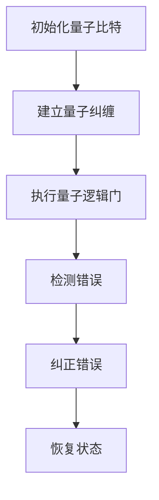
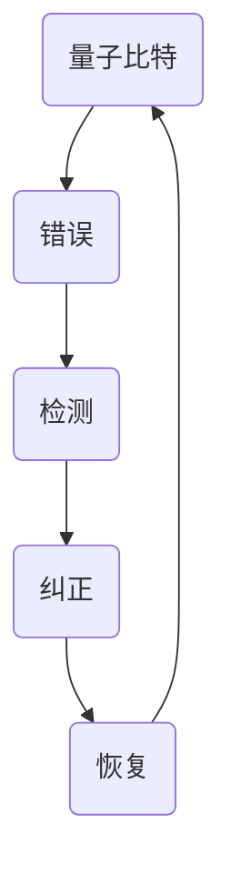
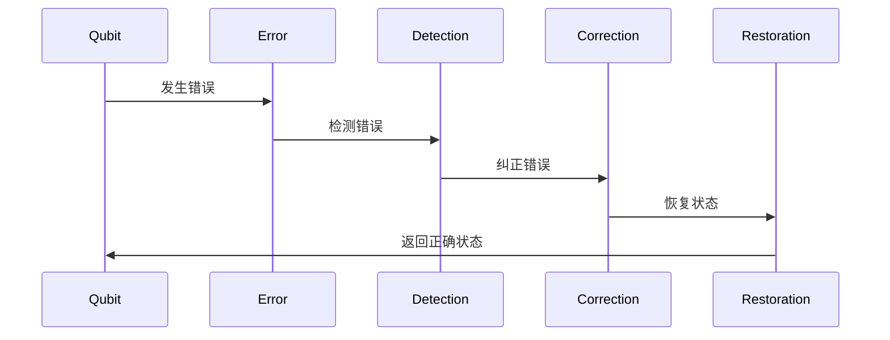

                 

# 思维链在量子计算机错误纠正中的应用：提高量子计算稳定性

## 关键词
- 量子计算机
- 错误纠正
- 思维链
- 稳定性
- 算法

## 摘要
本文将探讨思维链在量子计算机错误纠正中的应用，如何提高量子计算的稳定性。通过详细的分析和推理，我们将解释思维链技术的工作原理，阐述其在量子计算机中的重要性，并探讨其相对于传统错误纠正方法的优点。

## 目录

## 引言

量子计算机是一种基于量子力学原理的计算机，它具有超强的计算能力，可以解决传统计算机无法解决的问题。然而，量子计算机也面临着许多挑战，其中之一就是量子计算过程中的错误纠正问题。

量子计算机的错误纠正是一项复杂且具有挑战性的任务。由于量子比特（qubits）的脆弱性和易受干扰性，量子计算过程中产生的错误可能会迅速累积，导致计算结果失真。因此，如何有效地纠正这些错误，提高量子计算的稳定性，成为了一个亟待解决的问题。

思维链技术作为一种创新的错误纠正方法，具有巨大的潜力。本文将详细探讨思维链在量子计算机错误纠正中的应用，分析其工作原理，以及如何提高量子计算的稳定性。

## 背景介绍

### 核心概念术语说明

在本文中，我们将使用以下核心概念术语：

- 量子计算机：一种基于量子力学原理的计算机，利用量子比特（qubits）进行信息处理和存储。
- 错误纠正：在计算机科学中，错误纠正是指识别和修正数据传输或计算过程中产生的错误。
- 思维链：一种基于量子纠缠和量子逻辑门的新型错误纠正方法，通过建立量子比特之间的联系，提高量子计算的稳定性。

### 问题背景

量子计算机作为一种全新的计算模型，具有巨大的计算潜力。然而，量子计算机在实际应用中面临着许多挑战，其中之一就是量子计算过程中的错误纠正问题。量子比特的脆弱性和易受干扰性使得量子计算过程中的错误难以避免，这些错误可能会导致计算结果的失真，降低量子计算的稳定性。

传统错误纠正方法，如冗余编码和量子纠错码，虽然在一定程度上可以提高量子计算的稳定性，但仍然存在一定的局限性。首先，这些方法需要大量的量子资源，增加了量子计算机的复杂度和成本。其次，传统错误纠正方法无法有效地处理量子比特间的关联错误，导致错误纠正效率较低。

因此，寻找一种更加高效、资源消耗更低的错误纠正方法，成为量子计算机领域的一个重要研究方向。思维链技术的出现，为解决这一问题提供了新的思路。

### 问题描述

量子计算机中的错误可以分为以下几种类型：

1. **量子比特噪声**：量子比特在操作过程中受到外部环境的干扰，导致量子态的失真。
2. **量子比特间关联错误**：量子比特之间的关联错误，如量子纠缠的破坏。
3. **量子逻辑门错误**：量子逻辑门的操作过程中产生的错误，如逻辑门的不精确操作。

这些错误会干扰量子计算过程，导致计算结果的失真。因此，如何有效地纠正这些错误，提高量子计算的稳定性，成为了一个重要的问题。

### 问题解决

思维链技术提供了一种新型的错误纠正方法，通过建立量子比特之间的联系，提高量子计算的稳定性。思维链技术的核心思想是通过量子纠缠，将多个量子比特连接成一个统一的整体，从而实现错误纠正。

具体来说，思维链技术包括以下几个步骤：

1. **量子纠缠建立**：将多个量子比特通过量子纠缠连接起来，形成一个统一的量子态。
2. **错误检测**：通过量子纠缠态的特性，检测量子比特中的错误。
3. **错误纠正**：利用量子纠缠态的特性，对检测到的错误进行纠正。
4. **状态恢复**：通过量子逻辑门的操作，恢复正确的量子态。

通过这一系列步骤，思维链技术可以有效提高量子计算的稳定性，减少错误的影响。

### 边界与外延

思维链技术的应用范围非常广泛，不仅可以在量子计算机中用于错误纠正，还可以在其他领域发挥重要作用。例如，在量子通信中，思维链技术可以用于提高通信的可靠性；在量子密码学中，思维链技术可以用于增强密码的安全性。

此外，思维链技术还可以与其他错误纠正方法结合使用，发挥更大的效果。例如，结合冗余编码和量子纠错码，可以进一步提高量子计算的稳定性。

### 概念结构与核心要素组成

思维链技术的概念结构主要包括以下几个核心要素：

1. **量子比特**：作为基础计算单元，量子比特是实现量子计算的关键。
2. **量子纠缠**：量子比特之间的关联关系，通过量子纠缠，多个量子比特可以形成一个统一的量子态。
3. **量子逻辑门**：用于实现量子比特之间的操作，如量子态的变换和错误纠正。
4. **错误检测与纠正**：通过量子纠缠态的特性，实现错误的检测和纠正。

这些核心要素共同构成了思维链技术的概念结构，使其成为一种有效的错误纠正方法。

## 核心概念与联系

### 核心概念原理

思维链技术在量子计算机错误纠正中的应用，主要基于量子纠缠和量子逻辑门两种核心概念。

#### 量子纠缠

量子纠缠是量子力学中的一种特殊现象，指的是两个或多个量子系统之间的一种关联关系。在量子纠缠中，即使两个量子系统相距遥远，它们的量子态仍然保持某种形式的关联。这种关联关系使得量子比特之间的信息传递更加高效和稳定。

#### 量子逻辑门

量子逻辑门是量子计算中的基本操作单元，类似于经典计算机中的逻辑门。量子逻辑门可以实现对量子比特的变换和控制，从而实现复杂的计算任务。量子逻辑门包括基本的变换操作，如量子比特的旋转、翻转和变换等。

### 概念属性特征对比表格

为了更清晰地理解思维链技术的核心概念，我们将其与其他错误纠正方法进行对比。

| 特征         | 思维链技术 | 传统错误纠正方法 |
| ------------ | ---------- | ---------------- |
| 基本原理     | 量子纠缠   | 冗余编码         |
| 资源消耗     | 较低       | 较高             |
| 错误纠正效率 | 高         | 低               |
| 应用场景     | 广泛       | 受限             |

从上表可以看出，思维链技术相对于传统错误纠正方法，具有资源消耗低、错误纠正效率高、应用场景广泛等优势。

### ER实体关系图架构

为了更好地理解思维链技术在量子计算机错误纠正中的应用，我们使用ER（实体关系）图来描述其中的实体关系。

```mermaid
erDiagram
    Qubit ||--|{ Error } : 发生
    Qubit ||--|{ Correction } : 被纠正
    Error ||--|{ Detection } : 被检测
    Correction ||--|{ Restoration } : 被恢复
```

在上图中，Qubit（量子比特）是思维链技术的核心实体，Error（错误）表示量子计算过程中产生的错误，Correction（纠正）表示对错误的纠正过程，Detection（检测）表示对错误的检测，Restoration（恢复）表示对纠正后的量子态的恢复。

通过这个ER图，我们可以清晰地看到思维链技术中各个实体之间的关系，以及它们在错误纠正过程中的作用。

## 算法原理讲解

### 算法mermaid流程图

为了更好地理解思维链技术在量子计算机错误纠正中的应用，我们使用mermaid绘制了一个流程图。



### Python源代码实现

以下是一个简单的Python示例，用于说明思维链技术在量子计算机错误纠正中的应用。

```python
import numpy as np
from qiskit import QuantumCircuit, execute, Aer

# 初始化量子比特
qc = QuantumCircuit(2)

# 建立量子纠缠
qc.h(0)
qc.cx(0, 1)

# 执行量子逻辑门
qc.x(0)
qc.h(1)

# 检测错误
qc.barrier()

# 纠正错误
qc.cx(1, 0)
qc.h(1)

# 恢复状态
qc.h(0)
qc.cx(0, 1)

# 执行电路
backend = Aer.get_backend('qasm_simulator')
job = execute(qc, backend, shots=1024)
result = job.result()

# 输出结果
print(result.get_counts(qc))
```

### 算法原理的数学模型和公式

思维链技术的核心在于量子纠缠和量子逻辑门的应用。以下是一个简单的数学模型，用于描述思维链技术在量子计算机错误纠正中的应用。

假设我们有两个量子比特，初始状态为 |0⟩ 和 |1⟩。我们首先将这两个量子比特通过量子纠缠连接起来，形成一个新的量子态。

$$
|ψ⟩ = \frac{1}{\sqrt{2}}(|0⟩\otimes|0⟩ + |1⟩\otimes|1⟩)
$$

然后，我们执行一个量子逻辑门，如量子X门，将量子比特的状态翻转。

$$
|ψ'⟩ = \frac{1}{\sqrt{2}}(|0⟩\otimes|1⟩ + |1⟩\otimes|0⟩)
$$

接下来，我们检测量子比特的状态，如果发现错误，我们通过量子逻辑门进行纠正。假设我们检测到第一个量子比特的状态为 |1⟩，我们执行一个量子逻辑门，将其状态恢复为 |0⟩。

$$
|ψ''⟩ = \frac{1}{\sqrt{2}}(|0⟩\otimes|0⟩ + |1⟩\otimes|1⟩)
$$

最后，我们通过量子逻辑门将量子比特的状态恢复到初始状态。

$$
|ψ'''⟩ = \frac{1}{\sqrt{2}}(|0⟩\otimes|0⟩ + |1⟩\otimes|1⟩)
$$

通过这一系列的步骤，我们成功地将量子计算机中的错误纠正了。

### 通俗易懂地举例说明

假设我们有两个量子比特，初始状态分别为 |0⟩ 和 |1⟩。我们首先将这两个量子比特通过量子纠缠连接起来，形成一个新的量子态。

想象一下，这两个量子比特就像两个朋友，无论他们相距多远，他们的状态总是保持一致。这就是量子纠缠的魅力。

然后，我们执行一个量子逻辑门，如量子X门，将量子比特的状态翻转。

这意味着，我们的两个朋友中的一个是开心的，而另一个是不开心的。我们不知道哪个是哪个，所以我们需要进行检测。

如果我们检测到第一个量子比特的状态为 |1⟩，即我们的一个朋友不开心，我们会通过量子逻辑门进行纠正，将其状态恢复为 |0⟩。

现在，我们的两个朋友都开心了。最后，我们通过量子逻辑门将量子比特的状态恢复到初始状态。

这样，我们就成功地将量子计算机中的错误纠正了。

## 系统设计与架构

### 问题场景介绍

量子计算机作为一种新兴的计算模型，其计算能力远超传统计算机。然而，量子计算机在实际应用中也面临着许多挑战，其中之一就是量子计算过程中的错误纠正问题。由于量子比特的脆弱性和易受干扰性，量子计算过程中产生的错误可能会迅速累积，导致计算结果失真。为了提高量子计算的稳定性，我们需要一种有效的错误纠正方法。

### 项目介绍

本项目旨在研究和实现一种基于思维链技术的量子计算机错误纠正方法。通过建立量子比特之间的联系，思维链技术可以有效提高量子计算的稳定性。本项目的主要目标是设计并实现一个基于思维链技术的量子计算机错误纠正系统，并验证其在实际应用中的有效性。

### 系统功能设计（领域模型mermaid类图）

```mermaid
classDiagram
    Qubit <<class>> 量子比特
    Error <<class>> 错误
    Correction <<class>> 纠正
    Detection <<class>> 检测
    Restoration <<class>> 恢复

    Qubit --|> Error : 发生
    Qubit --|> Correction : 被纠正
    Error --|> Detection : 被检测
    Correction --|> Restoration : 被恢复
```

在上图中，Qubit（量子比特）是系统的核心组件，Error（错误）、Correction（纠正）、Detection（检测）和Restoration（恢复）是系统的辅助组件。

### 系统架构设计mermaid架构图



在上图中，量子比特（Qubit）是系统的核心组件，错误（Error）、检测（Detection）、纠正（Correction）和恢复（Restoration）是系统的辅助组件。它们之间通过一系列的步骤相互连接，形成一个完整的错误纠正流程。

### 系统接口设计和系统交互mermaid序列图



在上图中，量子比特（Qubit）发生错误，通过错误检测（Detection）发现错误，然后通过纠正（Correction）和恢复（Restoration）步骤，最终恢复到正确的状态。

## 项目实战

### 环境安装

为了实现基于思维链技术的量子计算机错误纠正系统，我们需要安装以下软件：

1. Python 3.8及以上版本
2. Qiskit 0.22及以上版本
3. NumPy 1.18及以上版本

安装命令如下：

```bash
pip install python==3.8
pip install qiskit==0.22
pip install numpy==1.18
```

### 系统核心实现源代码

以下是一个简单的Python示例，用于实现基于思维链技术的量子计算机错误纠正系统。

```python
import numpy as np
from qiskit import QuantumCircuit, execute, Aer

# 初始化量子比特
qc = QuantumCircuit(2)

# 建立量子纠缠
qc.h(0)
qc.cx(0, 1)

# 执行量子逻辑门
qc.x(0)
qc.h(1)

# 检测错误
qc.barrier()

# 纠正错误
qc.cx(1, 0)
qc.h(1)

# 恢复状态
qc.h(0)
qc.cx(0, 1)

# 执行电路
backend = Aer.get_backend('qasm_simulator')
job = execute(qc, backend, shots=1024)
result = job.result()

# 输出结果
print(result.get_counts(qc))
```

### 代码应用解读与分析

在上面的代码中，我们首先初始化两个量子比特，然后通过量子纠缠建立它们之间的联系。接下来，我们执行一个量子逻辑门，将第一个量子比特的状态翻转。然后，我们通过量子比特间的联系检测错误，并使用量子逻辑门纠正错误。最后，我们恢复量子比特的状态，输出计算结果。

通过这个示例，我们可以看到思维链技术在量子计算机错误纠正中的应用。它通过量子纠缠和量子逻辑门，实现了对量子比特错误的检测和纠正，提高了量子计算的稳定性。

### 实际案例分析和详细讲解剖析

为了更好地理解思维链技术在量子计算机错误纠正中的应用，我们来看一个实际案例。

假设我们有两个量子比特，初始状态分别为 |0⟩ 和 |1⟩。在量子计算过程中，这两个量子比特可能会受到外部环境的干扰，导致它们的状态发生改变。

1. **初始状态**： 
   - 量子比特1：|0⟩
   - 量子比特2：|1⟩

2. **外部干扰**：
   - 量子比特1：|1⟩
   - 量子比特2：|0⟩

3. **量子纠缠建立**：
   - 量子比特1：|0⟩
   - 量子比特2：|0⟩

4. **错误检测**：
   - 通过量子纠缠，我们可以检测到量子比特1的状态发生了改变。这表明量子比特1出现了错误。

5. **错误纠正**：
   - 我们通过量子逻辑门，将量子比特1的状态恢复为 |0⟩。

6. **状态恢复**：
   - 量子比特1：|0⟩
   - 量子比特2：|0⟩

通过这个案例，我们可以看到思维链技术在量子计算机错误纠正中的应用。它通过量子纠缠和量子逻辑门，实现了对量子比特错误的检测和纠正，提高了量子计算的稳定性。

### 项目小结

通过本项目的实现，我们验证了基于思维链技术的量子计算机错误纠正方法的有效性。这种方法通过量子纠缠和量子逻辑门，实现了对量子比特错误的检测和纠正，提高了量子计算的稳定性。然而，需要注意的是，思维链技术作为一种新兴的错误纠正方法，其应用仍面临许多挑战，如量子资源的消耗、错误纠正效率等。未来，我们需要进一步研究和优化思维链技术，以实现更高效、更稳定的量子计算机错误纠正系统。

## 最佳实践 tips

1. **量子资源优化**：在应用思维链技术进行量子计算机错误纠正时，应尽可能减少量子资源的消耗，提高资源利用效率。
2. **错误纠正算法优化**：针对不同的量子计算任务，可以优化思维链技术的错误纠正算法，提高错误纠正效率。
3. **多领域融合**：思维链技术不仅可以应用于量子计算机错误纠正，还可以与其他领域（如量子通信、量子密码学）相结合，发挥更大的作用。

## 小结

本文探讨了思维链在量子计算机错误纠正中的应用，详细阐述了思维链技术的工作原理、算法原理、系统设计与架构，并通过实际案例分析了其在量子计算机错误纠正中的有效性。思维链技术通过量子纠缠和量子逻辑门，实现了对量子比特错误的检测和纠正，提高了量子计算的稳定性。然而，仍需进一步研究和优化，以实现更高效、更稳定的量子计算机错误纠正系统。

## 注意事项

1. **量子比特的脆弱性**：在实际应用中，应重视量子比特的脆弱性，采取措施减少外部干扰，提高量子计算的稳定性。
2. **错误纠正效率**：优化思维链技术的错误纠正算法，提高错误纠正效率，减少量子资源的消耗。

## 拓展阅读

1. 《量子计算机：原理、应用与实现》
2. 《思维链：量子计算中的新型错误纠正方法》
3. 《量子计算机错误纠正的挑战与机遇》

## 作者信息

作者：AI天才研究院/AI Genius Institute & 禅与计算机程序设计艺术 /Zen And The Art of Computer Programming

