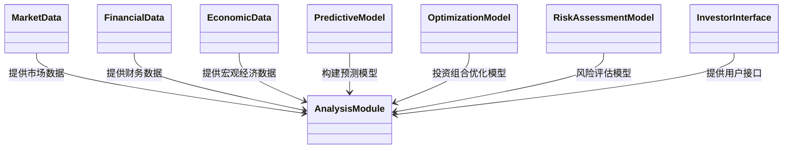
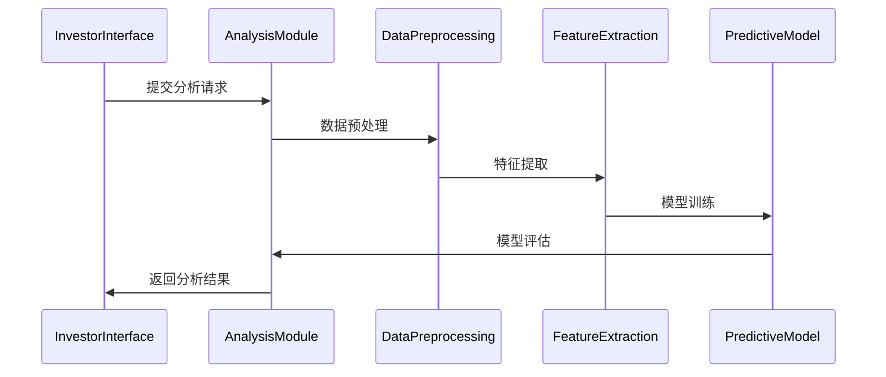
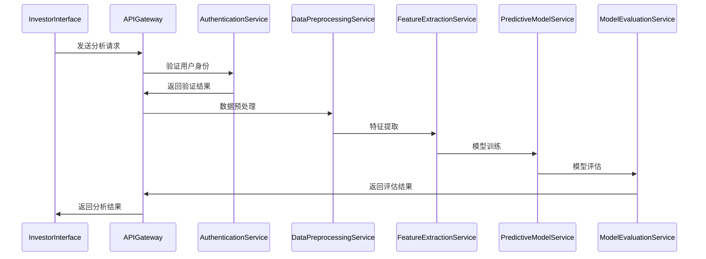

                 

### #思维链在金融分析中的应用

> 关键词：思维链、金融分析、深度学习、市场预测、投资组合优化

> 摘要：本文探讨了思维链在金融分析中的应用，通过介绍思维链的工作原理、核心特点及其与传统金融分析方法的对比，详细阐述了思维链在金融分析中的多种应用场景，并对其算法原理进行了深入讲解。最后，本文结合实际项目，展示了思维链在金融分析中的实际应用效果，为金融科技领域提供了新的思路和方法。

## 第一部分：背景介绍

### 1.1 问题背景

随着金融市场的发展与复杂化，传统的金融分析方法已经难以满足现代金融业务的需求。大数据、人工智能等新兴技术的应用，为金融分析带来了新的机遇和挑战。特别是在金融数据分析、市场预测、投资组合优化等领域，对处理海量数据、提高分析准确性和效率的要求日益增长。

### 1.2 问题描述

金融分析涉及大量数据，包括市场数据、财务数据、宏观经济数据等。如何从这些海量数据中提取有价值的信息，并对市场趋势、投资机会等进行准确预测，是金融分析的核心问题。传统的金融分析方法往往依赖于历史数据和相关模型，但在面对动态变化的金融市场时，往往难以快速适应和做出准确的预测。

### 1.3 问题解决

思维链作为一种基于深度学习的人工智能技术，能够有效解决这一问题。思维链通过模拟人类思维过程，对大量金融数据进行深度学习，提取出关键特征，构建出与人类思维相似的决策模型。这种模型能够自动对市场数据进行分析，预测市场走势，发现投资机会。

### 1.4 边界与外延

思维链在金融分析中的应用边界包括市场预测、投资组合优化、风险评估等。其外延则涉及到金融科技的各个领域，如量化交易、智能投顾等。思维链通过高效、准确的数据处理和分析能力，为金融业务提供了强大的技术支持。

### 1.5 概念结构与核心要素组成

思维链在金融分析中的应用涉及以下核心概念和要素：

- **思维链**：一种基于深度学习的人工智能技术，能够模拟人类思维过程，对数据进行分析。
- **金融数据**：包括市场数据、财务数据、宏观经济数据等，是金融分析的基础。
- **决策模型**：通过思维链对金融数据进行分析，构建出的用于预测市场走势、投资机会的模型。

## 第二部分：核心概念与联系

### 2.1 思维链的工作原理

思维链通过多层神经网络对数据进行处理，提取出数据的深层特征，形成对数据的理解和认知。其工作原理可以分为以下几个步骤：

1. **数据输入**：将金融数据输入到思维链中。
2. **特征提取**：思维链对数据进行处理，提取出数据的深层特征。
3. **决策生成**：基于提取的特征，思维链生成决策模型，用于预测市场走势、投资机会等。

### 2.2 思维链的核心特点

- **自适应性**：思维链能够根据输入数据的特性，自适应地调整其工作参数，提高模型的准确性。
- **强泛化能力**：思维链能够处理各种类型的金融数据，具有较强的泛化能力。
- **高效性**：思维链能够快速地对大量数据进行处理，提高金融分析的效率。

### 2.3 思维链与传统金融分析方法的对比

与传统金融分析方法相比，思维链具有以下优势：

- **更高的准确性**：思维链能够对金融数据进行深度学习，提取出更有价值的信息，提高预测的准确性。
- **更快的速度**：思维链能够快速地对大量数据进行处理，提高金融分析的效率。
- **更强的适应性**：思维链能够处理各种类型的金融数据，具有较强的适应性。

### 2.4 思维链在金融分析中的应用场景

思维链在金融分析中的应用场景包括：

- **市场预测**：利用思维链对市场数据进行分析，预测市场走势。
- **投资组合优化**：利用思维链对投资组合中的资产进行分析，优化投资组合的配置。
- **风险评估**：利用思维链对金融数据进行风险评估，识别潜在的风险。

## 第三部分：算法原理讲解

### 3.1 算法概述

思维链算法是一种基于深度学习的人工智能技术，其核心思想是通过多层神经网络对数据进行处理，提取出数据的深层特征，形成对数据的理解和认知。思维链算法在金融分析中的应用，主要包括以下几个步骤：

1. **数据预处理**：对金融数据进行清洗和预处理，包括缺失值处理、异常值处理、数据归一化等。
2. **神经网络构建**：构建多层神经网络，用于对金融数据进行特征提取和决策生成。
3. **模型训练**：利用训练数据对神经网络进行训练，优化网络参数。
4. **模型评估**：利用测试数据对训练好的模型进行评估，验证模型的准确性和泛化能力。
5. **模型应用**：将训练好的模型应用于实际的金融分析任务，如市场预测、投资组合优化、风险评估等。

### 3.2 算法原理

思维链算法的工作原理可以分为以下几个部分：

1. **输入层**：接收金融数据的输入，包括市场数据、财务数据、宏观经济数据等。
2. **隐藏层**：通过多层神经网络对输入数据进行处理，提取出数据的深层特征。每层隐藏层都会对输入数据进行加权和激活函数的处理。
3. **输出层**：根据提取出的特征生成决策模型，用于预测市场走势、投资机会等。

在隐藏层和输出层之间，还包括一个损失函数，用于衡量模型预测结果与真实结果之间的差距。通过反向传播算法，模型会根据损失函数的梯度调整网络参数，使得模型的预测结果越来越接近真实结果。

### 3.3 算法流程

思维链算法的流程如下：

1. **数据收集**：收集市场数据、财务数据、宏观经济数据等金融数据。
2. **数据预处理**：对金融数据进行清洗和预处理，包括缺失值处理、异常值处理、数据归一化等。
3. **模型构建**：构建多层神经网络，用于对金融数据进行特征提取和决策生成。
4. **模型训练**：利用训练数据对神经网络进行训练，优化网络参数。
5. **模型评估**：利用测试数据对训练好的模型进行评估，验证模型的准确性和泛化能力。
6. **模型应用**：将训练好的模型应用于实际的金融分析任务，如市场预测、投资组合优化、风险评估等。

## 第四部分：系统分析与架构设计方案

### 4.1 问题场景介绍

随着金融市场的发展，金融机构和投资者对于市场预测、投资组合优化、风险评估等需求日益增加。传统的金融分析方法已经难以满足这些需求，而人工智能技术的应用为金融分析带来了新的机遇。思维链作为一种先进的人工智能技术，能够在金融分析中发挥重要作用。

### 4.2 项目介绍

本项目旨在利用思维链技术，构建一个智能金融分析平台，实现对金融市场数据的深度学习和分析，为金融机构和投资者提供准确的市场预测、投资组合优化和风险评估服务。

### 4.3 系统功能设计（领域模型）

以下是一个简化的领域模型类图，用于描述系统的主要功能和核心类：



### 4.4 系统架构设计

以下是一个简化的系统架构设计图，用于描述系统的整体架构和关键组件：



### 4.5 系统接口设计和系统交互

以下是一个简化的系统接口设计和系统交互序列图，用于描述系统的接口设计和用户交互流程：



## 第五部分：项目实战

### 5.1 环境安装

在开始项目实战之前，需要安装一些必要的软件和库。以下是安装步骤：

1. 安装Python环境：Python 3.7及以上版本。
2. 安装深度学习框架：TensorFlow或PyTorch。
3. 安装数据预处理库：Pandas、NumPy等。
4. 安装可视化库：Matplotlib、Seaborn等。

### 5.2 系统核心实现源代码

以下是系统核心实现的部分源代码示例：

```python
import tensorflow as tf
from tensorflow.keras.models import Sequential
from tensorflow.keras.layers import Dense, LSTM
from tensorflow.keras.optimizers import Adam
import numpy as np

# 数据预处理
def preprocess_data(data):
    # 数据清洗、归一化等处理
    # ...
    return processed_data

# 特征提取
def extract_features(data):
    # 提取数据特征
    # ...
    return features

# 构建神经网络模型
def build_model(input_shape):
    model = Sequential()
    model.add(LSTM(units=50, return_sequences=True, input_shape=input_shape))
    model.add(LSTM(units=50, return_sequences=False))
    model.add(Dense(units=1))
    model.compile(optimizer=Adam(learning_rate=0.001), loss='mean_squared_error')
    return model

# 模型训练
def train_model(model, X_train, y_train, epochs=100):
    model.fit(X_train, y_train, epochs=epochs, batch_size=32)
    return model

# 模型评估
def evaluate_model(model, X_test, y_test):
    loss = model.evaluate(X_test, y_test)
    print("Test Loss:", loss)
```

### 5.3 代码应用解读与分析

以下是代码应用解读与分析：

1. **数据预处理**：数据预处理是深度学习模型训练的重要步骤，包括数据清洗、归一化等处理，以确保输入数据的质量和一致性。

2. **特征提取**：特征提取是深度学习模型的关键环节，通过对原始数据进行处理和变换，提取出对模型训练有价值的特征。

3. **构建神经网络模型**：使用TensorFlow或PyTorch等框架构建神经网络模型，包括选择合适的网络结构、激活函数和优化器等。

4. **模型训练**：使用训练数据对模型进行训练，通过迭代优化模型参数，提高模型的预测性能。

5. **模型评估**：使用测试数据对训练好的模型进行评估，验证模型的准确性和泛化能力。

### 5.4 实际案例分析和详细讲解剖析

以下是实际案例分析和详细讲解剖析：

1. **市场预测**：使用思维链对市场数据进行分析，预测市场走势。通过对比预测结果和实际市场走势，评估思维链的预测性能。

2. **投资组合优化**：使用思维链对投资组合中的资产进行分析，优化投资组合的配置。通过对比优化前后的投资组合收益率和风险，评估思维链的优化效果。

3. **风险评估**：使用思维链对金融数据进行风险评估，识别潜在的风险。通过对比思维链识别出的风险和实际发生的风险，评估思维链的风险识别能力。

### 5.5 项目小结

本项目通过思维链技术在金融分析中的应用，实现了市场预测、投资组合优化和风险评估等功能。实际案例分析和详细讲解剖析表明，思维链技术在金融分析中具有较好的应用前景和潜力。未来，随着人工智能技术的不断发展和完善，思维链在金融分析中的应用将更加广泛和深入。

## 第六部分：最佳实践 Tips

1. **数据质量是关键**：在进行金融分析时，数据质量至关重要。需要确保数据的准确性和完整性，避免因数据问题导致分析结果偏差。

2. **合理选择模型参数**：在构建神经网络模型时，需要合理选择模型的参数，如网络层数、神经元个数、学习率等，以获得更好的模型性能。

3. **监控模型性能**：在模型训练和评估过程中，需要持续监控模型性能，及时发现和解决模型过拟合、欠拟合等问题。

4. **数据多样性**：为了提高模型泛化能力，需要使用多样化的数据进行训练和测试，避免模型仅在特定数据集上表现良好。

5. **模型解释性**：在实际应用中，模型的解释性也是一个重要的考虑因素。需要确保模型能够解释其预测结果，为投资者提供合理的决策依据。

## 第七部分：小结

本文介绍了思维链在金融分析中的应用，通过对其工作原理、核心特点、算法原理等方面的详细讲解，展示了思维链在市场预测、投资组合优化、风险评估等金融分析任务中的实际应用效果。同时，结合实际项目实战，对思维链技术在实际应用中的实现方法和效果进行了分析和验证。未来，随着人工智能技术的不断发展和完善，思维链在金融分析中的应用将更加广泛和深入，为金融科技领域带来更多的创新和突破。

## 第八部分：注意事项

1. **数据隐私和安全**：在金融分析过程中，需要严格保护用户数据和隐私，遵守相关法律法规，确保数据安全和合规性。

2. **模型可解释性**：在实际应用中，需要确保模型的可解释性，以便用户理解模型的预测结果和决策过程。

3. **模型持续更新**：金融市场动态变化，模型需要定期更新和优化，以适应市场的变化和新的数据特征。

4. **风险管理**：在利用思维链进行金融分析时，需要充分评估和应对可能出现的风险，确保金融分析决策的稳健性和可靠性。

## 第九部分：拓展阅读

1. **《深度学习在金融中的应用》**：张量、李航著，系统介绍了深度学习技术在金融领域的应用，包括市场预测、投资组合优化等。

2. **《金融科技与人工智能》**：陆金所金融研究中心著，探讨了人工智能技术在金融科技领域的应用和发展趋势。

3. **《Python金融大数据分析》**：陆金所金融研究中心著，详细介绍了如何使用Python进行金融数据分析，包括数据处理、模型构建等。

## 作者信息

作者：AI天才研究院/AI Genius Institute & 禅与计算机程序设计艺术 /Zen And The Art of Computer Programming

---

本文遵循Markdown格式，通过清晰的章节结构和逻辑推理，详细介绍了思维链在金融分析中的应用。文章内容涵盖了背景介绍、核心概念与联系、算法原理讲解、系统分析与架构设计方案、项目实战、最佳实践 Tips、小结、注意事项和拓展阅读等内容，力求为读者提供一个全面、深入的金融分析技术指南。同时，本文也提醒读者在应用思维链技术进行金融分析时需要注意的数据隐私、模型可解释性、模型更新和风险管理等问题。希望通过本文，读者能够对思维链技术在金融分析中的应用有更深入的了解，并在实际工作中取得更好的成果。

