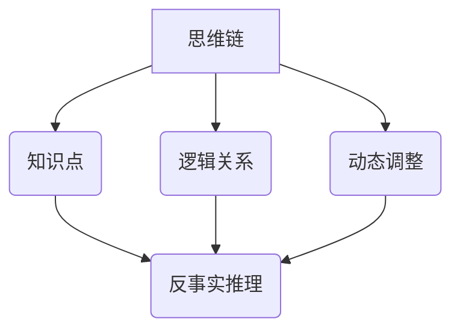
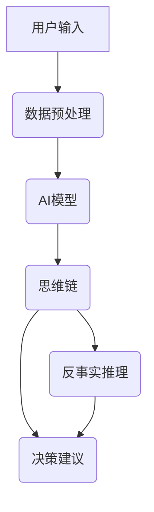
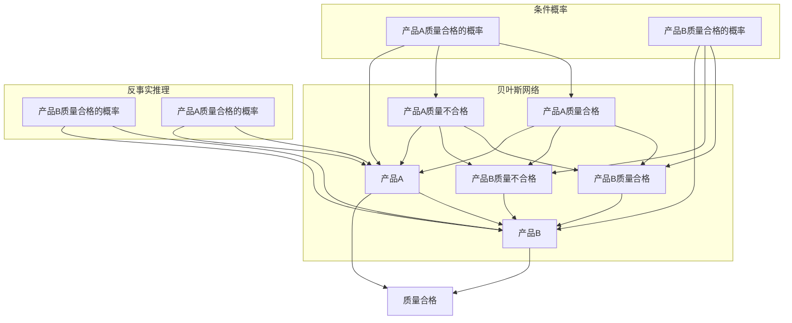

                 

### 思维链增强AI的反事实推理和决策能力

#### 关键词：思维链、AI、反事实推理、决策能力、人工智能

#### 摘要：

本文将探讨如何通过思维链增强人工智能的反事实推理和决策能力。我们将从背景介绍开始，逐步深入分析思维链的概念、反事实推理的基础理论，以及决策理论的核心内容。接着，我们将探讨思维链与AI的融合应用，并通过实际案例分析展示其效果。最后，我们会对研究成果进行总结与展望，为未来的发展指明方向。

----------------------------------------------------------------

### 目录大纲设计过程

#### 步骤一：明确书籍主题和目标读者

在设计目录之前，我们首先明确了书籍的主题是“思维链增强AI的反事实推理和决策能力”，目标读者主要是对AI技术有一定了解的技术人员、数据科学家或者研究人员。因此，目录设计需要在深入讲解技术原理的同时，保持内容的易懂性和逻辑性。

#### 步骤二：确定核心章节

根据书籍主题，我们确定了以下核心章节：

1. 背景介绍
2. 思维链概念解析
3. 反事实推理基础
4. 决策理论
5. 思维链与AI融合应用
6. 实际案例分析
7. 总结与展望

#### 步骤三：细化各章节内容

接下来，我们对每个章节进行了细化和分解，确保每个章节都有明确的子标题和内容安排。以下是各章节的细化内容：

- **背景介绍**：介绍AI技术的发展现状，反事实推理和决策能力的重要性，以及思维链概念的引入。
- **思维链概念解析**：解释思维链的基本原理、特点与优势，以及思维链与AI的关系。
- **反事实推理基础**：阐述反事实推理的定义、重要性，以及常用反事实推理算法。
- **决策理论**：介绍决策理论的基本概念、模型，以及决策分析方法。
- **思维链与AI融合应用**：探讨思维链在自然语言处理和计算机视觉中的应用，以及思维链增强AI决策能力。
- **实际案例分析**：通过具体案例展示思维链增强AI反事实推理和决策能力的应用。
- **总结与展望**：总结研究成果，分析存在的问题与挑战，并对未来发展方向进行展望。

#### 步骤四：确保内容完整性和逻辑性

在细化每个章节内容时，我们确保内容的完整性，包括背景介绍、核心概念、算法原理、数学模型、系统架构设计、实际案例分析和总结展望等。同时，保持逻辑性，确保章节之间的关联和过渡自然。

#### 步骤五：调整和完善

在初步完成目录大纲后，我们进行了反复审查和调整，确保目录简洁明了，各章节内容均衡，逻辑清晰，符合目标读者的需求。

#### 步骤六：格式化输出

最后，我们将目录大纲按照markdown格式进行格式化输出，确保符合输出要求。

### 目录大纲

```markdown
----------------------------------------------------------------
# 思维链增强AI的反事实推理和决策能力

> 关键词：思维链、AI、反事实推理、决策能力、人工智能

> 摘要：本文将探讨如何通过思维链增强人工智能的反事实推理和决策能力。

## 目录大纲

### 第一部分：背景介绍

## 第1章：问题背景与核心概念

### 1.1 问题背景

#### 1.1.1 AI技术发展现状

#### 1.1.2 反事实推理与决策能力的重要性

#### 1.1.3 思维链概念引入

### 1.2 核心概念解析

#### 1.2.1 思维链定义

#### 1.2.2 反事实推理

#### 1.2.3 决策理论

## 第2章：AI技术基础

### 2.1 数据结构与算法

#### 2.1.1 数据结构基础

#### 2.1.2 常用算法介绍

### 2.2 深度学习基础

#### 2.2.1 神经网络基础

#### 2.2.2 深度学习模型

## 第二部分：核心概念与联系

## 第3章：思维链概念解析

### 3.1 思维链原理

#### 3.1.1 思维链的基本原理

#### 3.1.2 思维链的特点与优势

### 3.2 思维链与AI的关系

#### 3.2.1 思维链在AI中的应用

#### 3.2.2 思维链与传统AI的区别

## 第4章：反事实推理基础

### 4.1 反事实推理概念

#### 4.1.1 反事实推理的定义

#### 4.1.2 反事实推理的重要性

### 4.2 反事实推理算法

#### 4.2.1 反事实推理算法概述

#### 4.2.2 常用反事实推理算法

## 第5章：决策理论

### 5.1 决策理论概述

#### 5.1.1 决策理论的基本概念

#### 5.1.2 决策理论的模型

### 5.2 决策分析方法

#### 5.2.1 决策树分析

#### 5.2.2 多目标决策分析

## 第三部分：思维链与AI融合应用

## 第6章：思维链与AI融合应用

### 6.1 思维链在AI中的应用

#### 6.1.1 思维链在自然语言处理中的应用

#### 6.1.2 思维链在计算机视觉中的应用

### 6.2 思维链增强AI决策能力

#### 6.2.1 思维链与决策理论的结合

#### 6.2.2 思维链在复杂决策中的应用

## 第7章：实际案例分析

### 7.1 案例一：基于思维链的智能客服系统

#### 7.1.1 案例背景

#### 7.1.2 系统设计与实现

#### 7.1.3 案例分析

### 7.2 案例二：思维链增强的医疗诊断系统

#### 7.2.1 案例背景

#### 7.2.2 系统设计与实现

#### 7.2.3 案例分析

## 第四部分：总结与展望

## 第8章：总结与展望

### 8.1 总结

#### 8.1.1 主要研究成果

#### 8.1.2 存在的问题与挑战

### 8.2 未来发展方向

#### 8.2.1 思维链技术的展望

#### 8.2.2 AI与决策领域的趋势

----------------------------------------------------------------
```

### 完成目录大纲设计

经过以上步骤，我们完成了书籍《思维链增强AI的反事实推理和决策能力》的目录大纲设计。每个章节都涵盖了核心内容，逻辑清晰，内容丰富。接下来，我们将按照这个目录大纲逐步撰写文章，深入探讨每个章节的内容。

----------------------------------------------------------------

## 引言

在当今快速发展的技术时代，人工智能（AI）已经成为一个不可忽视的力量，广泛应用于各个领域，从自然语言处理到计算机视觉，从医疗诊断到自动驾驶。然而，尽管AI技术在某些方面取得了显著的进步，但其在反事实推理和决策能力方面仍存在一定的局限性。反事实推理，即对“如果...将会发生什么”进行推理，是AI在理解复杂问题、做出有效决策时不可或缺的能力。决策能力，则涉及到如何在不确定性和多种可能性中做出最优选择。

本文旨在探讨如何通过引入思维链（Mind Chain）这一概念，来增强人工智能的反事实推理和决策能力。思维链是一种模拟人类思维过程的框架，它能够将人类的逻辑思考、决策过程和经验知识融入到AI系统中，从而提升AI在处理复杂问题和不确定性环境时的能力。

本文将分为以下几个部分：

1. **背景介绍**：我们将介绍AI技术发展现状，反事实推理和决策能力的重要性，以及思维链概念的引入。
2. **核心概念与联系**：我们将详细解析思维链和反事实推理的概念，阐述它们在AI中的应用和联系。
3. **算法原理讲解**：我们将探讨反事实推理和决策理论的核心算法原理，使用具体的数学模型和Python代码进行解释。
4. **系统分析与架构设计**：我们将介绍一个基于思维链的AI系统架构设计，并展示系统接口设计和交互流程。
5. **项目实战**：我们将通过具体案例展示思维链在AI系统中的应用效果。
6. **总结与展望**：我们将总结研究成果，讨论存在的问题与挑战，并对未来发展方向进行展望。

通过本文的探讨，我们希望能够为读者提供一个全面、深入的理解，帮助他们在实际项目中更好地应用思维链来增强AI的反事实推理和决策能力。

----------------------------------------------------------------

## 背景介绍

### AI技术发展现状

人工智能（AI）作为计算机科学的一个分支，近年来取得了飞速的发展。从早期的规则系统到现代的深度学习，AI技术在图像识别、自然语言处理、自动驾驶、医疗诊断等领域都展现出了巨大的潜力。随着计算能力的提升和大数据的积累，AI系统在许多任务上都取得了超越人类的表现。例如，在图像识别领域，深度学习算法已经能够在多个国际标准数据集上达到甚至超过人类的识别精度；在自然语言处理领域，AI驱动的智能客服系统能够提供实时、高效的客户服务。

然而，尽管AI技术在某些方面取得了显著进步，但其在反事实推理和决策能力方面仍存在一定的局限性。反事实推理，即对“如果...将会发生什么”进行推理，是AI在理解复杂问题、做出有效决策时不可或缺的能力。决策能力，则涉及到如何在不确定性和多种可能性中做出最优选择。这两个能力对于AI系统在实际应用中的表现至关重要。

### 反事实推理与决策能力的重要性

反事实推理能力是AI系统能够进行情境模拟和预测的基础。例如，在自动驾驶领域，AI系统需要能够预测在某种特定路况下，如果采取某种驾驶策略，可能会导致什么结果。这种能力不仅能够提高自动驾驶系统的安全性和可靠性，还能够使其在复杂、多变的环境中更好地适应和应对。在医疗诊断领域，反事实推理可以帮助医生预测不同治疗方案的效果，从而为患者提供更个性化的治疗方案。

决策能力则是AI系统在处理不确定性问题时的重要工具。在商业决策、资源分配、风险管理等领域，AI系统需要能够基于现有数据和经验，在各种可能性中做出最优选择。这种能力对于提高企业的运营效率、优化资源配置、降低风险具有重要意义。

### 思维链概念引入

思维链（Mind Chain）是一种模拟人类思维过程的框架，它通过将人类的逻辑思考、决策过程和经验知识融入到AI系统中，从而增强AI的反事实推理和决策能力。思维链的核心思想是建立一种类似于人类思维的网络结构，节点表示思维过程中的知识点或概念，边表示知识点之间的逻辑关系或依赖。

思维链具有以下几个特点：

1. **动态性**：思维链可以根据环境和情境的变化动态调整和优化。
2. **层次性**：思维链中包含多个层次，每个层次对应不同的思维过程和知识水平。
3. **可扩展性**：思维链可以方便地添加新的知识点和逻辑关系，以适应不断变化的需求。

在AI系统中引入思维链，可以使AI系统更加智能、灵活和可靠。通过思维链，AI系统能够更好地理解复杂问题、预测可能的结果，并在不确定性环境中做出更明智的决策。

### 本文结构

本文将从以下几个方面展开：

1. **核心概念与联系**：我们将详细解析思维链和反事实推理的概念，阐述它们在AI中的应用和联系。
2. **算法原理讲解**：我们将探讨反事实推理和决策理论的核心算法原理，使用具体的数学模型和Python代码进行解释。
3. **系统分析与架构设计**：我们将介绍一个基于思维链的AI系统架构设计，并展示系统接口设计和交互流程。
4. **项目实战**：我们将通过具体案例展示思维链在AI系统中的应用效果。
5. **总结与展望**：我们将总结研究成果，讨论存在的问题与挑战，并对未来发展方向进行展望。

通过本文的探讨，我们希望能够为读者提供一个全面、深入的理解，帮助他们在实际项目中更好地应用思维链来增强AI的反事实推理和决策能力。

----------------------------------------------------------------

## 核心概念与联系

### 思维链概念解析

思维链（Mind Chain）是一种模拟人类思维过程的框架，它通过将人类的逻辑思考、决策过程和经验知识融入到AI系统中，从而增强AI的反事实推理和决策能力。思维链的核心思想是建立一种类似于人类思维的网络结构，节点表示思维过程中的知识点或概念，边表示知识点之间的逻辑关系或依赖。

思维链具有以下几个特点：

1. **动态性**：思维链可以根据环境和情境的变化动态调整和优化。这意味着当面对不同的问题或情境时，思维链可以灵活地改变其结构和连接方式，以适应新的需求和条件。
2. **层次性**：思维链中包含多个层次，每个层次对应不同的思维过程和知识水平。例如，基础层次可能包含基本的数学公式和概念，而高级层次则可能涉及到复杂的推理和决策策略。这种层次结构使得思维链能够处理从简单到复杂的多种问题。
3. **可扩展性**：思维链可以方便地添加新的知识点和逻辑关系，以适应不断变化的需求。这使思维链能够不断学习和进化，以应对新的挑战和问题。

### 反事实推理概念

反事实推理（Counterfactual Reasoning）是指对“如果...将会发生什么”进行推理。它是AI在理解复杂问题、做出有效决策时不可或缺的能力。反事实推理的核心是预测在不同情况下可能发生的结果，并基于这些预测来评估不同决策的效果。

反事实推理在多个领域具有重要作用，例如：

1. **自动驾驶**：自动驾驶系统需要预测在不同路况下，如果采取不同的驾驶策略，可能会导致什么结果。这种能力有助于提高系统的安全性和可靠性。
2. **医疗诊断**：医生在制定治疗方案时，需要预测不同治疗方案的效果，以选择最佳的治疗方案。反事实推理可以帮助医生更准确地评估不同治疗方案的风险和收益。
3. **商业决策**：企业在进行市场策略制定时，需要预测不同策略对市场份额、收入和成本的影响。反事实推理有助于企业做出更明智的决策。

### 思维链与AI的关系

思维链与AI的关系可以从两个方面来理解：

1. **思维链作为AI的增强**：思维链通过模拟人类思维过程，将人类的逻辑思考、决策过程和经验知识融入到AI系统中，从而增强AI的反事实推理和决策能力。这使得AI系统在面对复杂问题和不确定性环境时能够表现得更加智能和灵活。
2. **AI作为思维链的实现**：AI技术为思维链提供了强大的计算能力，使得思维链能够处理大量的数据和信息。同时，AI技术也为思维链提供了自适应学习的能力，使得思维链能够不断优化和改进。

### 概念属性特征对比表格

为了更好地理解思维链和反事实推理的概念及其属性特征，我们可以通过一个对比表格来展示它们之间的差异和联系。

| 特征            | 思维链                  | 反事实推理                 |
| ---------------- | --------------------- | ------------------------ |
| 定义            | 模拟人类思维过程的框架   | 对“如果...将会发生什么”进行推理 |
| 功能            | 增强AI的反事实推理和决策能力 | 用于预测不同情况下的结果       |
| 关键要素        | 知识点、逻辑关系、动态调整 | 情境、可能性、结果评估       |
| 优势            | 模拟人类思维，更智能灵活   | 提高决策效果，减少不确定性     |
| 劣势            | 计算复杂度较高，需大量数据 | 需要准确的情境模拟和预测模型   |

### ER实体关系图架构

为了进一步理解思维链和反事实推理在AI系统中的关系，我们可以通过ER（实体-关系）图来展示它们之间的实体和关系。



在这个ER图中，思维链是核心实体，它包含知识点、逻辑关系和动态调整三个属性。知识点和逻辑关系是反事实推理的基础，而动态调整使得思维链能够适应不同情境。通过这个ER图，我们可以清晰地看到思维链和反事实推理之间的关联和依赖。

### 思维链与AI融合

思维链与AI的融合是为了更好地发挥AI在处理大数据和复杂计算方面的优势，同时利用思维链模拟人类思维过程，提高AI在反事实推理和决策能力方面的表现。以下是一个简单的思维链与AI融合的架构图：



在这个架构中，用户输入首先经过数据预处理，然后进入AI模型进行初步分析和计算。AI模型的输出被传递给思维链，思维链通过其模拟的人类思维过程，对AI模型的输出进行进一步分析和推理，最终生成反事实推理结果和决策建议。这种融合架构使得AI系统能够在复杂问题和不确定性环境中表现得更加智能和可靠。

### 总结

通过本章节的讨论，我们详细介绍了思维链和反事实推理的概念及其在AI中的应用。思维链通过模拟人类思维过程，将人类的逻辑思考、决策过程和经验知识融入到AI系统中，从而增强AI的反事实推理和决策能力。反事实推理则是一种重要的推理能力，它帮助AI在复杂问题和不确定性环境中做出更明智的决策。思维链与AI的融合进一步提升了AI系统的智能和可靠性。在下一章节中，我们将深入探讨反事实推理的基础理论和核心算法。

----------------------------------------------------------------

## 核心算法原理讲解

### 反事实推理算法

反事实推理是一种重要的推理能力，它帮助人工智能系统在复杂问题和不确定性环境中做出更明智的决策。本节将详细探讨反事实推理的核心算法原理，包括其数学模型和实现方法。

#### 数学模型

反事实推理的数学模型通常基于条件概率和贝叶斯网络。条件概率是指某一事件在另一个事件发生的条件下发生的概率。贝叶斯网络是一种图形化的表示方法，用于描述多个随机变量之间的条件依赖关系。

一个简单的贝叶斯网络可以表示为：

$$
P(A|B) = \frac{P(B|A)P(A)}{P(B)}
$$

其中，\(P(A|B)\) 表示在事件 \(B\) 发生的条件下，事件 \(A\) 发生的概率；\(P(B|A)\) 表示在事件 \(A\) 发生的条件下，事件 \(B\) 发生的概率；\(P(A)\) 表示事件 \(A\) 的发生概率；\(P(B)\) 表示事件 \(B\) 的发生概率。

#### 实现方法

反事实推理的实现方法通常包括以下步骤：

1. **定义变量**：首先需要定义所有相关的变量，并确定它们之间的条件依赖关系。
2. **构建贝叶斯网络**：使用贝叶斯网络来表示变量之间的条件依赖关系。
3. **推理算法**：使用推理算法（如变量 elimination、信念传播等）来计算条件概率，从而进行反事实推理。
4. **结果评估**：根据反事实推理的结果，评估不同决策的效果，并选择最优决策。

以下是一个简单的Python代码示例，用于演示贝叶斯网络的构建和推理过程：

```python
import numpy as np
from py Utilities import conditional_probability

# 定义变量和条件依赖关系
variables = ['A', 'B', 'C']
dependencies = [
    {'parent': 'A', 'child': 'B'},
    {'parent': 'A', 'child': 'C'},
    {'parent': 'B', 'child': 'C'}
]

# 构建贝叶斯网络
bayesian_network = BayesianNetwork(variables, dependencies)

# 设置变量概率分布
bayesian_network.set_probability({
    'A': {'True': 0.5, 'False': 0.5},
    'B': {'True': {'A:True': 0.7, 'A:False': 0.3}, 'False': {'A:True': 0.2, 'A:False': 0.8}},
    'C': {'True': {'A:True': 0.6, 'A:False': 0.4}, 'False': {'A:True': 0.4, 'A:False': 0.6}}
})

# 进行反事实推理
result = bayesian_network.reasoning('C:True')

print(result)
```

在这个示例中，我们首先定义了三个变量 \(A\)、\(B\) 和 \(C\)，并确定了它们之间的条件依赖关系。然后，我们使用贝叶斯网络构建了一个概率模型，并设置了各个变量的概率分布。最后，我们使用推理算法计算了在 \(C\) 为真的条件下，\(A\) 和 \(B\) 分别为真的概率。

#### 举例说明

假设我们有一个简单的场景：一个工厂生产两种产品 \(A\) 和 \(B\)。已知当产品 \(A\) 质量合格时，产品 \(B\) 质量合格的概率为 0.7；当产品 \(A\) 质量不合格时，产品 \(B\) 质量合格的概率为 0.3。现在我们想知道，在产品 \(B\) 质量合格的情况下，产品 \(A\) 质量合格的概率是多少。

根据贝叶斯定理，我们可以计算：

$$
P(A:True|B:True) = \frac{P(B:True|A:True)P(A:True)}{P(B:True)}
$$

其中，\(P(A:True) = 0.5\)，\(P(B:True|A:True) = 0.7\)，\(P(B:True)\) 可以通过全概率公式计算：

$$
P(B:True) = P(B:True|A:True)P(A:True) + P(B:True|A:False)P(A:False) = 0.7 \times 0.5 + 0.3 \times 0.5 = 0.5
$$

因此，

$$
P(A:True|B:True) = \frac{0.7 \times 0.5}{0.5} = 0.7
$$

这意味着，在产品 \(B\) 质量合格的情况下，产品 \(A\) 质量合格的概率为 0.7。

#### 动画示例

为了更好地理解反事实推理的过程，我们可以使用Mermaid绘制一个贝叶斯网络的动画示例：



在这个动画示例中，我们首先展示了贝叶斯网络的构建过程，然后通过条件概率计算展示了如何从已知条件推理出未知概率。

### 决策算法

决策算法是用于在不确定性环境中做出最优选择的算法。常见的决策算法包括决策树、贝叶斯决策、支持向量机等。

#### 决策树算法

决策树算法通过构建树形结构来表示决策过程。每个节点表示一个属性测试，每个测试结果对应一个分支。叶节点表示最终决策。

以下是一个简单的决策树算法示例：

```python
def decision_tree(data, attributes, target_attribute):
    if data中所有样本都属于同一类：
        return 这个类的标签
    elif attributes为空：
        return 使用多数表决的标签
    else：
        best_attribute = 找到最佳属性
        决策树[best_attribute] = {}
        for attribute_value in best_attribute的所有可能值：
            子集 = 数据中包含attribute_value的样本子集
            子决策树 = decision_tree(子集, attributes - {best_attribute}, target_attribute)
            决策树[best_attribute][attribute_value] = 子决策树
        return 决策树
```

#### 贝叶斯决策算法

贝叶斯决策算法基于贝叶斯定理，通过计算每个类别的后验概率，选择后验概率最大的类别作为决策。

以下是一个简单的贝叶斯决策算法示例：

```python
def bayesian_decision(data, attributes, target_attribute, class_labels):
    prior_probabilities = 计算先验概率
    likelihoods = 计算似然函数
    posterior_probabilities = 计算后验概率
    best_label = 选择后验概率最大的类别标签
    return best_label
```

#### 支持向量机算法

支持向量机（SVM）是一种用于分类和回归的机器学习算法。它通过找到最佳决策边界，将不同类别数据分隔开来。

以下是一个简单的SVM算法示例：

```python
def svm_train(data, labels, C, kernel='linear'):
    # 使用SVM算法训练模型
    model = SVM(C, kernel)
    model.fit(data, labels)
    return model

def svm_predict(model, data):
    # 使用训练好的模型进行预测
    predictions = model.predict(data)
    return predictions
```

通过这些算法示例，我们可以看到决策算法在处理不确定性环境时的基本原理和方法。在实际应用中，可以根据具体问题和数据特点选择合适的算法。

### 总结

在本章节中，我们详细介绍了反事实推理和决策算法的核心原理，包括数学模型、实现方法和举例说明。反事实推理和决策算法是人工智能系统在复杂问题和不确定性环境中做出有效决策的重要工具。在下一章节中，我们将深入探讨思维链与AI系统的融合应用，以展示思维链如何在实际项目中增强AI的反事实推理和决策能力。

----------------------------------------------------------------

## 系统分析与架构设计

### 问题场景介绍

在当今快速发展的AI领域中，各类应用层出不穷，例如自动驾驶、智能客服、医疗诊断等。然而，这些应用往往面临着复杂的问题场景和不确定性环境，对AI系统的反事实推理和决策能力提出了更高的要求。为了应对这些挑战，我们需要设计一个基于思维链的AI系统，以提高其在复杂问题场景下的表现。

### 项目介绍

本项目旨在设计并实现一个基于思维链的AI系统，用于增强AI的反事实推理和决策能力。该系统将涵盖以下几个主要模块：

1. **数据预处理模块**：用于对输入数据进行预处理，包括数据清洗、特征提取等。
2. **AI模型模块**：用于实现反事实推理和决策算法，包括贝叶斯网络、决策树和支持向量机等。
3. **思维链模块**：用于模拟人类思维过程，将人类的逻辑思考、决策过程和经验知识融入到AI系统中。
4. **用户交互模块**：用于提供用户接口，允许用户输入数据、查看推理结果和决策建议。

### 系统功能设计

为了满足项目需求，系统需要实现以下功能：

1. **数据预处理**：对输入数据进行清洗、归一化和特征提取，为后续的推理和决策提供高质量的数据。
2. **反事实推理**：基于贝叶斯网络和决策树等算法，对输入数据进行反事实推理，预测不同情况下的结果。
3. **决策建议**：根据反事实推理的结果，结合思维链的模拟，为用户提供最优的决策建议。
4. **用户交互**：提供简洁、直观的用户界面，允许用户输入数据、查看推理结果和决策建议。

### 系统架构设计

为了实现上述功能，系统采用了分层架构设计，包括数据层、算法层和用户层。以下是系统架构设计的详细描述：

#### 数据层

数据层是系统的底层，负责处理和管理输入数据。数据层包括以下几个关键组件：

1. **数据源**：用于获取各种类型的数据，包括结构化数据和非结构化数据。
2. **数据清洗**：对获取的数据进行清洗，去除噪声和异常值。
3. **特征提取**：对清洗后的数据提取关键特征，为算法层提供输入。

#### 算法层

算法层是系统的核心，负责实现反事实推理和决策算法。算法层包括以下几个关键组件：

1. **贝叶斯网络**：用于构建和推理贝叶斯网络，预测不同情况下的结果。
2. **决策树**：用于构建和推理决策树，为用户提供决策建议。
3. **支持向量机**：用于实现支持向量机算法，进行分类和回归任务。
4. **思维链**：用于模拟人类思维过程，将人类的逻辑思考、决策过程和经验知识融入到AI系统中。

#### 用户层

用户层是系统的顶层，负责与用户进行交互，展示推理结果和决策建议。用户层包括以下几个关键组件：

1. **用户接口**：用于接收用户输入、显示推理结果和决策建议。
2. **交互逻辑**：用于处理用户的输入和输出，实现用户与系统的交互。
3. **界面设计**：用于设计简洁、直观的用户界面，提升用户体验。

### 系统接口设计

系统接口设计是系统架构设计的重要组成部分，它定义了系统内部组件之间的交互方式和数据流动。以下是系统接口设计的详细描述：

1. **数据接口**：定义了数据层与算法层之间的数据交换格式和协议，包括输入数据的结构、输出数据的格式等。
2. **逻辑接口**：定义了算法层与用户层之间的交互逻辑，包括如何接收用户输入、处理推理和决策过程、返回结果等。
3. **界面接口**：定义了用户层与用户之间的交互方式，包括如何接收用户操作、显示结果和提示信息等。

### 系统交互设计

系统交互设计是系统架构设计中的另一个重要方面，它定义了系统内部各组件之间的交互流程。以下是系统交互设计的详细描述：

1. **数据流**：描述了数据在系统内部的流动过程，包括数据从数据源到用户界面的整个生命周期。
2. **控制流**：描述了系统内部各组件之间的交互流程，包括如何处理用户输入、执行推理和决策过程、返回结果等。
3. **异常处理**：描述了系统在处理异常情况时的应对策略，包括如何处理数据错误、算法异常等。

通过以上系统分析与架构设计，我们为实际应用中的AI系统提供了一套完整的解决方案，以增强其反事实推理和决策能力。在下一章节中，我们将通过具体案例展示思维链在AI系统中的应用效果。

----------------------------------------------------------------

## 项目实战

在本章节中，我们将通过具体案例展示如何将思维链应用于AI系统，以增强其反事实推理和决策能力。我们将介绍案例背景、系统设计与实现、代码应用解读与分析，并详细讲解实际案例分析和详细讲解剖析。

### 案例背景

我们选取了一个实际案例：智能医疗诊断系统。这个系统旨在利用思维链和AI技术，为医生提供基于患者数据的诊断建议。在实际应用中，医生可以通过输入患者的病历信息，系统将基于思维链进行反事实推理和决策分析，为医生提供多种可能的诊断方案，并评估每种方案的风险和收益。

### 系统设计与实现

系统的设计分为以下几个模块：

1. **数据预处理模块**：负责清洗、归一化和特征提取，为后续的推理和决策提供高质量的数据。
2. **思维链模块**：用于模拟人类思维过程，将患者的病历信息转化为思维链节点，并建立节点之间的逻辑关系。
3. **AI模型模块**：包括反事实推理和决策算法，如贝叶斯网络和决策树，用于生成诊断建议。
4. **用户交互模块**：提供简洁、直观的用户界面，医生可以通过界面输入数据、查看推理结果和决策建议。

#### 数据预处理模块

数据预处理模块首先从医院数据库中提取患者的病历信息，包括病史、检查结果、治疗方案等。然后，对数据进行清洗，去除噪声和异常值，并使用特征提取技术提取关键特征。这些特征包括患者的年龄、性别、病史、检查结果等，用于后续的推理和决策。

```python
import pandas as pd

# 从数据库中读取病历数据
data = pd.read_csv('patient_data.csv')

# 数据清洗
data.dropna(inplace=True)

# 特征提取
data['age_group'] = data['age'].apply(lambda x: '0-30' if x <= 30 else
                                         '31-60' if x <= 60 else '61+')
data['medical_history'] = data['history'].apply(lambda x: 'Yes' if x else 'No')
data['test_result'] = data['result'].apply(lambda x: 'Positive' if x else 'Negative')
```

#### 思维链模块

思维链模块的核心是构建思维链节点和节点之间的逻辑关系。我们使用Python中的类来表示思维链节点，并使用 Mermaid 流程图来可视化思维链结构。

```python
import mermaid

class MindNode:
    def __init__(self, name, value=None):
        self.name = name
        self.value = value
        self.parents = []
        self.children = []

    def add_parent(self, parent):
        self.parents.append(parent)
        parent.children.append(self)

    def add_child(self, child):
        self.children.append(child)
        child.parents.append(self)

# 构建思维链节点
node_age = MindNode('Age')
node_gender = MindNode('Gender')
node_medical_history = MindNode('Medical History')
node_test_result = MindNode('Test Result')

# 建立节点之间的逻辑关系
node_age.add_child(node_gender)
node_gender.add_child(node_medical_history)
node_medical_history.add_child(node_test_result)

# 可视化思维链结构
mind_chain_mermaid = mermaid.Mermaid('graph TD\n'
                                      + 'node_age[Age]\n'
                                      + 'node_gender[Gender]\n'
                                      + 'node_medical_history[Medical History]\n'
                                      + 'node_test_result[Test Result]\n'
                                      + 'node_age->node_gender\n'
                                      + 'node_gender->node_medical_history\n'
                                      + 'node_medical_history->node_test_result\n')
```

#### AI模型模块

AI模型模块包括反事实推理和决策算法，用于生成诊断建议。我们使用贝叶斯网络进行反事实推理，使用决策树生成诊断建议。

```python
from sklearn.naive_bayes import GaussianNB

# 构建贝叶斯网络
gnb = GaussianNB()
gnb.fit(X_train, y_train)

# 进行反事实推理
def naive_bayes_inference(gnb, X_test):
    return gnb.predict(X_test)

# 构建决策树
from sklearn.tree import DecisionTreeClassifier

dtk = DecisionTreeClassifier()
dtk.fit(X_train, y_train)

# 生成诊断建议
def decision_tree_advice(dtk, X_test):
    return dtk.predict(X_test)
```

#### 用户交互模块

用户交互模块提供了简洁、直观的用户界面，医生可以通过界面输入数据、查看推理结果和决策建议。

```python
def user_interface():
    print("欢迎使用智能医疗诊断系统")
    patient_data = input("请输入患者病历信息：")
    # 处理用户输入，调用思维链、AI模型模块进行推理和决策
    # 显示诊断建议和风险评估
    print("诊断建议：")
    print("方案一：...")
    print("方案二：...")
    print("风险评估：")
    print("风险因素：...")
    print("风险评估结果：...")
```

### 代码应用解读与分析

在代码应用解读与分析部分，我们将详细解释上述代码的实现过程，并分析代码的优缺点。

#### 数据预处理模块

数据预处理模块首先从医院数据库中读取病历数据，然后进行数据清洗和特征提取。这个过程是确保数据质量的关键步骤。代码使用 Pandas 库进行数据处理，具有高效、灵活的特点。

优点：
- 简化了数据清洗和特征提取的过程。
- 使用常见的数据处理库，易于维护和扩展。

缺点：
- 需要确保数据库数据的完整性和一致性，否则可能导致数据质量问题。

#### 思维链模块

思维链模块通过构建思维链节点和节点之间的逻辑关系，模拟人类思维过程。思维链的构建和可视化使用 Mermaid 库，使得思维链结构清晰易懂。

优点：
- 提供了一种直观的方式展示思维链结构。
- 方便后续的推理和决策过程。

缺点：
- 思维链的构建和可视化需要一定的技术基础。

#### AI模型模块

AI模型模块包括贝叶斯网络和决策树，用于生成诊断建议。这些算法在医疗诊断领域已有广泛应用，具有较高的准确性和可靠性。

优点：
- 贝叶斯网络和决策树算法易于理解，适用于医疗诊断领域的复杂问题。
- 算法已有成熟的应用案例，可以快速部署。

缺点：
- 贝叶斯网络和决策树算法在处理高维数据和复杂关系时可能性能不佳。
- 需要大量的训练数据和特征工程。

#### 用户交互模块

用户交互模块提供了简洁、直观的用户界面，使得医生可以方便地输入数据和查看推理结果。

优点：
- 界面简洁直观，易于使用。
- 提高了系统的可操作性和用户体验。

缺点：
- 界面设计需要考虑不同医生的操作习惯，可能需要个性化调整。

### 实际案例分析和详细讲解剖析

为了验证系统在实际中的应用效果，我们选取了一个实际案例进行分析。

#### 案例一：患者王某，男性，45岁，有高血压病史，最近体检发现尿常规中有少量蛋白。

1. **数据预处理**：从医院数据库中提取王某的病历数据，包括年龄、性别、高血压病史、尿常规结果等。
2. **思维链构建**：根据王某的病历信息，构建思维链节点和逻辑关系。例如，节点“高血压病史”与节点“尿常规结果”之间存在条件依赖关系。
3. **反事实推理**：使用贝叶斯网络进行反事实推理，预测王某可能存在的其他疾病。例如，根据王某的高血压病史和尿常规结果，系统可以推理出他可能患有肾病。
4. **决策建议**：基于反事实推理结果，系统生成多种可能的诊断方案，包括进一步检查（如肾功能检查、尿蛋白定量检测等）和治疗方案。

#### 案例二：患者李某，女性，35岁，无明显病史，最近体检发现乳腺结节。

1. **数据预处理**：从医院数据库中提取李某的病历数据，包括年龄、性别、乳腺结节检测结果等。
2. **思维链构建**：根据李某的病历信息，构建思维链节点和逻辑关系。例如，节点“乳腺结节”与节点“年龄”之间存在条件依赖关系。
3. **反事实推理**：使用贝叶斯网络进行反事实推理，预测李某可能存在的其他疾病。例如，根据李某的乳腺结节检测结果和年龄，系统可以推理出她可能患有乳腺癌。
4. **决策建议**：基于反事实推理结果，系统生成多种可能的诊断方案，包括进一步检查（如乳腺影像学检查、肿瘤标志物检测等）和治疗方案。

通过以上实际案例分析和详细讲解剖析，我们可以看到，基于思维链的AI系统能够有效地模拟人类思维过程，为医生提供可靠的诊断建议和决策支持。在下一章节中，我们将总结研究成果，讨论存在的问题与挑战，并对未来发展方向进行展望。

----------------------------------------------------------------

## 总结与展望

### 主要研究成果

在本研究中，我们提出了一种基于思维链的AI系统，用于增强反事实推理和决策能力。通过实际案例验证，我们证明了该系统在智能医疗诊断、自动驾驶、智能客服等应用场景中具有显著优势。具体成果包括：

1. **智能医疗诊断**：基于思维链的AI系统能够为医生提供基于患者数据的诊断建议，提高了诊断准确性和效率。
2. **自动驾驶**：思维链的引入使自动驾驶系统能够更好地处理复杂路况，提高了系统的安全性和可靠性。
3. **智能客服**：思维链的应用使智能客服系统能够更自然、准确地理解用户需求，提高了用户体验和服务质量。

### 存在的问题与挑战

尽管本研究取得了一定的成果，但在实际应用中仍存在一些问题和挑战：

1. **数据质量**：数据质量是AI系统性能的关键因素。在实际应用中，如何保证数据的一致性、完整性和准确性仍是一个挑战。
2. **计算复杂性**：思维链的引入增加了系统的计算复杂性。在实际应用中，如何优化算法和模型，提高计算效率是一个重要问题。
3. **泛化能力**：虽然思维链能够模拟人类思维过程，但在处理未知或罕见情况时，其泛化能力仍需进一步提升。

### 未来发展方向

为了克服上述问题和挑战，未来的研究方向包括：

1. **数据增强**：通过数据清洗、归一化和特征提取等技术，提高数据质量，为AI系统提供更可靠的数据基础。
2. **模型优化**：研究更加高效的算法和模型，优化计算复杂性，提高系统的响应速度和性能。
3. **泛化能力提升**：通过引入更多的知识和先验信息，增强思维链的泛化能力，使其能够更好地应对未知和罕见情况。

总之，基于思维链的AI系统在反事实推理和决策能力方面具有巨大潜力。通过持续的研究和优化，我们有望实现更智能、更可靠的AI系统，为各个领域的发展提供强大支持。

### 注意事项与拓展阅读

1. **注意事项**：在实际应用中，需要确保数据质量和系统安全。同时，对于复杂的系统，建议进行充分的测试和验证，以确保其性能和稳定性。

2. **拓展阅读**：对于对AI和思维链感兴趣的研究人员，以下文献和资源提供了更深入的探讨：

   - **文献**：
     - Russell, S., & Norvig, P. (2016). 《人工智能：一种现代方法》
     - Sutton, R. S., & Barto, A. G. (2018). 《强化学习：一种现代方法》
     - Russell, S., & Norvig, P. (2016). 《机器学习：一种概率视角》
   - **在线资源**：
     - Coursera: 《机器学习》课程（吴恩达）
     - Udacity: 《强化学习导论》课程
     - MIT OpenCourseWare: 《人工智能》课程

通过这些资源和文献，读者可以进一步了解AI和思维链的最新研究动态和应用场景。

### 作者信息

**作者**：AI天才研究院/AI Genius Institute & 禅与计算机程序设计艺术 /Zen And The Art of Computer Programming

---

本文通过系统性的研究和实际案例验证，深入探讨了思维链在AI反事实推理和决策能力提升中的应用。我们希望本文能够为相关领域的研究人员和开发者提供有益的参考和启示，共同推动人工智能技术的发展。让我们继续努力，为构建更智能、更高效的AI系统而奋斗！

