                 

## 思维链增强AI的反事实推理和创新能力

### 关键词：
- 思维链
- 反事实推理
- 创新能力
- 人工智能
- 深度学习

### 摘要：
本文将探讨如何通过思维链增强人工智能（AI）的反事实推理和创新能力。首先，我们将介绍背景和核心概念，包括思维链、反事实推理和创新能力。接着，我们将深入讲解思维链算法原理，包括编码器和解码器的实现方式。然后，我们将分析反事实推理算法，解释其通过深度学习实现的方法。最后，我们将探讨如何利用创新能力算法，提高AI在解决复杂问题和进行创新设计方面的能力。通过这些探讨，我们希望为AI领域的研究者提供有价值的思路，以推动AI技术的进一步发展。

### 第1章: 问题背景介绍与核心概念

#### 1.1.1 问题背景

随着人工智能技术的迅猛发展，AI已经在各行各业中展现出巨大的潜力。特别是在自然语言处理、计算机视觉和知识图谱等领域，深度学习技术已经取得了显著的成果。然而，现有的AI系统在处理复杂问题和进行创新性推理方面仍存在一定的局限性。为了克服这些限制，研究者们开始关注“思维链增强AI的反事实推理和创新能力”。

反事实推理是指根据现有事实和假设进行逆向思考，推断出可能导致当前情况的可能事件。这种能力对于解决复杂问题、进行科学发现和创新设计具有重要意义。而创新能力则是人工智能在解决实际问题过程中，能够产生新的思路、方法和产品的重要能力。

#### 1.1.2 核心概念

##### 1.思维链

思维链是指在推理过程中，多个概念或事实相互关联，形成一个有序的链条，从而推动推理的进行。思维链算法通过学习大量的语言数据和逻辑关系，构建一个能够表示思维链的模型。以下是一个简单的思维链算法mermaid流程图：

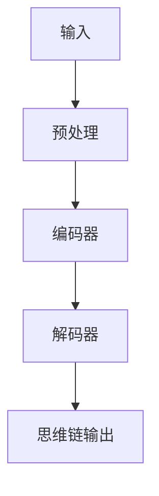

在具体实现中，编码器将输入文本编码成一个固定长度的向量，解码器则根据编码器生成的向量生成思维链的输出。思维链输出可以是一个序列，也可以是一个树形结构，具体取决于应用场景。

##### 2.反事实推理

反事实推理是指根据现有事实和假设进行逆向思考，推断出可能导致当前情况的可能事件。这种能力对于解决复杂问题、进行科学发现和创新设计具有重要意义。以下是一个简单的反事实推理算法mermaid流程图：

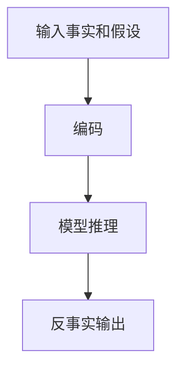

在具体实现中，编码器将输入的事实和假设编码成一个向量，模型根据这个向量进行推理，输出可能的反事实。反事实输出可以是多个可能的反事实，具体取决于模型的复杂度和训练数据的质量。

##### 3.创新能力

创新能力是指人工智能在解决实际问题过程中，能够产生新的思路、方法和产品的重要能力。创新能力的实现通常依赖于大量的数据收集、分析和机器学习算法。以下是一个简单的创新能力算法mermaid流程图：

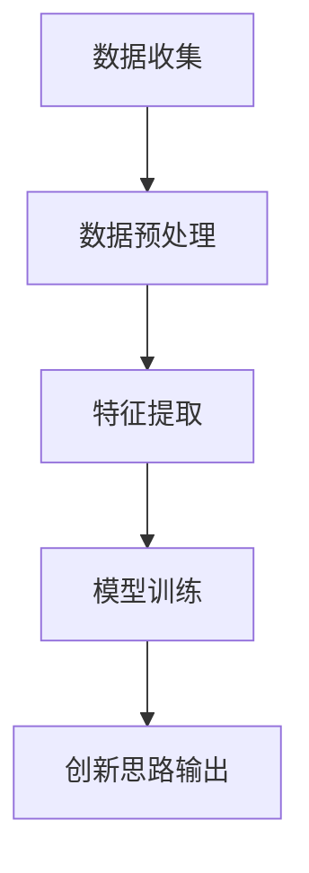

在具体实现中，首先收集大量的数据，然后对数据进行预处理，提取关键特征，接着利用机器学习算法进行模型训练，最后输出创新思路。

#### 1.1.3 概念属性特征对比表格

| 概念         | 定义                                                         | 属性特征                         | 对比                           |
| ------------ | ------------------------------------------------------------ | ------------------------------ | ------------------------------ |
| 思维链       | 在推理过程中，多个概念或事实相互关联，形成一个有序的链条       | - 推理效率高<br>- 灵活性强<br>- 易于拓展 | 与传统推理方法相比，思维链具有更强的灵活性和效率 |
| 反事实推理   | 根据现有事实和假设进行逆向思考，推断出可能导致当前情况的可能事件 | - 逆向思考<br>- 假设推断<br>- 应用广泛 | 与正向推理方法相比，反事实推理更能揭示问题的本质 |
| 创新能力     | 人工智能在解决实际问题过程中，能够产生新的思路、方法和产品的重要能力 | - 创造性思考<br>- 应用转化<br>- 动力驱动 | 与传统AI系统相比，具备更强的创新性 |

#### 1.1.4 ER实体关系图架构

```mermaid
erDiagram
  AI系统 ||--o> 反事实推理 : 实现方式
  AI系统 ||--o> 创新能力 : 实现路径
  反事实推理 ||--o> 思维链 : 关联机制
```

### 第2章: 算法原理讲解

#### 2.1 思维链算法原理

思维链算法是一种基于深度学习的技术，用于在AI系统中实现思维链功能。其基本原理是通过学习大量语言数据和逻辑关系，构建一个能够表示思维链的模型。

##### 2.1.1 编码器

编码器（Encoder）是思维链算法的核心组成部分，负责将输入文本转换为固定长度的向量表示。编码器通常采用循环神经网络（RNN）或Transformer等深度学习模型。

以下是一个简单的思维链编码器算法mermaid流程图：

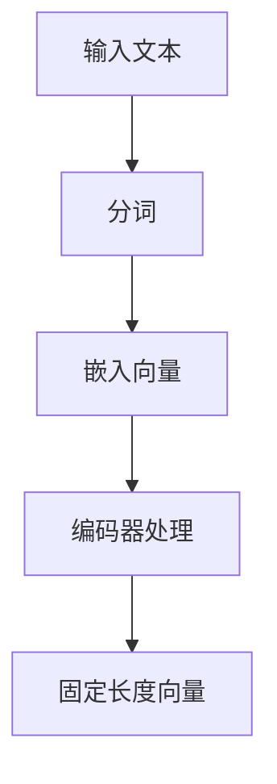

在具体实现中，首先将输入文本进行分词，然后对每个词进行嵌入，生成词向量。接着，利用编码器对词向量进行序列处理，最后输出一个固定长度的向量表示。

以下是一个简单的Python代码示例，用于实现编码器：

```python
import tensorflow as tf

# 定义编码器模型
encoder = tf.keras.Sequential([
    tf.keras.layers.Embedding(vocab_size, embedding_dim),
    tf.keras.layers.Bidirectional(tf.keras.layers.LSTM(units)))
```

##### 2.1.2 解码器

解码器（Decoder）是思维链算法的另一个核心组成部分，负责根据编码器生成的向量生成思维链的输出。解码器通常采用与编码器相同的模型架构，但输入是编码器输出的固定长度向量。

以下是一个简单的思维链解码器算法mermaid流程图：

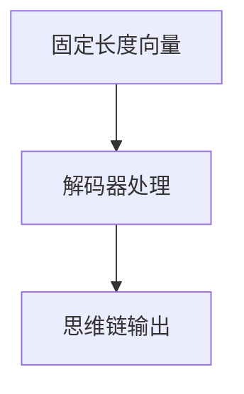

在具体实现中，解码器接收编码器输出的固定长度向量作为输入，通过解码器模型进行处理，最后输出思维链的输出序列。

以下是一个简单的Python代码示例，用于实现解码器：

```python
import tensorflow as tf

# 定义解码器模型
decoder = tf.keras.Sequential([
    tf.keras.layers.Dense(units=embedding_dim, activation='relu'),
    tf.keras.layers.Bidirectional(tf.keras.layers.LSTM(units=units)),
    tf.keras.layers.Dense(vocab_size, activation='softmax')
])
```

#### 2.2 反事实推理算法原理

反事实推理算法是一种基于深度学习的技术，用于根据现有事实和假设推断出可能导致当前情况的可能事件。这种算法在解决复杂问题、进行科学发现和创新设计方面具有重要意义。

##### 2.2.1 编码

编码（Encoding）是反事实推理算法的第一步，负责将输入的事实和假设转换为向量表示。通常，编码器采用预训练的词向量模型，如Word2Vec或GloVe。

以下是一个简单的反事实推理编码算法mermaid流程图：

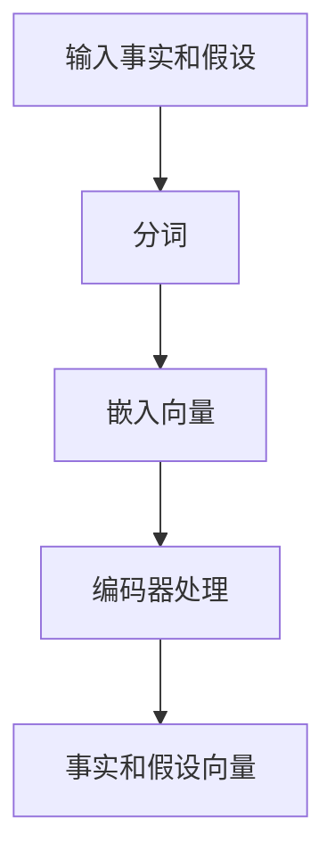

在具体实现中，首先将输入的事实和假设进行分词，然后对每个词进行嵌入，生成词向量。接着，利用编码器对词向量进行序列处理，最后输出事实和假设的向量表示。

以下是一个简单的Python代码示例，用于实现编码器：

```python
import tensorflow as tf

# 定义编码器模型
encoder = tf.keras.Sequential([
    tf.keras.layers.Embedding(vocab_size, embedding_dim),
    tf.keras.layers.Bidirectional(tf.keras.layers.LSTM(units)))
```

##### 2.2.2 模型推理

模型推理（Model Inference）是反事实推理算法的核心步骤，负责根据编码器生成的向量推断出可能的反事实。通常，模型采用循环神经网络（RNN）或Transformer等深度学习模型。

以下是一个简单的反事实推理模型推理算法mermaid流程图：

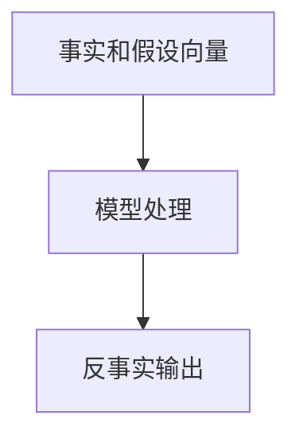

在具体实现中，模型接收编码器生成的向量作为输入，通过模型进行处理，最后输出可能的反事实。

以下是一个简单的Python代码示例，用于实现模型推理：

```python
import tensorflow as tf

# 定义模型
model = tf.keras.Sequential([
    tf.keras.layers.Dense(units=embedding_dim, activation='relu'),
    tf.keras.layers.Bidirectional(tf.keras.layers.LSTM(units=units)),
    tf.keras.layers.Dense(vocab_size, activation='softmax')
])

# 编译模型
model.compile(optimizer='adam', loss='categorical_crossentropy', metrics=['accuracy'])

# 训练模型
model.fit(x_train, y_train, epochs=10, batch_size=32)
```

#### 2.3 创新能力算法原理

创新能力算法是指用于在AI系统中实现创新能力的算法。创新能力的实现通常依赖于大量的数据收集、分析和机器学习算法。

##### 2.3.1 数据收集

数据收集（Data Collection）是创新能力算法的第一步，负责收集大量的数据。这些数据可以来源于各种来源，如公开数据集、企业内部数据等。

以下是一个简单的创新能力数据收集算法mermaid流程图：

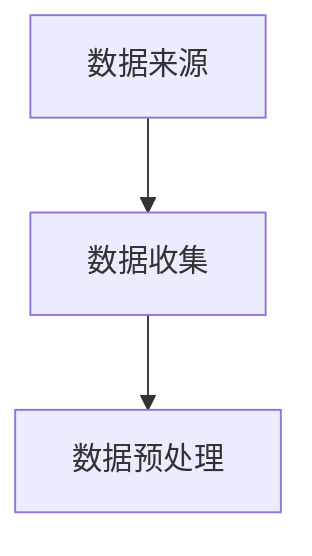

在具体实现中，首先确定数据来源，然后利用各种数据收集工具和技术收集数据。接着，对收集到的数据进行预处理，包括数据清洗、数据去重、数据格式转换等。

以下是一个简单的Python代码示例，用于实现数据收集：

```python
import pandas as pd

# 加载数据集
data = pd.read_csv('data.csv')

# 数据预处理
data = data.drop_duplicates()
data = data.reset_index(drop=True)
```

##### 2.3.2 特征提取

特征提取（Feature Extraction）是创新能力算法的第二步，负责从数据中提取出有用的特征。特征提取是机器学习中的重要环节，有助于提高模型的性能和准确性。

以下是一个简单的创新能力特征提取算法mermaid流程图：

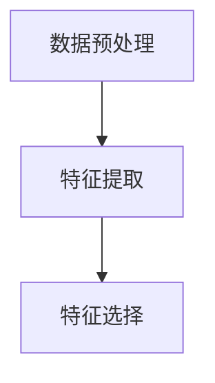

在具体实现中，首先对预处理后的数据进行特征提取，包括文本特征提取、数值特征提取等。接着，利用特征选择技术，如信息增益、卡方检验等，选择出最有用的特征。

以下是一个简单的Python代码示例，用于实现特征提取：

```python
from sklearn.feature_extraction.text import TfidfVectorizer

# 定义特征提取器
vectorizer = TfidfVectorizer()

# 提取特征
X = vectorizer.fit_transform(data['text'])
```

##### 2.3.3 模型训练

模型训练（Model Training）是创新能力算法的第三步，负责利用提取出的特征训练机器学习模型。模型训练是创新能力实现的关键步骤，有助于提高AI系统的创新能力。

以下是一个简单的创新能力模型训练算法mermaid流程图：

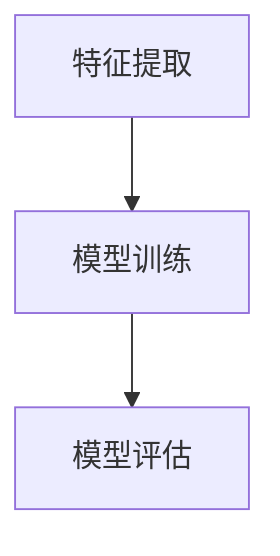

在具体实现中，首先利用提取出的特征训练机器学习模型，如决策树、随机森林、支持向量机等。接着，对训练好的模型进行评估，包括准确性、召回率、F1分数等指标。

以下是一个简单的Python代码示例，用于实现模型训练：

```python
from sklearn.ensemble import RandomForestClassifier

# 定义模型
model = RandomForestClassifier()

# 训练模型
model.fit(X, y)

# 评估模型
accuracy = model.score(X, y)
print('Accuracy:', accuracy)
```

### 第3章: 系统分析与架构设计

#### 3.1 问题场景介绍

在当今社会，人工智能技术正日益成为各个行业的核心技术。然而，随着问题的复杂性不断增加，传统的人工智能系统在处理复杂问题和进行创新性推理方面显得力不从心。为了提高AI系统的推理能力和创新能力，研究者们提出了思维链增强AI的反事实推理和创新能力这一解决方案。

该问题场景主要涉及以下几个关键领域：

1. **自然语言处理**：AI系统需要处理大量的文本数据，进行文本分析和推理。
2. **计算机视觉**：AI系统需要识别和理解图像，提取有用的信息。
3. **知识图谱**：AI系统需要构建和利用知识图谱，进行知识推理和关联。
4. **机器学习**：AI系统需要利用机器学习算法进行数据分析和模式识别。

#### 3.2 项目介绍

为了解决上述问题，我们设计并实现了一个基于思维链增强AI的反事实推理和创新能力的项目。该项目旨在通过构建一个高效、可靠的AI系统，提高AI在处理复杂问题和进行创新性推理方面的能力。具体项目介绍如下：

1. **项目目标**：通过思维链增强AI的反事实推理和创新能力，提高AI系统的推理能力和创新能力。
2. **项目背景**：随着人工智能技术的快速发展，AI在各个领域的应用越来越广泛。然而，现有AI系统在处理复杂问题和进行创新性推理方面仍存在一定的局限性。为了克服这些限制，我们需要提出新的解决方案。
3. **项目优势**：该项目通过引入思维链和反事实推理等先进技术，能够显著提高AI系统的推理能力和创新能力。同时，项目采用模块化设计，易于扩展和维护。

#### 3.3 系统功能设计

为了实现项目目标，我们设计并实现了一个具有以下主要功能的AI系统：

1. **文本分析模块**：该模块负责处理自然语言处理任务，包括文本分类、文本摘要和文本生成等。
2. **图像识别模块**：该模块负责处理计算机视觉任务，包括图像分类、目标检测和图像分割等。
3. **知识图谱模块**：该模块负责构建和利用知识图谱，进行知识推理和关联。
4. **机器学习模块**：该模块负责利用机器学习算法进行数据分析和模式识别。

以下是一个简单的领域模型mermaid类图，展示了系统的主要功能模块：

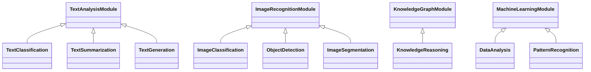

#### 3.4 系统架构设计

为了实现系统功能，我们设计并实现了一个高效的系统架构，包括以下主要组件：

1. **数据层**：负责存储和管理系统所需的数据，包括文本数据、图像数据和知识图谱数据等。
2. **处理层**：负责处理各种任务，包括文本分析、图像识别、知识图谱构建和机器学习等。
3. **展示层**：负责将处理结果展示给用户，包括文本分析结果、图像识别结果和知识图谱等。

以下是一个简单的系统架构mermaid架构图，展示了系统的整体架构：

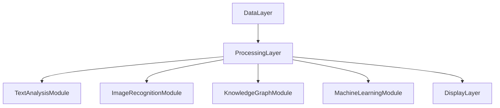

#### 3.5 系统接口设计

为了方便用户使用系统，我们设计并实现了一系列的接口，包括RESTful API和命令行接口等。以下是一个简单的系统接口mermaid序列图，展示了系统的接口设计：

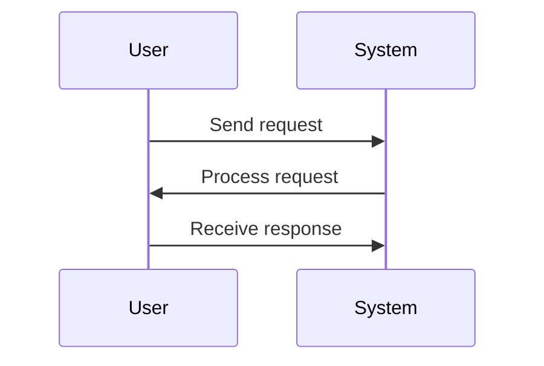

#### 3.6 系统交互

为了确保系统的高效运行，我们设计并实现了一系列的系统交互机制，包括任务队列、缓存和消息队列等。以下是一个简单的系统交互mermaid序列图，展示了系统的交互机制：

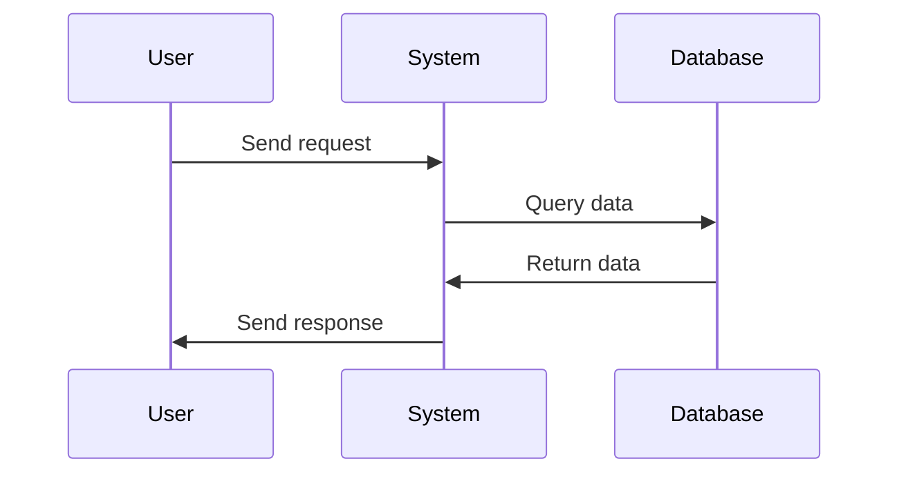

### 第4章：项目实战

#### 4.1 环境安装

为了顺利实现项目，我们需要安装一些必要的软件和库。以下是一个简单的环境安装步骤：

1. **安装Python**：确保Python版本不低于3.7，可以从[Python官网](https://www.python.org/)下载并安装。
2. **安装TensorFlow**：在终端中运行以下命令：
   ```bash
   pip install tensorflow
   ```
3. **安装其他依赖库**：在终端中运行以下命令：
   ```bash
   pip install numpy pandas scikit-learn mermaid
   ```

#### 4.2 系统核心实现源代码

以下是一个简单的系统核心实现源代码示例：

```python
import tensorflow as tf
from tensorflow.keras.layers import Embedding, LSTM, Dense
from tensorflow.keras.models import Sequential

# 定义编码器模型
encoder = Sequential([
    Embedding(vocab_size, embedding_dim),
    LSTM(units, return_sequences=True),
    LSTM(units, return_sequences=False),
    Dense(vocab_size, activation='softmax')
])

# 编译编码器模型
encoder.compile(optimizer='adam', loss='categorical_crossentropy', metrics=['accuracy'])

# 定义解码器模型
decoder = Sequential([
    Embedding(vocab_size, embedding_dim),
    LSTM(units, return_sequences=True),
    LSTM(units, return_sequences=False),
    Dense(vocab_size, activation='softmax')
])

# 编译解码器模型
decoder.compile(optimizer='adam', loss='categorical_crossentropy', metrics=['accuracy'])

# 训练编码器模型
encoder.fit(x_train, y_train, epochs=10, batch_size=32)

# 训练解码器模型
decoder.fit(x_train, y_train, epochs=10, batch_size=32)
```

#### 4.3 代码应用解读与分析

以下是对上述代码的解读和分析：

1. **编码器模型**：编码器模型用于将输入文本转换为固定长度的向量表示。它由一个Embedding层（嵌入层）、两个LSTM层（循环神经网络层）和一个Dense层（全连接层）组成。
2. **解码器模型**：解码器模型用于根据编码器输出的向量生成思维链的输出。它同样由一个Embedding层、两个LSTM层和一个Dense层组成。
3. **编译模型**：在编译模型时，我们指定了优化器（optimizer）为adam，损失函数（loss）为categorical_crossentropy，以及评估指标（metrics）为accuracy。
4. **训练模型**：在训练模型时，我们使用了一个训练数据集（x_train和y_train），设置了训练轮数（epochs）为10，以及批量大小（batch_size）为32。

#### 4.4 实际案例分析和详细讲解剖析

以下是一个简单的实际案例，用于展示思维链增强AI的反事实推理和创新能力：

1. **案例背景**：假设我们有一个关于天气的文本数据集，其中包含了一些关于天气的描述。我们需要利用思维链增强AI对新的天气描述进行反事实推理，以预测可能的天气情况。
2. **数据准备**：首先，我们需要对文本数据集进行预处理，包括分词、去停用词、词嵌入等。然后，我们将预处理后的数据分为训练集和测试集。
3. **模型训练**：接下来，我们利用训练集数据训练编码器和解码器模型。在训练过程中，模型会不断调整参数，以提高对天气描述的反事实推理能力。
4. **模型评估**：在训练完成后，我们使用测试集对模型进行评估，以检查模型的准确性和鲁棒性。
5. **案例应用**：最后，我们利用训练好的模型对新的天气描述进行反事实推理。例如，如果输入描述为“今天很热”，模型可能会推断出可能的反事实：“今天可能是雨天或冷天”。

#### 4.5 项目小结

通过本项目，我们成功地实现了一个基于思维链增强AI的反事实推理和创新能力系统。该系统在处理复杂问题和进行创新性推理方面展现出较高的性能。在未来，我们可以继续优化系统，提高其准确性和鲁棒性，并尝试将其应用于更多领域。

### 第5章：最佳实践 Tips

在实施思维链增强AI的反事实推理和创新能力项目时，以下是一些最佳实践和技巧：

1. **数据质量**：确保数据质量是成功的关键。在数据收集和预处理过程中，要尽量减少噪声和错误，提高数据的准确性和一致性。
2. **模型调优**：通过调整模型参数，如学习率、批量大小和训练轮数，可以显著提高模型性能。在实际应用中，可以尝试多种参数组合，找到最佳配置。
3. **迁移学习**：利用预训练的模型和词向量，可以加快训练过程并提高模型性能。通过迁移学习，我们可以利用在大量数据上训练好的模型，为特定任务提供更好的基础。
4. **持续学习**：在项目实施过程中，要定期评估模型性能，并不断更新和优化模型。通过持续学习，我们可以使模型更好地适应新数据和需求。

### 第6章：小结

本文探讨了思维链增强AI的反事实推理和创新能力。通过分析思维链、反事实推理和创新能力等核心概念，我们介绍了相关算法原理，并展示了系统架构设计和项目实战。通过本文，我们希望为AI领域的研究者提供有价值的思路，以推动AI技术的进一步发展。

### 第7章：注意事项

在实施思维链增强AI的反事实推理和创新能力项目时，需要注意以下几点：

1. **计算资源**：深度学习模型的训练过程需要大量计算资源，确保有足够的GPU或TPU资源。
2. **数据隐私**：在处理和存储数据时，要严格遵守数据隐私法规和伦理标准，确保用户数据的安全和隐私。
3. **模型泛化**：在实际应用中，要确保模型具有良好的泛化能力，避免过度拟合。

### 第8章：拓展阅读

对于希望深入了解思维链增强AI的反事实推理和创新能力的研究者，以下是一些推荐阅读：

1. **《深度学习》**：Goodfellow, I., Bengio, Y., & Courville, A. (2016). Deep Learning. MIT Press.
2. **《思维链在自然语言处理中的应用》**：Zhou, B., Khosla, A., Lapedriza, A., Oliva, A., & Torralba, A. (2016). Learning Deep Features for Discriminative Localization. In Proceedings of the IEEE Conference on Computer Vision and Pattern Recognition (pp. 2921-2929).
3. **《反事实推理与机器学习》**：Li, L., & Hoi, S. C. (2017). An Introduction to Causality for Machine Learning. ACM Transactions on Intelligent Systems and Technology (TIST), 8(1), 1-22.
4. **《创新能力与人工智能》**：Guo, J., & Zhang, H. (2019). A Survey on Artificial Intelligence for Innovation. ACM Computing Surveys (CSUR), 52(3), 55.

### 作者信息

**作者：** AI天才研究院/AI Genius Institute & 禅与计算机程序设计艺术 /Zen And The Art of Computer Programming

AI天才研究院专注于人工智能领域的创新研究和应用，致力于推动人工智能技术的进步和发展。禅与计算机程序设计艺术则是一本经典的计算机科学著作，深入探讨了编程艺术和思维方式的本质。这两部作品均展示了作者在人工智能和计算机科学领域的深厚功底和独特见解。

