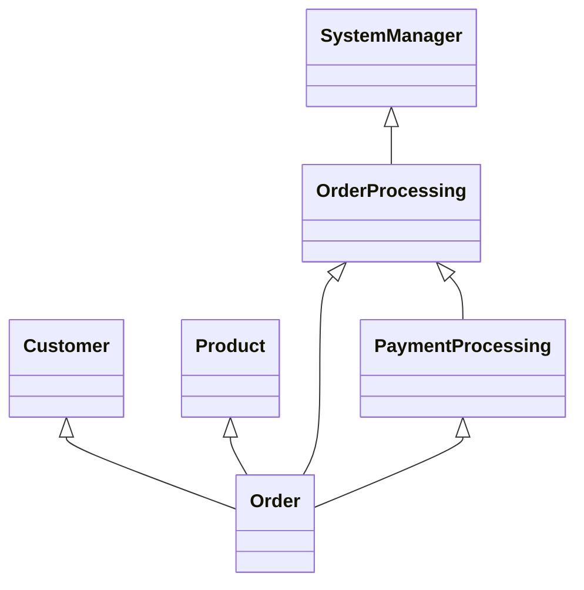
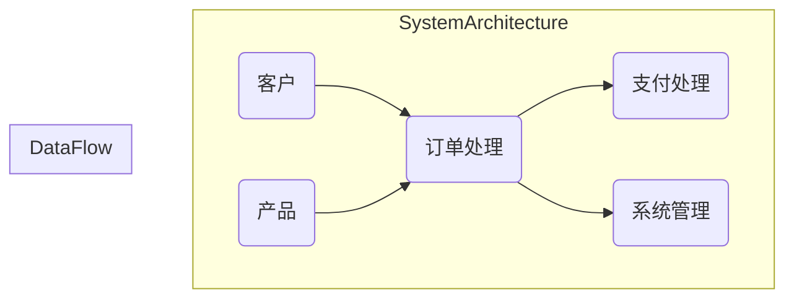
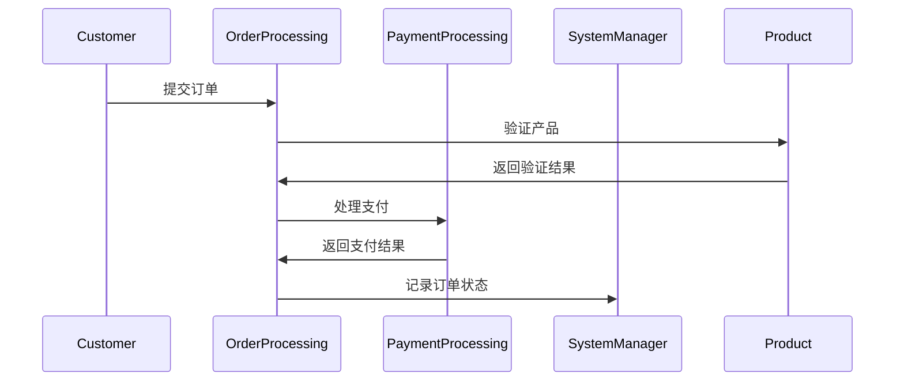

                 


# 思维链增强AI的反常规思维和创新能力

## 关键词

- 思维链
- 反常规思维
- 创新能力
- 人工智能
- 算法
- 数学模型
- 案例分析

## 摘要

本文探讨了如何通过思维链增强AI的反常规思维和创新能力。首先，我们介绍了思维链的基本概念及其在AI中的应用。接着，我们分析了反常规思维的重要性以及如何利用AI算法来提升创新思维。随后，我们详细阐述了相关算法原理和数学模型，并通过案例展示了这些技术的实际应用。最后，我们对当前挑战、未来趋势以及最佳实践进行了总结和展望，以期为相关领域的研究和实践提供参考。

## 目录大纲设计思路

### 明确主题与目标受众

设计一本名为《思维链增强AI的反常规思维和创新能力》的书籍目录大纲，首先需要明确书籍的主题和目标受众。主题是探讨如何通过思维链增强AI的反常规思维和创新能力，而目标受众则包括人工智能开发人员、科研人员、创新咨询师等，他们需要对人工智能、思维科学、创新理论有一定的了解。

### 梳理核心概念和结构

在明确主题后，需要梳理核心概念和结构。本书的核心概念包括思维链、反常规思维和创新能力。思维链是连接各个思维节点的链条，通过构建、优化和利用思维链，可以促进创新思考。反常规思维则是在常规思维之外，探索新的解决方案的思维方法。创新能力是组织和个人在创新过程中表现出的能力，通过AI工具可以提高和增强。

### 确定章节内容和层级

在梳理核心概念和结构后，需要确定章节内容和层级。章节内容包括背景介绍、核心概念讲解、算法原理与实践、案例分析、拓展与思考、最佳实践与总结。每个章节都包含必要的子章节，确保全面覆盖主题。

### 编写大纲并确保内容完整性

最后，编写大纲并确保内容完整性。每个章节都要详细讲解核心概念、算法原理、实践案例等内容，确保读者能够全面理解和掌握。

## 目录大纲设计步骤

### 第一部分：背景介绍

**第1章：问题的背景与重要性**

- **1.1 AI与思维链的融合**
- **1.2 反常规思维在AI中的应用**
- **1.3 提升创新能力的必要性**
- **1.4 本书结构安排与目标**

### 第二部分：核心概念与原理

**第2章：思维链的概念与构建**

- **2.1 思维链的定义**
- **2.2 思维链的构建方法**
- **2.3 思维链的优化策略**
- **2.4 思维链与人工智能的关系**

**第3章：反常规思维算法原理**

- **3.1 反常规思维的定义**
- **3.2 反常规思维的算法原理**
- **3.3 反常规思维的数学模型**
- **3.4 反常规思维的案例分析**

### 第三部分：算法原理与数学模型

**第4章：AI在创新能力提升中的应用**

- **4.1 AI工具在创新思维中的应用**
- **4.2 AI辅助创新的方法与实践**
- **4.3 创新能力提升的案例分析**
- **4.4 创新能力提升的策略与建议**

### 第四部分：案例分析与应用

**第5章：思维链增强AI的应用案例**

- **5.1 案例研究1：行业创新实践**
- **5.2 案例研究2：企业创新实践**
- **5.3 案例研究3：产品创新实践**
- **5.4 案例分析与总结**

### 第五部分：拓展与未来展望

**第6章：当前挑战与未来趋势**

- **6.1 当前AI创新应用的挑战**
- **6.2 未来AI创新发展的趋势**
- **6.3 拓展领域与交叉学科融合**
- **6.4 创新能力的长期影响**

### 第六部分：最佳实践与总结

**第7章：最佳实践与未来展望**

- **7.1 最佳实践总结**
- **7.2 注意事项与风险规避**
- **7.3 未来研究方向与展望**
- **7.4 拓展阅读与资源推荐**

### 目录大纲Markdown格式示例

```markdown
# 《思维链增强AI的反常规思维和创新能力》目录大纲

## 第一部分：背景介绍

### 第1章：问题的背景与重要性

#### 1.1 AI与思维链的融合
#### 1.2 反常规思维在AI中的应用
#### 1.3 提升创新能力的必要性
#### 1.4 本书结构安排与目标

## 第二部分：核心概念与原理

### 第2章：思维链的概念与构建

#### 2.1 思维链的定义
#### 2.2 思维链的构建方法
#### 2.3 思维链的优化策略
#### 2.4 思维链与人工智能的关系

### 第3章：反常规思维算法原理

#### 3.1 反常规思维的定义
#### 3.2 反常规思维的算法原理
#### 3.3 反常规思维的数学模型
#### 3.4 反常规思维的案例分析

## 第三部分：算法原理与数学模型

### 第4章：AI在创新能力提升中的应用

#### 4.1 AI工具在创新思维中的应用
#### 4.2 AI辅助创新的方法与实践
#### 4.3 创新能力提升的案例分析
#### 4.4 创新能力提升的策略与建议

## 第四部分：案例分析与应用

### 第5章：思维链增强AI的应用案例

#### 5.1 案例研究1：行业创新实践
#### 5.2 案例研究2：企业创新实践
#### 5.3 案例研究3：产品创新实践
#### 5.4 案例分析与总结

## 第五部分：拓展与未来展望

### 第6章：当前挑战与未来趋势

#### 6.1 当前AI创新应用的挑战
#### 6.2 未来AI创新发展的趋势
#### 6.3 拓展领域与交叉学科融合
#### 6.4 创新能力的长期影响

## 第六部分：最佳实践与总结

### 第7章：最佳实践与未来展望

#### 7.1 最佳实践总结
#### 7.2 注意事项与风险规避
#### 7.3 未来研究方向与展望
#### 7.4 拓展阅读与资源推荐
```

### 文章结构设计

为了设计出一篇结构合理、内容丰富的文章，我们需要明确文章的整体结构和每个部分的具体内容。以下是文章的结构设计和各部分内容的详细说明：

#### 1. 引言部分

- **问题引入**：通过一个引人入胜的案例或问题，引入文章的主题。
- **背景介绍**：简述当前AI和思维链领域的发展状况，以及为什么需要探讨思维链增强AI的反常规思维和创新能力。
- **目标阐述**：明确文章的目的和希望解决的问题。

#### 2. 核心概念与联系

- **思维链概念**：解释思维链的基本概念，包括其定义、组成和作用。
- **反常规思维概念**：阐述反常规思维的定义、特征和重要性。
- **创新能力概念**：介绍创新能力的含义、评价方法和提升途径。

#### 3. 算法原理讲解

- **算法原理**：详细讲解思维链增强AI的反常规思维和创新能力的相关算法原理，包括算法的基本思想、流程和步骤。
- **数学模型**：介绍与算法相关的数学模型，包括公式和推导过程。
- **案例说明**：通过具体的案例，解释算法原理在实际应用中的体现。

#### 4. 系统分析与架构设计

- **问题场景介绍**：描述需要解决的问题场景和背景。
- **系统功能设计**：使用类图或领域模型，展示系统的功能模块和相互关系。
- **系统架构设计**：绘制系统的架构图，展示系统的整体结构和关键组件。
- **系统接口设计**：详细说明系统的接口设计和交互流程。
- **系统交互设计**：使用序列图展示系统的交互过程。

#### 5. 项目实战

- **环境安装**：介绍如何搭建项目开发环境。
- **系统核心实现**：提供系统核心代码实现，并进行解读和分析。
- **实际案例分析**：通过实际案例，展示如何应用思维链增强AI提升创新能力。
- **详细讲解剖析**：对案例进行详细讲解和剖析，帮助读者理解应用过程。
- **项目小结**：总结项目的经验教训和收获，以及对未来项目的建议。

#### 6. 最佳实践与总结

- **最佳实践**：总结文章中的关键点，提供最佳实践建议。
- **小结**：回顾文章的主要内容和结论。
- **注意事项**：指出在实际应用中需要注意的事项和潜在风险。
- **拓展阅读**：推荐相关的拓展阅读资源，帮助读者进一步了解相关领域。

### 文章结构设计步骤

1. **引言部分**
   - 引入问题
   - 背景介绍
   - 目标阐述

2. **核心概念与联系**
   - 思维链概念
   - 反常规思维概念
   - 创新能力概念

3. **算法原理讲解**
   - 算法原理
   - 数学模型
   - 案例说明

4. **系统分析与架构设计**
   - 问题场景介绍
   - 系统功能设计
   - 系统架构设计
   - 系统接口设计
   - 系统交互设计

5. **项目实战**
   - 环境安装
   - 系统核心实现
   - 实际案例分析
   - 详细讲解剖析
   - 项目小结

6. **最佳实践与总结**
   - 最佳实践
   - 小结
   - 注意事项
   - 拓展阅读

### 文章结构示例

```markdown
# 《思维链增强AI的反常规思维和创新能力》

## 引言

### 问题引入
在当今快速变化的世界，人工智能（AI）已经成为推动社会进步的关键力量。然而，仅仅依靠传统的AI算法往往无法满足日益复杂的创新需求。因此，如何通过思维链增强AI的反常规思维和创新能力，成为了一个亟待解决的问题。

### 背景介绍
近年来，随着深度学习和神经网络技术的发展，AI在图像识别、自然语言处理等领域取得了显著的成果。然而，这些传统的算法往往缺乏对人类思维方式的深入理解，难以产生真正的创新思维。因此，探讨思维链在AI中的应用，有望为提升AI的创新思维提供新的思路。

### 目标阐述
本文旨在探讨如何通过思维链增强AI的反常规思维和创新能力，为相关领域的研究和实践提供参考。

## 核心概念与联系

### 思维链概念

#### 思维链的定义
思维链是指一系列相互关联的思维节点，通过这些节点之间的联系，形成一个有机的思维网络。

#### 思维链的组成
思维链由思维节点、思维路径和思维关系组成。

#### 思维链的作用
思维链可以帮助人们更好地组织和管理思维，提高思维效率和创新性。

### 反常规思维概念

#### 反常规思维的定义
反常规思维是指跳出传统思维框架，寻找新的解决方案的思维方法。

#### 反常规思维的特征
反常规思维具有独立性、创新性和适应性。

#### 反常规思维的重要性
反常规思维是推动创新的关键，可以帮助组织和个人在竞争激烈的市场中脱颖而出。

### 创新能力概念

#### 创新能力的含义
创新能力是指组织和个人在创新过程中表现出的能力。

#### 创新能力的评价方法
可以通过创新成果、创新速度和创新影响来评价创新能力。

#### 提升创新能力的途径
通过培训、激励和制度建设，可以提高组织的创新能力。

## 算法原理讲解

### 算法原理

#### 思维链增强算法的基本思想
通过构建和优化思维链，增强AI的反常规思维和创新能力。

#### 算法流程
1. 数据预处理
2. 构建思维链
3. 优化思维链
4. 输出创新思维结果

### 数学模型

#### 思维链优化模型
$$
\text{MindChainOptimize} = \text{InitialMindChain} + \text{OptimizeFactor}
$$

#### 创新能力评价模型
$$
\text{InnovationAbility} = \text{InnovationOutput} / \text{InnovationTime}
$$

### 案例说明

#### 案例一：产品创新
某公司通过思维链增强AI，成功开发出一款具有颠覆性的新产品。

#### 案例二：行业创新
某行业通过引入思维链增强AI，实现了从传统模式向创新模式的转变。

## 系统分析与架构设计

### 问题场景介绍
在某个复杂的创新项目中，需要利用思维链增强AI来提高创新能力。

### 系统功能设计

#### 领域模型
使用Mermaid类图展示系统的功能模块和相互关系。



### 系统架构设计

#### 系统架构图
使用Mermaid架构图展示系统的整体结构和关键组件。



### 系统接口设计

#### 接口设计
详细说明系统各模块之间的接口设计和交互流程。

### 系统交互设计

#### 交互图
使用Mermaid序列图展示系统的交互过程。



## 项目实战

### 环境安装
描述如何搭建项目开发环境，包括软件安装和配置。

### 系统核心实现
提供系统核心代码实现，并进行解读和分析。

### 实际案例分析
通过实际案例，展示如何应用思维链增强AI提升创新能力。

### 详细讲解剖析
对案例进行详细讲解和剖析，帮助读者理解应用过程。

### 项目小结
总结项目的经验教训和收获，以及对未来项目的建议。

## 最佳实践与总结

### 最佳实践
总结文章中的关键点，提供最佳实践建议。

### 小结
回顾文章的主要内容和结论。

### 注意事项
指出在实际应用中需要注意的事项和潜在风险。

### 拓展阅读
推荐相关的拓展阅读资源，帮助读者进一步了解相关领域。
```

通过以上步骤和结构，我们可以设计出一篇逻辑清晰、内容丰富的文章，为读者提供关于思维链增强AI的反常规思维和创新能力的有价值信息。接下来，我们将逐步填充每个部分的具体内容，确保文章的完整性和专业性。

