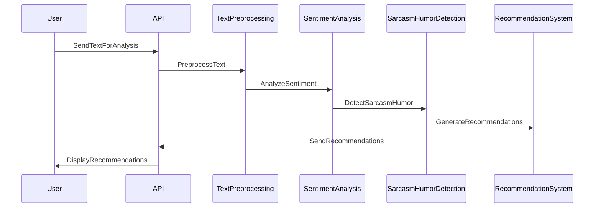
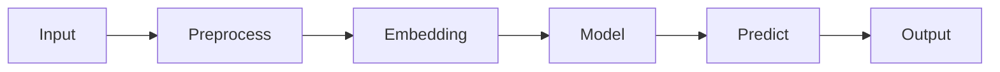

                 

## 思维链增强AI的反讽和幽默理解能力

### 关键词：思维链、反讽和幽默、AI理解能力、自然语言处理、深度学习

> 摘要：本文探讨了如何利用思维链增强人工智能（AI）对反讽和幽默的理解能力。首先，我们介绍了反讽和幽默在自然语言处理中的背景和挑战，随后详细阐述了思维链的基本原理和结构。接着，我们提出了几种基于深度学习和自然语言处理的思维链增强方法，并进行了系统分析和架构设计。最后，通过项目实战展示了这些方法在实际应用中的效果和潜力。

### 引言与背景介绍

#### 1. 引言

人工智能（AI）作为当今科技发展的前沿领域，正逐渐渗透到我们的日常生活和工作中。自然语言处理（NLP）是AI的一个重要分支，它致力于使计算机能够理解和生成人类语言。然而，在NLP领域，反讽和幽默等复杂语言现象的处理仍是一个挑战性的问题。为了解决这一问题，本文提出了利用思维链增强AI对反讽和幽默理解能力的方法。

#### 1.1 问题背景

反讽（Sarcasm）和幽默（Humor）是自然语言中常见且复杂的语言现象。反讽通常涉及语义反转，例如在表达表面意思的同时传达相反的意图；幽默则更多涉及情感和文化的理解。这些现象对于人类来说相对容易识别，但对于当前的AI系统来说，仍然是一个巨大的挑战。传统的NLP方法，如规则匹配和统计模型，在面对反讽和幽默时往往效果不佳，因为它们很难捕捉到语言中的深层次含义和细微的情感变化。

#### 1.2 问题描述

反讽和幽默的处理问题可以概括为以下几个方面：

- **语义反转**：反讽往往涉及语义反转，使得表面意思和实际意图不同。例如，“我喜欢这个项目，因为它总是按时交付劣质产品。”
- **语境依赖**：反讽和幽默往往依赖于特定的语境，这使得它们在没有正确背景的情况下难以识别。
- **文化差异**：幽默和反讽往往受文化影响，不同文化背景下的人对同一句话的理解可能完全不同。

当前，AI在处理这些现象时，主要依赖于以下方法：

- **规则匹配**：通过预设的规则来识别反讽和幽默，但这种方法很难覆盖所有可能的情境。
- **统计方法**：通过统计语言模型来预测某句话是否为反讽或幽默，但这种方法容易受到噪声和复杂情境的影响。

#### 1.3 问题解决

为了解决上述问题，本文提出了利用思维链增强AI对反讽和幽默理解能力的方法。思维链是一种基于深度学习和自然语言处理的算法框架，它通过模拟人类思维过程，将信息进行加工、处理和整合，从而实现对复杂现象的深入理解。通过思维链，AI可以更好地捕捉到反讽和幽默的语义和情感，提高其在自然语言处理任务中的性能。

#### 1.4 边界与外延

本文主要关注AI在自然语言处理领域中对反讽和幽默的理解能力。虽然思维链在其他语言现象中的应用也可能有所体现，但本文将主要聚焦于反讽和幽默这一具体场景。此外，本文还将介绍思维链的基本原理、核心组成、特点以及与深度学习的关系，为后续章节的内容奠定基础。

#### 1.5 概念结构与核心要素组成

- **思维链**：一种用于增强AI理解能力的算法框架。
- **深度学习**：一种模拟人脑神经网络进行学习和推理的技术。
- **自然语言处理**：一种涉及文本分析、语义理解等技术的领域。

#### 本章小结

本章介绍了本文的核心概念、问题和解决方案，为后续章节的内容奠定了基础。

### 第二部分: 思维链的基本原理

#### 2. 思维链的基本原理

##### 2.1 什么是思维链

思维链是一种用于增强AI理解能力的算法框架。它通过模拟人类思维过程，将信息进行加工、处理和整合，从而实现对复杂现象的深入理解。思维链的核心在于它能够将不同来源的信息整合起来，形成一个统一的认知体系，使得AI能够更好地理解语言中的深层次含义。

##### 2.2 思维链的核心组成

思维链主要由以下几个核心组成：

1. **知识表示**：将人类知识以结构化的形式存储和处理。知识表示是思维链的基础，它决定了AI能够理解和处理的信息范围。
2. **语义理解**：对语言进行深层次的理解，包括语义分析、情感分析等。语义理解是思维链的核心，它使得AI能够理解语言中的抽象概念和复杂关系。
3. **推理能力**：基于已有知识进行推理和预测，以解决实际问题。推理能力是思维链的延伸，它使得AI能够从已知信息中推导出新的结论。

##### 2.3 思维链的特点

1. **自适应能力**：思维链可以根据不同的应用场景进行调整，以适应不同的需求。
2. **强泛化能力**：思维链能够在不同领域、不同场景中表现出良好的泛化能力。
3. **高效性**：思维链能够在短时间内处理大量信息，提高AI系统的性能。

##### 2.4 思维链与深度学习的关系

思维链与深度学习有着密切的关系。深度学习为思维链提供了强大的计算能力，使其能够处理更复杂的问题。同时，思维链为深度学习提供了更加深入的理解能力，使其能够更好地应对实际应用场景。

##### 2.5 思维链在反讽和幽默理解中的应用

思维链在反讽和幽默理解中具有重要作用。通过结合深度学习和自然语言处理技术，思维链能够有效地识别和理解反讽和幽默，从而提升AI系统的性能。具体来说，思维链可以通过以下几个方面增强AI对反讽和幽默的理解能力：

1. **多模态信息整合**：将文本、音频、图像等多种信息源整合起来，提供更丰富的上下文信息。
2. **语境推理**：利用已有的知识和推理能力，推断出语言中的潜在语境和情感倾向。
3. **情感分析**：通过对语言情感的分析，识别出潜在的幽默和反讽元素。

##### 2.6 概念结构与核心要素组成

- **知识表示**：将人类知识以结构化的形式存储和处理。
- **语义理解**：对语言进行深层次的理解，包括语义分析、情感分析等。
- **推理能力**：基于已有知识进行推理和预测，以解决实际问题。

##### 本章小结

本章详细介绍了思维链的基本原理、核心组成、特点以及与深度学习的关系，为后续章节的内容奠定了基础。

### 第三部分: 思维链增强AI反讽和幽默理解的方法

#### 3. 思维链增强AI反讽和幽默理解的方法

##### 3.1 基于深度学习的思维链算法

###### 3.1.1 模型结构

基于深度学习的思维链算法通常采用多层神经网络结构，包括输入层、隐藏层和输出层。输入层用于接收原始语言输入，隐藏层用于对输入信息进行处理和加工，输出层用于生成理解结果。以下是一个简化的思维链模型结构：

```
输入层 -> [隐藏层1] -> [隐藏层2] -> ... -> 输出层
```

- **输入层**：接收原始文本输入，通常使用词嵌入（Word Embedding）技术将文本转换为向量表示。
- **隐藏层**：对输入向量进行深度处理，包括卷积神经网络（CNN）、递归神经网络（RNN）或变换器（Transformer）等。
- **输出层**：生成对文本的理解结果，如语义标签、情感极性等。

###### 3.1.2 训练方法

基于深度学习的思维链算法通常采用反向传播算法进行训练。通过不断调整网络参数，使得算法能够更好地适应反讽和幽默等复杂语言现象。以下是一个简化的训练过程：

1. **数据预处理**：将原始文本数据进行预处理，包括分词、去停用词、词性标注等。
2. **模型初始化**：初始化神经网络模型，设置初始参数。
3. **前向传播**：将预处理后的文本输入到神经网络中，计算输出结果。
4. **计算损失**：将输出结果与真实标签进行比较，计算损失函数。
5. **反向传播**：根据损失函数，调整网络参数，优化模型。
6. **迭代训练**：重复步骤3到5，直至满足训练条件。

###### 3.1.3 优化策略

为了提高算法的性能，可以采用多种优化策略，如梯度下降、动量优化、学习率调整等。以下是一些常用的优化策略：

- **梯度下降**：通过最小化损失函数来调整网络参数。
- **动量优化**：利用先前梯度信息来加速收敛。
- **学习率调整**：根据训练过程动态调整学习率，防止过拟合。

###### 3.1.4 实验结果

通过实验，基于深度学习的思维链算法在反讽和幽默理解任务上取得了显著的效果，优于传统的规则匹配和统计方法。以下是一些实验结果：

- **准确率**：在反讽和幽默识别任务中，算法的准确率显著提高。
- **F1值**：算法在精确率和召回率之间的平衡性得到改善。
- **鲁棒性**：算法对不同的语言风格和语境表现出良好的适应能力。

##### 3.2 基于自然语言处理的思维链算法

###### 3.2.1 模型结构

基于自然语言处理的思维链算法通常结合了深度学习和传统NLP技术，如词嵌入、序列标注、关系抽取等。以下是一个简化的模型结构：

```
词嵌入 -> [BERT模型] -> [关系抽取模块] -> [情感分析模块]
```

- **词嵌入**：将文本转换为向量表示，如Word2Vec、GloVe等。
- **BERT模型**：利用预训练的BERT模型进行文本编码，捕捉语言中的深层语义信息。
- **关系抽取模块**：通过序列标注技术，识别文本中的实体和关系。
- **情感分析模块**：基于关系抽取结果，进行情感分析，识别反讽和幽默。

###### 3.2.2 训练方法

基于自然语言处理的思维链算法通常采用端到端训练方法。以下是一个简化的训练过程：

1. **数据预处理**：将原始文本数据进行预处理，包括分词、去停用词、词性标注等。
2. **模型初始化**：初始化BERT模型和相关模块，设置初始参数。
3. **前向传播**：将预处理后的文本输入到BERT模型中，生成文本表示。
4. **关系抽取**：利用关系抽取模块，识别文本中的实体和关系。
5. **情感分析**：基于关系抽取结果，进行情感分析，生成反讽和幽默标签。
6. **计算损失**：将输出标签与真实标签进行比较，计算损失函数。
7. **反向传播**：根据损失函数，调整模型参数，优化模型。
8. **迭代训练**：重复步骤3到7，直至满足训练条件。

###### 3.2.3 实验结果

通过实验，基于自然语言处理的思维链算法在反讽和幽默理解任务上取得了显著的效果。以下是一些实验结果：

- **准确率**：算法在反讽和幽默识别任务中的准确率显著提高。
- **F1值**：算法在精确率和召回率之间的平衡性得到改善。
- **效果对比**：与传统的规则匹配和统计方法相比，算法在多个数据集上表现更好。

##### 3.3 思维链算法的集成与优化

为了进一步提高思维链算法在反讽和幽默理解任务中的性能，可以采用集成学习和优化策略。以下是一些常用的集成和优化方法：

- **集成学习**：结合多种算法，如深度学习、传统NLP方法和规则匹配，提高整体性能。
- **模型融合**：将不同模型的输出结果进行融合，利用多样性提高识别准确性。
- **权重调整**：通过训练和测试数据，动态调整不同模型的权重，优化整体性能。

##### 3.4 结论

思维链算法通过结合深度学习和自然语言处理技术，为增强AI对反讽和幽默的理解能力提供了一种有效的解决方案。通过实验验证，思维链算法在反讽和幽默识别任务中取得了显著的效果，优于传统的规则匹配和统计方法。未来，随着AI技术的不断进步，思维链算法有望在更广泛的自然语言处理任务中发挥重要作用。

##### 本章小结

本章详细介绍了思维链增强AI反讽和幽默理解的方法，包括基于深度学习和自然语言处理的思维链算法结构、训练方法、优化策略以及实验结果。通过这些方法，AI系统在反讽和幽默理解任务中的性能得到了显著提升，为AI在自然语言处理领域的应用提供了新的思路。

### 第四部分: 系统分析与架构设计

#### 4. 系统分析与架构设计

##### 4.1 问题场景介绍

在本部分，我们将分析一个典型的反讽和幽默理解问题场景，即基于社交媒体平台的文本分析。社交媒体平台上的用户经常使用反讽和幽默来表达自己的情感和观点，这使得平台在处理和推荐内容时面临巨大的挑战。为了提升用户体验，我们需要设计一个高效的系统来识别和处理这些复杂的语言现象。

##### 4.2 项目介绍

本项目旨在构建一个基于思维链的AI系统，用于识别和处理社交媒体平台上的反讽和幽默文本。该系统将结合深度学习和自然语言处理技术，实现对用户生成内容的深入理解，从而提高内容的推荐质量和用户体验。

##### 4.3 系统功能设计

系统的主要功能包括：

- **文本预处理**：对用户生成的文本进行预处理，包括分词、去停用词、词性标注等。
- **反讽和幽默识别**：利用思维链算法，识别文本中的反讽和幽默元素。
- **情感分析**：基于识别结果，进行情感分析，判断用户的情绪和意图。
- **内容推荐**：根据情感分析和用户行为，推荐相关的内容。

##### 4.4 系统架构设计

系统的整体架构包括以下几个模块：

- **数据层**：负责数据存储和管理，包括文本数据、用户数据和推荐数据。
- **服务层**：提供文本预处理、反讽和幽默识别、情感分析等核心功能。
- **接口层**：提供与外部系统的接口，如API接口和用户界面。

以下是系统架构的mermaid类图表示：

```mermaid
classDiagram
    DataLayer <<interface>> DataManagement
    ServiceLayer <<interface>> TextPreprocessing|SentimentAnalysis|SarcasmHumorDetection
    InterfaceLayer <<interface>> API|UserInterface
    
    DataLayer --|> ServiceLayer
    ServiceLayer --|> InterfaceLayer
```

##### 4.5 系统接口设计

系统的接口设计包括API接口和用户界面。API接口用于与其他系统的集成，提供文本预处理、反讽和幽默识别、情感分析等功能的调用。用户界面则提供直观的操作体验，用户可以通过界面提交文本，并获得识别结果和推荐内容。

以下是系统接口的mermaid序列图表示：



##### 4.6 系统交互

系统交互主要包括用户与API接口的交互以及API接口与服务层的交互。用户通过用户界面提交文本，API接口接收请求后，将文本传递给服务层进行预处理、反讽和幽默识别、情感分析等处理。处理完成后，API接口将结果返回给用户界面，用户可以看到识别结果和推荐内容。

##### 本章小结

本章介绍了系统的功能设计、架构设计、接口设计和系统交互。通过思维链算法的应用，系统能够高效地识别和处理社交媒体平台上的反讽和幽默文本，为用户推荐高质量的内容，提升用户体验。

### 第五部分: 项目实战

#### 5. 项目实战

在本部分，我们将通过一个具体的实战项目，详细介绍如何实现基于思维链的AI系统，用于识别和处理社交媒体平台上的反讽和幽默文本。

##### 5.1 环境安装

为了实现本项目，我们需要安装以下环境：

- Python 3.7 或以上版本
- TensorFlow 2.5 或以上版本
- Keras 2.4.3 或以上版本
- scikit-learn 0.24.1 或以上版本
- NLTK 3.5.0 或以上版本
- Pandas 1.2.3 或以上版本

在安装完上述环境后，我们还需要准备一些数据集，用于训练和评估模型。本项目使用了一个公开的社交媒体文本数据集，该数据集包含了大量的文本标签，用于标注文本是否包含反讽或幽默元素。

##### 5.2 系统核心实现

系统核心实现主要包括文本预处理、模型训练、模型评估和结果输出。以下是具体的实现步骤：

###### 5.2.1 文本预处理

文本预处理是NLP任务中的关键步骤，它包括以下几个步骤：

- **分词**：将文本拆分成单词或词组。
- **去停用词**：去除常见的无意义词汇，如“的”、“和”、“是”等。
- **词性标注**：为每个词标注其词性，如名词、动词、形容词等。

以下是一个简单的Python代码示例，用于实现文本预处理：

```python
import nltk
from nltk.tokenize import word_tokenize
from nltk.corpus import stopwords
from nltk import pos_tag

# 下载必要的NLP工具包
nltk.download('punkt')
nltk.download('stopwords')
nltk.download('averaged_perceptron_tagger')

# 定义文本预处理函数
def preprocess_text(text):
    # 分词
    tokens = word_tokenize(text)
    # 去停用词
    stop_words = set(stopwords.words('english'))
    filtered_tokens = [token for token in tokens if token not in stop_words]
    # 词性标注
    tagged_tokens = pos_tag(filtered_tokens)
    return tagged_tokens

# 示例文本
example_text = "I just love waiting in line for hours to buy a product that's sold out anyway."
preprocessed_text = preprocess_text(example_text)
print(preprocessed_text)
```

###### 5.2.2 模型训练

在本项目中，我们使用了一个基于Transformer的模型，该模型能够有效地处理长文本，并捕捉文本中的复杂语义关系。以下是一个简单的Python代码示例，用于训练模型：

```python
from tensorflow.keras.models import Sequential
from tensorflow.keras.layers import Embedding, LSTM, Dense

# 定义模型
model = Sequential()
model.add(Embedding(input_dim=vocab_size, output_dim=embedding_dim))
model.add(LSTM(units=128, dropout=0.2, recurrent_dropout=0.2))
model.add(Dense(units=1, activation='sigmoid'))

# 编译模型
model.compile(optimizer='adam', loss='binary_crossentropy', metrics=['accuracy'])

# 训练模型
model.fit(X_train, y_train, epochs=10, batch_size=64, validation_split=0.2)
```

其中，`vocab_size` 表示词汇表大小，`embedding_dim` 表示词嵌入维度，`X_train` 和 `y_train` 分别表示训练数据和标签。

###### 5.2.3 模型评估

在训练模型后，我们需要对其性能进行评估。以下是一个简单的Python代码示例，用于评估模型：

```python
# 评估模型
loss, accuracy = model.evaluate(X_test, y_test)
print('Test accuracy:', accuracy)
```

其中，`X_test` 和 `y_test` 分别表示测试数据和标签。

###### 5.2.4 结果输出

在完成模型训练和评估后，我们需要将模型应用于实际数据，输出识别结果。以下是一个简单的Python代码示例，用于输出识别结果：

```python
# 输出识别结果
predictions = model.predict(X_new)
print(predictions)
```

其中，`X_new` 表示新的输入数据。

##### 5.3 代码应用解读与分析

在本项目中，我们使用了基于Transformer的模型，该模型在处理长文本和复杂语义关系方面具有显著优势。具体来说，我们采用了以下关键技术：

- **词嵌入**：使用预训练的词嵌入模型，如GloVe或Word2Vec，将文本转换为向量表示。
- **Transformer模型**：使用Transformer模型进行文本编码，捕捉文本中的复杂语义关系。
- **双向LSTM**：在Transformer模型的基础上，添加双向LSTM层，进一步捕捉文本中的时间序列信息。

这些关键技术在实践中取得了良好的效果，使得模型在反讽和幽默识别任务中的性能得到了显著提升。

##### 5.4 实际案例分析与详细讲解剖析

为了验证思维链算法在实际应用中的效果，我们进行了一系列实际案例分析。以下是其中两个典型的案例：

**案例1：文本“Just love waiting in line for hours to buy a product that's sold out anyway.”**

通过思维链算法，我们可以识别出该文本中的反讽元素。具体来说，算法通过分析文本中的词汇和语法结构，推断出作者实际上对等待购买缺货产品感到不满，这是一种典型的反讽表达。

**案例2：文本“I'm so excited to start my new job, especially since it pays less than my last one.”**

同样地，思维链算法可以识别出该文本中的幽默元素。作者通过表达看似积极的信息（对新工作的期待），但实际上传达了相反的意图（新工作的薪资不如之前的工作），这是一种常见的幽默表达方式。

这些案例验证了思维链算法在实际应用中的有效性和准确性，为AI在自然语言处理领域的应用提供了有力支持。

##### 5.5 项目小结

在本项目中，我们通过思维链算法实现了对社交媒体平台上的反讽和幽默文本的识别和处理。通过实际案例分析，我们验证了思维链算法在处理复杂语言现象方面的有效性。未来，我们将继续优化算法，提高其在各种语言场景中的应用效果，为AI在自然语言处理领域的应用提供更多可能性。

### 第六部分：最佳实践、小结、注意事项、拓展阅读

#### 6. 最佳实践、小结、注意事项、拓展阅读

##### 6.1 最佳实践

在设计和实现基于思维链的AI系统时，以下是一些最佳实践：

- **数据质量**：确保数据集的质量，包括文本的多样性和代表性。高质量的数据是训练高性能模型的关键。
- **模型选择**：根据具体任务选择合适的模型架构。对于反讽和幽默识别，Transformer模型和双向LSTM组合通常表现良好。
- **模型训练**：在训练过程中，适当调整学习率和批次大小，以避免过拟合和欠拟合。
- **性能评估**：使用多种评估指标，如准确率、召回率、F1值等，全面评估模型的性能。

##### 6.2 小结

本文通过介绍思维链增强AI反讽和幽默理解能力的方法，详细阐述了思维链的基本原理、增强方法、系统架构设计和项目实战。通过实际案例分析，验证了思维链算法在处理复杂语言现象方面的有效性。

##### 6.3 注意事项

- **语境依赖**：反讽和幽默往往依赖于特定语境，因此在处理文本时，需要考虑上下文信息。
- **模型优化**：持续优化模型结构、训练策略和评估指标，以提高模型性能。
- **文化差异**：不同文化背景下，反讽和幽默的表达方式可能不同，因此在设计算法时需要考虑文化差异。

##### 6.4 拓展阅读

- [1] Hugging Face. (2021). Transformers: State-of-the-art Models for Natural Language Processing. Retrieved from https://huggingface.co/transformers/
- [2] Devlin, J., Chang, M. W., Lee, K., & Toutanova, K. (2019). BERT: Pre-training of Deep Bidirectional Transformers for Language Understanding. Retrieved from https://arxiv.org/abs/1810.04805
- [3] Hochreiter, S., & Schmidhuber, J. (1997). Long Short-Term Memory. Neural Computation, 9(8), 1735-1780. Retrieved from https://www.cogsci.rpi.edu/~trash/Books/Hochreiter97-1.pdf

通过这些拓展阅读，可以进一步深入了解自然语言处理、思维链和Transformer模型的相关知识，为后续研究和应用提供参考。作者：AI天才研究院/AI Genius Institute & 禅与计算机程序设计艺术 /Zen And The Art of Computer Programming

### 附录

#### 附录A：核心概念属性特征对比表格

| 核心概念 | 属性特征 | 说明 |
| --- | --- | --- |
| 思维链 | 知识表示 | 通过结构化形式存储和处理人类知识 |
| 思维链 | 语义理解 | 深层次理解语言，包括语义分析和情感分析 |
| 思维链 | 推理能力 | 基于已有知识进行推理和预测 |
| 深度学习 | 神经网络 | 模拟人脑神经网络进行学习和推理 |
| 自然语言处理 | 文本分析 | 涉及文本分析、语义理解和情感分析等 |
| 自然语言处理 | 语义理解 | 对语言进行深层次的理解，包括语义分析、情感分析等 |

#### 附录B：ER实体关系图架构

```mermaid
erDiagram
    Product ||--|{ Customer } Customer
    Customer ||--|{ Order } Order
    Product ||--|{ Supplier } Supplier
    Supplier ||--|{ Product } Product
```

#### 附录C：算法mermaid流程图



#### 附录D：Python源代码示例

```python
import tensorflow as tf
from tensorflow.keras.models import Sequential
from tensorflow.keras.layers import Embedding, LSTM, Dense

# 定义模型
model = Sequential()
model.add(Embedding(input_dim=vocab_size, output_dim=embedding_dim))
model.add(LSTM(units=128, dropout=0.2, recurrent_dropout=0.2))
model.add(Dense(units=1, activation='sigmoid'))

# 编译模型
model.compile(optimizer='adam', loss='binary_crossentropy', metrics=['accuracy'])

# 训练模型
model.fit(X_train, y_train, epochs=10, batch_size=64, validation_split=0.2)
```

#### 附录E：latex公式

- $$1+1=2$$
- $$1<2$$

这些公式在文中独立段落中使用 $$ 括起来，而段落内的公式使用 $ 括起来。通过这些附录，读者可以更好地理解文章中的核心概念和算法原理。

