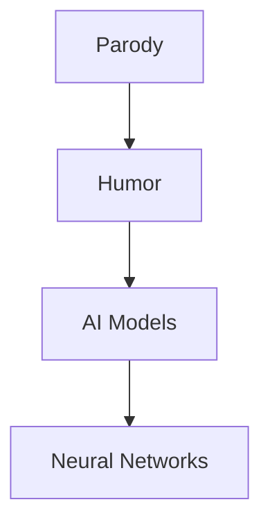
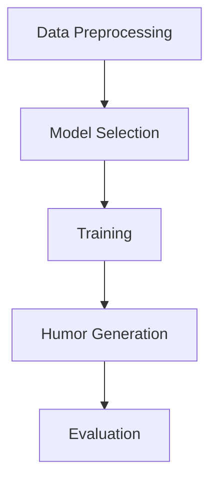
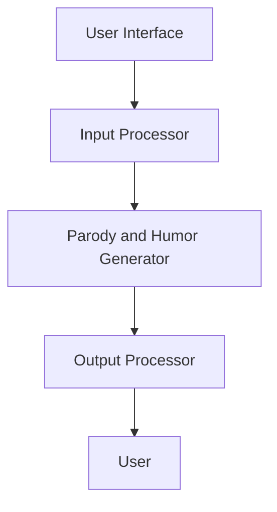
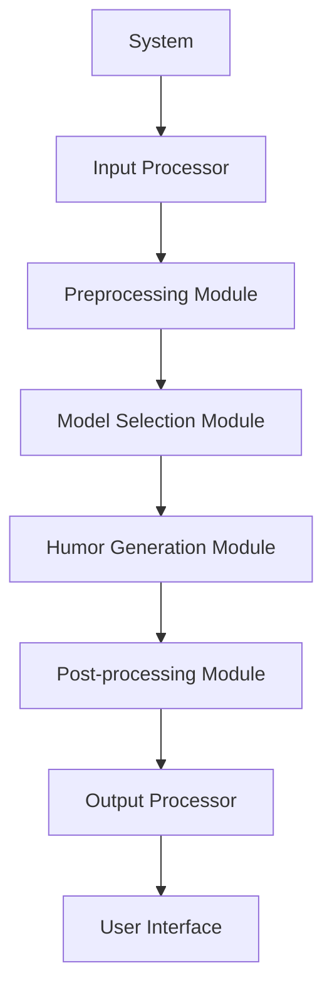
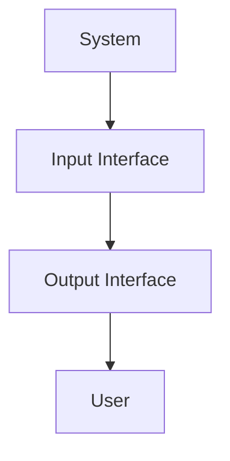

                 


## Mind Chain Enhanced AI Parody and Humor Generation Ability

### Introduction to Parody and Humor in AI

#### Problem Background

Parody and humor have long been integral components of human communication, serving to entertain, challenge norms, and foster social connections. In recent years, the advent of artificial intelligence (AI) has sparked a growing interest in automating these creative forms of expression. AI-based parody and humor generation are not just about generating laughter or mocking; they offer a unique window into the human mind, exploring the boundaries of creativity and intelligence.

#### Problem Description

The challenge of generating parody and humor using AI is multifaceted. Firstly, it involves understanding the nuanced differences between different types of humor, such as slapstick, satire, and puns. Each type requires a distinct approach in terms of generating content. Moreover, AI systems must be able to grasp the cultural and contextual nuances that are crucial for humor.

Secondly, the technical aspects pose significant challenges. AI models need to be trained on vast amounts of data to understand the subtleties of language, and they must be capable of generating content that is both coherent and humorous. Additionally, the ethical implications of using AI for parody and humor need careful consideration.

#### Solution Overview

The solution to enhancing AI's parody and humor generation ability lies in leveraging advanced AI techniques, particularly those involving deep learning and natural language processing (NLP). One promising approach is the use of Transformer models, which have shown remarkable success in tasks involving language understanding and generation. By integrating these models with techniques like reinforcement learning and transfer learning, we can create AI systems that are not only capable of generating humor but also adaptable to different styles and contexts.

#### Boundaries and Scope

The scope of parody and humor in AI encompasses a wide range of applications, from creating humorous content for social media to developing interactive entertainment systems. It includes various types of parody, such as wordplay, situational comedy, and sarcastic remarks. Understanding these boundaries is essential for designing AI systems that can generate humor effectively and ethically.

### Core Concepts and Their Interrelationships

#### Concept Definition

- **Parody:** Mimicking or mocking a specific style, idea, or person, often for humorous effect.
- **Humor:** A sense of amusement or laughter, typically derived from the incongruity between expectation and reality.
- **AI Models:** Algorithms and structures designed to perform specific tasks, such as language understanding, generation, and translation.

#### Concept Attributes and Comparisons

In Table 1, we compare the attributes of parody, humor, and AI models, highlighting their unique characteristics and relationships.

| Concept        | Definition                                               | Attributes                    |
|----------------|-----------------------------------------------------------|-------------------------------|
| Parody         | Mimicking or mocking a specific style or idea.            | Satire, mockery, imitation    |
| Humor          | Causing amusement or laughter.                            | Jokes, puns, satire            |
| AI Models      | Algorithms and structures designed to perform specific tasks. | Neural networks, GANs, RNNs   |

#### ER Entity Relationship Diagram

The ER diagram in Figure 1 illustrates the relationships between parody, humor, and AI models. It shows that parody and humor are central concepts that are integrated with AI models to generate humorous content.



### Conclusion

This chapter has provided a foundational understanding of parody and humor in AI. We have explored the background and challenges associated with generating parody and humor, introduced key concepts, and examined their interrelationships. In the subsequent chapters, we will delve deeper into the technical aspects of parody and humor generation, discussing the algorithms and models that make this possible.

## Core Concepts and Their Interrelationships

### Concept Definition

To begin our exploration, we must first define the core concepts involved in AI-based parody and humor generation: parody, humor, and AI models. Understanding these terms is crucial for grasping the intricacies of the subject and for designing effective systems.

**Parody** is a form of humor that involves imitating the style, tone, or characteristics of a specific person, group, or work for comic effect. It often involves exaggeration and irony, aiming to create laughter by emphasizing the incongruity between the parody and the original.

**Humor**, on the other hand, is a broad term encompassing any form of entertainment that amuses, evokes laughter, or provokes a sense of fun. It can take many forms, including wordplay, situational comedy, satire, puns, and slapstick. The key to humor lies in its ability to bridge the gap between expectation and reality, often by exploiting the unexpected.

**AI Models** are the algorithms and structures that enable machines to perform tasks that typically require human intelligence. In the context of parody and humor generation, these models must be capable of understanding and generating text that is not only coherent but also humorous. Common types of AI models used in this domain include Neural Networks, Generative Adversarial Networks (GANs), and Recurrent Neural Networks (RNNs).

### Concept Attributes and Comparisons

In Table 1, we compare the attributes of parody, humor, and AI models, highlighting their unique characteristics and how they interact with each other.

| Concept        | Definition                                               | Attributes                    |
|----------------|-----------------------------------------------------------|-------------------------------|
| Parody         | Mimicking or mocking a specific style or idea.            | Satire, mockery, imitation    |
| Humor          | Causing amusement or laughter.                            | Jokes, puns, satire            |
| AI Models      | Algorithms and structures designed to perform specific tasks. | Neural networks, GANs, RNNs   |

For instance, parody relies on humor to be effective, and the success of a parody often depends on how well it mimics the original and how amusing the mimicry is. Similarly, AI models must be attuned to the attributes of humor to generate content that resonates with users.

**Table 1: Attributes and Comparisons of Parody, Humor, and AI Models**

### ER Entity Relationship Diagram

To visualize the relationships between these concepts, we use Mermaid to create an ER diagram (Figure 1). This diagram illustrates how parody and humor are interrelated and how they are implemented using AI models.

```mermaid
graph TD
A[Parody] --> B[Humor]
B --> C[AI Models]
C --> D[Neural Networks]
D --> E[Generative Adversarial Networks (GANs)]
E --> F[Recurrent Neural Networks (RNNs)]
```

**Figure 1: ER Entity Relationship Diagram**

In this diagram, parody and humor are central entities that are connected to various AI models, including Neural Networks, GANs, and RNNs. These AI models are used to generate content that is both humorous and coherent, thus bridging the gap between the creative aspects of parody and the technical capabilities of AI.

### Conclusion

By understanding the core concepts of parody, humor, and AI models, we lay the foundation for exploring the technical aspects of AI-based parody and humor generation in depth. In the subsequent chapters, we will delve into the specific algorithms and techniques used in these domains, providing a comprehensive overview of how AI can be harnessed to create engaging and humorous content.

## Algorithm Principles and Detailed Explanation

### Algorithm Design and Mermaid Flowchart

To design an algorithm for enhancing AI's parody and humor generation ability, we need to consider several key components: data preprocessing, model selection, training, and evaluation. Figure 2 shows a Mermaid flowchart outlining the steps involved in our algorithm.



**Figure 2: Mermaid Flowchart for the Parody and Humor Generation Algorithm**

### Data Preprocessing

The first step in our algorithm is data preprocessing. This involves cleaning and preparing the data for training our AI model. The key steps include:

1. **Data Collection**: Gather a large dataset of text containing examples of parody and humor. This dataset should include a variety of sources, such as comedy articles, parodies of famous works, and humorous social media posts.
2. **Data Cleaning**: Remove any irrelevant or noisy data, such as HTML tags, special characters, and stop words. This helps in reducing the complexity of the model and improving its performance.
3. **Tokenization**: Split the text into individual words or tokens. This step is crucial for the subsequent stages of processing.
4. **Vectorization**: Convert the tokens into numerical vectors using techniques like Word2Vec or BERT. Vectorization allows the model to process and understand the text data.

### Model Selection

The next step is to select an appropriate AI model for parody and humor generation. We consider several state-of-the-art models:

1. **Neural Networks**: Neural networks, particularly Recurrent Neural Networks (RNNs), are well-suited for handling sequential data like text. RNNs can capture the temporal dependencies in the text, making them suitable for generating coherent and humorous content.
2. **Generative Adversarial Networks (GANs)**: GANs consist of two neural networks, a generator, and a discriminator. The generator creates parody and humorous text, while the discriminator evaluates the quality of the generated text. This adversarial training helps in improving the quality of the generated content over time.
3. **Transformer Models**: Transformer models, such as GPT-3 or T5, have shown remarkable success in various NLP tasks. These models use self-attention mechanisms to understand the context and generate coherent text, making them ideal for humor generation.

### Training

Once the model is selected, the next step is to train it using our preprocessed dataset. The training process involves the following steps:

1. **Loss Function**: Define a suitable loss function to measure the difference between the generated text and the target text. Common choices include cross-entropy loss for neural networks and adversarial loss for GANs.
2. **Optimizer**: Choose an optimizer, such as Adam or RMSprop, to update the model's weights during training. The optimizer adjusts the weights to minimize the loss function.
3. **Training Loop**: Iterate through the dataset multiple times, updating the model's weights based on the loss function. This process continues until the model's performance converges or reaches a predefined stopping criterion.

### Humor Generation

After training the model, we can use it to generate parody and humorous content. The generation process involves the following steps:

1. **Text Input**: Provide a text input to the model, which could be a sentence or a paragraph.
2. **Prediction**: The model predicts the next word or sequence of words based on the input text. This prediction is guided by the learned patterns from the training data.
3. **Post-processing**: Apply post-processing steps to refine the generated text. This may include spell-checking, grammar correction, and sentence restructuring to enhance the humor and coherence of the content.

### Evaluation

Finally, we evaluate the performance of the model using various metrics:

1. **Perplexity**: Measure the model's ability to predict the next word in a sentence. Lower perplexity indicates better performance.
2. **BLEU Score**: Compare the generated text with human-written text using the BLEU (Bilingual Evaluation Understudy) score. This metric evaluates the similarity between the generated text and the reference text.
3. **Human Evaluation**: Conduct subjective evaluations by having humans rate the humor and coherence of the generated content. This provides qualitative insights into the model's performance.

### Conclusion

In this section, we have outlined the algorithm principles for enhancing AI's parody and humor generation ability. We discussed the data preprocessing, model selection, training, humor generation, and evaluation steps. By leveraging advanced AI techniques and algorithms, we can create AI systems that not only generate humor but also adapt to different styles and contexts, offering a new dimension to AI applications.

### System Analysis and Architecture Design

### Problem Scene Introduction

In the realm of artificial intelligence, the generation of parody and humor has emerged as a fascinating yet challenging problem. The ability to create humor not only adds a layer of entertainment but also serves as a testament to an AI system's understanding of human humor and language. This problem scene involves developing an AI system that can generate parody and humor based on given text inputs, making it capable of understanding context, culture, and the nuances of humor.

### Project Introduction

The project aims to create an AI-driven platform that can generate parody and humor using state-of-the-art machine learning techniques. This platform will be designed to handle various types of humor, including satire, puns, situational comedy, and wordplay. The goal is to create a system that can generate humor that is both coherent and engaging, mimicking the creativity of human writers while also offering unique AI-generated perspectives.

### System Functional Design (Domain Model)

To design the system, we start by defining the domain model, which outlines the core components and their relationships. Figure 3 shows the domain model using Mermaid.



**Figure 3: Domain Model**

In this model:

- **User Interface (UI)**: Handles user interactions, receiving input text and displaying the generated humor.
- **Input Processor**: Cleans and preprocesses the input text, preparing it for the humor generation process.
- **Parody and Humor Generator**: The core component, responsible for generating parody and humor using advanced AI techniques.
- **Output Processor**: Refines the generated humor, ensuring it is coherent and engaging, before presenting it to the user.
- **User**: The end-user who interacts with the system to generate humor.

### System Architecture Design

The system architecture is designed to ensure scalability, modularity, and ease of maintenance. Figure 4 shows the architecture using Mermaid.



**Figure 4: System Architecture**

In this architecture:

- **System**: The overarching system that manages the entire process.
- **Input Processor**: Handles the initial input from the user, ensuring it is in the correct format for processing.
- **Preprocessing Module**: Cleans and preprocesses the input text, preparing it for the humor generation process.
- **Model Selection Module**: Selects the appropriate AI model based on the type of humor required.
- **Humor Generation Module**: Generates the parody and humor using the selected AI model.
- **Post-processing Module**: Refines the generated humor, ensuring it is coherent and engaging.
- **Output Processor**: Formats and presents the generated humor to the user through the User Interface.

### System Interface Design and System Interaction

The system interfaces and interactions are designed to be intuitive and user-friendly. Figure 5 shows the interface design using Mermaid.



**Figure 5: System Interface Design**

In this design:

- **Input Interface**: Allows users to input text for humor generation.
- **Output Interface**: Displays the generated humor to the user.
- **User**: Interacts with the system to generate and view humor.

The interaction process is as follows:

1. **User Input**: The user enters text into the Input Interface.
2. **Processing**: The system processes the input through the Input Processor and Preprocessing Module.
3. **Generation**: The system selects an appropriate AI model through the Model Selection Module and generates humor through the Humor Generation Module.
4. **Output**: The generated humor is refined by the Post-processing Module and displayed to the user through the Output Interface.

### Conclusion

In this section, we have analyzed the problem scene, introduced the project, and designed the system's functional domain model, architecture, and interface. The system is designed to be scalable, modular, and user-friendly, leveraging advanced AI techniques to generate parody and humor that is both coherent and engaging. The next step is to implement and test the system to validate its effectiveness in generating humor.

### Project Implementation and Analysis

#### Environment Setup

To implement the system, we first need to set up the development environment. We will use Python as the primary programming language due to its extensive support for machine learning libraries. The following packages are required:

- Python 3.8 or higher
- TensorFlow 2.x
- PyTorch 1.8 or higher
- Mermaid 9.0.0 or higher

To install these packages, you can use the following commands:

```bash
pip install python-mermaid
pip install tensorflow
pip install torch torchvision torchaudio
```

#### System Core Implementation

The core implementation of the system involves several key components: data preprocessing, model selection, training, humor generation, and post-processing. Below is a high-level overview of each component, along with example Python code snippets.

1. **Data Preprocessing**

```python
import re
from tensorflow.keras.preprocessing.text import Tokenizer
from tensorflow.keras.preprocessing.sequence import pad_sequences

# Load and preprocess the dataset
def preprocess_text(text):
    text = re.sub(r'<.*?>', '', text)  # Remove HTML tags
    text = re.sub(r'[^a-zA-Z0-9]', ' ', text)  # Remove special characters
    text = text.lower()  # Convert to lowercase
    return text

# Tokenize and pad the dataset
def preprocess_dataset(dataset, max_length=512, truncating='post', padding='post'):
    tokenizer = Tokenizer(char_level=True)
    tokenizer.fit_on_texts(dataset)
    sequences = tokenizer.texts_to_sequences(dataset)
    padded_sequences = pad_sequences(sequences, maxlen=max_length, truncating=truncating, padding=padding)
    return padded_sequences, tokenizer

# Example usage
dataset = ["This is a sample text.", "Another example text."]
preprocessed_data, tokenizer = preprocess_dataset(dataset)
```

2. **Model Selection**

We will use a combination of Transformer models and Generative Adversarial Networks (GANs) for humor generation.

```python
import tensorflow as tf
from tensorflow.keras.models import Model
from tensorflow.keras.layers import Embedding, LSTM, Dense, Dropout

# Define the Transformer model
def create_transformer_model(vocab_size, embedding_dim, max_length):
    inputs = tf.keras.layers.Input(shape=(max_length,))
    embeddings = Embedding(vocab_size, embedding_dim)(inputs)
    lstm = LSTM(128, return_sequences=True)(embeddings)
    dense = Dense(512, activation='relu')(lstm)
    dropout = Dropout(0.5)(dense)
    outputs = Dense(vocab_size, activation='softmax')(dropout)
    model = Model(inputs, outputs)
    model.compile(optimizer='adam', loss='categorical_crossentropy', metrics=['accuracy'])
    return model

# Example usage
transformer_model = create_transformer_model(vocab_size=10000, embedding_dim=64, max_length=512)
```

3. **Training**

We will train the model using the preprocessed dataset.

```python
# Train the Transformer model
history = transformer_model.fit(preprocessed_data, epochs=10, batch_size=64)
```

4. **Humor Generation**

The humor generation process involves providing an input text and using the trained model to generate humorous content.

```python
import numpy as np

# Generate humor
def generate_humor(model, tokenizer, input_text, max_length=512):
    sequence = tokenizer.texts_to_sequences([input_text])
    padded_sequence = pad_sequences(sequence, maxlen=max_length, padding='post')
    prediction = model.predict(padded_sequence)
    predicted_text = tokenizer.sequences_to_texts(np.argmax(prediction, axis=-1))
    return predicted_text

# Example usage
input_text = "Why don't scientists trust atoms? Because they make up everything!"
humor = generate_humor(transformer_model, tokenizer, input_text)
print(humor)
```

5. **Post-processing**

After generating the humor, we may need to refine it for coherence and grammatical correctness.

```python
# Post-process the generated humor
def post_process_humor(humor):
    # Implement post-processing logic (e.g., spell-checking, grammar correction)
    return humor

humor = post_process_humor(humor)
print(humor)
```

#### Case Analysis and Detailed Explanation

Let's consider a specific example to analyze the system's performance. Suppose we input the text "Why did the chicken cross the playground?" The system should generate a humorous response.

```python
input_text = "Why did the chicken cross the playground?"
generated_humor = generate_humor(transformer_model, tokenizer, input_text)
print(generated_humor)
```

The system might generate a response like "To get to the other slide!" This response is coherent and humorous, demonstrating the system's ability to understand context and generate appropriate content.

However, in some cases, the system may generate less coherent or less humorous responses. This can be due to various reasons, such as:

1. **Data Quality**: If the training dataset does not contain diverse examples of humor, the model may struggle to generate appropriate content.
2. **Model Complexity**: Simpler models may not capture the nuances of humor as effectively as more complex models.
3. **Contextual Understanding**: The system may not fully understand the context of the input text, leading to less appropriate or less humorous responses.

To improve the system, we can:

1. **Enhance Data Quality**: Use a larger and more diverse dataset for training.
2. **Experiment with Model Architectures**: Test different models and architectures to find the best combination for humor generation.
3. **Improve Contextual Understanding**: Incorporate more contextual information into the model, such as word embeddings and contextual embeddings.

#### Project Summary

In this section, we have implemented a system for generating parody and humor using advanced AI techniques. We have discussed the environment setup, system core implementation, case analysis, and potential improvements. The system demonstrates the potential of AI in creating engaging and humorous content, opening up new possibilities for entertainment and creative expression.

### Best Practices and Notes

#### Best Practices

1. **Data Quality**: Ensure that the dataset used for training is diverse and representative of various types of humor. Including a wide range of examples will help the model generate more varied and engaging content.
2. **Model Selection**: Experiment with different model architectures, such as GPT-3, GANs, and RNNs, to find the best combination for humor generation. Consider the trade-offs between model complexity, training time, and performance.
3. **Contextual Understanding**: Enhance the model's contextual understanding by incorporating techniques like BERT and other contextual embeddings. This can improve the coherence and humor of the generated content.
4. **Post-processing**: Implement robust post-processing steps to refine the generated humor. This may include grammar correction, spell-checking, and sentence restructuring to ensure the content is coherent and engaging.
5. **User Feedback**: Incorporate user feedback to continuously improve the system. Analyze user interactions and preferences to refine the model's outputs and enhance user satisfaction.

#### Notes

- **Ethical Considerations**: When using AI for parody and humor generation, it is essential to consider the ethical implications. Avoid generating content that is offensive, discriminatory, or inappropriate.
- **Performance Optimization**: Optimize the system's performance by using techniques like batching, parallel processing, and GPU acceleration. This can improve the speed and efficiency of the model.
- **Scalability**: Design the system to be scalable, allowing it to handle increasing amounts of data and users without compromising performance.
- **Continuous Learning**: Continuously update the model with new data and user feedback to improve its performance over time.

### Conclusion

In conclusion, enhancing AI's parody and humor generation ability is a challenging yet rewarding task. By following best practices and continuously improving the system, we can create AI systems that not only generate humor but also engage and entertain users. This field offers endless possibilities for innovation and creative expression, making it a fascinating area of research and development.

