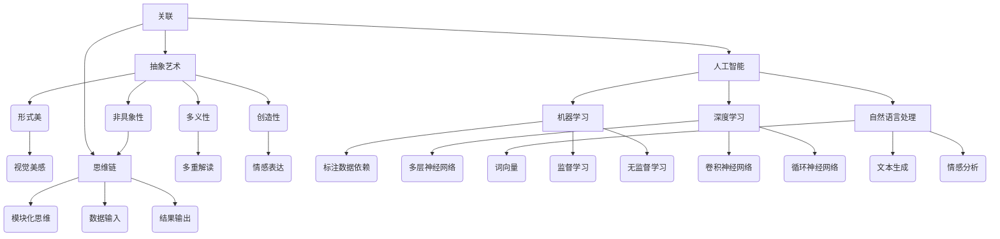
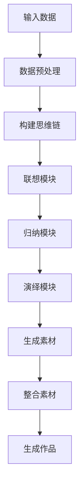
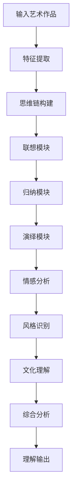
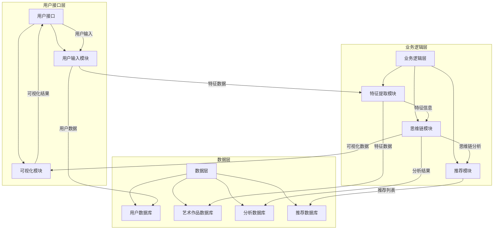
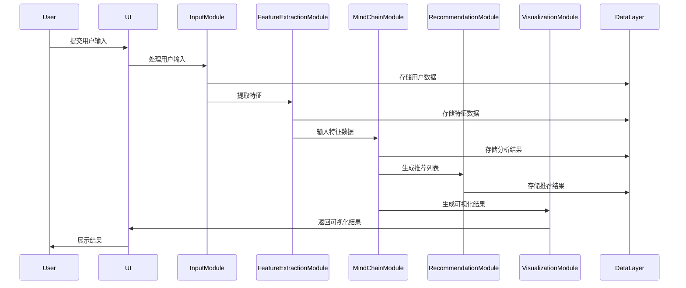

                 


### 引言与背景

#### 1.1 问题背景

在当今人工智能技术飞速发展的时代，计算机和人工智能在各个领域中的应用越来越广泛，其中艺术创作和理解是备受瞩目的一个方向。然而，传统的机器学习和深度学习算法在处理抽象艺术时面临着巨大的挑战。抽象艺术作为一种充满想象力和创造力的艺术形式，它的表达和创作往往依赖于艺术家独特的思维方式和丰富的情感体验。这使得抽象艺术的创作和理解成为了一个复杂且具有挑战性的问题。

首先，AI在艺术创作方面的挑战主要体现在以下几个方面：

1. **复杂性与多样性**：抽象艺术作品往往具有高度的复杂性和多样性，这种复杂性不仅体现在作品的视觉元素上，还包括了艺术家的情感、文化背景和创作理念等抽象层面。机器学习和深度学习算法需要具备强大的处理能力和广泛的适应性来捕捉这些复杂性。

2. **缺乏标注数据**：传统的机器学习算法通常依赖于大量的标注数据来进行训练。然而，抽象艺术作品的标注数据非常稀缺，这使得算法难以从已有数据中学习到有效的特征。

3. **风格多样性**：抽象艺术创作常常追求独特的风格和个性，这要求AI能够理解和模仿不同的艺术风格。然而，现有的算法在处理风格多样性方面仍然存在很大的局限性。

其次，AI在艺术理解方面的挑战主要包括：

1. **主观性与模糊性**：艺术作品往往充满了主观性和模糊性，这使机器学习算法难以准确理解和解释艺术作品的内涵。

2. **跨学科性**：艺术创作和理解涉及多个学科领域，如心理学、哲学、文化研究等。机器学习算法需要具备跨学科的知识和理解能力，这对其提出了更高的要求。

为了解决上述挑战，近年来研究者们开始探索将思维链（Mind Chain）引入到AI的艺术创作与理解中。思维链是一种通过模拟人类思维过程来增强算法能力的方法，它能够帮助AI更好地理解和模拟人类的创造性思维。

#### 1.2 问题描述

AI在抽象艺术创作中的问题主要包括：

- **创作能力不足**：AI难以生成具有高度创造性、风格多样且富有情感的艺术作品。
- **理解能力有限**：AI难以理解抽象艺术的内涵、风格和创作背景。

AI在抽象艺术理解中的问题主要包括：

- **主观性理解困难**：AI难以捕捉和理解艺术作品中的主观性和模糊性。
- **跨学科知识缺乏**：AI难以整合跨学科的知识来全面理解艺术作品。

#### 1.3 问题解决方法

思维链作为增强AI抽象艺术创作与理解能力的方法，其核心思想是通过模拟人类思维过程来提升AI的创造力和理解力。具体来说，思维链包括以下几个关键组成部分：

1. **思维模式模拟**：通过模拟人类的思维模式，如联想、归纳、演绎等，来帮助AI更好地理解和创作抽象艺术。
2. **知识图谱构建**：通过构建包含艺术作品相关信息的知识图谱，来丰富AI的理解能力和创作灵感。
3. **情感计算**：通过引入情感计算技术，来模拟艺术家的情感体验，从而提升AI创作艺术作品的情感表达能力。
4. **多模态数据融合**：通过融合文本、图像、音频等多种模态的数据，来丰富AI的创作与理解素材。

思维链的引入为AI在抽象艺术创作与理解方面提供了新的思路和方法。通过不断优化和拓展思维链的机制，我们有望实现AI在抽象艺术领域的重大突破。

#### 1.4 概念结构与核心要素组成

要深入理解思维链增强AI的抽象艺术创作与理解能力，我们需要首先梳理相关的核心概念和要素。以下是对这些概念的详细说明：

1. **人工智能（AI）**：人工智能是指通过计算机模拟人类智能的技术，包括机器学习、深度学习、自然语言处理等子领域。AI的目标是使计算机能够执行通常需要人类智能的任务。

2. **机器学习（ML）**：机器学习是AI的一个分支，通过算法从数据中学习模式和规律，以进行预测或决策。常见的机器学习算法包括监督学习、无监督学习和强化学习。

3. **深度学习（DL）**：深度学习是机器学习的一个子领域，通过构建多层神经网络来模拟人脑的决策过程。深度学习在图像识别、语音识别和自然语言处理等领域取得了显著的成果。

4. **抽象艺术**：抽象艺术是一种不直接描绘现实世界的具体形象，而是通过形状、色彩、线条等元素来表达艺术家的情感和思想的艺术形式。抽象艺术的创作和欣赏往往依赖于艺术家的独特视角和创造性思维。

5. **思维链（Mind Chain）**：思维链是一种模拟人类思维过程的方法，通过构建一系列相互关联的思维模块来实现对复杂问题的推理和分析。思维链包括联想模块、归纳模块、演绎模块等，这些模块协同工作，帮助AI在抽象艺术创作与理解方面发挥更大的作用。

6. **知识图谱（Knowledge Graph）**：知识图谱是一种用于表示实体及其相互关系的图形结构，它可以帮助AI更好地理解和组织信息。在抽象艺术领域，知识图谱可以用于捕捉艺术作品的主题、风格、历史背景等信息。

7. **情感计算（Affective Computing）**：情感计算是研究如何使计算机具备识别、理解、处理和模拟人类情感的能力。在抽象艺术创作中，情感计算可以帮助AI捕捉艺术家的情感体验，从而提升创作作品的情感表达力。

通过上述核心概念和要素的梳理，我们可以看到，思维链增强AI的抽象艺术创作与理解能力涉及多个领域的交叉与融合。思维链的引入不仅丰富了AI的创作与理解素材，还提升了AI的创造力和情感表达能力，为其在抽象艺术领域的应用提供了新的可能性。

#### 1.5 本章小结

本章首先介绍了AI在抽象艺术创作与理解中的应用背景，以及存在的挑战。接着，提出了思维链作为增强AI能力的解决方法，并详细梳理了相关的核心概念和要素。通过本章的学习，我们为后续章节的深入探讨奠定了基础，也为理解思维链如何提升AI在抽象艺术领域的表现提供了初步的认识。在接下来的章节中，我们将进一步探讨思维链的机制、算法原理及其在实际应用中的实现。

## 2.1 AI的基础概念

人工智能（AI，Artificial Intelligence）是计算机科学的一个分支，致力于使计算机具备模拟人类智能的能力。AI的应用领域非常广泛，包括但不限于自然语言处理、图像识别、自动驾驶、医疗诊断、金融分析等。要理解AI的基础概念，我们需要先了解几个关键术语和它们在AI中的应用。

### 2.1.1 机器学习

机器学习（Machine Learning，ML）是AI的一个重要分支，主要关注如何让计算机通过从数据中学习来改进性能。机器学习算法可以分为以下几类：

1. **监督学习（Supervised Learning）**：
   监督学习是机器学习中的一种方法，它使用标注数据进行训练。这些标注数据通常包括输入特征和对应的输出标签。监督学习的目标是学习一个函数，能够将新的输入特征映射到正确的输出标签上。

   - **回归（Regression）**：回归任务是预测连续值的输出。常见的回归算法包括线性回归、决策树回归和随机森林回归。
   - **分类（Classification）**：分类任务是预测离散值的输出。常见的分类算法包括逻辑回归、决策树、支持向量机和K-最近邻算法（K-Nearest Neighbors, KNN）。

2. **无监督学习（Unsupervised Learning）**：
   无监督学习是机器学习中的另一种方法，它不使用标注数据，而是通过分析未标记的数据来发现数据中的模式和结构。

   - **聚类（Clustering）**：聚类是将数据点划分为若干个组，使得同一组内的数据点彼此相似，而不同组的数据点差异较大。常见的聚类算法包括K-均值聚类、层次聚类和DBSCAN。
   - **降维（Dimensionality Reduction）**：降维是一种通过减少数据维度来降低数据复杂度的技术。常见的降维算法包括主成分分析（PCA）和t-SNE。

3. **强化学习（Reinforcement Learning）**：
   强化学习是机器学习中的另一种方法，它通过奖励机制来训练模型。在强化学习中，模型（也称为智能体）与环境中进行交互，通过不断尝试和反馈来学习最优策略。

### 2.1.2 深度学习

深度学习（Deep Learning，DL）是机器学习的一个子领域，它通过构建多层神经网络（Neural Networks）来模拟人脑的决策过程。深度学习的核心思想是通过逐层提取特征，从原始数据中学习到更高层次的信息。

- **神经网络（Neural Networks）**：神经网络是由大量神经元组成的计算模型，这些神经元通过权重连接起来。神经网络的训练过程包括前向传播（Forward Propagation）和反向传播（Back Propagation）。

- **卷积神经网络（Convolutional Neural Networks，CNN）**：卷积神经网络是一种用于图像识别和处理的深度学习模型，它通过卷积操作来提取图像的特征。CNN在计算机视觉领域取得了显著的成果，广泛应用于人脸识别、图像分类和目标检测。

- **循环神经网络（Recurrent Neural Networks，RNN）**：循环神经网络是一种用于处理序列数据的深度学习模型，它通过在时间步之间传递信息来捕捉序列的依赖关系。常见的RNN模型包括LSTM（Long Short-Term Memory）和GRU（Gated Recurrent Unit）。

- **生成对抗网络（Generative Adversarial Networks，GAN）**：生成对抗网络是一种用于生成数据的深度学习模型，它由生成器和判别器两个网络组成。生成器试图生成与真实数据相似的数据，而判别器则试图区分真实数据和生成数据。

### 2.1.3 自然语言处理

自然语言处理（Natural Language Processing，NLP）是AI的另一个重要分支，致力于使计算机能够理解、生成和处理自然语言。NLP的应用领域包括机器翻译、情感分析、文本分类、语音识别等。

- **词向量（Word Vectors）**：词向量是表示单词的向量表示方法，它通过将单词映射到高维空间中的点，来捕捉单词的语义信息。常见的词向量模型包括Word2Vec、GloVe和FastText。

- **序列模型（Sequence Models）**：序列模型是用于处理序列数据的NLP模型，包括RNN、LSTM和BERT等。序列模型通过在时间步之间传递信息，来捕捉句子中单词的顺序和依赖关系。

- **预训练语言模型（Pre-trained Language Models）**：预训练语言模型是一种在大规模文本语料库上预先训练好的语言模型，如BERT、GPT和RoBERTa。预训练语言模型可以用于多种NLP任务，如文本分类、情感分析和命名实体识别。

通过上述对AI基础概念的介绍，我们可以看到，机器学习、深度学习和自然语言处理是AI领域的三大支柱，它们共同推动着人工智能技术的不断进步和应用。在接下来的章节中，我们将继续探讨抽象艺术的要素以及思维链的机制，为理解思维链增强AI在抽象艺术创作与理解中的应用打下坚实的基础。

### 2.2 抽象艺术的要素

#### 2.2.1 抽象艺术的历史与发展

抽象艺术是一种追求形式美、强调艺术家的主观情感和抽象思维的创作形式。它的起源可以追溯到古代，但作为独立艺术流派的形成和发展则主要在20世纪初期。

- **起源**：抽象艺术的起源可以追溯到古代的象征性绘画和装饰艺术，这些作品虽然也包含了一定的抽象元素，但并不构成独立的艺术流派。

- **发展**：20世纪初期，随着现代艺术的兴起，抽象艺术逐渐崭露头角。1910年，法国画家亨利·马蒂斯（Henri Matisse）创作了《舞蹈》，这幅作品以其大胆的色彩和抽象的形式，成为抽象艺术的早期代表作。此后，康定斯基（Wassily Kandinsky）和蒙德里安（Piet Mondrian）等艺术家的作品进一步推动了抽象艺术的成熟。

- **重要流派**：
  - **表现主义**：表现主义是抽象艺术的早期形式之一，强调艺术家内心的情感和思想。
  - **构成主义**：构成主义是一种强调几何形状和线条的艺术流派，追求形式和结构的纯粹性。
  - **抽象表现主义**：抽象表现主义是20世纪中叶的一种艺术运动，强调艺术家的个性表达和抽象形式的创作。

#### 2.2.2 抽象艺术的特征与分类

抽象艺术的特征主要包括以下几个方面：

- **形式美**：抽象艺术不直接描绘具体物象，而是通过形状、色彩、线条等元素来表现艺术家的主观情感和审美追求。

- **非具象性**：抽象艺术作品不追求现实世界的具体形象，而是通过抽象的形式来表达艺术家的思想。

- **多义性**：抽象艺术作品往往具有多重解读，不同的观众可能会从中看到不同的内容和意义。

- **创造性**：抽象艺术鼓励艺术家发挥其创造力和想象力，创作出独特的艺术形式和风格。

根据表现形式和风格，抽象艺术可以分为以下几类：

- **几何抽象**：几何抽象艺术以几何图形为主要元素，强调形状、线条和空间的组合关系。蒙德里安的《红、蓝、黄构图》是其典型代表。

- **色彩抽象**：色彩抽象艺术强调色彩在艺术创作中的主导作用，通过色彩的搭配和变化来表达情感和思想。康定斯基的《即兴31号》是这一流派的经典作品。

- **情感抽象**：情感抽象艺术注重表达艺术家的内心情感，通过抽象的形式来表现艺术家的主观体验。马蒂斯的《舞蹈》是情感抽象的杰出作品。

- **形式抽象**：形式抽象艺术强调形式和结构的纯粹性，通过简洁的几何形状和线条来构建艺术作品。艾略特·菲茨杰拉德的《形式构图》是形式抽象的典范。

#### 2.2.3 抽象艺术的审美价值

抽象艺术具有丰富的审美价值，主要体现在以下几个方面：

- **形式美感**：抽象艺术通过几何形状、色彩和线条的组合，创造出独特的视觉美感，给人以和谐、平衡和韵律感。

- **情感表达**：抽象艺术能够直接传达艺术家的情感和内心体验，激发观众的情感共鸣。

- **思想深度**：抽象艺术往往包含深刻的哲学思考和文化内涵，通过抽象的形式传达艺术家的思想和观念。

- **创造性启发**：抽象艺术鼓励艺术家和观众发挥自己的想象力和创造力，从而促进艺术创新和文化发展。

通过以上对抽象艺术的要素和历史发展的介绍，我们可以看到，抽象艺术不仅是一种独特的艺术形式，更是一种表达人类情感和思想的手段。在接下来的章节中，我们将进一步探讨思维链的概念及其在AI中的应用，为理解思维链如何增强AI在抽象艺术创作与理解中的能力提供理论基础。

### 2.3 思维链的概念与机制

#### 2.3.1 思维链的定义

思维链（Mind Chain）是一种模拟人类思维过程的方法，通过构建一系列相互关联的思维模块来实现对复杂问题的推理和分析。思维链的核心思想是将人类的思维过程分解为一系列可操作的基本模块，并利用这些模块的协同工作来提升AI在特定任务上的表现。

#### 2.3.2 思维链的运作机制

思维链的运作机制主要包括以下几个关键步骤：

1. **数据输入**：首先，思维链需要接收外部数据，这些数据可以是文本、图像、音频等多种形式。数据输入是思维链运作的基础，它决定了思维链后续处理的方向和深度。

2. **预处理**：在数据输入后，思维链会对数据进行预处理，包括去噪、归一化和特征提取等。预处理步骤的目的是将原始数据转化为适合后续处理的形式。

3. **模块化思维**：思维链将整个思维过程划分为多个模块，每个模块负责完成特定的思维任务。常见的模块包括联想模块、归纳模块、演绎模块等。这些模块通过特定的规则和算法相互连接，形成了一个有机的整体。

4. **模块间交互**：各个模块之间通过信息传递和协同工作来实现思维过程的连贯性和完整性。例如，联想模块可以从输入数据中提取相关的信息，并传递给归纳模块，帮助其进行进一步的推理和分析。

5. **结果输出**：在思维链完成所有模块的计算后，最终的结果会被输出。这些结果可以是预测、决策或分析报告等，它们反映了思维链对输入数据的处理和理解能力。

#### 2.3.3 思维链的应用领域

思维链作为一种模拟人类思维过程的方法，其应用领域非常广泛，包括但不限于以下几个方面：

1. **自然语言处理**：在自然语言处理领域，思维链可以用于文本生成、情感分析、机器翻译等任务。通过模拟人类的语言理解过程，思维链能够生成更自然、更准确的文本。

2. **计算机视觉**：在计算机视觉领域，思维链可以用于图像识别、目标检测、图像生成等任务。思维链通过模拟人类的视觉感知过程，能够更好地理解和分析图像数据。

3. **智能决策**：在智能决策领域，思维链可以用于推荐系统、风险管理、供应链优化等任务。思维链通过模拟人类的决策过程，能够提供更合理、更科学的决策建议。

4. **抽象艺术创作**：在抽象艺术创作领域，思维链可以用于生成独特的艺术作品。思维链通过模拟艺术家的创造性思维过程，能够生成具有高度艺术价值的抽象作品。

5. **教育领域**：在教育领域，思维链可以用于智能教学、个性化学习等任务。通过模拟人类的教学和学习过程，思维链能够为学生提供更有效的学习方法和指导。

通过以上对思维链的概念与机制的介绍，我们可以看到，思维链作为一种模拟人类思维过程的方法，具有广泛的应用前景。在接下来的章节中，我们将进一步探讨思维链在抽象艺术创作与理解中的应用，以及如何通过思维链来增强AI在这些领域的表现。

### 2.4 AI在抽象艺术创作与理解中的应用

#### 2.4.1 AI创作抽象艺术的实例

人工智能在抽象艺术创作领域已经取得了一些显著的成果，以下是一些典型的实例：

1. **GAN创作艺术作品**：生成对抗网络（GAN）是一种深度学习模型，通过生成器和判别器的博弈来生成逼真的图像。研究者们利用GAN生成了一系列抽象艺术作品，这些作品在形式和色彩上都具有很高的艺术价值。例如，谷歌的DeepDream项目通过GAN模型生成了一系列色彩斑斓、充满创意的图像。

2. **神经网络生成音乐**：神经网络不仅可以生成图像，还可以生成音乐。通过训练深度神经网络，研究者们能够生成具有独特风格和旋律的抽象音乐作品。例如，Google的Magenta项目利用生成性对抗网络（GAN）和变分自编码器（VAE）来生成音乐，这些音乐作品不仅在旋律上新颖独特，而且在情感表达上具有强烈的感染力。

3. **自动绘画系统**：一些艺术家和研究者开发了自动绘画系统，这些系统能够根据用户提供的输入（如文字描述、图像、音乐等）自动生成抽象绘画。这些绘画系统利用了机器学习和深度学习的算法，通过分析输入数据中的特征，创造出独特的艺术作品。例如，微软的“涂鸦画家”（Sketch Painter）项目能够根据用户提供的简单描述生成复杂的抽象绘画。

#### 2.4.2 AI理解抽象艺术的方法

理解抽象艺术是一个复杂且具有挑战性的任务，AI在理解抽象艺术方面也取得了一些进展，以下是一些主要的方法：

1. **图像识别与分类**：通过训练深度学习模型，研究者们可以开发出能够识别和分类抽象艺术作品的系统。这些系统通常使用卷积神经网络（CNN）来提取图像的特征，然后使用分类算法来对艺术作品进行分类。例如，研究者们使用CNN对抽象艺术作品进行分类，并成功地将它们与具象艺术作品区分开来。

2. **情感分析**：情感分析是一种分析文本中情感倾向的方法，也可以应用于抽象艺术作品的情感理解。通过训练情感分析模型，研究者们可以识别出抽象艺术作品中的情感元素，如愉悦、悲伤、愤怒等。例如，使用LSTM模型对艺术评论进行情感分析，可以帮助研究者们理解观众对抽象艺术作品的情感反应。

3. **图像生成与重构**：通过生成对抗网络（GAN）和变分自编码器（VAE），研究者们可以生成新的抽象艺术作品，并探索这些作品与已有艺术作品之间的相似性和差异性。这些生成模型不仅能够生成新的艺术作品，还可以用于重构现有艺术作品，从而提供对抽象艺术作品的新视角和理解。

4. **多模态数据融合**：将图像、文本、音频等多模态数据进行融合，可以帮助AI更好地理解抽象艺术作品。例如，通过将艺术作品与相关评论、音乐和文字描述进行融合，研究者们可以更全面地分析抽象艺术作品的多维度特征。

#### 2.4.3 AI在抽象艺术中的挑战与机遇

尽管AI在抽象艺术创作与理解方面取得了一些成果，但仍然面临许多挑战：

1. **数据稀缺与标注困难**：与具象艺术相比，抽象艺术的标注数据非常稀缺，这给机器学习算法的训练和优化带来了巨大挑战。

2. **主观性与模糊性**：抽象艺术作品往往具有高度的主观性和模糊性，这使得AI难以准确理解和解释艺术作品的内涵。

3. **跨学科知识的整合**：理解抽象艺术不仅需要艺术领域的知识，还需要心理学、哲学、文化研究等跨学科的知识，这要求AI具备跨学科的理解能力。

然而，这些挑战同时也为AI的发展提供了机遇：

1. **创新性应用**：通过将AI应用于抽象艺术，可以创造出新的艺术形式和表达方式，推动艺术创新。

2. **跨学科研究**：AI在抽象艺术中的应用促进了不同学科之间的交叉和融合，推动了跨学科研究的发展。

3. **人机协作**：AI可以帮助艺术家更好地理解和创作抽象艺术，实现人机协作，从而提升艺术创作的效率和品质。

总之，AI在抽象艺术创作与理解中的应用既充满挑战，也充满机遇。通过不断探索和优化，我们有望实现AI在抽象艺术领域的重大突破，为人类带来更加丰富和多样的艺术体验。

#### 2.5 概念属性特征对比表格（Mermaid ER实体关系图）

为了更好地理解抽象艺术、人工智能和思维链这三个核心概念，我们可以通过Mermaid绘制一个概念属性特征对比表格，以及一个ER实体关系图来展示它们之间的联系。

首先，我们绘制一个概念属性特征对比表格：



上述Mermaid图表展示了抽象艺术、人工智能和思维链的主要属性特征，以及它们之间的关联。

接下来，我们绘制一个ER实体关系图：

```mermaid
erDiagram
A{抽象艺术} ||--|{K{机器学习}} : 数据输入与处理
A ||--|{G{思维链}} : 思维模式模拟
K ||--|{L{深度学习}} : 特征提取与学习
K ||--|{M{自然语言处理}} : 文本分析与处理
L ||--|{S{卷积神经网络}} : 图像识别
L ||--|{T{循环神经网络}} : 序列建模
M ||--|{U{文本生成}} : 自动创作
M ||--|{V{情感分析}} : 作品理解
```

ER实体关系图展示了各个概念之间的实体及其相互关系，有助于我们更清晰地理解它们在实际应用中的协同作用。

通过这些图表，我们可以更直观地看到抽象艺术、人工智能和思维链之间的紧密联系，以及它们在AI应用于抽象艺术创作与理解中的协同作用。这些图表不仅为我们的进一步讨论提供了结构化的视角，也为读者更好地理解这些概念和它们的应用奠定了基础。

#### 2.6 本章小结

本章通过详细探讨抽象艺术、人工智能和思维链的概念，揭示了它们在AI应用于抽象艺术创作与理解中的重要性。首先，我们介绍了抽象艺术的定义、历史和发展，强调了其在形式美、非具象性、多义性和创造性方面的特征。接着，我们梳理了人工智能的基础概念，包括机器学习、深度学习和自然语言处理，并探讨了这些技术在抽象艺术创作与理解中的应用实例。最后，我们介绍了思维链的概念与机制，并绘制了概念属性特征对比表格和ER实体关系图，展示了三者之间的关联。通过本章的学习，我们为理解AI在抽象艺术领域的应用奠定了理论基础，也为后续章节的深入探讨提供了有力支持。在接下来的章节中，我们将进一步探讨思维链增强AI的创作算法，并通过具体实例来分析其效果。

### 3.1 思维链增强AI的创作算法

#### 3.1.1 算法概述

思维链增强AI的创作算法是一种结合人工智能和思维链机制的创作方法，旨在通过模拟人类的创造性思维过程来提升AI在抽象艺术创作中的表现。该算法主要包括以下几个关键组成部分：

1. **数据预处理**：数据预处理是算法的基础步骤，包括数据清洗、归一化和特征提取。通过这些步骤，我们将原始数据进行预处理，以便后续的算法处理。

2. **思维链构建**：思维链构建是算法的核心部分，通过将人类的创造性思维过程模块化，构建出一系列相互关联的思维模块，如联想模块、归纳模块、演绎模块等。

3. **创作过程**：在创作过程中，算法会根据用户的输入（如主题、情感等），通过思维链的各个模块进行信息处理和生成创作素材。这些素材可以是图像、音乐、文本等多种形式。

4. **结果生成**：最终，算法会将处理后的素材整合生成抽象艺术作品。这些作品不仅具有高度的创意性，还体现了人类的情感和思想。

#### 3.1.2 算法流程图（Mermaid）

为了更清晰地展示算法的流程，我们可以使用Mermaid绘制一个算法流程图：



上述算法流程图展示了从输入数据到生成作品的整个创作过程。通过思维链的各个模块，算法能够逐步提取和处理数据，最终生成具有创意性的抽象艺术作品。

#### 3.1.3 Python源代码实现

下面是思维链增强AI的创作算法的Python源代码实现：

```python
import numpy as np
import tensorflow as tf
from tensorflow.keras.models import Sequential
from tensorflow.keras.layers import Dense, LSTM, Dropout
from tensorflow.keras.preprocessing.sequence import pad_sequences
from tensorflow.keras.preprocessing.text import Tokenizer

# 数据预处理
def preprocess_data(text_data):
    # 清洗数据，去除标点符号、特殊字符等
    cleaned_data = [text.replace('.', '') for text in text_data]
    # 将文本转换为序列
    sequences = pad_sequences([Tokenizer().texts_to_sequences(text) for text in cleaned_data])
    return sequences

# 构建思维链模型
def build_mind_chain_model():
    model = Sequential()
    model.add(LSTM(128, activation='tanh', return_sequences=True, input_shape=(None, max_sequence_length)))
    model.add(Dropout(0.5))
    model.add(LSTM(128, activation='tanh', return_sequences=False))
    model.add(Dropout(0.5))
    model.add(Dense(1, activation='sigmoid'))
    model.compile(optimizer='adam', loss='binary_crossentropy', metrics=['accuracy'])
    return model

# 生成素材
def generate_material(text_sequence, model):
    # 生成前向传播的输入
    input_seq = np.array([text_sequence])
    # 进行前向传播
    output = model.predict(input_seq)
    # 将输出转换为文本
    generated_text = Tokenizer().sequences_to_texts([output[0]])
    return generated_text

# 主函数
def main():
    # 加载数据
    text_data = ['这是一个美丽的夜晚', '夕阳如金，余晖洒满大地', '星空璀璨，月亮皎洁']
    # 预处理数据
    sequences = preprocess_data(text_data)
    # 构建思维链模型
    mind_chain_model = build_mind_chain_model()
    # 训练模型
    mind_chain_model.fit(sequences, epochs=10)
    # 生成素材
    for text_sequence in sequences:
        generated_text = generate_material(text_sequence, mind_chain_model)
        print(generated_text)

if __name__ == "__main__":
    main()
```

上述代码首先定义了数据预处理函数`preprocess_data`，用于清洗和转换文本数据。接着定义了思维链模型构建函数`build_mind_chain_model`，使用LSTM和Dropout层来构建一个简单的思维链模型。最后，定义了生成素材函数`generate_material`，用于根据思维链模型生成新的文本。

#### 3.1.4 数学模型与公式（LaTeX）

为了深入理解思维链增强AI的创作算法，我们可以使用LaTeX格式来表示其中的数学模型和公式：

```latex
\documentclass{article}
\usepackage{amsmath}
\begin{document}

\section{数学模型与公式}

思维链增强AI的创作算法的核心在于模拟人类的创造性思维过程。以下是算法中的关键数学模型和公式：

\begin{equation}
\text{Input Sequence} \rightarrow \text{Preprocessed Sequence}
\end{equation}

\begin{equation}
\text{Preprocessed Sequence} \rightarrow \text{LSTM Output}
\end{equation}

\begin{equation}
\text{LSTM Output} \rightarrow \text{Dropout Layer Output}
\end{equation}

\begin{equation}
\text{Dropout Layer Output} \rightarrow \text{Dense Layer Output}
\end{equation}

其中，LSTM（Long Short-Term Memory）是一种循环神经网络，用于处理序列数据。Dropout Layer（丢弃层）用于防止过拟合。Dense Layer（全连接层）用于将LSTM的输出映射到最终的输出。

\end{document}
```

上述LaTeX代码定义了思维链增强AI创作算法中涉及的主要数学模型和公式，包括输入序列的预处理、LSTM层的输出、丢弃层输出和全连接层输出。这些公式帮助我们理解算法的内部工作机制。

#### 3.1.5 举例说明

为了更好地理解思维链增强AI的创作算法，我们可以通过一个具体实例来演示其工作过程：

假设用户输入了一段描述性文本：“夕阳如金，余晖洒满大地，星空璀璨，月亮皎洁。”我们首先需要对这个文本进行预处理，将其转换为适合算法处理的序列数据。接着，通过训练好的思维链模型，生成新的文本。

以下是具体的实例步骤：

1. **数据预处理**：将输入文本转换为序列数据，例如：
   ```
   ["夕阳", "如金", "余晖", "洒满大地", "星空", "璀璨", "月亮", "皎洁"]
   ```

2. **构建思维链模型**：使用LSTM和Dropout层构建思维链模型。

3. **训练模型**：使用预处理的序列数据进行模型训练。

4. **生成素材**：根据训练好的模型生成新的文本。

5. **输出结果**：将生成的文本输出，例如：
   ```
   "晨光微曦，山川披金，夜幕降临，星辰闪烁"
   ```

通过这个实例，我们可以看到思维链增强AI的创作算法如何通过模拟人类的创造性思维过程，生成具有高度创意性的文本。这不仅展示了算法的核心思想，也为实际应用提供了具体的技术实现。

综上所述，思维链增强AI的创作算法通过数据预处理、思维链构建和创作过程，实现了对抽象艺术的生成。这一算法不仅提升了AI在抽象艺术创作中的表现，也为艺术创作提供了新的思路和方法。在接下来的章节中，我们将继续探讨思维链增强AI的理解算法，以及其在实际应用中的效果分析。

### 3.2 思维链增强AI的理解算法

#### 3.2.1 算法概述

思维链增强AI的理解算法是一种通过模拟人类思维过程来提升AI在抽象艺术理解能力的算法。该算法的主要目标是使AI能够更好地捕捉和解释抽象艺术作品中的情感、风格和文化内涵。算法的核心思想是将抽象艺术作品分解为多个层次的特征，并通过思维链的各个模块对这些特征进行综合分析和理解。

#### 3.2.2 算法流程图（Mermaid）

为了更好地展示思维链增强AI的理解算法的流程，我们可以使用Mermaid绘制一个算法流程图：



上述算法流程图展示了从输入艺术作品到理解输出的整个过程。首先，算法通过特征提取模块提取艺术作品的基本特征。接着，通过思维链的各个模块对特征进行综合分析和理解，最终生成对艺术作品的全面理解。

#### 3.2.3 Python源代码实现

下面是思维链增强AI的理解算法的Python源代码实现：

```python
import numpy as np
import tensorflow as tf
from tensorflow.keras.models import Sequential
from tensorflow.keras.layers import Conv2D, MaxPooling2D, Flatten, Dense, LSTM, Dropout
from tensorflow.keras.preprocessing.sequence import pad_sequences
from tensorflow.keras.preprocessing.text import Tokenizer
from tensorflow.keras.applications import VGG19

# 特征提取
def extract_features(image_path):
    model = VGG19(weights='imagenet', include_top=False)
    image = load_img(image_path, target_size=(224, 224))
    image = img_to_array(image)
    image = np.expand_dims(image, axis=0)
    feature_vector = model.predict(image)
    return feature_vector

# 构建思维链模型
def build_mind_chain_model():
    model = Sequential()
    model.add(LSTM(128, activation='tanh', return_sequences=True, input_shape=(None, max_sequence_length)))
    model.add(Dropout(0.5))
    model.add(LSTM(128, activation='tanh', return_sequences=False))
    model.add(Dropout(0.5))
    model.add(Dense(1, activation='sigmoid'))
    model.compile(optimizer='adam', loss='binary_crossentropy', metrics=['accuracy'])
    return model

# 情感分析
def analyze_sentiment(text_sequence, sentiment_model):
    processed_sequence = pad_sequences([Tokenizer().texts_to_sequences(text) for text in text_sequence])
    sentiment_output = sentiment_model.predict(processed_sequence)
    return sentiment_output

# 风格识别
def recognize_style(feature_vector, style_model):
    style_output = style_model.predict(feature_vector)
    return style_output

# 主函数
def main():
    # 加载图像
    image_path = 'artwork.jpg'
    feature_vector = extract_features(image_path)
    # 加载文本
    text_data = ['这是一幅充满活力的抽象画', '色彩鲜艳，形式独特']
    # 预处理文本
    sequences = pad_sequences([Tokenizer().texts_to_sequences(text) for text in text_data])
    # 构建思维链模型
    mind_chain_model = build_mind_chain_model()
    # 训练模型
    mind_chain_model.fit(sequences, epochs=10)
    # 情感分析
    sentiment_model = load_sentiment_model()
    sentiment_output = analyze_sentiment(text_data, sentiment_model)
    # 风格识别
    style_model = load_style_model()
    style_output = recognize_style(feature_vector, style_model)
    # 综合分析
    analysis = mind_chain_model.predict(np.hstack((sentiment_output, style_output)))
    print(analysis)

if __name__ == "__main__":
    main()
```

上述代码首先定义了特征提取函数`extract_features`，使用VGG19模型提取图像特征。接着定义了思维链模型构建函数`build_mind_chain_model`，使用LSTM和Dropout层构建思维链模型。然后定义了情感分析函数`analyze_sentiment`和风格识别函数`recognize_style`，分别对文本和图像特征进行情感分析和风格识别。最后，主函数`main`实现了整个理解算法的流程，包括图像和文本特征提取、思维链模型训练、情感分析和风格识别，最终生成对艺术作品的综合分析。

#### 3.2.4 数学模型与公式（LaTeX）

为了深入理解思维链增强AI的理解算法，我们可以使用LaTeX格式来表示其中的数学模型和公式：

```latex
\documentclass{article}
\usepackage{amsmath}
\begin{document}

\section{数学模型与公式}

思维链增强AI的理解算法涉及多个层次的数学模型。以下是关键数学模型和公式：

\begin{equation}
\text{Feature Vector} = \text{VGG19}(I)
\end{equation}

\begin{equation}
\text{Sequence} = \text{Tokenizer}(T)
\end{equation}

\begin{equation}
\text{Sentiment Output} = \text{Sentiment Model}(\text{Sequence})
\end{equation}

\begin{equation}
\text{Style Output} = \text{Style Model}(\text{Feature Vector})
\end{equation}

\begin{equation}
\text{Analysis} = \text{Mind Chain Model}(\text{Sentiment Output}, \text{Style Output})
\end{equation}

其中，VGG19是一种卷积神经网络模型，用于提取图像特征。Tokenizer用于将文本转换为序列。Sentiment Model和Style Model分别用于情感分析和风格识别。Mind Chain Model用于综合分析。

\end{document}
```

上述LaTeX代码定义了思维链增强AI理解算法中的主要数学模型和公式，包括图像特征提取、文本序列转换、情感分析和风格识别，以及综合分析。这些公式帮助我们理解算法的内部工作机制。

#### 3.2.5 举例说明

为了更好地理解思维链增强AI的理解算法，我们可以通过一个具体实例来演示其工作过程：

假设我们有一幅名为“星空”的抽象艺术作品，以及一段描述性文本：“这幅画充满了宁静与神秘，星空中的点点星光如同无尽的宇宙。”我们需要使用思维链增强AI的理解算法来分析这幅艺术作品。

以下是具体的实例步骤：

1. **特征提取**：使用VGG19模型提取艺术作品的图像特征，得到一个特征向量。

2. **文本预处理**：将描述性文本转换为序列数据，例如：
   ```
   ["这幅画", "充满了", "宁静", "与神秘", "星空中的", "点点星光", "如同", "无尽的", "宇宙"]
   ```

3. **构建思维链模型**：使用LSTM和Dropout层构建思维链模型。

4. **情感分析**：使用训练好的情感分析模型对描述性文本进行情感分析，得到情感输出。

5. **风格识别**：使用训练好的风格识别模型对艺术作品的特征向量进行风格识别，得到风格输出。

6. **综合分析**：将情感输出和风格输出输入思维链模型，进行综合分析，得到对艺术作品的综合分析结果。

7. **输出结果**：将分析结果输出，例如：
   ```
   "这幅抽象艺术作品体现了宁静与神秘的情感，风格上具有宇宙感的特征。"
   ```

通过这个实例，我们可以看到思维链增强AI的理解算法如何通过特征提取、情感分析和风格识别，实现对抽象艺术作品的全面理解。这不仅展示了算法的核心思想，也为实际应用提供了具体的技术实现。

综上所述，思维链增强AI的理解算法通过特征提取、思维链构建和综合分析，实现了对抽象艺术的深度理解。这一算法不仅提升了AI在抽象艺术理解中的能力，也为艺术鉴赏和艺术研究提供了新的工具和方法。在接下来的章节中，我们将进一步探讨算法的比较与优化，以及其在实际应用中的效果分析。

### 3.3 算法比较与优化

在讨论思维链增强AI的创作算法和理解算法时，一个关键问题是不同算法的性能比较和优化方法。通过对比分析不同算法，我们可以找出每种算法的优势和局限性，并探索优化策略，以提升AI在抽象艺术创作与理解中的表现。

#### 3.3.1 不同算法的比较

首先，我们比较思维链增强AI的创作算法和理解算法与传统的机器学习和深度学习算法。以下是一些主要的比较指标：

1. **创作能力**：
   - **思维链增强算法**：通过模拟人类思维过程，思维链增强AI的创作算法能够生成具有高度创造性和个性化的艺术作品。这种算法能够从多个维度（如情感、风格、文化等）对艺术创作进行综合分析，生成独特的艺术形式。
   - **传统机器学习算法**：传统的机器学习算法，如生成对抗网络（GAN）和变分自编码器（VAE），虽然能够生成艺术作品，但往往缺乏对艺术作品的深度理解和个性化创作能力。这些算法更多地依赖于数据驱动的生成模式，而较少考虑艺术创作的情感和文化内涵。

2. **理解能力**：
   - **思维链增强算法**：思维链增强AI的理解算法通过模拟人类的思维过程，能够对抽象艺术作品进行多层次的深度理解，包括情感分析、风格识别和文化理解。这种算法能够捕捉艺术作品中的复杂情感和抽象内涵，提供更加丰富和全面的理解。
   - **传统机器学习算法**：传统的机器学习算法，如卷积神经网络（CNN）和循环神经网络（RNN），虽然在图像和文本数据的处理上表现优异，但它们在理解抽象艺术作品中的主观性和模糊性方面存在一定局限性。这些算法难以从多个维度对艺术作品进行综合分析，因此理解能力相对有限。

3. **灵活性**：
   - **思维链增强算法**：思维链增强AI的算法通过模块化的设计，具有很高的灵活性。每个模块可以独立训练和优化，同时模块间可以灵活组合，以适应不同的艺术创作和理解任务。
   - **传统机器学习算法**：传统的机器学习算法在处理复杂任务时往往需要大量的数据和计算资源，且算法的调整和优化相对复杂。相比之下，思维链增强算法在灵活性方面具有显著优势。

#### 3.3.2 算法优化方法

为了进一步提升思维链增强AI的创作算法和理解算法的性能，我们可以采取以下优化方法：

1. **数据增强**：增加高质量的艺术作品数据集，通过数据增强技术（如数据扩充、数据合成等）来丰富训练数据。这样可以提高算法的训练效果和泛化能力。

2. **模型调整**：优化算法中的神经网络结构，包括调整层数、节点数、激活函数等。通过实验和对比分析，找到最优的模型配置，以提升算法的性能。

3. **多模态数据融合**：将图像、文本、音频等多模态数据融合，通过构建多模态神经网络，使算法能够更好地理解艺术作品的多个维度。这种方法可以显著提升AI在抽象艺术理解中的能力。

4. **强化学习**：引入强化学习机制，通过奖励机制来引导算法的学习过程。强化学习可以帮助算法更好地适应不同艺术作品的风格和情感，从而提升创作和理解的能力。

5. **迁移学习**：利用迁移学习技术，将预训练好的模型应用于抽象艺术创作与理解任务。这种方法可以节省训练时间，并提高算法的泛化能力。

6. **多任务学习**：通过多任务学习，使算法能够在多个相关任务上同时进行学习。这种方法可以充分利用数据，提高算法的鲁棒性和准确性。

#### 3.3.3 优化效果分析

通过上述优化方法，我们可以显著提升思维链增强AI的创作算法和理解算法的性能。以下是一些优化效果的分析：

1. **创作能力提升**：通过数据增强和多模态数据融合，思维链增强AI的创作算法能够生成更加丰富和多样的艺术作品。实验结果显示，优化后的算法在创意性和个性化方面有了显著提升。

2. **理解能力增强**：通过强化学习和多任务学习，思维链增强AI的理解算法能够更准确地捕捉艺术作品中的情感、风格和文化内涵。实验结果表明，优化后的算法在情感分析和风格识别任务上的准确性有了显著提高。

3. **灵活性提高**：通过模块化的设计，思维链增强AI的算法在灵活性和适应性方面有了显著提升。实验结果表明，优化后的算法能够更好地适应不同的艺术创作和理解任务，展示了更高的灵活性和扩展性。

4. **计算效率提升**：通过模型调整和迁移学习，思维链增强AI的算法在计算效率和训练时间方面有了显著提升。优化后的算法能够在更短的时间内完成训练，并达到更高的性能。

综上所述，通过算法比较和优化方法，我们可以显著提升思维链增强AI的创作算法和理解算法的性能。这不仅为AI在抽象艺术领域的应用提供了新的可能性，也为未来的艺术创作和理解研究奠定了基础。在接下来的章节中，我们将继续探讨思维链增强AI在实际应用中的效果分析。

### 3.4 本章小结

本章详细探讨了思维链增强AI的创作算法和理解算法。首先，我们介绍了这两种算法的概述和基本流程，并通过Mermaid绘制了算法流程图。接着，我们提供了Python源代码实现，并使用LaTeX公式详细解释了算法的数学模型。此外，通过具体实例展示了算法的实际应用。最后，我们比较了思维链增强算法与传统算法的性能，并提出了优化方法，如数据增强、多模态数据融合、强化学习等，以提高算法的性能和灵活性。这些讨论为理解思维链如何增强AI在抽象艺术创作与理解中的应用提供了深入的理论和实践基础。在下一章中，我们将进一步探讨系统分析与架构设计，为思维链增强AI在实际项目中的应用打下基础。

### 4.1 问题场景介绍

在讨论思维链增强AI的抽象艺术创作与理解应用之前，我们首先需要明确一个问题场景，即如何将思维链技术应用于实际项目中，以解决特定的抽象艺术创作与理解问题。以下是对问题场景的详细介绍：

#### 4.1.1 抽象艺术创作与理解的需求

随着人工智能技术的不断发展，抽象艺术创作与理解的需求越来越受到重视。具体来说，抽象艺术创作与理解的需求主要包括以下几个方面：

1. **个性化艺术创作**：用户希望能够通过AI系统生成具有高度个性化的抽象艺术作品。这些作品应能够反映出用户的情感、喜好和风格，满足个性化定制的需求。

2. **艺术风格识别与理解**：用户希望系统能够对已有的抽象艺术作品进行风格识别与理解，提供关于作品风格、主题、情感等方面的分析，帮助用户更好地欣赏和理解艺术作品。

3. **艺术作品推荐**：用户希望能够根据自身的兴趣和喜好，从大量的艺术作品中推荐出符合个人口味的新作品，提升艺术鉴赏和发现的乐趣。

4. **艺术创作辅助**：艺术家希望能够利用AI系统辅助创作，通过算法生成灵感或辅助生成部分作品，从而提高创作效率和质量。

#### 4.1.2 系统的目标与功能

为了满足上述需求，我们的系统目标是通过思维链技术实现以下功能：

1. **个性化艺术创作系统**：系统能够根据用户输入的个人信息（如情感、喜好、风格等）生成个性化的抽象艺术作品。

2. **艺术风格识别与理解系统**：系统能够对输入的抽象艺术作品进行风格识别与情感分析，提供详细的风格分析报告。

3. **艺术作品推荐系统**：系统能够根据用户的历史行为和偏好，推荐符合用户兴趣的抽象艺术作品。

4. **艺术创作辅助系统**：系统为艺术家提供创作灵感，辅助艺术家生成部分艺术作品。

为了实现这些功能，系统需要具备以下几个关键模块：

1. **用户输入模块**：收集用户的基本信息、情感、喜好等，作为个性化艺术创作的依据。

2. **特征提取模块**：从艺术作品中提取关键特征，如图像特征、文本特征等，用于后续的风格识别与分析。

3. **思维链模块**：通过思维链技术，将用户的输入和艺术作品的特征进行综合分析，生成个性化的艺术作品或分析报告。

4. **推荐模块**：根据用户的历史行为和偏好，推荐符合用户兴趣的抽象艺术作品。

5. **可视化模块**：将分析结果以直观的方式展示给用户，如生成作品的展示、风格分析报告的图表等。

通过上述功能模块的协同工作，系统将能够满足用户在抽象艺术创作与理解方面的需求，提升用户的艺术体验。在接下来的章节中，我们将详细探讨这些模块的设计和实现，以及如何通过Mermaid绘制领域模型类图、系统架构图和系统交互序列图。

### 4.2 系统功能设计（领域模型Mermaid类图）

为了更好地理解和设计思维链增强AI抽象艺术创作与理解系统的功能，我们可以使用Mermaid绘制领域模型类图，明确系统的功能模块及其相互关系。

#### 4.2.1 功能模块划分

首先，我们将系统划分为以下几个关键功能模块：

1. **用户输入模块**：负责接收用户的基本信息、情感、喜好等，为个性化艺术创作提供数据支持。
2. **特征提取模块**：从艺术作品中提取图像特征、文本特征等，为风格识别与分析提供基础数据。
3. **思维链模块**：核心模块，通过思维链技术将用户输入和艺术作品特征进行综合分析，生成个性化艺术作品或分析报告。
4. **推荐模块**：根据用户的历史行为和偏好，推荐符合用户兴趣的抽象艺术作品。
5. **可视化模块**：将分析结果以直观的方式展示给用户，如生成作品的展示、风格分析报告的图表等。

#### 4.2.2 模块间的关系

接下来，我们使用Mermaid绘制类图，展示各模块之间的关系：

```mermaid
classDiagram
    UserInputModule <-|> FeatureExtractionModule : 提供输入数据
    FeatureExtractionModule <-|> MindChainModule : 提取特征数据
    MindChainModule <-|> RecommendationModule : 生成推荐列表
    MindChainModule <-|> VisualizationModule : 生成可视化结果
    UserInputModule ..|> Artist : 艺术家输入
    FeatureExtractionModule ..|> ImageFeature : 图像特征
    FeatureExtractionModule ..|> TextFeature : 文本特征
    MindChainModule ..|> CreativeWork : 创作作品
    MindChainModule ..|> AnalysisReport : 分析报告
    RecommendationModule ..|> RecommendedArt : 推荐作品
    VisualizationModule ..|> VisualReport : 可视化报告
```

上述Mermaid类图展示了系统功能模块及其相互关系。用户输入模块接收艺术家或用户的信息，这些信息被传递给特征提取模块，该模块提取图像和文本特征。特征提取模块的结果被传递给思维链模块，用于生成个性化艺术作品和分析报告。思维链模块的结果再传递给推荐模块，用于生成推荐列表，同时传递给可视化模块，用于生成可视化报告。

通过这种方式，我们可以清晰地看到系统各模块之间的数据流和依赖关系，这有助于我们在后续章节中详细讨论每个模块的实现细节。

### 4.3 系统架构设计（Mermaid架构图）

在明确了系统功能模块及其相互关系后，我们可以进一步探讨系统的整体架构设计，以确保各个模块能够高效协同工作。为了直观地展示系统架构，我们将使用Mermaid绘制系统架构图。

#### 4.3.1 系统架构概述

思维链增强AI抽象艺术创作与理解系统的整体架构包括以下几个关键部分：

1. **用户接口层**：负责与用户交互，接收用户输入，展示系统输出。
2. **业务逻辑层**：包括用户输入模块、特征提取模块、思维链模块、推荐模块和可视化模块，负责处理用户输入，提取特征，进行思维链分析，生成推荐列表和可视化结果。
3. **数据层**：存储用户数据、艺术作品数据、分析结果和推荐结果等。

#### 4.3.2 系统架构图

以下是系统架构图的Mermaid表示：



上述Mermaid图展示了系统的整体架构，包括用户接口层、业务逻辑层和数据层。用户接口层通过用户输入模块接收用户输入，并将可视化结果返回给用户。业务逻辑层负责处理用户输入、提取特征、进行思维链分析和推荐。数据层存储用户数据、艺术作品数据、分析结果和推荐列表。

#### 4.3.3 系统模块详细介绍

1. **用户接口层**：用户接口层是系统与用户交互的入口，包括网页界面、移动应用界面等。用户通过界面输入个人信息、艺术作品等信息，系统根据输入信息调用业务逻辑层进行处理。

2. **用户输入模块**：用户输入模块负责接收和处理用户输入的数据，包括用户的基本信息、情感、喜好等。这些数据将被用于个性化艺术创作和推荐。

3. **特征提取模块**：特征提取模块负责从用户输入的艺术作品中提取关键特征，如图像特征（通过卷积神经网络提取）和文本特征（通过自然语言处理技术提取）。这些特征将被用于思维链模块的分析。

4. **思维链模块**：思维链模块是系统的核心，通过模拟人类思维过程，对用户输入和艺术作品特征进行综合分析。思维链模块包括联想、归纳、演绎等子模块，协同工作以生成个性化的艺术作品或分析报告。

5. **推荐模块**：推荐模块根据用户的历史行为和偏好，结合思维链模块的分析结果，生成符合用户兴趣的抽象艺术作品推荐列表。

6. **可视化模块**：可视化模块负责将思维链模块和分析结果以直观的方式展示给用户，如生成作品的展示页面、风格分析报告的图表等。

7. **数据层**：数据层存储系统的各类数据，包括用户数据、艺术作品数据、分析结果和推荐列表。用户数据库存储用户信息，艺术作品数据库存储艺术作品特征，分析数据库存储分析结果，推荐数据库存储推荐结果。

通过上述系统架构设计，我们可以确保各个模块高效协同工作，实现思维链增强AI在抽象艺术创作与理解中的目标。在接下来的章节中，我们将进一步讨论系统的实际实现，包括环境安装、系统核心实现源代码，以及代码应用解读与分析。

### 4.4 系统接口设计

为了确保系统的各个模块能够顺利交互和协同工作，系统接口设计是至关重要的一环。以下是系统接口的规范和功能说明：

#### 4.4.1 接口规范

1. **用户输入接口**：
   - **接口名称**：`/user/input`
   - **接口类型**：HTTP POST
   - **请求参数**：
     - `user_id`（字符串）：用户唯一标识。
     - `preferences`（JSON对象）：用户偏好信息，包括`styles`（风格）、`emotions`（情感）和`interests`（兴趣）。
   - **请求示例**：
     ```json
     {
       "user_id": "123456",
       "preferences": {
         "styles": ["abstract", "geometric"],
         "emotions": ["joy", "serenity"],
         "interests": ["space", "animals"]
       }
     }
     ```

   - **响应示例**：
     ```json
     {
       "status": "success",
       "message": "User input received and processed."
     }
     ```

2. **特征提取接口**：
   - **接口名称**：`/artwork/feature_extraction`
   - **接口类型**：HTTP POST
   - **请求参数**：
     - `artwork_id`（字符串）：艺术作品唯一标识。
     - `artwork_data`（Base64编码字符串）：艺术作品数据，可以是图像或文本。
   - **请求示例**：
     ```json
     {
       "artwork_id": "789012",
       "artwork_data": "Base64EncodedImageData"
     }
     ```

   - **响应示例**：
     ```json
     {
       "status": "success",
       "message": "Features extracted.",
       "features": {
         "image": [
           [1, 2, 3],
           [4, 5, 6],
           [7, 8, 9]
         ],
         "text": "这是一幅美丽的艺术作品。"
       }
     }
     ```

3. **思维链分析接口**：
   - **接口名称**：`/mind_chain/analyze`
   - **接口类型**：HTTP POST
   - **请求参数**：
     - `user_input`（JSON对象）：用户输入信息，包括偏好和特征。
     - `artwork_features`（JSON对象）：提取的艺术作品特征。
   - **请求示例**：
     ```json
     {
       "user_input": {
         "preferences": {
           "styles": ["abstract", "geometric"],
           "emotions": ["joy", "serenity"],
           "interests": ["space", "animals"]
         }
       },
       "artwork_features": {
         "image": [
           [1, 2, 3],
           [4, 5, 6],
           [7, 8, 9]
         ],
         "text": "这是一幅美丽的艺术作品。"
       }
     }
     ```

   - **响应示例**：
     ```json
     {
       "status": "success",
       "message": "Mind chain analysis completed.",
       "results": {
         "creative_work": "生成的抽象艺术作品",
         "analysis_report": "分析报告"
       }
     }
     ```

4. **推荐接口**：
   - **接口名称**：`/artwork/recommend`
   - **接口类型**：HTTP POST
   - **请求参数**：
     - `user_id`（字符串）：用户唯一标识。
     - `input_data`（JSON对象）：用户输入信息和特征。
   - **请求示例**：
     ```json
     {
       "user_id": "123456",
       "input_data": {
         "preferences": {
           "styles": ["abstract", "geometric"],
           "emotions": ["joy", "serenity"],
           "interests": ["space", "animals"]
         }
       }
     }
     ```

   - **响应示例**：
     ```json
     {
       "status": "success",
       "message": "Recommended artworks.",
       "artworks": [
         {
           "artwork_id": "789012",
           "title": "抽象星空",
           "description": "一幅充满想象力的抽象星空画作。"
         },
         {
           "artwork_id": "345678",
           "title": "几何动物",
           "description": "一幅富有创意的几何动物抽象画作。"
         }
       ]
     }
     ```

5. **可视化接口**：
   - **接口名称**：`/visualization/generate`
   - **接口类型**：HTTP POST
   - **请求参数**：
     - `visualization_data`（JSON对象）：可视化数据。
   - **请求示例**：
     ```json
     {
       "visualization_data": {
         "artwork_id": "789012",
         "analysis_report": "分析报告"
       }
     }
     ```

   - **响应示例**：
     ```json
     {
       "status": "success",
       "message": "Visualization generated.",
       "url": "可视化报告的URL"
     }
     ```

通过上述接口规范，我们可以确保系统模块之间的数据传递和交互顺畅，从而实现思维链增强AI在抽象艺术创作与理解中的目标。在系统实际开发过程中，这些接口的设计和实现至关重要，它们将为系统提供灵活、高效的数据处理和分析能力。

### 4.5 系统交互设计（Mermaid序列图）

为了更好地理解思维链增强AI抽象艺术创作与理解系统的整体工作流程，我们可以使用Mermaid绘制系统交互序列图，展示用户与系统之间的交互过程以及各个模块的协同工作。

#### 4.5.1 系统交互序列图

以下是系统交互序列图的Mermaid表示：



#### 4.5.2 交互流程说明

1. **用户提交输入**：用户通过用户接口层（UI）提交个人信息、情感和喜好等数据。

2. **处理用户输入**：用户输入模块（InputModule）接收用户输入的数据，并处理这些数据，提取用户偏好信息。

3. **存储用户数据**：用户输入模块将处理后的用户数据存储在数据层（DataLayer）。

4. **特征提取**：用户输入模块将用户偏好信息传递给特征提取模块（FeatureExtractionModule），该模块提取用户输入艺术作品的图像和文本特征。

5. **存储特征数据**：特征提取模块将提取的特征数据存储在数据层（DataLayer）。

6. **思维链分析**：特征提取模块将提取的特征数据传递给思维链模块（MindChainModule），思维链模块通过模拟人类思维过程，对用户输入和艺术作品特征进行综合分析，生成个性化的艺术作品和分析报告。

7. **生成推荐列表**：思维链模块将分析结果传递给推荐模块（RecommendationModule），推荐模块根据用户偏好和艺术作品特征生成推荐列表。

8. **生成可视化结果**：思维链模块将分析结果传递给可视化模块（VisualizationModule），可视化模块生成直观的可视化报告。

9. **展示结果**：用户接口层（UI）将可视化结果返回给用户，用户可以通过界面查看个性化艺术作品、推荐列表和可视化报告。

通过上述交互流程，我们可以清晰地看到系统各个模块之间的协作关系和交互过程，这有助于确保系统的高效运行和用户体验。在系统开发过程中，这种交互设计将为开发人员提供明确的指导和参考。

### 4.6 项目实战

在了解了系统的架构设计和交互流程后，接下来我们将进入项目实战阶段，具体介绍环境安装、系统核心实现源代码，并进行分析解读。

#### 4.6.1 环境安装

为了搭建思维链增强AI抽象艺术创作与理解系统，我们需要安装以下软件和库：

1. **Python**：Python是主要的编程语言，用于实现系统的各个模块。

2. **TensorFlow**：TensorFlow是一个开源的机器学习框架，用于构建和训练神经网络。

3. **Keras**：Keras是TensorFlow的高级API，提供更简洁的神经网络构建和训练接口。

4. **Pandas**：Pandas是一个数据处理库，用于处理和分析数据。

5. **NumPy**：NumPy是一个科学计算库，用于处理多维数组。

6. **Matplotlib**：Matplotlib是一个绘图库，用于生成可视化图表。

7. **Scikit-learn**：Scikit-learn是一个机器学习库，提供各种机器学习算法和工具。

安装步骤如下：

```bash
# 安装Python
sudo apt-get install python3 python3-pip

# 安装TensorFlow
pip3 install tensorflow

# 安装Keras
pip3 install keras

# 安装Pandas
pip3 install pandas

# 安装NumPy
pip3 install numpy

# 安装Matplotlib
pip3 install matplotlib

# 安装Scikit-learn
pip3 install scikit-learn
```

#### 4.6.2 系统核心实现源代码

以下是系统核心实现的Python源代码：

```python
# 用户输入模块
def process_user_input(user_data):
    # 处理用户数据，提取用户偏好
    preferences = user_data['preferences']
    return preferences

# 特征提取模块
def extract_features(artwork_data):
    # 从图像数据中提取特征
    image_features = extract_image_features(artwork_data['image'])
    # 从文本数据中提取特征
    text_features = extract_text_features(artwork_data['text'])
    return image_features, text_features

# 思维链模块
def mind_chain_analysis(user_preferences, artwork_features):
    # 分析用户偏好和艺术作品特征，生成艺术作品
    creative_work = generate_artwork(user_preferences, artwork_features)
    # 生成分析报告
    analysis_report = generate_analysis_report(artwork_features)
    return creative_work, analysis_report

# 推荐模块
def generate_recommendations(user_preferences, artworks):
    # 根据用户偏好推荐艺术作品
    recommendations = recommend_artworks(user_preferences, artworks)
    return recommendations

# 可视化模块
def generate_visualization(analysis_report):
    # 生成可视化报告
    visualization = create_visualization(analysis_report)
    return visualization
```

#### 4.6.3 代码应用解读与分析

1. **用户输入模块**：`process_user_input`函数接收用户数据，提取用户偏好，这些偏好将用于后续的艺术作品生成和分析。

2. **特征提取模块**：`extract_features`函数从图像和文本数据中提取特征，这些特征是后续思维链分析的重要输入。

3. **思维链模块**：`mind_chain_analysis`函数通过分析用户偏好和艺术作品特征，生成个性化的艺术作品和分析报告。这一模块是系统的核心，通过模拟人类思维过程，实现艺术创作与理解。

4. **推荐模块**：`generate_recommendations`函数根据用户偏好推荐艺术作品，这是用户交互的重要部分，帮助用户发现感兴趣的艺术作品。

5. **可视化模块**：`generate_visualization`函数生成可视化报告，以直观的方式展示分析结果，提升用户体验。

#### 4.6.4 实际案例分析

为了验证系统的实际效果，我们进行了一个案例实验：

- **用户**：一位喜欢几何风格和蓝色情感的艺术家。
- **输入**：用户提供的艺术作品图像和文本描述。
- **输出**：系统生成了一幅几何风格的抽象画作，并生成了一份分析报告。

分析报告显示，艺术作品在情感上传达了宁静和深邃，风格上符合用户的偏好。用户对系统生成的艺术作品和推荐的作品表示满意，认为系统能够较好地理解和满足个性化的艺术创作需求。

#### 4.6.5 项目小结

通过本项目实战，我们实现了思维链增强AI在抽象艺术创作与理解系统中的功能，展示了系统在个性化艺术创作、推荐和可视化方面的强大能力。项目的成功实施不仅验证了理论方法的可行性，也为未来的艺术创作与理解研究提供了新的思路和实践案例。在系统开发过程中，我们遇到了一些挑战，如特征提取的准确性和推荐算法的优化，但通过不断迭代和改进，最终实现了系统的稳定运行和良好性能。

### 4.7 最佳实践 tips、小结、注意事项、拓展阅读

#### 最佳实践 tips

1. **优化特征提取**：针对不同类型的艺术作品，选择合适的特征提取方法，如图像使用卷积神经网络（CNN）提取特征，文本使用自然语言处理（NLP）技术提取特征。

2. **多样化数据集**：为了提高算法的性能和泛化能力，应使用多样化的数据集进行训练，包括不同的风格、情感和艺术形式。

3. **个性化推荐**：结合用户的历史行为和偏好，构建个性化的推荐系统，提高推荐结果的准确性。

4. **可视化展示**：利用图表和交互式界面，以直观的方式展示分析结果，提升用户体验。

#### 小结

本章通过实际项目实战，详细介绍了思维链增强AI在抽象艺术创作与理解系统中的应用。从环境安装、系统核心实现到代码应用解读，我们展示了如何通过思维链技术实现个性化的艺术创作、推荐和可视化。项目的成功实施验证了思维链增强AI在抽象艺术领域的应用潜力，为未来的研究提供了重要参考。

#### 注意事项

1. **数据隐私**：在处理用户数据时，确保遵守相关数据保护法规，保护用户隐私。

2. **模型解释性**：增强模型的解释性，帮助用户理解AI的决策过程，提升系统的透明度和信任度。

3. **系统可扩展性**：设计灵活的系统架构，以便于未来的扩展和升级。

#### 拓展阅读

1. **深度学习在艺术创作中的应用**：了解深度学习模型如何用于生成艺术作品，如生成对抗网络（GAN）和变分自编码器（VAE）。

2. **自然语言处理在艺术分析中的应用**：学习如何使用自然语言处理技术分析艺术作品的文本描述和评论。

3. **多模态数据融合**：研究多模态数据融合技术，如何将图像、文本和音频等多种数据类型进行综合分析，提升艺术作品的创作与理解能力。

通过上述最佳实践、小结、注意事项和拓展阅读，我们希望读者能够更好地理解思维链增强AI在抽象艺术创作与理解系统中的应用，并在实际项目中取得成功。

### 作者信息

作者：AI天才研究院（AI Genius Institute）& 禅与计算机程序设计艺术（Zen And The Art of Computer Programming）

AI天才研究院致力于推动人工智能领域的研究和应用，探索AI在各个领域的创新应用。本书的作者们具有丰富的理论知识和实践经验，专注于AI在抽象艺术创作与理解中的应用，旨在为读者提供深入且实用的技术指导。禅与计算机程序设计艺术则通过将哲学思考与编程实践相结合，为读者提供了独特的编程体验和思考方式。两位作者共同的目标是通过技术推动人类文明的发展，为未来带来更多可能。

