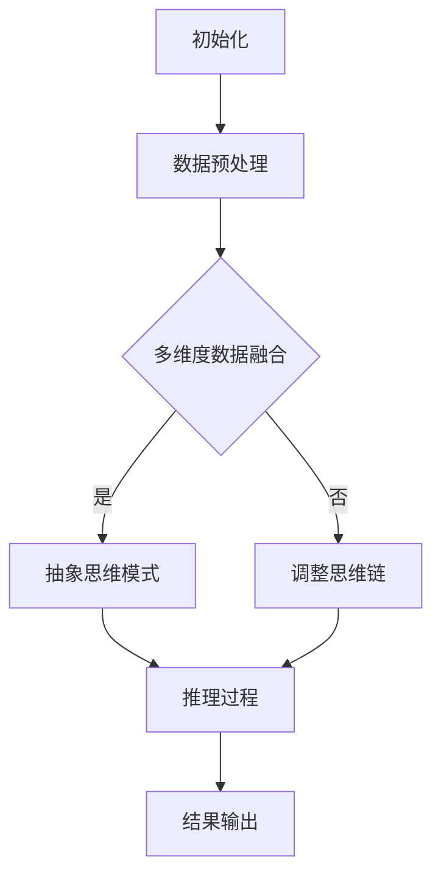
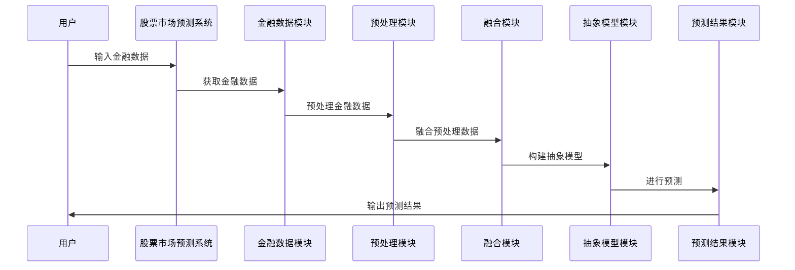
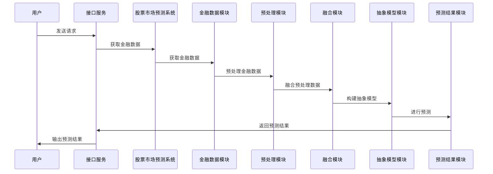

                 


### 引言

**文章标题：思维链增强AI的超维度抽象推理能力**

**关键词：思维链，AI，超维度抽象推理，算法原理，系统架构，实战**

**摘要：**
本文旨在探讨思维链如何增强人工智能（AI）的超维度抽象推理能力。首先，我们将介绍思维链和超维度抽象推理能力的概念，阐述其研究意义与目标。接着，我们将深入分析思维链与传统AI在抽象推理方面的差异，并通过ER实体关系图和概念属性特征对比表格，详细展示思维链与AI的联系。随后，我们将讲解思维链增强AI的超维度抽象推理算法原理，包括算法流程图、Python代码、数学模型和公式，并通过通俗易懂的例子进行说明。然后，我们将描述系统分析与架构设计方案，介绍问题场景、领域模型、系统架构和接口设计。在实战部分，我们将介绍环境安装与配置、系统核心实现源代码、代码应用解读与分析、实际案例分析和项目小结。最后，我们将提供最佳实践技巧和小结，展望未来的研究方向和潜在应用领域。

---

**1.1 引言**

**1.1.1 思维链与超维度抽象推理能力**

思维链是一种通过逻辑推理和抽象思维来解决问题的方法论。它由一系列相互关联的思维节点组成，每个节点代表一个特定的思维过程或思考步骤。超维度抽象推理能力是指AI系统在处理复杂问题时，能够超越单一维度，从多个角度进行抽象和推理的能力。这种能力对于解决复杂问题、进行创新思考具有重要意义。

**1.1.2 研究意义与目标**

随着人工智能技术的发展，AI系统在处理复杂任务时面临着巨大的挑战。超维度抽象推理能力的提升可以显著提高AI系统的智能水平，使其能够更好地应对现实世界中的复杂问题。因此，研究思维链如何增强AI的超维度抽象推理能力具有重要的理论和实践意义。本文的目标是深入探讨这一主题，为相关领域的研究提供新的思路和方法。

---

**1.2 核心概念与联系**

**1.2.1 思维链的定义与特性**

思维链是一种基于逻辑和抽象思维的思考方法，它通过一系列相互关联的思维节点来组织和表达思考过程。每个思维节点代表一个具体的思考步骤，它们通过逻辑关系相互连接，形成一条完整的思维路径。思维链具有以下特性：

- **灵活性**：思维链可以根据问题的需求进行调整和扩展，以适应不同的思考场景。
- **系统性**：思维链强调各个思维节点之间的相互关联，形成一个统一的思考系统。
- **层次性**：思维链将问题分解为不同层次的子问题，通过逐层推理来解决问题。

**1.2.2 超维度抽象推理能力的介绍**

超维度抽象推理能力是指AI系统在处理复杂问题时，能够超越单一维度，从多个角度进行抽象和推理的能力。这种能力包括以下方面：

- **多维度数据融合**：AI系统能够整合来自不同维度的数据，进行综合分析和推理。
- **跨领域知识迁移**：AI系统能够将一个领域中的知识迁移到另一个领域，以解决复杂问题。
- **抽象思维模式**：AI系统能够通过抽象思维模式，从具体问题中提炼出普遍规律，进行推理。

**1.2.3 传统AI与思维链增强AI的对比**

传统AI在处理问题时，通常依赖于特定的算法和数据，其推理过程具有明显的局限性。而思维链增强AI通过引入思维链的概念，能够实现更灵活、更系统的推理过程。以下是传统AI与思维链增强AI在抽象推理方面的对比：

| 特性         | 传统AI          | 思维链增强AI          |
| ------------ | --------------- | --------------------- |
| 推理过程     | 单一维度的线性推理 | 多维度的抽象推理      |
| 数据依赖     | 强依赖          | 弱依赖                |
| 灵活性       | 有限            | 高度灵活              |
| 系统性       | 弱              | 强                    |

**ER实体关系图与概念属性特征对比表**

为了更直观地展示思维链与AI的关系，我们可以通过ER实体关系图和概念属性特征对比表来进行说明。以下是ER实体关系图的Mermaid表示：

```mermaid
erDiagram
  AI ||--o> 思维链 : 增强推理能力
  AI &&--|| 超维度抽象推理能力
```

接下来是概念属性特征对比表格：

| 概念               | 特征对比                             |
| ------------------ | ----------------------------------- |
| 传统AI             | 单一维度，强数据依赖，推理过程有限    |
| 思维链增强AI       | 多维度，弱数据依赖，推理过程灵活、系统 |

通过以上分析，我们可以看到思维链在增强AI超维度抽象推理能力方面具有显著的优势。接下来，我们将进一步探讨思维链增强AI的具体算法原理。

---

**2.1 超维度抽象推理算法概述**

**2.1.1 超维度抽象推理的概念**

超维度抽象推理是指AI系统能够超越单一维度，从多个角度进行抽象和推理的能力。在现实世界中，许多问题都是多维度、复杂的。例如，金融市场的分析需要考虑时间、价格、交易量等多个维度。超维度抽象推理能力使得AI系统能够更全面、深入地理解这些复杂问题，从而提供更准确的预测和分析结果。

**2.1.2 思维链在算法中的应用**

思维链在超维度抽象推理算法中扮演着关键角色。通过引入思维链，AI系统可以在处理问题时采取更灵活、更系统的推理方式。具体来说，思维链的应用包括以下几个方面：

- **思维节点的设置**：在算法中设置多个思维节点，每个节点代表一个具体的推理步骤。这些节点通过逻辑关系相互连接，形成一条完整的推理路径。
- **多维度数据融合**：通过思维链，AI系统能够整合来自不同维度的数据，进行综合分析和推理。例如，在金融市场中，AI系统可以同时考虑时间、价格、交易量等多个维度的数据，进行更全面的预测。
- **抽象思维模式的引入**：思维链可以引导AI系统采用抽象思维模式，从具体问题中提炼出普遍规律。例如，在医疗诊断中，AI系统可以通过思维链，从大量病例数据中总结出疾病的诊断规律。

**2.2 算法流程图（mermaid图）**

为了更直观地展示超维度抽象推理算法的流程，我们可以使用mermaid图来表示。以下是一个简化的算法流程图：



**2.3 Python代码与算法原理讲解**

为了更好地理解超维度抽象推理算法，我们将使用Python代码来详细阐述其原理。以下是一个简化的算法实现：

```python
# 思维链增强超维度抽象推理算法

def mind_chain_abstraction(data):
    # 数据预处理
    preprocessed_data = preprocess_data(data)
    
    # 多维度数据融合
    fused_data = fuse_data(preprocessed_data)
    
    # 抽象思维模式
    abstract_model = abstract_thinking(fused_data)
    
    # 推理过程
    result = reasoning_process(abstract_model)
    
    # 结果输出
    return result

# 辅助函数
def preprocess_data(data):
    # 数据预处理逻辑
    pass

def fuse_data(preprocessed_data):
    # 数据融合逻辑
    pass

def abstract_thinking(fused_data):
    # 抽象思维逻辑
    pass

def reasoning_process(abstract_model):
    # 推理过程逻辑
    pass
```

**2.4 数学模型与公式讲解**

在超维度抽象推理算法中，数学模型和公式起到了关键作用。以下是一个简化的数学模型和公式：

$$
X = f(Y, Z)
$$

其中，$X$ 表示输出结果，$Y$ 和 $Z$ 表示输入数据。函数 $f$ 表示数据融合和抽象思维的过程。具体来说：

- $Y$ 表示预处理后的数据，包括时间、价格、交易量等维度。
- $Z$ 表示抽象思维模式，包括推理规则和逻辑关系。

函数 $f$ 可以通过以下公式表示：

$$
f(Y, Z) = \sum_{i=1}^{n} w_i \cdot (Y_i \cdot Z_i)
$$

其中，$w_i$ 表示权重，$Y_i$ 和 $Z_i$ 分别表示第 $i$ 维度的数据。

**2.5 通俗易懂的例子**

为了更好地理解超维度抽象推理算法，我们可以通过一个具体的例子来说明。假设我们想要预测股票价格的走势。我们可以将股票价格看作是多维度数据的一个示例，包括时间、价格和交易量。

1. **数据预处理**：首先，我们对原始股票价格数据进行预处理，包括去除异常值、填充缺失值等。

2. **多维度数据融合**：然后，我们将预处理后的时间、价格和交易量数据进行融合。例如，我们可以通过加权平均的方式，将这三个维度进行综合。

3. **抽象思维模式**：接下来，我们引入抽象思维模式，从具体问题中提炼出普遍规律。例如，我们可以根据历史数据，总结出价格与交易量之间的关系，以及价格走势的周期性规律。

4. **推理过程**：最后，我们根据抽象思维模式，对股票价格的走势进行推理。例如，我们可以预测未来一段时间内股票价格的波动范围。

通过以上步骤，我们就可以使用超维度抽象推理算法来预测股票价格的走势。

---

**3.1 问题场景与项目背景**

在现实世界中，超维度抽象推理能力的应用场景非常广泛。以下是一个具体的问题场景和项目背景：

**问题场景**：某金融公司希望利用人工智能技术，对股票市场的走势进行预测，以帮助投资者做出更明智的投资决策。

**项目背景**：该公司已经收集了大量的股票市场数据，包括历史价格、交易量、市场情绪等。然而，传统的预测方法在处理这些复杂、多维度的数据时存在明显的局限性，无法提供准确的预测结果。

**项目目标和挑战**：

- **目标**：通过引入思维链增强AI的超维度抽象推理能力，实现更准确、更可靠的股票市场预测。
- **挑战**：如何有效地整合多维度数据，如何构建抽象思维模式，以及如何在复杂的股票市场中进行推理。

---

**3.2 领域模型设计（mermaid类图）**

为了更好地理解超维度抽象推理算法在股票市场预测中的应用，我们可以通过mermaid类图来设计领域模型。以下是一个简化的领域模型：

```mermaid
classDiagram
    StockMarketPrediction <<interface>>
    FinancialData <<interface>>
    PreprocessedData <<interface>>
    FusedData <<interface>>
    AbstractModel <<interface>>
    PredictionResult <<interface>>

    StockMarketPrediction <-|uses|> FinancialData
    StockMarketPrediction <-|uses|> PreprocessedData
    StockMarketPrediction <-|uses|> FusedData
    StockMarketPrediction <-|uses|> AbstractModel
    StockMarketPrediction -> PredictionResult

    PreprocessedData <|-- FusedData
    FusedData <|-- AbstractModel
    AbstractModel <|-- PredictionResult
```

**3.3 系统架构设计（mermaid架构图）**

接下来，我们可以使用mermaid架构图来描述系统的整体架构。以下是一个简化的系统架构图：



**3.4 系统接口设计与系统交互（mermaid序列图）**

为了更详细地描述系统的接口设计和交互流程，我们可以使用mermaid序列图。以下是一个简化的序列图：



通过以上系统架构设计和接口设计，我们可以构建一个高效、可靠的股票市场预测系统，利用思维链增强AI的超维度抽象推理能力，为投资者提供准确的预测结果。

---

**4.1 环境安装与配置**

要运行超维度抽象推理算法，我们需要安装和配置以下环境和工具：

1. **Python环境**：确保Python环境已经安装，版本建议为3.8或更高版本。

2. **深度学习框架**：推荐使用TensorFlow或PyTorch作为深度学习框架。以下是安装TensorFlow的示例命令：

   ```bash
   pip install tensorflow
   ```

3. **数据预处理库**：推荐使用Pandas和NumPy进行数据预处理。以下是安装这些库的示例命令：

   ```bash
   pip install pandas numpy
   ```

4. **可视化库**：为了更好地展示结果，我们可以使用Matplotlib进行数据可视化。以下是安装该库的示例命令：

   ```bash
   pip install matplotlib
   ```

5. **Mermaid插件**：为了生成mermaid图表，我们需要安装一个支持mermaid的编辑器或插件。以下是安装VS Code插件Mermaid Live Preview的示例命令：

   ```bash
   code --install-extension yarnirv-m

