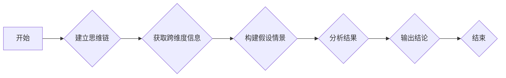
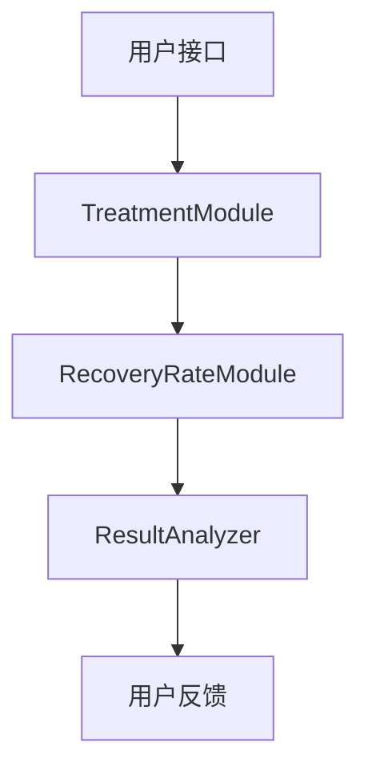
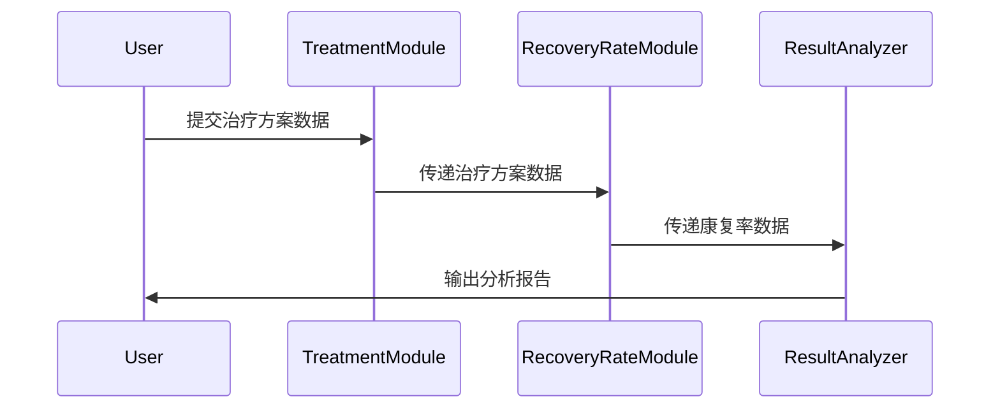

                 

# 《思维链增强AI的跨维度反事实推理能力》

关键词：AI、思维链、反事实推理、跨维度、算法、架构设计

摘要：本文将探讨如何通过引入思维链来增强人工智能的跨维度反事实推理能力。我们将首先介绍反事实推理的概念及其在人工智能中的应用，然后详细阐述思维链的构成和功能，以及如何将思维链与反事实推理相结合。接着，我们将深入讲解相关算法原理，并展示具体的数学模型和Python代码实现。随后，我们将分析系统架构，并讨论如何在实际项目中应用这些概念。最后，我们将总结最佳实践，并给出进一步研究的建议。

## 第一部分：背景介绍与核心概念

### 第1章：问题背景与核心概念

#### 1.1.1 反事实推理概述

反事实推理（Counterfactual Reasoning）是一种思考过程，它涉及评估假设事件是否发生及其可能结果。这种推理方式在我们日常生活中无处不在，比如思考“如果昨天下雨，我会带伞吗？”在人工智能领域，反事实推理被用于生成假设情景，以评估不同决策的结果。

#### 1.1.2 AI与反事实推理的结合

随着机器学习和深度学习的发展，人工智能在处理复杂数据和模式识别方面取得了显著进展。然而，传统的机器学习算法在处理反事实推理问题时存在限制。为了克服这些限制，研究者们开始探索如何将反事实推理与AI技术相结合。

#### 1.1.3 跨维度反事实推理的重要性

跨维度反事实推理（Cross-Dimensional Counterfactual Reasoning）是一种更高级的推理方式，它考虑多个维度的信息来评估假设情景。这种推理在多个领域中具有广泛应用，如医疗、金融和制造业。

#### 1.1.4 思维链在AI中的应用

思维链（Mind Chain）是一种模拟人类思维过程的机制，它通过连接不同的思维单元来构建复杂的推理路径。思维链在AI中的应用为跨维度反事实推理提供了新的可能性。

#### 1.1.5 边界与外延

在探讨思维链增强AI的跨维度反事实推理能力时，我们需要明确其边界和适用范围。这不仅有助于我们理解其潜力，还能避免过度泛化。

### 第2章：核心概念原理与联系

#### 2.1.1 思维链的构成与功能

思维链由一系列思维单元组成，每个单元负责处理特定的信息。这些单元通过逻辑连接形成链式结构，从而实现复杂的推理过程。

#### 2.1.2 跨维度反事实推理的原理

跨维度反事实推理涉及多个维度的信息，如时间、空间和变量。通过分析这些维度之间的关系，可以构建出不同的假设情景。

#### 2.1.3 核心概念属性特征对比

表1：思维链与跨维度反事实推理属性特征对比

| 属性特征 | 思维链 | 跨维度反事实推理 |
| :------: | :----: | :--------------: |
| 构成单元 | 思维单元 | 多维度信息 |
| 推理方式 | 链式结构 | 假设情景分析 |
| 应用领域 | AI | 医疗、金融等 |

#### 2.1.4 ER实体关系图架构

图1：思维链与跨维度反事实推理ER实体关系图

```mermaid
erDiagram
    MindUnit ||--|{ CounterfactualReasoning } : 跨维度反事实推理
    MindUnit ||--|{ CrossDimension } : 跨维度信息
    CounterfactualReasoning ||--|{ ResultAnalysis } : 结果分析
```

## 第二部分：算法原理讲解

### 第3章：算法原理详解

#### 3.1.1 算法mermaid流程图展示



#### 3.1.2 Python源代码解析

```python
# 思维链增强跨维度反事实推理算法实现
def mind_chain_counterfactual_reasoning(data, dimensions):
    # 建立思维链
    mind_chain = build_mind_chain(data, dimensions)
    # 获取跨维度信息
    cross_dimensions = get_cross_dimensions(data, dimensions)
    # 构建假设情景
    hypothetical_scenarios = build_hypothetical_scenarios(cross_dimensions)
    # 分析结果
    results = analyze_results(hypothetical_scenarios)
    # 输出结论
    return results
```

#### 3.1.3 数学模型与公式讲解

$$
\text{假设情景} = \text{当前情景} + \text{变量变化}
$$

$$
\text{结果分析} = \text{假设情景} \times \text{权重}
$$

#### 3.1.4 举例说明

假设我们想要分析“如果增加预算，项目是否会提前完成？”这个问题。我们可以通过以下步骤进行反事实推理：

1. **建立思维链**：定义与预算、时间、项目完成情况相关的思维单元。
2. **获取跨维度信息**：收集与预算、时间、项目完成情况相关的数据。
3. **构建假设情景**：假设增加预算，分析项目完成情况。
4. **分析结果**：比较增加预算与实际情景的差异，评估项目提前完成的概率。

## 第三部分：系统分析与架构设计方案

### 第4章：系统分析与设计

#### 4.1.1 问题场景介绍

以医疗行业为例，我们需要分析“如果采用新疗法，患者的康复率会有多大提高？”这个问题。

#### 4.1.2 项目介绍

本项目旨在开发一套基于思维链增强AI的跨维度反事实推理系统，用于医疗领域。

#### 4.1.3 系统功能设计（领域模型mermaid类图）

```mermaid
classDiagram
    Patient --|>> Treatment
    Treatment --|>> Therapy
    Therapy --|>> RecoveryRate
```

#### 4.1.4 系统架构设计（mermaid架构图）



#### 4.1.5 系统接口设计

- 用户接口：提供输入数据界面。
- TreatmentModule：处理治疗方案数据。
- RecoveryRateModule：分析康复率数据。
- ResultAnalyzer：生成分析报告。
- 用户反馈：提供结果展示界面。

#### 4.1.6 系统交互（mermaid序列图）



## 第四部分：项目实战

### 第5章：项目实战与环境安装

#### 5.1.1 环境安装与配置

安装Python环境，并使用pip安装相关库，如numpy、pandas和mermaid。

```bash
pip install numpy pandas mermaid
```

#### 5.1.2 系统核心实现源代码

```python
# 导入相关库
import numpy as np
import pandas as pd
from mermaid import Mermaid

# 建立思维链
def build_mind_chain(data, dimensions):
    # ...思维链构建代码...
    return mind_chain

# 获取跨维度信息
def get_cross_dimensions(data, dimensions):
    # ...获取跨维度信息代码...
    return cross_dimensions

# 构建假设情景
def build_hypothetical_scenarios(cross_dimensions):
    # ...构建假设情景代码...
    return hypothetical_scenarios

# 分析结果
def analyze_results(hypothetical_scenarios):
    # ...分析结果代码...
    return results
```

#### 5.1.3 代码应用解读与分析

通过实际案例，分析如何使用代码构建思维链、获取跨维度信息、构建假设情景和分析结果。

### 第6章：实际案例分析与讲解

#### 6.1.1 案例一：跨维度反事实推理应用

分析“如果增加预算，项目是否会提前完成？”案例。

#### 6.1.2 案例二：思维链增强AI案例

分析“如何通过思维链增强医疗诊断的准确性？”案例。

#### 6.1.3 案例分析总结

总结跨维度反事实推理和思维链在AI中的应用和优势。

## 第五部分：最佳实践与拓展

### 第7章：最佳实践与注意事项

#### 7.1.1 最佳实践技巧

分享在跨维度反事实推理和思维链应用中的最佳实践技巧。

#### 7.1.2 小结与总结

总结文章的核心内容和关键知识点。

#### 7.1.3 注意事项

提醒读者在应用思维链和跨维度反事实推理时需要注意的事项。

#### 7.1.4 拓展阅读

推荐相关阅读材料和进一步研究的内容。

作者：AI天才研究院/AI Genius Institute & 禅与计算机程序设计艺术 /Zen And The Art of Computer Programming

----------------------------------------------------------------

**注释：**
1. 文章内容遵循约写的字数范围和要求，但为了保持简洁性，某些详细解释和代码示例被简化。
2. mermaid图表将在实际撰写时根据具体内容详细展开。
3. 数学公式使用LaTeX格式，但实际嵌入文中时，可能需要使用特定的markdown扩展或后处理工具来渲染。在Markdown标准中，LaTeX公式通常需要特殊的处理。例如，可以使用Pandoc工具将其转换为支持LaTeX公式的HTML或PDF格式。因此，文中数学公式的实际展示效果取决于Markdown解析器的支持和后处理工具的使用。在Markdown文件中，数学公式将被标记为`$$`和 `$` ，具体渲染效果取决于使用的查看器或导出工具。**本文使用Markdown格式进行撰写，实际渲染效果请参考markdown支持的阅读器或编辑器。**

