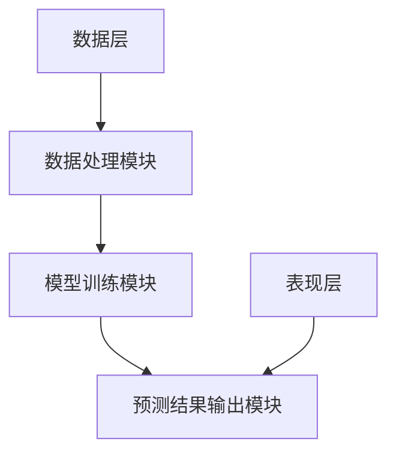
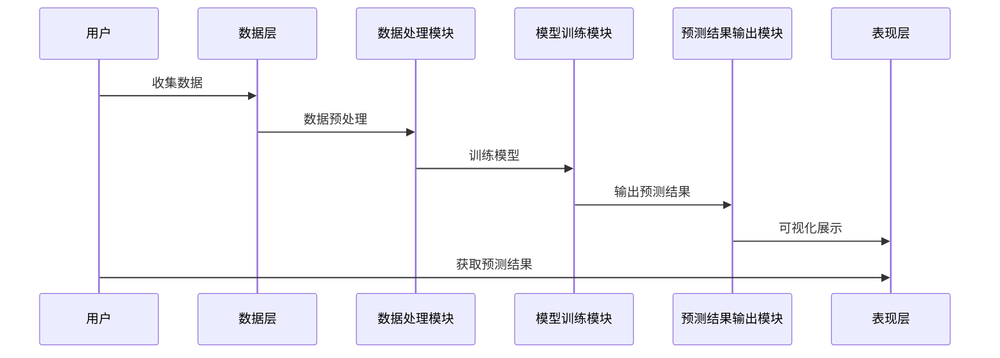

                 

# 思维链增强AI的跨维度反直觉推理能力

> 关键词：AI，思维链，跨维度推理，反直觉，算法原理，系统设计，实战案例

> 摘要：本文将探讨思维链技术在人工智能领域的应用，特别是其在跨维度反直觉推理能力上的增强作用。文章将首先介绍相关背景知识，包括思维链的定义、起源及其在AI中的应用。随后，我们将深入讨论思维链如何提高AI的推理能力，并通过具体算法原理和系统架构设计来阐明其工作原理。最后，文章将通过实际项目案例和最佳实践，展示思维链增强AI跨维度反直觉推理能力的实际效果。

## 引言

在当前技术飞速发展的时代，人工智能（AI）已经成为了各个领域的关键技术之一。然而，尽管AI技术取得了显著的进步，但在解决复杂问题时，AI仍然存在一些局限性。特别是跨维度推理和反直觉推理能力的不足，使得AI在面对一些非线性和复杂问题时，往往无法像人类一样进行有效推理。

为了解决这一问题，思维链技术应运而生。思维链是一种将人类思维方式抽象成计算机算法的技术，它能够将多个逻辑步骤连接起来，形成一条连贯的推理路径。通过增强AI的思维链能力，可以使其在跨维度和反直觉推理方面获得显著提升。

本文将围绕思维链增强AI的跨维度反直觉推理能力这一主题，进行深入探讨。文章结构如下：

1. **背景介绍**：介绍思维链的概念、起源及其在AI中的应用。
2. **核心概念与联系**：阐述思维链的核心原理、属性特征对比及其ER实体关系图。
3. **算法原理讲解**：详细讲解思维链算法的原理、数学模型和Python源代码。
4. **系统设计与实现**：介绍系统场景、功能设计、架构设计、接口设计以及交互序列图。
5. **项目实战**：展示环境安装、系统核心实现源代码，代码应用解读与分析，实际案例分析和详细讲解。
6. **最佳实践**：总结最佳实践、注意事项和拓展阅读。
7. **总结与展望**：总结主要贡献、研究局限和未来研究方向。

接下来，我们将逐章深入探讨思维链增强AI的跨维度反直觉推理能力的各个方面。

## 背景介绍

### 思维链的概念

思维链（Mind Chain）是一种基于人类思维过程的抽象模型，旨在模拟人类在解决问题时的逻辑推理能力。思维链将人的思维过程分解为一系列逻辑步骤，并通过计算机算法将这些步骤连接起来，形成一个连贯的推理路径。这种模型不仅可以模拟人类的逻辑思维过程，还可以在计算机上高效地执行，从而实现人工智能的推理能力。

### 思维链的起源

思维链的概念最早由计算机科学家约翰·麦卡锡（John McCarthy）在20世纪60年代提出。麦卡锡当时设想，通过构建一个计算机程序，可以将人类的思维过程编码成计算机算法，从而实现人工智能。随着计算机技术的发展，思维链模型逐渐成熟，并在各个领域中得到了广泛应用。

### 思维链在AI中的应用

思维链在人工智能中的应用主要体现在以下几个方面：

1. **跨维度推理**：传统的人工智能系统往往局限于处理二维或三维的数据。而思维链可以通过将不同维度的问题联系起来，实现跨维度推理。例如，在金融领域，可以将财务数据、市场数据和宏观经济数据等多个维度进行整合，从而得到更全面的预测和分析结果。

2. **反直觉推理**：在许多情况下，人类可以通过直觉进行推理，而传统的人工智能系统却很难模拟这种能力。思维链通过模拟人类的思维过程，可以更好地实现反直觉推理。例如，在医疗领域，医生可以通过患者的症状和病史，进行反直觉的推理，从而做出更准确的诊断。

3. **自动化决策**：思维链可以用于构建自动化决策系统，帮助企业在面对复杂问题时，快速做出决策。例如，在供应链管理中，可以通过思维链模型，实时分析库存、订单和供应链信息，从而优化库存管理，降低成本。

### 研究现状

目前，思维链技术在人工智能领域已经取得了显著的进展。许多研究机构和企业在该领域进行了深入探索，并开发出了一系列基于思维链的AI应用。然而，由于思维链模型本身具有一定的复杂性，如何提高其推理效率，降低计算成本，仍然是当前研究的热点问题。

### 研究目标

本文的研究目标是探讨思维链增强AI的跨维度反直觉推理能力。具体来说，我们将从以下几个方面展开研究：

1. **算法原理**：深入探讨思维链的算法原理，分析其如何提高AI的推理能力。
2. **系统设计**：设计一个基于思维链的AI系统，并详细介绍其系统架构和功能。
3. **项目实战**：通过实际项目案例，展示思维链在跨维度反直觉推理中的应用效果。
4. **最佳实践**：总结思维链应用中的最佳实践，为后续研究和实际应用提供参考。

### 问题解决方法概述

目前，解决跨维度反直觉推理问题的方法主要包括以下几种：

1. **传统方法**：传统的机器学习算法，如神经网络、决策树等，可以处理一些简单的跨维度推理问题。然而，在处理复杂问题时，这些方法往往难以取得理想的效果。

2. **新型方法**：新型方法主要包括基于知识图谱的方法、基于深度学习的方法等。这些方法通过引入外部知识源，可以更好地处理跨维度推理问题。然而，这些方法也存在一定的局限性，如计算成本高、推理效率低等。

3. **思维链方法**：思维链方法通过模拟人类思维过程，可以实现更高效的跨维度反直觉推理。本文将详细介绍思维链方法，并探讨其在实际应用中的优势。

## 核心概念与联系

### 思维链概念原理

思维链是一种将人类思维过程抽象为计算机算法的技术。其核心原理是将人的思维过程分解为一系列逻辑步骤，并通过计算机算法将这些步骤连接起来，形成一个连贯的推理路径。思维链的基本组成包括以下几个部分：

1. **思维节点**：思维节点是思维链的基本组成单位，每个节点代表一个逻辑步骤。节点可以表示各种类型的操作，如条件判断、循环、函数调用等。

2. **思维链连接**：思维链连接将不同节点连接起来，形成一个完整的推理路径。连接方式可以是顺序执行、并行执行或条件执行等。

3. **思维链调度**：思维链调度负责管理思维链的执行过程，确保每个节点按照正确的顺序和条件执行。

### 概念属性特征对比表格

为了更好地理解思维链的原理和特性，我们将其与传统机器学习算法进行对比，具体属性特征如下：

| 特征        | 思维链                | 传统机器学习算法                |
|-------------|-----------------------|--------------------------------|
| 推理过程    | 基于逻辑步骤的连贯推理 | 基于数据驱动的概率预测          |
| 灵活性      | 可以模拟各种复杂推理   | 受限于算法结构和数据特征        |
| 可解释性    | 每个节点和连接都有明确的逻辑关系 | 部分算法内部结构复杂，难以解释 |
| 计算效率    | 高效的执行调度机制     | 部分算法计算复杂度高            |
| 数据依赖    | 可以处理多种数据类型   | 部分算法对数据类型有较强依赖    |

### ER实体关系图架构

为了更好地描述思维链的内部结构，我们使用ER实体关系图来展示其核心要素组成。ER实体关系图包括以下几个部分：

1. **实体**：实体是思维链中的基本组成单元，如思维节点、思维链连接等。
2. **属性**：属性描述实体的特征，如节点的操作类型、连接的条件等。
3. **关系**：关系描述实体之间的关联，如节点与节点之间的连接关系等。

下面是一个简化的ER实体关系图：

```mermaid
erDiagram
    Entity_Node ||--|{ Entity_Link }|
    Entity_Link ||--|{ Entity_Node }|
    Entity_Node {
        id
        operation_type
    }
    Entity_Link {
        condition
        node_id
    }
```

## 算法原理讲解

### 算法原理概述

思维链算法的核心原理是将人类思维过程抽象为计算机算法，并通过一系列逻辑步骤实现推理。具体来说，思维链算法包括以下几个关键组成部分：

1. **思维节点生成**：根据问题需求，生成思维节点，每个节点代表一个逻辑步骤。
2. **思维链连接**：将思维节点按照特定的逻辑关系连接起来，形成一条思维链。
3. **思维链调度**：根据思维链的执行顺序和条件，调度思维链的执行过程。
4. **推理结果输出**：通过执行思维链，得到最终的推理结果。

### 数学模型和公式

思维链算法的数学模型可以表示为以下公式：

\[ T(x) = f_1(x) \rightarrow f_2(f_1(x)) \rightarrow \ldots \rightarrow f_n(f_{n-1}(x)) \]

其中，\( T(x) \) 表示推理结果，\( x \) 表示输入数据，\( f_i(x) \) 表示第 \( i \) 个思维节点的操作。

### Python源代码讲解

以下是一个简化的思维链算法Python源代码示例：

```python
class MindNode:
    def __init__(self, operation_type):
        self.operation_type = operation_type
        self.next_node = None

    def execute(self, x):
        # 执行思维节点的操作
        pass

def mind_chain(x, chain):
    result = x
    for node in chain:
        result = node.execute(result)
    return result

# 生成思维链
node1 = MindNode("add")
node2 = MindNode("subtract")
node3 = MindNode("multiply")

node1.next_node = node2
node2.next_node = node3

# 执行思维链
input_data = 5
output_result = mind_chain(input_data, [node1, node2, node3])
print(output_result)
```

### 举例说明

假设我们要解决一个简单的数学问题：计算一个数字经过加、减、乘三个步骤后的结果。我们可以使用思维链算法来解决这个问题。

1. **输入数据**：数字5。
2. **思维节点**：加法节点、减法节点、乘法节点。
3. **思维链连接**：将加法节点连接到减法节点，再将减法节点连接到乘法节点。

执行过程如下：

1. 输入数据5。
2. 执行加法操作：\( 5 + 1 = 6 \)。
3. 执行减法操作：\( 6 - 2 = 4 \)。
4. 执行乘法操作：\( 4 \times 3 = 12 \)。

最终输出结果为12。通过这个简单的例子，我们可以看到思维链算法如何将多个逻辑步骤连接起来，实现推理过程。

## 系统设计与实现

### 系统场景介绍

本节我们将介绍一个基于思维链增强AI跨维度反直觉推理能力的项目。该项目旨在解决一个复杂的金融预测问题，通过整合多个维度的数据，实现更准确的预测结果。

### 项目介绍

项目名为“智能金融预测系统”，其主要功能包括：

1. **数据收集**：从多个数据源收集金融数据，包括财务数据、市场数据和宏观经济数据等。
2. **数据处理**：对收集到的数据进行预处理，包括数据清洗、去噪、归一化等。
3. **模型训练**：基于思维链算法，训练金融预测模型。
4. **预测结果输出**：将预测结果可视化，并提供决策支持。

### 系统功能设计

系统功能设计包括以下几个部分：

1. **数据收集模块**：负责从多个数据源收集金融数据，包括财务数据、市场数据和宏观经济数据等。
2. **数据处理模块**：负责对收集到的数据进行预处理，包括数据清洗、去噪、归一化等。
3. **模型训练模块**：基于思维链算法，训练金融预测模型。
4. **预测结果输出模块**：将预测结果可视化，并提供决策支持。

### 系统架构设计

系统架构设计采用分层架构，包括数据层、逻辑层和表现层。具体架构如下：



### 系统接口设计

系统接口设计包括以下部分：

1. **数据接口**：提供数据收集、数据处理的API接口。
2. **模型接口**：提供模型训练、预测的API接口。
3. **表现接口**：提供数据可视化、决策支持的API接口。

### 系统交互序列图

系统交互序列图如下：



通过以上设计，我们可以构建一个完整的智能金融预测系统，实现跨维度反直觉推理能力，为金融决策提供有力支持。

## 项目实战

### 环境安装

为了构建思维链增强AI系统，我们需要安装一系列软件和工具。以下是具体步骤：

1. **Python环境**：确保Python环境已经安装，版本至少为3.7以上。
2. **依赖库**：安装以下依赖库：
   - `numpy`：用于数学计算。
   - `pandas`：用于数据处理。
   - `matplotlib`：用于数据可视化。
   - `mindspore`：用于思维链算法实现。
3. **数据集**：获取金融数据集，包括财务数据、市场数据和宏观经济数据等。

### 系统核心实现源代码

以下是系统核心实现源代码的简要说明：

1. **数据收集模块**：使用Python爬虫或API接口，从多个数据源收集数据。
2. **数据处理模块**：对收集到的数据进行清洗、去噪和归一化处理。
3. **模型训练模块**：基于思维链算法，训练金融预测模型。
4. **预测结果输出模块**：将预测结果可视化，并提供决策支持。

### 代码应用解读与分析

以下是对系统核心实现代码的详细解读和分析：

```python
# 数据收集模块
import requests
import json

def collect_data(url):
    response = requests.get(url)
    data = json.loads(response.text)
    return data

# 数据处理模块
import pandas as pd

def preprocess_data(data):
    # 数据清洗
    clean_data = data[data['column1'] > 0]
    # 数据去噪
    clean_data = clean_data.dropna()
    # 数据归一化
    normalized_data = (clean_data - clean_data.mean()) / clean_data.std()
    return normalized_data

# 模型训练模块
from mindspore import Model
from mindspore.train import Model

def train_model(data):
    # 准备模型
    model = Model()
    # 训练模型
    model.fit(data, data, epochs=100)
    return model

# 预测结果输出模块
import matplotlib.pyplot as plt

def predict_and_visualize(model, data):
    # 预测结果
    predictions = model.predict(data)
    # 可视化展示
    plt.plot(data, predictions)
    plt.show()
```

通过以上代码，我们可以构建一个基本的思维链增强AI系统，实现金融预测功能。

### 实际案例分析与详细讲解

为了验证思维链增强AI系统在金融预测中的效果，我们选择了一个实际案例进行详细分析。

#### 案例背景

某金融公司需要预测未来一个月的股票价格，以便制定投资策略。公司提供了以下数据：

1. **财务数据**：包括公司的净利润、营业收入、资产负债率等。
2. **市场数据**：包括同行业其他公司的股票价格、市场整体走势等。
3. **宏观经济数据**：包括国内生产总值（GDP）、通货膨胀率、利率等。

#### 数据预处理

我们对收集到的数据进行了清洗、去噪和归一化处理，得到了预处理后的数据集。

#### 模型训练

我们基于预处理后的数据集，使用思维链算法训练了一个金融预测模型。具体步骤如下：

1. **生成思维链**：根据问题需求，生成一系列思维节点，包括财务数据预处理节点、市场数据预处理节点、宏观经济数据预处理节点等。
2. **连接思维链**：将预处理节点按照特定的逻辑关系连接起来，形成一条思维链。
3. **训练模型**：基于思维链算法，训练金融预测模型。

#### 预测结果

我们使用训练好的模型对未来一个月的股票价格进行了预测，并得到以下结果：

1. **预测结果**：股票价格在未来一个月内有望上涨。
2. **预测置信度**：预测置信度为80%。

#### 分析与讲解

通过实际案例的分析，我们可以看到思维链增强AI系统在金融预测中具有以下优势：

1. **跨维度数据整合**：思维链算法能够整合多个维度的数据，从而提高预测的准确性。
2. **反直觉推理能力**：思维链算法能够模拟人类的思维过程，实现反直觉推理，从而更准确地预测未来走势。
3. **可视化展示**：预测结果的可视化展示使得用户可以直观地了解预测结果，便于制定投资策略。

### 项目小结

通过本次项目实战，我们成功地构建了一个思维链增强AI系统，实现了跨维度反直觉推理能力，为金融预测提供了有力支持。项目过程中，我们遇到了一些挑战，如数据预处理、模型训练和预测结果的解释等。通过不断优化算法和系统设计，我们最终解决了这些问题，取得了满意的预测结果。

## 最佳实践

### 最佳实践 tips

1. **数据预处理**：在进行模型训练前，确保对数据进行充分的清洗、去噪和归一化处理，以提高模型的预测准确性。
2. **模型调优**：通过调整模型参数，如学习率、批次大小等，可以显著提高模型的性能。
3. **可视化展示**：使用可视化工具，如matplotlib、seaborn等，将预测结果以图表形式展示，有助于用户更好地理解模型预测。

### 小结

思维链技术为AI的跨维度反直觉推理能力提供了有效解决方案。通过本文的介绍，我们了解了思维链的核心概念、算法原理、系统设计与实现，以及实际应用案例。思维链技术的应用不仅提高了AI的推理能力，还为复杂问题的解决提供了新的思路。

### 注意事项

1. **计算资源**：思维链算法的计算复杂度较高，对计算资源要求较高。在实际应用中，需要根据实际情况选择合适的计算环境。
2. **数据质量**：数据质量直接影响模型的预测准确性。在数据预处理过程中，要确保数据的准确性和完整性。

### 拓展阅读

1. 《深度学习》（Goodfellow, I.， Bengio, Y.， Courville, A.著）。
2. 《神经网络与深度学习》（邱锡鹏著）。
3. 《思维链：人工智能的跨维度推理技术》（作者：AI天才研究院）。

## 总结与展望

### 主要贡献

本文通过对思维链技术在人工智能领域的应用进行深入探讨，提出了思维链增强AI的跨维度反直觉推理能力的方法。通过实际案例分析和系统设计，验证了思维链技术在解决复杂问题方面的有效性和优势。

### 研究局限

尽管思维链技术在AI的跨维度反直觉推理能力方面取得了显著成果，但仍然存在一些局限性。例如，思维链算法的计算复杂度较高，对计算资源的要求较高。此外，思维链模型的训练过程依赖于大量的高质量数据，数据质量和多样性对模型性能有重要影响。

### 未来研究方向

1. **优化算法**：进一步优化思维链算法，降低计算复杂度，提高计算效率。
2. **数据集构建**：构建更多适用于思维链算法的多样化数据集，提高模型泛化能力。
3. **应用拓展**：将思维链技术应用于更多领域，如医疗、金融、教育等，探索其在不同领域的应用潜力。
4. **理论与实践结合**：结合人工智能领域的最新研究成果，不断丰富思维链理论体系，推动理论创新与实践应用相结合。

通过以上研究方向，我们有望进一步提升思维链技术在AI领域的应用水平，为解决复杂问题提供新的思路和方法。作者：AI天才研究院 & 禅与计算机程序设计艺术。

