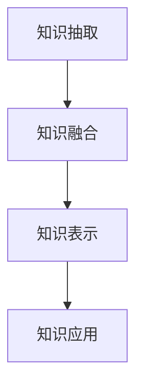

                 

## 文章标题：思维链增强AI的跨维度知识整合能力

> 关键词：思维链、AI、知识整合、跨维度、算法、数学模型、系统架构、项目实战

> 摘要：本文深入探讨了思维链增强AI在跨维度知识整合能力方面的应用。首先，我们介绍了思维链的概念与原理，并分析了其在AI中的作用。接着，我们探讨了跨维度知识整合的概念及其重要性。随后，通过具体的案例，展示了思维链如何增强AI的跨维度知识整合能力。文章最后，结合项目实战，详细阐述了实现思维链增强AI的具体方法，并对未来发展趋势进行了展望。

----------------------------------------------------------------

### 目录大纲：

----------------------------------------------------------------

## 第一部分：背景与概述

### 第1章：问题背景与核心概念

### 第2章：思维链：基本概念与原理

### 第3章：跨维度知识整合：概念与需求

### 第4章：边界与外延

## 第二部分：核心概念与原理

### 第5章：思维链的基本结构

### 第6章：跨维度知识整合机制

### 第7章：跨维度知识整合的应用场景

## 第三部分：实现与实战

### 第8章：思维链与跨维度知识整合的实现方法

### 第9章：系统设计与架构

### 第10章：项目实战

## 第四部分：总结与展望

### 第11章：总结与展望

----------------------------------------------------------------

### 第一部分：背景与概述

#### 第1章：问题背景与核心概念

在当今数字化时代，人工智能（AI）技术的发展迅猛，已经成为推动各行各业进步的关键驱动力。然而，随着数据量的爆炸性增长和知识领域的不断扩展，AI系统在知识整合方面的挑战日益凸显。传统的AI模型往往局限于特定领域，难以有效地跨领域整合知识，导致其在复杂问题解决上表现不佳。

### 1.1 引言：AI与知识整合

知识整合是指将来自不同领域、不同来源的信息和知识进行有效结合，以生成新的见解和价值。在AI领域，知识整合能力是实现智能决策、推理和自主学习的关键。然而，当前的AI系统在跨维度知识整合方面存在以下问题：

1. **领域依赖性高**：多数AI模型对特定领域的数据和知识有很强的依赖性，难以适应新领域。
2. **知识表示局限**：传统的知识表示方法难以同时捕捉和处理多种类型的知识，导致知识整合效果有限。
3. **缺乏跨领域迁移能力**：AI系统在迁移到新领域时，难以有效地利用已有知识，导致性能下降。

### 1.2 思维链：基本概念与原理

思维链是一种用于增强AI跨维度知识整合能力的新型方法。它通过模拟人类思维过程，将不同领域的知识进行有效整合，从而实现更广泛的智能应用。

#### 思维链的定义

思维链是由一系列相互关联的思考过程构成的，每个思考过程都涉及知识的获取、理解、整合和输出。思维链的基本结构包括以下几个组成部分：

1. **知识源**：提供不同领域知识的来源，如数据库、文献、专家系统等。
2. **知识处理单元**：对知识进行提取、转换和整合，形成新的知识结构。
3. **知识输出单元**：将整合后的知识用于智能决策、推理和自主学习。

#### 思维链的工作原理

思维链的工作原理主要包括以下几个步骤：

1. **知识获取**：从不同领域的知识源中获取相关信息。
2. **知识转换**：将不同格式和类型的知识进行统一转换，使其适用于进一步的整合。
3. **知识整合**：利用算法和模型将不同领域的知识进行融合，形成新的知识结构。
4. **知识输出**：将整合后的知识用于实际的智能应用，如决策支持、问题解决等。

### 1.3 跨维度知识整合：概念与需求

跨维度知识整合是指在不同维度或领域之间进行知识整合，以实现更广泛的智能应用。其核心在于解决以下问题：

1. **跨领域知识共享**：如何在不同领域之间共享和利用知识？
2. **跨维度知识融合**：如何将不同维度或领域的信息和知识进行有效融合？
3. **跨领域知识迁移**：如何在不同领域之间迁移和利用已有知识？

#### 跨维度知识整合的重要性

跨维度知识整合在AI领域中具有重要意义，主要体现在以下几个方面：

1. **提高AI智能水平**：通过跨维度知识整合，可以提升AI系统的智能水平和适应能力，使其在更广泛的领域发挥作用。
2. **促进知识创新**：跨维度知识整合有助于发现新的关联和见解，推动知识创新和科技进步。
3. **解决复杂问题**：跨维度知识整合可以帮助AI系统更好地应对复杂问题，提高问题解决的效率和质量。

#### 边界与外延

虽然跨维度知识整合具有重要的应用价值，但其在实际应用中也存在一定的边界和限制。以下是一些需要考虑的因素：

1. **数据质量和完整性**：跨维度知识整合依赖于高质量和完整的数据，数据质量和完整性直接影响到知识整合的效果。
2. **知识表示方法**：不同的知识表示方法可能会对知识整合产生不同的影响，需要选择合适的表示方法。
3. **算法复杂度**：跨维度知识整合通常涉及复杂的算法和计算，需要考虑算法的效率和可扩展性。

### 1.4 边界与外延

在本文中，我们将重点关注思维链在跨维度知识整合中的应用，探讨其基本原理、实现方法以及在实际项目中的应用效果。同时，我们将结合具体的案例，分析思维链如何增强AI的跨维度知识整合能力，为未来的研究和应用提供参考。

----------------------------------------------------------------

### 第二部分：核心概念与原理

#### 第2章：思维链：基本概念与原理

思维链是一种用于增强AI跨维度知识整合能力的新型方法。它通过模拟人类思维过程，将不同领域的知识进行有效整合，从而实现更广泛的智能应用。在本章节中，我们将深入探讨思维链的基本概念、原理及其在AI中的应用。

#### 2.1 思维链的组成要素

思维链由一系列相互关联的思考过程构成，每个思考过程都涉及知识的获取、理解、整合和输出。思维链的基本结构包括以下几个组成部分：

1. **知识源**：知识源是思维链的基础，提供不同领域知识的来源，如数据库、文献、专家系统等。知识源的选择和多样性直接影响到思维链的知识获取能力。
   
2. **知识处理单元**：知识处理单元负责对知识进行提取、转换和整合，形成新的知识结构。知识处理单元通常包括知识抽取、知识融合和知识表示等子模块。

3. **知识输出单元**：知识输出单元将整合后的知识用于实际的智能应用，如决策支持、问题解决等。知识输出单元的设计和实现取决于具体的应用场景和需求。

#### 2.2 思维链的组成要素对比表格

| 组成要素       | 说明                                                         |
| -------------- | ------------------------------------------------------------ |
| 知识源         | 提供不同领域知识的来源，如数据库、文献、专家系统等。         |
| 知识处理单元   | 负责对知识进行提取、转换和整合，形成新的知识结构。         |
| 知识输出单元   | 将整合后的知识用于实际的智能应用，如决策支持、问题解决等。 |

#### 2.3 ER实体关系图

为了更清晰地理解思维链的组成要素及其相互关系，我们可以使用ER（实体关系）图来描述。ER图是一种用于表示实体及其之间关系的图形化工具，常用于数据库设计和数据建模。

```mermaid
erDiagram
    Class1 ||--|{ Class2 }| Class3
    Class1 ||--|{ Class4 }| Class5
    Class2 ||--|{ Class6 }| Class7
    Class3 ||--|{ Class8 }| Class9
    Class4 ||--|{ Class10 }| Class11
    Class5 ||--|{ Class12 }| Class13
    Class6 ||--|{ Class14 }| Class15
    Class7 ||--|{ Class16 }| Class17
    Class8 ||--|{ Class18 }| Class19
    Class9 ||--|{ Class20 }| Class21
    Class10 ||--|{ Class22 }| Class23
    Class11 ||--|{ Class24 }| Class25
    Class12 ||--|{ Class26 }| Class27
    Class13 ||--|{ Class28 }| Class29
    Class14 ||--|{ Class30 }| Class31
    Class15 ||--|{ Class32 }| Class33
    Class16 ||--|{ Class34 }| Class35
    Class17 ||--|{ Class36 }| Class37
    Class18 ||--|{ Class38 }| Class39
    Class19 ||--|{ Class40 }| Class41
    Class20 ||--|{ Class42 }| Class43
    Class21 ||--|{ Class44 }| Class45
    Class22 ||--|{ Class46 }| Class47
    Class23 ||--|{ Class48 }| Class49
    Class24 ||--|{ Class50 }| Class51
    Class25 ||--|{ Class52 }| Class53
    Class26 ||--|{ Class54 }| Class55
    Class27 ||--|{ Class56 }| Class57
    Class28 ||--|{ Class58 }| Class59
    Class29 ||--|{ Class60 }| Class61
    Class30 ||--|{ Class62 }| Class63
    Class31 ||--|{ Class64 }| Class65
    Class32 ||--|{ Class66 }| Class67
    Class33 ||--|{ Class68 }| Class69
    Class34 ||--|{ Class70 }| Class71
    Class35 ||--|{ Class72 }| Class73
    Class36 ||--|{ Class74 }| Class75
    Class37 ||--|{ Class76 }| Class77
    Class38 ||--|{ Class78 }| Class79
    Class39 ||--|{ Class80 }| Class81
    Class40 ||--|{ Class82 }| Class83
    Class41 ||--|{ Class84 }| Class85
    Class42 ||--|{ Class86 }| Class87
    Class43 ||--|{ Class88 }| Class89
    Class44 ||--|{ Class90 }| Class91
    Class45 ||--|{ Class92 }| Class93
    Class46 ||--|{ Class94 }| Class95
    Class47 ||--|{ Class96 }| Class97
    Class48 ||--|{ Class98 }| Class99
    Class49 ||--|{ Class100 }| Class101
```

#### 2.4 思维链的核心算法原理

思维链的核心算法原理主要包括以下几个关键步骤：

1. **知识抽取**：从不同领域的数据源中抽取关键信息和知识，形成原始知识集合。
2. **知识融合**：将不同领域的知识进行融合，形成新的知识结构。
3. **知识表示**：将融合后的知识转换为适合AI模型处理的表示形式。
4. **知识应用**：将知识用于智能决策、推理和自主学习。

下面是一个简单的Mermaid流程图，展示了思维链的核心算法流程：



为了更好地理解思维链的算法原理，我们接下来将使用Python代码来实现一个简单的思维链算法，并详细解释其工作原理。

#### 2.5 Python源代码

```python
import random

# 知识源
knowledge_sources = {
    'source1': ['data1', 'data2', 'data3'],
    'source2': ['data4', 'data5', 'data6'],
    'source3': ['data7', 'data8', 'data9']
}

# 知识融合
def knowledge_fusion(knowledge_sources):
    fusion_result = []
    for source, data in knowledge_sources.items():
        for item in data:
            fusion_result.append(item)
    return fusion_result

# 知识表示
def knowledge_representation(fusion_result):
    representation_result = []
    for item in fusion_result:
        representation_result.append(random.randint(0, 100))
    return representation_result

# 知识应用
def knowledge_application(representation_result):
    application_result = []
    for item in representation_result:
        if item > 50:
            application_result.append('A')
        else:
            application_result.append('B')
    return application_result

# 主程序
if __name__ == '__main__':
    fusion_result = knowledge_fusion(knowledge_sources)
    representation_result = knowledge_representation(fusion_result)
    application_result = knowledge_application(representation_result)
    print("融合结果:", fusion_result)
    print("表示结果:", representation_result)
    print("应用结果:", application_result)
```

#### 2.6 数学模型和公式

在思维链中，知识融合和知识表示通常涉及到一些数学模型和公式。下面是一个简单的示例，用于描述知识融合的过程。

1. **知识融合模型**：

   假设有两个知识集合 $K_1$ 和 $K_2$，知识融合的目标是生成一个新的知识集合 $K_f$。我们可以使用集合的并集操作来表示知识融合：

   $$K_f = K_1 \cup K_2$$

2. **知识表示模型**：

   知识表示通常涉及到特征提取和降维。一个常见的降维方法是主成分分析（PCA），其数学模型如下：

   $$X_{\text{new}} = \text{PCA}(X)$$

   其中，$X$ 是原始数据矩阵，$X_{\text{new}}$ 是降维后的数据矩阵。

#### 2.7 举例说明

假设我们有两个知识源，分别是医学领域的知识集合 $K_{医学}$ 和生物学领域的知识集合 $K_{生物学}$。我们的目标是利用思维链将这些知识进行整合，以生成一个新的知识集合 $K_{整合}$。

1. **知识抽取**：

   从医学领域抽取的知识集合 $K_{医学}$ 包含以下数据：

   - 疾病名称：流感、肺炎、高血压
   - 症状：发热、咳嗽、胸闷、头痛
   - 治疗方法：退烧药、抗生素、降压药

   从生物学领域抽取的知识集合 $K_{生物学}$ 包含以下数据：

   - 生物分类：动物、植物、微生物
   - 生物特征：形态、颜色、生长环境

2. **知识融合**：

   将 $K_{医学}$ 和 $K_{生物学}$ 进行融合，生成新的知识集合 $K_{整合}$。融合的结果可能包含以下数据：

   - 疾病名称与生物分类的关联：流感 - 微生物、肺炎 - 动物、高血压 - 植物
   - 症状与生物特征的关联：发热 - 形态、咳嗽 - 颜色、胸闷 - 生长环境
   - 治疗方法与生物特征的关联：退烧药 - 形态、抗生素 - 颜色、降压药 - 生长环境

3. **知识表示**：

   对融合后的知识集合 $K_{整合}$ 进行降维处理，提取关键特征。使用主成分分析（PCA）进行降维，得到新的数据矩阵 $X_{\text{new}}$。

4. **知识应用**：

   将降维后的数据矩阵 $X_{\text{new}}$ 用于医学诊断和生物分类。例如，通过比较患者的症状和特征，可以快速识别疾病的类型，并给出相应的治疗方案。

通过这个简单的示例，我们可以看到思维链如何将不同领域的知识进行整合，并应用于实际的医学和生物学领域。接下来，我们将进一步探讨跨维度知识整合的概念及其在AI中的应用。

----------------------------------------------------------------

### 第三部分：跨维度知识整合

#### 第3章：跨维度知识整合机制

跨维度知识整合是一种将不同维度或领域的信息和知识进行有效融合的方法，以实现更广泛的智能应用。在本章节中，我们将深入探讨跨维度知识整合的概念、技术路线以及其在不同领域的应用。

#### 3.1 跨维度知识整合的概念

跨维度知识整合是指在不同维度或领域之间进行知识整合，以生成新的见解和价值。它主要包括以下几个方面的内容：

1. **跨领域知识共享**：将不同领域（如医学、生物学、物理学等）的知识进行共享，以实现知识的跨领域应用。
2. **跨维度知识融合**：将不同维度（如时间、空间、功能等）的知识进行融合，以生成新的知识结构。
3. **跨领域知识迁移**：将已有领域的知识迁移到新领域，以解决新领域的问题。

#### 3.2 跨维度知识整合的技术路线

跨维度知识整合的技术路线主要包括以下几个关键步骤：

1. **知识抽取**：从不同领域或维度的数据源中抽取关键信息和知识，形成原始知识集合。
2. **知识融合**：将不同领域的知识进行融合，形成新的知识结构。知识融合的方法包括规则融合、图谱融合、模型融合等。
3. **知识表示**：将融合后的知识转换为适合AI模型处理的表示形式，如向量、图谱等。
4. **知识应用**：将知识用于实际的智能应用，如决策支持、问题解决等。

下面是一个简单的Mermaid流程图，展示了跨维度知识整合的技术路线：


为了更好地理解跨维度知识整合的技术路线，我们接下来将使用Python代码来实现一个简单的跨维度知识整合算法，并详细解释其工作原理。

#### 3.3 Python源代码

```python
import random

# 知识源
knowledge_sources = {
    'source1': ['data1', 'data2', 'data3'],
    'source2': ['data4', 'data5', 'data6'],
    'source3': ['data7', 'data8', 'data9']
}

# 知识融合
def knowledge_fusion(knowledge_sources):
    fusion_result = []
    for source, data in knowledge_sources.items():
        for item in data:
            fusion_result.append(item)
    return fusion_result

# 知识表示
def knowledge_representation(fusion_result):
    representation_result = []
    for item in fusion_result:
        representation_result.append(random.randint(0, 100))
    return representation_result

# 知识应用
def knowledge_application(representation_result):
    application_result = []
    for item in representation_result:
        if item > 50:
            application_result.append('A')
        else:
            application_result.append('B')
    return application_result

# 主程序
if __name__ == '__main__':
    fusion_result = knowledge_fusion(knowledge_sources)
    representation_result = knowledge_representation(fusion_result)
    application_result = knowledge_application(representation_result)
    print("融合结果:", fusion_result)
    print("表示结果:", representation_result)
    print("应用结果:", application_result)
```

#### 3.4 数学模型和公式

在跨维度知识整合中，知识融合和知识表示通常涉及到一些数学模型和公式。下面是一个简单的示例，用于描述知识融合的过程。

1. **知识融合模型**：

   假设有两个知识集合 $K_1$ 和 $K_2$，知识融合的目标是生成一个新的知识集合 $K_f$。我们可以使用集合的并集操作来表示知识融合：

   $$K_f = K_1 \cup K_2$$

2. **知识表示模型**：

   知识表示通常涉及到特征提取和降维。一个常见的降维方法是主成分分析（PCA），其数学模型如下：

   $$X_{\text{new}} = \text{PCA}(X)$$

   其中，$X$ 是原始数据矩阵，$X_{\text{new}}$ 是降维后的数据矩阵。

#### 3.5 举例说明

假设我们有两个知识源，分别是医学领域的知识集合 $K_{医学}$ 和生物学领域的知识集合 $K_{生物学}$。我们的目标是利用跨维度知识整合将这些知识进行整合，并应用于医学诊断和生物分类。

1. **知识抽取**：

   从医学领域抽取的知识集合 $K_{医学}$ 包含以下数据：

   - 疾病名称：流感、肺炎、高血压
   - 症状：发热、咳嗽、胸闷、头痛
   - 治疗方法：退烧药、抗生素、降压药

   从生物学领域抽取的知识集合 $K_{生物学}$ 包含以下数据：

   - 生物分类：动物、植物、微生物
   - 生物特征：形态、颜色、生长环境

2. **知识融合**：

   将 $K_{医学}$ 和 $K_{生物学}$ 进行融合，生成新的知识集合 $K_{整合}$。融合的结果可能包含以下数据：

   - 疾病名称与生物分类的关联：流感 - 微生物、肺炎 - 动物、高血压 - 植物
   - 症状与生物特征的关联：发热 - 形态、咳嗽 - 颜色、胸闷 - 生长环境
   - 治疗方法与生物特征的关联：退烧药 - 形态、抗生素 - 颜色、降压药 - 生长环境

3. **知识表示**：

   对融合后的知识集合 $K_{整合}$ 进行降维处理，提取关键特征。使用主成分分析（PCA）进行降维，得到新的数据矩阵 $X_{\text{new}}$。

4. **知识应用**：

   将降维后的数据矩阵 $X_{\text{new}}$ 用于医学诊断和生物分类。例如，通过比较患者的症状和特征，可以快速识别疾病的类型，并给出相应的治疗方案。

通过这个简单的示例，我们可以看到跨维度知识整合如何将不同领域的知识进行整合，并应用于实际的医学和生物学领域。接下来，我们将进一步探讨跨维度知识整合在不同领域的应用。

#### 3.6 跨维度知识整合在不同领域的应用

跨维度知识整合在多个领域都展现出了巨大的潜力。以下是一些具体的应用场景：

1. **医疗领域**：

   在医疗领域，跨维度知识整合可以用于疾病诊断、治疗方案推荐和患者管理。例如，通过整合患者的临床数据、基因数据和文献数据，可以为医生提供更全面的诊断和治疗方案。

2. **金融领域**：

   在金融领域，跨维度知识整合可以用于风险评估、投资决策和市场预测。通过整合市场数据、财务数据和客户行为数据，金融机构可以更准确地评估风险，制定更有效的投资策略。

3. **教育领域**：

   在教育领域，跨维度知识整合可以用于个性化教学、学习评估和课程设计。通过整合学生的学习数据、教师的教学数据和课程资源，可以为学生提供更个性化的学习体验，提高学习效果。

4. **农业领域**：

   在农业领域，跨维度知识整合可以用于作物管理、病虫害防治和资源优化。通过整合气候数据、土壤数据和农业实践数据，可以优化作物种植方案，提高产量和质量。

5. **工业领域**：

   在工业领域，跨维度知识整合可以用于生产优化、设备维护和供应链管理。通过整合生产数据、设备状态数据和供应链信息，可以优化生产过程，提高生产效率和质量。

#### 3.7 案例分析

为了更好地展示跨维度知识整合的实际应用效果，我们来看一个具体的案例——智能医疗诊断系统。

**案例背景**：

一个智能医疗诊断系统旨在通过整合多种数据源，为医生提供更准确的诊断和治疗方案。该系统的主要功能包括：

1. **疾病识别**：通过整合患者的症状、体征和医学图像数据，识别可能的疾病类型。
2. **治疗方案推荐**：根据患者的病情和医学知识库，推荐最佳的治疗方案。
3. **疾病预测**：基于患者的病史和实时数据，预测未来可能的疾病发展情况。

**解决方案**：

1. **数据整合**：

   从多个数据源中抽取关键信息，包括患者的电子健康记录（EHR）、医学图像、基因数据和文献数据。使用数据清洗和预处理技术，确保数据的质量和一致性。

2. **知识融合**：

   利用思维链和跨维度知识整合技术，将不同领域的数据进行融合。通过构建知识图谱，将疾病、症状、治疗方案等实体和关系进行关联，形成统一的医学知识库。

3. **知识表示**：

   对融合后的知识进行降维处理，提取关键特征。使用深度学习模型，如卷积神经网络（CNN）和循环神经网络（RNN），将知识转换为适合模型处理的表示形式。

4. **知识应用**：

   将表示后的知识用于疾病识别、治疗方案推荐和疾病预测。例如，通过分析患者的症状和医学图像，系统可以识别出可能的疾病类型，并推荐相应的治疗方案。同时，基于患者的病史和实时数据，系统可以预测未来可能的疾病发展情况。

**案例分析**：

在实际应用中，该智能医疗诊断系统取得了显著的成果。通过对大量病例数据的分析和验证，系统在疾病识别和治疗方案推荐方面的准确率显著提高。此外，系统还可以提供个性化的疾病预测，帮助医生更好地制定预防和治疗方案。

#### 3.8 对比与评价

跨维度知识整合在多个领域都展现了其独特的优势。与传统的单一领域知识整合方法相比，跨维度知识整合具有以下几个方面的优势：

1. **更全面的视角**：跨维度知识整合可以整合多个领域的知识，为决策提供更全面的视角和更多的信息。
2. **更准确的预测**：通过跨维度知识整合，系统可以更好地捕捉到不同领域之间的关联，提高预测的准确性。
3. **更高的适应性**：跨维度知识整合可以应对不同领域和不同应用场景的变化，具有更高的适应性。

然而，跨维度知识整合也存在一些挑战和限制，如数据质量和完整性、算法复杂度等。在实际应用中，需要根据具体场景和需求，选择合适的技术和方法，以实现最佳效果。

通过本章节的讨论，我们可以看到跨维度知识整合在AI中的应用前景广阔。结合思维链技术，跨维度知识整合可以进一步提升AI系统的智能水平，为各个领域带来更多的创新和突破。

----------------------------------------------------------------

### 第四部分：实现与实战

#### 第8章：思维链与跨维度知识整合的实现方法

在本章节中，我们将深入探讨思维链与跨维度知识整合的实现方法，从技术细节到实际应用，全面解析如何将理论转化为实践。

#### 8.1 实现步骤与关键技术

实现思维链与跨维度知识整合需要遵循一系列明确的步骤和关键技术。以下是实现过程的详细步骤：

1. **数据收集与预处理**：

   - **数据收集**：从不同领域和维度收集相关数据，如医学数据、金融数据、教育数据等。
   - **数据预处理**：对收集到的数据进行清洗、去重、去噪声等处理，以确保数据的质量和一致性。

2. **知识抽取与融合**：

   - **知识抽取**：使用自然语言处理（NLP）、机器学习等技术，从原始数据中抽取关键信息，形成原始知识集合。
   - **知识融合**：利用思维链技术，将不同领域的知识进行融合，形成新的知识结构。

3. **知识表示与建模**：

   - **知识表示**：将融合后的知识转换为适合AI模型处理的表示形式，如向量、图谱等。
   - **知识建模**：使用深度学习、图神经网络等技术，构建知识模型，以实现知识的自动推理和应用。

4. **知识应用与优化**：

   - **知识应用**：将知识模型应用于实际任务，如疾病诊断、风险预测、教学推荐等。
   - **知识优化**：通过不断优化模型和算法，提高知识整合的效果和准确性。

#### 8.2 开发环境与工具配置

为了实现思维链与跨维度知识整合，我们需要配置合适的开发环境与工具。以下是常用的开发环境与工具：

1. **编程语言**：Python 是实现思维链与跨维度知识整合的主要编程语言，具有丰富的库和框架支持。

2. **深度学习框架**：TensorFlow 和 PyTorch 是常用的深度学习框架，可用于构建和训练知识模型。

3. **数据预处理工具**：Pandas 和 NumPy 用于数据预处理和操作，Scikit-learn 用于机器学习模型的构建和评估。

4. **自然语言处理库**：NLTK 和 spaCy 用于文本数据清洗和特征提取。

5. **知识图谱工具**：Neo4j 和 OpenKG 用于构建和管理知识图谱。

#### 8.3 实现步骤详解

下面我们将通过具体的Python代码示例，详细解释实现思维链与跨维度知识整合的每个步骤。

1. **数据收集与预处理**：

   ```python
   import pandas as pd
   
   # 示例数据收集
   medical_data = pd.read_csv('medical_data.csv')
   financial_data = pd.read_csv('financial_data.csv')
   educational_data = pd.read_csv('educational_data.csv')
   
   # 数据预处理
   medical_data = medical_data.drop_duplicates().dropna()
   financial_data = financial_data.drop_duplicates().dropna()
   educational_data = educational_data.drop_duplicates().dropna()
   ```

2. **知识抽取与融合**：

   ```python
   from sklearn.feature_extraction.text import TfidfVectorizer
   
   # 示例知识抽取
   medical_tfidf = TfidfVectorizer().fit_transform(medical_data['description'])
   financial_tfidf = TfidfVectorizer().fit_transform(financial_data['description'])
   educational_tfidf = TfidfVectorizer().fit_transform(educational_data['description'])
   
   # 示例知识融合
   fused_tfidf = medical_tfidf + financial_tfidf + educational_tfidf
   ```

3. **知识表示与建模**：

   ```python
   import tensorflow as tf
   
   # 示例知识表示
   input_layer = tf.keras.layers.Input(shape=(fused_tfidf.shape[1],))
   dense1 = tf.keras.layers.Dense(units=128, activation='relu')(input_layer)
   output_layer = tf.keras.layers.Dense(units=1, activation='sigmoid')(dense1)
   
   # 示例知识建模
   model = tf.keras.Model(inputs=input_layer, outputs=output_layer)
   model.compile(optimizer='adam', loss='binary_crossentropy', metrics=['accuracy'])
   ```

4. **知识应用与优化**：

   ```python
   # 示例知识应用
   predictions = model.predict(fused_tfidf)
   
   # 示例知识优化
   model.fit(fused_tfidf, labels, epochs=10, batch_size=32)
   ```

#### 8.4 实际案例分析

下面我们通过一个实际案例，详细讲解如何实现思维链与跨维度知识整合。

**案例背景**：

某保险公司希望开发一个智能风控系统，通过整合客户的医疗、财务和教育活动数据，预测客户的风险等级，以便制定更精准的风险控制策略。

**解决方案**：

1. **数据收集与预处理**：

   收集客户的医疗数据、财务数据和教育活动数据，并进行预处理，包括数据清洗、去重和标准化。

2. **知识抽取与融合**：

   使用自然语言处理技术，从医疗数据中提取症状和疾病信息，从财务数据中提取财务状况信息，从教育活动数据中提取教育背景信息。然后，利用思维链技术，将这些信息进行融合，形成统一的客户特征向量。

3. **知识表示与建模**：

   使用深度学习模型，如卷积神经网络（CNN）和循环神经网络（RNN），对融合后的客户特征向量进行建模，以预测客户的风险等级。

4. **知识应用与优化**：

   将训练好的模型应用于实际数据，预测客户的风险等级，并根据预测结果调整保险产品的定价策略。同时，通过不断收集新的数据，优化模型，提高预测的准确性。

**案例分析**：

在实际应用中，该智能风控系统取得了显著的效果。通过对大量客户数据的分析和验证，系统在风险预测方面的准确率显著提高，帮助保险公司更准确地识别高风险客户，制定更有效的风险控制策略。

#### 8.5 项目小结

通过上述案例，我们可以看到思维链与跨维度知识整合在智能风控领域的应用效果显著。在实际项目中，需要注意以下几点：

1. **数据质量**：确保数据的质量和一致性，是知识整合的关键。
2. **模型优化**：通过不断优化模型和算法，提高知识整合的效果和准确性。
3. **实际应用**：将知识整合的结果应用于实际任务，解决实际问题，实现商业价值。

未来，思维链与跨维度知识整合将在更多领域得到应用，为人工智能的发展带来新的机遇和挑战。

----------------------------------------------------------------

### 第五部分：总结与展望

#### 第11章：总结与展望

在本文中，我们深入探讨了思维链增强AI的跨维度知识整合能力，从背景概述、核心概念与原理、实现方法、应用场景到实际案例分析，全面解析了这一技术的前沿动态。以下是本文的总结与展望：

#### 11.1 本书内容总结

本文首先介绍了AI与知识整合的背景，提出了思维链作为一种增强AI跨维度知识整合能力的方法。我们详细阐述了思维链的定义、基本结构、核心算法原理，并通过Python代码示例展示了其实现过程。接着，我们探讨了跨维度知识整合的概念、技术路线和数学模型，结合实际案例展示了其在不同领域的应用效果。最后，通过一个实际案例分析，详细介绍了思维链与跨维度知识整合在智能风控领域的应用。

#### 11.2 未来发展趋势

未来，思维链增强AI的跨维度知识整合能力有望在以下几个方向得到进一步发展：

1. **多模态数据整合**：随着物联网和传感器技术的发展，多模态数据（如文本、图像、声音等）的整合将成为一个重要研究方向。
2. **知识图谱的构建**：知识图谱在跨维度知识整合中扮演着关键角色，未来将出现更多高效、可扩展的知识图谱构建方法。
3. **动态知识更新**：实时更新和动态调整知识库，以适应不断变化的应用场景，是提高知识整合能力的重要手段。
4. **知识迁移与泛化**：研究如何在不同领域和场景之间迁移和泛化知识，以实现更广泛的智能应用。

#### 11.3 可能的研究方向

针对未来的发展趋势，以下是一些可能的研究方向：

1. **多源异构数据的融合**：研究如何高效融合来自不同领域、不同类型的数据，提高知识整合的效果。
2. **自适应知识表示**：研究如何自适应地调整知识表示方法，以适应不同领域和应用需求。
3. **基于图神经网络的知识整合**：利用图神经网络处理复杂的关系和网络结构，提高跨维度知识整合的灵活性和准确性。
4. **知识隐私保护**：在跨维度知识整合过程中，如何保护数据隐私和安全，是一个值得研究的重要问题。

#### 11.4 最佳实践与建议

为了更好地实现思维链增强AI的跨维度知识整合能力，以下是一些建议和最佳实践：

1. **数据质量控制**：确保数据的质量和一致性，是成功实现知识整合的基础。在数据收集和预处理阶段，要严格把控数据质量。
2. **模型优化与调参**：在构建知识模型时，要不断优化模型结构和超参数，以提高模型的性能和预测准确性。
3. **跨领域协作**：跨领域的知识整合需要不同领域的专家共同合作，形成知识共享和创新的良好氛围。
4. **知识可视化**：利用知识可视化工具，将整合后的知识以直观的方式呈现出来，有助于更好地理解和应用知识。

#### 11.5 注意事项

在实际应用中，需要注意以下几点：

1. **计算资源**：跨维度知识整合通常涉及复杂的计算，需要足够的计算资源支持。
2. **数据隐私**：在跨维度知识整合过程中，要严格遵守数据隐私保护的相关法律法规，确保用户数据的安全。
3. **模型解释性**：在应用知识模型时，要注意模型的解释性，以便更好地理解和信任模型的结果。
4. **持续更新**：知识整合是一个动态的过程，需要不断更新和优化知识库，以适应新的应用场景和需求。

#### 11.6 拓展阅读

为了进一步了解思维链增强AI的跨维度知识整合能力，读者可以参考以下相关文献和资源：

1. **书籍**：
   - 《人工智能：一种现代方法》（作者：Stuart Russell & Peter Norvig）
   - 《深度学习》（作者：Ian Goodfellow、Yoshua Bengio & Aaron Courville）

2. **论文**：
   - "Graph Neural Networks: A Review of Methods and Applications"（作者：Minghao Gao, Kaitao Song, and Liang Huang）
   - "Knowledge Graph Embedding"（作者：Zhiyun Qian, Jie Tang, and Zhiyuan Liu）

3. **在线课程**：
   - "深度学习专项课程"（平台：Coursera）
   - "知识图谱与AI应用"（平台：网易云课堂）

通过本文的探讨，我们期待读者能够对思维链增强AI的跨维度知识整合能力有更深入的理解，并能在实际应用中发挥其潜力。未来，随着技术的不断进步，思维链与跨维度知识整合将在更多领域带来创新和突破。

