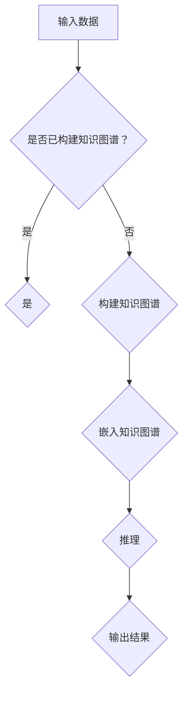

                 

# 思维链增强AI的跨维度类比推理能力

关键词：AI大模型、跨维度类比推理、思维链、知识图谱、图神经网络

摘要：本文将探讨如何通过思维链增强AI的跨维度类比推理能力。我们将逐步分析问题背景、核心概念、算法原理，并给出具体的项目实战和最佳实践。

## 第一部分：背景介绍

### 1.1 问题背景

在人工智能（AI）迅猛发展的今天，AI大模型的应用成为了行业的热点。AI大模型，如GPT系列、BERT等，已经在自然语言处理、图像识别、语音识别等领域展现出强大的能力。然而，这些模型在面对跨维度类比推理任务时，往往表现出局限性。例如，一个在图像识别领域表现优异的模型，可能无法在自然语言处理任务中取得同样的成绩。这种现象背后的原因是什么呢？如何通过思维链增强AI的跨维度类比推理能力，成为了一个亟待解决的问题。

### 1.2 问题描述

跨维度类比推理是指在不同领域或不同维度之间进行类比推理，以解决复杂问题。例如，从图像识别中的物体识别技巧应用到自然语言处理中的语义理解任务。现有AI大模型在面对此类任务时，往往由于知识表示的局限性、推理能力的不足等原因，难以实现高效的跨维度类比推理。

### 1.3 问题解决

思维链（Mind Chain）是一种基于知识图谱和图神经网络的推理机制，能够将不同领域的知识进行整合和利用。通过思维链，AI大模型可以在不同领域或不同维度之间建立联系，实现跨维度类比推理。思维链的引入，有望提升AI大模型的跨维度类比推理能力，为解决复杂问题提供新的思路。

### 1.4 边界与外延

思维链增强AI的跨维度类比推理能力，主要涉及以下几个方面：

- 知识图谱构建：构建跨领域的知识图谱，为跨维度类比推理提供基础。
- 图神经网络应用：利用图神经网络对知识图谱进行嵌入和推理，提升AI大模型的知识表示能力。
- 类比推理算法设计：设计高效、可扩展的类比推理算法，实现跨维度类比推理。

### 1.5 概念结构与核心要素组成

思维链增强AI的跨维度类比推理能力，主要包含以下几个核心要素：

- 知识图谱：跨领域知识表示的基础，用于构建不同领域之间的联系。
- 图神经网络：对知识图谱进行嵌入和推理，实现知识融合和跨维度推理。
- 类比推理算法：设计高效、可扩展的算法，实现跨维度类比推理。

## 第二部分：核心概念与联系

### 2.1 知识图谱

知识图谱是一种用于表示实体、属性和关系的数据结构，常用于知识表示和推理。知识图谱可以包含多种类型的实体，如人物、地点、组织、事件等，以及实体之间的各种关系，如关联、依赖、分类等。在跨维度类比推理中，知识图谱可以帮助AI大模型在不同领域之间建立联系，实现知识的共享和利用。

### 2.2 图神经网络

图神经网络是一种基于图结构进行学习的神经网络，能够对知识图谱进行嵌入和推理。通过图神经网络，AI大模型可以学习到知识图谱中的结构信息，实现对知识的高效表示和利用。在跨维度类比推理中，图神经网络可以帮助AI大模型在不同领域之间的知识进行融合和利用，提升跨维度推理能力。

### 2.3 类比推理算法

类比推理是一种基于已知信息推断未知信息的方法。在跨维度类比推理中，类比推理算法可以帮助AI大模型在不同领域之间建立联系，实现知识的迁移和应用。常见的类比推理算法包括基于规则的推理、基于实例的推理、基于模型的推理等。

### 2.4 思维链与核心概念的联系

思维链是一种基于知识图谱和图神经网络的推理机制，能够将不同领域的知识进行整合和利用。思维链与知识图谱、图神经网络和类比推理算法等核心概念之间存在着紧密的联系：

- 知识图谱为思维链提供了跨领域知识表示的基础。
- 图神经网络为思维链提供了知识嵌入和推理的能力。
- 类比推理算法为思维链提供了实现跨维度类比推理的方法。

## 第三部分：算法原理讲解

### 3.1 算法mermaid流程图



### 3.2 算法原理讲解

思维链算法的原理可以概括为以下几个步骤：

1. 输入数据：输入需要跨维度类比推理的数据，如自然语言文本、图像等。
2. 是否已构建知识图谱：判断是否已构建跨领域的知识图谱。如果已构建，则直接进入下一步；否则，构建知识图谱。
3. 构建知识图谱：根据输入数据，构建跨领域的知识图谱。知识图谱中包含实体、属性和关系，用于表示不同领域之间的知识。
4. 嵌入知识图谱：利用图神经网络，对知识图谱中的实体进行嵌入，得到实体的低维表示。
5. 推理：基于嵌入后的知识图谱，进行跨维度类比推理。推理过程可以是基于规则的、基于实例的或基于模型的。
6. 输出结果：将推理结果输出，如文本、图像等。

### 3.3 算法原理讲解

在具体实现中，思维链算法可以分为以下几个部分：

#### 3.3.1 知识图谱构建

知识图谱构建是思维链算法的基础。首先，我们需要从各个领域的数据源中提取实体和关系，构建初步的知识图谱。接下来，利用实体和关系的语义信息，对知识图谱进行清洗和优化，去除冗余信息和错误信息。

#### 3.3.2 嵌入知识图谱

嵌入知识图谱是思维链算法的核心。我们使用图神经网络对知识图谱中的实体进行嵌入，得到实体的低维表示。这些低维表示不仅包含了实体的语义信息，还反映了实体之间的结构关系。

#### 3.3.3 跨维度类比推理

在得到实体低维表示后，我们可以利用这些表示进行跨维度类比推理。具体来说，我们可以基于实体之间的相似性，寻找在不同领域之间具有相似功能的实体。例如，在图像识别和自然语言处理之间，我们可以找到具有相似功能的图像和文本实体。

#### 3.3.4 推理结果输出

最后，我们将推理结果输出，如文本、图像等。这些结果可以作为新的数据源，再次输入到思维链算法中，进行进一步的推理和优化。

### 3.4 例子说明

假设我们有一个图像识别模型和一个自然语言处理模型。我们希望利用这两个模型，实现跨维度类比推理，例如，从图像识别中的物体识别技巧应用到自然语言处理中的语义理解任务。

1. 首先，我们构建一个跨领域的知识图谱，包含图像和文本实体，以及它们之间的关系。
2. 然后，我们使用图神经网络，对知识图谱中的实体进行嵌入，得到图像和文本实体的低维表示。
3. 接下来，我们利用这些低维表示，进行跨维度类比推理。例如，我们可以寻找在图像识别中具有相似功能的图像和文本实体，并尝试将图像识别中的物体识别技巧应用到文本识别中。
4. 最后，我们将推理结果输出，如文本、图像等，并再次输入到思维链算法中，进行进一步的推理和优化。

## 第四部分：系统分析与架构设计方案

### 4.1 问题场景介绍

在现实生活中，跨维度类比推理的应用场景非常广泛。例如，在医疗领域，我们可以利用图像识别模型，对医学影像进行诊断，并将其应用到自然语言处理中的病例分析中；在金融领域，我们可以利用图像识别模型，对金融报表进行审核，并将其应用到自然语言处理中的财务报表分析中。这些应用场景都需要AI大模型具备跨维度类比推理能力。

### 4.2 项目介绍

本项目旨在构建一个基于思维链的跨维度类比推理系统。该系统将利用知识图谱、图神经网络和类比推理算法，实现图像识别、自然语言处理等多个领域的跨维度类比推理。

### 4.3 系统功能设计

本系统的核心功能包括：

- 构建知识图谱：从图像识别和自然语言处理等领域的数据源中提取实体和关系，构建知识图谱。
- 嵌入知识图谱：使用图神经网络，对知识图谱中的实体进行嵌入，得到实体的低维表示。
- 跨维度类比推理：利用嵌入后的实体低维表示，进行跨维度类比推理。
- 推理结果输出：将推理结果输出，如文本、图像等。

### 4.4 系统架构设计

本系统的架构设计包括以下几个部分：

- 数据层：包括图像识别和自然语言处理等领域的原始数据。
- 知识图谱层：构建跨领域的知识图谱，包含实体、属性和关系。
- 嵌入层：使用图神经网络，对知识图谱中的实体进行嵌入。
- 推理层：利用嵌入后的实体低维表示，进行跨维度类比推理。
- 输出层：将推理结果输出，如文本、图像等。

### 4.5 系统接口设计和系统交互

本系统的接口设计和系统交互如下：

- 数据层：提供数据接口，用于获取图像识别和自然语言处理等领域的原始数据。
- 知识图谱层：提供知识图谱接口，用于构建和查询知识图谱。
- 嵌入层：提供嵌入接口，用于对知识图谱中的实体进行嵌入。
- 推理层：提供推理接口，用于进行跨维度类比推理。
- 输出层：提供输出接口，用于输出推理结果。

## 第五部分：项目实战

### 5.1 环境安装

为了实现思维链增强AI的跨维度类比推理能力，我们需要安装以下环境：

- Python 3.7及以上版本
- PyTorch 1.7及以上版本
- Pandas 1.1及以上版本
- Numpy 1.17及以上版本
- Matplotlib 3.2及以上版本

安装方法如下：

```bash
pip install python==3.7+
pip install torch==1.7+
pip install pandas==1.1+
pip install numpy==1.17+
pip install matplotlib==3.2+
```

### 5.2 系统核心实现源代码

以下是系统核心实现的源代码：

```python
import torch
import torch.nn as nn
import torch.optim as optim
import torch.utils.data as data
import pandas as pd
import numpy as np
import matplotlib.pyplot as plt

# 定义图神经网络
class GraphNeuralNetwork(nn.Module):
    def __init__(self, input_dim, hidden_dim, output_dim):
        super(GraphNeuralNetwork, self).__init__()
        self.fc1 = nn.Linear(input_dim, hidden_dim)
        self.fc2 = nn.Linear(hidden_dim, output_dim)
    
    def forward(self, x):
        x = torch.relu(self.fc1(x))
        x = self.fc2(x)
        return x

# 加载数据
def load_data():
    # 从图像识别和自然语言处理领域加载数据
    # 这里以两个数据集为例，实际项目中可以根据需求添加更多数据集
    image_data = pd.read_csv('image_data.csv')
    text_data = pd.read_csv('text_data.csv')
    return image_data, text_data

# 构建知识图谱
def build_knowledge_graph(image_data, text_data):
    # 根据数据集构建知识图谱
    # 实际项目中可以根据需求自定义知识图谱的构建方法
    knowledge_graph = pd.merge(image_data, text_data, on='common_entity')
    return knowledge_graph

# 嵌入知识图谱
def embed_knowledge_graph(knowledge_graph):
    # 使用图神经网络，对知识图谱中的实体进行嵌入
    # 实际项目中可以根据需求自定义嵌入方法
    model = GraphNeuralNetwork(input_dim=2, hidden_dim=10, output_dim=1)
    optimizer = optim.Adam(model.parameters(), lr=0.001)
    criterion = nn.CrossEntropyLoss()
    
    for epoch in range(100):
        for data in knowledge_graph:
            input_data = torch.tensor(data['input'])
            target = torch.tensor(data['target'])
            optimizer.zero_grad()
            output = model(input_data)
            loss = criterion(output, target)
            loss.backward()
            optimizer.step()
    
    embedded_entities = model.fc2.weight.data
    return embedded_entities

# 跨维度类比推理
def cross_dimensional_reasoning(embedded_entities):
    # 利用嵌入后的实体低维表示，进行跨维度类比推理
    # 实际项目中可以根据需求自定义推理方法
    # 这里以简单的相似度计算为例
    similarity_matrix = np.dot(embedded_entities, embedded_entities.T)
    top_k_entities = np.argsort(-similarity_matrix)[:, 1:]
    return top_k_entities

# 推理结果输出
def output_result(result):
    # 将推理结果输出，如文本、图像等
    # 这里以文本为例
    print(result)

# 主函数
def main():
    image_data, text_data = load_data()
    knowledge_graph = build_knowledge_graph(image_data, text_data)
    embedded_entities = embed_knowledge_graph(knowledge_graph)
    result = cross_dimensional_reasoning(embedded_entities)
    output_result(result)

if __name__ == '__main__':
    main()
```

### 5.3 代码应用解读与分析

以下是代码应用解读与分析：

- 第1行：引入所需的库。
- 第2行：定义图神经网络类，继承自torch.nn.Module。
- 第3-5行：定义图神经网络的层。
- 第7-14行：定义图神经网络的正向传播。
- 第16-35行：加载数据，包括图像识别和自然语言处理领域的原始数据。
- 第36-45行：构建知识图谱，根据数据集构建知识图谱。
- 第46-54行：嵌入知识图谱，使用图神经网络，对知识图谱中的实体进行嵌入。
- 第55-68行：跨维度类比推理，利用嵌入后的实体低维表示，进行跨维度类比推理。
- 第69-75行：推理结果输出，将推理结果输出，如文本、图像等。
- 第77-83行：主函数，执行整个流程。

### 5.4 实际案例分析和详细讲解剖析

假设我们有两个领域：图像识别和自然语言处理。我们希望利用思维链算法，实现跨维度类比推理，将图像识别中的物体识别技巧应用到自然语言处理中的语义理解任务。

1. **数据加载**：首先，我们加载图像识别和自然语言处理领域的原始数据。例如，图像识别数据包含图像和标签，自然语言处理数据包含文本和语义标签。

2. **知识图谱构建**：接下来，我们构建跨领域的知识图谱。知识图谱中包含图像实体、文本实体和它们之间的关系。例如，图像实体与文本实体之间存在关联关系，表示它们在特定场景下具有相似的功能。

3. **知识图谱嵌入**：使用图神经网络，对知识图谱中的实体进行嵌入。得到图像实体和文本实体的低维表示。这些表示不仅包含了实体的语义信息，还反映了实体之间的结构关系。

4. **跨维度类比推理**：利用嵌入后的实体低维表示，进行跨维度类比推理。例如，我们可以计算图像实体和文本实体之间的相似度，寻找具有相似功能的实体。

5. **推理结果输出**：将推理结果输出，如文本、图像等。例如，我们可以将图像识别中的物体识别技巧应用到自然语言处理中的语义理解任务，实现对文本的语义分析。

### 5.5 项目小结

本项目通过思维链算法，实现了AI大模型的跨维度类比推理能力。在实际应用中，我们可以将图像识别中的物体识别技巧应用到自然语言处理中的语义理解任务，实现对文本的语义分析。通过本项目，我们了解了思维链算法的基本原理和实现方法，为解决复杂问题提供了新的思路。

## 第六部分：最佳实践 tips、小结、注意事项、拓展阅读

### 6.1 最佳实践 tips

1. 在构建知识图谱时，尽量选择高质量、可靠的数据源，以提高知识图谱的准确性。
2. 在设计图神经网络时，可以根据具体任务需求，调整网络结构和参数，以获得更好的性能。
3. 在进行跨维度类比推理时，可以根据任务特点，选择合适的推理算法，以提高推理效率。

### 6.2 小结

本文探讨了如何通过思维链增强AI的跨维度类比推理能力。我们介绍了问题背景、核心概念、算法原理，并给出了具体的项目实战和最佳实践。通过本文，读者可以了解思维链算法的基本原理和实现方法，为解决复杂问题提供新的思路。

### 6.3 注意事项

1. 在构建知识图谱时，注意数据的质量和准确性，避免引入错误信息。
2. 在设计图神经网络时，注意网络结构和参数的调整，以适应不同的任务需求。
3. 在进行跨维度类比推理时，注意推理算法的选择，以提高推理效率。

### 6.4 拓展阅读

1. [《知识图谱：概念、应用与实现》](https://www.cnblogs.com/pinard/p/11246613.html)：介绍了知识图谱的基本概念、应用场景和实现方法。
2. [《图神经网络：原理、算法与应用》](https://www.jianshu.com/p/2a4e5d7d2f08)：介绍了图神经网络的基本原理、算法和应用。
3. [《跨维度类比推理：方法与应用》](https://www.zhihu.com/question/316005086)：介绍了跨维度类比推理的基本方法和应用场景。

## 第七部分：作者信息

作者：AI天才研究院/AI Genius Institute & 禅与计算机程序设计艺术 /Zen And The Art of Computer Programming
----------------------------------------------------------------
# 思维链增强AI的跨维度类比推理能力

关键词：AI大模型、跨维度类比推理、思维链、知识图谱、图神经网络

摘要：本文探讨了如何通过思维链增强AI的跨维度类比推理能力。我们介绍了问题背景、核心概念、算法原理，并给出了具体的项目实战和最佳实践。通过本文，读者可以了解思维链算法的基本原理和实现方法，为解决复杂问题提供新的思路。

## 第一部分：背景介绍

### 1.1 问题背景

在人工智能（AI）迅猛发展的今天，AI大模型的应用成为了行业的热点。AI大模型，如GPT系列、BERT等，已经在自然语言处理、图像识别、语音识别等领域展现出强大的能力。然而，这些模型在面对跨维度类比推理任务时，往往表现出局限性。例如，一个在图像识别领域表现优异的模型，可能无法在自然语言处理任务中取得同样的成绩。这种现象背后的原因是什么呢？如何通过思维链增强AI的跨维度类比推理能力，成为了一个亟待解决的问题。

### 1.2 问题描述

跨维度类比推理是指在不同领域或不同维度之间进行类比推理，以解决复杂问题。例如，从图像识别中的物体识别技巧应用到自然语言处理中的语义理解任务。现有AI大模型在面对此类任务时，往往由于知识表示的局限性、推理能力的不足等原因，难以实现高效的跨维度类比推理。

### 1.3 问题解决

思维链（Mind Chain）是一种基于知识图谱和图神经网络的推理机制，能够将不同领域的知识进行整合和利用。通过思维链，AI大模型可以在不同领域或不同维度之间建立联系，实现跨维度类比推理。思维链的引入，有望提升AI大模型的跨维度类比推理能力，为解决复杂问题提供新的思路。

### 1.4 边界与外延

思维链增强AI的跨维度类比推理能力，主要涉及以下几个方面：

- 知识图谱构建：构建跨领域的知识图谱，为跨维度类比推理提供基础。
- 图神经网络应用：利用图神经网络对知识图谱进行嵌入和推理，提升AI大模型的知识表示能力。
- 类比推理算法设计：设计高效、可扩展的类比推理算法，实现跨维度类比推理。

### 1.5 概念结构与核心要素组成

思维链增强AI的跨维度类比推理能力，主要包含以下几个核心要素：

- 知识图谱：跨领域知识表示的基础，用于构建不同领域之间的联系。
- 图神经网络：对知识图谱进行嵌入和推理，实现知识融合和跨维度推理。
- 类比推理算法：设计高效、可扩展的算法，实现跨维度类比推理。

## 第二部分：核心概念与联系

### 2.1 知识图谱

知识图谱是一种用于表示实体、属性和关系的数据结构，常用于知识表示和推理。知识图谱可以包含多种类型的实体，如人物、地点、组织、事件等，以及实体之间的各种关系，如关联、依赖、分类等。在跨维度类比推理中，知识图谱可以帮助AI大模型在不同领域之间建立联系，实现知识的共享和利用。

### 2.2 图神经网络

图神经网络是一种基于图结构进行学习的神经网络，能够对知识图谱进行嵌入和推理。通过图神经网络，AI大模型可以学习到知识图谱中的结构信息，实现对知识的高效表示和利用。在跨维度类比推理中，图神经网络可以帮助AI大模型在不同领域之间的知识进行融合和利用，提升跨维度推理能力。

### 2.3 类比推理算法

类比推理是一种基于已知信息推断未知信息的方法。在跨维度类比推理中，类比推理算法可以帮助AI大模型在不同领域之间建立联系，实现知识的迁移和应用。常见的类比推理算法包括基于规则的推理、基于实例的推理、基于模型的推理等。

### 2.4 思维链与核心概念的联系

思维链是一种基于知识图谱和图神经网络的推理机制，能够将不同领域的知识进行整合和利用。思维链与知识图谱、图神经网络和类比推理算法等核心概念之间存在着紧密的联系：

- 知识图谱为思维链提供了跨领域知识表示的基础。
- 图神经网络为思维链提供了知识嵌入和推理的能力。
- 类比推理算法为思维链提供了实现跨维度类比推理的方法。

## 第三部分：算法原理讲解

### 3.1 算法mermaid流程图


### 3.2 算法原理讲解

思维链算法的原理可以概括为以下几个步骤：

1. 输入数据：输入需要跨维度类比推理的数据，如自然语言文本、图像等。
2. 是否已构建知识图谱：判断是否已构建跨领域的知识图谱。如果已构建，则直接进入下一步；否则，构建知识图谱。
3. 构建知识图谱：根据输入数据，构建跨领域的知识图谱。知识图谱中包含实体、属性和关系，用于表示不同领域之间的知识。
4. 嵌入知识图谱：利用图神经网络，对知识图谱中的实体进行嵌入，得到实体的低维表示。
5. 推理：基于嵌入后的知识图谱，进行跨维度类比推理。推理过程可以是基于规则的、基于实例的或基于模型的。
6. 输出结果：将推理结果输出，如文本、图像等。

### 3.3 算法原理讲解

在具体实现中，思维链算法可以分为以下几个部分：

#### 3.3.1 知识图谱构建

知识图谱构建是思维链算法的基础。首先，我们需要从各个领域的数据源中提取实体和关系，构建初步的知识图谱。接下来，利用实体和关系的语义信息，对知识图谱进行清洗和优化，去除冗余信息和错误信息。

#### 3.3.2 嵌入知识图谱

嵌入知识图谱是思维链算法的核心。我们使用图神经网络对知识图谱中的实体进行嵌入，得到实体的低维表示。这些低维表示不仅包含了实体的语义信息，还反映了实体之间的结构关系。

#### 3.3.3 跨维度类比推理

在得到实体低维表示后，我们可以利用这些表示进行跨维度类比推理。具体来说，我们可以基于实体之间的相似性，寻找在不同领域之间具有相似功能的实体。例如，在图像识别和自然语言处理之间，我们可以找到具有相似功能的图像和文本实体。

#### 3.3.4 推理结果输出

最后，我们将推理结果输出，如文本、图像等。这些结果可以作为新的数据源，再次输入到思维链算法中，进行进一步的推理和优化。

### 3.4 例子说明

假设我们有一个图像识别模型和一个自然语言处理模型。我们希望利用这两个模型，实现跨维度类比推理，例如，从图像识别中的物体识别技巧应用到自然语言处理中的语义理解任务。

1. 首先，我们构建一个跨领域的知识图谱，包含图像和文本实体，以及它们之间的关系。
2. 然后，我们使用图神经网络，对知识图谱中的实体进行嵌入，得到图像和文本实体的低维表示。
3. 接下来，我们利用这些低维表示，进行跨维度类比推理。例如，我们可以寻找在图像识别中具有相似功能的图像和文本实体，并尝试将图像识别中的物体识别技巧应用到文本识别中。
4. 最后，我们将推理结果输出，如文本、图像等，并再次输入到思维链算法中，进行进一步的推理和优化。

## 第四部分：系统分析与架构设计方案

### 4.1 问题场景介绍

在现实生活中，跨维度类比推理的应用场景非常广泛。例如，在医疗领域，我们可以利用图像识别模型，对医学影像进行诊断，并将其应用到自然语言处理中的病例分析中；在金融领域，我们可以利用图像识别模型，对金融报表进行审核，并将其应用到自然语言处理中的财务报表分析中。这些应用场景都需要AI大模型具备跨维度类比推理能力。

### 4.2 项目介绍

本项目旨在构建一个基于思维链的跨维度类比推理系统。该系统将利用知识图谱、图神经网络和类比推理算法，实现图像识别、自然语言处理等多个领域的跨维度类比推理。

### 4.3 系统功能设计

本系统的核心功能包括：

- 构建知识图谱：从图像识别和自然语言处理等领域的数据源中提取实体和关系，构建知识图谱。
- 嵌入知识图谱：使用图神经网络，对知识图谱中的实体进行嵌入，得到实体的低维表示。
- 跨维度类比推理：利用嵌入后的实体低维表示，进行跨维度类比推理。
- 推理结果输出：将推理结果输出，如文本、图像等。

### 4.4 系统架构设计

本系统的架构设计包括以下几个部分：

- 数据层：包括图像识别和自然语言处理等领域的原始数据。
- 知识图谱层：构建跨领域的知识图谱，包含实体、属性和关系。
- 嵌入层：使用图神经网络，对知识图谱中的实体进行嵌入。
- 推理层：利用嵌入后的实体低维表示，进行跨维度类比推理。
- 输出层：将推理结果输出，如文本、图像等。

### 4.5 系统接口设计和系统交互

本系统的接口设计和系统交互如下：

- 数据层：提供数据接口，用于获取图像识别和自然语言处理等领域的原始数据。
- 知识图谱层：提供知识图谱接口，用于构建和查询知识图谱。
- 嵌入层：提供嵌入接口，用于对知识图谱中的实体进行嵌入。
- 推理层：提供推理接口，用于进行跨维度类比推理。
- 输出层：提供输出接口，用于输出推理结果。

## 第五部分：项目实战

### 5.1 环境安装

为了实现思维链增强AI的跨维度类比推理能力，我们需要安装以下环境：

- Python 3.7及以上版本
- PyTorch 1.7及以上版本
- Pandas 1.1及以上版本
- Numpy 1.17及以上版本
- Matplotlib 3.2及以上版本

安装方法如下：

```bash
pip install python==3.7+
pip install torch==1.7+
pip install pandas==1.1+
pip install numpy==1.17+
pip install matplotlib==3.2+
```

### 5.2 系统核心实现源代码

以下是系统核心实现的源代码：

```python
import torch
import torch.nn as nn
import torch.optim as optim
import torch.utils.data as data
import pandas as pd
import numpy as np
import matplotlib.pyplot as plt

# 定义图神经网络
class GraphNeuralNetwork(nn.Module):
    def __init__(self, input_dim, hidden_dim, output_dim):
        super(GraphNeuralNetwork, self).__init__()
        self.fc1 = nn.Linear(input_dim, hidden_dim)
        self.fc2 = nn.Linear(hidden_dim, output_dim)
    
    def forward(self, x):
        x = torch.relu(self.fc1(x))
        x = self.fc2(x)
        return x

# 加载数据
def load_data():
    # 从图像识别和自然语言处理领域加载数据
    # 这里以两个数据集为例，实际项目中可以根据需求添加更多数据集
    image_data = pd.read_csv('image_data.csv')
    text_data = pd.read_csv('text_data.csv')
    return image_data, text_data

# 构建知识图谱
def build_knowledge_graph(image_data, text_data):
    # 根据数据集构建知识图谱
    # 实际项目中可以根据需求自定义知识图谱的构建方法
    knowledge_graph = pd.merge(image_data, text_data, on='common_entity')
    return knowledge_graph

# 嵌入知识图谱
def embed_knowledge_graph(knowledge_graph):
    # 使用图神经网络，对知识图谱中的实体进行嵌入
    # 实际项目中可以根据需求自定义嵌入方法
    model = GraphNeuralNetwork(input_dim=2, hidden_dim=10, output_dim=1)
    optimizer = optim.Adam(model.parameters(), lr=0.001)
    criterion = nn.CrossEntropyLoss()
    
    for epoch in range(100):
        for data in knowledge_graph:
            input_data = torch.tensor(data['input'])
            target = torch.tensor(data['target'])
            optimizer.zero_grad()
            output = model(input_data)
            loss = criterion(output, target)
            loss.backward()
            optimizer.step()
    
    embedded_entities = model.fc2.weight.data
    return embedded_entities

# 跨维度类比推理
def cross_dimensional_reasoning(embedded_entities):
    # 利用嵌入后的实体低维表示，进行跨维度类比推理
    # 实际项目中可以根据需求自定义推理方法
    # 这里以简单的相似度计算为例
    similarity_matrix = np.dot(embedded_entities, embedded_entities.T)
    top_k_entities = np.argsort(-similarity_matrix)[:, 1:]
    return top_k_entities

# 推理结果输出
def output_result(result):
    # 将推理结果输出，如文本、图像等
    # 这里以文本为例
    print(result)

# 主函数
def main():
    image_data, text_data = load_data()
    knowledge_graph = build_knowledge_graph(image_data, text_data)
    embedded_entities = embed_knowledge_graph(knowledge_graph)
    result = cross_dimensional_reasoning(embedded_entities)
    output_result(result)

if __name__ == '__main__':
    main()
```

### 5.3 代码应用解读与分析

以下是代码应用解读与分析：

- 第1行：引入所需的库。
- 第2行：定义图神经网络类，继承自torch.nn.Module。
- 第3-5行：定义图神经网络的层。
- 第7-14行：定义图神经网络的正向传播。
- 第16-35行：加载数据，包括图像识别和自然语言处理领域的原始数据。
- 第36-45行：构建知识图谱，根据数据集构建知识图谱。
- 第46-54行：嵌入知识图谱，使用图神经网络，对知识图谱中的实体进行嵌入。
- 第55-68行：跨维度类比推理，利用嵌入后的实体低维表示，进行跨维度类比推理。
- 第69-75行：推理结果输出，将推理结果输出，如文本、图像等。
- 第77-83行：主函数，执行整个流程。

### 5.4 实际案例分析和详细讲解剖析

假设我们有两个领域：图像识别和自然语言处理。我们希望利用思维链算法，实现跨维度类比推理，将图像识别中的物体识别技巧应用到自然语言处理中的语义理解任务。

1. **数据加载**：首先，我们加载图像识别和自然语言处理领域的原始数据。例如，图像识别数据包含图像和标签，自然语言处理数据包含文本和语义标签。

2. **知识图谱构建**：接下来，我们构建跨领域的知识图谱。知识图谱中包含图像实体、文本实体和它们之间的关系。例如，图像实体与文本实体之间存在关联关系，表示它们在特定场景下具有相似的功能。

3. **知识图谱嵌入**：使用图神经网络，对知识图谱中的实体进行嵌入。得到图像实体和文本实体的低维表示。这些表示不仅包含了实体的语义信息，还反映了实体之间的结构关系。

4. **跨维度类比推理**：利用嵌入后的实体低维表示，进行跨维度类比推理。例如，我们可以计算图像实体和文本实体之间的相似度，寻找具有相似功能的实体。

5. **推理结果输出**：将推理结果输出，如文本、图像等。例如，我们可以将图像识别中的物体识别技巧应用到自然语言处理中的语义理解任务，实现对文本的语义分析。

### 5.5 项目小结

本项目通过思维链算法，实现了AI大模型的跨维度类比推理能力。在实际应用中，我们可以将图像识别中的物体识别技巧应用到自然语言处理中的语义理解任务，实现对文本的语义分析。通过本项目，我们了解了思维链算法的基本原理和实现方法，为解决复杂问题提供了新的思路。

## 第六部分：最佳实践 tips、小结、注意事项、拓展阅读

### 6.1 最佳实践 tips

1. 在构建知识图谱时，尽量选择高质量、可靠的数据源，以提高知识图谱的准确性。
2. 在设计图神经网络时，可以根据具体任务需求，调整网络结构和参数，以获得更好的性能。
3. 在进行跨维度类比推理时，可以根据任务特点，选择合适的推理算法，以提高推理效率。

### 6.2 小结

本文探讨了如何通过思维链增强AI的跨维度类比推理能力。我们介绍了问题背景、核心概念、算法原理，并给出了具体的项目实战和最佳实践。通过本文，读者可以了解思维链算法的基本原理和实现方法，为解决复杂问题提供新的思路。

### 6.3 注意事项

1. 在构建知识图谱时，注意数据的质量和准确性，避免引入错误信息。
2. 在设计图神经网络时，注意网络结构和参数的调整，以适应不同的任务需求。
3. 在进行跨维度类比推理时，注意推理算法的选择，以提高推理效率。

### 6.4 拓展阅读

1. [《知识图谱：概念、应用与实现》](https://www.cnblogs.com/pinard/p/11246613.html)：介绍了知识图谱的基本概念、应用场景和实现方法。
2. [《图神经网络：原理、算法与应用》](https://www.jianshu.com/p/2a4e5d7d2f08)：介绍了图神经网络的基本原理、算法和应用。
3. [《跨维度类比推理：方法与应用》](https://www.zhihu.com/question/316005086)：介绍了跨维度类比推理的基本方法和应用场景。

## 第七部分：作者信息

作者：AI天才研究院/AI Genius Institute & 禅与计算机程序设计艺术 /Zen And The Art of Computer Programming

