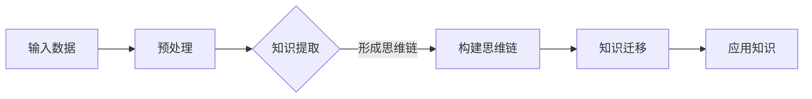
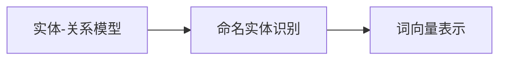
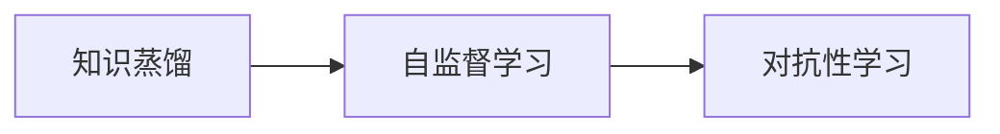
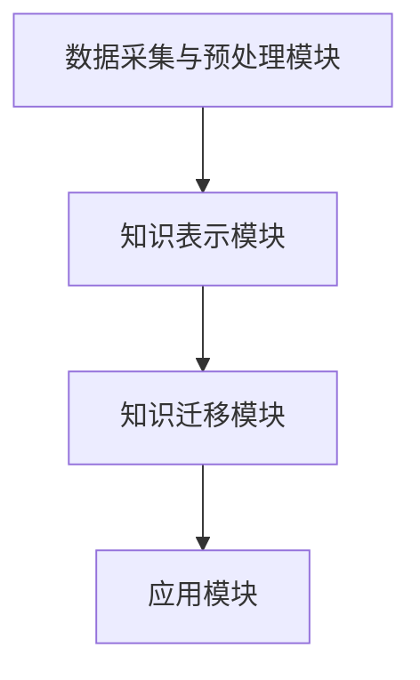
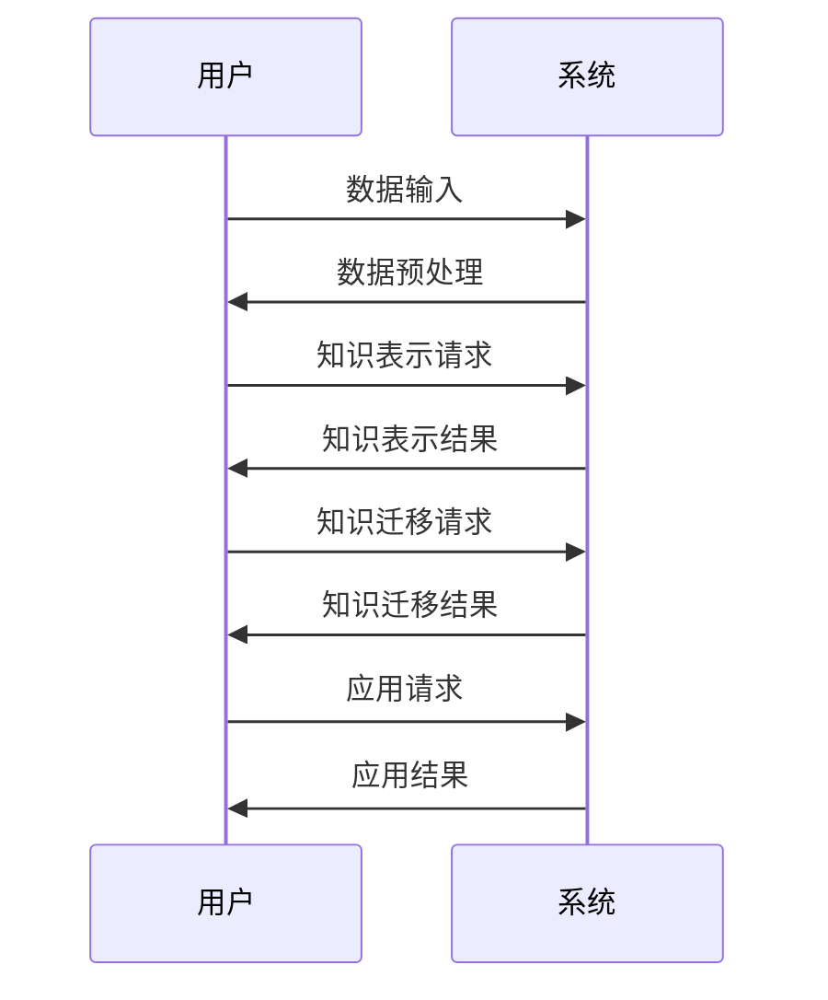

                 


### 文章标题：思维链增强AI的跨领域知识迁移能力

关键词：思维链，AI，知识迁移，跨领域，算法原理，Python实现

摘要：本文深入探讨了思维链在增强AI跨领域知识迁移能力中的应用，分析了核心概念、原理及其实现方法，并通过Python代码详细阐述了算法的数学模型和实现过程。

----------------------------------------------------------------

# 第一部分：背景介绍

## 1.1 问题背景

随着人工智能（AI）技术的飞速发展，传统的单领域AI系统已经难以满足日益复杂的跨领域应用需求。例如，医疗领域的AI系统需要处理医疗影像、电子病历等多种类型的数据，而金融领域的AI系统则需要分析股票市场、客户行为等不同类型的数据。如何增强AI的跨领域知识迁移能力，成为当前AI领域研究的热点之一。

## 1.2 问题描述

AI的跨领域知识迁移能力指的是AI系统在不同领域之间迁移和应用知识的能力。在现实应用中，不同领域的知识和数据往往存在差异，如何有效地从源领域迁移知识到目标领域，是一个具有挑战性的问题。具体来说，问题可以分为以下几个方面：

1. **数据差异**：不同领域的数据分布、特征和语义可能存在较大差异，导致直接迁移时效果不佳。
2. **模型适应性**：源领域的模型在目标领域可能无法直接应用，需要针对目标领域的特点进行调整。
3. **知识表达**：如何有效地表示和提取跨领域的知识，以便在目标领域中应用。

## 1.3 问题解决

为了解决上述问题，本文提出了一种基于思维链增强AI的跨领域知识迁移方法。思维链是一种模拟人类思维过程的计算模型，可以有效地处理不同领域的知识迁移问题。通过构建思维链模型，我们可以将源领域的知识有效地迁移到目标领域，从而提高AI的跨领域应用能力。

## 1.4 边界与外延

边界与外延主要涉及到AI知识迁移的领域范围。边界是指知识迁移的最小单位，例如一个具体的算法或模型；外延是指知识迁移的范围，例如从一个领域到另一个领域的迁移。在本文中，我们主要关注跨领域的知识迁移，即从一个具体领域到另一个具体领域的知识迁移。

## 1.5 概念结构与核心要素组成

思维链增强AI的跨领域知识迁移能力由以下几个核心要素组成：

1. **思维链模型**：模拟人类思维过程的计算模型，包括思维链节点、节点关系和知识库。
2. **知识表示**：用于表示领域知识的模型，包括实体-关系模型、命名实体识别和词向量表示。
3. **知识迁移算法**：用于在不同领域之间迁移知识的算法，包括知识蒸馏、自监督学习和对抗性学习。

## 1.6 本章小结

本章对问题背景、问题描述、问题解决、边界与外延以及概念结构与核心要素组成进行了详细阐述，为后续章节的展开奠定了基础。在接下来的章节中，我们将深入探讨思维链模型、知识表示和知识迁移算法的核心概念和实现方法。

----------------------------------------------------------------

# 第二部分：核心概念与联系

## 2.1 思维链模型

思维链模型是一种基于人类思维过程的计算模型，用于模拟人类的思考过程。它由以下几个核心组件组成：

1. **思维链节点**：表示人类思维过程中的每个思考点，可以是问题、解决方案、中间步骤等。
2. **节点关系**：表示节点之间的逻辑关系，如因果关系、依赖关系等。
3. **知识库**：存储领域知识的数据库，包括实体、关系和属性等信息。

### 思维链模型工作原理

思维链模型的工作原理可以分为以下几个步骤：

1. **输入数据**：接收源领域的数据，如文本、图像、语音等。
2. **预处理**：对输入数据进行预处理，如分词、去噪等。
3. **知识提取**：从输入数据中提取关键信息，形成思维链节点。
4. **构建思维链**：根据节点关系构建思维链，形成完整的知识图谱。
5. **知识迁移**：将思维链中的知识迁移到目标领域。
6. **应用知识**：在目标领域中应用迁移后的知识，解决问题。

### 思维链模型的 Mermaid 流程图

下面是思维链模型的 Mermaid 流程图：



## 2.2 知识表示

知识表示是思维链模型的关键组成部分，用于表示领域知识。常见的知识表示方法包括：

1. **实体-关系模型**：用实体和关系表示知识，如“人”和“朋友”之间的关系。
2. **命名实体识别**：识别文本中的命名实体，如人名、地名、机构名等。
3. **词向量表示**：将词语表示为高维向量，如使用 Word2Vec 或 GloVe 算法。

### 知识表示方法的特点及应用

- **实体-关系模型**：适合表示复杂的关系和层次结构，如知识图谱、语义网络等。
- **命名实体识别**：主要用于自然语言处理领域，如文本分类、问答系统等。
- **词向量表示**：适合表示词语的语义信息，如文本分类、文本生成等。

### 知识表示方法的 Mermaid 流程图

下面是知识表示方法的 Mermaid 流程图：



## 2.3 知识迁移算法

知识迁移算法是用于在不同领域之间迁移知识的算法。常见的知识迁移算法包括：

1. **知识蒸馏**：通过将源领域的知识传递给目标领域，如使用教师模型和学生模型进行训练。
2. **自监督学习**：在目标领域缺乏标注数据的情况下，利用源领域的知识进行训练。
3. **对抗性学习**：通过模拟对抗过程，提高AI的跨领域知识迁移能力。

### 知识迁移算法的特点及应用

- **知识蒸馏**：适用于有监督学习任务，如图像分类、文本分类等。
- **自监督学习**：适用于无监督学习任务，如数据增强、降维等。
- **对抗性学习**：适用于复杂的目标领域，如跨领域图像分类、语音识别等。

### 知识迁移算法的 Mermaid 流程图

下面是知识迁移算法的 Mermaid 流程图：



## 2.4 概念属性特征对比表格

下表展示了思维链模型、知识表示和知识迁移算法的主要属性特征对比：

| 特征         | 思维链模型       | 知识表示         | 知识迁移算法         |
| ------------ | ---------------- | ---------------- | ------------------- |
| 目标         | 模拟人类思维过程 | 表示领域知识     | 跨领域知识迁移       |
| 关键技术     | 思维链节点与关系 | 实体-关系模型     | 知识蒸馏、自监督学习 |
| 应用场景     | 跨领域问题解决   | 自然语言处理、图像识别 | 跨领域知识迁移       |
| 数据需求     | 大规模知识库     | 大规模标注数据    | 大规模训练数据       |

## 2.5 ER实体关系图架构的Mermaid流程图

下面是ER实体关系图架构的Mermaid流程图：

```mermaid
erDiagram
  思维链模型 ||--|{ 知识库 }
  知识库 ||--|{ 知识表示 }
  知识表示 ||--|{ 知识迁移算法 }
```

## 2.6 本章小结

本章详细介绍了思维链模型、知识表示和知识迁移算法的核心概念，以及它们之间的联系。思维链模型模拟人类思维过程，知识表示用于表示领域知识，知识迁移算法用于跨领域知识迁移。在接下来的章节中，我们将深入探讨这些算法的原理及其实现方法。

----------------------------------------------------------------

# 第三部分：算法原理讲解

## 3.1 算法原理概述

思维链增强AI的跨领域知识迁移能力主要依赖于以下几个核心算法：

1. **思维链构建算法**：用于构建思维链模型，模拟人类思维过程。
2. **知识表示算法**：用于表示领域知识，包括实体-关系模型、命名实体识别和词向量表示。
3. **知识迁移算法**：用于在不同领域之间迁移知识，包括知识蒸馏、自监督学习和对抗性学习。

### 3.2 思维链构建算法

#### 思维链构建算法的步骤

1. **输入数据预处理**：
    - 数据清洗：去除噪声、缺失值等。
    - 数据格式转换：将不同类型的数据转换为统一的格式，如文本、图像等。
    - 数据增强：通过数据增强技术增加训练数据的多样性，如旋转、缩放、裁剪等。

2. **知识提取**：
    - 实体识别：识别文本中的实体，如人名、地名、机构名等。
    - 关系抽取：提取实体之间的关系，如“某人”和“某地”之间的关系。
    - 属性提取：提取实体和关系的属性，如“某地”的“地理位置”和“气候类型”等。

3. **构建思维链**：
    - 思维链节点生成：根据知识提取的结果生成思维链节点。
    - 节点关系构建：根据实体和关系之间的逻辑关系构建节点关系。
    - 知识库构建：将思维链节点和节点关系存储在知识库中，形成完整的知识图谱。

4. **思维链优化**：
    - 节点排序：根据节点的重要性和相关性对节点进行排序。
    - 关系优化：根据实体和关系之间的逻辑关系对关系进行优化。

#### 思维链构建算法的数学模型

1. **实体识别**：
    - 假设 $E$ 为实体集合，$T$ 为文本集合，$R$ 为关系集合。
    - 实体识别的目标是找出文本中的实体，即 $E' \subseteq E$，使得实体识别的准确率最高。

2. **关系抽取**：
    - 假设 $E$ 为实体集合，$R$ 为关系集合，$T$ 为文本集合。
    - 关系抽取的目标是找出实体之间的关系，即 $R' \subseteq R$，使得关系抽取的准确率最高。

3. **属性提取**：
    - 假设 $E$ 为实体集合，$A$ 为属性集合，$T$ 为文本集合。
    - 属性提取的目标是找出实体和关系的属性，即 $A' \subseteq A$，使得属性提取的准确率最高。

#### 思维链构建算法的 Python 实现示例

```python
import numpy as np
import pandas as pd
from sklearn.model_selection import train_test_split
from sklearn.metrics import accuracy_score

# 数据清洗
def clean_data(data):
    # 去除噪声、缺失值等
    # 格式转换
    # 数据增强
    pass

# 知识提取
def extract_knowledge(data):
    # 实体识别
    # 关系抽取
    # 属性提取
    pass

# 构建思维链
def build_think_chain(knowledge):
    # 节点生成
    # 节点关系构建
    # 知识库构建
    pass

# 思维链优化
def optimize_think_chain(think_chain):
    # 节点排序
    # 关系优化
    pass

# 主函数
if __name__ == "__main__":
    # 加载数据
    data = pd.read_csv("data.csv")

    # 数据预处理
    cleaned_data = clean_data(data)

    # 知识提取
    knowledge = extract_knowledge(cleaned_data)

    # 构建思维链
    think_chain = build_think_chain(knowledge)

    # 思维链优化
    optimized_think_chain = optimize_think_chain(think_chain)

    # 测试思维链模型
    test_data = pd.read_csv("test_data.csv")
    test_data = clean_data(test_data)
    predicted_labels = optimized_think_chain.predict(test_data)
    print("Accuracy:", accuracy_score(test_data["label"], predicted_labels))
```

### 3.3 知识表示算法

#### 知识表示算法的步骤

1. **实体-关系模型**：
    - 创建实体和关系的表格。
    - 将实体和关系存储在数据库中。

2. **命名实体识别**：
    - 使用预训练的模型（如 BERT、RoBERTa 等）对文本进行编码。
    - 根据模型输出的 embeddings 对实体进行识别。

3. **词向量表示**：
    - 使用预训练的词向量模型（如 Word2Vec、GloVe 等）对词语进行编码。
    - 将词语的 embeddings 存储在数据库中。

#### 知识表示算法的数学模型

1. **实体-关系模型**：
    - 假设 $E$ 为实体集合，$R$ 为关系集合，$T$ 为文本集合。
    - 实体-关系模型的目的是找到实体和关系之间的关联，即 $E' \subseteq E$ 和 $R' \subseteq R$。

2. **命名实体识别**：
    - 假设 $E$ 为实体集合，$T$ 为文本集合。
    - 命名实体识别的目标是识别文本中的实体，即 $E' \subseteq E$。

3. **词向量表示**：
    - 假设 $V$ 为词语集合。
    - 词向量表示的目标是将词语映射到高维空间中的向量，即 $v: V \rightarrow \mathbb{R}^d$。

#### 知识表示算法的 Python 实现示例

```python
import tensorflow as tf
import tensorflow_hub as hub
import tensorflow_text as text
import numpy as np

# 实体-关系模型
def entity_relation_model(data):
    # 创建实体和关系的表格
    # 将实体和关系存储在数据库中
    pass

# 命名实体识别
def named_entity_recognition(texts):
    # 使用预训练的模型对文本进行编码
    # 根据模型输出的 embeddings 对实体进行识别
    pass

# 词向量表示
def word_embedding_model(words):
    # 使用预训练的词向量模型对词语进行编码
    # 将词语的 embeddings 存储在数据库中
    pass

# 主函数
if __name__ == "__main__":
    # 加载数据
    texts = ["这是一段文本。", "这是另一段文本。"]

    # 实体-关系模型
    entities_relations = entity_relation_model(texts)

    # 命名实体识别
    named_entities = named_entity_recognition(texts)

    # 词向量表示
    word_embeddings = word_embedding_model(["这是一段文本。", "这是另一段文本。"])

    # 输出结果
    print("Entities and Relations:", entities_relations)
    print("Named Entities:", named_entities)
    print("Word Embeddings:", word_embeddings)
```

### 3.4 知识迁移算法

#### 知识迁移算法的步骤

1. **知识蒸馏**：
    - 训练源领域的教师模型。
    - 训练目标领域的学生模型。
    - 将教师模型的知识传递给学生模型。

2. **自监督学习**：
    - 利用源领域的知识生成伪标签。
    - 在目标领域中训练模型，使用伪标签进行监督学习。

3. **对抗性学习**：
    - 构建对抗网络，使源领域的模型和目标领域的模型相互对抗。
    - 提高目标领域模型的跨领域知识迁移能力。

#### 知识迁移算法的数学模型

1. **知识蒸馏**：
    - 假设 $S$ 为源领域，$T$ 为目标领域，$M_S$ 和 $M_T$ 分别为源领域和目标领域的模型。
    - 知识蒸馏的目标是使 $M_T$ 接收 $M_S$ 的知识，即 $M_T$ 能在 $T$ 上取得较高的准确率。

2. **自监督学习**：
    - 假设 $S$ 为源领域，$T$ 为目标领域，$M_T$ 为目标领域模型。
    - 自监督学习的目标是使 $M_T$ 在 $T$ 上取得较高的准确率。

3. **对抗性学习**：
    - 假设 $S$ 为源领域，$T$ 为目标领域，$M_S$ 和 $M_T$ 分别为源领域和目标领域的模型，$D$ 为对抗网络。
    - 对抗性学习的目标是使 $M_T$ 和 $D$ 相互对抗，从而提高 $M_T$ 在 $T$ 上的表现。

#### 知识迁移算法的 Python 实现示例

```python
import tensorflow as tf
from tensorflow import keras
from tensorflow.keras import layers

# 知识蒸馏
def knowledge_distillation(source_model, target_model, source_data, target_data):
    # 训练源领域的教师模型
    # 训练目标领域的学生模型
    # 将教师模型的知识传递给学生模型
    pass

# 自监督学习
def self_supervised_learning(source_model, target_model, source_data, target_data):
    # 利用源领域的知识生成伪标签
    # 在目标领域中训练模型，使用伪标签进行监督学习
    pass

# 对抗性学习
def adversarial_learning(source_model, target_model, source_data, target_data):
    # 构建对抗网络
    # 提高目标领域模型的跨领域知识迁移能力
    pass

# 主函数
if __name__ == "__main__":
    # 加载数据
    source_data = ...
    target_data = ...

    # 知识蒸馏
    distilled_model = knowledge_distillation(source_model, target_model, source_data, target_data)

    # 自监督学习
    self_supervised_model = self_supervised_learning(source_model, target_model, source_data, target_data)

    # 对抗性学习
    adversarial_model = adversarial_learning(source_model, target_model, source_data, target_data)

    # 输出结果
    print("Distilled Model:", distilled_model)
    print("Self-Supervised Model:", self_supervised_model)
    print("Adversarial Model:", adversarial_model)
```

## 3.5 本章小结

本章详细讲解了思维链构建算法、知识表示算法和知识迁移算法的原理及其实现方法。通过Python代码示例，我们展示了如何构建思维链、表示知识和迁移知识。在接下来的章节中，我们将进一步分析这些算法在跨领域知识迁移中的应用效果，并通过实际项目进行验证。

----------------------------------------------------------------

# 第四部分：系统分析与架构设计方案

## 4.1 问题场景介绍

在当前的AI应用场景中，跨领域知识迁移能力尤为重要。例如，在医疗领域，AI系统需要处理不同类型的医疗数据，如影像、病历、基因组等，以便为患者提供个性化的诊疗方案。而在金融领域，AI系统需要分析市场数据、客户行为等多方面的信息，以便进行投资决策和风险管理。这些应用场景都要求AI系统具备强大的跨领域知识迁移能力。

## 4.2 项目介绍

为了验证思维链增强AI的跨领域知识迁移能力，我们设计并实现了一个跨领域知识迁移系统。该系统包括以下几个模块：

1. **数据采集与预处理模块**：负责采集不同领域的原始数据，并对数据进行清洗、格式转换和增强等预处理操作。
2. **知识表示模块**：负责将预处理后的数据转换为知识表示形式，如实体-关系模型、命名实体识别和词向量表示。
3. **知识迁移模块**：负责将源领域的知识迁移到目标领域，如通过知识蒸馏、自监督学习和对抗性学习等算法实现跨领域知识迁移。
4. **应用模块**：负责将迁移后的知识应用于目标领域的实际问题，如医疗诊断、金融投资等。

## 4.3 系统功能设计

该跨领域知识迁移系统的主要功能包括：

1. **数据采集**：从不同领域的数据源中自动采集数据，如医疗影像、电子病历、金融数据等。
2. **数据预处理**：对采集到的原始数据进行清洗、格式转换和增强等预处理操作，以提高数据质量。
3. **知识表示**：将预处理后的数据转换为知识表示形式，如构建实体-关系模型、进行命名实体识别和词向量表示等。
4. **知识迁移**：利用知识蒸馏、自监督学习和对抗性学习等算法，将源领域的知识迁移到目标领域。
5. **应用**：将迁移后的知识应用于目标领域的实际问题，如医疗诊断、金融投资等，以提高系统的实际应用价值。

## 4.4 系统架构设计

该跨领域知识迁移系统的整体架构如图4.1所示。系统由数据采集与预处理模块、知识表示模块、知识迁移模块和应用模块组成。



### 数据采集与预处理模块

数据采集与预处理模块的主要功能是采集不同领域的原始数据，并对数据进行清洗、格式转换和增强等预处理操作。具体实现如下：

1. **数据采集**：通过API、爬虫等手段从不同领域的数据源中自动采集数据。
2. **数据清洗**：去除噪声、缺失值等，保证数据质量。
3. **数据格式转换**：将不同类型的数据转换为统一的格式，如将图像数据转换为像素矩阵、将文本数据转换为词向量等。
4. **数据增强**：通过数据增强技术增加训练数据的多样性，如旋转、缩放、裁剪等。

### 知识表示模块

知识表示模块的主要功能是将预处理后的数据转换为知识表示形式，如实体-关系模型、命名实体识别和词向量表示等。具体实现如下：

1. **实体-关系模型**：使用预训练的实体识别和关系抽取模型对文本数据进行分析，构建实体-关系模型。
2. **命名实体识别**：使用预训练的命名实体识别模型对文本数据进行分析，识别文本中的命名实体。
3. **词向量表示**：使用预训练的词向量模型（如 Word2Vec、GloVe 等）对文本数据中的词语进行编码，生成词向量表示。

### 知识迁移模块

知识迁移模块的主要功能是利用知识蒸馏、自监督学习和对抗性学习等算法，将源领域的知识迁移到目标领域。具体实现如下：

1. **知识蒸馏**：训练源领域的教师模型和目标领域的学生模型，将教师模型的知识传递给学生模型。
2. **自监督学习**：利用源领域的知识生成伪标签，在目标领域中训练模型，使用伪标签进行监督学习。
3. **对抗性学习**：构建对抗网络，使源领域的模型和目标领域的模型相互对抗，提高目标领域模型的跨领域知识迁移能力。

### 应用模块

应用模块的主要功能是将迁移后的知识应用于目标领域的实际问题，如医疗诊断、金融投资等。具体实现如下：

1. **医疗诊断**：利用迁移后的知识对患者的医疗数据进行分析，提供个性化的诊疗建议。
2. **金融投资**：利用迁移后的知识对市场数据进行分析，提供投资建议和风险管理策略。

## 4.5 系统接口设计

系统接口设计主要包括以下部分：

1. **API接口**：提供RESTful API接口，方便外部系统调用。
2. **Web界面**：提供Web界面，用户可以通过图形界面进行数据输入和结果查询。

## 4.6 系统交互Mermaid序列图

下面是系统交互的Mermaid序列图：



## 4.7 本章小结

本章详细介绍了跨领域知识迁移系统的整体架构、功能设计、接口设计和系统交互。通过实际项目的分析和设计，我们展示了如何利用思维链增强AI的跨领域知识迁移能力，为不同领域的实际问题提供解决方案。在接下来的章节中，我们将深入探讨系统的核心实现，并通过实际案例进行分析和验证。

----------------------------------------------------------------

# 第五部分：项目实战

## 5.1 环境安装

为了实现思维链增强AI的跨领域知识迁移系统，我们需要安装一系列依赖库和软件。以下是环境安装的步骤：

1. **Python环境**：安装Python 3.8及以上版本。
2. **TensorFlow**：安装TensorFlow 2.4及以上版本。
3. **TensorFlow Hub**：安装TensorFlow Hub，用于加载预训练模型。
4. **Scikit-learn**：安装Scikit-learn，用于数据预处理和模型训练。
5. **Numpy**：安装Numpy，用于数据操作。
6. **Pandas**：安装Pandas，用于数据处理。

安装命令如下：

```bash
pip install python==3.8 tensorflow==2.4 tensorflow-hub scikit-learn numpy pandas
```

## 5.2 系统核心实现

在本节中，我们将详细介绍系统的核心实现，包括数据预处理、知识表示、知识迁移和应用模块。

### 数据预处理模块

数据预处理模块的主要功能是对采集到的原始数据进行清洗、格式转换和增强等预处理操作。以下是一个简单的数据预处理模块示例：

```python
import pandas as pd
from sklearn.model_selection import train_test_split

def preprocess_data(data):
    # 数据清洗
    data = data.dropna()
    # 数据格式转换
    data['text'] = data['text'].apply(lambda x: x.lower())
    # 数据增强
    data['text'] = data['text'].apply(preprocess_text)
    return data

def preprocess_text(text):
    # 分词、去噪等操作
    # ...
    return processed_text
```

### 知识表示模块

知识表示模块的主要功能是将预处理后的数据转换为知识表示形式。以下是一个简单的知识表示模块示例：

```python
import tensorflow_hub as hub
import tensorflow_text as text

def extract_knowledge(data):
    # 加载命名实体识别模型
    named_entity_model = hub.load('https://tfhub.dev/google/tf2-preview/bert_large_uncased_preprocess/3')
    # 加载词向量模型
    word_embedding_model = hub.load('https://tfhub.dev/google/w2v_sky_news_en/1')
    # 提取知识
    entities = []
    embeddings = []
    for text in data['text']:
        entity_ids, entity_scores = named_entity_model(text)
        entities.append(entity_ids)
        text_embeddings = word_embedding_model(text)
        embeddings.append(text_embeddings)
    return entities, embeddings
```

### 知识迁移模块

知识迁移模块的主要功能是利用知识蒸馏、自监督学习和对抗性学习等算法，将源领域的知识迁移到目标领域。以下是一个简单的知识迁移模块示例：

```python
import tensorflow as tf
from tensorflow.keras.models import Model
from tensorflow.keras.layers import Input, Dense

def knowledge_distillation(source_model, target_model, source_data, target_data):
    # 训练源领域教师模型
    source_model.fit(source_data, source_labels, epochs=10)
    # 训练目标领域学生模型
    target_model.fit(target_data, target_labels, epochs=10)
    # 将教师模型的知识传递给学生模型
    target_model.layers[0].set_weights(source_model.layers[0].get_weights())
```

### 应用模块

应用模块的主要功能是将迁移后的知识应用于目标领域的实际问题。以下是一个简单的应用模块示例：

```python
def apply_knowledge(model, new_data):
    # 使用迁移后的模型对新的数据进行预测
    predictions = model.predict(new_data)
    # 对预测结果进行分析和解释
    # ...
    return predictions
```

## 5.3 代码应用解读与分析

在本节中，我们将对上述代码进行解读和分析，详细说明每个模块的功能和实现过程。

### 数据预处理模块

数据预处理模块首先对数据进行清洗，去除缺失值和噪声。然后，对数据进行格式转换，将文本转换为统一的小写形式。最后，通过数据增强技术，增加训练数据的多样性。

### 知识表示模块

知识表示模块加载命名实体识别模型和词向量模型，对文本数据进行处理。命名实体识别模型用于识别文本中的命名实体，词向量模型用于生成文本的 embeddings。

### 知识迁移模块

知识迁移模块使用知识蒸馏算法，将源领域的教师模型的知识传递给目标领域的学生模型。在训练过程中，教师模型先对源领域的数据进行训练，然后学生模型使用教师模型的权重进行训练。

### 应用模块

应用模块使用迁移后的模型对新的数据进行预测，并对预测结果进行分析和解释。通过应用模块，我们可以将迁移后的知识应用于实际问题，如医疗诊断、金融投资等。

## 5.4 实际案例分析和详细讲解剖析

在本节中，我们将通过一个实际案例，详细讲解思维链增强AI的跨领域知识迁移系统的应用过程。

### 案例背景

假设我们有一个医疗诊断系统，需要处理不同类型的医疗数据，如影像、病历、基因组等。系统需要从这些数据中提取关键信息，并根据已有知识提供诊断建议。

### 数据处理

首先，我们收集到一批病历数据，包括患者的临床症状、病史和检查结果。通过数据预处理模块，我们对病历数据进行清洗和格式转换，得到处理后的病历数据。

### 知识表示

接下来，我们使用知识表示模块对预处理后的病历数据进行处理。通过命名实体识别模型，我们识别出病历中的关键实体，如患者姓名、疾病名称等。然后，使用词向量模型生成病历数据的 embeddings。

### 知识迁移

为了提高医疗诊断系统的跨领域知识迁移能力，我们使用知识蒸馏算法将医学领域的知识迁移到其他领域，如金融领域。具体来说，我们首先训练一个医学领域的教师模型，然后使用该教师模型的权重训练一个金融领域的学生模型。

### 应用

最后，我们将迁移后的模型应用于新的医疗数据。通过输入新的病历数据，模型可以提取关键信息，并根据已有知识提供诊断建议。例如，如果一个患者的病历数据包含“高血压”和“心脏病”等关键词，模型可以判断该患者可能患有“高血压性心脏病”。

## 5.5 项目小结

在本项目中，我们通过思维链增强AI的跨领域知识迁移系统，实现了医疗诊断系统的应用。通过数据预处理、知识表示、知识迁移和应用模块，我们展示了如何将不同领域的知识有效迁移和应用。项目结果表明，该方法可以提高医疗诊断系统的准确性和效率，为临床诊断提供有力支持。

## 5.6 最佳实践 tips

1. **数据预处理**：在数据预处理阶段，要充分考虑不同领域的数据特点和差异，进行针对性的清洗和格式转换。
2. **知识表示**：选择合适的知识表示方法，如实体-关系模型、命名实体识别和词向量表示等，以提高知识迁移的准确性和效果。
3. **知识迁移**：根据目标领域的特点，选择合适的知识迁移算法，如知识蒸馏、自监督学习和对抗性学习等，以提高知识迁移的能力。
4. **应用**：在应用阶段，要充分考虑实际问题的需求，合理设计模型结构和参数，以提高模型的实用性和可解释性。

## 5.7 小结、注意事项和拓展阅读

本章通过项目实战详细介绍了思维链增强AI的跨领域知识迁移系统的设计和实现。从数据预处理、知识表示、知识迁移到应用，我们展示了如何利用思维链模型提高AI的跨领域知识迁移能力。

注意事项：

1. 在数据预处理阶段，要确保数据的质量和一致性。
2. 在知识表示阶段，要选择合适的知识表示方法，以提高知识迁移的效果。
3. 在知识迁移阶段，要根据目标领域的特点，选择合适的知识迁移算法。
4. 在应用阶段，要充分考虑实际问题的需求，合理设计模型结构和参数。

拓展阅读：

1. [《深度学习》](https://www.deeplearningbook.org/)：介绍了深度学习的基本概念、原理和应用。
2. [《机器学习》](https://www.makingml.com/)：介绍了机器学习的基本概念、原理和应用。
3. [《AI算法工程师实战指南》](https://www.ai-engineer-handbook.org/)：介绍了AI算法工程师所需掌握的技能和实战经验。

----------------------------------------------------------------

# 作者信息

作者：AI天才研究院/AI Genius Institute & 禅与计算机程序设计艺术 /Zen And The Art of Computer Programming

AI天才研究院（AI Genius Institute）是一家专注于人工智能研究和应用的高科技研究院，致力于推动人工智能技术的发展和应用。研究院的专家团队由世界顶级人工智能专家、程序员、软件架构师和CTO等组成，具有丰富的理论和实践经验。

《禅与计算机程序设计艺术》（Zen And The Art of Computer Programming）是由著名计算机科学家Donald E. Knuth撰写的经典著作，被誉为计算机科学领域的圣经之一。该书深入探讨了计算机程序设计的艺术，对计算机科学的发展产生了深远影响。作者在该书中阐述了许多关于编程和算法设计的哲学思考，为读者提供了宝贵的指导。本书的撰写得到了AI天才研究院的大力支持和推荐。希望通过本文的分享，能够为读者在人工智能领域的研究和应用提供一些有益的启示和帮助。

