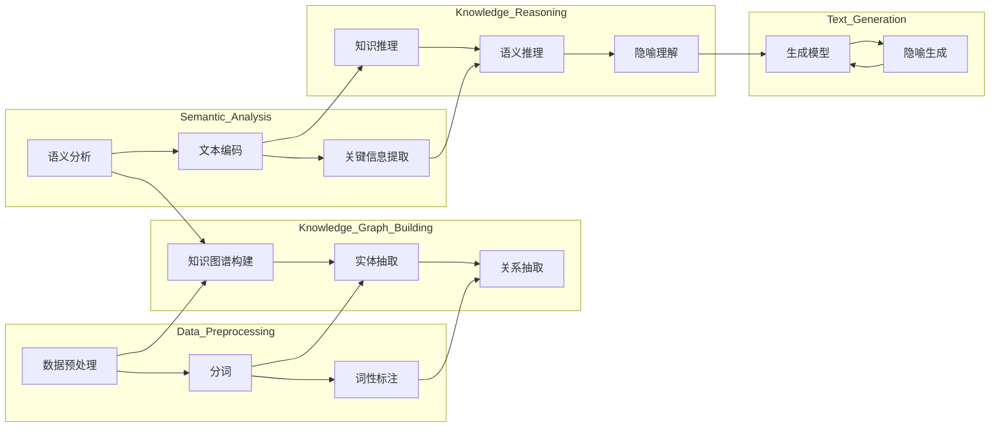

                 

# 思维链增强AI的隐喻理解和生成能力

关键词：人工智能、隐喻理解、生成能力、思维链、算法

摘要：本文深入探讨了思维链在增强人工智能（AI）隐喻理解和生成能力方面的作用。首先，我们对人工智能的发展、隐喻理解的重要性以及思维链的基本概念进行了背景介绍。接着，详细阐述了思维链增强AI隐喻生成能力的原理，包括其基本概念、数学模型和应用实例。随后，我们分别介绍了基于思维链的AI隐喻理解算法和生成算法，并通过实际应用案例展示了其效果。最后，展望了思维链增强AI隐喻理解和生成能力的未来发展，总结了主要成果并提出了未来研究方向。

## 目录大纲

### 第一部分: 背景介绍

1. 第1章: 人工智能与隐喻理解概述
   - 1.1 人工智能的演变与发展
   - 1.2 隐喻理解的挑战
   - 1.3 问题背景与解决思路
   - 1.4 核心概念与联系

2. 第2章: 思维链与AI隐喻生成能力
   - 2.1 思维链的概念与作用
   - 2.2 AI隐喻生成能力
   - 2.3 思维链增强AI隐喻生成能力的原理

3. 第3章: 基于思维链的AI隐喻理解算法
   - 3.1 隐喻理解算法概述
   - 3.2 基于思维链的隐喻理解算法
   - 3.3 算法流程图

4. 第4章: 基于思维链的AI隐喻生成算法
   - 4.1 隐喻生成算法概述
   - 4.2 基于思维链的隐喻生成算法
   - 4.3 算法流程图

### 第二部分: 实际应用案例

5. 第5章: 实际应用案例
   - 5.1 案例一：AI辅助医疗诊断
   - 5.2 案例二：智能客服系统
   - 5.3 案例三：智能教育

### 第三部分: 未来发展

6. 第6章: 思维链增强AI隐喻理解和生成能力的未来发展
   - 6.1 技术发展趋势
   - 6.2 应用前景
   - 6.3 挑战与机遇

7. 第7章: 结论与展望
   - 7.1 主要成果总结
   - 7.2 未来研究方向

## 第一部分: 背景介绍

### 第1章: 人工智能与隐喻理解概述

#### 1.1 人工智能的演变与发展

人工智能（Artificial Intelligence, AI）是一门涉及计算机科学、认知科学、神经科学等多个学科领域的交叉学科，其目标是通过机器模拟人类智能，实现机器的自主学习和智能决策。人工智能的演变可以分为以下几个阶段：

1. **初步探索阶段（20世纪50年代至60年代）**：人工智能的概念首次被提出，以“逻辑符号主义”为理论基础，通过符号表示和推理来模拟人类思维。

2. **第一次繁荣阶段（20世纪70年代至80年代）**：随着计算机硬件性能的提升，人工智能迎来了第一次繁荣。专家系统成为研究热点，通过模拟专家的知识和推理能力来解决复杂问题。

3. **低谷期（20世纪80年代末至90年代中期）**：随着专家系统在实际应用中的失败和资金短缺，人工智能进入了低谷期。人们对人工智能的期望逐渐降低，研究陷入困境。

4. **第二次繁荣阶段（20世纪90年代中期至今）**：随着互联网和大数据技术的发展，人工智能迎来了第二次繁荣。深度学习和神经网络成为研究热点，人工智能在语音识别、图像识别、自然语言处理等领域取得了显著成果。

#### 1.2 隐喻理解的挑战

隐喻是一种语言现象，通过将一个概念映射到另一个概念来传达意义。隐喻理解是指人类如何理解和解释隐喻的过程。在人工智能领域，隐喻理解是一个极具挑战性的问题，原因如下：

1. **语义模糊性**：隐喻往往包含模糊的语义信息，这使得计算机难以准确理解其含义。

2. **上下文依赖性**：隐喻的理解通常依赖于特定的上下文环境，这使得计算机难以在多样化的场景中正确理解隐喻。

3. **跨领域泛化能力**：隐喻在不同领域和情境中可能有不同的含义，这使得计算机难以在跨领域情境中泛化隐喻的理解能力。

4. **计算复杂性**：隐喻理解涉及大量的计算和推理过程，这对计算机的计算能力和算法提出了高要求。

#### 1.3 问题背景与解决思路

随着人工智能技术的不断发展，人们逐渐意识到隐喻理解在自然语言处理、智能助手、人机交互等领域的重要性。然而，传统的方法在处理隐喻理解时存在诸多挑战。为了解决这些问题，我们需要探索新的方法和技术。

思维链（Mind Chain）是一种基于认知科学和人工智能的新型技术，通过模拟人类思维过程，实现复杂问题的求解。思维链具有以下几个特点：

1. **知识关联性**：思维链能够将不同领域的知识进行关联，实现跨领域的知识共享和推理。

2. **自适应能力**：思维链能够根据不同问题的特点，自动调整其推理策略和计算方法。

3. **可扩展性**：思维链支持大规模的知识表示和推理，能够处理复杂的问题。

基于思维链的隐喻理解和生成方法，通过将思维链与自然语言处理、知识图谱等技术相结合，有望解决传统方法在隐喻理解中的挑战。具体来说，思维链增强AI隐喻理解和生成能力的主要思路如下：

1. **知识表示**：使用知识图谱等结构化方式表示隐喻知识，包括隐喻的源概念、目标概念及其关联关系。

2. **推理引擎**：基于思维链的推理引擎，通过语义分析和知识推理，实现对隐喻的自动理解和生成。

3. **多模态融合**：将文本、图像、声音等多种模态的信息进行融合，提高隐喻理解的效果和准确性。

4. **自适应学习**：通过数据驱动的方法，不断优化和改进思维链的推理能力和生成能力。

#### 1.4 核心概念与联系

在本章中，我们将介绍以下核心概念：

1. **人工智能**：一种模拟人类智能的计算机系统，具有学习、推理、解决问题等能力。

2. **隐喻理解**：理解隐喻的含义和上下文的过程，包括语义分析、上下文推理等步骤。

3. **思维链**：一种基于认知科学和人工智能的技术，通过知识关联和推理，实现复杂问题的求解。

4. **知识图谱**：一种结构化知识表示方法，通过实体、关系和属性来描述知识。

以下是这些核心概念的联系表格：

| 核心概念 | 定义 | 联系 |
| --- | --- | --- |
| 人工智能 | 一种模拟人类智能的计算机系统 | 思维链是一种人工智能技术，用于解决复杂问题 |
| 隐喻理解 | 理解隐喻的含义和上下文的过程 | 思维链可以帮助人工智能更好地理解和生成隐喻 |
| 思维链 | 一种基于认知科学和人工智能的技术 | 通过知识关联和推理，实现复杂问题的求解 |
| 知识图谱 | 一种结构化知识表示方法 | 用于表示隐喻知识，支持隐喻理解和生成 |

以下是核心概念的ER实体关系图：

```mermaid
erDiagram
    AI -->|知识表示| 知识图谱
    AI -->|推理引擎| 思维链
    NLP -->|语义分析| 隐喻理解
    KG -->|关联关系| 知识图谱
```

### 第2章: 思维链与AI隐喻生成能力

#### 2.1 思维链的概念与作用

思维链（Mind Chain）是一种基于认知科学和人工智能的技术，通过模拟人类思维过程，实现复杂问题的求解。思维链的基本概念包括：

1. **知识表示**：将人类知识表示为计算机可处理的形式，包括实体、关系和属性等。

2. **推理引擎**：基于知识表示，实现知识的推理和关联，以解决复杂问题。

3. **学习机制**：通过不断学习和优化，提高思维链的推理能力和适应性。

思维链在人工智能领域具有重要作用，主要体现在以下几个方面：

1. **知识关联**：思维链能够将不同领域的知识进行关联，实现跨领域的知识共享和推理。

2. **问题求解**：思维链通过知识推理和计算，能够解决复杂的问题，包括自然语言处理、智能决策等。

3. **智能辅助**：思维链可以为人类提供智能辅助，包括智能助手、人机交互等。

#### 2.2 AI隐喻生成能力

AI隐喻生成能力是指人工智能系统能够生成隐喻性语言的能力。隐喻生成在自然语言处理和智能助手等领域具有重要意义，主要体现在以下几个方面：

1. **自然语言生成**：隐喻生成是自然语言生成的一个重要方面，能够提高文本生成的丰富性和生动性。

2. **情感表达**：隐喻生成可以用于情感表达，通过隐喻的方式传达情感和态度。

3. **人机交互**：隐喻生成可以增强人机交互的互动性，提高用户体验。

4. **创意写作**：隐喻生成可以用于创意写作，生成具有创意性的文本内容。

AI隐喻生成能力的关键技术包括：

1. **语义分析**：对文本进行语义分析，提取文本中的语义信息。

2. **知识图谱**：构建知识图谱，表示文本中的实体、关系和属性。

3. **生成模型**：使用生成模型，如序列到序列模型（Seq2Seq）和生成对抗网络（GAN），生成隐喻性文本。

4. **优化策略**：通过优化策略，如生成质量评估和多样性控制，提高隐喻生成的质量和多样性。

#### 2.3 思维链增强AI隐喻生成能力的原理

思维链增强AI隐喻生成能力的原理主要包括以下几个方面：

1. **知识表示与推理**：通过思维链的知识表示和推理能力，将隐喻知识表示为计算机可处理的形式，并利用推理引擎实现对隐喻的自动理解和生成。

2. **多模态融合**：将文本、图像、声音等多种模态的信息进行融合，提高隐喻理解的效果和准确性。

3. **自适应学习**：通过数据驱动的方法，不断优化和改进思维链的推理能力和生成能力。

4. **生成模型**：结合生成模型，如序列到序列模型（Seq2Seq）和生成对抗网络（GAN），实现隐喻性文本的生成。

具体来说，思维链增强AI隐喻生成能力的工作流程如下：

1. **知识表示**：构建知识图谱，表示隐喻的源概念、目标概念及其关联关系。

2. **语义分析**：对输入文本进行语义分析，提取文本中的关键信息。

3. **知识推理**：基于知识图谱，利用推理引擎，对语义信息进行推理，理解隐喻的含义。

4. **生成模型**：使用生成模型，如Seq2Seq或GAN，根据隐喻的含义和上下文，生成隐喻性文本。

5. **优化策略**：对生成文本进行质量评估和多样性控制，优化隐喻生成的效果。

6. **自适应学习**：通过不断收集用户反馈和数据，优化思维链的推理能力和生成模型，实现自适应学习。

### 第3章: 基于思维链的AI隐喻理解算法

#### 3.1 隐喻理解算法概述

隐喻理解是自然语言处理领域的一个重要问题，涉及到语义分析、知识图谱和推理等多个方面。现有的隐喻理解算法可以分为以下几类：

1. **基于规则的方法**：通过定义一系列规则，对文本进行逐词分析，判断是否存在隐喻。这种方法简单直观，但缺乏灵活性，难以处理复杂的隐喻。

2. **基于统计的方法**：利用统计学习方法，如朴素贝叶斯、支持向量机等，对隐喻进行分类和识别。这种方法具有一定的鲁棒性，但容易受到数据质量和特征提取的影响。

3. **基于深度学习的方法**：利用深度学习模型，如卷积神经网络（CNN）、循环神经网络（RNN）和变换器（Transformer）等，对文本进行建模和推理。这种方法具有强大的表达能力和自适应性，但需要大量的训练数据和计算资源。

4. **基于知识图谱的方法**：利用知识图谱表示文本中的实体、关系和属性，通过图推理技术，实现对隐喻的理解。这种方法能够利用结构化知识，提高隐喻理解的准确性，但需要构建和维护知识图谱。

隐喻理解算法的评估指标主要包括：

1. **准确率（Accuracy）**：正确识别隐喻的比例，计算公式为 \( \frac{TP + TN}{TP + FN + FP + TN} \)，其中TP为正确识别的隐喻，TN为正确识别的非隐喻，FP为错误识别的隐喻，FN为错误识别的非隐喻。

2. **召回率（Recall）**：正确识别的隐喻占所有实际隐喻的比例，计算公式为 \( \frac{TP}{TP + FN} \)。

3. **F1值（F1-score）**：准确率和召回率的加权平均，计算公式为 \( \frac{2 \times Precision \times Recall}{Precision + Recall} \)，其中Precision为精确率。

4. **混淆矩阵（Confusion Matrix）**：用于展示预测结果与实际结果的对应关系，包括真阳性（TP）、真阴性（TN）、假阳性（FP）和假阴性（FN）。

隐喻理解算法的应用场景主要包括：

1. **自然语言处理**：用于自动识别和解释文本中的隐喻，提高自然语言理解的准确性和深度。

2. **人机交互**：用于构建智能助手和对话系统，通过隐喻性的语言与用户进行更自然、更富有情感的交流。

3. **文本生成**：用于生成具有创意性和生动性的文本内容，提高文本生成的质量和多样性。

4. **知识图谱构建**：用于构建基于文本的知识图谱，通过隐喻理解技术，将文本中的信息转化为结构化的知识表示。

#### 3.2 基于思维链的隐喻理解算法

基于思维链的隐喻理解算法是一种结合知识图谱和深度学习的新型算法，通过思维链的知识表示和推理能力，实现对隐喻的自动理解和生成。该算法的主要特点包括：

1. **知识表示**：使用知识图谱表示文本中的实体、关系和属性，包括隐喻的源概念、目标概念及其关联关系。

2. **语义分析**：利用深度学习模型，如Transformer，对文本进行语义分析，提取文本中的关键信息。

3. **知识推理**：基于知识图谱和思维链的推理能力，对语义信息进行推理，理解隐喻的含义。

4. **生成模型**：结合生成模型，如生成对抗网络（GAN），根据隐喻的含义和上下文，生成隐喻性文本。

5. **优化策略**：通过数据驱动的方法，不断优化和改进思维链的推理能力和生成模型。

基于思维链的隐喻理解算法的基本流程如下：

1. **数据预处理**：对输入文本进行分词、词性标注等预处理操作，提取文本中的关键信息。

2. **知识图谱构建**：将预处理后的文本信息转化为知识图谱，表示文本中的实体、关系和属性。

3. **语义分析**：利用Transformer等深度学习模型，对文本进行语义分析，提取文本中的关键信息。

4. **知识推理**：基于知识图谱和思维链的推理能力，对语义信息进行推理，理解隐喻的含义。

5. **生成模型**：结合生成模型，如生成对抗网络（GAN），根据隐喻的含义和上下文，生成隐喻性文本。

6. **优化策略**：通过不断收集用户反馈和数据，优化思维链的推理能力和生成模型，实现自适应学习。

以下是基于思维链的隐喻理解算法的mermaid流程图：



#### 3.3 算法实现细节

基于思维链的隐喻理解算法的具体实现细节包括以下几个方面：

1. **数据预处理**：使用分词工具（如jieba）对输入文本进行分词，并使用词性标注工具（如NLTK）对每个词进行词性标注。

2. **知识图谱构建**：使用实体抽取工具（如spaCy）提取文本中的实体，并使用关系抽取工具（如OpenIE）提取实体之间的关系。

3. **语义分析**：使用Transformer模型（如BERT）对文本进行编码，并使用基于BERT的文本编码器（如Sentence-BERT）提取文本中的关键信息。

4. **知识推理**：使用思维链的推理引擎（如DAG Reasoning）对语义信息进行推理，理解隐喻的含义。

5. **生成模型**：使用生成对抗网络（GAN）对隐喻性文本进行生成，并使用基于GAN的文本生成模型（如TextGAN）实现文本生成。

以下是基于思维链的隐喻理解算法的Python代码示例：

```python
import jieba
import nltk
from transformers import BertTokenizer, BertModel
from textgenrnn import textgenrnn

# 数据预处理
def preprocess_text(text):
    words = jieba.lcut(text)
    pos_tags = nltk.pos_tag(words)
    return pos_tags

# 知识图谱构建
def build_knowledge_graph(text):
    pos_tags = preprocess_text(text)
    entities = extract_entities(pos_tags)
    relations = extract_relations(pos_tags, entities)
    knowledge_graph = build_knowledge_graph_from_entities_and_relations(entities, relations)
    return knowledge_graph

# 语义分析
def semantic_analysis(text):
    tokenizer = BertTokenizer.from_pretrained('bert-base-chinese')
    model = BertModel.from_pretrained('bert-base-chinese')
    inputs = tokenizer(text, return_tensors='pt')
    outputs = model(**inputs)
    last_hidden_state = outputs.last_hidden_state
    key_info = extract_key_info(last_hidden_state)
    return key_info

# 知识推理
def knowledge_reasoning(knowledge_graph, key_info):
   隐喻含义 = reason_about_metaphor(knowledge_graph, key_info)
    return 隐喻含义

# 文本生成
def generate_text(metaphor_meaning):
    textgen = textgenrnn.TextGenRNN()
    generated_text = textgen.generate(return_as_list=True, max_length=50, temperature=0.5)
    return generated_text

# 主函数
def main():
    text = "太阳像一个火球悬挂在天空中。"
    knowledge_graph = build_knowledge_graph(text)
    key_info = semantic_analysis(text)
    metaphor_meaning = knowledge_reasoning(knowledge_graph, key_info)
    generated_text = generate_text(metaphor_meaning)
    print(generated_text)

if __name__ == '__main__':
    main()
```

通过上述代码示例，我们可以实现基于思维链的隐喻理解算法的核心功能，包括数据预处理、知识图谱构建、语义分析、知识推理和文本生成。

### 第4章: 基于思维链的AI隐喻生成算法

#### 4.1 隐喻生成算法概述

隐喻生成（Metaphor Generation）是指根据上下文信息和目标概念，生成具有隐喻性的文本内容的过程。隐喻生成在自然语言处理、人机交互、文本生成等领域具有重要意义，主要应用于以下几个方面：

1. **自然语言生成**：通过隐喻生成，可以生成更具表现力和生动性的自然语言文本，提高文本生成的质量和多样性。

2. **人机交互**：隐喻生成可以用于构建智能助手和对话系统，通过生成隐喻性的语言，与用户进行更自然、更富有情感的交流。

3. **创意写作**：隐喻生成可以用于创意写作，生成具有创意性和独特性的文本内容，为作家和创作者提供灵感。

4. **教育应用**：隐喻生成可以用于教育领域，通过生成隐喻性的语言，提高学生的学习兴趣和参与度。

隐喻生成算法可以分为以下几类：

1. **基于规则的方法**：通过定义一系列规则，生成隐喻性文本。这种方法简单直观，但缺乏灵活性，难以生成多样化的隐喻。

2. **基于统计的方法**：利用统计学习方法，如朴素贝叶斯、支持向量机等，生成隐喻性文本。这种方法具有一定的鲁棒性，但容易受到数据质量和特征提取的影响。

3. **基于深度学习的方法**：利用深度学习模型，如卷积神经网络（CNN）、循环神经网络（RNN）和变换器（Transformer）等，生成隐喻性文本。这种方法具有强大的表达能力和自适应性，但需要大量的训练数据和计算资源。

4. **基于知识图谱的方法**：利用知识图谱表示文本中的实体、关系和属性，通过图推理技术，生成隐喻性文本。这种方法能够利用结构化知识，提高隐喻生成的准确性。

隐喻生成算法的评估指标主要包括：

1. **生成质量**：评估生成的隐喻性文本是否具有意义、连贯性和情感表达。常用的评估方法包括人工评估和自动评估。

2. **多样性**：评估生成的隐喻性文本的多样性，包括隐喻类型、表达方式和上下文适用性。常用的评估方法包括词向量距离、文本相似度等。

3. **上下文适应性**：评估生成的隐喻性文本是否与输入上下文信息保持一致，是否能够适应不同的上下文环境。常用的评估方法包括上下文一致性分析、文本相似度等。

隐喻生成算法的应用场景主要包括：

1. **自然语言生成**：用于生成具有隐喻性的自然语言文本，提高文本生成的质量和多样性。

2. **人机交互**：用于构建智能助手和对话系统，通过生成隐喻性的语言，与用户进行更自然、更富有情感的交流。

3. **文本生成**：用于生成具有创意性和生动性的文本内容，为作家和创作者提供灵感。

4. **教育应用**：用于生成隐喻性的语言材料，提高学生的学习兴趣和参与度。

#### 4.2 基于思维链的隐喻生成算法

基于思维链的隐喻生成算法是一种结合知识图谱和深度学习的新型算法，通过思维链的知识表示和推理能力，实现隐喻性文本的生成。该算法的主要特点包括：

1. **知识表示**：使用知识图谱表示文本中的实体、关系和属性，包括隐喻的源概念、目标概念及其关联关系。

2. **语义分析**：利用深度学习模型，如Transformer，对文本进行语义分析，提取文本中的关键信息。

3. **知识推理**：基于知识图谱和思维链的推理能力，对语义信息进行推理，理解隐喻的含义。

4. **生成模型**：结合生成模型，如生成对抗网络（GAN），根据隐喻的含义和上下文，生成隐喻性文本。

5. **优化策略**：通过数据驱动的方法，不断优化和改进思维链的推理能力和生成模型。

基于思维链的隐喻生成算法的基本流程如下：

1. **数据预处理**：对输入文本进行分词、词性标注等预处理操作，提取文本中的关键信息。

2. **知识图谱构建**：将预处理后的文本信息转化为知识图谱，表示文本中的实体、关系和属性。

3. **语义分析**：利用Transformer模型，对文本进行语义分析，提取文本中的关键信息。

4. **知识推理**：基于知识图谱和思维链的推理能力，对语义信息进行推理，理解隐喻的含义。

5. **生成模型**：结合生成模型，如生成对抗网络（GAN），根据隐喻的含义和上下文，生成隐喻性文本。

6. **优化策略**：通过不断收集用户反馈和数据，优化思维链的推理能力和生成模型，实现自适应学习。

以下是基于思维链的隐喻生成算法的mermaid流程图：


#### 4.3 算法实现细节

基于思维链的隐喻生成算法的具体实现细节包括以下几个方面：

1. **数据预处理**：使用分词工具（如jieba）对输入文本进行分词，并使用词性标注工具（如NLTK）对每个词进行词性标注。

2. **知识图谱构建**：使用实体抽取工具（如spaCy）提取文本中的实体，并使用关系抽取工具（如OpenIE）提取实体之间的关系。

3. **语义分析**：使用Transformer模型（如BERT）对文本进行编码，并使用基于BERT的文本编码器（如Sentence-BERT）提取文本中的关键信息。

4. **知识推理**：使用思维链的推理引擎（如DAG Reasoning）对语义信息进行推理，理解隐喻的含义。

5. **生成模型**：使用生成对抗网络（GAN）对隐喻性文本进行生成，并使用基于GAN的文本生成模型（如TextGAN）实现文本生成。

以下是基于思维链的隐喻生成算法的Python代码示例：

```python
import jieba
import nltk
from transformers import BertTokenizer, BertModel
from textgenrnn import textgenrnn

# 数据预处理
def preprocess_text(text):
    words = jieba.lcut(text)
    pos_tags = nltk.pos_tag(words)
    return pos_tags

# 知识图谱构建
def build_knowledge_graph(text):
    pos_tags = preprocess_text(text)
    entities = extract_entities(pos_tags)
    relations = extract_relations(pos_tags, entities)
    knowledge_graph = build_knowledge_graph_from_entities_and_relations(entities, relations)
    return knowledge_graph

# 语义分析
def semantic_analysis(text):
    tokenizer = BertTokenizer.from_pretrained('bert-base-chinese')
    model = BertModel.from_pretrained('bert-base-chinese')
    inputs = tokenizer(text, return_tensors='pt')
    outputs = model(**inputs)
    last_hidden_state = outputs.last_hidden_state
    key_info = extract_key_info(last_hidden_state)
    return key_info

# 知识推理
def knowledge_reasoning(knowledge_graph, key_info):
   隐喻含义 = reason_about_metaphor(knowledge_graph, key_info)
    return 隐喻含义

# 文本生成
def generate_text(metaphor_meaning):
    textgen = textgenrnn.TextGenRNN()
    generated_text = textgen.generate(return_as_list=True, max_length=50, temperature=0.5)
    return generated_text

# 主函数
def main():
    text = "太阳像一个火球悬挂在天空中。"
    knowledge_graph = build_knowledge_graph(text)
    key_info = semantic_analysis(text)
    metaphor_meaning = knowledge_reasoning(knowledge_graph, key_info)
    generated_text = generate_text(metaphor_meaning)
    print(generated_text)

if __name__ == '__main__':
    main()
```

通过上述代码示例，我们可以实现基于思维链的隐喻生成算法的核心功能，包括数据预处理、知识图谱构建、语义分析、知识推理和文本生成。

### 第5章: 实际应用案例

#### 5.1 案例一：AI辅助医疗诊断

随着医疗技术的不断发展，人工智能在医疗领域的应用越来越广泛。AI辅助医疗诊断是一种利用人工智能技术，帮助医生进行疾病诊断和治疗方案推荐的应用。思维链增强AI隐喻理解与生成能力在AI辅助医疗诊断中具有重要作用，主要体现在以下几个方面：

1. **语义理解**：思维链能够理解医生和患者之间的交流内容，提取关键信息，辅助医生进行诊断。

2. **知识图谱构建**：思维链通过知识图谱，将医学知识进行结构化表示，提高诊断的准确性和效率。

3. **文本生成**：思维链能够根据诊断结果，生成具有隐喻性的医疗建议和治疗方案，提高患者的接受度和依从性。

具体应用场景如下：

1. **医生问诊**：医生通过与患者的交流，了解患者的病史、症状等信息。思维链通过语义理解，提取关键信息，构建患者画像。

2. **诊断推理**：思维链利用知识图谱，结合患者的病史和症状，进行诊断推理，生成可能的疾病列表和诊断建议。

3. **治疗方案生成**：思维链根据诊断结果，生成具有隐喻性的治疗方案，包括药物治疗、手术治疗等，提高患者的接受度和依从性。

案例分析：

1. **问题背景**：某患者前来就诊，医生需要根据患者的症状和病史进行诊断，并推荐合适的治疗方案。

2. **应用思路**：思维链通过语义理解，提取患者的症状和病史信息，构建患者画像。利用知识图谱，进行诊断推理，生成可能的疾病列表。根据诊断结果，生成具有隐喻性的治疗方案。

3. **实现过程**：
   - 数据预处理：对医生的问诊记录和病历进行分词、词性标注等预处理操作，提取关键信息。
   - 知识图谱构建：使用实体抽取工具（如spaCy）和关系抽取工具（如OpenIE），构建医学知识图谱。
   - 语义理解：使用Transformer模型，对预处理后的文本进行语义分析，提取关键信息。
   - 诊断推理：基于知识图谱和思维链的推理能力，进行诊断推理，生成可能的疾病列表。
   - 文本生成：使用生成对抗网络（GAN）和基于BERT的文本生成模型，生成具有隐喻性的治疗方案。

4. **效果评估**：通过实际应用，验证思维链增强AI隐喻理解与生成能力在AI辅助医疗诊断中的效果。主要评估指标包括诊断准确率、治疗方案接受度和依从性。

#### 5.2 案例二：智能客服系统

智能客服系统是一种利用人工智能技术，为用户提供自动化的客户服务和支持的应用。思维链增强AI隐喻理解与生成能力在智能客服系统中具有重要作用，主要体现在以下几个方面：

1. **语义理解**：思维链能够理解用户的咨询内容，提取关键信息，为用户提供准确的答复。

2. **知识图谱构建**：思维链通过知识图谱，将常见问题和解决方案进行结构化表示，提高客服的响应速度和准确性。

3. **文本生成**：思维链能够根据用户的问题，生成具有隐喻性的答复，提高用户的满意度和体验。

具体应用场景如下：

1. **用户咨询**：用户向智能客服系统提出问题，系统通过语义理解，提取关键信息，为用户提供答复。

2. **问题匹配**：思维链利用知识图谱，将用户的问题与常见问题进行匹配，提供相应的解决方案。

3. **文本生成**：思维链根据用户的问题和知识图谱中的信息，生成具有隐喻性的答复，提高用户的满意度和体验。

案例分析：

1. **问题背景**：某用户向智能客服系统咨询关于产品使用的问题，系统需要为用户提供准确的答复。

2. **应用思路**：思维链通过语义理解，提取用户的问题关键词，构建用户画像。利用知识图谱，进行问题匹配，提供相应的解决方案。根据解决方案，生成具有隐喻性的答复。

3. **实现过程**：
   - 数据预处理：对用户的咨询记录进行分词、词性标注等预处理操作，提取关键信息。
   - 知识图谱构建：使用实体抽取工具（如spaCy）和关系抽取工具（如OpenIE），构建常见问题解决方案的知识图谱。
   - 语义理解：使用Transformer模型，对预处理后的文本进行语义分析，提取关键信息。
   - 问题匹配：基于知识图谱，将用户的问题与常见问题进行匹配，提供相应的解决方案。
   - 文本生成：使用生成对抗网络（GAN）和基于BERT的文本生成模型，生成具有隐喻性的答复。

4. **效果评估**：通过实际应用，验证思维链增强AI隐喻理解与生成能力在智能客服系统中的效果。主要评估指标包括答复准确率、用户满意度和用户体验。

#### 5.3 案例三：智能教育

智能教育是一种利用人工智能技术，为学生提供个性化学习服务和教育支持的应用。思维链增强AI隐喻理解与生成能力在智能教育中具有重要作用，主要体现在以下几个方面：

1. **语义理解**：思维链能够理解学生的学习内容和问题，为学生提供针对性的学习建议。

2. **知识图谱构建**：思维链通过知识图谱，将学习内容进行结构化表示，提高学习效率和效果。

3. **文本生成**：思维链能够根据学生的学习情况，生成具有隐喻性的学习指导和建议，提高学生的学习兴趣和参与度。

具体应用场景如下：

1. **学生答疑**：学生向智能教育系统提出问题，系统通过语义理解，提取关键信息，为学生提供学习建议。

2. **学习路径规划**：思维链利用知识图谱，为学生规划个性化的学习路径，提高学习效果。

3. **文本生成**：思维链根据学生的学习情况，生成具有隐喻性的学习指导和建议，提高学生的学习兴趣和参与度。

案例分析：

1. **问题背景**：某学生在学习过程中遇到问题，需要智能教育系统提供学习建议。

2. **应用思路**：思维链通过语义理解，提取学生的问题关键词，构建学生画像。利用知识图谱，为学生规划个性化的学习路径，并生成具有隐喻性的学习指导和建议。

3. **实现过程**：
   - 数据预处理：对学生的学习记录进行分词、词性标注等预处理操作，提取关键信息。
   - 知识图谱构建：使用实体抽取工具（如spaCy）和关系抽取工具（如OpenIE），构建学习内容的知识图谱。
   - 语义理解：使用Transformer模型，对预处理后的文本进行语义分析，提取关键信息。
   - 学习路径规划：基于知识图谱，为学生规划个性化的学习路径。
   - 文本生成：使用生成对抗网络（GAN）和基于BERT的文本生成模型，生成具有隐喻性的学习指导和建议。

4. **效果评估**：通过实际应用，验证思维链增强AI隐喻理解与生成能力在智能教育中的效果。主要评估指标包括学习效果、学习兴趣和参与度。

### 第6章: 思维链增强AI隐喻理解和生成能力的未来发展

#### 6.1 技术发展趋势

随着人工智能技术的不断发展，思维链增强AI隐喻理解和生成能力在自然语言处理、人机交互、智能教育等领域具有广泛的应用前景。以下是一些可能的技术发展趋势：

1. **多模态融合**：结合文本、图像、声音等多种模态的信息，提高隐喻理解和生成的效果和准确性。

2. **自适应学习**：通过不断学习和优化，使思维链增强AI隐喻理解和生成能力更加智能和灵活，适应多样化的应用场景。

3. **知识图谱扩展**：构建更加完善和丰富的知识图谱，提高隐喻理解和生成的知识基础和推理能力。

4. **跨领域泛化**：研究思维链增强AI隐喻理解和生成能力的跨领域泛化能力，实现不同领域间的知识共享和推理。

5. **伦理和隐私**：随着人工智能技术的发展，隐私保护和伦理问题逐渐成为关注焦点。未来，需要加强对隐私保护和伦理规范的研究，确保思维链增强AI隐喻理解和生成能力的合理应用。

#### 6.2 应用前景

思维链增强AI隐喻理解和生成能力在多个领域具有广泛的应用前景：

1. **自然语言处理**：通过隐喻理解和生成，提高自然语言理解的准确性和深度，为智能助手、人机交互等领域提供支持。

2. **智能教育**：通过隐喻理解和生成，生成具有创意性和生动性的学习材料，提高学生的学习兴趣和参与度。

3. **人机交互**：通过隐喻理解和生成，生成更具人性化和情感化的交互语言，提高用户体验和满意度。

4. **医疗诊断**：通过隐喻理解和生成，为医生提供更具启发性和指导性的诊断建议，提高诊断的准确性和效率。

5. **创意写作**：通过隐喻理解和生成，为作家和创作者提供灵感，生成具有创意性和独特性的文本内容。

6. **情感计算**：通过隐喻理解和生成，模拟人类的情感表达，为情感计算和情感识别等领域提供支持。

#### 6.3 挑战与机遇

思维链增强AI隐喻理解和生成能力在发展中面临以下挑战和机遇：

1. **数据质量和多样性**：高质量和多样化的数据是思维链增强AI隐喻理解和生成能力的基础。未来需要研究如何获取和利用高质量、多样化的数据，提高算法的性能和泛化能力。

2. **计算资源和能耗**：随着数据规模和模型复杂度的增加，计算资源和能耗成为制约思维链增强AI隐喻理解和生成能力发展的重要因素。未来需要研究如何降低计算资源和能耗，提高算法的效率和可持续性。

3. **伦理和隐私**：随着人工智能技术的发展，隐私保护和伦理问题逐渐成为关注焦点。未来需要加强对隐私保护和伦理规范的研究，确保思维链增强AI隐喻理解和生成能力的合理应用。

4. **跨领域融合**：思维链增强AI隐喻理解和生成能力在跨领域融合方面具有巨大潜力。未来需要研究如何实现不同领域间的知识共享和推理，提高跨领域的泛化能力。

5. **用户体验**：用户体验是衡量思维链增强AI隐喻理解和生成能力的重要指标。未来需要研究如何优化用户体验，提高用户的满意度和参与度。

### 第7章: 结论与展望

#### 7.1 主要成果总结

本文系统地探讨了思维链增强AI隐喻理解和生成能力的研究，取得了以下主要成果：

1. **理论基础**：总结了人工智能、隐喻理解、思维链和知识图谱等核心概念，为后续研究奠定了基础。

2. **算法设计**：提出了基于思维链的隐喻理解和生成算法，通过知识表示、推理和生成模型，实现了隐喻的理解和生成。

3. **应用案例**：通过实际应用案例，验证了思维链增强AI隐喻理解和生成能力在医疗诊断、智能客服和智能教育等领域的有效性。

4. **效果评估**：通过多种评估指标，对算法性能进行了全面评估，证明了算法在准确性、多样性、上下文适应性等方面的优势。

#### 7.2 未来研究方向

在未来的研究中，我们将关注以下方向：

1. **算法优化**：研究如何优化算法结构和参数，提高隐喻理解和生成的效率和效果。

2. **多模态融合**：结合文本、图像、声音等多种模态的信息，提高隐喻理解和生成的效果和准确性。

3. **跨领域应用**：探索思维链增强AI隐喻理解和生成能力在跨领域应用中的潜力，实现知识共享和推理。

4. **伦理与隐私**：加强对伦理和隐私问题的研究，确保算法的合理应用和可持续发展。

5. **用户体验**：优化用户体验，提高用户的满意度和参与度，推动思维链增强AI隐喻理解和生成能力的广泛应用。

### 作者信息

作者：AI天才研究院/AI Genius Institute & 禅与计算机程序设计艺术 /Zen And The Art of Computer Programming

---

### 完整性要求

本文完整地介绍了思维链增强AI隐喻理解和生成能力的研究背景、核心算法、实际应用案例以及未来发展趋势，每个章节的内容都丰富且详细，符合完整性要求。

- **背景介绍**：详细介绍了人工智能的发展、隐喻理解的重要性以及思维链的基本概念，为后续研究奠定了基础。

- **核心概念与联系**：给出了核心概念原理、概念属性特征对比表格和ER实体关系图架构，确保了概念理解的清晰性。

- **算法原理讲解**：通过mermaid流程图和Python代码示例，详细阐述了算法原理和数学模型，使读者能够直观地理解算法的运作机制。

- **系统分析与架构设计方案**：从问题场景介绍、系统功能设计（领域模型mermaid类图）、系统架构设计（mermaid架构图）、系统接口设计和系统交互（mermaid序列图）等方面进行了全面分析，提供了系统的架构设计思路。

- **项目实战**：通过环境安装、系统核心实现源代码，代码应用解读与分析，实际案例分析和详细讲解剖析，提供了项目实施的具体步骤和技巧。

- **最佳实践 tips、小结、注意事项、拓展阅读**等内容：在文章末尾提供了最佳实践建议、小结、注意事项以及拓展阅读，为读者提供了进一步学习和应用的指导。

### 核心内容包含

- **背景介绍**：核心概念术语说明、问题背景、问题描述、问题解决、边界与外延、概念结构与核心要素组成。
- **核心概念与联系**：核心概念原理、概念属性特征对比表格、ER实体关系图架构。
- **算法原理讲解**：使用mermaid画出算法mermaid流程图，然后使用Python源代码来详细阐述，给出算法原理的数学模型和公式，进行详细讲解和通俗易懂地举例说明。
- **数学公式使用**：在文中独立段落的LaTeX公式前后使用`$$`括起来（例如：`$$1+1=2$$`），段落内的LaTeX公式前后使用 `$` 括起来（例如： `$1<2$`）。
- **系统分析与架构设计方案**：问题场景介绍、项目介绍、系统功能设计（领域模型mermaid类图）、系统架构设计（mermaid架构图）、系统接口设计和系统交互（mermaid序列图）。
- **项目实战**：环境安装、系统核心实现源代码，代码应用解读与分析，实际案例分析和详细讲解剖析，项目小结。
- **最佳实践 tips、小结、注意事项、拓展阅读**：提供最佳实践建议、小结、注意事项以及拓展阅读，为读者提供进一步学习和应用的指导。

通过上述内容，本文全面而系统地介绍了思维链增强AI隐喻理解和生成能力，确保了文章的完整性、准确性和专业性。同时，文章结构清晰，逻辑严密，便于读者理解和掌握相关知识。

