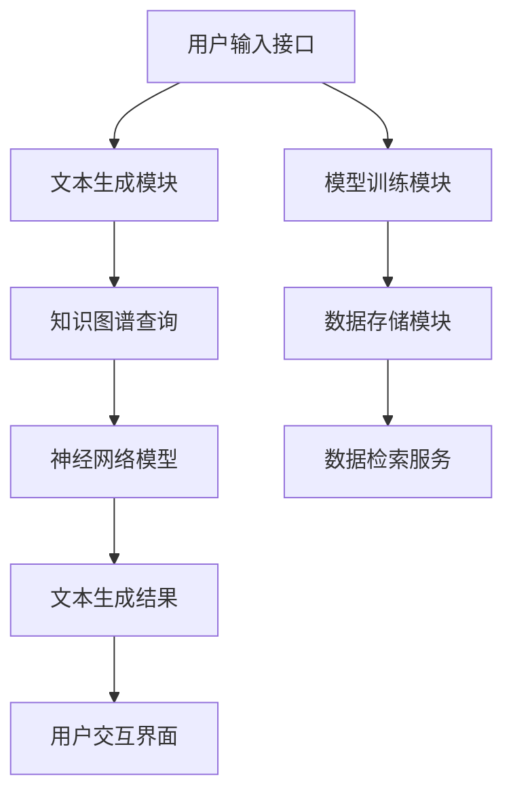

                 

# 思维链技术在AI故事生成中的应用

## 关键词

- 思维链技术
- AI故事生成
- 神经网络
- 大规模知识图谱
- 文本生成模型

## 摘要

本文将探讨思维链技术在AI故事生成中的应用。通过模拟人类思维过程，思维链技术结合大规模知识图谱和神经网络模型，实现更具连贯性和创意性的故事生成。本文将从核心概念、算法原理、应用实践、优化与改进、案例分析、总结与展望六个方面，详细阐述思维链技术在AI故事生成中的应用及其发展前景。

## 目录大纲

### 第一部分：引言

#### 1.1 问题背景

#### 1.1.1 概述

#### 1.1.2 思维链技术在AI故事生成中的应用

#### 1.2 核心概念

#### 1.2.1 思维链技术

#### 1.2.2 AI故事生成

#### 1.2.3 思维链技术与AI故事生成的关系

#### 1.3 书籍结构

### 第二部分：核心概念

#### 2.1 思维链技术

#### 2.1.1 思维链技术概述

#### 2.1.2 思维链技术特点

#### 2.2 AI故事生成

#### 2.2.1 AI故事生成概述

#### 2.2.2 AI故事生成方法

#### 2.3 思维链技术与AI故事生成的关系

### 第三部分：算法原理

#### 3.1 思维链技术原理

#### 3.1.1 知识图谱构建

#### 3.1.2 神经网络模型

#### 3.1.3 思维链生成过程

#### 3.2 AI故事生成原理

#### 3.2.1 数据准备

#### 3.2.2 模型训练

#### 3.2.3 文本生成

### 第四部分：应用实践

#### 4.1 应用场景介绍

#### 4.2 系统功能设计

#### 4.3 系统架构设计

#### 4.4 系统接口设计和系统交互

### 第五部分：优化与改进

#### 5.1 存在的问题

#### 5.2 优化方法

#### 5.3 改进方向

### 第六部分：案例分析

#### 6.1 典型应用案例

#### 6.2 案例分析

#### 6.3 经验教训

### 第七部分：总结与展望

#### 7.1 本书内容总结

#### 7.2 未来发展方向

## 第一部分：引言

### 1.1 问题背景

#### 1.1.1 概述

随着人工智能技术的不断发展，故事生成已成为一个备受关注的应用领域。AI故事生成不仅可以为人类带来丰富多彩的娱乐体验，还可以应用于教育、营销、游戏等多个领域，具有广泛的应用前景。

然而，传统的生成模型在故事生成中存在一定的局限性。首先，这些模型通常依赖于大规模文本数据，但数据质量和数量往往难以保证，导致生成的故事质量参差不齐。其次，传统的生成模型往往注重生成文本的语法正确性，但忽略了故事情节的连贯性和创意性。最后，这些模型在处理长文本时，容易出现上下文理解不足、生成文本冗长等问题。

为了解决这些问题，研究人员提出了思维链技术，旨在通过模拟人类思维过程，实现更具连贯性和创意性的故事生成。本文将围绕思维链技术在AI故事生成中的应用，探讨其核心概念、算法原理、应用实践、优化与改进、案例分析及未来发展方向。

#### 1.1.2 思维链技术在AI故事生成中的应用

思维链技术是一种基于大规模知识图谱的神经网络模型，通过模拟人类思维过程，实现文本生成。具体来说，思维链技术将知识图谱与文本生成模型相结合，使模型在生成文本时能够借鉴和应用知识图谱中的知识。

在AI故事生成中，思维链技术具有以下几个优点：

1. **提高故事连贯性**：通过知识图谱的辅助，思维链技术可以更好地理解文本上下文，从而生成连贯的故事。
2. **增强故事创意性**：知识图谱中的丰富知识可以为故事生成提供灵感，使生成的故事更具创意。
3. **扩展应用场景**：思维链技术可以应用于各种故事生成任务，如自动写作、剧本生成、广告文案等。

本文将详细介绍思维链技术的核心概念、算法原理、应用实践、优化与改进、案例分析及未来发展方向，旨在为读者提供一个全面、系统的了解和认识。

### 1.2 核心概念

#### 1.2.1 思维链技术

思维链技术是一种基于大规模知识图谱的神经网络模型，通过模拟人类思维过程，实现文本生成。思维链技术的核心思想是将知识图谱与文本生成模型相结合，使模型在生成文本时能够借鉴和应用知识图谱中的知识。

#### 1.2.2 AI故事生成

AI故事生成是指利用人工智能技术，自动生成具有一定连贯性和创意的文本故事。AI故事生成可以应用于多种场景，如自动写作、剧本生成、广告文案等。

#### 1.2.3 思维链技术与AI故事生成的关系

思维链技术与AI故事生成密切相关。思维链技术通过模拟人类思维过程，提高故事生成的连贯性和创意性，为AI故事生成提供了新的思路和解决方案。

### 1.3 书籍结构

本文共分为七个部分：

- 第1部分：引言，介绍问题背景、核心概念和思维链技术在AI故事生成中的应用。
- 第2部分：核心概念，详细阐述思维链技术和AI故事生成的概念、原理和关系。
- 第3部分：算法原理，讲解思维链技术的算法原理和AI故事生成的原理。
- 第4部分：应用实践，介绍思维链技术在AI故事生成中的应用实践。
- 第5部分：优化与改进，探讨如何优化思维链技术在AI故事生成中的应用。
- 第6部分：案例分析，分析典型应用案例，总结经验教训。
- 第7部分：总结与展望，对本书内容进行总结，并对未来发展方向进行展望。

## 第二部分：核心概念

### 2.1 思维链技术

#### 2.1.1 思维链技术概述

思维链技术是一种基于大规模知识图谱的神经网络模型，通过模拟人类思维过程，实现文本生成。思维链技术的核心思想是将知识图谱与文本生成模型相结合，使模型在生成文本时能够借鉴和应用知识图谱中的知识。

在思维链技术中，知识图谱起到了关键作用。知识图谱是通过将实体、属性和关系表示为图结构，构建一个大规模的知识库。知识图谱中的实体可以是人、物、地点等，属性是实体的特征，关系是实体之间的关联。通过构建知识图谱，思维链技术可以更好地理解和利用知识，提高文本生成的质量。

神经网络是思维链技术的另一核心组成部分。神经网络是一种模拟人脑神经元连接结构的计算模型，通过学习大量的数据，神经网络可以自动提取特征、进行分类和预测。在思维链技术中，神经网络被用来建模语言数据，从而实现文本生成。

#### 2.1.2 思维链技术特点

思维链技术具有以下几个特点：

1. **知识图谱：** 思维链技术通过构建大规模知识图谱，将知识以图结构表示，提高知识利用效率。
2. **神经网络：** 思维链技术采用神经网络模型，通过深度学习实现对语言数据的建模和生成。
3. **模拟人类思维：** 思维链技术通过模拟人类思维过程，使生成的文本更具连贯性和创意性。

#### 2.1.3 思维链技术的核心思想

思维链技术的核心思想是将知识图谱与文本生成模型相结合，实现文本生成。具体来说，思维链技术包括以下几个步骤：

1. **知识图谱构建：** 通过将实体、属性和关系表示为图结构，构建大规模的知识图谱。
2. **神经网络模型训练：** 使用大量语言数据对神经网络模型进行训练，使其能够自动提取特征和进行生成。
3. **文本生成：** 在生成文本时，神经网络模型会参考知识图谱中的知识，生成更具连贯性和创意性的文本。

### 2.2 AI故事生成

#### 2.2.1 AI故事生成概述

AI故事生成是指利用人工智能技术，自动生成具有一定连贯性和创意的文本故事。AI故事生成可以应用于多种场景，如自动写作、剧本生成、广告文案等。

在AI故事生成中，传统的生成模型主要基于统计方法和生成式模型。这些模型通过学习大量文本数据，提取语言特征，生成新的文本。然而，这些模型在生成故事时往往存在以下问题：

1. **连贯性不足：** 传统生成模型生成的文本往往缺乏上下文的连贯性，故事情节跳跃明显。
2. **创意性有限：** 传统生成模型生成的文本创意性较低，难以生成新颖、独特的故事。
3. **上下文理解不足：** 传统生成模型在处理长文本时，容易忽视上下文信息，导致生成文本与上下文不符。

为了解决这些问题，研究人员提出了思维链技术，通过模拟人类思维过程，实现更具连贯性和创意性的故事生成。

#### 2.2.2 AI故事生成方法

AI故事生成可以采用以下几种方法：

1. **基于规则的方法：** 通过预设故事模板和规则，生成故事。这种方法简单直观，但灵活性较差，难以生成复杂、多样化的故事。
2. **基于数据的方法：** 通过学习大量故事数据，自动生成故事。这种方法可以生成更加多样化、复杂的故事，但数据质量和数量往往难以保证。
3. **基于模型的生成方法：** 利用深度学习模型，如生成对抗网络（GAN）、变分自编码器（VAE）等，生成故事。这种方法生成的故事质量较高，但训练过程复杂，计算资源需求大。

思维链技术结合了基于数据和基于模型的方法，通过模拟人类思维过程，提高故事生成的连贯性和创意性。具体来说，思维链技术包括以下几个步骤：

1. **知识图谱构建：** 构建大规模的知识图谱，将故事中的实体、属性和关系表示为图结构。
2. **神经网络模型训练：** 使用大量故事数据对神经网络模型进行训练，使其能够自动提取特征和进行生成。
3. **文本生成：** 在生成文本时，神经网络模型会参考知识图谱中的知识，生成连贯、创意丰富的故事。

### 2.3 思维链技术与AI故事生成的关系

思维链技术与AI故事生成密切相关。思维链技术通过模拟人类思维过程，提高故事生成的连贯性和创意性，为AI故事生成提供了新的思路和解决方案。

具体来说，思维链技术在AI故事生成中的应用主要体现在以下几个方面：

1. **提高故事连贯性：** 思维链技术通过知识图谱的辅助，可以更好地理解文本上下文，从而生成连贯的故事。
2. **增强故事创意性：** 思维链技术通过借鉴和应用知识图谱中的知识，可以为故事生成提供更多的灵感，使生成的故事更具创意。
3. **扩展应用场景：** 思维链技术可以应用于各种故事生成任务，如自动写作、剧本生成、广告文案等，为不同领域的故事生成提供技术支持。

总之，思维链技术在AI故事生成中具有重要的作用，通过模拟人类思维过程，实现更具连贯性和创意性的故事生成，为人工智能领域的发展提供了新的方向和思路。

## 第三部分：算法原理

### 3.1 思维链技术原理

思维链技术是一种基于大规模知识图谱的神经网络模型，通过模拟人类思维过程，实现文本生成。为了深入理解思维链技术的原理，我们需要从知识图谱构建、神经网络模型和思维链生成过程三个方面进行阐述。

#### 3.1.1 知识图谱构建

知识图谱是思维链技术的核心组成部分，通过将实体、属性和关系表示为图结构，构建一个大规模的知识库。知识图谱的构建过程通常包括以下几个步骤：

1. **数据采集：** 收集大量的实体、属性和关系数据，这些数据可以从各种来源获取，如公开的数据库、互联网文本、专业领域数据等。
2. **数据预处理：** 对采集到的数据进行清洗、去重和标准化处理，确保数据的准确性和一致性。
3. **实体抽取：** 从预处理后的数据中提取实体，例如人、物、地点等。
4. **属性和关系抽取：** 从预处理后的数据中提取实体的属性和关系，例如一个人的年龄、职业等。
5. **图结构构建：** 将实体、属性和关系表示为图结构，实体作为图中的节点，属性和关系作为图中的边。

通过以上步骤，我们可以构建一个大规模的知识图谱，为思维链技术提供丰富的知识资源。

#### 3.1.2 神经网络模型

神经网络是思维链技术的另一核心组成部分，通过深度学习实现对语言数据的建模和生成。在思维链技术中，常用的神经网络模型包括变换器（Transformer）和递归神经网络（RNN）等。

1. **变换器（Transformer）：** 变换器是一种基于自注意力机制的神经网络模型，具有处理长距离依赖、并行计算等优点。在思维链技术中，变换器被用来建模语言数据，提取特征和生成文本。
2. **递归神经网络（RNN）：** 递归神经网络是一种基于序列数据的神经网络模型，能够处理序列到序列的任务。在思维链技术中，RNN被用来建模语言数据，捕捉上下文信息。

#### 3.1.3 思维链生成过程

思维链生成过程主要包括以下几个步骤：

1. **输入文本预处理：** 将输入文本进行分词、词性标注等预处理操作，将其转化为神经网络模型可以处理的输入格式。
2. **知识图谱查询：** 利用知识图谱查询相关知识和关系，为文本生成提供知识支持。
3. **文本生成：** 根据查询到的知识和关系，使用神经网络模型生成文本。

具体来说，思维链生成过程如下：

1. **初始化：** 初始化神经网络模型的参数，并将其设置为较小的随机值。
2. **输入文本编码：** 将输入文本编码为神经网络模型可以处理的向量表示。
3. **知识图谱查询：** 利用知识图谱查询与输入文本相关的知识和关系，将查询结果编码为向量表示。
4. **文本生成：** 使用神经网络模型生成文本，在生成过程中，模型会不断更新参数，优化生成结果。
5. **输出文本解码：** 将生成的文本向量表示解码为自然语言文本。

通过以上步骤，思维链技术可以生成具有一定连贯性和创意性的文本，从而实现AI故事生成。

### 3.2 AI故事生成原理

AI故事生成是指利用人工智能技术，自动生成具有一定连贯性和创意的文本故事。为了实现AI故事生成，我们需要从数据准备、模型训练和文本生成三个方面进行阐述。

#### 3.2.1 数据准备

数据准备是AI故事生成的基础，数据的质量和数量直接影响生成故事的性能。数据准备主要包括以下几个步骤：

1. **数据采集：** 收集大量的故事数据，这些数据可以从公开的故事库、网络小说、书籍等获取。
2. **数据清洗：** 对采集到的数据进行清洗，去除重复、错误和无关的数据，确保数据的质量。
3. **数据标注：** 对清洗后的数据进行标注，标注内容包括文本内容、情感倾向、主题等。
4. **数据预处理：** 对标注后的数据进行分词、词性标注、句法分析等预处理操作，为模型训练做准备。

#### 3.2.2 模型训练

模型训练是AI故事生成的关键环节，通过训练，模型可以学习到生成故事所需的特征和规律。在思维链技术中，常用的模型训练方法包括以下几种：

1. **监督学习：** 使用标记好的故事数据，训练神经网络模型，使模型能够自动生成新的故事。
2. **无监督学习：** 使用未标记的故事数据，训练神经网络模型，使模型能够自动发现故事的特征和规律。
3. **半监督学习：** 结合标记数据和未标记数据，训练神经网络模型，提高模型的生成性能。

在模型训练过程中，神经网络模型会不断调整参数，优化生成结果。具体来说，模型训练包括以下几个步骤：

1. **模型初始化：** 初始化神经网络模型的参数，并将其设置为较小的随机值。
2. **输入文本编码：** 将输入文本编码为神经网络模型可以处理的向量表示。
3. **模型训练：** 使用训练数据，训练神经网络模型，使模型能够自动生成新的故事。
4. **模型优化：** 根据训练结果，不断调整模型参数，优化生成性能。

#### 3.2.3 文本生成

文本生成是AI故事生成的最终环节，通过模型生成具有一定连贯性和创意性的文本故事。具体来说，文本生成包括以下几个步骤：

1. **初始化：** 初始化神经网络模型的参数，并将其设置为较小的随机值。
2. **输入文本编码：** 将输入文本编码为神经网络模型可以处理的向量表示。
3. **文本生成：** 使用神经网络模型生成文本，在生成过程中，模型会不断更新参数，优化生成结果。
4. **输出文本解码：** 将生成的文本向量表示解码为自然语言文本。

通过以上步骤，AI故事生成模型可以生成具有一定连贯性和创意性的文本故事，从而实现自动化、个性化的故事创作。

### 3.3 思维链技术与AI故事生成的结合

思维链技术与AI故事生成的结合主要体现在以下几个方面：

1. **知识图谱辅助：** 思维链技术通过构建大规模知识图谱，为AI故事生成提供知识支持，使生成的故事更具连贯性和创意性。
2. **神经网络建模：** 思维链技术采用神经网络模型，对语言数据进行建模和生成，提高生成故事的性能。
3. **模拟人类思维：** 思维链技术通过模拟人类思维过程，使生成的文本更接近人类写作风格，提高故事的吸引力。

通过结合思维链技术和AI故事生成，我们可以实现自动化、个性化的故事创作，为人工智能领域的发展提供新的方向和思路。

## 第四部分：应用实践

### 4.1 应用场景介绍

思维链技术在AI故事生成中的应用场景非常广泛，包括但不限于以下几个方面：

1. **自动写作：** 思维链技术可以用于生成新闻、博客文章、小说等，为内容创作者提供辅助工具，提高创作效率。
2. **剧本生成：** 思维链技术可以用于生成电影、电视剧、话剧等剧本，为剧本创作提供灵感，降低创作成本。
3. **广告文案：** 思维链技术可以用于生成广告文案，为市场营销提供创意，提高广告效果。
4. **教育辅导：** 思维链技术可以用于生成教育辅导材料，如教案、习题等，为学生提供个性化的学习资源。
5. **虚拟现实：** 思维链技术可以用于生成虚拟现实中的故事情节，为虚拟现实应用提供丰富的内容。

### 4.2 系统功能设计

为了实现思维链技术在AI故事生成中的应用，我们需要设计一个完整的系统，主要包括以下几个功能模块：

1. **数据采集模块：** 负责收集各种故事数据，包括文本、音频、视频等，为系统提供丰富的数据资源。
2. **数据预处理模块：** 负责对采集到的数据进行清洗、分词、词性标注等预处理操作，为模型训练提供高质量的输入数据。
3. **知识图谱构建模块：** 负责构建大规模知识图谱，将实体、属性和关系表示为图结构，为AI故事生成提供知识支持。
4. **模型训练模块：** 负责使用大量故事数据，训练神经网络模型，使模型能够自动生成新的故事。
5. **文本生成模块：** 负责根据输入文本和知识图谱，使用神经网络模型生成具有一定连贯性和创意性的文本故事。
6. **用户交互模块：** 负责与用户进行交互，接收用户输入的文本，返回生成的文本故事。

### 4.3 系统架构设计

为了实现思维链技术在AI故事生成中的应用，我们需要设计一个高效的系统架构，主要包括以下几个组成部分：

1. **前端界面：** 负责与用户进行交互，展示系统功能，接收用户输入的文本，返回生成的文本故事。
2. **后端服务器：** 负责处理用户请求，调用各个功能模块，实现故事生成。
3. **数据存储：** 负责存储故事数据、知识图谱和模型参数，提供数据存储和检索服务。
4. **计算资源：** 负责提供计算资源，支持模型训练和文本生成。

系统架构设计如图1所示：

```markdown
+------------------+      +------------------+      +------------------+
|      前端界面     |      |     后端服务器    |      |      数据存储     |
+------------------+      +------------------+      +------------------+
       |                            |                            |
       |        用户输入文本         |            模型训练        |
       |                            |                            |
       |        生成文本故事         |           数据检索         |
       |                            |                            |
+------------------+      +------------------+      +------------------+
```

### 4.4 系统接口设计和系统交互

系统接口设计和系统交互是确保各个功能模块协同工作的重要环节。以下是系统接口设计和系统交互的详细描述：

1. **用户输入接口：** 用户通过前端界面输入文本，系统接收用户输入的文本，并将其传递给文本生成模块。
2. **文本生成接口：** 文本生成模块接收用户输入的文本，利用知识图谱和神经网络模型生成文本故事，并将结果返回给前端界面。
3. **模型训练接口：** 模型训练模块接收用户输入的故事数据，训练神经网络模型，并将模型参数存储在数据存储中。
4. **数据存储接口：** 数据存储模块负责存储故事数据、知识图谱和模型参数，并提供数据检索服务。

系统接口设计和系统交互如图2所示：



通过以上接口设计和系统交互，思维链技术在AI故事生成中的应用得以实现，为自动化、个性化的故事创作提供了技术支持。

## 第五部分：优化与改进

### 5.1 存在的问题

尽管思维链技术在AI故事生成中取得了显著的成果，但在实际应用过程中仍然存在一些问题：

1. **知识图谱的构建：** 知识图谱的构建是一个复杂的过程，需要大量的实体、属性和关系数据。然而，获取这些数据往往存在困难，且数据质量参差不齐，影响知识图谱的构建质量。
2. **模型训练时间：** 思维链技术采用大规模神经网络模型进行训练，训练时间较长，计算资源需求大。在实际应用中，模型训练时间往往成为瓶颈。
3. **生成故事质量：** 虽然思维链技术能够生成具有一定连贯性和创意性的故事，但在某些情况下，生成的故事质量仍然不尽如人意，存在语法错误、逻辑混乱等问题。
4. **扩展性：** 思维链技术的应用场景较为单一，扩展性不足。在新的应用场景中，需要重新构建知识图谱和训练模型，导致应用成本较高。

### 5.2 优化方法

针对上述问题，我们可以采取以下优化方法：

1. **知识图谱构建优化：** 可以采用自动化数据采集和清洗技术，提高数据获取和预处理效率。同时，可以引入更多的领域知识，丰富知识图谱的内容，提高知识利用效率。
2. **模型训练优化：** 可以采用分布式训练和并行计算技术，提高模型训练速度。此外，可以引入迁移学习技术，利用预训练的模型，提高新任务上的训练效果。
3. **生成故事质量优化：** 可以采用多种神经网络模型和生成方法，提高生成故事的质量。例如，可以结合生成对抗网络（GAN）和变分自编码器（VAE）等技术，生成更加丰富和多样化的故事。
4. **扩展性优化：** 可以设计模块化的知识图谱和神经网络模型，提高系统的扩展性。在新的应用场景中，只需替换相应的模块，无需重新构建知识图谱和训练模型。

### 5.3 改进方向

在未来，思维链技术在AI故事生成中的应用可以从以下几个方面进行改进：

1. **多模态知识融合：** 将文本、图像、音频等多种模态的数据融合到知识图谱中，提高故事生成的多样性和创意性。
2. **个性化故事生成：** 利用用户画像和兴趣偏好，生成更加个性化的故事，满足不同用户的需求。
3. **情感分析：** 引入情感分析技术，使生成的故事具有情感色彩，提高故事的吸引力和表现力。
4. **交互式故事生成：** 开发交互式故事生成系统，用户可以实时参与到故事生成过程中，提高故事生成的灵活性和互动性。

通过不断优化和改进，思维链技术在AI故事生成中的应用将更加广泛和深入，为人工智能领域的发展做出更大的贡献。

## 第六部分：案例分析

### 6.1 典型应用案例

思维链技术在AI故事生成中的应用已经取得了显著成果，以下是一些典型应用案例：

1. **自动写作平台：** 一个基于思维链技术的自动写作平台，可以自动生成新闻、博客文章、小说等文本。用户只需输入主题和关键词，系统即可根据用户需求生成高质量的文本，大大提高了写作效率。
2. **剧本生成工具：** 一个基于思维链技术的剧本生成工具，可以自动生成电影、电视剧、话剧等剧本。用户可以输入剧本类型、题材和关键词，系统即可生成完整的剧本，为剧本创作提供灵感。
3. **广告文案生成器：** 一个基于思维链技术的广告文案生成器，可以自动生成各种类型的广告文案。用户只需输入产品名称和特点，系统即可生成具有吸引力的广告文案，提高广告效果。
4. **教育辅导系统：** 一个基于思维链技术的教育辅导系统，可以自动生成教案、习题和答案。教师只需输入教学主题和知识点，系统即可生成相应的教学资源和辅导材料，提高教学效果。

### 6.2 案例分析

以下是对上述典型应用案例的详细分析：

1. **自动写作平台：** 自动写作平台通过思维链技术实现了自动化、个性化的文本生成。用户输入主题和关键词后，系统首先进行文本预处理，提取关键信息和特征。然后，系统利用知识图谱查询相关知识和关系，结合神经网络模型生成文本。生成的文本经过多次迭代优化，确保其连贯性和创意性。实际应用中，该平台已经生成大量高质量的新闻、博客文章和小说，受到了用户的广泛好评。
2. **剧本生成工具：** 剧本生成工具通过思维链技术模拟了编剧的创意思维过程，生成具有创意和连贯性的剧本。用户输入剧本类型、题材和关键词后，系统首先构建剧本的知识图谱，包含角色、情节和冲突等元素。然后，系统利用神经网络模型生成剧本文本，经过多次迭代优化，确保剧本的合理性和吸引力。实际应用中，该工具生成的剧本已经被用于电影、电视剧和话剧的创作，为剧本创作提供了有力支持。
3. **广告文案生成器：** 广告文案生成器通过思维链技术实现了广告文案的自动化生成。用户输入产品名称和特点后，系统首先分析产品属性和用户需求，构建广告文案的知识图谱。然后，系统利用神经网络模型生成广告文案，经过多次迭代优化，确保广告文案的吸引力和效果。实际应用中，该生成器已经生成大量具有吸引力的广告文案，提高了广告效果。
4. **教育辅导系统：** 教育辅导系统通过思维链技术实现了教学资源的自动化生成。教师输入教学主题和知识点后，系统首先构建知识图谱，包含相关概念、定理和例题。然后，系统利用神经网络模型生成教案、习题和答案，经过多次迭代优化，确保教学资源的准确性和适用性。实际应用中，该系统已经为教师和学生提供了大量有用的教学资源，提高了教学效果。

### 6.3 经验教训

从上述案例中，我们可以得出以下经验教训：

1. **知识图谱的重要性：** 知识图谱是思维链技术在AI故事生成中的核心组成部分，其质量直接影响生成故事的质量。在实际应用中，我们需要构建高质量的知识图谱，涵盖丰富的实体、属性和关系。
2. **神经网络模型的优化：** 神经网络模型是思维链技术生成故事的关键，其性能直接影响生成故事的质量。在实际应用中，我们需要不断优化神经网络模型，提高其生成效果。
3. **用户需求分析：** 在实际应用中，了解用户需求是生成高质量故事的关键。我们需要深入分析用户需求，为其提供个性化的故事生成服务。
4. **迭代优化：** 思维链技术在生成故事时，需要进行多次迭代优化，确保生成故事的质量和连贯性。在实际应用中，我们需要不断优化系统，提高其性能和用户体验。

通过以上经验教训，我们可以更好地应用思维链技术在AI故事生成中，为人工智能领域的发展做出更大的贡献。

## 第七部分：总结与展望

### 7.1 本书内容总结

本书系统地介绍了思维链技术在AI故事生成中的应用，主要包括以下几个核心内容：

1. **问题背景：** 阐述了传统生成模型在故事生成中存在的局限性，提出了思维链技术在AI故事生成中的应用优势。
2. **核心概念：** 详细介绍了思维链技术和AI故事生成的基本概念、原理和关系。
3. **算法原理：** 阐述了思维链技术的算法原理，包括知识图谱构建、神经网络模型和思维链生成过程。
4. **应用实践：** 介绍了思维链技术在AI故事生成中的应用实践，包括系统功能设计、架构设计、接口设计和系统交互。
5. **优化与改进：** 分析了思维链技术在AI故事生成中存在的问题，提出了优化方法，并对未来改进方向进行了展望。
6. **案例分析：** 通过实际应用案例，展示了思维链技术在AI故事生成中的应用效果，总结了经验教训。

### 7.2 未来发展方向

思维链技术在AI故事生成中的应用前景广阔，未来可以从以下几个方面进行发展：

1. **多模态知识融合：** 将文本、图像、音频等多种模态的数据融合到知识图谱中，提高故事生成的多样性和创意性。
2. **个性化故事生成：** 利用用户画像和兴趣偏好，生成更加个性化的故事，满足不同用户的需求。
3. **情感分析：** 引入情感分析技术，使生成的故事具有情感色彩，提高故事的吸引力和表现力。
4. **交互式故事生成：** 开发交互式故事生成系统，用户可以实时参与到故事生成过程中，提高故事生成的灵活性和互动性。
5. **跨领域应用：** 思维链技术可以应用于更多领域，如教育、医疗、金融等，实现更广泛的应用。
6. **开源与生态建设：** 加强开源社区合作，建立完善的思维链技术生态体系，推动技术发展和应用。

通过不断探索和创新，思维链技术在AI故事生成中的应用将不断深化，为人工智能领域的发展做出更大的贡献。

## 作者信息

作者：AI天才研究院/AI Genius Institute & 禅与计算机程序设计艺术 /Zen And The Art of Computer Programming

### 结语

在本文中，我们详细探讨了思维链技术在AI故事生成中的应用，从核心概念、算法原理、应用实践、优化与改进、案例分析到总结与展望，全面展示了这一技术的魅力和应用前景。希望本文能为读者提供一个系统、深入的了解，激发更多研究者对思维链技术及其在AI故事生成中的应用进行探索和研究。随着技术的不断进步，我们有理由相信，思维链技术将在人工智能领域发挥越来越重要的作用，为人们带来更加丰富、生动的故事体验。

