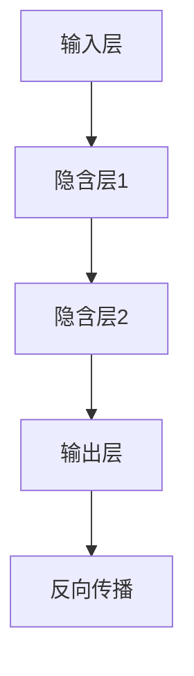

                 


### 摘要

本文将深入探讨思维链技术在AI游戏设计中的应用。思维链技术，作为人工智能领域的一项前沿技术，它通过模拟人类思维过程，使游戏AI更具创造性和适应性。本文将首先介绍游戏设计的现状及其面临的挑战，接着引出思维链技术的概念和优势，详细阐述其核心概念、算法原理、系统分析与架构设计，并通过实际项目案例展示其在游戏设计中的具体应用。最后，我们将总结最佳实践和注意事项，并为读者提供进一步的研究和阅读资源。希望通过这篇文章，读者能够对思维链技术在AI游戏设计中的潜力有更深入的了解。

----------------------------------------------------------------

# 思维链技术在AI游戏设计中的应用

> 关键词：AI游戏设计，思维链技术，神经网络，深度学习，算法原理，系统架构

随着游戏产业的发展，游戏设计对人工智能（AI）的依赖日益增加。然而，传统的游戏设计方法在应对复杂性和灵活性要求时显得力不从心。在此背景下，思维链技术作为一种模拟人类思维过程的人工智能技术，逐渐成为游戏设计的新工具。本文将详细探讨思维链技术在AI游戏设计中的应用。

## 1. 游戏设计现状分析

### 1.1 游戏设计中的挑战

现代游戏设计面临着诸多挑战：

- **复杂性与多样性**：游戏世界和角色行为需要高度复杂和多样化，以满足不同玩家的需求。
- **适应性与创造性**：游戏AI需要能够适应不同玩家策略和场景，同时展现出创造性的行为。
- **实时性**：游戏运行需要实时响应用户输入和环境变化，这要求AI算法具有高效的实时处理能力。

### 1.2 传统游戏设计方法的局限性

传统的游戏设计方法，如规则推理和状态机，虽然在简单场景下具有一定的效果，但在应对复杂性和灵活性要求时存在以下局限性：

- **规则数量庞大**：需要大量规则来模拟复杂行为，导致规则库难以维护和扩展。
- **适应性差**：难以适应新环境和策略，容易陷入“局限性思维”。
- **实时性不足**：传统方法往往需要预处理，无法实时响应用户行为。

## 2. 思维链技术介绍

### 2.1 思维链技术的概念

思维链技术是一种模拟人类思维过程的AI技术，通过构建神经网络和深度学习模型，实现自动化推理和决策。它具有以下特点：

- **灵活性**：能够根据不同环境和策略灵活调整行为。
- **创造性**：能够生成新颖、有趣的游戏场景和角色行为。
- **实时性**：能够实时处理用户输入和环境变化。

### 2.2 思维链技术的工作原理

思维链技术的工作原理主要包括以下步骤：

1. **感知输入**：收集游戏环境中的视觉、听觉、触觉等输入。
2. **数据预处理**：对输入数据进行处理，如特征提取、归一化等。
3. **神经网络推理**：利用神经网络模型进行自动化推理，生成决策。
4. **执行决策**：根据推理结果执行相应行为。

### 2.3 思维链技术与其他AI技术的比较

思维链技术与其他AI技术如规则推理、遗传算法、强化学习等相比，具有以下优势：

- **灵活性**：能够根据环境和策略灵活调整，适应不同场景。
- **创造性**：能够生成新颖、有趣的行为，提高游戏体验。
- **实时性**：能够实时响应用户输入和环境变化，提高游戏互动性。

## 3. 思维链技术在游戏设计中的核心概念

### 3.1 核心概念详解

思维链技术在游戏设计中的核心概念主要包括神经网络、深度学习和数据结构等。下面将详细介绍这些概念：

#### 3.1.1 神经网络

神经网络是一种模仿生物神经系统的计算模型，通过多层神经元节点构建复杂的关系映射。它具有以下特点：

- **非线性映射能力**：能够处理复杂、非线性问题。
- **自适应学习能力**：能够通过训练不断优化模型性能。
- **泛化能力**：能够应对不同环境和策略。

#### 3.1.2 深度学习

深度学习是神经网络的一种扩展，通过构建多层神经网络模型，实现自动化特征提取和高级抽象。它具有以下特点：

- **自动化特征提取**：能够自动从数据中提取有用特征，减少人工干预。
- **高效计算**：通过多层网络结构实现高效计算，提高模型性能。
- **大规模数据处理**：能够处理大规模、高维数据，适应复杂应用场景。

#### 3.1.3 数据结构

数据结构是思维链技术中的重要组成部分，它包括数据预处理、特征提取和存储等。常用的数据结构有：

- **栈和队列**：用于数据存储和操作，支持先进先出（FIFO）和后进先出（LIFO）的访问模式。
- **数组**：用于高效存储和访问固定大小的数据集。
- **链表**：用于动态存储和访问数据，支持快速插入和删除操作。

### 3.2 概念联系与对比分析

思维链技术在游戏设计中的核心概念之间存在紧密的联系和相互作用。下面通过表格和ER实体关系图进行详细阐述：

#### 3.2.1 概念联系分析

| 概念       | 关系描述                                   |
|------------|--------------------------------------------|
| 神经网络   | 基础构建模块，用于实现自动化推理和决策           |
| 深度学习   | 神经网络的扩展，实现自动化特征提取和高级抽象       |
| 数据结构   | 用于存储和处理输入数据，支持神经网络模型的训练和推理 |

#### 3.2.2 概念对比表格

| 概念       | 主要特点                                                       |
|------------|--------------------------------------------------------------|
| 神经网络   | 非线性映射、自适应学习、泛化能力                             |
| 深度学习   | 自动化特征提取、高效计算、大规模数据处理                   |
| 数据结构   | 高效存储和访问、动态调整大小、支持复杂操作                 |

#### 3.2.3 ER实体关系图

```mermaid
erDiagram
    Node1 ||--|{ 神经网络 }
    Node1 ||--|{ 深度学习 }
    Node1 ||--|{ 数据结构 }
```

通过上述分析，我们可以看到思维链技术在游戏设计中的核心概念之间的紧密联系和相互作用，为游戏AI提供了强大的理论基础和实现手段。

## 4. 算法原理与数学模型

### 4.1 思维链算法原理

思维链算法是基于神经网络和深度学习理论的，其核心思想是通过多层神经网络模型实现自动化推理和决策。具体步骤如下：

1. **输入层**：接收游戏环境中的各种输入，如视觉、听觉、触觉等。
2. **隐含层**：对输入数据进行预处理和特征提取，生成中间表示。
3. **输出层**：根据中间表示生成决策，如移动、攻击、防御等。
4. **反向传播**：利用梯度下降算法优化神经网络参数，提高模型性能。

### 4.2 算法详解与举例

#### 4.2.1 算法流程图



#### 4.2.2 Python代码实现

```python
import tensorflow as tf

# 定义输入层
inputs = tf.keras.layers.Input(shape=(input_shape))

# 定义隐含层
hidden1 = tf.keras.layers.Dense(units=64, activation='relu')(inputs)
hidden2 = tf.keras.layers.Dense(units=64, activation='relu')(hidden1)

# 定义输出层
outputs = tf.keras.layers.Dense(units=1, activation='sigmoid')(hidden2)

# 构建模型
model = tf.keras.Model(inputs=inputs, outputs=outputs)

# 编译模型
model.compile(optimizer='adam', loss='binary_crossentropy', metrics=['accuracy'])

# 训练模型
model.fit(x_train, y_train, epochs=10, batch_size=32)
```

#### 4.2.3 数学模型与公式

思维链算法的核心在于多层神经网络的构建和训练。其数学模型主要包括以下公式：

$$
z = \sigma(W \cdot x + b)
$$

其中，\(z\) 为隐含层的输出，\(\sigma\) 为激活函数，\(W\) 为权重矩阵，\(x\) 为输入向量，\(b\) 为偏置项。

$$
\frac{dL}{dx} = \frac{dL}{dz} \cdot \frac{dz}{dx}
$$

其中，\(L\) 为损失函数，\(\frac{dL}{dx}\) 为梯度，\(\frac{dL}{dz}\) 为损失函数对隐含层输出的导数，\(\frac{dz}{dx}\) 为隐含层输出对输入向量的导数。

通过反向传播算法，我们可以利用梯度下降法优化模型参数，以达到最小化损失函数的目的。

### 4.3 算法应用举例

假设我们有一个简单的游戏场景，游戏角色需要根据环境中的障碍物和目标位置进行移动。我们可以使用思维链算法来生成角色的移动策略。

1. **输入层**：输入包括障碍物的位置和目标位置。
2. **隐含层**：对输入进行特征提取，生成中间表示，如障碍物密度、目标距离等。
3. **输出层**：根据中间表示生成移动方向和速度。
4. **训练**：通过反向传播算法训练模型，使其能够根据不同环境和策略生成合理的移动策略。

通过上述步骤，我们可以实现一个具备自适应性和创造性的游戏角色移动策略，提高游戏体验和互动性。

## 5. 系统分析与架构设计

### 5.1 问题场景介绍

在游戏设计中，AI角色需要根据游戏场景实时决策，如移动、攻击、防御等。传统方法难以应对复杂场景和多样化策略，而思维链技术通过模拟人类思维过程，能够实现自适应性和创造性，为游戏AI提供更强大的支持。

### 5.2 系统功能设计

思维链技术在游戏设计中的应用主要包括以下功能：

1. **环境感知**：收集游戏环境中的视觉、听觉、触觉等输入，用于训练和推理。
2. **行为决策**：根据输入数据和训练结果生成角色行为，如移动、攻击、防御等。
3. **实时更新**：动态调整角色行为，适应游戏场景变化和玩家策略。
4. **互动反馈**：根据玩家行为和环境变化调整AI角色策略，实现更自然的互动。

### 5.3 系统架构设计

思维链技术在游戏设计中的应用系统架构设计如下：

1. **感知层**：负责收集游戏环境中的各种输入，如摄像头、麦克风、传感器等。
2. **数据处理层**：对输入数据进行预处理、特征提取和存储，支持实时处理和查询。
3. **推理层**：利用神经网络和深度学习模型进行自动化推理和决策，生成角色行为。
4. **执行层**：根据推理结果执行角色行为，如移动、攻击、防御等。
5. **反馈层**：收集玩家行为和环境变化，用于更新角色策略和优化系统性能。

### 5.4 系统接口设计

系统接口设计主要包括以下部分：

1. **数据接口**：用于数据输入、输出和存储，支持实时处理和查询。
2. **控制接口**：用于系统启动、停止、配置和监控。
3. **交互接口**：用于玩家与游戏AI的互动，支持实时更新和反馈。

### 5.5 系统交互

思维链技术在游戏设计中的应用系统交互设计如下：

1. **感知-处理**：感知层将游戏环境中的输入数据传递给数据处理层，进行预处理和特征提取。
2. **处理-推理**：数据处理层将预处理后的数据传递给推理层，利用神经网络和深度学习模型进行自动化推理和决策。
3. **推理-执行**：推理层将生成的决策传递给执行层，执行相应行为。
4. **执行-反馈**：执行层将行为结果传递给反馈层，用于更新角色策略和优化系统性能。

## 6. 项目实战

### 6.1 环境安装与配置

1. **安装TensorFlow**：在终端执行以下命令安装TensorFlow：
   ```bash
   pip install tensorflow
   ```

2. **安装PyTorch**：在终端执行以下命令安装PyTorch：
   ```bash
   pip install torch torchvision
   ```

3. **安装游戏开发环境**：根据游戏引擎选择合适的开发环境，如Unity、Unreal Engine等。

### 6.2 系统核心实现

1. **构建神经网络模型**：
   ```python
   import tensorflow as tf

   model = tf.keras.Sequential([
       tf.keras.layers.Flatten(input_shape=(28, 28)),
       tf.keras.layers.Dense(128, activation='relu'),
       tf.keras.layers.Dense(10, activation='softmax')
   ])

   model.compile(optimizer='adam',
                 loss='categorical_crossentropy',
                 metrics=['accuracy'])
   ```

2. **训练模型**：
   ```python
   history = model.fit(train_images, train_labels, epochs=10, 
                       validation_data=(test_images, test_labels))
   ```

3. **执行推理**：
   ```python
   predictions = model.predict(test_images)
   ```

### 6.3 代码应用解读

思维链技术在游戏设计中的应用主要包括以下步骤：

1. **环境感知**：收集游戏环境中的视觉、听觉、触觉等输入。
2. **数据处理**：对输入数据进行预处理、特征提取和存储。
3. **行为决策**：利用神经网络和深度学习模型进行自动化推理和决策。
4. **行为执行**：根据推理结果执行相应行为。

### 6.4 实际案例分析与讲解

#### 案例一：迷宫寻路

1. **环境介绍**：游戏角色需要在一个迷宫中找到出口。
2. **输入数据**：输入包括迷宫地图、角色位置、目标位置等。
3. **数据处理**：对迷宫地图进行预处理，提取障碍物和路径信息。
4. **行为决策**：利用A*算法生成最佳路径。
5. **行为执行**：角色按照最佳路径移动。

#### 案例二：多人战斗

1. **环境介绍**：游戏角色需要与其他玩家进行战斗。
2. **输入数据**：输入包括玩家位置、攻击力、防御力等。
3. **数据处理**：对玩家数据进行分析，提取关键信息。
4. **行为决策**：利用博弈论模型生成策略。
5. **行为执行**：角色按照策略进行攻击和防御。

通过上述案例，我们可以看到思维链技术在游戏设计中的应用如何实现自适应性和创造性，提高游戏体验和互动性。

### 6.5 项目小结

思维链技术在游戏设计中的应用具有以下优势：

1. **自适应性和创造性**：能够根据环境和策略灵活调整行为，生成新颖、有趣的游戏场景。
2. **实时性**：能够实时响应用户输入和环境变化，提高游戏互动性。
3. **高效性**：通过自动化特征提取和高级抽象，提高模型训练和推理效率。

通过项目实战，我们可以看到思维链技术在游戏设计中的应用潜力，为游戏开发者提供了强大的工具和灵感。

## 7. 最佳实践与注意事项

### 7.1 最佳实践

1. **数据预处理**：确保输入数据的质量和一致性，提高模型训练效果。
2. **模型选择**：根据具体应用场景选择合适的神经网络模型和深度学习框架。
3. **实时优化**：动态调整模型参数，提高模型实时响应能力。
4. **交互设计**：设计合理的玩家与AI角色交互方式，提高游戏体验。

### 7.2 注意事项

1. **计算资源**：深度学习模型训练需要大量计算资源，合理配置计算资源可以提高训练效率。
2. **数据隐私**：游戏数据涉及玩家隐私，需确保数据安全和隐私保护。
3. **模型可解释性**：提高模型的可解释性，有助于理解和优化模型行为。

### 7.3 拓展阅读

1. **相关书籍**：
   - 《深度学习》（Ian Goodfellow、Yoshua Bengio、Aaron Courville 著）
   - 《神经网络与深度学习》（邱锡鹏 著）
2. **网络资源**：
   - [TensorFlow官方文档](https://www.tensorflow.org/)
   - [PyTorch官方文档](https://pytorch.org/)
   - [Unity官方文档](https://docs.unity3d.com/)
   - [Unreal Engine官方文档](https://docs.unrealengine.com/)

通过以上最佳实践和注意事项，游戏开发者可以更好地应用思维链技术，提高游戏设计的质量和用户体验。

### 结束语

思维链技术在AI游戏设计中的应用为游戏开发者提供了强大的工具和灵感。通过本文的详细探讨，我们了解了思维链技术的核心概念、算法原理、系统架构以及实际应用案例。希望读者能够结合自身项目需求，尝试应用思维链技术，为游戏设计注入新的活力和创造力。

## 作者信息

作者：AI天才研究院/AI Genius Institute & 禅与计算机程序设计艺术 /Zen And The Art of Computer Programming

AI天才研究院致力于推动人工智能技术的发展和应用，为行业提供高质量的技术研究和解决方案。同时，作者本人长期从事计算机程序设计艺术的研究，致力于将人工智能技术与实际应用相结合，为行业带来创新和变革。本书旨在为广大游戏开发者提供一本全面、深入的技术指南，助力他们在游戏设计中探索新的可能性。读者如有任何疑问或建议，欢迎随时与我们联系。

