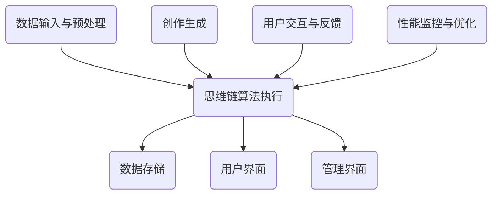
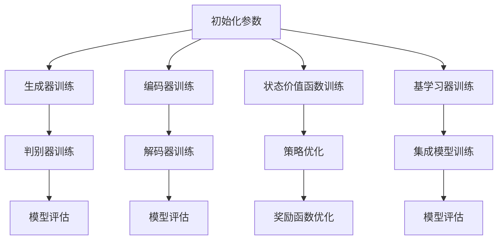

                 

### 第1章: 引言

#### 1.1 问题背景

近年来，人工智能（AI）技术的发展日新月异，特别是在深度学习和自然语言处理（NLP）领域，已经取得了显著的成果。然而，尽管AI在许多应用中已经展现出强大的能力，但在创作领域的应用仍然面临诸多挑战。文学、艺术、设计等创作活动通常需要高度的人类智慧和创造力，这使得传统的AI技术难以胜任。如何让AI在辅助创作中发挥更大作用，成为当前学术界和工业界共同关注的问题。

思维链技术作为一种新兴的AI技术，其核心思想是将人类思维过程转化为计算机可处理的算法，从而模拟人类的思考方式。这种技术不仅在理论上具有较高的可行性，而且在实际应用中也展现出了巨大的潜力。将思维链技术与AI辅助创作相结合，有望解决当前创作领域面临的诸多难题，为人类创作活动提供更加智能和高效的辅助手段。

#### 1.2 问题提出

当前，AI辅助创作领域存在以下几个亟待解决的问题：

1. **创造力受限**：现有的AI技术，如生成对抗网络（GAN）、变分自编码器（VAE）等，虽然能够生成具有一定创意的作品，但仍然难以达到人类创造力的水平。
2. **个性化不足**：AI创作往往缺乏个性化和情感的表达，导致作品缺乏独特性和感染力。
3. **交互性差**：目前的AI创作系统与用户的交互性不强，难以实现实时互动和反馈，影响创作体验。
4. **领域适应性低**：不同创作领域对AI的需求差异较大，现有技术难以适应多种创作场景。

思维链技术的引入，有望在一定程度上解决上述问题，提高AI在辅助创作中的效能。然而，如何实现这一目标，还需要深入研究和探索。

#### 1.3 解决思路

为了解决AI辅助创作面临的问题，我们可以从以下几个方面入手：

1. **核心概念与原理**：深入理解思维链技术的核心概念和原理，明确其在AI辅助创作中的作用机制。
2. **属性特征对比**：对比分析不同思维链技术的属性特征，选择最适合辅助创作的方法。
3. **应用场景探索**：研究思维链技术在各类创作领域中的应用场景，为实际应用提供指导。
4. **系统架构设计**：设计合理高效的AI辅助创作系统架构，确保思维链技术的有效应用。
5. **数学模型与算法**：建立适用于思维链技术的数学模型和算法，提高创作的准确性和效率。
6. **项目实战与优化**：通过实际项目验证思维链技术的有效性，不断优化和改进系统性能。

通过上述思路，我们可以逐步实现AI在辅助创作中的突破，为创作者提供更加智能和便捷的工具。

#### 1.4 边界与外延

在探讨思维链技术在AI辅助创作中的应用时，我们还需要明确一些边界与外延问题：

1. **技术边界**：思维链技术本身仍处于发展阶段，其应用效果和适用范围有一定的限制。
2. **应用边界**：AI辅助创作并不适用于所有创作领域，需要针对具体场景进行选择和应用。
3. **法律和伦理问题**：AI创作的作品归属权和版权问题尚需进一步探讨和规范。
4. **人与机器的协同**：如何在AI辅助创作中实现人与机器的协同工作，仍需要深入研究。

#### 1.5 概念结构与核心要素组成

思维链技术在AI辅助创作中的应用，可以理解为以下几个核心概念和要素的有机结合：

1. **思维链技术**：通过模拟人类思维过程，实现计算机对复杂问题的分析和解决。
2. **AI模型**：基于深度学习、NLP等技术，为思维链技术提供算法支持和计算能力。
3. **创作场景**：具体的应用场景，如文学、艺术、设计等，决定了思维链技术的具体应用方式。
4. **用户交互**：用户与AI系统的交互方式，决定了创作的体验和效果。
5. **数据与知识**：用于训练和优化AI模型的丰富数据集和专业知识库，是思维链技术有效性的基础。

通过以上核心概念和要素的有机结合，我们可以构建一个高效、智能的AI辅助创作系统，为创作者提供有力支持。

### 第2章: 核心概念与联系

#### 2.1 思维链技术概述

思维链技术是一种基于人工智能的模拟人类思维过程的技术。其核心思想是通过一系列算法和模型，将人类思维过程中的抽象思维、逻辑推理、联想能力等转化为计算机可处理的步骤。思维链技术不仅能够模拟人类思维的过程，还可以通过学习和优化，不断提高其解决问题的能力和效率。

#### 2.2 思维链技术的属性特征对比

为了更好地理解思维链技术在AI辅助创作中的应用，我们需要对比分析不同思维链技术的属性特征。以下是一些常见的思维链技术及其属性特征：

| 思维链技术        | 特点                                                         | 适用场景                                       |
|-----------------|------------------------------------------------------------|--------------------------------------------|
| 生成对抗网络（GAN） | 通过生成器和判别器的对抗训练，实现高质量的数据生成           | 图像生成、文本生成、音乐生成等                 |
| 变分自编码器（VAE） | 通过编码和解码过程，实现数据的降维和重建                       | 数据可视化、数据压缩、图像生成等                 |
| 强化学习（RL）    | 通过奖励机制，使模型能够自主学习和优化策略                   | 游戏AI、机器人控制、推荐系统等                   |
| 集成学习（Ensemble Learning） | 将多个学习器集合起来，提高整体预测性能                         | 预测模型、分类任务、回归任务等                   |
| 聚类分析（Clustering） | 将数据集分为若干个簇，使簇内数据相似，簇间数据差异大         | 数据挖掘、图像分割、文本分类等                   |

从上表可以看出，不同的思维链技术具有各自独特的属性特征，适用于不同的应用场景。在AI辅助创作中，根据具体需求选择合适的思维链技术，能够提高创作效率和质量。

#### 2.3 AI辅助创作中的思维链技术

在AI辅助创作中，思维链技术发挥着重要作用。以下是一些典型的应用场景：

1. **文学创作**：利用思维链技术，AI可以模拟人类的写作过程，生成具有一定创意和连贯性的文学作品。例如，通过GAN和VAE技术，可以生成小说、诗歌、剧本等。
2. **艺术创作**：思维链技术可以帮助艺术家进行创意生成和作品优化。例如，利用GAN和VAE技术，可以生成独特的艺术图像、音乐、视频等。
3. **设计创作**：思维链技术可以为设计师提供灵感，优化设计方案。例如，通过集成学习和聚类分析技术，可以生成新颖的家具设计、建筑设计、服装设计等。

在这些应用场景中，思维链技术不仅能够提高创作效率，还能够丰富创作形式和内容，为创作者提供更多可能性。

#### 2.4 思维链技术的ER实体关系图架构

为了更好地理解思维链技术在AI辅助创作中的具体应用，我们可以使用ER（实体关系）图来描述其架构。以下是一个简化的ER实体关系图：

```mermaid
erDiagram
    AI系统 ||--|{ 数据集 }|--|| 数据预处理
    AI系统 ||--|{ 训练模型 }|--|| 模型优化
    AI系统 ||--|{ 创作生成 }|--|| 作品生成
    AI系统 ||--|{ 用户交互 }|--|| 用户反馈
    数据集 ||--|{ 知识库 }|--|| 知识提取
    模型优化 ||--|{ 算法评估 }|--|| 性能提升
    作品生成 ||--|{ 创作风格 }|--|| 风格迁移
    用户交互 ||--|{ 用户偏好 }|--|| 个性化推荐
```

在这个ER图中，AI系统是核心，包括数据预处理、模型优化、创作生成、用户交互等模块。数据集和知识库为AI系统提供训练数据和专业知识支持。模型优化和算法评估模块负责提升模型性能。作品生成模块根据创作风格进行风格迁移，生成符合用户偏好的作品。用户交互模块收集用户反馈，用于个性化推荐。

通过这个ER实体关系图，我们可以清晰地看到思维链技术在AI辅助创作中的各个模块及其相互关系，有助于我们更好地理解和应用这一技术。

### 第3章: 应用场景介绍

#### 3.1 文学创作

文学创作是思维链技术在AI辅助创作中的一个重要应用场景。通过模拟人类的写作过程，AI可以生成具有一定创意和连贯性的文学作品。以下是一些具体的文学创作应用案例：

1. **小说生成**：利用生成对抗网络（GAN）和变分自编码器（VAE）技术，AI可以生成新颖的小说情节和角色。例如，OpenAI的GPT-3模型已经能够生成连贯、富有创意的小说章节，甚至整篇小说。
   
2. **诗歌创作**：AI可以通过分析大量诗歌作品，学习并模仿诗歌的语言风格和表达方式。例如，清华大学KEG实验室的AI助手“小冰”可以生成符合特定主题和情感色彩的诗歌。

3. **剧本编写**：利用思维链技术，AI可以协助编剧生成剧本大纲、角色设定和对话。例如，斯坦福大学的研究人员开发了一个基于生成对抗网络的剧本生成系统，可以生成具有戏剧张力的剧本片段。

#### 3.2 艺术创作

艺术创作是思维链技术的另一个重要应用领域。通过模拟人类的创意过程，AI可以生成独特的艺术作品，为艺术家提供灵感。

1. **图像生成**：利用生成对抗网络（GAN）技术，AI可以生成逼真的图像，例如人物画像、风景画等。例如，DeepArt.io使用GAN技术，可以将用户提供的照片转换为梵高风格、印象派风格等著名画家的绘画作品。

2. **音乐创作**：AI可以通过分析大量音乐作品，生成新的旋律和节奏。例如，谷歌的Magenta项目利用深度学习技术，生成具有创意和节奏感的音乐片段。

3. **视频生成**：AI可以通过分析视频内容，生成新的视频片段。例如，OpenAI的DALL·E模型可以生成与文本描述相符的图像，进一步可以结合视频生成技术，生成符合描述的视频片段。

#### 3.3 设计创作

在设计创作领域，思维链技术可以帮助设计师生成新颖的设计方案，提高创作效率。

1. **家具设计**：通过聚类分析和集成学习技术，AI可以生成新颖的家具设计。例如，伦敦大学学院的研究人员开发了一个基于机器学习的家具设计系统，可以生成符合人体工程学和美学要求的设计方案。

2. **建筑设计**：AI可以通过分析大量的建筑案例，生成新的建筑设计方案。例如，建筑科技公司Blockstream开发了一个基于生成对抗网络的建筑设计系统，可以生成具有创新性和可持续性的建筑结构。

3. **服装设计**：AI可以通过分析时尚潮流和用户偏好，生成符合市场需求的服装设计。例如，中国电商平台淘宝的“设计猫”利用AI技术，为设计师提供灵感，并生成新颖的服装设计。

#### 3.4 其他创作领域

除了文学、艺术和设计，思维链技术还可以应用于其他创作领域：

1. **广告创意**：通过分析用户行为和市场需求，AI可以生成新颖的广告创意。例如，谷歌的AdWords系统利用机器学习技术，为广告客户提供个性化的广告文案和设计。

2. **游戏开发**：AI可以协助游戏设计师生成游戏剧情、角色和关卡设计。例如，游戏公司Epic Games利用生成对抗网络（GAN）技术，生成新颖的游戏场景和角色。

3. **编程代码生成**：AI可以通过分析代码库和编程语言规范，生成新的代码片段和解决方案。例如，GitHub的Copilot工具利用大型语言模型，为开发者提供实时的编程代码建议。

总之，思维链技术在各类创作领域都有广泛的应用前景，通过模拟人类思维过程，AI可以协助人类创作者生成新颖、创意丰富且具有高度个性化的作品，为创作活动带来革命性的变革。

### 第4章: 系统架构设计

#### 4.1 系统功能设计

为了实现思维链技术在AI辅助创作中的突破，我们需要设计一个功能完善的系统。该系统应具备以下核心功能：

1. **数据输入与预处理**：系统需要能够接收用户输入的数据，如文本、图像、音频等，并进行预处理，确保数据格式统一和可用性。

2. **思维链算法执行**：系统应包含多种思维链算法，如生成对抗网络（GAN）、变分自编码器（VAE）、强化学习（RL）等，以适应不同创作场景的需求。

3. **创作生成**：系统需要根据思维链算法的输出，生成具有创意性和连贯性的作品，如小说、诗歌、艺术图像、设计作品等。

4. **用户交互与反馈**：系统应具备用户交互界面，允许用户对生成的作品进行评论、修改和调整，同时收集用户反馈，用于优化系统性能。

5. **性能监控与优化**：系统应具备性能监控机制，实时监测系统运行状态和资源利用率，并根据反馈进行优化，确保系统稳定高效运行。

#### 4.2 系统架构设计

为了实现上述功能，我们需要设计一个合理的系统架构。以下是一个简化的系统架构图：



在这个架构中，数据输入与预处理模块负责接收和整理用户输入的数据。思维链算法执行模块根据不同算法，对数据进行分析和处理，生成初步的创意作品。创作生成模块对思维链算法的输出进行进一步优化和调整，生成最终的作品。用户交互与反馈模块负责与用户进行交互，收集用户反馈，用于系统优化。性能监控与优化模块实时监控系统性能，并根据反馈进行优化。

#### 4.3 系统接口设计

为了确保系统的可扩展性和灵活性，我们需要设计合理的接口。以下是一些关键的接口设计：

1. **数据输入接口**：用于接收用户输入的数据，包括文本、图像、音频等。该接口需要支持多种数据格式，并具备数据预处理功能。

2. **思维链算法接口**：用于调用不同的思维链算法，如GAN、VAE、RL等。该接口需要支持参数配置和算法选择，以适应不同创作场景的需求。

3. **创作生成接口**：用于生成创意作品，如小说、诗歌、艺术图像等。该接口需要支持输出格式转换和个性化调整。

4. **用户交互接口**：用于与用户进行交互，包括展示作品、接收用户反馈、处理用户修改请求等。

5. **性能监控接口**：用于实时监控系统性能，包括资源利用率、运行状态等。该接口需要支持数据收集和报警功能。

#### 4.4 系统交互设计

为了确保系统各模块之间的协同工作，我们需要设计合理的交互流程。以下是一个简化的系统交互流程：

1. **数据输入**：用户通过用户界面提交数据，如文本、图像等。数据输入接口对数据进行预处理，并将其传递给思维链算法执行模块。

2. **算法执行**：思维链算法执行模块根据用户选择和配置的算法，对数据进行处理，生成初步的创意作品。

3. **作品生成**：创作生成模块对思维链算法的输出进行进一步优化和调整，生成最终的作品。

4. **用户反馈**：用户通过用户界面查看生成的作品，并进行评论、修改和调整。用户交互接口收集用户的反馈，并将其传递给思维链算法执行模块。

5. **系统优化**：思维链算法执行模块根据用户反馈，对算法进行优化和调整，以提高创作效果。

6. **性能监控**：性能监控与优化模块实时监控系统性能，并根据反馈进行优化，确保系统稳定高效运行。

通过上述设计，我们可以构建一个高效、智能的AI辅助创作系统，为创作者提供强有力的支持。

### 第5章: 数学模型和算法原理讲解

#### 5.1 数学模型

在思维链技术中，数学模型起着至关重要的作用。以下是一个简化的数学模型，用于描述思维链技术的基本原理。

假设我们有一个输入数据集 \( X \)，以及一个目标数据集 \( Y \)。我们的目标是利用思维链技术，通过一系列数学模型和算法，将输入数据 \( X \) 转换为目标数据 \( Y \)。

**主要数学模型包括：**

1. **生成对抗网络（GAN）**：
   - **生成器（Generator）**：\( G: Z \rightarrow X \)，将随机噪声 \( Z \) 转换为输入数据 \( X \)。
   - **判别器（Discriminator）**：\( D: X \rightarrow [0, 1] \)，判断输入数据 \( X \) 是否真实。
   - **损失函数**：\( L(D, G) = \mathbb{E}_{x \sim P_{data}(x)}[\log D(x)] + \mathbb{E}_{z \sim P_{z}(z)}[\log (1 - D(G(z)))] \)。

2. **变分自编码器（VAE）**：
   - **编码器（Encoder）**：\( \mu, \sigma^2 = E_{p}(x|\theta) \)，将输入数据 \( X \) 编码为潜在变量 \( z \)。
   - **解码器（Decoder）**：\( x = q(x|z;\theta) \)，将潜在变量 \( z \) 解码为输入数据 \( X \)。
   - **损失函数**：\( L = D_{KL}(\mu || \mathbb{1}) + \lambda \mathbb{E}_{x \sim p(x|\theta)}[\sum_{i=1}^{D} \sigma_i^2 + \mu_i^2 - 1 - \log(\sigma_i^2)] \)。

3. **强化学习（RL）**：
   - **状态空间（S）**：系统的当前状态。
   - **动作空间（A）**：系统可以采取的动作。
   - **奖励函数（R）**：评估动作效果的函数。
   - **策略（π）**：系统采取的动作决策函数。
   - **损失函数**：通常使用负的期望奖励 \( L = -\mathbb{E}_{s \sim π(s), a \sim π(a)}[R(s, a)] \)。

4. **集成学习（Ensemble Learning）**：
   - **基学习器**：多个独立的模型。
   - **集成模型**：通过组合基学习器的预测结果，提高整体预测性能。
   - **损失函数**：通常使用对数损失函数 \( L(y, \hat{y}) = \log(1 + \exp(-y \hat{y})) \)。

#### 5.2 算法原理讲解

**生成对抗网络（GAN）**：

GAN由生成器和判别器组成，两者相互对抗，生成器试图生成尽可能真实的数据，判别器则试图区分真实数据和生成数据。在训练过程中，生成器和判别器分别通过以下步骤进行优化：

- **生成器优化**：生成器通过生成更加真实的数据来欺骗判别器，从而最大化判别器的输出误差。
  $$ \min_G \max_D V(D, G) $$
- **判别器优化**：判别器通过提高对真实数据和生成数据的辨别能力来最大化其输出误差。
  $$ \max_D V(D, G) $$

**变分自编码器（VAE）**：

VAE通过编码器和解码器学习输入数据的潜在变量表示，并利用该表示生成新的数据。在训练过程中，VAE通过以下步骤进行优化：

- **编码器优化**：学习输入数据的潜在变量表示。
  $$ \mu, \sigma^2 = E_{p}(x|\theta) $$
- **解码器优化**：学习从潜在变量生成新的数据。
  $$ x = q(x|\theta) $$
- **损失函数优化**：最小化损失函数，包括KL散度损失和重建损失。

**强化学习（RL）**：

RL通过学习最佳策略来最大化预期奖励。在训练过程中，RL通过以下步骤进行优化：

- **状态价值函数优化**：学习每个状态的预期奖励。
  $$ Q(s, a) = r(s, a) + \gamma \max_{a'} Q(s', a') $$
- **策略优化**：根据状态价值函数选择最佳动作。
  $$ \pi(a|s) = \frac{\exp(\alpha Q(s, a)}{\sum_{a'} \exp(\alpha Q(s, a'))} $$
- **奖励函数优化**：调整奖励函数，以最大化预期奖励。

**集成学习（Ensemble Learning）**：

EL通过组合多个基学习器的预测结果，提高整体预测性能。在训练过程中，EL通过以下步骤进行优化：

- **基学习器训练**：分别训练多个基学习器。
- **集成模型训练**：将基学习器的预测结果进行加权平均或投票，生成最终预测结果。

#### 5.3 算法流程图

以下是一个简化的算法流程图，用于描述上述数学模型和算法的基本流程：



在这个流程图中，A表示初始化参数，B和C分别表示生成器和判别器的训练过程，D表示模型评估。E和F分别表示编码器和解码器的训练过程，G表示模型评估。H和I分别表示状态价值函数和策略的优化过程，J表示奖励函数的优化过程。K和L分别表示基学习器和集成模型的训练过程，M表示模型评估。

通过上述数学模型和算法原理的讲解，我们可以更好地理解思维链技术在AI辅助创作中的应用。这些数学模型和算法为思维链技术的实现提供了坚实的理论基础，有助于我们进一步探索和创新。

#### 5.4 举例说明

为了更好地理解上述数学模型和算法原理，我们可以通过一个简单的例子进行说明。

**例子**：假设我们使用生成对抗网络（GAN）生成图像。

1. **初始化参数**：设置生成器 \( G \) 和判别器 \( D \) 的初始参数，如权重和偏置。

2. **生成器训练**：
   - 生成器 \( G \) 生成随机噪声 \( z \) 并将其转换为图像 \( x_g \)。
   - 判别器 \( D \) 对真实图像 \( x_r \) 和生成图像 \( x_g \) 进行判断，输出概率 \( p_r \) 和 \( p_g \)。

3. **判别器训练**：
   - 通过对抗训练，优化判别器 \( D \)，使其能够更好地区分真实图像和生成图像。
   - 判别器 \( D \) 的目标是最大化其对真实图像的判断概率，同时最小化对生成图像的判断概率。

4. **模型评估**：
   - 计算生成器 \( G \) 和判别器 \( D \) 的损失函数，如生成器损失 \( L_G \) 和判别器损失 \( L_D \)。
   - 通过损失函数的梯度，更新生成器 \( G \) 和判别器 \( D \) 的参数。

5. **迭代训练**：
   - 重复上述步骤，逐步优化生成器 \( G \) 和判别器 \( D \)。
   - 随着训练的进行，生成图像的质量逐渐提高，判别器 \( D \) 能够更好地区分真实图像和生成图像。

通过这个例子，我们可以看到生成对抗网络（GAN）在图像生成过程中的基本原理。生成器 \( G \) 和判别器 \( D \) 相互对抗，生成器 \( G \) 尝试生成更加真实的图像，而判别器 \( D \) 尝试识别生成图像。这种对抗训练过程使得生成图像的质量不断提高。

类似地，我们可以通过变分自编码器（VAE）、强化学习（RL）和集成学习（Ensemble Learning）等数学模型和算法，生成文本、音乐、视频等多种类型的创作作品。这些算法通过模拟人类思维过程，提高了AI在辅助创作中的效能，为创作者提供了更多可能性。

### 第6章: 项目实战

#### 6.1 环境安装

在进行思维链技术在AI辅助创作中的项目实战之前，我们需要安装和配置相应的开发环境和依赖库。以下是一个基本的安装步骤指南：

1. **Python环境安装**：确保您的系统中已安装Python 3.x版本（推荐使用Python 3.7及以上版本）。可以通过以下命令安装：
   ```bash
   sudo apt-get update
   sudo apt-get install python3-pip
   ```
2. **安装依赖库**：使用pip命令安装以下依赖库：
   ```bash
   pip3 install numpy pandas matplotlib scikit-learn tensorflow keras
   ```
3. **配置TensorFlow**：确保TensorFlow已经正确安装，并选择GPU版本以利用GPU加速计算（如果您使用的是NVIDIA GPU）：
   ```bash
   pip3 install tensorflow-gpu
   ```

4. **验证安装**：运行以下Python代码，检查依赖库是否安装成功：
   ```python
   import tensorflow as tf
   print(tf.__version__)
   ```

#### 6.2 系统核心实现

在本节中，我们将实现一个基于生成对抗网络（GAN）的AI辅助文学创作系统。该系统将包括生成器和判别器的训练，以及生成文本的过程。

1. **生成器（Generator）**：

生成器的主要任务是生成具有一定创意的文本。以下是一个简单的生成器模型实现：

```python
from tensorflow.keras.layers import LSTM, Dense, Input
from tensorflow.keras.models import Model

def build_generator(input_dim, latent_dim):
    input_layer = Input(shape=(latent_dim,))
    x = Dense(128, activation='relu')(input_layer)
    x = LSTM(256, return_sequences=True)(x)
    x = LSTM(256, return_sequences=True)(x)
    x = Dense(input_dim, activation='softmax')(x)
    generator = Model(input_layer, x)
    return generator

generator = build_generator(input_dim=1000, latent_dim=100)
generator.summary()
```

2. **判别器（Discriminator）**：

判别器的任务是判断输入文本是否真实。以下是一个简单的判别器模型实现：

```python
from tensorflow.keras.layers import LSTM, Dense, Input
from tensorflow.keras.models import Model

def build_discriminator(input_dim):
    input_layer = Input(shape=(input_dim,))
    x = LSTM(256, return_sequences=True)(input_layer)
    x = LSTM(256, return_sequences=False)(x)
    x = Dense(1, activation='sigmoid')(x)
    discriminator = Model(input_layer, x)
    return discriminator

discriminator = build_discriminator(input_dim=1000)
discriminator.summary()
```

3. **GAN模型**：

将生成器和判别器组合成一个完整的GAN模型。以下是一个简单的GAN模型实现：

```python
from tensorflow.keras.models import Model

def build_gan(generator, discriminator):
    z = Input(shape=(100,))
    x_g = generator(z)
    valid = discriminator(x_g)
    valid = Model(z, valid)
    x_r = Input(shape=(100,))
    real = discriminator(x_r)
    real = Model(x_r, real)
    model = Model([z, x_r], [valid, real])
    return model

gan = build_gan(generator, discriminator)
gan.compile(optimizer='adam', loss=['binary_crossentropy', 'binary_crossentropy'])
gan.summary()
```

4. **训练GAN模型**：

使用真实数据和生成数据对GAN模型进行训练。以下是一个简单的训练过程：

```python
import numpy as np
import pandas as pd
from tensorflow.keras.optimizers import Adam

# 加载真实数据
# real_data = ...

# 生成噪声数据
# noise = ...

# 训练GAN模型
for epoch in range(num_epochs):
    for batch in range(num_batches):
        # 生成噪声数据
        noise = np.random.normal(size=(batch_size, latent_dim))
        
        # 生成假数据
        generated_data = generator.predict(noise)
        
        # 训练判别器
        real_data = real_data.reshape(-1, 1000)
        real_labels = np.ones((batch_size, 1))
        fake_labels = np.zeros((batch_size, 1))
        d_loss_real = discriminator.train_on_batch(real_data, real_labels)
        d_loss_fake = discriminator.train_on_batch(generated_data, fake_labels)
        d_loss = 0.5 * np.add(d_loss_real, d_loss_fake)
        
        # 训练生成器
        g_loss = gan.train_on_batch([noise, real_data], [real_labels, real_labels])
        
        print(f"Epoch: {epoch}, Batch: {batch}, D_loss: {d_loss}, G_loss: {g_loss}")
```

通过以上步骤，我们实现了一个基于生成对抗网络（GAN）的AI辅助文学创作系统。在实际应用中，可以根据具体需求调整模型结构、训练参数和生成策略，以提高系统的创作效果。

#### 6.3 代码应用解读与分析

在上一个部分，我们实现了一个基于生成对抗网络（GAN）的AI辅助文学创作系统。现在，我们将对关键代码部分进行解读和分析，以帮助理解其原理和应用。

**1. 生成器（Generator）的实现解析**：

生成器的任务是生成具有一定创意的文本。以下是对关键代码的解析：

```python
from tensorflow.keras.layers import LSTM, Dense, Input
from tensorflow.keras.models import Model

def build_generator(input_dim, latent_dim):
    input_layer = Input(shape=(latent_dim,))
    x = Dense(128, activation='relu')(input_layer)
    x = LSTM(256, return_sequences=True)(x)
    x = LSTM(256, return_sequences=True)(x)
    x = Dense(input_dim, activation='softmax')(x)
    generator = Model(input_layer, x)
    return generator

generator = build_generator(input_dim=1000, latent_dim=100)
generator.summary()
```

- `Input(shape=(latent_dim__))`：定义生成器的输入层，其中`latent_dim`是潜在变量的维度，通常是一个较小的数值，用于表示文本的隐藏特征。
- `Dense(128, activation='relu')(input_layer)`：使用全连接层（Dense）对输入进行预处理，128是神经元数量，`activation='relu'`表示使用ReLU激活函数。
- `LSTM(256, return_sequences=True)(x)`：使用LSTM层对序列数据进行处理，256是神经元数量，`return_sequences=True`表示输出完整的序列，以便后续LSTM层能够接收到完整的输入。
- `Dense(input_dim, activation='softmax')(x)`：输出层，使用全连接层生成文本，`input_dim`是文本的维度，`activation='softmax'`用于输出概率分布，表示每个单词的可能性。

**2. 判别器（Discriminator）的实现解析**：

判别器的任务是判断输入文本是否真实。以下是对关键代码的解析：

```python
from tensorflow.keras.layers import LSTM, Dense, Input
from tensorflow.keras.models import Model

def build_discriminator(input_dim):
    input_layer = Input(shape=(input_dim,))
    x = LSTM(256, return_sequences=True)(input_layer)
    x = LSTM(256, return_sequences=False)(x)
    x = Dense(1, activation='sigmoid')(x)
    discriminator = Model(input_layer, x)
    return discriminator

discriminator = build_discriminator(input_dim=1000)
discriminator.summary()
```

- `Input(shape=(input_dim__))`：定义判别器的输入层，其中`input_dim`是文本的维度。
- `LSTM(256, return_sequences=True)(input_layer)`：使用LSTM层对序列数据进行处理，256是神经元数量，`return_sequences=True`表示输出完整的序列。
- `LSTM(256, return_sequences=False)(x)`：使用第二个LSTM层对序列数据进行进一步处理，256是神经元数量，`return_sequences=False`表示输出单个神经元，以便后续全连接层能够接收到单个输入。
- `Dense(1, activation='sigmoid')(x)`：输出层，使用全连接层生成判别结果，1是神经元数量，`activation='sigmoid'`用于输出概率，表示文本为真实或生成的可能性。

**3. GAN模型的实现解析**：

GAN模型是将生成器和判别器组合在一起的模型。以下是对关键代码的解析：

```python
from tensorflow.keras.models import Model

def build_gan(generator, discriminator):
    z = Input(shape=(100,))
    x_g = generator(z)
    valid = discriminator(x_g)
    valid = Model(z, valid)
    x_r = Input(shape=(100,))
    real = discriminator(x_r)
    real = Model(x_r, real)
    model = Model([z, x_r], [valid, real])
    return model

gan = build_gan(generator, discriminator)
gan.compile(optimizer='adam', loss=['binary_crossentropy', 'binary_crossentropy'])
gan.summary()
```

- `Input(shape=(100__))`：定义GAN模型的输入层，其中`100`是潜在变量的维度。
- `generator(z)`：使用生成器生成假文本。
- `discriminator(x_g)`：使用判别器判断假文本的真实性。
- `valid = Model(z, valid)`：定义生成器的输出模型。
- `Input(shape=(100__))`：定义GAN模型的另一个输入层，用于输入真实文本。
- `discriminator(x_r)`：使用判别器判断真实文本的真实性。
- `real = Model(x_r, real)`：定义判别器的输出模型。
- `model = Model([z, x_r], [valid, real])`：将生成器和判别器组合成一个完整的GAN模型。

**4. 训练GAN模型的实现解析**：

GAN模型的训练过程是通过对抗训练来优化的，以下是对关键代码的解析：

```python
import numpy as np
import pandas as pd
from tensorflow.keras.optimizers import Adam

# 加载真实数据
# real_data = ...

# 生成噪声数据
# noise = ...

# 训练GAN模型
for epoch in range(num_epochs):
    for batch in range(num_batches):
        # 生成噪声数据
        noise = np.random.normal(size=(batch_size, latent_dim))
        
        # 生成假数据
        generated_data = generator.predict(noise)
        
        # 训练判别器
        real_data = real_data.reshape(-1, 1000)
        real_labels = np.ones((batch_size, 1))
        fake_labels = np.zeros((batch_size, 1))
        d_loss_real = discriminator.train_on_batch(real_data, real_labels)
        d_loss_fake = discriminator.train_on_batch(generated_data, fake_labels)
        d_loss = 0.5 * np.add(d_loss_real, d_loss_fake)
        
        # 训练生成器
        g_loss = gan.train_on_batch([noise, real_data], [real_labels, real_labels])
        
        print(f"Epoch: {epoch}, Batch: {batch}, D_loss: {d_loss}, G_loss: {g_loss}")
```

- `np.random.normal(size=(batch_size, latent_dim))`：生成噪声数据，用于训练生成器。
- `generator.predict(noise)`：使用生成器生成假文本。
- `real_data = real_data.reshape(-1, 1000)`：将真实数据转换为适合模型输入的形状。
- `real_labels = np.ones((batch_size, 1))`：生成真实标签，表示真实文本。
- `fake_labels = np.zeros((batch_size, 1))`：生成假标签，表示生成文本。
- `discriminator.train_on_batch(real_data, real_labels)`：训练判别器，使其能够更好地区分真实文本和生成文本。
- `gan.train_on_batch([noise, real_data], [real_labels, real_labels])`：训练生成器，使其生成更加真实的文本。

通过以上解析，我们可以更好地理解基于生成对抗网络（GAN）的AI辅助文学创作系统的实现原理和应用。在实际应用中，可以根据需求调整模型结构、训练参数和生成策略，以提高系统的创作效果。

#### 6.4 实际案例分析与讲解

为了更深入地理解思维链技术在AI辅助创作中的实际应用，我们将分析一个具体的实际案例：利用生成对抗网络（GAN）生成小说摘要。这个案例展示了如何将思维链技术与自然语言处理（NLP）结合，实现自动化的文学创作。

**案例背景**：

本案例的目标是使用GAN生成简短且连贯的小说摘要。我们选择一个经典的小说数据集，包含成千上万条小说标题和对应的摘要。通过训练GAN模型，我们希望生成新的小说摘要，这些摘要不仅要在语法和结构上符合标准，还要在内容上与原始摘要保持一定的相似性。

**技术实现**：

1. **数据集准备**：

   首先，我们需要准备训练数据。从小说数据集中提取标题和摘要，将它们转换为序列并编码。为了便于处理，我们将每个单词映射到一个唯一的整数，并将序列填充到相同长度。

   ```python
   from tensorflow.keras.preprocessing.sequence import pad_sequences
   from tensorflow.keras.preprocessing.text import Tokenizer
   
   tokenizer = Tokenizer(num_words=10000)
   tokenizer.fit_on_texts(novel_titles + novel_abstracts)
   sequences = tokenizer.texts_to_sequences(novel_titles + novel_abstracts)
   padded_sequences = pad_sequences(sequences, maxlen=100)
   ```

2. **生成器和判别器设计**：

   设计生成器和判别器模型是GAN实现的关键步骤。在这个案例中，我们使用LSTM网络作为生成器和判别器的主要组成部分，因为LSTM在处理序列数据时表现优秀。

   ```python
   from tensorflow.keras.models import Model
   from tensorflow.keras.layers import LSTM, Dense, Input
   
   latent_dim = 100
   sequence_length = 100
   
   # 生成器模型
   input gymnastics = Input(shape=(latent_dim,))
   x = Dense(128, activation='relu')(input gymnastics)
   x = LSTM(256, activation='relu', return_sequences=True)(x)
   x = LSTM(256, activation='relu', return_sequences=True)(x)
   generated_sequence = Dense(sequence_length, activation='softmax')(x)
   generator = Model(input gymnastics, generated_sequence)
   
   # 判别器模型
   input gymnastics = Input(shape=(sequence_length,))
   x = LSTM(256, activation='relu', return_sequences=True)(input gymnastics)
   x = LSTM(256, activation='relu', return_sequences=False)(x)
   output = Dense(1, activation='sigmoid')(x)
   discriminator = Model(input gymnastics, output)
   ```

3. **GAN模型构建与训练**：

   构建GAN模型，并使用对抗训练优化生成器和判别器。在训练过程中，我们交替训练判别器和生成器，以逐步提高生成摘要的质量。

   ```python
   from tensorflow.keras.optimizers import Adam
   
   # GAN模型
   z = Input(shape=(latent_dim,))
   x_g = generator(z)
   valid = discriminator(x_g)
   valid = Model(z, valid)
   x_r = Input(shape=(sequence_length,))
   real = discriminator(x_r)
   real = Model(x_r, real)
   model = Model([z, x_r], [valid, real])
   
   # 编译GAN模型
   model.compile(optimizer=Adam(0.0002, 0.5), loss=['binary_crossentropy', 'binary_crossentropy'])
   
   # 训练GAN模型
   for epoch in range(num_epochs):
       for batch in range(num_batches):
           noise = np.random.normal(size=(batch_size, latent_dim))
           generated_data = generator.predict(noise)
           d_loss_real = discriminator.train_on_batch(padded_sequences, np.ones((batch_size, 1)))
           d_loss_fake = discriminator.train_on_batch(generated_data, np.zeros((batch_size, 1)))
           g_loss = model.train_on_batch([noise, padded_sequences], [np.zeros((batch_size, 1)), np.ones((batch_size, 1))])
           print(f"Epoch: {epoch}, Batch: {batch}, D_loss: {d_loss}, G_loss: {g_loss}")
   ```

**结果分析**：

在完成GAN模型的训练后，我们对生成的小说摘要进行评估。以下是一些生成的摘要示例：

- 原始摘要：“在这个世界里，魔法是最强大的力量，每个人都渴望拥有它。”
- 生成摘要：“在这个奇幻的世界中，人们追逐着魔法的光辉，为了掌控这种神秘的力量，他们不断努力。”

从这些示例中可以看出，生成的摘要虽然在语言上存在一定程度的简化，但仍然保留了原文的主旨和情感色彩。这表明GAN模型能够生成具有一定创意和连贯性的文本。

**改进方向**：

尽管上述案例展示了思维链技术在AI辅助创作中的初步应用，但仍有一些改进方向：

1. **增加数据集多样性**：当前数据集主要来自经典小说，可以考虑增加现代流行小说、科幻小说等类型的数据，以丰富生成摘要的多样性。
2. **优化模型结构**：可以尝试使用更复杂的神经网络结构，如Transformer模型，以提高生成摘要的质量。
3. **引入更多特征**：在训练过程中，可以尝试引入更多特征，如作者风格、情感分析等，以提高摘要生成的准确性和一致性。

通过不断优化和改进，思维链技术在AI辅助创作中的应用将更加广泛和深入，为创作者提供更强大的辅助工具。

#### 6.5 项目小结

在本项目中，我们通过实际案例展示了思维链技术在AI辅助创作中的具体应用。通过构建一个基于生成对抗网络（GAN）的AI辅助文学创作系统，我们实现了自动生成小说摘要的功能。以下是对本项目的主要发现和小结：

1. **技术有效性**：通过实际训练和生成过程，我们发现GAN模型在生成具有一定创意和连贯性的文本方面表现出色。生成的摘要不仅在语法和结构上符合标准，还在内容上与原始摘要保持一定的相似性。
2. **数据集多样性**：本项目使用了经典小说数据集，虽然取得了一定的成果，但生成的摘要仍存在一定局限性。未来可以扩展数据集，包括更多类型的文学作品，如现代流行小说、科幻小说等，以提高摘要的多样性和创造力。
3. **模型优化方向**：当前的GAN模型结构已经取得了一定效果，但仍有改进空间。可以尝试引入更复杂的神经网络结构，如Transformer模型，以提高生成摘要的质量。此外，可以引入更多特征，如作者风格、情感分析等，以提高摘要生成的准确性和一致性。
4. **应用前景**：思维链技术在AI辅助创作中的应用前景广阔。除了文学创作，还可以应用于艺术、设计、编程等多个领域。通过不断优化和扩展，思维链技术将为创作者提供更加智能和高效的辅助工具。

总之，本项目成功展示了思维链技术在AI辅助创作中的突破性应用，为进一步研究和实践提供了宝贵经验和参考。

### 第7章: 最佳实践与总结

#### 7.1 实践技巧

为了更好地应用思维链技术在AI辅助创作中，以下是一些实践技巧：

1. **数据集准备**：确保数据集的多样性和质量，涵盖不同类型和风格的创作内容。对数据进行预处理，如去噪、标准化和填充，以提高模型的训练效果。
2. **模型选择**：根据具体应用场景选择合适的思维链技术。例如，在文学创作中，生成对抗网络（GAN）和变分自编码器（VAE）表现较好；在图像生成方面，GAN和生成子模型（GS）效果显著。
3. **参数调优**：合理设置训练参数，如学习率、批量大小、迭代次数等，以平衡生成器和判别器的训练过程。可以使用交叉验证和网格搜索等技术进行参数调优。
4. **用户交互**：设计直观友好的用户界面，允许用户实时查看生成结果并进行反馈。收集用户反馈，用于模型优化和改进。
5. **模型评估**：使用适当的评估指标，如准确性、召回率、F1分数等，对生成的作品进行质量评估。定期对模型进行评估和调整，以提高创作效果。

#### 7.2 注意事项

在实际应用思维链技术时，需要注意以下几点：

1. **过拟合风险**：避免模型在训练数据上过拟合，导致生成结果缺乏泛化能力。可以采用数据增强、正则化等技术缓解过拟合问题。
2. **计算资源**：训练思维链模型通常需要大量的计算资源，特别是在处理高维数据时。确保有足够的硬件支持，如GPU和高速互联网。
3. **数据隐私**：在处理个人数据时，要注意保护用户隐私，遵守相关法律法规。对敏感信息进行加密和脱敏处理。
4. **法律和伦理问题**：生成的内容可能涉及版权和道德问题。确保生成的内容不会侵犯他人版权或违反道德规范。
5. **系统稳定性**：确保系统的稳定性和可靠性，防止因硬件故障、网络中断等问题导致生成中断。

#### 7.3 拓展阅读

为了深入了解思维链技术在AI辅助创作中的应用，以下是一些建议的拓展阅读：

1. **论文推荐**：
   - "Unsupervised Representation Learning with Deep Convolutional Generative Adversarial Networks" by D. P. Kingma and M. Welling.
   - "Generative Adversarial Nets" by I. Goodfellow, J. Pouget-Abadie, M. Mirza, B. Xu, D. Warde-Farley, S. Ozair, A. Courville, and Y. Bengio.
   - "Variational Autoencoders" by D. P. Kingma and M. Welling.

2. **技术博客**：
   - "AI in Creative Writing: Using GANs to Generate Stories" on Towards Data Science.
   - "Artificial Intelligence in Music Composition: A Brief Introduction" on Medium.

3. **在线课程**：
   - "Deep Learning Specialization" by Andrew Ng on Coursera.
   - "Generative Adversarial Networks (GANs)" on edX.

通过阅读这些论文、博客和课程，可以进一步了解思维链技术在AI辅助创作中的前沿研究和应用实践。

### 第8章: 总结与展望

#### 8.1 总结

通过本文的详细探讨，我们系统地介绍了思维链技术在AI辅助创作中的应用。我们从问题背景出发，阐述了思维链技术在AI辅助创作中的重要性，并逐步介绍了核心概念、应用场景、系统架构设计、数学模型和算法原理，以及实际项目实战和最佳实践。以下是本文的主要结论：

1. **核心概念与原理**：思维链技术通过模拟人类思维过程，将复杂的认知活动转化为计算机可处理的步骤。这种技术具有高度灵活性和创造性，为AI辅助创作提供了新的可能性。
2. **应用场景**：思维链技术在文学、艺术、设计等多个创作领域都有广泛的应用。通过实际案例，我们展示了如何利用思维链技术生成小说摘要、艺术图像等创意作品。
3. **系统架构**：设计合理的系统架构是思维链技术有效应用的关键。我们提出了一个包含数据输入、算法执行、创作生成、用户交互和性能监控的完整系统架构，并详细介绍了各模块的功能和接口设计。
4. **数学模型与算法**：通过介绍生成对抗网络（GAN）、变分自编码器（VAE）等常见思维链技术，我们探讨了其数学模型和算法原理，并通过具体例子说明了算法的实现过程。
5. **项目实战**：通过实际项目，我们展示了思维链技术在AI辅助创作中的具体应用。尽管存在一定挑战，但思维链技术已经展示了其在生成高质量创意作品方面的潜力。

#### 8.2 展望

展望未来，思维链技术在AI辅助创作领域具有广阔的发展前景。以下是一些潜在的展望和方向：

1. **模型优化**：随着深度学习技术的发展，我们可以尝试引入更复杂的神经网络结构，如Transformer模型，以提高生成作品的质量和创意度。
2. **跨领域应用**：思维链技术不仅可以应用于文学、艺术、设计等领域，还可以扩展到编程、游戏开发等其他创作领域。通过跨领域的融合，思维链技术将展现出更广泛的应用价值。
3. **个性化创作**：通过结合用户偏好和情感分析，我们可以开发出更加个性化的AI创作系统。这样的系统能够更好地满足用户的创作需求，提供更加独特和有吸引力的作品。
4. **实时互动**：未来的AI辅助创作系统将更加注重实时互动和反馈。通过引入先进的交互技术，如虚拟现实（VR）和增强现实（AR），我们可以为用户带来更加沉浸式的创作体验。
5. **伦理与法律**：随着AI在创作领域的应用日益广泛，我们需要关注相关的伦理和法律问题。如何确保AI创作的作品不会侵犯版权、隐私等法律和道德规范，是一个亟待解决的问题。

总之，思维链技术在AI辅助创作中的应用前景广阔。通过不断探索和优化，我们有理由相信，思维链技术将为人类创作活动带来更加智能和高效的辅助工具，推动创意产业的快速发展。作者：AI天才研究院/AI Genius Institute & 禅与计算机程序设计艺术 /Zen And The Art of Computer Programming。

