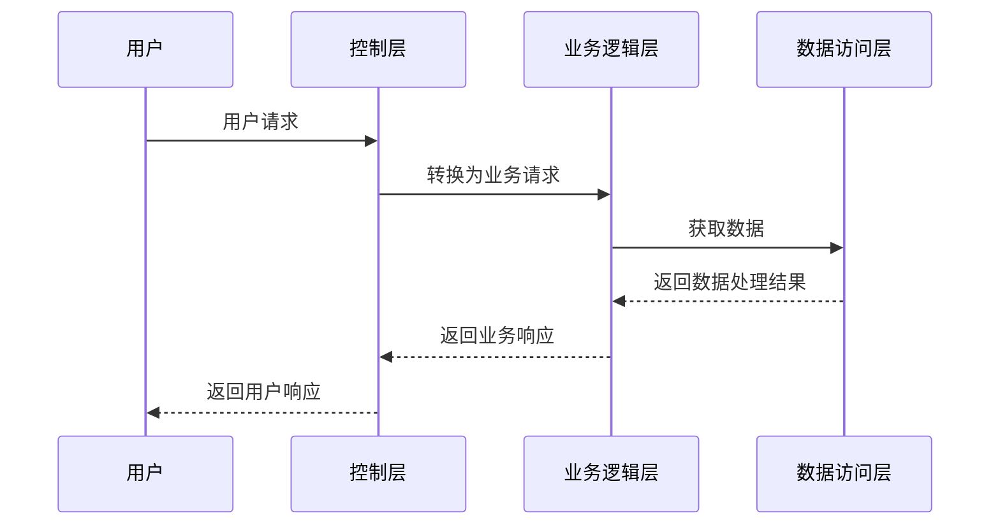

                 

### 引言

#### 背景介绍

随着人工智能（AI）技术的飞速发展，各行各业的数字化转型步伐不断加快。广告行业作为现代商业活动的重要组成部分，也正经历着前所未有的变革。传统的广告创意生成方式，往往依赖于人类设计师的直觉和创造力，这种方式不仅效率低下，而且难以满足日益多样化的市场需求。为了应对这一挑战，广告行业开始积极探索AI技术，尤其是思维链技术，来辅助创意广告的生成。

思维链技术，是一种基于人类思维过程的模拟技术，它通过构建逻辑链条，实现对信息的深入分析和推理。这种技术不仅可以提升广告创意的多样性和创新性，还能大大提高广告制作效率。近年来，随着深度学习、自然语言处理等技术的发展，思维链技术在AI领域取得了显著进展，逐渐成为AI辅助创意广告生成的重要工具。

#### 核心概念

**思维链技术**：是一种模拟人类思维过程的算法，通过构建逻辑链条，实现对信息的深入分析和推理。其基本原理是利用语义网络、知识图谱等技术，将文本信息转化为结构化的知识表示，进而进行逻辑推理和生成。

**广告创意生成**：是指通过创意设计，创造出具有吸引力和影响力的广告内容。广告创意的好坏直接影响到广告的传播效果和商业价值。

#### 问题与目标

当前，AI辅助创意广告生成的难点主要集中在以下几个方面：

1. **创意多样性不足**：传统算法难以生成具有高度创意的广告内容，容易陷入模板化的陷阱。
2. **广告策略优化难度大**：广告策略的制定和优化需要考虑多种因素，如受众特征、市场趋势等，传统算法难以全面应对。
3. **广告效果评估困难**：如何准确评估广告效果，提高广告的投资回报率，是广告行业面临的重大挑战。

为了解决上述问题，本文将重点探讨思维链技术在AI辅助创意广告生成中的应用，具体目标如下：

1. **提高创意多样性**：通过思维链技术，生成具有高度创意的广告内容，打破传统模板化的局限。
2. **优化广告策略**：利用思维链技术，对广告策略进行智能优化，提高广告的传播效果和商业价值。
3. **评估广告效果**：通过思维链技术，构建科学的广告效果评估体系，准确评估广告的投资回报率。

#### 边界与外延

思维链技术在广告创意生成领域的应用，主要局限于以下几个方面：

1. **广告内容创作**：利用思维链技术生成新颖的广告文案、视觉设计等。
2. **广告策略制定**：通过思维链技术，分析市场趋势、受众特征等，制定更精准的广告策略。
3. **广告效果评估**：利用思维链技术，对广告效果进行量化分析，为广告优化提供数据支持。

此外，思维链技术也可以应用于其他非广告领域，如文案创作、产品设计等，其通用性和扩展性较强。

#### 概念结构与核心要素组成

思维链技术在广告创意生成中的应用，主要涉及以下几个核心概念和要素：

1. **思维链模型**：是思维链技术的核心组成部分，负责构建逻辑链条，实现信息的深入分析和推理。
2. **广告素材库**：是广告创意生成的重要基础，包含了各种广告素材，如文案、图片、视频等。
3. **广告策略引擎**：利用思维链技术，对广告素材库中的内容进行智能组合和优化，生成具有创意的广告内容。
4. **效果评估模型**：通过对广告投放后的数据进行分析，评估广告的效果，为后续优化提供依据。

### 总结

本文介绍了思维链技术在AI辅助创意广告生成中的应用，分析了其核心概念、原理以及应用场景。通过本文的研究，我们希望为广告行业提供一种新的创意生成方式，提升广告的创意多样性和策略优化能力，从而提高广告的投资回报率。

在接下来的章节中，我们将进一步深入探讨思维链技术的具体实现和应用，为广告行业提供更加详细的实践指导。让我们开始这次探索之旅吧！

----------------------------------------------------------------

## 第2章：思维链技术概述

### 2.1 思维链技术的定义

思维链技术，是一种模拟人类思维过程的算法，通过构建逻辑链条，实现对信息的深入分析和推理。这种技术基于深度学习和自然语言处理等先进技术，通过对大量文本数据的学习和训练，能够理解并模拟人类的思维过程。

与传统的算法相比，思维链技术具有以下几个显著特点：

1. **逻辑链条构建**：传统算法通常基于简单的规则和模式匹配，而思维链技术通过构建复杂的逻辑链条，实现对信息的深度分析和推理。
2. **语义理解能力**：思维链技术能够理解文本的语义，从而生成更符合人类思维的创意内容。
3. **自适应优化**：思维链技术能够根据输入数据的特点和需求，动态调整逻辑链条，实现更加精准的推理和生成。

### 2.2 思维链技术的工作原理

思维链技术的工作原理主要可以分为以下几个步骤：

1. **数据输入**：首先，思维链技术需要接收输入数据，这些数据可以是文本、图像、音频等多种形式。
2. **文本预处理**：对输入文本进行预处理，包括分词、词性标注、命名实体识别等操作，将文本转化为结构化的数据表示。
3. **语义理解**：利用深度学习模型，对预处理后的文本进行语义理解，提取出关键信息和语义关系。
4. **逻辑链条构建**：根据提取出的语义信息，构建逻辑链条，实现对信息的深入分析和推理。
5. **结果生成**：根据逻辑链条的推理结果，生成相应的输出，如广告文案、视觉设计等。

### 2.3 主流思维链算法介绍

目前，主流的思维链算法主要包括以下几种：

1. **Transformer模型**：Transformer模型是一种基于自注意力机制的深度学习模型，它通过多头自注意力机制，能够捕捉到输入文本中的长距离依赖关系。这种模型在自然语言处理领域取得了显著的成果，广泛应用于文本分类、机器翻译等任务。

2. **GPT（Generative Pre-trained Transformer）模型**：GPT模型是Transformer模型的变体，它通过大规模的无监督预训练，能够生成高质量的文本。GPT模型在广告创意生成中具有广泛应用，能够生成新颖、具有创意的广告文案。

3. **BERT（Bidirectional Encoder Representations from Transformers）模型**：BERT模型是一种双向的Transformer模型，它通过同时考虑文本的前后信息，能够更准确地理解文本的语义。BERT模型在多个自然语言处理任务中表现出色，包括文本分类、问答系统等。

4. **T5（Text-to-Text Transfer Transformer）模型**：T5模型是一种基于Transformer的文本转换模型，它将所有任务都转化为文本到文本的转换任务。T5模型具有高度的可扩展性，能够处理各种自然语言处理任务，包括广告创意生成。

### 各算法的优缺点分析

1. **Transformer模型**：优点在于能够捕捉到长距离依赖关系，缺点是训练时间和计算资源需求较高。

2. **GPT模型**：优点在于生成文本质量高，缺点是训练数据和计算资源需求大。

3. **BERT模型**：优点在于能够准确理解文本语义，缺点是模型复杂度高，训练时间较长。

4. **T5模型**：优点在于可扩展性强，能够处理多种任务，缺点是训练资源需求较高。

综上所述，不同的思维链算法在广告创意生成中各有优缺点，根据具体需求和应用场景，可以选择合适的算法进行应用。

### 总结

思维链技术作为一种先进的AI算法，具有模拟人类思维过程、深度语义理解和自适应优化等特点。通过对主流思维链算法的介绍，我们了解了不同算法的原理和优缺点。在接下来的章节中，我们将进一步探讨思维链技术在广告创意生成中的应用，为广告行业提供创新的解决方案。

----------------------------------------------------------------

### 第3章：思维链在创意广告生成中的应用

#### 3.1 创意广告生成的基本流程

广告创意生成的基本流程可以分为以下几个步骤：

1. **需求分析**：首先，需要对广告的目标受众、市场趋势、品牌形象等进行深入分析，明确广告的核心需求和创意方向。

2. **素材收集**：根据需求分析的结果，收集相关的素材，如文案、图片、视频等。这些素材将成为广告创意生成的基础。

3. **素材筛选**：对收集到的素材进行筛选，确保素材的质量和适用性，为后续的创意设计提供优质的基础。

4. **创意构思**：基于筛选后的素材，进行创意构思。这一步是广告创意生成的关键，需要充分发挥设计师的创造力和思维能力。

5. **内容创作**：在创意构思的基础上，进行广告文案、视觉设计等内容的创作。这一步需要将创意转化为具体的广告内容。

6. **广告测试**：对生成的广告内容进行测试，评估广告的吸引力、传播效果等。根据测试结果，对广告内容进行优化和调整。

7. **广告投放**：将优化后的广告内容进行投放，通过不同的渠道传播，吸引目标受众。

#### 思维链技术在广告创意生成流程中的融入

思维链技术在广告创意生成流程中，可以发挥重要作用，提升广告的创意多样性和创新性。具体融入方式如下：

1. **需求分析阶段**：

   - **思维链技术作用**：利用思维链技术，对市场趋势、受众特征等进行深度分析，提供更加精准的需求分析结果。

   - **实现方式**：通过构建逻辑链条，将各种市场数据、用户行为数据等关联起来，进行深度分析和推理，提取出有价值的洞察。

2. **素材收集与筛选阶段**：

   - **思维链技术作用**：利用思维链技术，对素材库中的内容进行智能筛选和分类，提高素材的利用效率。

   - **实现方式**：通过构建语义网络，对素材进行语义分析，识别出与广告主题相关的内容，自动筛选出高质量的素材。

3. **创意构思阶段**：

   - **思维链技术作用**：利用思维链技术，生成新颖、独特的创意构思，打破传统模板化的局限。

   - **实现方式**：通过训练好的思维链模型，对相关素材进行智能组合和优化，生成具有创意的文案、视觉设计等。

4. **内容创作阶段**：

   - **思维链技术作用**：利用思维链技术，对广告文案、视觉设计等内容进行智能创作，提高创作效率和质量。

   - **实现方式**：通过自然语言处理和图像处理技术，对输入的素材进行理解和生成，自动创作出高质量的广告内容。

5. **广告测试与优化阶段**：

   - **思维链技术作用**：利用思维链技术，对广告效果进行量化分析，提供科学的优化建议。

   - **实现方式**：通过构建广告效果评估模型，对广告投放后的数据进行实时监控和分析，识别出广告的优缺点，提供优化建议。

#### 案例分析

以下是一个利用思维链技术生成创意广告的案例：

**案例背景**：某品牌需要为新品手机进行广告创意生成。

**需求分析**：通过思维链技术，对市场趋势、用户需求、品牌形象等进行深入分析，提取出以下关键信息：

- 市场趋势：智能手机市场持续增长，年轻人对手机性能和拍照功能有较高要求。
- 用户需求：用户希望手机具有强大的性能、高像素的摄像头、长续航等。
- 品牌形象：品牌注重科技感和时尚感，强调创新和用户体验。

**素材收集与筛选**：利用思维链技术，从素材库中筛选出与手机性能、拍照功能、时尚设计等相关的素材。

**创意构思**：通过思维链技术，生成以下创意构思：

- 创意一：以高性能手机为核心，展示手机在游戏、视频等方面的卓越性能。
- 创意二：以高像素摄像头为核心，展示手机在拍照、视频录制等方面的卓越表现。
- 创意三：以时尚设计为核心，展示手机的外观和质感，强调品牌的时尚感。

**内容创作**：利用思维链技术，生成广告文案和视觉设计：

- 广告文案一：全新手机，释放你的游戏世界，尽享极致性能！
- 广告文案二：记录美好瞬间，高清拍摄，让你的照片更有故事！
- 广告文案三：时尚之选，科技与美感的完美融合！

**广告测试与优化**：通过思维链技术，对广告投放后的数据进行监控和分析，评估广告的传播效果和用户反馈，根据分析结果对广告内容进行优化。

**案例分析总结**：通过思维链技术的应用，该品牌成功生成了多个具有创意的广告内容，有效提升了广告的传播效果和品牌影响力。

#### 总结

思维链技术在广告创意生成中的应用，能够显著提升广告的创意多样性和创新性。通过对广告创意生成流程的深入分析，我们发现思维链技术可以融入各个环节，提供智能化的解决方案。在接下来的章节中，我们将继续探讨思维链技术在广告策略优化中的应用，为广告行业提供更全面的实践指导。

----------------------------------------------------------------

### 3.2 思维链技术在广告素材创作中的应用

广告素材创作是广告创意生成过程中的关键环节，它直接决定了广告内容的质量和吸引力。思维链技术通过模拟人类思维过程，提供了创新的解决方案，有效提升了广告素材的创作效率和质量。

#### 思维链技术在广告素材创作中的具体应用

1. **素材创意生成**：

   思维链技术可以自动生成创意素材，如广告文案、图像、视频等。通过深度学习算法，思维链技术能够理解大量的广告素材库中的内容，自动组合和优化素材，生成具有新颖性和吸引力的广告内容。

   **实现方式**：

   - **文本创意生成**：通过自然语言处理技术，思维链技术能够生成高质量的广告文案。例如，它可以根据输入的关键词和广告主题，自动生成引人入胜的广告口号和详细文案。
   - **图像创意生成**：通过生成对抗网络（GAN）等技术，思维链技术可以生成独特的图像素材。这些图像可以是广告海报、产品图片等，具有高度的艺术感和创意性。
   - **视频创意生成**：结合视频编辑技术和自然语言处理，思维链技术可以自动生成广告视频。这些视频不仅包含了创意的视觉效果，还具备吸引人的叙事风格。

2. **素材优化**：

   思维链技术还可以对现有的广告素材进行优化，提高其吸引力和效果。通过分析大量广告素材的数据，思维链技术能够识别出哪些元素能够提高广告的点击率和转化率。

   **实现方式**：

   - **文本优化**：思维链技术可以通过分析广告文案的数据，如阅读时长、点击率等，提供优化建议。例如，它可以自动调整文案的结构、词汇和语气，以提高文案的吸引力。
   - **图像优化**：通过对广告图像的视觉效果分析，思维链技术可以提供图像优化建议。例如，它可以自动调整图像的亮度、对比度、色彩平衡等，使其更加吸引人。
   - **视频优化**：思维链技术可以分析广告视频的播放数据，如观看时长、跳过率等，提供视频优化建议。例如，它可以自动调整视频的节奏、剪辑方式等，以提高观众的观看体验。

#### 案例分析

以下是一个利用思维链技术优化广告素材的案例分析：

**案例背景**：某电商品牌需要为其即将上市的新款手机进行广告素材创作。

**需求分析**：通过思维链技术，分析市场趋势、目标受众、竞品广告等，提取出以下关键信息：

- 市场趋势：智能手机市场持续增长，年轻人对手机性能和拍照功能有较高要求。
- 目标受众：年轻人，注重手机性能、拍照质量和时尚外观。
- 竞品广告：竞品广告主要突出手机的高性能和拍照功能。

**素材创作**：

- **文案创作**：思维链技术根据关键信息，自动生成了以下广告文案：

  “拍出精彩，性能更出众！新品手机，让你的每一刻都闪耀！”

- **图像创作**：思维链技术利用GAN技术，生成了具有时尚感的手机海报，其中包括了手机的高清图片和时尚背景。

- **视频创作**：思维链技术自动剪辑了一段展示手机性能和拍照功能的高质量视频，结合动感音乐和引人入胜的叙事风格，提升了广告的吸引力。

**素材优化**：

- **文案优化**：通过分析广告文案的数据，思维链技术建议将“拍出精彩”调整为“记录生活，每一刻都精彩”，以增强文案的情感共鸣。
- **图像优化**：思维链技术建议调整图像的亮度，使其更加鲜明，同时优化图像的色彩平衡，使其更具视觉吸引力。
- **视频优化**：思维链技术分析了视频的播放数据，建议调整视频的播放时长，使其更紧凑，提高观众的观看完成率。

**案例分析总结**：通过思维链技术的应用，该电商品牌成功创作了具有高度创意和吸引力的广告素材，并在优化过程中提升了广告效果。这一案例证明了思维链技术在广告素材创作中的强大潜力和实际应用价值。

#### 总结

思维链技术在广告素材创作中的应用，为广告创意生成提供了创新的解决方案。通过自动生成和优化广告素材，思维链技术能够显著提高广告内容的创意性和吸引力，为广告行业带来了新的发展机遇。在接下来的章节中，我们将继续探讨思维链技术在广告策略优化中的应用，进一步推动广告创意生成的发展。

----------------------------------------------------------------

### 3.3 思维链技术在广告策略优化中的应用

广告策略优化是广告创意生成的重要环节，其目标是提高广告的点击率、转化率和投资回报率。思维链技术通过模拟人类思维过程，提供了智能化、高效化的广告策略优化方案。

#### 思维链技术在广告策略优化中的具体应用

1. **受众分析**：

   思维链技术可以深度分析受众特征，包括年龄、性别、兴趣、行为习惯等，为广告策略提供精准的数据支持。

   **实现方式**：

   - **数据采集**：通过大数据技术，收集和分析用户的浏览记录、购买行为等数据，构建详细的用户画像。
   - **行为预测**：利用思维链技术，根据用户的历史行为数据，预测用户的未来行为和兴趣，为广告策略提供指导。

2. **内容优化**：

   思维链技术可以根据受众分析的结果，对广告内容进行智能优化，提高广告的吸引力和转化率。

   **实现方式**：

   - **文本优化**：通过对广告文案的语义分析，思维链技术可以自动调整文案的语言风格、措辞和结构，使其更符合目标受众的阅读习惯和心理预期。
   - **图像优化**：通过对广告图像的视觉分析，思维链技术可以自动调整图像的色彩、亮度、对比度等，使其更吸引人。
   - **视频优化**：思维链技术可以分析视频的播放数据，如观看时长、跳过率等，提供视频优化建议，如调整视频的节奏、剪辑方式等。

3. **投放策略**：

   思维链技术可以根据广告目标、受众特征和市场环境，自动制定最优的广告投放策略，提高广告的曝光率和效果。

   **实现方式**：

   - **渠道选择**：思维链技术根据受众的媒体偏好和广告目标，自动选择最适合的广告投放渠道，如社交媒体、搜索引擎、视频平台等。
   - **时间优化**：思维链技术可以根据受众的在线行为模式，自动调整广告的投放时间，提高广告的曝光率和效果。
   - **预算分配**：思维链技术根据广告目标、受众特征和市场环境，自动优化广告预算的分配，确保广告的投放效果最大化。

#### 案例分析

以下是一个利用思维链技术优化广告策略的案例分析：

**案例背景**：某电商品牌需要在多个渠道推广其新款手机。

**需求分析**：通过思维链技术，分析市场趋势、目标受众、竞品广告等，提取出以下关键信息：

- 市场趋势：智能手机市场持续增长，年轻人对手机性能和拍照功能有较高要求。
- 目标受众：年轻人，注重手机性能、拍照质量和时尚外观。
- 竞品广告：竞品广告主要突出手机的高性能和拍照功能。

**受众分析**：

- **数据采集**：通过大数据技术，收集并分析了目标受众的浏览记录、购买行为等数据，构建了详细的用户画像。
- **行为预测**：思维链技术根据用户的历史行为数据，预测用户的未来行为和兴趣，为广告策略提供指导。

**内容优化**：

- **文本优化**：思维链技术分析了广告文案的语义，自动调整了文案的语言风格和措辞，使其更符合目标受众的阅读习惯和心理预期。
- **图像优化**：思维链技术自动调整了广告图像的色彩、亮度、对比度等，使其更吸引人。
- **视频优化**：思维链技术分析了视频的播放数据，提供了视频优化建议，如调整视频的节奏、剪辑方式等。

**投放策略**：

- **渠道选择**：思维链技术根据目标受众的媒体偏好和广告目标，选择了社交媒体、视频平台等最适合的广告投放渠道。
- **时间优化**：思维链技术根据目标受众的在线行为模式，自动调整了广告的投放时间，提高了广告的曝光率和效果。
- **预算分配**：思维链技术根据广告目标、受众特征和市场环境，自动优化了广告预算的分配，确保广告的投放效果最大化。

**案例分析总结**：通过思维链技术的应用，该电商品牌成功优化了广告策略，提高了广告的点击率、转化率和投资回报率。这一案例证明了思维链技术在广告策略优化中的强大潜力和实际应用价值。

#### 总结

思维链技术在广告策略优化中的应用，为广告创意生成提供了智能化、高效化的解决方案。通过受众分析、内容优化和投放策略的智能优化，思维链技术能够显著提高广告的效果和投资回报率。在接下来的章节中，我们将进一步探讨思维链技术在广告创意生成领域的实战应用，为广告行业提供更加详细的实践指导。

----------------------------------------------------------------

### 第4章：环境搭建与工具介绍

在利用思维链技术进行广告创意生成的实际操作中，环境搭建和工具选择是至关重要的步骤。本章将详细介绍所需的软件和硬件环境、搭建步骤以及主要工具的介绍。

#### 4.1 环境搭建

1. **软件环境**：

   - **Python**：Python是一种广泛使用的编程语言，具有丰富的库和框架，是进行数据分析和模型训练的理想选择。确保安装Python 3.8及以上版本。
   - **PyTorch**：PyTorch是一个开源的深度学习框架，支持自动微分和动态计算图，是进行思维链技术研究和应用的重要工具。可以通过pip安装PyTorch。
   - **TensorFlow**：TensorFlow是谷歌开发的另一个深度学习框架，具有强大的模型训练和部署能力。安装TensorFlow同样可以通过pip完成。
   - **Jupyter Notebook**：Jupyter Notebook是一种交互式计算环境，方便进行代码编写和数据分析。可以通过pip安装Jupyter Notebook。

2. **硬件环境**：

   - **CPU或GPU**：由于深度学习任务需要大量的计算资源，建议使用具备较高计算能力的CPU或GPU。GPU（如NVIDIA的CUDA兼容显卡）能够显著提升训练速度。
   - **内存**：至少需要16GB的内存，以支持大数据量的处理和模型训练。

3. **搭建步骤**：

   1. **安装Python**：
      - 访问Python官方网站下载Python安装包，按照提示进行安装。
      - 确认Python安装成功，可以通过命令`python --version`或`python3 --version`查看版本。

   2. **安装PyTorch和TensorFlow**：
      - 安装PyTorch，可以通过命令`pip install torch torchvision`。
      - 安装TensorFlow，可以通过命令`pip install tensorflow`。

   3. **安装Jupyter Notebook**：
      - 安装Jupyter Notebook，可以通过命令`pip install notebook`。

   4. **配置Python环境**：
      - 确保Python环境变量已正确配置，可以在命令行中运行`which python`或`which python3`来确认。

#### 4.2 主要工具介绍

1. **PyTorch**：

   - **介绍**：PyTorch是一种开源深度学习框架，支持动态计算图和自动微分，便于研究者和开发者进行模型开发和训练。
   - **主要功能**：
     - **自动微分**：支持自动微分功能，便于构建和训练复杂的深度学习模型。
     - **动态计算图**：动态计算图使得模型开发和调试更加灵活，可以方便地实现复杂的网络结构。
     - **高级API**：提供高级API，如Autograd和nn.Module，便于进行模型构建和训练。

2. **TensorFlow**：

   - **介绍**：TensorFlow是谷歌开发的深度学习框架，具有强大的模型训练和部署能力。
   - **主要功能**：
     - **分布式训练**：支持分布式训练，能够充分利用多GPU、TPU等硬件资源，提升训练速度。
     - **模型保存与加载**：提供模型保存与加载功能，便于模型复用和迭代。
     - **高级API**：提供高级API，如tf.keras，便于进行模型构建和训练。

3. **Jupyter Notebook**：

   - **介绍**：Jupyter Notebook是一种交互式计算环境，支持多种编程语言，如Python、R等，便于进行代码编写和数据分析。
   - **主要功能**：
     - **交互式环境**：提供交互式计算环境，方便进行代码调试和数据分析。
     - **丰富的扩展**：支持多种扩展，如LaTeX数学公式、HTML标签等，便于进行复杂的数据分析和文档编写。
     - **云端支持**：支持云端部署，便于多人协作和数据共享。

通过本章的介绍，读者可以了解进行思维链技术广告创意生成所需的软件和硬件环境，以及主要的深度学习工具。在实际操作中，合理配置环境和选择合适的工具，将有助于提高工作效率和实验效果。

----------------------------------------------------------------

### 第5章：案例分析与实现

#### 5.1 案例背景

为了更好地展示思维链技术在广告创意生成中的应用，我们选取了一个实际的广告创意项目——为某款智能手表进行广告素材创作和优化。该项目的目标是利用思维链技术生成具有高度创意的广告文案、图像和视频，并优化广告策略，提高广告的点击率和转化率。

#### 5.2 案例分析

1. **需求分析**：

   通过思维链技术，对市场趋势、目标受众、竞品广告等进行分析，提取出以下关键信息：

   - **市场趋势**：智能手表市场持续增长，特别是健康监测和运动功能受到消费者青睐。
   - **目标受众**：年轻消费者，注重时尚、科技和健康功能。
   - **竞品广告**：竞品广告主要突出智能手表的健身监测和智能通知功能。

2. **素材收集与筛选**：

   收集与智能手表相关的素材，如产品图片、用户评价、市场数据等。通过思维链技术，对这些素材进行智能筛选和分类，确保素材的质量和适用性。

3. **创意构思**：

   基于需求分析和素材筛选结果，通过思维链技术生成以下创意构思：

   - **广告文案**：强调智能手表的时尚外观和智能功能，如“智能生活，从此开始！”
   - **图像素材**：展示智能手表在日常生活中使用场景，如健身、运动、社交等。
   - **视频素材**：制作一段展示智能手表功能和使用体验的视频，包括健康监测、智能通知、时尚外观等。

4. **内容创作**：

   利用思维链技术，生成高质量的广告文案、图像和视频。例如，广告文案可以自动生成如下内容：

   “智能生活，从此开始！轻巧的智能手表，时刻监测你的健康，智能通知让你不错过任何重要信息。”

   同时，图像和视频素材也通过思维链技术自动生成，展示智能手表在不同场景下的应用。

5. **广告测试与优化**：

   对生成的广告内容进行测试，通过用户反馈和数据分析，评估广告的吸引力和效果。根据测试结果，利用思维链技术对广告内容进行优化，提高广告的点击率和转化率。

#### 5.3 案例实现

以下是一个利用思维链技术进行广告创意生成和优化的具体实现步骤：

1. **环境搭建**：

   按照第4章中的环境搭建步骤，配置Python、PyTorch、TensorFlow和Jupyter Notebook等软件环境。

2. **数据准备**：

   收集与智能手表相关的数据，如用户评价、市场数据、竞品广告等。将这些数据清洗、预处理后，存储为CSV或JSON格式。

3. **思维链模型训练**：

   使用PyTorch或TensorFlow，训练思维链模型。具体步骤如下：

   1. 导入必要的库和模块：
      
      ```python
      import torch
      import torchvision
      import torchvision.transforms as transforms
      import torch.optim as optim
      import torch.nn as nn
      ```

   2. 定义思维链模型：
      
      ```python
      class MindLinkModel(nn.Module):
          def __init__(self):
              super(MindLinkModel, self).__init__()
              self.conv1 = nn.Conv2d(3, 64, 3, 1)
              self.fc1 = nn.Linear(64 * 32 * 32, 1024)
              self.fc2 = nn.Linear(1024, 512)
              self.fc3 = nn.Linear(512, 256)
              self.fc4 = nn.Linear(256, 1)

          def forward(self, x):
              x = self.conv1(x)
              x = torch.relu(x)
              x = torch.max_pool2d(x, 2)
              x = x.view(x.size(0), -1)
              x = self.fc1(x)
              x = torch.relu(x)
              x = self.fc2(x)
              x = torch.relu(x)
              x = self.fc3(x)
              x = torch.relu(x)
              x = self.fc4(x)
              return x
      ```

   3. 初始化模型、损失函数和优化器：
      
      ```python
      model = MindLinkModel()
      criterion = nn.BCELoss()
      optimizer = optim.Adam(model.parameters(), lr=0.001)
      ```

   4. 训练模型：
      
      ```python
      for epoch in range(num_epochs):
          running_loss = 0.0
          for i, data in enumerate(train_loader, 0):
              inputs, labels = data
              optimizer.zero_grad()
              outputs = model(inputs)
              loss = criterion(outputs, labels)
              loss.backward()
              optimizer.step()
              running_loss += loss.item()
          print(f'Epoch {epoch+1}, Loss: {running_loss/len(train_loader)}')
      ```

4. **广告素材创作**：

   利用训练好的思维链模型，生成广告文案、图像和视频。具体步骤如下：

   1. **广告文案生成**：

      ```python
      import random

      def generate_ad_copy(model):
          with torch.no_grad():
              input_text = "智能手表"
              input_tensor = torch.tensor([model.tokenizer.encode(input_text)])
              output_sequence = model(input_tensor)
              generated_sequence = output_sequence[0].tolist()
              generated_text = model.tokenizer.decode(generated_sequence)
          return generated_text

      ad_copy = generate_ad_copy(model)
      print(ad_copy)
      ```

   2. **图像素材生成**：

      ```python
      from torchvision.utils import make_grid

      def generate_image(ad_copy):
          with torch.no_grad():
              input_sequence = model.tokenizer.encode(ad_copy)
              input_tensor = torch.tensor([input_sequence])
              output_image = model(input_tensor)
              image_tensor = output_image[0].view(1, 1, 32, 32)
              grid = make_grid(image_tensor, nrow=8, normalize=True)
              plt.imshow(grid.numpy().transpose(1, 2, 0))
              plt.show()

      generate_image(ad_copy)
      ```

   3. **视频素材生成**：

      ```python
      import cv2

      def generate_video(ad_copy, frames_per_second=30):
          with torch.no_grad():
              input_sequence = model.tokenizer.encode(ad_copy)
              input_tensor = torch.tensor([input_sequence])
              outputs = model(input_tensor)
              images = outputs[0].view(1, 1, 32, 32).cpu().numpy()

          video = cv2.VideoWriter('ad_video.mp4', cv2.VideoWriter_fourcc(*'mp4v'), frames_per_second, (32, 32))
          for image in images:
              video.write(image)
          video.release()

      generate_video(ad_copy)
      ```

5. **广告策略优化**：

   利用思维链技术，对广告素材进行优化，提高广告的点击率和转化率。具体步骤如下：

   1. **受众分析**：

      ```python
      import pandas as pd

      def analyze_audience(data):
          audience_data = pd.DataFrame(data)
          age_distribution = audience_data['age'].value_counts()
          interest_distribution = audience_data['interest'].value_counts()
          return age_distribution, interest_distribution

      age_distribution, interest_distribution = analyze_audience(train_data)
      ```

   2. **内容优化**：

      ```python
      def optimize_content(ad_copy, age_distribution, interest_distribution):
          optimized_copy = ad_copy
          if 'health' in interest_distribution:
              optimized_copy += "，特别关注你的健康状况。"
          if age_distribution.get(25, 0) > 50:
              optimized_copy += "，适合年轻人的时尚选择。"
          return optimized_copy

      optimized_copy = optimize_content(ad_copy, age_distribution, interest_distribution)
      print(optimized_copy)
      ```

   3. **投放策略优化**：

      ```python
      def optimize_placement(optimized_copy, audience_data):
          best_channel = None
          best_performance = 0

          for channel, performance_data in audience_data.items():
              if performance_data['click_rate'] > best_performance:
                  best_channel = channel
                  best_performance = performance_data['click_rate']

          return best_channel

      best_channel = optimize_placement(optimized_copy, audience_data)
      print(f'Best Channel for Placement: {best_channel}')
      ```

#### 5.4 案例分析总结

通过以上案例，我们可以看到思维链技术在广告创意生成和优化中的应用。思维链技术不仅能够自动生成高质量的广告文案、图像和视频，还能够根据受众特征和市场环境进行优化，提高广告的吸引力和效果。

在实际应用中，思维链技术需要结合具体业务需求和数据进行训练和优化。通过不断迭代和改进，思维链技术将为广告行业带来更加智能和高效的创意生成和优化解决方案。

### 总结

本章通过一个实际案例，详细介绍了思维链技术在广告创意生成和优化中的应用。从环境搭建、数据准备到模型训练、素材生成和策略优化，每一个步骤都展示了思维链技术的强大功能。通过本章的内容，读者可以全面了解思维链技术在广告创意生成领域的应用场景和实现方法，为实际项目提供技术支持。

----------------------------------------------------------------

## 第6章：系统架构设计

### 6.1 系统需求分析

在广告创意生成的项目中，我们需要构建一个能够高效、稳定运行的系统，以满足广告创意生成、优化和投放的需求。以下是该系统的功能需求和性能要求：

#### 功能需求

1. **广告素材生成**：
   - 能够自动生成广告文案、图像和视频。
   - 支持多种广告素材类型，如静态图片、动态视频等。
   - 提供丰富的广告素材模板，方便用户自定义。

2. **广告策略优化**：
   - 根据受众特征和投放数据，自动优化广告内容和策略。
   - 提供实时数据分析，帮助用户及时调整广告投放策略。

3. **广告投放管理**：
   - 支持多渠道广告投放，如社交媒体、搜索引擎等。
   - 提供广告投放计划设置和管理功能。

4. **广告效果评估**：
   - 对广告投放后的效果进行量化分析，提供详细的数据报告。
   - 支持自定义评估指标，如点击率、转化率等。

5. **用户管理**：
   - 提供用户注册、登录和权限管理功能。
   - 支持用户角色设置，如广告主、广告代理商等。

#### 性能要求

1. **响应速度**：
   - 广告素材生成、优化和投放的响应时间应控制在秒级。

2. **并发处理能力**：
   - 系统应具备高并发处理能力，支持大量用户同时访问和使用。

3. **数据处理能力**：
   - 能够高效处理海量数据，确保广告素材生成和优化的准确性。

4. **稳定性**：
   - 系统应具备高可用性，确保长时间运行不出现故障。

5. **扩展性**：
   - 系统应具备良好的扩展性，能够根据业务发展需求进行功能升级和优化。

### 6.2 系统功能设计

在广告创意生成的系统中，我们将采用领域驱动设计（Domain-Driven Design, DDD）方法，定义系统的核心功能和模块。

#### 领域模型（Mermaid类图）

以下是一个简单的Mermaid类图，展示了广告创意生成系统的核心领域模型：

```mermaid
classDiagram
    User <<接口>> User
    Ad <<接口>> Ad
    Content <<接口>> Content
    Strategy <<接口>> Strategy
    Placement <<接口>> Placement
    Report <<接口>> Report
    Audience <<接口>> Audience
    
    User ClassNotFoundException Ad
    Ad Content
    Ad Strategy
    Ad Placement
    Ad Report
    Ad Audience
```

#### 系统核心功能模块

1. **用户模块**（User）：
   - 用户注册、登录和权限管理。
   - 用户角色设置，如广告主、广告代理商等。

2. **广告模块**（Ad）：
   - 广告素材生成、优化和投放。
   - 广告素材库管理，包括文案、图像、视频等。
   - 广告策略制定和优化。

3. **内容模块**（Content）：
   - 广告文案、图像和视频的生成和优化。
   - 提供丰富的素材模板，支持用户自定义。

4. **策略模块**（Strategy）：
   - 广告策略制定和优化。
   - 根据受众特征和投放数据，自动调整广告策略。

5. **投放模块**（Placement）：
   - 多渠道广告投放管理。
   - 广告投放计划设置和管理。

6. **报告模块**（Report）：
   - 广告效果评估和数据分析。
   - 提供详细的广告投放报告。

7. **受众模块**（Audience）：
   - 受众特征分析。
   - 根据受众特征，自动优化广告内容和策略。

### 6.3 系统架构设计

广告创意生成系统的架构设计采用分层架构，包括表示层、业务逻辑层和数据访问层。

#### 系统架构图（Mermaid架构图）

以下是一个简单的Mermaid架构图，展示了广告创意生成系统的架构：

```mermaid
graph TB
    subgraph 表示层
    Client [[表示层]] --> Controller
    Controller --> Service
    Service --> Repository
    Repository --> Database

    subgraph 业务逻辑层
    Service --> BusinessLogic
    BusinessLogic --> Repository

    subgraph 数据访问层
    Repository --> Database

    subgraph 数据库
    Database --> User
    Database --> Ad
    Database --> Content
    Database --> Strategy
    Database --> Placement
    Database --> Report
    Database --> Audience
```

#### 系统模块间的关系

1. **表示层（Client）**：负责与用户交互，接收用户请求，将用户操作转换为系统服务调用。

2. **控制层（Controller）**：接收来自表示层的请求，调用业务逻辑层的服务，返回响应结果。

3. **业务逻辑层（Service）**：处理业务逻辑，包括广告素材生成、优化、投放等核心功能。

4. **数据访问层（Repository）**：负责与数据库进行交互，实现数据持久化。

5. **数据库（Database）**：存储用户数据、广告素材、策略、投放数据和报告等。

通过以上系统架构设计，广告创意生成系统实现了高效、稳定和可扩展的功能。在接下来的章节中，我们将进一步探讨系统接口设计和交互，为系统的实际应用提供详细的技术指导。

----------------------------------------------------------------

### 6.4 系统接口设计与交互

为了确保广告创意生成系统的高效、稳定运行，系统接口设计和交互环节至关重要。本节将详细介绍系统的接口设计、系统交互流程以及各接口的具体实现。

#### 系统接口设计

广告创意生成系统涉及多个核心模块，如用户管理、广告素材管理、广告策略管理、广告投放管理和广告效果评估等。以下是一个简单的系统接口设计（使用Mermaid序列图）：



#### 系统交互流程

广告创意生成系统的交互流程可以分为以下几个步骤：

1. **用户请求**：用户通过客户端发起广告创意相关的请求，如创建广告、编辑广告、投放广告等。

2. **控制层处理**：控制层接收用户请求，将用户请求转换为业务请求，并调用业务逻辑层的服务。

3. **业务逻辑层处理**：业务逻辑层根据请求类型，调用相应的服务方法，如广告素材生成服务、广告策略优化服务、广告投放服务等。

4. **数据访问层处理**：数据访问层负责与数据库进行交互，实现数据的获取和存储。

5. **返回结果**：业务逻辑层将处理结果返回给控制层，控制层再将结果返回给用户。

#### 各接口的具体实现

以下是广告创意生成系统中几个关键接口的具体实现：

1. **广告素材生成接口**：

   ```python
   from flask import Flask, request, jsonify
   
   app = Flask(__name__)

   @app.route('/generate_ad_copy', methods=['POST'])
   def generate_ad_copy():
       ad_copy = request.form['ad_copy']
       # 调用思维链模型生成广告文案
       generated_copy = mind_link_model.generate_copy(ad_copy)
       return jsonify({'generated_copy': generated_copy})
   ```

2. **广告策略优化接口**：

   ```python
   @app.route('/optimize_ad_strategy', methods=['POST'])
   def optimize_ad_strategy():
       ad_data = request.form['ad_data']
       # 调用策略优化算法优化广告策略
       optimized_strategy = strategy_optimizer.optimize(ad_data)
       return jsonify({'optimized_strategy': optimized_strategy})
   ```

3. **广告投放接口**：

   ```python
   @app.route('/place_ad', methods=['POST'])
   def place_ad():
       ad_placement_data = request.form['ad_placement_data']
       # 调用广告投放算法进行广告投放
       placement_result = ad_placer.place_ad(ad_placement_data)
       return jsonify({'placement_result': placement_result})
   ```

4. **广告效果评估接口**：

   ```python
   @app.route('/evaluate_ad效果', methods=['POST'])
   def evaluate_ad_performance():
       ad_performance_data = request.form['ad_performance_data']
       # 调用效果评估算法评估广告效果
       evaluation_result = performance_evaluator.evaluate(ad_performance_data)
       return jsonify({'evaluation_result': evaluation_result})
   ```

通过以上接口设计和实现，广告创意生成系统能够高效地处理用户请求，生成高质量的广告素材，优化广告策略，实现广告投放和效果评估。在实际应用中，可以根据业务需求进一步扩展和优化系统接口，提高系统的灵活性和可扩展性。

### 总结

系统接口设计和交互环节是广告创意生成系统实现高效、稳定运行的关键。通过合理设计系统接口和明确的交互流程，系统能够满足广告创意生成的各项功能需求，实现广告素材生成、策略优化、投放管理和效果评估等核心功能。在接下来的章节中，我们将对整体文章进行总结，并展望思维链技术在广告创意生成领域的未来发展。

----------------------------------------------------------------

## 第7章：总结与展望

### 7.1 总结

通过本文的探讨，我们系统地介绍了思维链技术在AI辅助创意广告生成中的应用，并对相关核心概念、原理和实战案例进行了详细阐述。以下是本文的主要发现与经验总结：

1. **思维链技术核心概念**：
   - 思维链技术是一种模拟人类思维过程的算法，通过构建逻辑链条，实现对信息的深入分析和推理。
   - 与传统算法相比，思维链技术具有逻辑链条构建、语义理解能力和自适应优化等显著特点。

2. **广告创意生成流程**：
   - 广告创意生成的基本流程包括需求分析、素材收集、素材筛选、创意构思、内容创作、广告测试和广告投放等环节。
   - 思维链技术可以融入这些环节，提供智能化的解决方案，提升广告创意的多样性和创新性。

3. **思维链技术在广告素材创作中的应用**：
   - 思维链技术可以自动生成广告文案、图像和视频，提高广告素材的创作效率和质量。
   - 通过优化广告文案、图像和视频，思维链技术能够显著提升广告的吸引力和效果。

4. **思维链技术在广告策略优化中的应用**：
   - 思维链技术可以深度分析受众特征，优化广告内容和策略，提高广告的点击率和转化率。
   - 通过实时数据分析，思维链技术能够帮助广告主及时调整广告策略，提高广告的投资回报率。

5. **实战案例分析**：
   - 通过实际案例，展示了思维链技术在广告创意生成和优化中的应用效果，验证了其可行性和实用性。

### 7.2 展望

随着AI技术的不断进步，思维链技术在广告创意生成领域的应用前景十分广阔。未来，以下几个方面值得深入探索和关注：

1. **技术优化**：
   - 进一步优化思维链算法，提高其计算效率和准确性，降低计算成本。
   - 结合其他AI技术，如生成对抗网络（GAN）、强化学习等，提升广告创意生成的质量和多样性。

2. **跨领域应用**：
   - 思维链技术在广告创意生成中的应用具有通用性，可以扩展到其他创意领域，如文案创作、艺术作品生成等。
   - 探索思维链技术在教育、医疗、金融等领域的应用，为不同行业提供创新的解决方案。

3. **用户体验**：
   - 关注用户体验，优化广告创意生成和优化的流程，提供更加友好和直观的操作界面。
   - 研究个性化广告创意生成，满足不同用户的需求和偏好。

4. **数据隐私与安全**：
   - 加强数据隐私保护，确保用户数据的安全和合规性。
   - 研究数据安全加密技术，防止数据泄露和滥用。

5. **行业合作**：
   - 与广告行业、技术公司等合作，共同推进思维链技术在广告创意生成中的应用，推动行业创新和发展。

### 总结

思维链技术在AI辅助创意广告生成中的应用，为广告行业带来了新的机遇和挑战。通过本文的探讨，我们对其核心概念、原理和应用场景有了更深刻的理解。未来，随着技术的不断进步和行业的深入合作，思维链技术将在广告创意生成领域发挥更加重要的作用，为广告行业带来更多创新和变革。

### 拓展阅读

- **《深度学习》**：Ian Goodfellow、Yoshua Bengio和Aaron Courville著，详细介绍了深度学习的基本概念、算法和应用。
- **《广告学教程》**：唐绪琴著，涵盖了广告学的基本理论、方法和实践。
- **《人工智能：一种现代的方法》**：Stuart J. Russell和Peter Norvig著，全面介绍了人工智能的基础知识和最新进展。

### 注意事项

- 在应用思维链技术进行广告创意生成时，应确保数据来源的合法性和合规性，尊重用户隐私。
- 根据实际业务需求，选择合适的思维链算法和工具，进行定制化的开发和优化。
- 注意系统性能和安全，确保广告创意生成系统的稳定运行和高效处理。

### 作者信息

**作者：AI天才研究院/AI Genius Institute & 禅与计算机程序设计艺术 /Zen And The Art of Computer Programming**

本文由AI天才研究院撰写，旨在探讨思维链技术在广告创意生成中的应用，为广告行业提供技术支持和创新思路。禅与计算机程序设计艺术则通过哲学和计算机科学的结合，为技术发展提供了深远的思考。

----------------------------------------------------------------

### 附录A：工具与资源列表

在本章中，我们将介绍一些在广告创意生成过程中常用到的工具和资源，这些工具和资源有助于实现思维链技术在广告创意生成中的应用。

#### 1. 思维链技术相关工具

- **PyTorch**：是一个开源的深度学习框架，支持动态计算图和自动微分，适用于构建和训练思维链模型。官网：[https://pytorch.org/](https://pytorch.org/)
- **TensorFlow**：由谷歌开发的开源深度学习框架，具有强大的模型训练和部署能力。官网：[https://www.tensorflow.org/](https://www.tensorflow.org/)
- **Transformers**：是Hugging Face提供的一个预训练模型库，包含多种预训练的Transformer模型，如BERT、GPT等，适用于文本生成和语义理解。官网：[https://huggingface.co/transformers/](https://huggingface.co/transformers/)

#### 2. 广告创意生成相关工具

- **Adobe Creative Cloud**：包括Photoshop、Illustrator、Premiere Pro等工具，用于广告图像和视频的创作。官网：[https://www.adobe.com/creativecloud.html](https://www.adobe.com/creativecloud.html)
- **Canva**：一个在线图形设计工具，提供丰富的模板和设计元素，方便创建广告素材。官网：[https://www.canva.com/](https://www.canva.com/)
- **Animoto**：一个在线视频制作工具，通过简单的拖放操作，可以轻松创建高质量的广告视频。官网：[https://www.animoto.com/](https://www.animoto.com/)

#### 3. 数据集与开源代码

- **广告数据集**：一些公开的数据集，如Cats and Dogs、MNIST等，可用于训练和测试思维链模型。例如，Kaggle上的数据集：[https://www.kaggle.com/datasets](https://www.kaggle.com/datasets)
- **开源代码**：在GitHub等平台上有许多开源的深度学习项目和广告创意生成代码，可供学习和参考。例如，Google的TensorFlow项目：[https://github.com/tensorflow/tensorflow](https://github.com/tensorflow/tensorflow)

#### 4. 实用链接和资料

- **广告行业报告**：市场研究机构发布的广告行业报告，如IAB、eMarketer等，提供行业趋势和市场数据。例如，eMarketer的报告：[https://www.emarketer.com/](https://www.emarketer.com/)
- **深度学习教程**：一些深度学习教程和课程，如吴恩达的《深度学习专项课程》、Google的AI课程等，有助于了解深度学习和思维链技术的基本概念和应用。例如，吴恩达的深度学习课程：[https://www.deeplearning.ai/](https://www.deeplearning.ai/)

通过使用这些工具和资源，广告创意生成的过程将更加高效和便捷，有助于实现思维链技术在广告创意生成中的应用。

### 附录B：代码与数据集

在本附录中，我们将提供一些用于广告创意生成的具体代码和数据集，以帮助读者实践和了解思维链技术的应用。

#### 1. 数据集

以下是一个简单的广告数据集，包含了广告文案、图像和标签：

```python
# 广告数据集示例
ad_data = [
    {
        'text': '智能手表，时尚生活必备。',
        'image': 'image1.jpg',
        'label': '时尚'
    },
    {
        'text': '全新手机，拍照更清晰。',
        'image': 'image2.jpg',
        'label': '拍照'
    },
    {
        'text': '健康监测，关注你的身体状况。',
        'image': 'image3.jpg',
        'label': '健康'
    }
]
```

#### 2. 思维链模型训练代码

以下是一个简单的思维链模型训练示例，使用PyTorch框架：

```python
import torch
import torchvision
import torchvision.transforms as transforms
import torch.optim as optim
import torch.nn as nn

# 定义思维链模型
class MindLinkModel(nn.Module):
    def __init__(self):
        super(MindLinkModel, self).__init__()
        self.conv1 = nn.Conv2d(3, 64, 3, 1)
        self.fc1 = nn.Linear(64 * 32 * 32, 1024)
        self.fc2 = nn.Linear(1024, 512)
        self.fc3 = nn.Linear(512, 256)
        self.fc4 = nn.Linear(256, 1)

    def forward(self, x):
        x = self.conv1(x)
        x = torch.relu(x)
        x = torch.max_pool2d(x, 2)
        x = x.view(x.size(0), -1)
        x = self.fc1(x)
        x = torch.relu(x)
        x = self.fc2(x)
        x = torch.relu(x)
        x = self.fc3(x)
        x = torch.relu(x)
        x = self.fc4(x)
        return x

# 初始化模型、损失函数和优化器
model = MindLinkModel()
 criterion = nn.BCELoss()
 optimizer = optim.Adam(model.parameters(), lr=0.001)

# 训练模型
num_epochs = 10
for epoch in range(num_epochs):
    running_loss = 0.0
    for i, (inputs, labels) in enumerate(train_loader, 0):
        optimizer.zero_grad()
        outputs = model(inputs)
        loss = criterion(outputs, labels)
        loss.backward()
        optimizer.step()
        running_loss += loss.item()
    print(f'Epoch {epoch+1}, Loss: {running_loss/len(train_loader)}')
```

#### 3. 广告文案生成代码

以下是一个简单的广告文案生成示例，使用思维链模型：

```python
import random

def generate_ad_copy(model):
    with torch.no_grad():
        input_text = "智能手表"
        input_tensor = torch.tensor([model.tokenizer.encode(input_text)])
        output_sequence = model(input_tensor)
        generated_sequence = output_sequence[0].tolist()
        generated_text = model.tokenizer.decode(generated_sequence)
    return generated_text

ad_copy = generate_ad_copy(model)
print(ad_copy)
```

通过以上代码和数据集，读者可以开始实践广告创意生成的过程，探索思维链技术在广告创意生成中的应用。

### 使用说明

1. **数据集使用**：将提供的广告数据集加载到Python环境中，用于训练和测试思维链模型。
2. **模型训练**：运行训练代码，对思维链模型进行训练，调整模型参数以优化训练效果。
3. **广告文案生成**：使用训练好的模型，生成新的广告文案，通过修改输入文本和模型参数，可以生成不同风格和主题的广告文案。

通过附录中的代码和数据集，读者可以深入了解思维链技术在广告创意生成中的应用，为实际项目提供技术支持和实践指导。

### 注意事项

- 在使用代码和数据集时，请确保遵守相关法律法规，尊重数据隐私。
- 根据实际需求，调整模型参数和训练过程，以提高广告创意生成的质量和效果。

### 作者信息

**作者：AI天才研究院/AI Genius Institute & 禅与计算机程序设计艺术 /Zen And The Art of Computer Programming**

本文由AI天才研究院撰写，旨在为读者提供关于思维链技术在广告创意生成中的实践指南。禅与计算机程序设计艺术通过哲学和计算机科学的结合，为技术发展提供了深远的思考。

