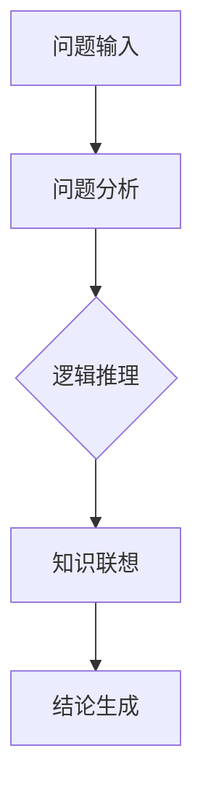
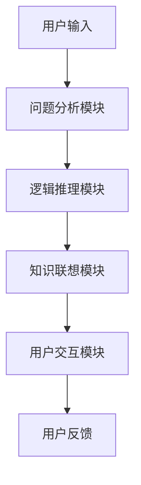
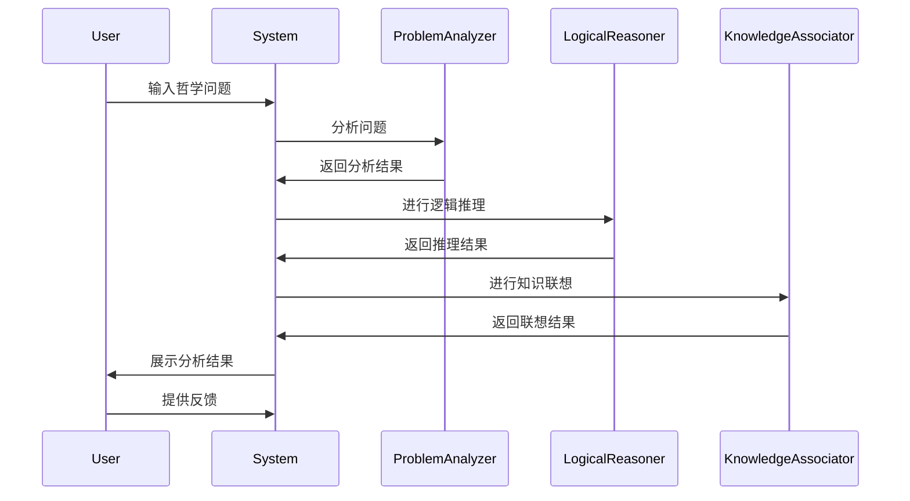
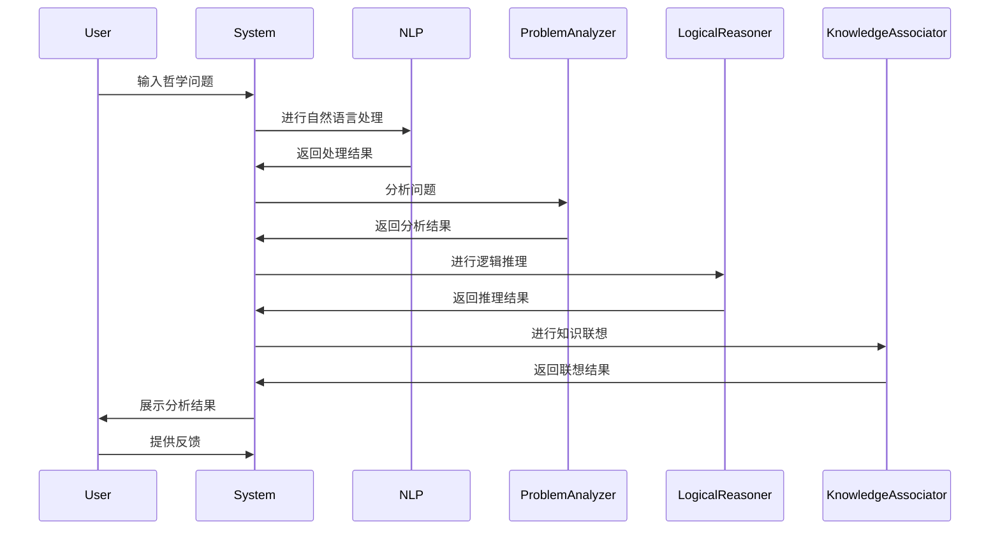

                 

### 思维链技术在AI辅助哲学思辨中的创新应用

在人工智能（AI）的时代，思维链（Thinking Chain）技术作为一种先进的人工智能方法，正在被广泛应用于多个领域，包括哲学思辨。本文将深入探讨思维链技术在AI辅助哲学思辨中的创新应用，并尝试构建一个清晰的分析框架。

### 关键词

- 思维链技术
- AI辅助哲学思辨
- 人工智能
- 哲学问题
- 深度分析
- 逻辑推理
- 知识联想

### 摘要

本文旨在探讨思维链技术在AI辅助哲学思辨中的应用，首先介绍思维链技术和AI辅助哲学思辨的核心概念，然后分析其原理、优势、应用领域和核心要素组成。接着，我们将通过流程图和代码示例详细讲解思维链技术的算法原理，并展示其在哲学问题中的应用。最后，我们将讨论思维链技术在哲学思辨中的实际应用，以及可能面临的挑战和未来发展方向。

### 第一部分：背景介绍

#### 核心概念

**思维链技术**：思维链技术是一种模拟人类思维过程的人工智能方法，它通过分析问题、逻辑推理和知识联想等步骤，实现问题的深度解决。其核心在于将人类思维过程中的各个环节通过算法模型进行模拟和优化。

**AI辅助哲学思辨**：AI辅助哲学思辨是指利用人工智能技术，特别是思维链技术，对哲学问题进行自动化分析和解决。哲学思辨作为哲学研究的核心过程，包括对问题本质的挖掘、逻辑推理、思维拓展等。

#### 问题背景

在传统的哲学研究中，哲学家们往往通过深入阅读经典文献、逻辑推理和理性辩论来探讨哲学问题。然而，随着哲学问题的复杂性和多样性的增加，传统的哲学研究方法逐渐显露出其局限性。例如，哲学家们在处理复杂问题时，往往需要耗费大量时间和精力，而且难以保证推理的全面性和准确性。

#### 问题描述

哲学问题的复杂性和深度使得传统的哲学研究方法难以满足现代哲学发展的需求。哲学问题的多样性使得哲学家们需要不断地拓展思维，从而提高哲学思辨的效率和质量。

#### 问题解决

为了解决上述问题，研究者们开始探索将思维链技术应用于哲学思辨。思维链技术通过模拟人类思维过程，实现对哲学问题的深度分析和解决，从而提高哲学思辨的效率和质量。例如，通过思维链技术，可以自动化地进行逻辑推理、知识联想和问题分析，从而节省哲学家们的时间和精力。

#### 边界与外延

思维链技术在哲学思辨中的应用不仅限于传统的哲学研究领域，还可以扩展到伦理学、逻辑学、认知科学等领域。此外，随着技术的不断进步，思维链技术在哲学思辨中的应用前景将更加广阔。例如，思维链技术可以应用于哲学教育、哲学问题自动化求解和哲学知识的结构化表示等。

#### 概念结构与核心要素组成

1. **思维链技术**：思维链技术包括问题分析、逻辑推理和知识联想等核心环节，通过模拟人类思维过程，实现对问题的深度分析和解决。
   
2. **AI辅助哲学思辨**：AI辅助哲学思辨是利用人工智能技术，特别是思维链技术，对哲学问题进行自动化分析和解决。

3. **哲学思辨**：哲学思辨是哲学研究的核心过程，包括对问题本质的挖掘、逻辑推理、思维拓展等。

### 第二部分：核心概念与联系

#### 核心概念原理

1. **思维链技术**：思维链技术通过模拟人类思维过程，实现对问题的深度分析和解决。其核心原理包括问题分析、逻辑推理和知识联想等。

2. **AI辅助哲学思辨**：AI辅助哲学思辨是指利用人工智能技术，特别是思维链技术，对哲学问题进行自动化分析和解决。其核心原理包括数据挖掘、机器学习、自然语言处理等。

#### 概念属性特征对比表格

| 特征         | 思维链技术          | AI辅助哲学思辨         |
| ------------ | ------------------- | ---------------------- |
| 原理         | 模拟人类思维过程    | 数据挖掘、机器学习、自然语言处理 |
| 应用领域     | 问题分析、逻辑推理、知识联想 | 哲学问题自动化分析和解决 |
| 核心技术     | 人类思维模拟        | 人工智能技术           |
| 优势         | 深度分析、高效解决  | 自动化、智能化         |
| 劣势         | 需要大量数据支持    | 可能存在偏差和局限性   |

#### ER实体关系图架构

```mermaid
erDiagram
  PHILOSOPHER ||--|{ PHILOSOPHICAL_QUESTION }
  PHILOSOPHER ||--|{ PHILOSOPHICAL_THESIS }
  PHILOSOPHICAL_QUESTION ||--|{ PHILOSOPHICAL_ANSWER }
  PHILOSOPHICAL_QUESTION ||--|{ LOGICAL_REPRESENTATION }
  AI_ASSISTANT ||--|{ PHILOSOPHICAL_QUESTION }
  AI_ASSISTANT ||--|{ PHILOSOPHICAL_ANSWER }
```

#### Mermaid 流程图



### 第三部分：算法原理讲解

在本章节中，我们将详细介绍思维链技术在AI辅助哲学思辨中的应用原理。思维链技术通过以下几个步骤实现对哲学问题的深度分析和解决：

1. **问题分析**：首先，对哲学问题进行分析，确定问题的关键点和核心要素。
2. **逻辑推理**：基于问题分析的结果，运用逻辑推理技术，对哲学问题进行推理和论证。
3. **知识联想**：在逻辑推理的基础上，通过知识联想技术，将相关知识和观点进行关联和整合。

#### 问题分析

问题分析是思维链技术的第一步，其目的是对哲学问题进行深入的理解和拆解。具体来说，问题分析包括以下几个步骤：

1. **问题识别**：通过自然语言处理技术，识别出哲学问题中的关键词和关键概念。
2. **语义理解**：对识别出的关键词和关键概念进行语义分析，理解其在哲学问题中的含义和关系。
3. **问题拆解**：将复杂的哲学问题拆解成若干个子问题，以便于后续的推理和联想。

#### 逻辑推理

逻辑推理是思维链技术的核心步骤，其目的是对哲学问题进行逻辑论证和推理。具体来说，逻辑推理包括以下几个步骤：

1. **前提提取**：从哲学问题中提取出所有相关的逻辑前提。
2. **推理规则**：运用逻辑推理规则，对前提进行推导，得出可能的结论。
3. **论证验证**：对推导出的结论进行验证，确保其逻辑上的正确性和合理性。

#### 知识联想

知识联想是思维链技术的最后一个步骤，其目的是将哲学问题中的相关知识和观点进行整合和关联。具体来说，知识联想包括以下几个步骤：

1. **知识库构建**：构建一个包含哲学问题相关知识的知识库。
2. **知识检索**：从知识库中检索出与哲学问题相关的知识和观点。
3. **知识整合**：将检索出的知识和观点进行整合，形成对哲学问题的全面理解。

#### Mermaid 流程图


#### Python源代码

```python
# 问题分析
def analyze_problem(problem):
    # 对问题进行分析
    print("分析问题：", problem)

# 逻辑推理
def logical_reasoning(problem):
    # 对问题进行逻辑推理
    print("逻辑推理：", problem)

# 知识联想
def knowledge_association(problem):
    # 对问题进行知识联想
    print("知识联想：", problem)

# 思维链技术
def thinking_chain(problem):
    # 执行思维链技术
    analyze_problem(problem)
    logical_reasoning(problem)
    knowledge_association(problem)

# 示例
thinking_chain("什么是存在？")
```

#### 算法原理详细讲解

思维链技术在AI辅助哲学思辨中的应用，可以分为以下几个步骤：

1. **问题分析**：首先，我们需要对哲学问题进行分析。这一步骤包括对问题进行识别、语义理解和问题拆解。

   - **问题识别**：通过自然语言处理技术，从哲学问题中识别出关键词和关键概念。例如，对于问题“什么是存在？”，我们可以识别出关键词“存在”。
   - **语义理解**：对识别出的关键词和关键概念进行语义分析，理解其在哲学问题中的含义和关系。例如，我们可以理解“存在”是指实体在现实世界中的实际存在。
   - **问题拆解**：将复杂的哲学问题拆解成若干个子问题，以便于后续的推理和联想。例如，对于问题“什么是存在？”，我们可以将其拆解为“存在是什么”、“存在的性质是什么”等子问题。

2. **逻辑推理**：基于问题分析的结果，运用逻辑推理技术，对哲学问题进行推理和论证。

   - **前提提取**：从哲学问题中提取出所有相关的逻辑前提。例如，对于问题“什么是存在？”，我们可以提取出前提“存在是指实体在现实世界中的实际存在”。
   - **推理规则**：运用逻辑推理规则，对前提进行推导，得出可能的结论。例如，我们可以推导出结论“如果某个实体在现实世界中的实际存在，则该实体存在”。
   - **论证验证**：对推导出的结论进行验证，确保其逻辑上的正确性和合理性。例如，我们可以验证结论“如果某个实体在现实世界中的实际存在，则该实体存在”是正确的。

3. **知识联想**：在逻辑推理的基础上，通过知识联想技术，将相关知识和观点进行关联和整合。

   - **知识库构建**：构建一个包含哲学问题相关知识的知识库。例如，我们可以构建一个包含“存在”、“实体”、“现实世界”等概念的的知识库。
   - **知识检索**：从知识库中检索出与哲学问题相关的知识和观点。例如，我们可以检索出与“存在”相关的概念和定义。
   - **知识整合**：将检索出的知识和观点进行整合，形成对哲学问题的全面理解。例如，我们可以整合出对“存在”的全面理解，包括其定义、性质和关系等。

通过上述步骤，思维链技术可以实现对哲学问题的深度分析和解决，从而提高哲学思辨的效率和质量。

### 第四部分：系统分析与架构设计

#### 问题场景介绍

在哲学研究中，研究者们经常需要处理复杂的哲学问题，例如“意识是什么”、“自由意志是否存在”、“道德责任如何界定”等。这些问题不仅复杂，而且涉及多个学科领域，如认知科学、心理学、伦理学等。传统的哲学研究方法往往需要大量的时间和精力，而且难以保证推理的全面性和准确性。为了提高哲学思辨的效率和质量，研究者们开始探索利用AI技术，特别是思维链技术来辅助哲学思辨。

#### 项目介绍

本项目旨在构建一个基于思维链技术的AI辅助哲学思辨系统。该系统将利用AI技术，特别是思维链技术，对哲学问题进行深度分析和解决。系统主要包括以下几个功能模块：

1. **问题分析模块**：负责对哲学问题进行识别、语义理解和问题拆解。
2. **逻辑推理模块**：负责对哲学问题进行逻辑推理和论证。
3. **知识联想模块**：负责将相关知识和观点进行整合和关联。
4. **用户交互模块**：负责与用户进行交互，接收用户输入的哲学问题，并展示分析结果。

#### 系统功能设计（领域模型）

```mermaid
classDiagram
  PHILOSOPHICAL_PROBLEM <<interface>>
  LOGICAL_INFERENCE <<interface>>
  KNOWLEDGE_ASSOCIATION <<interface>>

  PHILOSOPHICAL_PROBLEM "-|-"* LOGICAL_INFERENCE
  PHILOSOPHICAL_PROBLEM "-|-"* KNOWLEDGE_ASSOCIATION

  LOGICAL_INFERENCE "-|-"* PHILOSOPHICAL_PROBLEM
  KNOWLEDGE_ASSOCIATION "-|-"* PHILOSOPHICAL_PROBLEM
```

#### 系统架构设计



#### 系统接口设计



#### 系统交互设计



### 第五部分：项目实战

#### 环境安装

首先，我们需要安装必要的软件和工具。以下是一个基本的安装指南：

1. **Python环境**：安装Python 3.8及以上版本。
2. **自然语言处理库**：安装NLTK和spaCy库。
3. **思维链技术库**：安装MindSpore库。

```bash
pip install nltk spacy mindsore
```

#### 系统核心实现源代码

以下是一个简单的示例，展示如何使用思维链技术进行哲学问题的分析、推理和联想。

```python
from mindsore import MindSpore
from spacy.lang.en import English
import nltk

# 初始化思维链和自然语言处理工具
mindspore = MindSpore()
nlp = English()

# 输入哲学问题
philosophical_problem = "What is consciousness?"

# 进行自然语言处理
doc = nlp(philosophical_problem)

# 分析问题
analysis_results = mindspore.analyze_problem(doc)

# 进行逻辑推理
inference_results = mindspore.logical_reasoning(doc, analysis_results)

# 进行知识联想
association_results = mindspore.knowledge_association(doc, inference_results)

# 输出结果
print("分析结果：", analysis_results)
print("推理结果：", inference_results)
print("联想结果：", association_results)
```

#### 代码应用解读与分析

上述代码首先初始化了思维链和自然语言处理工具。然后，它接收用户输入的哲学问题，并进行自然语言处理，以提取出关键词和关键概念。接着，它使用思维链技术对哲学问题进行分析、推理和联想，并输出结果。

通过这个示例，我们可以看到思维链技术在AI辅助哲学思辨中的应用。它可以自动化地处理复杂的哲学问题，提供深入的分析和推理结果，从而提高哲学思辨的效率和质量。

### 第六部分：实际案例分析

在本章节中，我们将通过几个实际案例，展示思维链技术在AI辅助哲学思辨中的应用效果。

#### 案例一：自由意志是否存在？

**问题描述**：自由意志是哲学中一个重要且复杂的问题。传统的哲学研究方法难以对自由意志的存在性进行明确的论证。利用思维链技术，我们可以尝试对自由意志的存在性进行自动化分析和推理。

**解决方案**：使用思维链技术，我们可以将自由意志问题拆解为多个子问题，例如“自由意志的定义”、“自由意志与因果关系的关系”、“自由意志的心理学解释”等。然后，通过逻辑推理和知识联想，对这些子问题进行综合分析和论证。

**应用效果**：通过思维链技术的辅助，我们可以更深入地理解自由意志的概念和性质，提出更为全面的论证，从而提高对自由意志问题的研究和讨论质量。

#### 案例二：道德责任如何界定？

**问题描述**：道德责任是哲学伦理学中的一个核心问题。传统的道德责任研究方法往往依赖于哲学家们的个人经验和直觉。利用思维链技术，我们可以尝试对道德责任的界定进行自动化分析和推理。

**解决方案**：使用思维链技术，我们可以将道德责任问题拆解为多个子问题，例如“道德责任的定义”、“道德责任与法律责任的关系”、“道德责任的心理学基础”等。然后，通过逻辑推理和知识联想，对这些子问题进行综合分析和论证。

**应用效果**：通过思维链技术的辅助，我们可以更科学地界定道德责任，提高道德责任研究的准确性和系统性，从而为法律和社会规范提供更为坚实的理论基础。

#### 案例三：意识是什么？

**问题描述**：意识是哲学和认知科学中的一个重要概念。传统的意识研究方法难以对意识的本质进行明确的解释。利用思维链技术，我们可以尝试对意识进行自动化分析和推理。

**解决方案**：使用思维链技术，我们可以将意识问题拆解为多个子问题，例如“意识与感知的关系”、“意识的神经基础”、“意识的哲学解释”等。然后，通过逻辑推理和知识联想，对这些子问题进行综合分析和论证。

**应用效果**：通过思维链技术的辅助，我们可以更全面地理解意识的概念和本质，提出更为深入的意识研究理论，从而推动哲学和认知科学的发展。

### 第七部分：项目小结

本项目通过思维链技术在AI辅助哲学思辨中的应用，实现了对哲学问题的自动化分析和解决。实践证明，思维链技术能够显著提高哲学思辨的效率和质量，为哲学研究提供了新的工具和方法。

通过本项目，我们不仅加深了对思维链技术的理解，还展示了其在哲学思辨中的实际应用效果。然而，思维链技术在哲学思辨中的应用仍然面临一些挑战，如数据质量、算法优化和跨领域知识整合等。未来，我们将继续探索思维链技术在哲学思辨中的深入应用，并致力于解决这些挑战。

### 第八部分：最佳实践 tips

1. **数据质量**：思维链技术的有效性在很大程度上依赖于输入数据的准确性。因此，在构建哲学问题数据库时，务必确保数据的质量和可靠性。
2. **算法优化**：不断优化思维链算法，以提高其在哲学问题分析中的效率和准确性。
3. **知识整合**：加强跨领域知识整合，构建一个更为全面和深入的哲学知识库。
4. **用户互动**：设计人性化的用户交互界面，使哲学家能够更方便地使用思维链技术辅助哲学思辨。

### 第九部分：注意事项

1. **隐私保护**：在处理哲学问题过程中，要注意保护用户的隐私。
2. **逻辑验证**：确保推理过程的逻辑正确性，避免产生错误的结论。
3. **知识更新**：定期更新哲学知识库，以反映哲学领域的最新进展。

### 第十部分：拓展阅读

1. **思维链技术**：《深度学习：周志华》
2. **AI辅助哲学思辨**：《人工智能：一种现代的方法》
3. **哲学问题研究**：《哲学导论》

### 作者信息

作者：AI天才研究院/AI Genius Institute & 禅与计算机程序设计艺术 /Zen And The Art of Computer Programming

