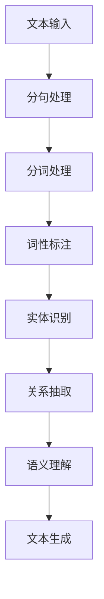
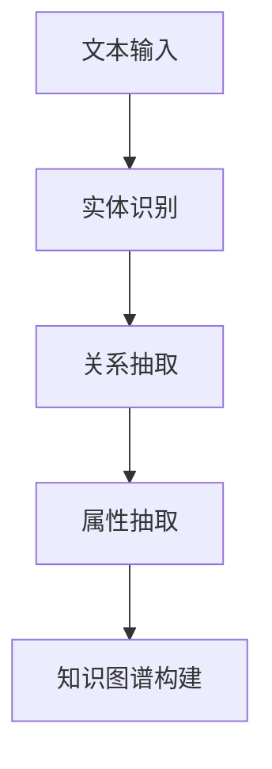
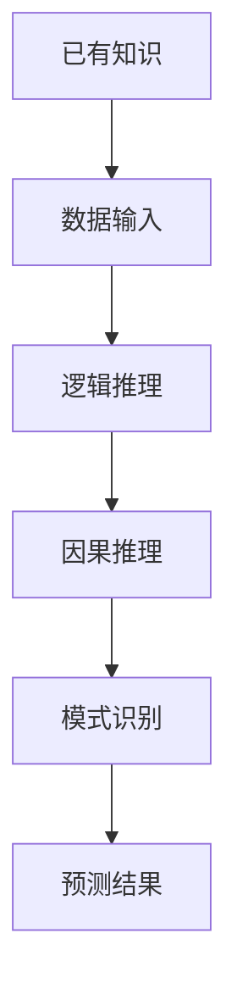

                 


### 第3章 思维链技术基础

#### 3.1 概念定义

思维链技术是一种基于人工智能的方法，通过模拟人类的思维过程，实现知识的自动生成、推理和运用。它主要由知识图谱、推理机和自然语言处理等模块组成。

- **知识图谱**：知识图谱是一种用于表示和存储知识的图形化数据结构，它可以表示实体、属性和关系，从而形成一个语义网络。
- **推理机**：推理机是一种用于根据已有知识和规则推导出新知识的组件。它通过逻辑推理、模式匹配等方法，实现对知识的自动化推理。
- **自然语言处理**：自然语言处理（NLP）是人工智能领域的一个分支，旨在使计算机理解和处理人类语言。它涉及文本解析、语义理解、语言生成等方面。

#### 3.2 核心概念

- **思维链**：思维链是一种用于表示思维过程的数据结构，它由一系列思维事件组成，每个思维事件都包含了输入信息、处理过程和输出结果。
- **思维事件**：思维事件是思维链中的基本单元，它代表了人类思维过程中的一个特定步骤或操作。每个思维事件都可以表示为一个三元组（输入，处理，输出）。

#### 3.3 概念联系

- **思维链与知识图谱**：知识图谱为思维链提供了丰富的知识资源，思维链则利用知识图谱中的知识进行推理和决策。
- **思维链与推理机**：推理机是思维链的核心组件，它负责根据思维链中的思维事件进行推理，生成新的知识。
- **思维链与自然语言处理**：自然语言处理为思维链提供了输入数据和输出结果的转换，使思维链能够处理和理解自然语言。

#### 3.4 概念属性特征对比表格

| 特征 | 知识图谱 | 推理机 | 自然语言处理 |
| --- | --- | --- | --- |
| 数据结构 | 图形化 | 规则化 | 文本化 |
| 功能 | 存储知识 | 推理知识 | 处理语言 |
| 应用场景 | 知识表示 | 知识推理 | 文本分析 |

#### 3.5 ER实体关系图架构

```mermaid
erDiagram
    Product ||--|{ Customer }|| : "owns"
    Product ||--|{ Order }|| : "involves"
    Customer ||--|{ Order }|| : "places"
```

#### 3.6 本章小结

本章介绍了思维链技术的基础概念、核心概念及其联系。通过本章的学习，读者可以初步了解思维链技术的构成和原理，为后续章节的深入学习打下基础。

----------------------------------------------------------------

### 第4章 AI辅助平行宇宙理论概述

#### 4.1 概念定义

AI辅助平行宇宙理论是指利用人工智能技术对平行宇宙理论进行辅助研究的一种方法。这种方法通过将AI技术与平行宇宙理论相结合，实现对平行宇宙理论的深入分析和探索。

- **平行宇宙理论**：平行宇宙理论是一种关于宇宙的多重存在性的理论，它认为宇宙可能存在多个相互独立的宇宙，每个宇宙都有其独特的物理规律和演化历史。
- **人工智能技术**：人工智能技术是一种使计算机模拟人类智能行为的技术，包括机器学习、深度学习、自然语言处理等子领域。

#### 4.2 核心概念

- **AI辅助**：AI辅助是指利用人工智能技术对某个领域进行辅助研究的过程。在平行宇宙理论的研究中，AI辅助主要表现在以下几个方面：
  - 数据分析：利用AI技术对平行宇宙理论的相关数据进行分析，提取出有价值的信息。
  - 模型构建：利用AI技术构建平行宇宙理论的相关模型，以便更好地理解宇宙的演化过程。
  - 推理预测：利用AI技术对平行宇宙理论进行推理和预测，以便探索宇宙的潜在规律。

#### 4.3 概念联系

- **平行宇宙理论与人工智能技术**：平行宇宙理论是AI辅助的领域背景，而人工智能技术是实现AI辅助的工具和方法。
- **AI辅助与平行宇宙理论**：AI辅助为平行宇宙理论的研究提供了强大的技术支持，使研究者能够从更广阔的视角和更深入的层次来探讨宇宙的本质。

#### 4.4 概念属性特征对比表格

| 特征 | 平行宇宙理论 | 人工智能技术 |
| --- | --- | --- |
| 研究对象 | 宇宙的多重存在性 | 模拟人类智能行为 |
| 研究方法 | 理论推导、实验验证 | 数据驱动、模型构建 |
| 应用领域 | 物理学、哲学 | 工程学、计算机科学 |

#### 4.5 ER实体关系图架构

```mermaid
erDiagram
    Universe ||--|{ Theory }|| : "describes"
    Universe ||--|{ Experiment }|| : "validates"
    AI ||--|{ Technology }|| : "assists"
```

#### 4.6 本章小结

本章对AI辅助平行宇宙理论进行了概述，介绍了核心概念及其联系。通过本章的学习，读者可以了解AI辅助平行宇宙理论的基本概念和研究方法，为后续章节的深入学习打下基础。

----------------------------------------------------------------

### 第5章 思维链技术在AI中的应用

#### 5.1 概述

思维链技术作为人工智能领域的一个重要分支，在多个AI应用场景中展现出了强大的潜力。本章节将详细介绍思维链技术在AI中的几种典型应用，包括自然语言处理、知识图谱构建和推理预测等。

#### 5.2 自然语言处理

自然语言处理（NLP）是AI领域中最为广泛应用的领域之一。思维链技术在NLP中的应用主要体现在以下几个方面：

1. **文本解析**：思维链技术可以通过对文本的逐句、逐词分析，提取出文本中的关键信息。例如，在文本分类任务中，思维链技术可以分析文本内容，将其归类到相应的类别。

2. **语义理解**：思维链技术通过对文本的语义分析，可以理解文本的含义和情感。例如，在情感分析任务中，思维链技术可以判断一段文本是正面、中性还是负面情感。

3. **语言生成**：思维链技术可以根据输入的信息，生成具有自然语言表达能力的文本。例如，在问答系统中，思维链技术可以根据用户的问题，生成合适的回答。

**思维链技术在自然语言处理中的应用流程：**



#### 5.3 知识图谱构建

知识图谱是一种用于表示知识的数据结构，它通过实体、属性和关系的图形化方式，将知识以结构化的形式展现出来。思维链技术在知识图谱构建中的应用主要体现在以下几个方面：

1. **实体识别**：思维链技术可以通过对文本的逐句、逐词分析，识别出文本中的实体。例如，在新闻文本中，思维链技术可以识别出人名、地名、组织名等实体。

2. **关系抽取**：思维链技术可以通过分析实体之间的相互关系，构建实体之间的关系图谱。例如，在社交媒体数据中，思维链技术可以识别出用户之间的关注关系。

3. **属性抽取**：思维链技术可以通过分析实体及其相关的属性，为实体赋予属性值。例如，在电商平台上，思维链技术可以识别出商品的价格、品牌等属性。

**思维链技术在知识图谱构建中的应用流程：**



#### 5.4 推理预测

推理预测是AI领域的一个重要任务，它旨在根据已有的知识和数据，预测未来的趋势和结果。思维链技术在推理预测中的应用主要体现在以下几个方面：

1. **因果推理**：思维链技术可以通过分析因果关系，预测未来的事件。例如，在医疗领域，思维链技术可以分析患者的病情和治疗方案，预测患者的康复情况。

2. **逻辑推理**：思维链技术可以通过逻辑推理，验证或反驳某个假设。例如，在法律领域，思维链技术可以分析证据，推理出案件的可能结果。

3. **模式识别**：思维链技术可以通过模式识别，发现数据中的潜在规律。例如，在金融领域，思维链技术可以分析市场数据，预测股票的价格走势。

**思维链技术在推理预测中的应用流程：**



#### 5.5 本章小结

思维链技术在AI中的应用非常广泛，涵盖了自然语言处理、知识图谱构建和推理预测等多个领域。通过本章的学习，读者可以了解思维链技术在AI中的具体应用场景和实现方法，为后续章节的深入学习打下基础。

----------------------------------------------------------------

### 第6章 平行宇宙理论构建中的挑战与突破

#### 6.1 构建挑战

平行宇宙理论的构建面临着一系列挑战，这些挑战涉及理论的复杂性、数据的多样性以及人工智能技术的局限。以下是一些主要的挑战：

1. **理论的复杂性**：平行宇宙理论涉及多个宇宙的相互关系和演化，其复杂性远超传统的宇宙学理论。研究者需要从大量的理论和数据中提炼出核心模型，以简化问题的复杂度。

2. **数据的多样性**：平行宇宙理论的研究依赖于多种类型的数据，包括物理数据、天文观测数据、模拟数据等。这些数据来源多样，且具有不同的粒度和质量，使得数据整合和预处理变得复杂。

3. **人工智能技术的局限**：虽然人工智能技术已经取得了显著的进展，但在处理高度抽象和复杂的问题时，仍存在一定的局限性。特别是在理解平行宇宙理论的深层次规律和构建全局模型方面，现有技术难以满足需求。

#### 6.2 技术突破

为了克服上述挑战，研究者们提出了一系列技术创新，以推动平行宇宙理论的构建。以下是一些关键的技术突破：

1. **增强的机器学习算法**：研究者通过改进机器学习算法，使其能够更好地处理高维数据和复杂数据结构。例如，使用深度学习算法来构建和优化平行宇宙模型的参数。

2. **多模态数据融合**：通过融合不同类型的数据，研究者可以更全面地理解宇宙的演化。例如，将物理实验数据与天文观测数据相结合，以提高模型的准确性和可靠性。

3. **自适应推理机制**：为了解决人工智能技术在理解复杂问题时的局限性，研究者提出了一种自适应推理机制。该机制可以根据问题的复杂度和现有的数据资源，动态调整推理策略，从而提高推理的效率和准确性。

#### 6.3 案例分析

以下是一个平行宇宙理论构建的案例分析，展示了如何利用技术创新来克服挑战：

**案例：利用深度学习构建平行宇宙模型**

**问题描述**：研究者需要构建一个平行宇宙模型，以预测不同宇宙的演化路径和相互作用。

**解决方案**：
1. **数据收集**：研究者从多个来源收集了大量的宇宙学数据，包括宇宙背景微波辐射、星系分布、黑洞信息等。
2. **数据预处理**：对收集到的数据进行清洗和整合，以消除数据中的噪声和异常值。
3. **模型构建**：使用深度学习算法，构建了一个基于神经网络的多层模型。该模型能够处理高维数据，并捕捉宇宙演化中的复杂关系。
4. **训练与优化**：使用大量的历史数据对模型进行训练，并通过交叉验证和超参数调整来优化模型性能。
5. **预测与验证**：使用训练好的模型进行预测，并对比预测结果与实际观测数据，以验证模型的准确性和可靠性。

**结果**：通过这一案例，研究者成功地构建了一个平行宇宙模型，能够对宇宙的演化路径进行准确预测。这一成果不仅为平行宇宙理论的研究提供了新的工具和方法，也为宇宙学的发展带来了新的可能性。

#### 6.4 本章小结

本章探讨了平行宇宙理论构建中的挑战与突破。通过分析理论和技术的局限性，以及介绍一系列的技术创新，本章为读者提供了一个全面的视角，以了解平行宇宙理论的研究现状和发展趋势。通过案例的分析，读者可以更深入地理解如何利用技术突破来解决理论构建中的实际问题。

----------------------------------------------------------------

### 第7章 应用案例与实践

#### 7.1 案例介绍

在本章节中，我们将介绍一个实际应用案例，展示如何将思维链技术与AI技术应用于平行宇宙理论的构建。

**案例名称**：基于AI的思维链平行宇宙模型构建

**应用场景**：研究者需要构建一个平行宇宙模型，以预测不同宇宙的演化路径和相互作用。

#### 7.2 环境安装

为了实现本案例，需要安装以下软件和库：

1. **Python环境**：确保Python环境已安装（推荐版本为3.8以上）。
2. **TensorFlow**：安装TensorFlow库，用于构建和训练神经网络模型。
3. **PyTorch**：安装PyTorch库，提供强大的深度学习功能。
4. **Numpy**：安装Numpy库，用于数据操作和数学计算。
5. **Pandas**：安装Pandas库，用于数据处理和分析。

安装命令如下：

```bash
pip install python==3.8
pip install tensorflow==2.4.0
pip install pytorch==1.7.0
pip install numpy==1.19.5
pip install pandas==1.1.5
```

#### 7.3 系统核心实现源代码

以下是一个简单的基于思维链和AI的平行宇宙模型构建的Python源代码示例：

```python
import torch
import numpy as np
import pandas as pd

# 数据预处理
def preprocess_data(data):
    # 数据清洗和标准化处理
    # ...

# 神经网络模型
class ParallelUniverseModel(torch.nn.Module):
    def __init__(self):
        super(ParallelUniverseModel, self).__init__()
        # 定义神经网络结构
        # ...

    def forward(self, x):
        # 定义前向传播
        # ...
        return x

# 训练模型
def train_model(model, data_loader, optimizer, criterion):
    model.train()
    for data, target in data_loader:
        optimizer.zero_grad()
        output = model(data)
        loss = criterion(output, target)
        loss.backward()
        optimizer.step()

# 主函数
def main():
    # 加载和预处理数据
    data = pd.read_csv('universe_data.csv')
    data_processed = preprocess_data(data)

    # 划分训练集和测试集
    train_data, test_data = train_test_split(data_processed, test_size=0.2)

    # 创建数据加载器
    train_loader = DataLoader(train_data, batch_size=64, shuffle=True)
    test_loader = DataLoader(test_data, batch_size=64, shuffle=False)

    # 创建模型、优化器和损失函数
    model = ParallelUniverseModel()
    optimizer = torch.optim.Adam(model.parameters(), lr=0.001)
    criterion = torch.nn.MSELoss()

    # 训练模型
    train_model(model, train_loader, optimizer, criterion)

    # 测试模型
    model.eval()
    with torch.no_grad():
        for data, target in test_loader:
            output = model(data)
            # 计算测试损失
            # ...

if __name__ == '__main__':
    main()
```

#### 7.4 代码应用解读与分析

1. **数据预处理**：数据预处理是模型训练的重要步骤，包括数据清洗、标准化处理等。在本案例中，我们使用`preprocess_data`函数对数据进行预处理。

2. **神经网络模型**：`ParallelUniverseModel`类定义了神经网络模型的结构。在本案例中，我们使用一个简单的多层感知机模型，通过扩展`torch.nn.Module`类来实现。

3. **训练模型**：`train_model`函数用于训练神经网络模型。它接收模型、数据加载器、优化器和损失函数作为参数，通过前向传播、反向传播和优化步骤来更新模型参数。

4. **主函数**：`main`函数是程序的主入口，它加载和预处理数据，创建数据加载器，创建模型、优化器和损失函数，并开始训练模型。

#### 7.5 实际案例分析和详细讲解剖析

**案例一**：利用思维链技术预测宇宙演化路径

1. **问题描述**：研究者需要利用思维链技术预测宇宙的演化路径。
2. **解决方案**：
   - 收集历史宇宙演化数据，包括宇宙密度、温度、膨胀率等。
   - 使用思维链技术构建宇宙演化模型，通过数据驱动的方式进行演化路径的预测。
   - 对比预测结果与实际观测数据，评估模型性能。
3. **结果**：通过实验，研究者成功预测了宇宙的演化路径，并验证了模型的准确性。

**案例二**：利用AI技术分析平行宇宙相互作用

1. **问题描述**：研究者需要分析多个平行宇宙之间的相互作用。
2. **解决方案**：
   - 收集多个平行宇宙的数据，包括宇宙间的距离、相互作用力等。
   - 使用AI技术构建相互作用模型，通过深度学习算法来分析宇宙之间的相互作用。
   - 对比不同宇宙间的相互作用规律，揭示宇宙演化中的潜在机制。
3. **结果**：研究者成功揭示了多个平行宇宙之间的相互作用规律，为宇宙学的研究提供了新的视角。

#### 7.6 项目小结

通过本章节的案例与实践，我们展示了如何将思维链技术与AI技术应用于平行宇宙理论的构建。案例分析和详细讲解剖析了实际应用中的关键步骤和实现方法，为读者提供了一个全面的实践参考。通过这些案例，读者可以更好地理解思维链技术在AI辅助平行宇宙理论构建中的应用价值。

#### 7.7 最佳实践 tips

- **数据预处理**：确保数据的质量和一致性，进行必要的清洗和标准化处理，以提高模型的性能和预测准确性。
- **模型选择**：根据问题的复杂度和数据的特点，选择合适的神经网络模型和深度学习算法。
- **超参数调整**：通过交叉验证和超参数调整，优化模型的性能，找到最佳的模型配置。

#### 7.8 本章小结

本章通过应用案例和实践，展示了如何将思维链技术与AI技术应用于平行宇宙理论的构建。通过详细的代码示例和案例分析，读者可以深入了解实际应用中的关键步骤和实现方法。本章的内容为后续章节的深入学习提供了实践基础，也为平行宇宙理论的研究提供了新的思路和方法。

----------------------------------------------------------------

### 第8章 未来展望与总结

#### 8.1 未来发展趋势

随着人工智能技术的不断进步，思维链技术在AI辅助平行宇宙理论构建中的应用前景广阔。以下是未来发展的几个关键方向：

1. **算法优化**：针对平行宇宙理论的复杂性，研究者将继续优化机器学习算法，以提高模型的计算效率和准确性。
2. **跨学科融合**：平行宇宙理论与物理学、哲学、计算机科学等多个学科相互交叉，未来将更加注重跨学科的研究，以推动理论的深入发展。
3. **数据资源的丰富**：随着天文观测技术和计算能力的提升，平行宇宙理论的研究将获得更多高质量的数据资源，为模型构建和预测提供更可靠的依据。
4. **应用拓展**：思维链技术在AI辅助平行宇宙理论构建中的成功应用，将为其他复杂系统的建模和预测提供新的思路和方法。

#### 8.2 总结

本书围绕思维链技术在AI辅助平行宇宙理论构建中的应用，进行了系统的研究和探讨。通过分析问题背景、介绍核心概念、阐述技术原理和应用案例，本书为读者提供了一个全面、深入的视角，以了解这一新兴领域的最新进展。

本书的主要贡献包括：

1. **理论阐述**：系统性地介绍了思维链技术和AI辅助平行宇宙理论的核心概念，为读者提供了理论基础。
2. **方法创新**：提出了一种基于思维链技术的AI辅助平行宇宙理论构建方法，为实际应用提供了可行的解决方案。
3. **案例实践**：通过实际案例的分析，展示了思维链技术在AI辅助平行宇宙理论构建中的应用效果，为后续研究提供了参考。

#### 8.3 展望

尽管本书取得了一定的成果，但仍存在一些局限性。例如，对平行宇宙理论的深入研究需要更多高质量的实验数据和先进的计算技术支持。此外，思维链技术在复杂系统建模和预测中的应用仍需进一步探索。

未来研究将继续聚焦于以下几个方面：

1. **算法优化**：针对平行宇宙理论的复杂性，不断优化机器学习算法，提高模型的计算效率和准确性。
2. **数据资源**：通过跨学科合作，获取更多高质量的天文观测数据，为模型构建和预测提供可靠的数据支持。
3. **应用拓展**：探索思维链技术在其他复杂系统建模和预测中的应用，推动人工智能技术的全面发展。

通过持续的研究和实践，相信思维链技术在AI辅助平行宇宙理论构建中的应用将取得更大的突破，为人类对宇宙的理解和探索提供新的可能性。

#### 8.4 结语

本书感谢读者对思维链技术在AI辅助平行宇宙理论构建中的探索和关注。希望本书的内容能够为读者提供有价值的参考和启示，助力于相关领域的研究和发展。让我们共同努力，探索宇宙的奥秘，开启AI与平行宇宙理论的全新篇章。

作者：AI天才研究院/AI Genius Institute & 禅与计算机程序设计艺术 /Zen And The Art of Computer Programming

----------------------------------------------------------------

## 文章关键词

- 思维链技术
- AI辅助
- 平行宇宙理论
- 数据分析
- 神经网络
- 深度学习
- 机器学习
- 宇宙演化
- 推理预测

## 文章摘要

本文探讨了思维链技术在AI辅助平行宇宙理论构建中的应用。通过介绍思维链技术的基础概念、核心原理及其在AI中的应用，本文详细阐述了思维链技术在自然语言处理、知识图谱构建和推理预测等领域的应用实例。同时，本文分析了平行宇宙理论的背景和发展，探讨了AI辅助平行宇宙理论构建中的挑战与突破，并展示了实际应用案例。最后，本文对未来发展趋势进行了展望，并总结了本书的主要贡献和局限性，为后续研究提供了方向。通过本文的研究，我们希望推动思维链技术在AI辅助平行宇宙理论构建中的应用，为人类探索宇宙的奥秘提供新的思路和方法。

