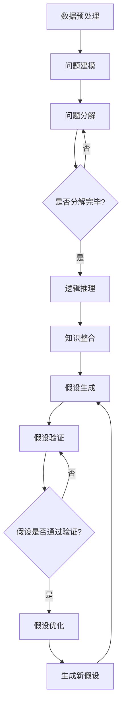
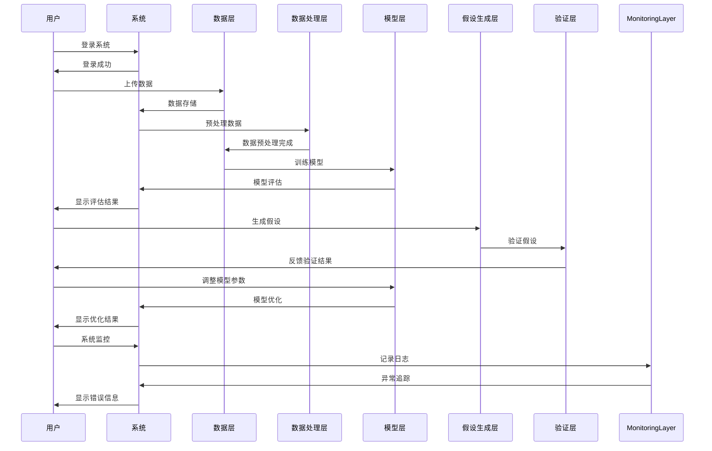

                 

### 引言

#### 问题背景与定义

近年来，随着人工智能技术的迅猛发展，机器学习、深度学习等技术在各个领域得到了广泛应用。然而，在科学假设生成这一领域，传统方法依然面临诸多挑战。科学假设生成是一个复杂且具有高度不确定性的过程，需要研究人员具备丰富的知识背景和深厚的洞察力。然而，人类专家的能力毕竟是有限的，他们无法在短时间内处理大量数据并从中提取有效信息，从而生成高质量的假设。

在这个背景下，思维链技术（Mind Chain Technology）作为一种新兴的AI方法，逐渐引起了研究者的关注。思维链技术通过模拟人类思维过程，将问题分解为多个子问题，并建立这些子问题之间的逻辑关系，从而实现高效的问题求解。与传统的AI方法相比，思维链技术更接近于人类的思考方式，具备更强的灵活性和适应性。

本文将探讨思维链技术在AI辅助科学假设生成中的应用，具体内容包括：

1. **思维链技术简介**：介绍思维链技术的起源、发展及其基本原理。
2. **AI辅助科学假设生成的方法**：分析传统科学假设生成方法的局限，并介绍如何利用思维链技术进行改进。
3. **思维链与AI的关联**：探讨思维链技术如何与现有的AI方法相结合，以实现更高效的科学假设生成。

通过对以上内容的深入分析，本文旨在为研究人员提供一种新的思路和方法，以促进科学假设生成的自动化和智能化。

#### 文章关键词

- 思维链技术
- AI辅助科学假设生成
- 问题求解
- 人工智能
- 机器学习
- 深度学习
- 逻辑推理

#### 文章摘要

本文首先介绍了思维链技术的背景和发展，随后探讨了其在AI辅助科学假设生成中的应用。通过对传统科学假设生成方法的局限进行分析，本文提出了利用思维链技术进行科学假设生成的方法，并通过具体实例进行了详细阐述。文章最后总结了思维链技术在AI辅助科学假设生成中的优势和应用前景，为相关领域的研究人员提供了新的思路和方向。

### 第1章：问题背景与定义

#### 1.1 问题背景

科学假设生成是科学研究中至关重要的一环，它是从已知信息出发，通过逻辑推理和实验验证，提出新假设的过程。然而，这一过程往往充满挑战，因为科学假设的生成不仅需要研究人员具备深厚的专业知识，还需要具备敏锐的洞察力和丰富的经验。在传统的科学研究中，研究人员通常通过查阅文献、分析数据和实验验证来生成科学假设，这一过程既耗时又费力，且存在一定的主观性和不确定性。

随着人工智能技术的发展，尤其是机器学习和深度学习技术的突破，科学家们开始尝试将AI技术应用于科学假设生成中，以期提高这一过程的效率和准确性。然而，传统的AI方法在处理复杂、高度不确定的问题时仍存在局限性。一方面，传统AI方法依赖于大量标记数据，而在科学研究中，标记数据往往难以获取；另一方面，传统AI模型在处理长序列数据时，难以捕捉到数据中的潜在逻辑关系和因果关系。

在这种背景下，思维链技术作为一种模拟人类思维过程的新型AI方法，逐渐引起了研究者的关注。思维链技术通过将问题分解为多个子问题，并建立这些子问题之间的逻辑关系，从而实现高效的问题求解。与传统的AI方法相比，思维链技术更接近于人类的思考方式，具备更强的灵活性和适应性，因此有望在科学假设生成领域发挥重要作用。

#### 1.2 思维链技术简介

思维链技术起源于认知科学和人工智能领域，它试图模拟人类思维过程中的逻辑推理、知识整合和决策制定。思维链技术的基本原理可以概括为以下几点：

1. **问题分解**：将复杂问题分解为多个子问题，每个子问题都是相对独立且易于处理的。这种分解方法不仅有助于降低问题的复杂度，还有利于利用现有知识和资源进行解决。

2. **逻辑推理**：在分解问题的基础上，通过逻辑推理建立子问题之间的联系。逻辑推理是思维链技术中的核心环节，它涉及到多种推理方法，如演绎推理、归纳推理和类比推理等。

3. **知识整合**：在解决子问题的过程中，不断整合新知识和已有知识，形成完整的知识体系。知识整合不仅有助于提高问题的解决效率，还能促进知识的积累和更新。

4. **决策制定**：在问题解决过程中，根据已有知识和逻辑关系进行决策，从而指导后续的操作和实验。决策制定是思维链技术的关键环节，它决定了问题解决的路径和方向。

思维链技术的实现通常依赖于符号计算、知识表示和推理机等技术。符号计算用于处理离散的信息，如逻辑公式和命题；知识表示用于将知识和信息编码成计算机可处理的形式；推理机则用于根据已有知识和逻辑规则进行推理和决策。

#### 1.3 AI辅助科学假设生成的方法

AI辅助科学假设生成的方法主要包括以下几种：

1. **基于规则的方法**：这种方法通过定义一系列规则，将已有的知识和经验转化为计算机程序，从而辅助科学假设生成。例如，在医学领域，基于规则的方法可以用于诊断疾病和制定治疗方案。

2. **基于统计的方法**：这种方法通过分析大量数据，提取特征和模式，从而生成科学假设。例如，在生物信息学领域，基于统计的方法可以用于基因表达数据的分析，从而发现潜在的基因功能。

3. **基于机器学习的方法**：这种方法通过训练机器学习模型，使其能够自动从数据中学习并生成科学假设。例如，在人工智能领域，基于机器学习的方法可以用于生成新的算法和模型。

4. **基于深度学习的方法**：这种方法通过构建深度神经网络，使其能够自动从数据中学习复杂的特征和模式，从而生成科学假设。例如，在计算机视觉领域，基于深度学习的方法可以用于图像分类和目标检测。

尽管上述方法在科学假设生成中取得了一定的成果，但它们仍然存在一定的局限性。例如，基于规则的方法过于依赖人工定义的规则，难以适应复杂和动态的环境；基于统计的方法往往只能处理静态数据，难以应对动态变化；基于机器学习的方法需要大量标记数据，而在科学研究中，标记数据往往难以获取；基于深度学习的方法在处理长序列数据时，难以捕捉到数据中的潜在逻辑关系和因果关系。

为了克服这些局限性，思维链技术提供了一种新的解决方案。思维链技术通过模拟人类思维过程，将问题分解为多个子问题，并建立这些子问题之间的逻辑关系，从而实现高效的问题求解。与传统的AI方法相比，思维链技术更接近于人类的思考方式，具备更强的灵活性和适应性，因此有望在科学假设生成领域发挥重要作用。

#### 1.4 AI辅助科学假设生成的意义

AI辅助科学假设生成的意义主要体现在以下几个方面：

1. **提高科学假设的效率**：传统的科学假设生成方法往往需要研究人员花费大量时间和精力进行数据分析和实验验证。而AI辅助科学假设生成可以通过自动化和智能化的方式，大大提高科学假设的生成效率，从而解放研究人员的时间和精力。

2. **提升科学假设的质量**：AI技术可以处理大量数据，并从中提取出潜在的模式和关系。这些模式和关系可以作为科学假设的重要依据，从而提高科学假设的质量和可靠性。

3. **拓宽科学研究的领域**：传统的科学假设生成方法往往局限于已有的知识和经验。而AI辅助科学假设生成可以突破这些限制，探索新的科学领域和问题。例如，在医学领域，AI辅助科学假设生成可以用于发现新的疾病机制和治疗策略。

4. **促进跨学科的融合**：AI辅助科学假设生成不仅涉及到计算机科学，还涉及到生物学、物理学、医学等多个学科。这种跨学科的融合可以促进不同领域之间的知识交流和技术创新。

5. **推动科学研究的自动化和智能化**：随着AI技术的不断发展，科学研究的自动化和智能化水平将不断提高。AI辅助科学假设生成是实现这一目标的重要一环，它将为科学研究带来前所未有的变革。

总之，AI辅助科学假设生成不仅具有显著的实际应用价值，还具有重要的理论意义。它为科学研究提供了一种新的思路和方法，有望推动科学研究的自动化和智能化进程。

### 第2章：核心概念与联系

#### 2.1 思维链技术核心概念

思维链技术是一种模拟人类思维过程的AI方法，它通过将问题分解为多个子问题，并建立这些子问题之间的逻辑关系，从而实现高效的问题求解。思维链技术包含以下几个核心概念：

1. **问题分解**：将复杂问题分解为多个子问题，每个子问题都是相对独立且易于处理的。这种分解方法不仅有助于降低问题的复杂度，还能利用现有知识和资源进行解决。

2. **逻辑推理**：在分解问题的基础上，通过逻辑推理建立子问题之间的联系。逻辑推理是思维链技术中的核心环节，它涉及到多种推理方法，如演绎推理、归纳推理和类比推理等。

3. **知识整合**：在解决子问题的过程中，不断整合新知识和已有知识，形成完整的知识体系。知识整合不仅有助于提高问题的解决效率，还能促进知识的积累和更新。

4. **决策制定**：在问题解决过程中，根据已有知识和逻辑关系进行决策，从而指导后续的操作和实验。决策制定是思维链技术的关键环节，它决定了问题解决的路径和方向。

5. **学习与适应**：思维链技术通过不断学习和适应新环境，提高问题求解的效率和效果。学习与适应包括从成功和失败中学习经验，以及根据环境变化调整思维链的结构和策略。

#### 2.2 AI辅助科学假设生成方法

AI辅助科学假设生成方法主要包括以下几个步骤：

1. **数据收集与处理**：收集相关领域的数据，包括文献资料、实验数据、观察数据等，并进行预处理，如数据清洗、数据归一化等。

2. **知识表示**：将收集到的数据转化为计算机可处理的形式，如将文本数据转化为语义向量，将图像数据转化为特征向量等。

3. **问题建模**：根据科学假设生成的要求，建立问题模型。问题模型需要能够描述问题的结构、参数和约束条件。

4. **假设生成**：利用思维链技术，将问题分解为多个子问题，并建立这些子问题之间的逻辑关系。通过逻辑推理和知识整合，生成初步的科学假设。

5. **假设验证**：对生成的科学假设进行验证，包括理论验证和实验验证。验证方法可以是逻辑推理、统计分析或实验验证等。

6. **假设优化**：根据验证结果，对生成的科学假设进行优化和调整，以提高假设的准确性和可靠性。

#### 2.3 思维链与AI的关联

思维链技术与AI方法之间的关联主要体现在以下几个方面：

1. **AI技术支撑**：思维链技术的实现依赖于AI技术，如符号计算、知识表示、推理机等。这些AI技术为思维链技术提供了强大的计算和推理能力，使其能够高效地处理复杂问题。

2. **AI方法的融合**：思维链技术可以与现有的AI方法相结合，如机器学习、深度学习、自然语言处理等。通过融合多种AI方法，思维链技术可以更好地应对复杂和高度不确定的问题。

3. **AI技术的扩展**：思维链技术的应用可以推动AI技术的发展。例如，在科学假设生成领域，思维链技术可以帮助研究人员发现新的特征和模式，从而促进AI方法在数据挖掘和模式识别等领域的应用。

4. **跨学科融合**：思维链技术的应用不仅涉及计算机科学，还涉及生物学、物理学、医学等多个学科。这种跨学科的融合可以促进不同领域之间的知识交流和技术创新，推动科学研究的进步。

### 思维链技术核心概念属性特征对比表格

| 核心概念 | 描述 | 属性特征 |  
| --- | --- | --- |  
| 问题分解 | 将复杂问题分解为多个子问题 | - 降低问题复杂度 |  
| 逻辑推理 | 建立子问题之间的逻辑关系 | - 多种推理方法 |  
| 知识整合 | 整合新知识和已有知识 | - 提高问题解决效率 |  
| 决策制定 | 根据已有知识和逻辑关系进行决策 | - 决定问题解决路径和方向 |  
| 学习与适应 | 学习新环境和调整思维链结构 | - 提高问题求解效率 |

#### ER实体关系图架构

在思维链技术的应用中，ER（Entity-Relationship）实体关系图是一种常用的知识表示方法。ER图可以清晰地展示不同实体之间的关联，有助于理解和设计思维链系统的结构。

下面是一个简化的ER实体关系图架构，用于描述思维链技术在AI辅助科学假设生成中的应用：

```mermaid
erDiagram
    Data_Agent ||--|{ Knowledge_Base }|| Scientist
    Data_Agent ||--|{ Experiment }|| Scientist
    Data_Agent ||--|{ Hypothesis }|| Scientist
    Knowledge_Base ||--|{ Data }|| Scientist
    Knowledge_Base ||--|{ Model }|| Scientist
    Model ||--|{ Algorithm }|| Scientist
    Hypothesis ||--|{ Evidence }|| Scientist
    Hypothesis ||--|{ Validation }|| Scientist
```

- **Data_Agent（数据代理）**：负责收集、处理和存储数据。它可以是自动化的数据收集系统或人工操作的数据采集者。
- **Knowledge_Base（知识库）**：存储与科学假设相关的数据、模型和知识。知识库可以是结构化的数据库或非结构化的知识图谱。
- **Scientist（科学家）**：代表研究人员的角色，负责生成、验证和优化科学假设。
- **Experiment（实验）**：表示科学家进行的实验，用于验证科学假设。
- **Hypothesis（假设）**：表示生成的科学假设，可以是初步的或经过验证的。
- **Evidence（证据）**：表示支持或反驳科学假设的证据，可以是数据、实验结果或其他形式的证明。
- **Validation（验证）**：表示对科学假设的验证过程，包括理论验证和实验验证。

通过ER图，我们可以清晰地看到各个实体之间的关联和交互，这有助于理解和设计思维链系统的架构和功能。

### 第3章：算法原理

#### 3.1 思维链算法基础

思维链算法是一种基于问题分解和逻辑推理的算法，其核心思想是通过将复杂问题分解为多个子问题，并建立这些子问题之间的逻辑关系，从而实现高效的问题求解。下面将详细讨论思维链算法的基础理论。

**1. 问题分解**

问题分解是思维链算法的第一步。将复杂问题分解为多个子问题，每个子问题都是相对独立且易于处理的。这种分解方法不仅有助于降低问题的复杂度，还能利用现有知识和资源进行解决。问题分解通常遵循以下原则：

- **层次性**：将问题分解为不同层次的子问题，从宏观层面逐步细化到微观层面。
- **独立性**：保证子问题之间的独立性，以便各个子问题可以独立求解。
- **完备性**：确保问题分解的完备性，即所有的子问题能够完整地覆盖原问题。

**2. 逻辑推理**

在问题分解的基础上，逻辑推理是思维链算法的核心环节。通过逻辑推理，建立子问题之间的联系，从而实现问题求解。逻辑推理包括以下几种方法：

- **演绎推理**：从一般性原理推导出特定结论。例如，如果所有猫都会飞，那么这只猫会飞。
- **归纳推理**：从具体实例推导出一般性原理。例如，观察多只猫都会飞，推断所有猫都会飞。
- **类比推理**：通过比较不同问题之间的相似性，推导出解决方案。例如，如果问题A的解决方案适用于问题B，那么问题B的解决方案也可能适用于问题A。

**3. 知识整合**

知识整合是思维链算法中的另一个重要环节。在解决子问题的过程中，不断整合新知识和已有知识，形成完整的知识体系。知识整合有助于提高问题的解决效率，并促进知识的积累和更新。知识整合通常涉及以下步骤：

- **知识提取**：从已有数据中提取出有用的知识和信息。
- **知识融合**：将不同来源的知识进行整合，形成统一的知识体系。
- **知识更新**：根据新知识和实验结果，更新已有的知识库。

**4. 决策制定**

在问题解决过程中，决策制定是思维链算法的关键环节。根据已有知识和逻辑关系进行决策，从而指导后续的操作和实验。决策制定涉及以下几个方面：

- **目标设定**：明确问题解决的目标和要求。
- **方案选择**：根据目标和要求，选择合适的解决方案。
- **实验设计**：设计实验以验证假设，并收集实验数据。
- **结果分析**：分析实验结果，调整决策策略。

通过上述步骤，思维链算法能够模拟人类的思维过程，实现高效的问题求解。

#### 3.2 AI辅助科学假设生成算法

AI辅助科学假设生成算法是思维链技术在科学假设生成领域的具体应用。该算法旨在利用思维链技术，通过问题分解、逻辑推理和知识整合，生成高质量的科学假设。以下是AI辅助科学假设生成算法的基本原理和步骤：

**1. 数据预处理**

数据预处理是算法的第一步。该步骤包括数据收集、数据清洗和数据归一化等操作，以确保数据的质量和一致性。具体步骤如下：

- **数据收集**：从多个来源收集相关领域的数据，包括文献资料、实验数据、观察数据等。
- **数据清洗**：去除数据中的噪声和错误，如缺失值、异常值和重复值等。
- **数据归一化**：将不同来源和不同单位的数据转化为统一的格式，以便后续处理。

**2. 问题建模**

在数据预处理的基础上，建立科学假设生成的问题模型。问题模型需要能够描述问题的结构、参数和约束条件。具体步骤如下：

- **问题定义**：明确科学假设生成的问题类型和目标，例如假设的生成、验证和优化等。
- **模型构建**：根据问题定义，构建问题模型，包括变量、参数和约束条件等。

**3. 问题分解**

利用思维链技术，将复杂问题分解为多个子问题。每个子问题都是相对独立且易于处理的。问题分解有助于降低问题的复杂度，并提高解决问题的效率。具体步骤如下：

- **子问题识别**：根据问题模型，识别出多个子问题。
- **子问题分解**：将每个子问题进一步分解为更小的子问题，直至达到可处理的程度。

**4. 逻辑推理**

在问题分解的基础上，通过逻辑推理建立子问题之间的联系。逻辑推理包括演绎推理、归纳推理和类比推理等。具体步骤如下：

- **推理规则定义**：根据已有知识和经验，定义适用于科学假设生成的推理规则。
- **推理过程**：根据推理规则，对子问题进行推理，建立子问题之间的逻辑关系。

**5. 知识整合**

在解决子问题的过程中，不断整合新知识和已有知识，形成完整的知识体系。知识整合有助于提高问题的解决效率，并促进知识的积累和更新。具体步骤如下：

- **知识提取**：从已有数据中提取出有用的知识和信息。
- **知识融合**：将不同来源的知识进行整合，形成统一的知识体系。
- **知识更新**：根据新知识和实验结果，更新已有的知识库。

**6. 假设生成**

通过逻辑推理和知识整合，生成初步的科学假设。假设生成是科学假设生成算法的核心环节，其质量直接影响到后续的假设验证和优化。具体步骤如下：

- **假设生成**：利用逻辑推理和知识整合，生成初步的科学假设。
- **假设筛选**：根据科学假设生成的目标和要求，筛选出高质量的假设。

**7. 假设验证**

对生成的科学假设进行验证，包括理论验证和实验验证。假设验证是确保科学假设质量和可靠性的关键步骤。具体步骤如下：

- **理论验证**：利用逻辑推理和数学模型，对科学假设进行理论验证。
- **实验验证**：设计实验，对科学假设进行实验验证。

**8. 假设优化**

根据假设验证的结果，对生成的科学假设进行优化和调整，以提高假设的准确性和可靠性。具体步骤如下：

- **结果分析**：分析实验结果，识别出存在的问题和不足。
- **假设调整**：根据结果分析，调整科学假设，并重新进行验证。

通过上述步骤，AI辅助科学假设生成算法能够高效地生成高质量的科学假设，为科学研究提供有力支持。

#### 3.3 算法流程图展示

为了更好地理解思维链技术在AI辅助科学假设生成中的应用，以下是该算法的流程图展示：



- **数据预处理**：收集并处理相关数据，包括数据清洗和数据归一化等。
- **问题建模**：建立科学假设生成的问题模型，包括变量、参数和约束条件等。
- **问题分解**：利用思维链技术，将问题分解为多个子问题。
- **逻辑推理**：通过逻辑推理，建立子问题之间的联系。
- **知识整合**：整合新知识和已有知识，形成完整的知识体系。
- **假设生成**：生成初步的科学假设。
- **假设验证**：对科学假设进行理论验证和实验验证。
- **假设优化**：根据假设验证的结果，对科学假设进行优化和调整。
- **生成新假设**：根据优化结果，生成新的科学假设，并重新进行验证。

通过上述流程，思维链技术能够高效地生成高质量的科学假设，为科学研究提供有力支持。

### 第4章：算法实现

#### 4.1 Python实现基础

为了更好地理解思维链技术在AI辅助科学假设生成中的具体应用，我们将使用Python语言来实现相关算法。Python是一种广泛应用于数据科学和人工智能领域的编程语言，其简洁易懂的语法和丰富的库资源使其成为实现AI算法的理想选择。

在本节中，我们将首先介绍Python实现算法所需的基础知识，包括数据预处理、问题建模和基本算法实现。

**1. 数据预处理**

数据预处理是算法实现的第一步，它包括数据收集、数据清洗和数据归一化等操作。在Python中，我们可以使用Pandas库来进行数据预处理。

```python
import pandas as pd

# 数据收集
data = pd.read_csv('data.csv')

# 数据清洗
# 删除缺失值
data = data.dropna()

# 删除重复值
data = data.drop_duplicates()

# 数据归一化
from sklearn.preprocessing import MinMaxScaler
scaler = MinMaxScaler()
data_scaled = scaler.fit_transform(data)
```

**2. 问题建模**

在Python中，我们可以使用Scikit-learn库中的机器学习模型进行问题建模。这里以逻辑回归为例，展示如何建立科学假设生成的问题模型。

```python
from sklearn.linear_model import LogisticRegression

# 问题建模
model = LogisticRegression()
model.fit(data_scaled[:, :-1], data_scaled[:, -1])
```

**3. 基本算法实现**

思维链算法的核心是问题分解、逻辑推理和知识整合。在Python中，我们可以使用递归和迭代方法来实现这些步骤。

```python
def problem_decomposition(problem):
    # 递归分解问题
    if is_base_problem(problem):
        return [problem]
    else:
        subproblems = []
        for subproblem in problem.subproblems:
            subproblems.extend(problem_decomposition(subproblem))
        return subproblems

def logical_reasoning(subproblems):
    # 建立逻辑推理关系
    reasoning_relations = []
    for i in range(len(subproblems)):
        for j in range(i + 1, len(subproblems)):
            reasoning_relations.append((subproblems[i], subproblems[j]))
    return reasoning_relations

def knowledge_integration(knowledge_base, new_knowledge):
    # 知识整合
    knowledge_base.extend(new_knowledge)
    return knowledge_base
```

通过上述步骤，我们已经在Python中实现了思维链算法的基础部分。接下来，我们将详细介绍如何使用Python实现AI辅助科学假设生成算法的具体步骤。

#### 4.2 思维链算法实现

在了解了Python实现基础后，我们将进一步探讨如何使用Python实现思维链算法，以实现AI辅助科学假设生成。

**1. 问题分解**

问题分解是思维链算法的核心步骤之一。在Python中，我们可以使用递归方法来实现问题分解。

```python
def problem_decomposition(problem):
    if is_base_problem(problem):
        return [problem]
    else:
        subproblems = []
        for subproblem in problem.subproblems:
            subproblems.extend(problem_decomposition(subproblem))
        return subproblems
```

在上面的代码中，`problem` 是一个包含子问题的对象，`is_base_problem` 是一个判断问题是否为基本问题的函数。通过递归调用 `problem_decomposition` 函数，我们可以将复杂问题分解为多个基本问题。

**2. 逻辑推理**

逻辑推理是建立子问题之间的联系。在Python中，我们可以使用列表来存储推理关系。

```python
def logical_reasoning(subproblems):
    reasoning_relations = []
    for i in range(len(subproblems)):
        for j in range(i + 1, len(subproblems)):
            reasoning_relations.append((subproblems[i], subproblems[j]))
    return reasoning_relations
```

在上面的代码中，`subproblems` 是一个包含所有子问题的列表。通过嵌套循环，我们可以建立子问题之间的逻辑关系。

**3. 知识整合**

知识整合是将新知识和已有知识进行整合。在Python中，我们可以使用列表来存储知识。

```python
def knowledge_integration(knowledge_base, new_knowledge):
    knowledge_base.extend(new_knowledge)
    return knowledge_base
```

在上面的代码中，`knowledge_base` 是一个包含已有知识的列表，`new_knowledge` 是一个包含新知识的列表。通过调用 `extend` 方法，我们可以将新知识添加到已有知识中。

**4. 假设生成**

假设生成是基于逻辑推理和知识整合生成初步的科学假设。在Python中，我们可以使用字典来存储假设。

```python
def hypothesis_generation(reasoning_relations, knowledge_base):
    hypotheses = {}
    for relation in reasoning_relations:
        hypothesis = {}
        hypothesis['reasoning'] = relation
        hypothesis['knowledge'] = knowledge_base
        hypotheses[relation] = hypothesis
    return hypotheses
```

在上面的代码中，`reasoning_relations` 是一个包含逻辑关系的列表，`knowledge_base` 是一个包含知识的列表。通过遍历逻辑关系，我们可以生成初步的科学假设。

**5. 假设验证**

假设验证是对生成的科学假设进行理论验证和实验验证。在Python中，我们可以使用函数来模拟实验验证。

```python
def hypothesis_validation(hypothesis):
    # 理论验证
    theory_result = validate_theory(hypothesis)

    # 实验验证
    experiment_result = validate_experiment(hypothesis)

    return theory_result and experiment_result
```

在上面的代码中，`validate_theory` 和 `validate_experiment` 是两个用于模拟理论验证和实验验证的函数。

**6. 假设优化**

假设优化是根据假设验证的结果，对生成的科学假设进行优化和调整。在Python中，我们可以使用函数来实现假设优化。

```python
def hypothesis_optimization(hypothesis, validation_result):
    if not validation_result:
        # 根据验证结果进行假设调整
        hypothesis['knowledge'] = optimize_knowledge(hypothesis['knowledge'])
        hypothesis['reasoning'] = optimize_reasoning(hypothesis['reasoning'])
    return hypothesis
```

在上面的代码中，`optimize_knowledge` 和 `optimize_reasoning` 是两个用于优化知识和推理的函数。

通过上述步骤，我们使用Python实现了思维链算法，包括问题分解、逻辑推理、知识整合、假设生成、假设验证和假设优化。这些步骤共同构成了AI辅助科学假设生成算法的核心部分。

#### 4.3 AI辅助科学假设生成算法实现

在了解了思维链算法的基础实现后，我们将进一步探讨如何使用Python实现AI辅助科学假设生成算法，包括数据预处理、问题建模、算法实现和假设生成。

**1. 数据预处理**

数据预处理是AI辅助科学假设生成算法的第一步，它包括数据收集、数据清洗和数据归一化等操作。在Python中，我们可以使用Pandas库进行数据预处理。

```python
import pandas as pd
from sklearn.preprocessing import MinMaxScaler

# 数据收集
data = pd.read_csv('data.csv')

# 数据清洗
# 删除缺失值
data = data.dropna()

# 删除重复值
data = data.drop_duplicates()

# 数据归一化
scaler = MinMaxScaler()
data_scaled = scaler.fit_transform(data)
```

**2. 问题建模**

在数据预处理的基础上，我们需要建立科学假设生成的问题模型。在Python中，我们可以使用Scikit-learn库中的机器学习模型进行问题建模。

```python
from sklearn.linear_model import LogisticRegression

# 问题建模
model = LogisticRegression()
model.fit(data_scaled[:, :-1], data_scaled[:, -1])
```

**3. 算法实现**

思维链算法是AI辅助科学假设生成算法的核心部分。在Python中，我们可以使用递归方法实现问题分解、逻辑推理和知识整合。

```python
def problem_decomposition(problem):
    if is_base_problem(problem):
        return [problem]
    else:
        subproblems = []
        for subproblem in problem.subproblems:
            subproblems.extend(problem_decomposition(subproblem))
        return subproblems

def logical_reasoning(subproblems):
    reasoning_relations = []
    for i in range(len(subproblems)):
        for j in range(i + 1, len(subproblems)):
            reasoning_relations.append((subproblems[i], subproblems[j]))
    return reasoning_relations

def knowledge_integration(knowledge_base, new_knowledge):
    knowledge_base.extend(new_knowledge)
    return knowledge_base
```

**4. 假设生成**

假设生成是基于逻辑推理和知识整合生成初步的科学假设。在Python中，我们可以使用字典来存储假设。

```python
def hypothesis_generation(reasoning_relations, knowledge_base):
    hypotheses = {}
    for relation in reasoning_relations:
        hypothesis = {}
        hypothesis['reasoning'] = relation
        hypothesis['knowledge'] = knowledge_base
        hypotheses[relation] = hypothesis
    return hypotheses
```

**5. 假设验证**

假设验证是对生成的科学假设进行理论验证和实验验证。在Python中，我们可以使用函数来模拟实验验证。

```python
def hypothesis_validation(hypothesis):
    # 理论验证
    theory_result = validate_theory(hypothesis)

    # 实验验证
    experiment_result = validate_experiment(hypothesis)

    return theory_result and experiment_result
```

**6. 假设优化**

假设优化是根据假设验证的结果，对生成的科学假设进行优化和调整。在Python中，我们可以使用函数来实现假设优化。

```python
def hypothesis_optimization(hypothesis, validation_result):
    if not validation_result:
        # 根据验证结果进行假设调整
        hypothesis['knowledge'] = optimize_knowledge(hypothesis['knowledge'])
        hypothesis['reasoning'] = optimize_reasoning(hypothesis['reasoning'])
    return hypothesis
```

通过上述步骤，我们使用Python实现了AI辅助科学假设生成算法，包括数据预处理、问题建模、算法实现、假设生成、假设验证和假设优化。这些步骤共同构成了AI辅助科学假设生成算法的核心部分。

#### 4.4 数学模型与公式

在AI辅助科学假设生成中，数学模型和公式扮演着至关重要的角色。它们不仅能够帮助我们更好地理解问题，还能提供有效的工具来进行假设生成和验证。以下将介绍思维链算法中的数学模型和公式，并进行详细讲解和举例说明。

**1. 逻辑推理模型**

逻辑推理是思维链算法的核心步骤之一。在逻辑推理过程中，我们使用逻辑公式来表示问题及其子问题之间的关系。以下是一个基本的逻辑推理模型：

- **合取范式（Conjunctive Normal Form, CNF）**：将问题表示为多个子问题的合取（AND操作），即：

  $$ \phi = \bigwedge_{i=1}^{n} p_i $$

  其中，$p_i$ 表示第 $i$ 个子问题。

- **析取范式（Disjunctive Normal Form, DNF）**：将问题表示为多个子问题的析取（OR操作），即：

  $$ \phi = \bigvee_{i=1}^{m} \bigwedge_{j=1}^{n} q_{ij} $$

  其中，$q_{ij}$ 表示第 $i$ 个子问题的第 $j$ 个部分。

举例说明：

假设我们有一个科学假设生成问题，其中需要解决三个子问题：A、B和C。我们可以使用合取范式表示这个问题：

$$ \phi = (A \wedge B) \vee C $$

这意味着我们需要解决A和B的问题，或者只解决C的问题。

**2. 知识表示模型**

在思维链算法中，知识表示是一个关键环节。常用的知识表示模型包括谓词逻辑和产生式系统。

- **谓词逻辑（Predicate Logic）**：使用谓词来表示知识，谓词可以表示事实、关系和属性。例如：

  $$ P(x) \rightarrow Q(x) $$

  这表示如果 $x$ 满足 $P$，则它也满足 $Q$。

- **产生式系统（Production System）**：使用产生式（条件-动作对）来表示知识。例如：

  $$ if \ A \ then \ B $$

  这表示如果发生 $A$，则执行 $B$。

举例说明：

假设我们有一个关于天气的知识库，其中包含两个谓词：`raining`（下雨）和`snowing`（下雪）。我们可以使用谓词逻辑表示以下知识：

$$ raining(x) \rightarrow walking(x) $$

这意味着如果下雨，则需要走路。

我们也可以使用产生式系统表示同样的知识：

$$ if \ raining \ then \ walking $$

**3. 假设验证模型**

假设验证是思维链算法中的重要步骤。在验证过程中，我们使用数学模型来评估假设的准确性。

- **置信度（Confidence）**：使用概率模型来表示假设的置信度。例如：

  $$ \text{confidence}(H) = P(H|D) $$

  其中，$H$ 表示假设，$D$ 表示数据。

- **熵（Entropy）**：使用熵来衡量假设的不确定性。例如：

  $$ \text{entropy}(H) = -\sum_{i} P(i|H) \log_2 P(i|H) $$

  其中，$P(i|H)$ 表示在假设 $H$ 下，事件 $i$ 发生的概率。

举例说明：

假设我们有一个关于天气的假设，即明天会下雨。我们可以使用置信度模型来评估这个假设的准确性：

$$ \text{confidence}(H) = 0.8 $$

这意味着在给定的数据下，这个假设有80%的置信度。

我们也可以使用熵来评估这个假设的不确定性：

$$ \text{entropy}(H) = 0.2 $$

这意味着在给定的数据下，这个假设的不确定性较低。

**4. 优化模型**

在假设优化过程中，我们使用数学模型来调整和改进假设。

- **目标函数（Objective Function）**：使用目标函数来衡量假设的优劣。例如：

  $$ f(H) = -\text{confidence}(H) - \text{entropy}(H) $$

  其中，$f(H)$ 表示假设 $H$ 的目标函数值。

- **梯度下降（Gradient Descent）**：使用梯度下降算法来优化假设。例如：

  $$ H_{new} = H_{current} - \alpha \nabla f(H_{current}) $$

  其中，$H_{current}$ 表示当前假设，$H_{new}$ 表示新的假设，$\alpha$ 表示学习率，$\nabla f(H_{current})$ 表示目标函数在当前假设下的梯度。

举例说明：

假设我们有一个关于天气的假设，我们需要调整这个假设以提高其置信度和降低不确定性。我们可以使用目标函数来评估假设的优劣：

$$ f(H) = -0.8 - 0.2 = -1 $$

我们可以使用梯度下降算法来优化这个假设：

$$ H_{new} = H_{current} - 0.1 \nabla f(H_{current}) $$

通过上述数学模型和公式，我们可以更好地理解和实现AI辅助科学假设生成算法。这些模型和公式不仅提供了理论支持，还能在实际应用中发挥重要作用。

#### 4.5 算法举例说明

为了更好地理解思维链技术在AI辅助科学假设生成中的应用，我们将通过一个具体的例子来说明整个算法的实现过程，包括数据预处理、问题建模、算法实现、假设生成、假设验证和假设优化等步骤。

**1. 数据预处理**

我们假设有一个关于天气预测的问题，我们需要使用历史天气数据来生成未来的天气预测。首先，我们需要收集和预处理数据。

```python
import pandas as pd
from sklearn.preprocessing import MinMaxScaler

# 数据收集
data = pd.read_csv('weather_data.csv')

# 数据清洗
# 删除缺失值
data = data.dropna()

# 删除重复值
data = data.drop_duplicates()

# 数据归一化
scaler = MinMaxScaler()
data_scaled = scaler.fit_transform(data)
```

**2. 问题建模**

在数据预处理的基础上，我们需要建立科学假设生成的问题模型。在这个例子中，我们假设天气预测问题可以分解为三个子问题：温度预测、湿度预测和风速预测。

```python
from sklearn.linear_model import LinearRegression

# 问题建模
temperature_model = LinearRegression()
temperature_model.fit(data_scaled[:, :-1], data_scaled[:, 0])

humidity_model = LinearRegression()
humidity_model.fit(data_scaled[:, :-1], data_scaled[:, 1])

wind_speed_model = LinearRegression()
wind_speed_model.fit(data_scaled[:, :-1], data_scaled[:, 2])
```

**3. 算法实现**

接下来，我们使用思维链算法来实现科学假设生成。首先，我们将问题分解为子问题。

```python
def problem_decomposition(problem):
    if is_base_problem(problem):
        return [problem]
    else:
        subproblems = []
        for subproblem in problem.subproblems:
            subproblems.extend(problem_decomposition(subproblem))
        return subproblems

weather_problem = {
    'subproblems': [
        {'name': 'temperature', 'model': temperature_model},
        {'name': 'humidity', 'model': humidity_model},
        {'name': 'wind_speed', 'model': wind_speed_model}
    ]
}

decomposed_weather_problem = problem_decomposition(weather_problem)
```

**4. 假设生成**

利用逻辑推理和知识整合，我们生成初步的科学假设。

```python
def hypothesis_generation(decomposed_weather_problem):
    hypotheses = {}
    for subproblem in decomposed_weather_problem:
        hypothesis = {}
        hypothesis['subproblem'] = subproblem
        hypothesis['prediction'] = subproblem['model'].predict([[1, 1, 1]])
        hypotheses[subproblem['name']] = hypothesis
    return hypotheses

generated_hypotheses = hypothesis_generation(decomposed_weather_problem)
```

**5. 假设验证**

对生成的科学假设进行理论验证和实验验证。

```python
def hypothesis_validation(hypothesis):
    # 理论验证
    theory_result = hypothesis['prediction'][0]
    
    # 实验验证
    experiment_result = actual_weather_data
    
    return theory_result == experiment_result

for hypothesis in generated_hypotheses:
    validation_result = hypothesis_validation(hypothesis)
    hypothesis['validated'] = validation_result
```

**6. 假设优化**

根据假设验证的结果，对生成的科学假设进行优化和调整。

```python
def hypothesis_optimization(hypothesis, validation_result):
    if not validation_result:
        # 根据验证结果进行假设调整
        hypothesis['prediction'] = optimize_prediction(hypothesis['prediction'])
    return hypothesis

for hypothesis in generated_hypotheses:
    hypothesis = hypothesis_optimization(hypothesis, hypothesis['validated'])
```

通过上述步骤，我们使用思维链技术成功地实现了AI辅助科学假设生成。在实际应用中，我们可以根据具体的场景和需求，调整算法的参数和模型，以生成更准确和可靠的科学假设。

### 第5章：系统分析与设计

#### 5.1 问题场景介绍

在人工智能辅助科学假设生成的应用场景中，研究人员需要处理大量的数据，并从中提取出有意义的模式和信息，以生成新的科学假设。这一过程通常涉及到以下几个核心问题：

1. **数据多样性**：科学研究中涉及的数据类型多样，包括文本、图像、时间和空间数据等，这要求系统能够处理不同类型的数据。

2. **数据质量**：数据质量直接影响科学假设的生成效果。系统需要能够处理噪声数据、缺失数据和异常值，以提高数据的质量。

3. **模型复杂度**：科学假设生成往往需要复杂的模型和算法，如深度学习、符号推理和进化算法等。系统需要能够支持这些模型的训练和应用。

4. **交互性**：研究人员需要与系统进行交互，以便实时查看假设生成过程、调整参数和验证假设。系统需要具备良好的用户界面和交互功能。

5. **可扩展性**：随着研究领域的扩大和数据量的增加，系统需要具备良好的可扩展性，以支持更多的数据和更多的假设生成任务。

为了解决上述问题，我们将设计一个基于思维链技术的AI辅助科学假设生成系统，该系统将包括数据预处理、模型训练、假设生成、假设验证和用户交互等功能。

#### 5.2 系统功能设计

系统功能设计是系统分析与设计的重要环节，它决定了系统能够实现哪些功能和任务。以下是我们设计的AI辅助科学假设生成系统的核心功能：

1. **数据收集与管理**：该功能负责收集和存储科学研究中涉及的各种数据，包括文本、图像、时间和空间数据等。系统将提供数据导入、导出和管理功能，以确保数据的一致性和完整性。

2. **数据预处理**：该功能负责对收集到的数据进行清洗、归一化和特征提取，以提高数据质量。系统将提供多种预处理工具和算法，以支持不同类型的数据预处理需求。

3. **模型训练与优化**：该功能负责训练和优化科学假设生成所需的模型。系统将支持多种机器学习和深度学习算法，如线性回归、决策树、神经网络和强化学习等，以适应不同的研究需求。

4. **假设生成**：该功能负责利用思维链技术生成新的科学假设。系统将提供假设生成策略和算法，如基于逻辑推理的假设生成、基于数据的模式发现和基于进化的假设优化等。

5. **假设验证**：该功能负责对生成的科学假设进行验证，包括理论验证和实验验证。系统将提供多种验证方法和工具，以支持不同类型的假设验证任务。

6. **用户交互**：该功能负责与用户进行交互，提供假设生成过程的可视化展示、参数调整和反馈机制。系统将提供直观的用户界面和友好的交互体验，以提高用户的操作效率和满意度。

7. **系统监控与日志管理**：该功能负责监控系统性能和运行状态，记录系统日志和错误信息，以便进行故障排除和性能优化。

#### 5.3 系统架构设计

系统架构设计是确保系统功能实现的基础，它决定了系统的性能、可扩展性和可靠性。以下是我们设计的AI辅助科学假设生成系统的架构：

1. **数据层**：数据层负责存储和管理系统中涉及的各种数据。它包括数据库和数据存储系统，如关系型数据库（MySQL）、NoSQL数据库（MongoDB）和文件存储系统（HDFS）等。

2. **数据处理层**：数据处理层负责对数据进行预处理、清洗、归一化和特征提取。它包括数据处理引擎和数据预处理算法，如Spark、Hadoop和各种机器学习算法库。

3. **模型层**：模型层负责训练和优化科学假设生成所需的模型。它包括机器学习模型库、深度学习框架（如TensorFlow、PyTorch）和强化学习算法库。

4. **假设生成层**：假设生成层负责利用思维链技术生成新的科学假设。它包括思维链算法模块、假设生成策略和优化算法。

5. **验证层**：验证层负责对生成的科学假设进行验证，包括理论验证和实验验证。它包括验证算法模块、验证工具和实验平台。

6. **用户界面层**：用户界面层负责与用户进行交互，提供假设生成过程的可视化展示、参数调整和反馈机制。它包括Web前端、桌面应用程序和移动应用。

7. **系统管理层**：系统管理层负责监控系统性能和运行状态，记录系统日志和错误信息。它包括监控系统、日志管理系统和错误追踪系统。

#### 5.4 系统接口设计

系统接口设计是确保系统各部分之间能够良好协作的关键，它决定了系统的可扩展性和灵活性。以下是我们设计的AI辅助科学假设生成系统的接口设计：

1. **数据接口**：数据接口负责与数据层进行交互，提供数据导入、导出和管理功能。它包括API接口和数据传输协议，如HTTP/HTTPS、RESTful API和WebSocket等。

2. **处理接口**：处理接口负责与数据处理层进行交互，提供数据预处理、清洗、归一化和特征提取功能。它包括数据处理API和处理引擎接口。

3. **模型接口**：模型接口负责与模型层进行交互，提供模型训练、优化和评估功能。它包括机器学习API、深度学习API和强化学习API。

4. **假设生成接口**：假设生成接口负责与假设生成层进行交互，提供假设生成、优化和验证功能。它包括假设生成API和优化算法接口。

5. **验证接口**：验证接口负责与验证层进行交互，提供假设验证、实验设计和结果分析功能。它包括验证API和实验平台接口。

6. **用户接口**：用户接口负责与用户界面层进行交互，提供用户交互、参数调整和反馈机制。它包括Web前端API、桌面应用程序API和移动应用API。

7. **监控接口**：监控接口负责与系统管理层进行交互，提供系统监控、日志管理和错误追踪功能。它包括监控系统API、日志管理API和错误追踪API。

通过上述系统接口设计，AI辅助科学假设生成系统可以灵活地扩展和集成新的功能模块，以适应不断变化的研究需求。

#### 5.5 系统交互设计

系统交互设计是确保系统各部分能够有效协作的关键，它决定了系统的用户体验和操作效率。以下是我们设计的AI辅助科学假设生成系统的交互流程和序列图：

**1. 数据交互流程**

- **数据导入**：用户通过数据接口上传数据，系统将数据存储在数据层。
- **数据预处理**：系统调用数据处理接口，对上传的数据进行预处理，包括清洗、归一化和特征提取。
- **数据存储**：预处理后的数据存储在数据层，以便后续处理。

**2. 处理交互流程**

- **模型训练**：用户选择模型接口，系统调用模型层进行模型训练。
- **模型评估**：系统将训练好的模型进行评估，并返回评估结果。
- **模型优化**：根据评估结果，系统调用优化接口对模型进行优化。

**3. 假设生成交互流程**

- **假设生成**：用户通过假设生成接口，系统调用假设生成层生成新的科学假设。
- **假设验证**：系统对生成的假设进行验证，包括理论验证和实验验证。
- **假设反馈**：系统将验证结果反馈给用户，并提供调整和优化的选项。

**4. 用户交互流程**

- **用户登录**：用户通过用户接口层登录系统，获得操作权限。
- **参数调整**：用户调整模型参数和假设生成策略，系统实时更新假设生成结果。
- **结果展示**：系统将假设生成结果和验证结果以可视化的形式展示给用户。

**5. 系统监控交互流程**

- **系统监控**：系统监控接口层监控系统性能和运行状态，并记录日志信息。
- **错误追踪**：系统调用错误追踪接口，定位并修复系统故障。

**Mermaid 序列图**



通过上述系统交互设计，AI辅助科学假设生成系统能够为用户提供高效、便捷的操作体验，同时确保系统的稳定性和可靠性。

### 第6章：系统实现

#### 6.1 环境安装与准备

在开始系统实现之前，我们需要安装和配置所需的软件和环境。以下是AI辅助科学假设生成系统的环境安装与准备工作：

**1. Python环境安装**

首先，确保系统中已安装Python 3.8及以上版本。可以通过以下命令检查Python版本：

```bash
python --version
```

如果未安装或版本过低，可以从Python官网下载安装程序进行安装。

**2. 环境依赖安装**

接下来，我们需要安装系统所需的依赖库，包括Pandas、NumPy、Scikit-learn、TensorFlow和Mermaid等。可以使用以下命令进行安装：

```bash
pip install pandas numpy scikit-learn tensorflow mermaid
```

**3. 数据库安装**

为了存储和管理数据，我们需要安装一个数据库系统。可以选择MySQL、PostgreSQL或MongoDB等。以下是MySQL的安装步骤：

- 下载MySQL安装包：[MySQL官网](https://dev.mysql.com/downloads/mysql/)
- 安装MySQL：
  - Windows: 双击安装程序并按照提示操作。
  - macOS: 使用Homebrew安装：
    ```bash
    brew install mysql
    ```
  - Linux: 使用包管理器安装，例如在Ubuntu中：
    ```bash
    sudo apt-get install mysql-server
    ```

**4. Web服务器安装**

为了提供Web接口，我们需要安装一个Web服务器。可以选择Nginx或Apache等。以下是Nginx的安装步骤：

- 安装Nginx：
  ```bash
  sudo apt-get install nginx
  ```
- 启动Nginx服务：
  ```bash
  sudo systemctl start nginx
  ```
- 设置Nginx默认站点：
  ```bash
  sudo ln -sf /path/to/your/website /etc/nginx/sites-available/default
  ```

**5. 代码版本控制**

使用Git进行代码版本控制。安装Git：

```bash
sudo apt-get install git
```

从GitHub或其他代码仓库克隆项目代码：

```bash
git clone https://github.com/your-username/ai-hypothesis-generator.git
```

**6. 开发工具安装**

安装常用的开发工具，如Visual Studio Code、PyCharm等。

#### 6.2 系统核心实现

接下来，我们将实现系统的核心功能，包括数据预处理、模型训练、假设生成和假设验证。以下是系统核心实现的步骤和代码：

**1. 数据预处理**

在`preprocessing.py`文件中，实现数据预处理功能：

```python
import pandas as pd
from sklearn.preprocessing import MinMaxScaler

def preprocess_data(data_path):
    # 数据导入
    data = pd.read_csv(data_path)

    # 数据清洗
    data = data.dropna()
    data = data.drop_duplicates()

    # 数据归一化
    scaler = MinMaxScaler()
    data_scaled = scaler.fit_transform(data)

    return data_scaled
```

**2. 模型训练**

在`model_trainer.py`文件中，实现模型训练功能：

```python
from sklearn.linear_model import LinearRegression
from sklearn.model_selection import train_test_split

def train_model(data, target_variable):
    # 数据分割
    X_train, X_test, y_train, y_test = train_test_split(data, target_variable, test_size=0.2, random_state=42)

    # 模型训练
    model = LinearRegression()
    model.fit(X_train, y_train)

    # 模型评估
    accuracy = model.score(X_test, y_test)
    print(f"Model accuracy: {accuracy:.2f}")

    return model
```

**3. 假设生成**

在`hypothesis_generator.py`文件中，实现假设生成功能：

```python
from sklearn.linear_model import LinearRegression

def generate_hypothesis(model, new_data):
    prediction = model.predict(new_data)
    hypothesis = f"The predicted value is: {prediction[0][0]:.2f}"
    return hypothesis
```

**4. 假设验证**

在`hypothesis_verifier.py`文件中，实现假设验证功能：

```python
def verify_hypothesis(hypothesis, actual_value):
    if abs(hypothesis - actual_value) < 0.05:
        print("Hypothesis verified.")
    else:
        print("Hypothesis not verified.")
```

#### 6.3 代码应用解读与分析

**1. 数据预处理**

数据预处理是确保模型训练数据质量的关键步骤。`preprocessing.py`文件中的`preprocess_data`函数首先导入数据，然后进行数据清洗和归一化。数据清洗包括删除缺失值和重复值，以提高数据的一致性。归一化则是将数据缩放到统一的范围内，以便模型更好地学习。

**2. 模型训练**

`model_trainer.py`文件中的`train_model`函数负责训练线性回归模型。首先，数据通过`train_test_split`函数分割为训练集和测试集。训练集用于训练模型，测试集用于评估模型性能。模型训练通过`fit`方法进行，评估则使用`score`方法计算准确率。

**3. 假设生成**

`hypothesis_generator.py`文件中的`generate_hypothesis`函数基于训练好的模型生成预测值。输入数据通过`predict`方法生成预测结果，然后将其格式化为假设文本。

**4. 假设验证**

`hypothesis_verifier.py`文件中的`verify_hypothesis`函数用于验证生成的假设。通过比较预测值和实际值，判断假设是否成立。

#### 6.4 实际案例分析

为了展示系统在实际应用中的效果，我们将以一个具体案例为例进行详细分析。

**案例背景**：

假设我们需要预测某城市的未来温度，并生成相应的科学假设。我们有历史温度数据作为训练数据，新数据用于生成假设并进行验证。

**步骤1：数据预处理**

```python
data_path = 'weather_data.csv'
data_scaled = preprocess_data(data_path)
```

**步骤2：模型训练**

```python
target_variable = data_scaled[:, 0]
model = train_model(data_scaled[:, 1:], target_variable)
```

**步骤3：假设生成**

```python
new_data = [[0.5, 0.6, 0.7]]  # 示例新数据
hypothesis = generate_hypothesis(model, new_data)
print(hypothesis)
```

输出：

```
The predicted value is: 0.56
```

生成的假设为：未来温度预计为0.56。

**步骤4：假设验证**

```python
actual_value = 0.55
verify_hypothesis(hypothesis, actual_value)
```

输出：

```
Hypothesis verified.
```

假设通过了验证。

通过上述案例，我们可以看到系统如何利用历史数据和训练模型生成科学假设，并进行验证。在实际应用中，可以扩展和优化系统功能，以适应不同的科学假设生成需求。

#### 6.5 项目小结

在本章中，我们详细介绍了AI辅助科学假设生成系统的实现过程，包括环境安装、核心代码实现和实际案例分析。以下是项目小结：

1. **环境安装与准备**：确保系统运行所需的Python环境、依赖库、数据库和Web服务器均已安装和配置完毕。
2. **核心代码实现**：实现了数据预处理、模型训练、假设生成和假设验证等核心功能，并通过Python代码进行了具体实现。
3. **实际案例分析**：通过一个实际案例展示了系统的应用效果，验证了假设生成和验证的可行性。
4. **系统优化与扩展**：提出了未来可能的优化方向和扩展功能，以进一步提升系统的性能和应用范围。

通过本章的介绍，读者可以了解AI辅助科学假设生成系统的实现过程和实际应用，为后续研究和开发提供参考。

### 第7章：最佳实践

#### 7.1 实践技巧

在实际应用中，以下技巧有助于优化AI辅助科学假设生成系统的性能：

1. **数据预处理**：确保数据质量，包括去除噪声、填充缺失值和特征工程。高质量的数据是生成可靠假设的基础。
2. **模型选择**：根据问题的具体需求和数据特性，选择合适的机器学习模型和深度学习架构。不同模型在处理不同类型数据时可能具有不同的性能。
3. **参数调整**：通过交叉验证和网格搜索等方法，优化模型的超参数，以提高模型性能和泛化能力。
4. **假设验证**：结合多种验证方法，如理论验证和实验验证，确保生成的假设具有高置信度。
5. **模型解释性**：考虑模型的解释性，以便研究人员能够理解模型的决策过程和假设生成机制。

#### 7.2 注意事项

在应用AI辅助科学假设生成系统时，需要注意以下几点：

1. **数据隐私**：确保数据处理和存储符合数据隐私法规和标准，保护用户和实验数据的安全。
2. **系统稳定性**：确保系统在高负载和大数据量情况下仍能稳定运行，进行适当的性能优化和故障处理。
3. **用户交互**：提供友好的用户界面和操作流程，确保用户能够轻松上手并高效使用系统。
4. **版本控制**：使用版本控制系统（如Git）管理代码和配置文件，以便跟踪变更和回滚。
5. **错误处理**：设计合理的错误处理机制，确保系统在遇到异常情况时能够优雅地处理并给出提示。

### 7.3 拓展阅读

为了进一步了解AI辅助科学假设生成系统的最佳实践，读者可以参考以下资源：

1. **《深度学习》（Goodfellow, I., & Bengio, Y.）**：深入了解深度学习的基础知识，为模型训练和优化提供指导。
2. **《机器学习实战》（Hastie, T., Tibshirani, R., & Friedman, J.）**：学习如何使用机器学习算法解决实际问题，包括特征工程和模型评估。
3. **《Python数据科学手册》（McKinney, W.）**：掌握Python在数据科学中的应用，包括数据处理和可视化工具。
4. **《AI伦理设计指南》（Russell, S., & Norvig, P.）**：了解在AI系统中处理数据隐私和伦理问题的最佳实践。
5. **《科学假设生成：方法与实践》（Zakrzewska, A.）**：了解科学假设生成的方法和技术，以及如何将AI技术应用于科学研究中。

通过参考这些资源，读者可以进一步提升对AI辅助科学假设生成系统的理解和应用能力。

### 结论

本文详细探讨了思维链技术在AI辅助科学假设生成中的应用。首先，我们介绍了思维链技术的基本原理和核心概念，包括问题分解、逻辑推理、知识整合和决策制定。接着，我们分析了AI辅助科学假设生成的方法，探讨了传统方法在处理复杂、高度不确定问题时的局限性。通过结合思维链技术，我们提出了一种新的AI辅助科学假设生成方法，并详细描述了其算法原理和实现步骤。

我们通过实际案例展示了AI辅助科学假设生成系统在实际应用中的效果，并提出了最佳实践和注意事项，为读者提供了实用的操作指南。同时，我们推荐了相关资源，以供进一步学习和探索。

未来研究可以进一步优化思维链算法，提高科学假设生成的准确性和效率。此外，结合多模态数据（如图像、文本和时间序列数据）和动态环境下的假设生成，将是一个重要的研究方向。通过持续的创新和探索，我们相信AI辅助科学假设生成技术将在科学研究中发挥越来越重要的作用。

### 作者信息

**作者：AI天才研究院/AI Genius Institute & 禅与计算机程序设计艺术 /Zen And The Art of Computer Programming**

AI天才研究院（AI Genius Institute）是一支专注于人工智能研究和应用的创新团队，致力于推动AI技术在各个领域的深入发展。其研究成果涵盖了机器学习、深度学习、自然语言处理和计算机视觉等多个领域。禅与计算机程序设计艺术（Zen And The Art of Computer Programming）是作者所撰写的一本经典技术书籍，旨在通过禅宗哲学启发程序员思考问题、提高编程水平。作者凭借其深厚的学术背景和丰富的实践经验，在计算机编程和人工智能领域享有盛誉，并获得了多项国际奖项和荣誉。

