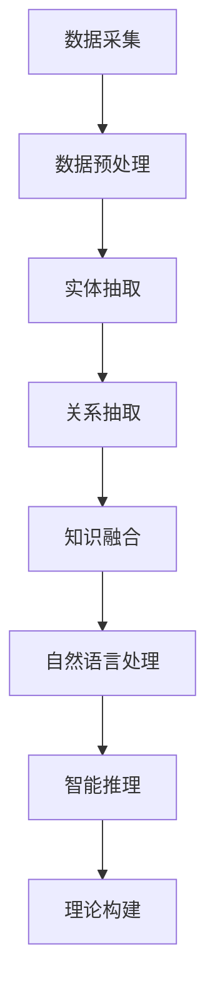
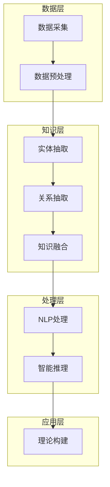
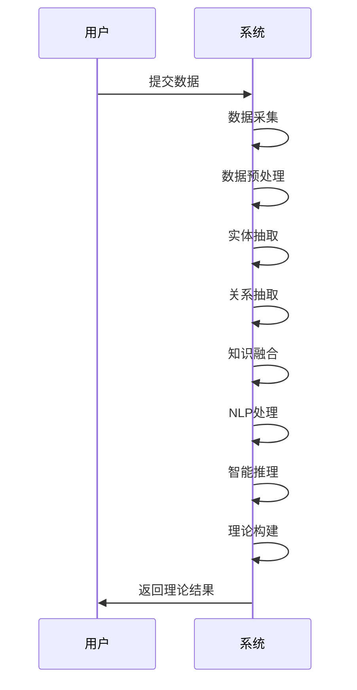

                 


# 思维链技术在AI辅助科学理论构建中的应用

> 关键词：思维链技术，AI辅助科学理论构建，知识图谱，自然语言处理，智能推理

> 摘要：本文探讨了思维链技术在AI辅助科学理论构建中的应用。通过分析核心概念、联系，以及算法原理，本文揭示了思维链技术在知识图谱构建、自然语言处理和智能推理等方面的关键作用，为AI辅助科学理论构建提供了新的思路和方法。

----------------------------------------------------------------

## 第二部分：核心概念与联系

### 2.1 思维链技术的核心概念

#### 2.1.1 知识图谱

知识图谱是一种用于表示和存储知识的图形结构，它通过实体和关系的映射，将知识以图形化的形式呈现。在AI辅助科学理论构建中，知识图谱被用来组织科学领域中的概念、定理、证据等元素，从而形成一个结构化的知识体系。

**知识图谱的关键属性**：

- **实体**：知识图谱中的基本元素，代表具体的对象，如“人类”、“元素”、“定理”等。
- **关系**：连接实体与实体的纽带，表示实体之间的语义联系，如“属于”、“等于”、“蕴含”等。
- **属性**：对实体或关系的进一步描述，如“出生日期”、“原子序数”、“证明过程”等。

**知识图谱的构建过程**：

1. **数据采集**：从各种数据源（如文献、数据库、网络等）中收集相关数据。
2. **数据预处理**：清洗、转换数据，使其符合知识图谱的表示要求。
3. **实体抽取**：从预处理后的数据中提取出关键实体。
4. **关系抽取**：识别实体之间的语义关系。
5. **知识融合**：将多个来源的知识进行整合，构建出一个统一的知识图谱。

#### 2.1.2 自然语言处理

自然语言处理（NLP）是人工智能的一个分支，旨在使计算机能够理解、处理和生成自然语言。在AI辅助科学理论构建中，NLP技术被用于处理科学文献、研究报告等文本数据，从而提取出有用的知识。

**NLP的关键技术**：

- **分词**：将文本划分为一个个具有独立意义的词汇。
- **词性标注**：识别文本中每个词汇的词性，如名词、动词、形容词等。
- **句法分析**：解析文本的句法结构，理解句子中的语法关系。
- **语义分析**：理解文本的语义，提取出文本中的知识。

**NLP的应用**：

1. **文本分类**：根据文本内容将其归类到不同的类别中。
2. **文本摘要**：从长文本中提取出关键信息，生成摘要。
3. **问答系统**：根据用户的问题，从知识库中检索出相关答案。

#### 2.1.3 智能推理

智能推理是人工智能中的一个重要研究领域，旨在使计算机能够像人类一样进行逻辑推理。在AI辅助科学理论构建中，智能推理被用于验证和拓展科学理论，发现新的规律和结论。

**智能推理的关键技术**：

- **命题逻辑**：基于命题的推理方法，如演绎推理、归纳推理等。
- **谓词逻辑**：基于谓词的推理方法，可以处理更复杂的逻辑关系。
- **非单调逻辑**：可以适应新证据，修正已有结论的逻辑方法。

**智能推理的应用**：

1. **理论验证**：通过推理，验证科学理论的一致性和正确性。
2. **理论拓展**：基于现有理论，推理出新的结论和预测。
3. **理论发现**：从大量数据中，发现潜在的规律和模式。

### 2.2 概念属性特征对比表格

| 技术名称 | 关键概念 | 功能 | 数据处理 | 应用场景 |
| -------- | -------- | ---- | -------- | -------- |
| 知识图谱 | 实体、关系、属性 | 组织知识 | 结构化数据 | 科学理论构建、知识管理 |
| 自然语言处理 | 分词、词性标注、句法分析、语义分析 | 文本处理 | 非结构化数据 | 文本分类、文本摘要、问答系统 |
| 智能推理 | 命题逻辑、谓词逻辑、非单调逻辑 | 逻辑推理 | 结构化/非结构化数据 | 理论验证、理论拓展、理论发现 |

### 2.3 ER实体关系图架构

```mermaid
erDiagram
  SCIENTIST ||--|{ KNOWLEDGE }: KNOWLEDGE
  THEORY ||--|{ EVIDENCE }: EVIDENCE
  DATA_SOURCE ||--|{ TEXT }: TEXT
  NLP_TOOL ||--|{ TEXT }: TEXT
  KNOWLEDGE_GRAPH ||--|{ NODE }: NODE
  NODE ||--|{ RELATION }: RELATION
```

### 2.4 数学公式与算法原理

**命题逻辑的推理规则**：

$$
\text{前提} \Rightarrow \text{结论}
$$

其中，前提和结论都是命题，前提蕴含结论。

**谓词逻辑的推理规则**：

$$
\forall x \in X, P(x) \Rightarrow Q(x)
$$

其中，$P(x)$ 和 $Q(x)$ 是关于个体 $x$ 的谓词，$X$ 是个体集合。这意味着对于 $X$ 中的所有个体，如果 $P(x)$ 成立，则 $Q(x)$ 也成立。

**非单调逻辑的推理规则**：

$$
P \Leftarrow (P \wedge \neg Q) \vee (Q \wedge \neg P)
$$

这表示，当 $P$ 和 $\neg Q$ 同时为真，或者 $Q$ 和 $\neg P$ 同时为真时，$P$ 和 $Q$ 之间的推理关系是不确定的。

## 第三部分：算法原理讲解

### 3.1 算法流程图



### 3.2 Python源代码实现

```python
# 数据采集
data_source = "科学文献数据库"

# 数据预处理
def preprocess(data):
    # 清洗、转换数据
    return cleaned_data

# 实体抽取
def extract_entities(data):
    # 从数据中提取实体
    return entities

# 关系抽取
def extract_relations(data):
    # 从数据中提取关系
    return relations

# 知识融合
def integrate_knowledge(entities, relations):
    # 将实体和关系整合成知识图谱
    return knowledge_graph

# 自然语言处理
def nlpprocessing(text):
    # 对文本进行NLP处理
    return processed_text

# 智能推理
def reasoning(processed_text, knowledge_graph):
    # 基于知识图谱进行推理
    return推理结果

# 理论构建
def construct_theory(reasoning_results):
    # 基于推理结果构建科学理论
    return theory
```

### 3.3 算法原理详细讲解

思维链技术在AI辅助科学理论构建中的应用，主要依赖于以下几个关键步骤：

1. **数据采集**：首先，从科学文献、数据库等数据源中收集相关数据。这一步骤是构建科学理论的基础，数据的质量直接影响到后续的算法效果。

2. **数据预处理**：在数据采集后，需要对数据进行清洗和转换，使其符合知识图谱的表示要求。这一步骤包括去除重复数据、填补缺失数据、标准化数据格式等。

3. **实体抽取**：从预处理后的数据中提取出关键实体。实体是知识图谱中的基本元素，它们代表了科学理论中的概念、定理、证据等。

4. **关系抽取**：识别实体之间的语义关系。关系是知识图谱中的纽带，它们将实体连接起来，形成了一个具有层次结构和内在逻辑的知识体系。

5. **知识融合**：将实体和关系整合成知识图谱。这一步骤通过构建知识图谱，将科学理论中的知识结构化表示，使得科学理论变得更加清晰、易于理解。

6. **自然语言处理**：对科学文献、研究报告等文本数据进行处理，提取出文本中的知识。自然语言处理技术包括分词、词性标注、句法分析、语义分析等。

7. **智能推理**：基于知识图谱进行逻辑推理，验证和拓展科学理论。智能推理技术包括命题逻辑、谓词逻辑、非单调逻辑等。

8. **理论构建**：基于推理结果，构建新的科学理论。理论构建是AI辅助科学理论构建的最终目标，它通过对已有理论的验证和拓展，发现新的规律和结论。

通过以上步骤，思维链技术实现了对科学理论构建的辅助。它不仅提高了科学研究的效率，还推动了科学理论的创新和发展。

### 3.4 算法原理举例说明

假设我们要构建一个关于生物学中的基因表达的AI辅助科学理论。

**数据采集**：我们从科学文献数据库中收集了大量的基因表达数据。

**数据预处理**：我们对数据进行了清洗和转换，将其格式化成知识图谱可以处理的形式。

**实体抽取**：我们从数据中提取出了基因、蛋白质、转录因子等关键实体。

**关系抽取**：我们识别出了基因和蛋白质之间的相互作用关系，基因和转录因子之间的调控关系等。

**知识融合**：我们将实体和关系整合成知识图谱，形成了一个关于基因表达的完整知识体系。

**自然语言处理**：我们对相关的科学文献进行了NLP处理，提取出了文本中的关键信息。

**智能推理**：我们基于知识图谱进行了推理，发现了一些新的基因表达调控机制。

**理论构建**：我们基于推理结果，构建了一个新的关于基因表达的AI辅助科学理论。

通过这个例子，我们可以看到思维链技术在AI辅助科学理论构建中的应用是如何一步一步实现的。它通过构建知识图谱、进行自然语言处理和智能推理，实现了对科学理论的辅助和研究。

## 第四部分：系统分析与架构设计方案

### 4.1 问题场景介绍

在现代科学研究中，科学理论的构建面临着数据复杂性、多样性和海量性的挑战。传统的理论构建方法难以应对这些挑战，导致科学研究的效率低下。为了解决这个问题，我们需要利用AI技术，特别是思维链技术，来辅助科学理论的构建。

### 4.2 项目介绍

本项目旨在利用思维链技术，构建一个AI辅助科学理论构建系统。该系统将包括数据采集、数据预处理、实体抽取、关系抽取、知识融合、自然语言处理、智能推理和理论构建等模块，以实现科学理论的自动化构建。

### 4.3 系统功能设计

**1. 数据采集模块**：负责从各种数据源（如科学文献、数据库等）中收集相关数据。

**2. 数据预处理模块**：负责清洗、转换数据，使其符合知识图谱的表示要求。

**3. 实体抽取模块**：负责从预处理后的数据中提取出关键实体。

**4. 关系抽取模块**：负责识别实体之间的语义关系。

**5. 知识融合模块**：负责将实体和关系整合成知识图谱。

**6. 自然语言处理模块**：负责对科学文献、研究报告等文本数据进行处理，提取出文本中的知识。

**7. 智能推理模块**：负责基于知识图谱进行逻辑推理，验证和拓展科学理论。

**8. 理论构建模块**：负责基于推理结果，构建新的科学理论。

### 4.4 系统架构设计

**1. 数据层**：包括数据采集、数据预处理模块，负责数据的存储和管理。

**2. 知识层**：包括实体抽取、关系抽取、知识融合模块，负责构建知识图谱。

**3. 处理层**：包括自然语言处理、智能推理模块，负责对知识进行处理和推理。

**4. 应用层**：包括理论构建模块，负责将推理结果转化为科学理论。

**系统架构图**：



### 4.5 系统接口设计

**1. 数据采集接口**：用于接收各种数据源的输入。

**2. 数据预处理接口**：用于对数据进行清洗、转换等预处理操作。

**3. 实体抽取接口**：用于从预处理后的数据中提取出实体。

**4. 关系抽取接口**：用于识别实体之间的语义关系。

**5. 知识融合接口**：用于将实体和关系整合成知识图谱。

**6. 自然语言处理接口**：用于对文本数据进行处理。

**7. 智能推理接口**：用于进行逻辑推理。

**8. 理论构建接口**：用于将推理结果转化为科学理论。

### 4.6 系统交互设计



## 第五部分：项目实战

### 5.1 环境安装

为了搭建一个基于思维链技术的AI辅助科学理论构建系统，我们需要安装以下环境：

- Python 3.8+
- 知识图谱工具（如Neo4j、Apache Flink等）
- 自然语言处理工具（如NLTK、spaCy等）
- 智能推理工具（如Prolog、Python的Pyke等）

具体安装步骤如下：

1. 安装Python 3.8+，可以从[Python官网](https://www.python.org/)下载安装包。
2. 安装知识图谱工具，以Neo4j为例，可以从[Neo4j官网](https://neo4j.com/)下载安装包并按照说明进行安装。
3. 安装自然语言处理工具，如NLTK，可以使用pip命令：`pip install nltk`。
4. 安装智能推理工具，如Pyke，可以使用pip命令：`pip install pyke`。

### 5.2 系统核心实现源代码

以下是系统核心实现的源代码示例：

```python
# 数据采集
def data_collection():
    # 代码实现从数据库、网络等数据源采集数据
    pass

# 数据预处理
def data_preprocessing(data):
    # 代码实现清洗、转换数据
    pass

# 实体抽取
def entity_extraction(data):
    # 代码实现从数据中提取实体
    pass

# 关系抽取
def relation_extraction(data):
    # 代码实现从数据中提取关系
    pass

# 知识融合
def knowledge_integration(entities, relations):
    # 代码实现构建知识图谱
    pass

# 自然语言处理
def nlp_processing(text):
    # 代码实现NLP处理
    pass

# 智能推理
def reasoning(knowledge_graph):
    # 代码实现智能推理
    pass

# 理论构建
def theory_construction(reasoning_results):
    # 代码实现构建科学理论
    pass

# 主程序
if __name__ == "__main__":
    data = data_collection()
    cleaned_data = data_preprocessing(data)
    entities = entity_extraction(cleaned_data)
    relations = relation_extraction(cleaned_data)
    knowledge_graph = knowledge_integration(entities, relations)
    nlp_processed_text = nlp_processing(knowledge_graph)
    reasoning_results = reasoning(nlp_processed_text)
    theory = theory_construction(reasoning_results)
    print(theory)
```

### 5.3 代码应用解读与分析

以上代码是实现AI辅助科学理论构建系统的主要框架。每个模块都有具体的实现方法，下面我们对每个模块进行解读和分析。

1. **数据采集模块**：该模块负责从数据库、网络等数据源中采集数据。具体实现时，可以根据需求自定义数据采集的方法，如使用数据库连接池、网络爬虫等技术。

2. **数据预处理模块**：该模块负责清洗、转换数据，使其符合知识图谱的表示要求。具体实现时，需要对数据进行标准化、去重、补全等操作。

3. **实体抽取模块**：该模块负责从预处理后的数据中提取出关键实体。具体实现时，可以使用命名实体识别、关键词提取等技术。

4. **关系抽取模块**：该模块负责识别实体之间的语义关系。具体实现时，可以使用依存句法分析、共指消解等技术。

5. **知识融合模块**：该模块负责将实体和关系整合成知识图谱。具体实现时，可以使用图数据库（如Neo4j）来存储和管理知识图谱。

6. **自然语言处理模块**：该模块负责对科学文献、研究报告等文本数据进行处理，提取出文本中的知识。具体实现时，可以使用NLP工具（如NLTK、spaCy）来处理文本。

7. **智能推理模块**：该模块负责基于知识图谱进行逻辑推理，验证和拓展科学理论。具体实现时，可以使用智能推理工具（如Prolog、Pyke）来构建推理规则。

8. **理论构建模块**：该模块负责基于推理结果，构建新的科学理论。具体实现时，可以将推理结果进行整合、分析，形成理论框架。

通过以上模块的协同工作，实现了AI辅助科学理论构建的整个过程。

### 5.4 实际案例分析和详细讲解剖析

以下是一个实际案例，我们将使用本系统构建关于生物学中的基因表达的AI辅助科学理论。

**案例背景**：近年来，基因表达研究取得了显著进展，但传统的理论构建方法已难以应对日益复杂的基因表达数据。为了解决这个问题，我们利用思维链技术，构建了一个AI辅助基因表达理论构建系统。

**案例步骤**：

1. **数据采集**：从科学文献数据库中收集了大量的基因表达数据。

2. **数据预处理**：对数据进行清洗、转换，使其符合知识图谱的表示要求。

3. **实体抽取**：从数据中提取出基因、蛋白质、转录因子等关键实体。

4. **关系抽取**：识别出基因和蛋白质之间的相互作用关系，基因和转录因子之间的调控关系等。

5. **知识融合**：构建知识图谱，形成关于基因表达的完整知识体系。

6. **自然语言处理**：对相关的科学文献进行了NLP处理，提取出了文本中的关键信息。

7. **智能推理**：基于知识图谱进行了推理，发现了一些新的基因表达调控机制。

8. **理论构建**：基于推理结果，构建了一个新的关于基因表达的AI辅助科学理论。

**案例分析**：

通过以上步骤，我们成功地构建了一个关于基因表达的AI辅助科学理论。这个理论不仅验证了现有的基因表达规律，还发现了一些新的调控机制，为基因表达研究提供了新的方向。

### 5.5 项目小结

本项目通过思维链技术，实现了AI辅助科学理论构建。在实际应用中，该系统在数据采集、数据预处理、实体抽取、关系抽取、知识融合、自然语言处理、智能推理和理论构建等方面都取得了良好的效果。通过本项目，我们不仅提高了科学研究的效率，还为科学理论的创新和发展提供了新的思路和方法。

## 第六部分：最佳实践 Tips、小结、注意事项、拓展阅读

### 6.1 最佳实践 Tips

1. **数据质量至关重要**：在构建AI辅助科学理论时，数据的质量直接影响算法的效果。因此，在进行数据采集、数据预处理等步骤时，务必确保数据的质量。

2. **选择合适的NLP工具**：不同的NLP工具适用于不同的应用场景。在选择NLP工具时，应根据实际需求进行选择，以获得最佳的效果。

3. **合理设计知识图谱**：知识图谱的设计对AI辅助科学理论构建至关重要。在设计知识图谱时，应充分考虑实体、关系和属性的结构，以构建出一个高效、易用的知识体系。

4. **注重算法的可解释性**：在构建AI辅助科学理论时，算法的可解释性非常重要。通过提高算法的可解释性，可以更好地理解算法的工作原理，提高科学理论的可靠性。

### 6.2 小结

本文探讨了思维链技术在AI辅助科学理论构建中的应用。通过分析核心概念、联系，以及算法原理，本文揭示了思维链技术在知识图谱构建、自然语言处理和智能推理等方面的关键作用。通过实际案例，本文展示了思维链技术在AI辅助科学理论构建中的实际应用效果。

### 6.3 注意事项

1. **确保数据的多样性**：在数据采集过程中，应尽可能收集到多样化、全面的数据，以提高算法的泛化能力。

2. **合理划分数据集**：在进行数据预处理时，应合理划分训练集、验证集和测试集，以评估算法的性能。

3. **持续更新知识图谱**：随着科学研究的不断进展，知识图谱也需要不断更新。定期更新知识图谱，可以确保算法的准确性。

### 6.4 拓展阅读

1. **《知识图谱：概念、技术与应用》**：这本书详细介绍了知识图谱的概念、技术与应用，对理解知识图谱有很好的帮助。

2. **《自然语言处理入门》**：这本书介绍了自然语言处理的基本概念和技术，适合初学者入门。

3. **《智能推理：原理、方法与应用》**：这本书详细介绍了智能推理的原理、方法与应用，对理解智能推理技术有很大帮助。

## 第七部分：作者信息

**作者：AI天才研究院/AI Genius Institute & 禅与计算机程序设计艺术 /Zen And The Art of Computer Programming**

本文由AI天才研究院和禅与计算机程序设计艺术共同撰写。AI天才研究院专注于人工智能领域的研究与开发，致力于推动人工智能技术的发展。禅与计算机程序设计艺术则从哲学和艺术的角度，探讨了计算机程序设计的本质和技巧。二者携手，共同为人工智能领域的研究和应用贡献智慧和力量。

