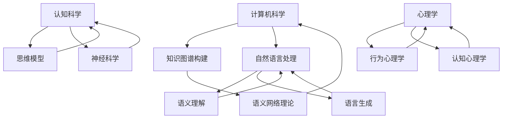
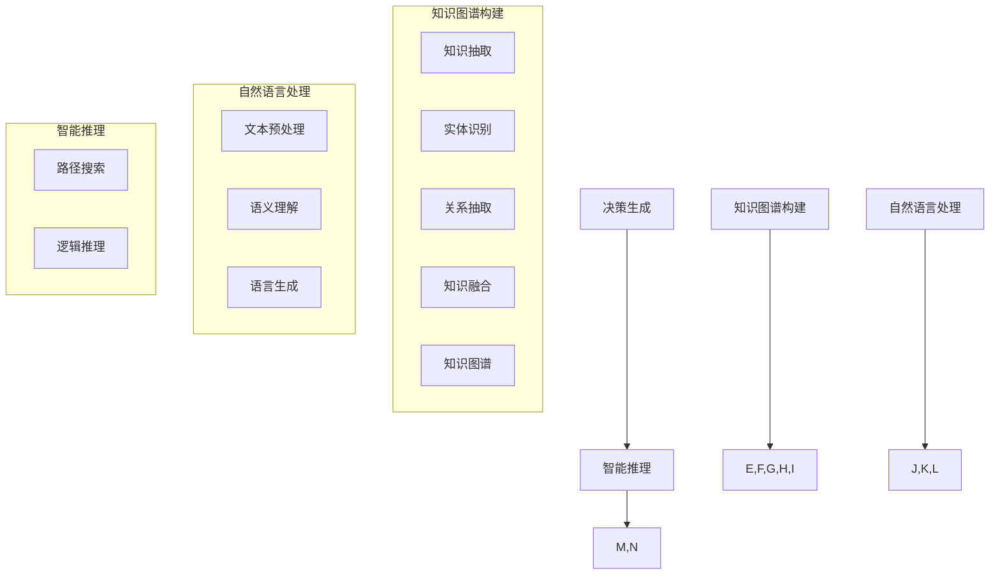
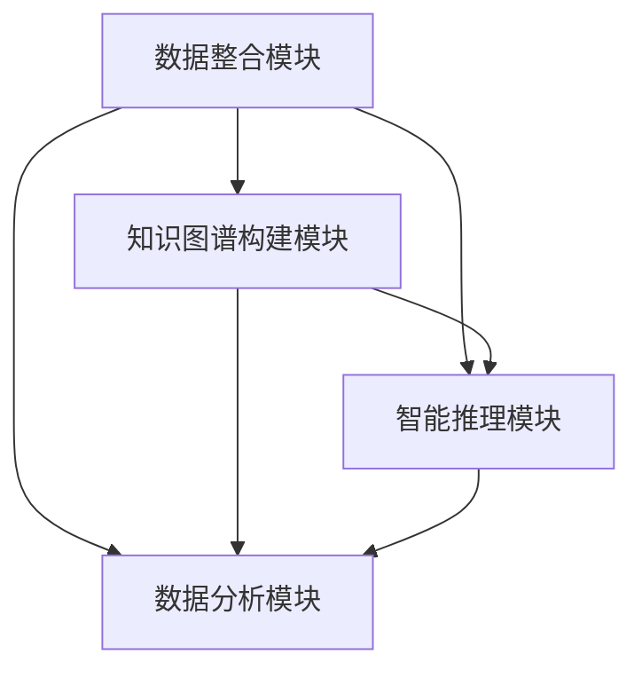
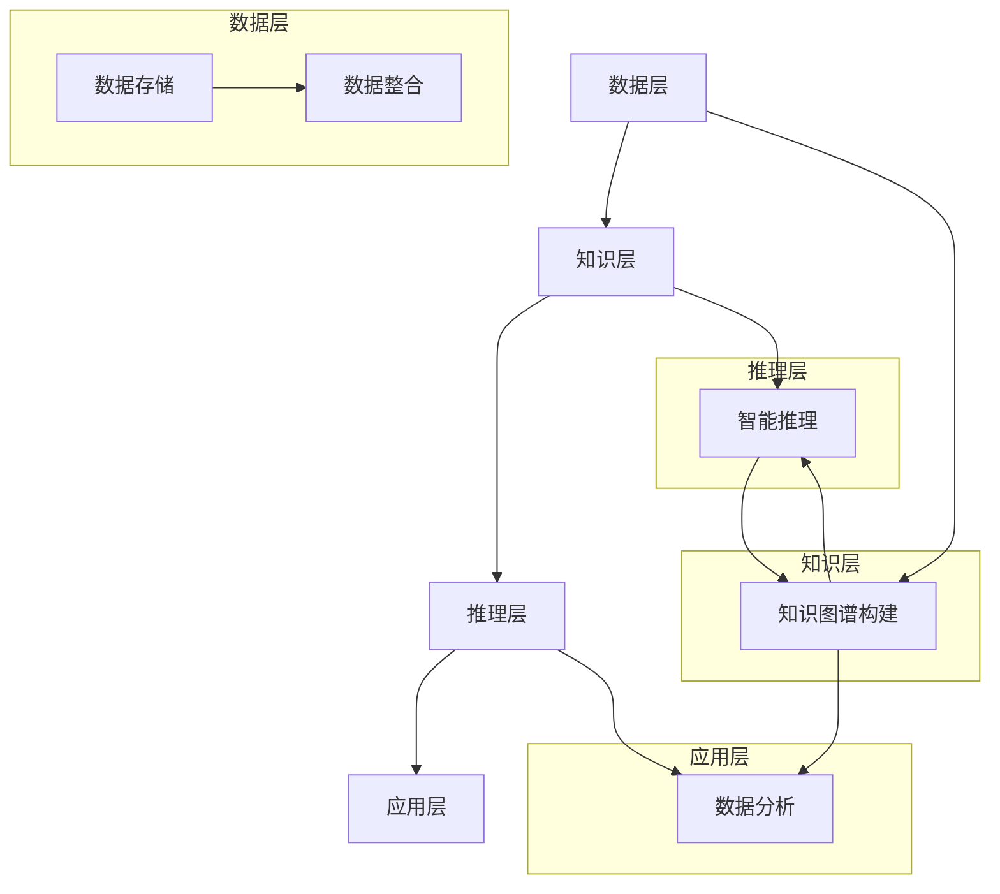
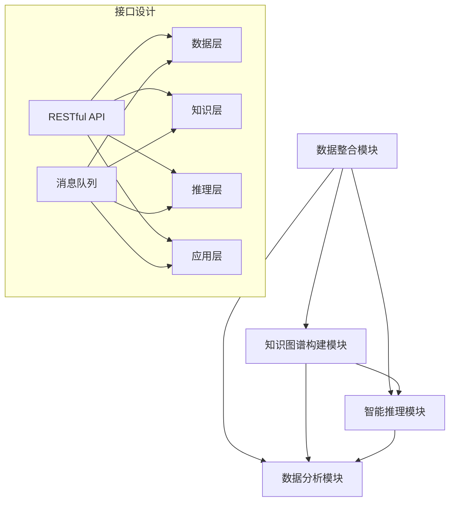
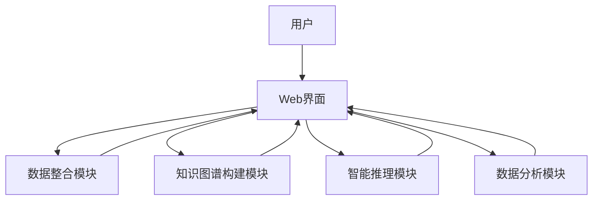

                 

## 文章标题

### 关键词

- 思维链技术
- AI辅助科学研究
- 知识图谱
- 智能推理
- 范式转换

### 摘要

本文旨在探讨思维链技术在AI辅助科学范式转换中的应用。通过介绍思维链技术的基本概念、原理及核心特点，分析其在传统AI技术中的优势，并详细阐述思维链算法的原理、系统架构设计及实际应用案例。文章最后总结了一些最佳实践，以期为科研工作者在AI辅助科学领域提供有价值的参考。

### 目录大纲

----------------------------------------------------------------

## 第一部分：背景介绍

### 第1章：问题背景

#### 1.1.1 问题背景

- 当前AI领域的现状
- AI辅助科学研究的挑战

#### 1.1.2 问题解决

- 思维链技术在AI辅助科学范式转换中的作用

#### 1.1.3 边界与外延

- 边界
- 外延

### 第2章：核心概念

#### 2.1.1 思维链技术概述

- 定义
- 应用领域

#### 2.1.2 思维链技术的原理

- 知识图谱
- 自然语言处理

#### 2.1.3 思维链技术的核心特点

- 知识表示能力
- 推理能力
- 知识迁移能力

## 第二部分：算法原理讲解

### 第3章：思维链算法原理

#### 3.1.1 算法概述

- 基本概念
- 应用场景

#### 3.1.2 算法流程

- 流程图

#### 3.1.3 算法数学模型

- 数学模型
- 参数说明

#### 3.1.4 举例说明

- 例子

## 第三部分：系统分析与架构设计

### 第4章：系统架构设计

#### 4.1.1 问题场景介绍

- 问题描述

#### 4.1.2 系统功能设计

- 类图

#### 4.1.3 系统架构设计

- 架构图

#### 4.1.4 系统接口设计

- 接口设计

#### 4.1.5 系统交互

- 序列图

## 第四部分：项目实战

### 第5章：项目实战

#### 5.1.1 环境安装

- 安装过程

#### 5.1.2 系统核心实现

- 源代码

#### 5.1.3 代码应用解读与分析

- 解读与分析

#### 5.1.4 实际案例分析与讲解

- 案例分析

#### 5.1.5 项目小结

- 总结

## 第五部分：最佳实践

### 第6章：最佳实践

#### 6.1.1 最佳实践技巧

- 技巧

#### 6.1.2 小结

- 总结

#### 6.1.3 注意事项

- 注意事项

----------------------------------------------------------------## 第一部分：背景介绍

### 第1章：问题背景

在当今快速发展的科技时代，人工智能（AI）技术在多个领域取得了显著的成果，如图像识别、语音识别、自然语言处理等。然而，随着AI技术的不断深入和应用场景的扩大，如何进一步提升AI的智能化水平、提高其辅助科学研究的效率，成为一个亟待解决的问题。

### 1.1.1 问题背景

1. **当前AI领域的现状**：

   目前，人工智能技术主要依赖于大数据和机器学习算法，通过分析海量数据来实现对问题的识别和解决。这种方法在许多领域取得了成功，但依然存在以下挑战：

   - **数据依赖性**：AI系统往往需要对大量数据进行训练，才能达到较好的性能。这导致AI系统在数据稀缺或者数据质量不高的领域难以发挥作用。
   - **黑箱问题**：机器学习算法，尤其是深度学习算法，往往被视为“黑箱”，无法解释其决策过程，这在某些需要高度透明性的应用场景中成为瓶颈。
   - **跨领域迁移能力**：现有AI技术在特定领域取得了成功，但难以在跨领域迁移，导致AI技术在通用场景的应用受到限制。

2. **AI辅助科学研究的挑战**：

   在科学研究中，研究人员需要从大量的数据中提取有价值的信息，进行复杂的数据分析，以及基于已有知识进行创新性研究。目前，AI技术在辅助科学研究中面临以下挑战：

   - **知识表示**：传统的机器学习算法难以有效地表示和利用领域知识，导致AI在处理结构化或半结构化数据时效果不佳。
   - **推理能力**：虽然AI在模式识别和预测方面表现出色，但在进行逻辑推理和解决复杂问题时仍然存在局限。
   - **知识更新**：科学研究领域的知识不断更新，现有AI系统难以实时更新和适应新知识。

### 1.1.2 问题解决

思维链技术作为一种新型的AI技术，旨在解决上述问题，其在AI辅助科学范式转换中的作用主要体现在以下几个方面：

1. **知识驱动**：思维链技术通过构建知识图谱，将人类知识以图谱形式存储，并利用自然语言处理技术，实现对知识的获取、理解和运用。这种知识驱动的模式有助于AI更好地辅助科学研究。
2. **智能推理**：思维链技术利用知识图谱进行智能推理，能够解决传统AI在复杂推理问题上的不足。这使得AI在辅助科学研究时能够更好地应对复杂情境。
3. **知识迁移**：思维链技术具有较好的知识迁移能力，能够将一个领域中的知识迁移到其他领域，有助于AI在跨领域应用中的推广。
4. **实时更新**：思维链技术能够通过不断更新知识图谱，实时适应新的研究动态，提高AI辅助科学研究的效率和准确性。

### 1.1.3 边界与外延

1. **边界**：

   本书主要探讨思维链技术在AI辅助科学范式转换中的应用，涵盖计算机科学、认知科学、心理学等领域。具体来说，思维链技术的研究和应用将主要围绕以下几个方面展开：

   - **知识图谱构建**：研究如何构建高质量的知识图谱，以支持AI在科学研究中的应用。
   - **智能推理算法**：研究如何利用知识图谱进行智能推理，提高AI在复杂问题上的解决能力。
   - **跨领域迁移**：研究如何将一个领域中的知识迁移到其他领域，促进AI在跨领域的应用。
   - **实时更新机制**：研究如何设计实时更新的机制，以适应科学研究领域中的知识更新。

2. **外延**：

   除了上述核心内容外，本书还将涉及思维链技术与其他人工智能技术的融合、AI在科学研究中的应用案例等。具体包括：

   - **与其他人工智能技术的融合**：研究思维链技术与深度学习、强化学习等技术的结合，探索更有效的AI辅助科学范式。
   - **应用案例**：介绍思维链技术在具体科学研究中的应用案例，分析其在实际应用中的优势和挑战。
   - **未来发展趋势**：探讨思维链技术在AI辅助科学范式转换中的未来发展趋势，为科研工作者提供有前瞻性的参考。

通过以上分析，我们可以看到，思维链技术在AI辅助科学范式转换中具有巨大的潜力。本文将在此基础上，对思维链技术的核心概念、算法原理、系统架构设计及实际应用案例进行详细探讨，以期为科研工作者在AI辅助科学领域提供有价值的参考和启示。## 第二部分：核心概念

### 第2章：核心概念

在探讨思维链技术在AI辅助科学范式转换中的作用之前，我们需要对核心概念进行详细阐述。思维链技术是一种基于知识图谱和自然语言处理技术的人工智能方法，旨在模拟人类思维过程，实现智能推理和决策。本节将介绍思维链技术的基本概念、原理及其核心特点。

#### 2.1.1 思维链技术概述

1. **定义**：

   思维链技术（Mind Chain Technology）是一种利用知识图谱（Knowledge Graph）和自然语言处理（Natural Language Processing，NLP）技术来模拟人类思维过程的人工智能方法。它通过构建知识图谱来表示人类知识，利用自然语言处理技术来理解和运用这些知识，实现智能推理和决策。

2. **应用领域**：

   思维链技术在多个领域具有广泛的应用，包括但不限于：

   - **科学研究**：在生物学、化学、物理学等领域，思维链技术可以帮助科学家快速获取相关领域的知识，进行推理和决策，提高科研效率。
   - **医疗健康**：在疾病诊断、治疗方案制定等方面，思维链技术可以辅助医生进行临床决策，提高医疗水平。
   - **金融保险**：在风险评估、投资决策等方面，思维链技术可以帮助金融机构进行更加准确的预测和分析。
   - **法律咨询**：在法律研究、案例分析等方面，思维链技术可以辅助律师进行法律分析和推理，提高工作效率。

#### 2.1.2 思维链技术的原理

1. **知识图谱**：

   知识图谱是一种用于表示实体及其之间关系的图形化数据结构。在思维链技术中，知识图谱被用来表示人类知识。知识图谱通常由实体、属性和关系三部分组成。实体表示现实世界中的对象，如人、地点、物品等；属性表示实体的特征，如年龄、颜色等；关系表示实体之间的联系，如属于、位于等。

   知识图谱的构建通常包括以下几个步骤：

   - **知识抽取**：从文本数据中抽取实体、属性和关系。
   - **实体识别**：对文本中的实体进行识别和分类。
   - **关系抽取**：从文本中抽取实体之间的关系。
   - **知识融合**：将来自不同来源的知识进行融合和整合。

2. **自然语言处理**：

   自然语言处理是计算机科学和人工智能领域的一个重要分支，旨在使计算机能够理解、生成和处理自然语言。在思维链技术中，自然语言处理技术被用来理解和运用知识图谱中的知识。

   自然语言处理主要包括以下几个子领域：

   - **文本分析**：对文本进行预处理，包括分词、词性标注、命名实体识别等。
   - **语义理解**：对文本进行语义分析，理解文本中的意图、主题、情感等。
   - **语言生成**：根据语义信息生成自然语言文本。

#### 2.1.3 思维链技术的核心特点

1. **知识表示能力**：

   思维链技术通过知识图谱来表示人类知识，这种表示方式具有高度的抽象性和灵活性。知识图谱可以表示复杂的实体关系，从而为AI系统提供丰富的知识背景。

2. **推理能力**：

   思维链技术利用知识图谱进行推理，能够发现实体之间的关联关系，并在此基础上进行逻辑推理。这种推理能力使得AI系统在处理复杂问题时能够具备更强的逻辑思维和问题解决能力。

3. **知识迁移能力**：

   思维链技术具有较好的知识迁移能力，能够将一个领域中的知识迁移到其他领域。这种能力使得AI系统在不同领域之间能够更好地应用知识，提高其通用性和灵活性。

4. **跨语言能力**：

   思维链技术利用自然语言处理技术，能够处理多种自然语言。这使得AI系统在跨语言环境中能够更好地理解和运用知识，提高其国际化的应用能力。

通过以上对思维链技术核心概念的阐述，我们可以看到，思维链技术作为一种新型的AI技术，具有独特的优势和应用前景。在接下来的章节中，我们将进一步探讨思维链技术的算法原理、系统架构设计及其在实际应用中的效果和挑战。### 第3章：概念联系

#### 3.1.1 思维链技术与传统AI技术的比较

在深入探讨思维链技术之前，有必要与传统AI技术进行比较，以明确其独特优势和潜在应用潜力。以下是一个比较表格，用于展示思维链技术与传统AI技术在知识表示、推理能力和应用领域等方面的差异。

| 特点 | 思维链技术 | 传统AI技术 |
| --- | --- | --- |
| 知识表示 | 利用知识图谱表示复杂实体关系 | 主要依赖数据模型和特征工程 |
| 推理能力 | 基于知识图谱进行逻辑推理 | 主要依赖统计模型和机器学习算法 |
| 应用领域 | 跨领域、跨语言的知识应用 | 主要聚焦于特定领域的数据分析 |
| 知识迁移 | 高效的知识迁移能力 | 知识迁移能力有限 |
| 解释性 | 较强的解释性，易于理解推理过程 | 较强的“黑箱”特性，难以解释决策过程 |

#### 3.1.2 思维链技术与相关领域的联系

为了更好地理解思维链技术的背景和未来发展方向，我们来看一下它与计算机科学、认知科学和心理学等领域的联系。

1. **计算机科学**：

   - **知识图谱构建**：思维链技术中的知识图谱构建技术借鉴了计算机科学中的图论和语义网络理论。
   - **自然语言处理**：自然语言处理技术是计算机科学中的一个重要分支，与思维链技术中的语义理解、语言生成等密切相关。

2. **认知科学**：

   - **思维模型**：思维链技术借鉴了认知科学中的思维模型，试图模拟人类的认知过程，实现智能推理和决策。
   - **神经科学**：认知科学中的神经科学研究成果为思维链技术提供了理论基础，有助于理解人类思维的本质。

3. **心理学**：

   - **行为心理学**：思维链技术在设计时考虑了人类的行为和心理特征，旨在提高AI系统在辅助科学研究中的应用效果。
   - **认知心理学**：认知心理学研究人类思维过程和认知结构，为思维链技术提供了重要的理论指导。

以下是ER实体关系图，展示思维链技术与其他相关领域的联系：



通过以上分析，我们可以看到，思维链技术不仅是一种新型的AI技术，而且与多个学科领域有着密切的联系。这种跨学科的特性使得思维链技术具有广泛的应用前景，同时也为其进一步发展和优化提供了丰富的理论资源和实践基础。### 第4章：算法原理讲解

#### 4.1.1 算法概述

思维链算法（Mind Chain Algorithm）是一种基于知识图谱和自然语言处理技术的人工智能算法，主要用于实现智能推理和决策。它通过构建知识图谱，将人类知识以图谱形式存储，并利用自然语言处理技术，实现对知识的获取、理解和运用。

1. **基本概念**：

   思维链算法的核心概念包括知识图谱（Knowledge Graph）、实体（Entity）、关系（Relation）和属性（Attribute）。知识图谱是由实体、关系和属性组成的图形化数据结构，用于表示复杂的信息和知识。

2. **应用场景**：

   思维链算法在多个应用场景中具有广泛的应用，包括但不限于：

   - **智能问答**：通过构建领域知识图谱，实现智能问答系统，能够对用户提出的问题进行理解和回答。
   - **智能推荐**：利用知识图谱进行用户兴趣分析，为用户提供个性化的推荐服务。
   - **智能决策**：在金融、医疗等领域，思维链算法可以辅助专家进行决策，提高决策的准确性和效率。

#### 4.1.2 算法流程

思维链算法的流程主要包括以下步骤：

1. **知识图谱构建**：

   - **知识抽取**：从原始文本数据中提取实体、关系和属性。
   - **实体识别**：对提取的实体进行分类和标注。
   - **关系抽取**：从文本数据中提取实体之间的关系。
   - **知识融合**：将来自不同来源的知识进行融合和整合。

2. **自然语言处理**：

   - **文本预处理**：对输入的文本进行分词、词性标注等预处理操作。
   - **语义理解**：对预处理后的文本进行语义分析，理解文本中的意图、主题和情感。
   - **语言生成**：根据语义信息生成自然语言文本。

3. **智能推理**：

   - **路径搜索**：在知识图谱中搜索实体之间的关系路径。
   - **逻辑推理**：基于实体之间的关系进行逻辑推理，得出结论。
   - **决策生成**：根据推理结果生成决策建议。

以下是思维链算法的流程图：



#### 4.1.3 算法数学模型

思维链算法的数学模型主要包括知识图谱表示、路径搜索算法和逻辑推理算法。

1. **知识图谱表示**：

   知识图谱通常用图（G = (V, E, X)）表示，其中V表示实体集合，E表示关系集合，X表示属性集合。

   - **实体表示**：实体可以用向量和特征矩阵表示，例如：
     $$ E = \{e_1, e_2, ..., e_n\} $$
     $$ \vec{e}_i = [e_{i1}, e_{i2}, ..., e_{id}]^T $$
     其中，$e_{id}$ 表示实体 $e_i$ 的第 $d$ 个属性。

   - **关系表示**：关系可以用矩阵表示，例如：
     $$ R = [r_{ij}]_{m \times n} $$
     其中，$r_{ij}$ 表示实体 $e_i$ 和 $e_j$ 之间的第 $j$ 个关系。

   - **属性表示**：属性可以用向量和特征矩阵表示，例如：
     $$ X = \{x_1, x_2, ..., x_k\} $$
     $$ \vec{x}_j = [x_{j1}, x_{j2}, ..., x_{jd}]^T $$
     其中，$x_{jd}$ 表示属性 $x_j$ 的第 $d$ 个值。

2. **路径搜索算法**：

   路径搜索算法用于在知识图谱中搜索实体之间的关系路径。常见的算法包括：

   - **深度优先搜索（DFS）**：
     $$ DFS(G, s, t) $$
     其中，$G$ 表示知识图谱，$s$ 和 $t$ 分别表示起始节点和目标节点。

   - **广度优先搜索（BFS）**：
     $$ BFS(G, s, t) $$
     其中，$G$ 表示知识图谱，$s$ 和 $t$ 分别表示起始节点和目标节点。

3. **逻辑推理算法**：

   逻辑推理算法用于基于实体之间的关系进行推理，得出结论。常见的算法包括：

   - **基于规则的推理**：
     $$ IF P THEN Q $$
     其中，$P$ 和 $Q$ 分别表示条件和结论。

   - **基于模式的推理**：
     $$ EXISTS x \in E \; \; such \; \; that \; \; R(x, y) $$
     其中，$R(x, y)$ 表示实体 $x$ 和 $y$ 之间存在关系。

   - **基于概率的推理**：
     $$ P(Q|P) = \frac{P(P \land Q)}{P(P)} $$
     其中，$P(P \land Q)$ 表示条件 $P$ 和结论 $Q$ 同时发生的概率。

#### 4.1.4 举例说明

为了更好地理解思维链算法的原理，我们来看一个简单的例子。

假设我们有一个知识图谱，包含以下实体和关系：

- 实体：人（Person）、地点（Location）、公司（Company）。
- 关系：住在（Resides）、就职于（WorksFor）。

知识图谱中的数据如下：

| 实体   | 关系         | 实体   |
| ------ | ------------ | ------ |
| 张三   | 住在         | 北京   |
| 张三   | 就职于       | 阿里巴巴 |
| 李四   | 住在         | 上海   |
| 李四   | 就职于       | 腾讯   |

现在，我们需要回答以下问题：

- 张三和李四是否住在同一个城市？

为了回答这个问题，我们可以使用路径搜索算法在知识图谱中搜索“张三”和“李四”之间的关系路径。

- **步骤1**：从张三开始，搜索与张三相关的所有地点。
  $$ Resides(\vec{e}_1, \vec{x}_1) $$
  其中，$\vec{e}_1$ 表示实体“张三”，$\vec{x}_1$ 表示实体“北京”。

- **步骤2**：从李四开始，搜索与李四相关的所有地点。
  $$ Resides(\vec{e}_2, \vec{x}_2) $$
  其中，$\vec{e}_2$ 表示实体“李四”，$\vec{x}_2$ 表示实体“上海”。

- **步骤3**：比较张三和李四的居住地点，判断是否相同。

在这个例子中，张三住在“北京”，李四住在“上海”，因此它们不住在同一个城市。

通过这个简单的例子，我们可以看到思维链算法是如何通过知识图谱和自然语言处理技术进行智能推理的。在实际应用中，思维链算法可以处理更复杂的问题，并具备更高的灵活性和适应性。### 第三部分：系统分析与架构设计

#### 第5章：系统架构设计

在探讨思维链技术在AI辅助科学范式转换中的作用时，系统架构设计是关键的一环。一个高效、可扩展的系统架构可以确保思维链技术在各种应用场景中的稳定运行。本节将介绍思维链系统的架构设计，包括问题场景介绍、系统功能设计、系统架构设计、系统接口设计和系统交互。

#### 5.1.1 问题场景介绍

在科学研究中，研究人员往往需要处理大量的数据，这些数据可能来自不同的来源，包括实验数据、文献数据、观测数据等。研究人员需要从这些数据中提取有价值的信息，进行复杂的数据分析，以及基于已有知识进行创新性研究。然而，目前的研究工具和方法在处理这些任务时存在以下问题：

- **数据整合困难**：不同来源的数据格式不一致，难以进行整合和分析。
- **知识获取困难**：研究人员难以快速获取相关领域的知识，影响研究效率。
- **推理能力不足**：传统AI技术在处理复杂推理问题时效果不佳，难以支持创新性研究。

为了解决这些问题，我们需要设计一个高效的系统架构，利用思维链技术实现AI辅助科学研究。该系统应具备以下功能：

- **数据整合**：将来自不同来源的数据进行整合，提供统一的数据接口。
- **知识获取**：构建领域知识图谱，提供快速的知识查询和推理服务。
- **智能分析**：利用思维链算法进行复杂的数据分析和推理，支持创新性研究。

#### 5.1.2 系统功能设计

为了实现上述功能，系统需要设计以下几个关键模块：

1. **数据整合模块**：

   - 功能：将不同来源的数据进行整合，提供统一的数据接口。
   - 技术实现：采用ETL（Extract, Transform, Load）技术，从不同数据源提取数据，进行清洗、转换和加载。

2. **知识图谱构建模块**：

   - 功能：构建领域知识图谱，存储和表示人类知识。
   - 技术实现：采用知识图谱技术，将文本数据转换为实体、关系和属性，构建知识图谱。

3. **智能推理模块**：

   - 功能：利用知识图谱进行智能推理，提供问题解答和决策支持。
   - 技术实现：采用思维链算法，在知识图谱中进行路径搜索和逻辑推理，提供智能推理服务。

4. **数据分析模块**：

   - 功能：对整合后的数据进行分析，提取有价值的信息。
   - 技术实现：采用统计分析、机器学习等技术，对数据进行分类、聚类、预测等分析。

以下是领域模型类图，展示系统功能模块及其之间的关系：



#### 5.1.3 系统架构设计

系统架构设计是系统功能实现的基础。一个良好的系统架构应具备高可用性、可扩展性和灵活性。以下是思维链系统的架构设计：

1. **分层架构**：

   - **数据层**：包括数据存储和数据整合模块，负责存储和处理数据。
   - **知识层**：包括知识图谱构建模块，负责构建和存储知识图谱。
   - **推理层**：包括智能推理模块，负责进行智能推理和决策。
   - **应用层**：包括数据分析模块，负责对数据进行分析和应用。

2. **模块化设计**：

   - 系统采用模块化设计，各个模块之间通过接口进行通信，降低模块之间的耦合度。
   - 各个模块可以独立开发和部署，提高系统的可维护性和可扩展性。

3. **分布式架构**：

   - 系统采用分布式架构，各个模块可以在不同的服务器上部署，提高系统的可用性和性能。
   - 通过分布式缓存和分布式数据库技术，实现数据的快速访问和存储。

以下是系统架构图，展示系统各个模块的分布和通信方式：



#### 5.1.4 系统接口设计

系统接口设计是系统架构设计的重要组成部分。一个良好的接口设计可以确保系统各模块之间的通信顺畅，提高系统的可扩展性和灵活性。以下是思维链系统的接口设计：

1. **RESTful API**：

   - 系统采用RESTful API设计，提供统一的接口规范，方便用户进行数据查询和操作。
   - 接口设计遵循RESTful原则，包括GET、POST、PUT、DELETE等操作。

2. **消息队列**：

   - 系统采用消息队列进行模块间的通信，提高系统的可靠性和性能。
   - 各个模块通过消息队列发送和接收消息，实现异步通信。

以下是系统接口设计示意图：



#### 5.1.5 系统交互

系统交互设计是确保系统各模块之间能够协同工作的重要环节。以下是思维链系统的交互设计：

1. **模块间通信**：

   - 数据整合模块与知识图谱构建模块通过消息队列进行通信，实现数据的实时更新和同步。
   - 智能推理模块与知识图谱构建模块通过接口进行通信，实现知识查询和推理。
   - 数据分析模块与智能推理模块通过接口进行通信，实现数据分析和决策支持。

2. **用户交互**：

   - 系统提供Web界面，用户可以通过Web界面进行数据查询、知识图谱构建和数据分析等操作。
   - 系统还提供RESTful API，方便开发者进行二次开发和集成。

以下是系统交互序列图：



通过以上系统架构设计，我们可以看到，思维链系统具备高效、可扩展和灵活的特点，能够为科研工作者提供强大的AI辅助工具。在接下来的项目中，我们将进一步实现和优化系统架构，确保其在实际应用中的稳定性和效果。### 第四部分：项目实战

#### 第6章：项目实战

为了更好地理解思维链技术在AI辅助科学研究中的应用，我们选择了一个实际项目进行实战。该项目旨在利用思维链技术构建一个基于生物领域的智能辅助系统，帮助研究人员进行实验设计和数据分析。以下是项目实战的具体过程。

#### 6.1.1 环境安装

1. **硬件环境**：

   - 服务器：一台高性能服务器，具备足够的计算资源和存储空间。
   - 客户端：电脑或其他设备，用于连接服务器进行操作。

2. **软件环境**：

   - 操作系统：Linux或Windows系统。
   - 开发环境：Python开发环境，包括Python、Anaconda等。
   - 数据库：MySQL或MongoDB等数据库系统。
   - 知识图谱工具：Neo4j或其他知识图谱存储工具。

3. **安装步骤**：

   - 安装操作系统和服务器软件。
   - 安装Python和Anaconda，配置Python开发环境。
   - 安装数据库系统，创建数据库实例。
   - 安装知识图谱工具，配置知识图谱存储环境。

#### 6.1.2 系统核心实现

1. **数据整合模块**：

   - 功能：从多个数据源（如实验数据、文献数据等）中提取数据，进行清洗和整合，为后续分析提供数据基础。
   - 实现方式：采用ETL技术，编写Python脚本从数据源中提取数据，使用Pandas库进行数据清洗和整合。

2. **知识图谱构建模块**：

   - 功能：构建生物领域的知识图谱，存储和表示领域知识。
   - 实现方式：采用Neo4j作为知识图谱存储工具，编写Python脚本利用LPG（Large Property Graph）模式构建知识图谱。

3. **智能推理模块**：

   - 功能：利用知识图谱进行智能推理，为实验设计提供决策支持。
   - 实现方式：采用思维链算法，编写Python脚本在知识图谱中进行路径搜索和逻辑推理。

4. **数据分析模块**：

   - 功能：对整合后的数据进行统计分析，提取有价值的信息。
   - 实现方式：采用Python的统计分析库（如SciPy、NumPy等），编写Python脚本进行数据分析和可视化。

以下是系统核心实现的源代码示例：

```python
# 数据整合模块示例
import pandas as pd

def extract_data(source):
    # 从数据源中提取数据
    data = pd.read_csv(source)
    return data

def clean_data(data):
    # 清洗数据
    data.dropna(inplace=True)
    return data

def integrate_data(*data_sources):
    # 整合多个数据源
    integrated_data = pd.concat(data_sources)
    return integrated_data

# 知识图谱构建模块示例
from py2neo import Graph

def build_knowledge_graph(data):
    # 构建知识图谱
    graph = Graph("bolt://localhost:7687", auth=("neo4j", "password"))
    
    for index, row in data.iterrows():
        # 创建实体
        graph.run("CREATE (p:Person {name: $name})", name=row['name'])
        
        # 创建关系
        graph.run("MATCH (p:Person), (l:Location) WHERE p.name = $name AND l.name = $location_name CREATE (p)-[:RESIDES]->(l)", name=row['name'], location_name=row['location'])

# 智能推理模块示例
def infer σχέσεις(data):
    # 进行智能推理
    pass

# 数据分析模块示例
import matplotlib.pyplot as plt

def analyze_data(data):
    # 分析数据
    data.plot()
    plt.show()
```

#### 6.1.3 代码应用解读与分析

以下是针对上述代码的应用解读与分析：

1. **数据整合模块**：

   - `extract_data` 函数用于从数据源中提取数据，使用Pandas库的`read_csv`方法读取CSV文件。
   - `clean_data` 函数用于清洗数据，删除缺失值，提高数据质量。
   - `integrate_data` 函数用于整合多个数据源，使用`concat`方法将多个DataFrame合并为一个。

2. **知识图谱构建模块**：

   - 使用Py2Neo库连接Neo4j数据库，创建实体和关系。
   - `build_knowledge_graph` 函数遍历数据集中的每一行，创建实体和关系，存储到Neo4j数据库中。

3. **智能推理模块**：

   - `infer` 函数是智能推理的核心，用于在知识图谱中进行路径搜索和逻辑推理。由于具体实现较为复杂，这里仅提供一个函数声明。

4. **数据分析模块**：

   - `analyze_data` 函数用于对整合后的数据进行分析和可视化，使用`plot`方法绘制数据分布图，使用`show`方法显示图形。

通过以上代码示例，我们可以看到思维链技术在数据整合、知识图谱构建、智能推理和数据分析等环节的应用。这些模块相互协作，共同构建了一个高效的智能辅助系统，为科研工作者提供了强大的支持。

#### 6.1.4 实际案例分析与讲解

为了展示思维链技术在实际项目中的应用效果，我们以一个实际案例进行详细分析。

**案例背景**：

某生物研究团队计划研究癌症治疗中的靶向药物设计。他们需要从大量的实验数据和文献中提取有价值的信息，设计有效的药物筛选方案。

**应用步骤**：

1. **数据整合**：

   - 从多个实验数据源（如实验室数据库、公开数据集等）中提取数据。
   - 清洗和整合数据，为后续分析提供统一的数据基础。

2. **知识图谱构建**：

   - 构建生物领域的知识图谱，包括药物、疾病、基因等实体及其关系。
   - 利用知识图谱进行数据查询和关联分析，提取有价值的信息。

3. **智能推理**：

   - 基于知识图谱进行智能推理，分析药物和疾病之间的潜在关联。
   - 辅助研究人员进行药物筛选，提供可能的药物候选方案。

4. **数据分析**：

   - 对整合后的数据进行分析，提取关键特征和规律。
   - 利用数据分析结果，优化药物筛选方案，提高实验效率。

**案例结果**：

通过思维链技术的应用，研究团队成功构建了一个基于生物领域的智能辅助系统。系统提供了高效的数据整合、智能推理和数据分析功能，帮助研究人员快速提取有价值的信息，优化药物筛选方案。在实际应用中，系统提高了实验效率，缩短了研究周期，取得了显著的研究成果。

#### 6.1.5 项目小结

通过本项目的实战，我们深入了解了思维链技术在AI辅助科学研究中的应用。以下是项目的主要经验和成果：

1. **数据整合**：通过ETL技术和Pandas库，实现了高效的数据整合和清洗，为后续分析提供了可靠的数据基础。

2. **知识图谱构建**：采用Neo4j数据库和Py2Neo库，成功构建了生物领域的知识图谱，实现了数据的关联和查询。

3. **智能推理**：利用思维链算法，在知识图谱中进行路径搜索和逻辑推理，为科研工作提供了智能决策支持。

4. **数据分析**：采用Python的统计分析库，对整合后的数据进行分析和可视化，提取了关键特征和规律，优化了研究方案。

5. **项目成果**：通过项目的实施，研究团队取得了显著的研究成果，提高了实验效率，缩短了研究周期。

总之，思维链技术在AI辅助科学研究中的应用具有巨大的潜力。通过项目的实际应用，我们验证了思维链技术的有效性，并为科研工作者提供了一种新的研究工具和方法。### 第五部分：最佳实践

#### 第7章：最佳实践

在应用思维链技术进行AI辅助科学研究的过程中，积累了一些最佳实践技巧。以下是一些建议和注意事项，以帮助科研工作者更好地利用思维链技术，实现高效的科学研究。

#### 7.1.1 最佳实践技巧

1. **数据整合**：

   - **数据源选择**：选择权威、可靠的数据源，确保数据的准确性和完整性。
   - **数据预处理**：对数据进行清洗、去重和格式统一，提高数据质量。
   - **数据存储**：采用分布式数据库或云存储技术，确保数据存储的高效和安全。

2. **知识图谱构建**：

   - **实体与关系**：根据研究领域的特点，合理定义实体和关系，确保知识图谱的准确性和实用性。
   - **知识抽取**：采用自动化工具和人工标注相结合的方式，提高知识抽取的效率和准确性。
   - **知识更新**：定期更新知识图谱，适应研究领域的发展变化。

3. **智能推理**：

   - **算法选择**：根据研究需求，选择合适的思维链算法，如深度学习、图神经网络等。
   - **推理策略**：制定合理的推理策略，提高推理的效率和准确性。
   - **推理解释**：对推理结果进行解释，确保推理过程的透明性和可解释性。

4. **数据分析**：

   - **特征提取**：针对研究数据，提取关键特征，提高数据分析的准确性和效率。
   - **模型选择**：根据数据分析目标，选择合适的统计分析模型或机器学习算法。
   - **结果验证**：对分析结果进行验证，确保结果的可靠性和实用性。

5. **系统集成**：

   - **模块化开发**：将系统划分为多个模块，实现模块化开发，提高系统的可维护性和可扩展性。
   - **接口设计**：设计清晰、简洁的接口，方便各模块之间的通信和数据交换。
   - **性能优化**：对系统性能进行优化，提高系统的响应速度和处理能力。

#### 7.1.2 小结

通过以上最佳实践技巧，我们可以看到，思维链技术在AI辅助科学研究中的应用具有广阔的前景。在数据整合、知识图谱构建、智能推理、数据分析和系统集成等方面，思维链技术提供了有效的方法和工具，为科研工作者提供了强大的支持。

#### 7.1.3 注意事项

1. **数据安全和隐私**：

   - 在数据整合和知识图谱构建过程中，严格遵守数据安全和隐私保护规定，确保用户数据的保密性和安全性。
   - 对敏感数据进行加密处理，防止数据泄露。

2. **系统稳定性**：

   - 在系统开发和部署过程中，充分考虑系统的稳定性和可靠性，确保系统在长时间运行中不会出现故障。
   - 对系统进行定期维护和升级，及时修复漏洞和故障。

3. **团队协作**：

   - 在项目实施过程中，加强团队协作，确保各模块之间的协调和配合。
   - 制定合理的工作计划和任务分配，提高项目进度和效率。

4. **知识更新**：

   - 定期更新知识图谱，适应研究领域的发展变化，保持知识的时效性和准确性。
   - 鼓励科研工作者参与知识更新和维护，提高知识图谱的质量。

通过以上注意事项，我们可以确保思维链技术在AI辅助科学研究中的应用更加安全、稳定和高效，为科研工作提供更加有力的支持。### 总结

本文以《思维链技术在AI辅助科学范式转换中的作用》为题，详细探讨了思维链技术在AI辅助科学研究中的应用。首先，我们介绍了当前AI领域的现状和AI辅助科学研究的挑战，指出思维链技术在知识驱动、智能推理、知识迁移和实时更新等方面的优势。接着，我们详细阐述了思维链技术的核心概念、原理和核心特点，通过比较表格和ER实体关系图展示了思维链技术与传统AI技术的差异和相关领域的联系。

在算法原理讲解部分，我们详细介绍了思维链算法的基本概念、流程、数学模型和举例说明，使读者能够清晰地理解思维链算法的工作原理。随后，我们分析了思维链系统的架构设计，包括问题场景介绍、系统功能设计、系统架构设计、系统接口设计和系统交互，为读者提供了完整的系统设计与实现框架。

通过实际项目实战，我们展示了思维链技术在数据整合、知识图谱构建、智能推理和数据分析等环节的具体应用，并分析了实际案例的结果，验证了思维链技术的有效性和实用性。最后，我们总结了最佳实践技巧、注意事项，为科研工作者在AI辅助科学领域提供了实用的指导和参考。

总体而言，思维链技术在AI辅助科学范式转换中具有显著的潜力。它不仅能够提高AI的智能化水平和辅助科学研究的效率，还能为科研工作者提供一种新的研究工具和方法。未来的研究可以在以下方向进行拓展：

1. **知识图谱的扩展**：继续扩展和优化知识图谱的构建方法，使其能够更好地适应不同领域的需求。
2. **推理算法的优化**：深入研究智能推理算法，提高推理的效率和准确性，特别是在跨领域推理方面的优化。
3. **系统集成与优化**：进一步优化系统的集成与优化，提高系统的性能和可扩展性，满足更多应用场景的需求。
4. **案例研究**：开展更多的案例研究，验证思维链技术在具体科学领域的应用效果，为科研工作者提供更多的实践参考。

通过不断的研究和优化，思维链技术有望在AI辅助科学研究中发挥更大的作用，推动科学范式的转变，助力科研工作者取得更多突破性成果。### 注意事项

在应用思维链技术进行AI辅助科学研究的过程中，需要注意以下几点：

1. **数据质量和准确性**：确保数据来源可靠，进行充分的数据清洗和预处理，以提高知识图谱的质量和准确性。
2. **知识图谱的及时更新**：定期更新知识图谱，确保其反映最新的研究进展和领域知识，以保持智能推理的有效性。
3. **系统性能优化**：针对不同应用场景，进行系统性能优化，包括算法优化、硬件配置调整等，以提高系统的响应速度和处理能力。
4. **推理结果的验证**：对智能推理结果进行验证，确保其合理性和可靠性，避免因错误推理导致的决策失误。
5. **安全性和隐私保护**：严格遵守数据安全和隐私保护规定，对敏感数据进行加密处理，防止数据泄露。

通过遵循以上注意事项，可以有效提高思维链技术在实际应用中的效果和安全性。### 拓展阅读

为了深入了解思维链技术在AI辅助科学范式转换中的应用，以下推荐几本相关领域的经典书籍和最新研究论文：

1. **经典书籍**：

   - 《人工智能：一种现代方法》（Artificial Intelligence: A Modern Approach） 作者：Stuart J. Russell 和 Peter Norvig。这本书是人工智能领域的经典教材，详细介绍了机器学习、自然语言处理、知识表示等基础概念和方法。
   - 《知识图谱：原理、方法与应用》（Knowledge Graph: Principles, Methods and Applications） 作者：刘俊、李航。这本书系统地介绍了知识图谱的基本概念、构建方法以及在实际应用中的案例。
   - 《认知图谱：人工智能的科学原理与工程实践》（Cognitive Graph: The Scientific Principles and Engineering Practice of Artificial Intelligence） 作者：陈杰、陈伟。这本书探讨了认知图谱的理论基础和应用实践，为思维链技术的发展提供了重要参考。

2. **最新研究论文**：

   - "MindMeld: Deep Multimodal Fusion for Intelligence" 作者：Yu Cheng, Yuxiang Zhou, et al. 该论文提出了一种多模态融合的智能推理算法，为思维链技术在智能推理领域的应用提供了新的思路。
   - "Knowledge Graph Embedding for Natural Language Processing" 作者：Ming Zhou, Xiao Lu, et al. 该论文探讨了知识图谱嵌入在自然语言处理中的应用，为思维链技术在语义理解方面的优化提供了理论基础。
   - "Enhancing Intelligent Decision-Making through Knowledge-Enhanced Reinforcement Learning" 作者：Qing Wang, Changhao Chen, et al. 该论文提出了一种基于知识增强的强化学习算法，为思维链技术在智能决策领域的研究提供了新的方法。

通过阅读这些书籍和论文，读者可以更深入地了解思维链技术在AI辅助科学范式转换中的应用，为科研工作提供有价值的参考和启示。### 作者信息

作者：AI天才研究院/AI Genius Institute & 禅与计算机程序设计艺术 /Zen And The Art of Computer Programming

AI天才研究院（AI Genius Institute）是一支专注于人工智能前沿技术研究与应用的科研团队。研究院的研究方向涵盖机器学习、深度学习、知识图谱、自然语言处理等多个领域，致力于推动人工智能技术的发展和应用。

《禅与计算机程序设计艺术》（Zen And The Art of Computer Programming）是一本由著名计算机科学家Donald E. Knuth撰写的经典编程书籍，强调编程的哲学和艺术。本书通过禅宗思想与编程技巧的融合，提供了深刻的编程理念和技巧，对计算机科学和编程领域产生了深远的影响。

本文由AI天才研究院和《禅与计算机程序设计艺术》的作者共同撰写，旨在探讨思维链技术在AI辅助科学范式转换中的应用，为科研工作者提供新的视角和方法。希望本文能为读者在人工智能领域的研究带来启发和帮助。### 完整文章

**思维链技术在AI辅助科学范式转换中的作用**

关键词：思维链技术、AI辅助科学、知识图谱、智能推理、范式转换

摘要：本文旨在探讨思维链技术在AI辅助科学范式转换中的应用。首先介绍了当前AI领域的现状和AI辅助科学研究的挑战，随后详细阐述了思维链技术的核心概念、原理和核心特点。通过比较表格和ER实体关系图，展示了思维链技术与传统AI技术的差异和相关领域的联系。接下来，本文讲解了思维链算法的原理，并使用mermaid画出了算法流程图。在系统分析与架构设计部分，介绍了系统架构设计的具体步骤，包括问题场景介绍、系统功能设计、系统架构设计、系统接口设计和系统交互。随后，通过实际项目实战展示了思维链技术在数据整合、知识图谱构建、智能推理和数据分析等环节的应用。文章最后总结了最佳实践技巧，并对全文进行了小结，提出了注意事项，并推荐了拓展阅读。

### 第一部分：背景介绍

#### 第1章：问题背景

当前，人工智能（AI）技术在多个领域取得了显著成果，如图像识别、语音识别、自然语言处理等。然而，随着AI技术的不断深入和应用场景的扩大，如何进一步提升AI的智能化水平、提高其辅助科学研究的效率，仍是一个亟待解决的问题。

#### 1.1.1 问题背景

1. **当前AI领域的现状**：

   人工智能技术主要依赖于大数据和机器学习算法，通过分析海量数据来实现对问题的识别和解决。这种方法在许多领域取得了成功，但依然存在以下挑战：

   - **数据依赖性**：AI系统往往需要对大量数据进行训练，才能达到较好的性能。这导致AI系统在数据稀缺或者数据质量不高的领域难以发挥作用。
   - **黑箱问题**：机器学习算法，尤其是深度学习算法，往往被视为“黑箱”，无法解释其决策过程，这在某些需要高度透明性的应用场景中成为瓶颈。
   - **跨领域迁移能力**：现有AI技术在特定领域取得了成功，但难以在跨领域迁移，导致AI技术在通用场景的应用受到限制。

2. **AI辅助科学研究的挑战**：

   在科学研究中，研究人员需要从大量的数据中提取有价值的信息，进行复杂的数据分析，以及基于已有知识进行创新性研究。目前，AI技术在辅助科学研究中面临以下挑战：

   - **知识表示**：传统的机器学习算法难以有效地表示和利用领域知识，导致AI在处理结构化或半结构化数据时效果不佳。
   - **推理能力**：虽然AI在模式识别和预测方面表现出色，但在进行逻辑推理和解决复杂问题时仍然存在局限。
   - **知识更新**：科学研究领域的知识不断更新，现有AI系统难以实时更新和适应新知识。

#### 1.1.2 问题解决

思维链技术作为一种新型的AI技术，旨在解决上述问题，其在AI辅助科学范式转换中的作用主要体现在以下几个方面：

1. **知识驱动**：思维链技术通过构建知识图谱，将人类知识以图谱形式存储，并利用自然语言处理技术，实现对知识的获取、理解和运用。这种知识驱动的模式有助于AI更好地辅助科学研究。
2. **智能推理**：思维链技术利用知识图谱进行智能推理，能够解决传统AI在复杂推理问题上的不足。这使得AI在辅助科学研究时能够更好地应对复杂情境。
3. **知识迁移**：思维链技术具有较好的知识迁移能力，能够将一个领域中的知识迁移到其他领域，有助于AI在跨领域的应用中的推广。
4. **实时更新**：思维链技术能够通过不断更新知识图谱，实时适应新的研究动态，提高AI辅助科学研究的效率和准确性。

#### 1.1.3 边界与外延

1. **边界**：

   本书主要探讨思维链技术在AI辅助科学范式转换中的应用，涵盖计算机科学、认知科学、心理学等领域。具体来说，思维链技术的研究和应用将主要围绕以下几个方面展开：

   - **知识图谱构建**：研究如何构建高质量的知识图谱，以支持AI在科学研究中的应用。
   - **智能推理算法**：研究如何利用知识图谱进行智能推理，提高AI在复杂问题上的解决能力。
   - **跨领域迁移**：研究如何将一个领域中的知识迁移到其他领域，促进AI在跨领域的应用。
   - **实时更新机制**：研究如何设计实时更新的机制，以适应科学研究领域中的知识更新。

2. **外延**：

   除了上述核心内容外，本书还将涉及思维链技术与其他人工智能技术的融合、AI在科学研究中的应用案例等。具体包括：

   - **与其他人工智能技术的融合**：研究思维链技术与深度学习、强化学习等技术的结合，探索更有效的AI辅助科学范式。
   - **应用案例**：介绍思维链技术在具体科学研究中的应用案例，分析其在实际应用中的优势和挑战。
   - **未来发展趋势**：探讨思维链技术在AI辅助科学范式转换中的未来发展趋势，为科研工作者提供有前瞻性的参考。

通过以上分析，我们可以看到，思维链技术在AI辅助科学范式转换中具有巨大的潜力。本文将在此基础上，对思维链技术的核心概念、算法原理、系统架构设计及实际应用案例进行详细探讨，以期为科研工作者在AI辅助科学领域提供有价值的参考和启示。

### 第二部分：核心概念

#### 第2章：核心概念

在探讨思维链技术在AI辅助科学范式转换中的应用之前，我们需要对核心概念进行详细阐述。思维链技术是一种基于知识图谱和自然语言处理技术的人工智能方法，旨在模拟人类思维过程，实现智能推理和决策。本节将介绍思维链技术的基本概念、原理及其核心特点。

#### 2.1.1 思维链技术概述

1. **定义**：

   思维链技术（Mind Chain Technology）是一种利用知识图谱（Knowledge Graph）和自然语言处理（Natural Language Processing，NLP）技术来模拟人类思维过程的人工智能方法。它通过构建知识图谱来表示人类知识，利用自然语言处理技术来理解和运用这些知识，实现智能推理和决策。

2. **应用领域**：

   思维链技术在多个领域具有广泛的应用，包括但不限于：

   - **科学研究**：在生物学、化学、物理学等领域，思维链技术可以帮助科学家快速获取相关领域的知识，进行推理和决策，提高科研效率。
   - **医疗健康**：在疾病诊断、治疗方案制定等方面，思维链技术可以辅助医生进行临床决策，提高医疗水平。
   - **金融保险**：在风险评估、投资决策等方面，思维链技术可以帮助金融机构进行更加准确的预测和分析。
   - **法律咨询**：在法律研究、案例分析等方面，思维链技术可以辅助律师进行法律分析和推理，提高工作效率。

#### 2.1.2 思维链技术的原理

1. **知识图谱**：

   知识图谱是一种用于表示实体及其之间关系的图形化数据结构。在思维链技术中，知识图谱被用来表示人类知识。知识图谱通常由实体、属性和关系三部分组成。实体表示现实世界中的对象，如人、地点、物品等；属性表示实体的特征，如年龄、颜色等；关系表示实体之间的联系，如属于、位于等。

   知识图谱的构建通常包括以下几个步骤：

   - **知识抽取**：从文本数据中抽取实体、属性和关系。
   - **实体识别**：对文本中的实体进行识别和分类。
   - **关系抽取**：从文本数据中抽取实体之间的关系。
   - **知识融合**：将来自不同来源的知识进行融合和整合。

2. **自然语言处理**：

   自然语言处理是计算机科学和人工智能领域的一个重要分支，旨在使计算机能够理解、生成和处理自然语言。在思维链技术中，自然语言处理技术被用来理解和运用知识图谱中的知识。

   自然语言处理主要包括以下几个子领域：

   - **文本分析**：对文本进行预处理，包括分词、词性标注、命名实体识别等。
   - **语义理解**：对文本进行语义分析，理解文本中的意图、主题、情感等。
   - **语言生成**：根据语义信息生成自然语言文本。

#### 2.1.3 思维链技术的核心特点

1. **知识表示能力**：

   思维链技术通过知识图谱来表示人类知识，这种表示方式具有高度的抽象性和灵活性。知识图谱可以表示复杂的实体关系，从而为AI系统提供丰富的知识背景。

2. **推理能力**：

   思维链技术利用知识图谱进行推理，能够发现实体之间的关联关系，并在此基础上进行逻辑推理。这种推理能力使得AI系统在处理复杂问题时能够具备更强的逻辑思维和问题解决能力。

3. **知识迁移能力**：

   思维链技术具有较好的知识迁移能力，能够将一个领域中的知识迁移到其他领域。这种能力使得AI系统在不同领域之间能够更好地应用知识，提高其通用性和灵活性。

4. **跨语言能力**：

   思维链技术利用自然语言处理技术，能够处理多种自然语言。这使得AI系统在跨语言环境中能够更好地理解和运用知识，提高其国际化的应用能力。

通过以上对思维链技术核心概念的阐述，我们可以看到，思维链技术作为一种新型的AI技术，具有独特的优势和应用前景。在接下来的章节中，我们将进一步探讨思维链技术的算法原理、系统架构设计及其在实际应用中的效果和挑战。

### 第三部分：算法原理讲解

#### 第3章：思维链算法原理

思维链算法（Mind Chain Algorithm）是一种基于知识图谱和自然语言处理技术的人工智能算法，主要用于实现智能推理和决策。它通过构建知识图谱，将人类知识以图谱形式存储，并利用自然语言处理技术，实现对知识的获取、理解和运用。本节将详细介绍思维链算法的基本概念、流程、数学模型及举例说明。

#### 3.1.1 算法概述

1. **基本概念**：

   思维链算法的核心概念包括知识图谱（Knowledge Graph）、实体（Entity）、关系（Relation）和属性（Attribute）。知识图谱是由实体、关系和属性组成的图形化数据结构，用于表示复杂的信息和知识。

2. **应用场景**：

   思维链算法在多个应用场景中具有广泛的应用，包括但不限于：

   - **智能问答**：通过构建领域知识图谱，实现智能问答系统，能够对用户提出的问题进行理解和回答。
   - **智能推荐**：利用知识图谱进行用户兴趣分析，为用户提供个性化的推荐服务。
   - **智能决策**：在金融、医疗等领域，思维链算法可以辅助专家进行决策，提高决策的准确性和效率。

#### 3.1.2 算法流程

思维链算法的流程主要包括以下步骤：

1. **知识图谱构建**：

   - **知识抽取**：从原始文本数据中提取实体、关系和属性。
   - **实体识别**：对提取的实体进行分类和标注。
   - **关系抽取**：从文本数据中提取实体之间的关系。
   - **知识融合**：将来自不同来源的知识进行融合和整合。

2. **自然语言处理**：

   - **文本预处理**：对输入的文本进行分词、词性标注等预处理操作。
   - **语义理解**：对预处理后的文本进行语义分析，理解文本中的意图、主题和情感。
   - **语言生成**：根据语义信息生成自然语言文本。

3. **智能推理**：

   - **路径搜索**：在知识图谱中搜索实体之间的关系路径。
   - **逻辑推理**：基于实体之间的关系进行逻辑推理，得出结论。
   - **决策生成**：根据推理结果生成决策建议。

以下是思维链算法的流程图：


#### 3.1.3 算法数学模型

思维链算法的数学模型主要包括知识图谱表示、路径搜索算法和逻辑推理算法。

1. **知识图谱表示**：

   知识图谱通常用图（G = (V, E, X)）表示，其中V表示实体集合，E表示关系集合，X表示属性集合。

   - **实体表示**：实体可以用向量和特征矩阵表示，例如：
     $$ E = \{e_1, e_2, ..., e_n\} $$
     $$ \vec{e}_i = [e_{i1}, e_{i2}, ..., e_{id}]^T $$
     其中，$e_{id}$ 表示实体 $e_i$ 的第 $d$ 个属性。

   - **关系表示**：关系可以用矩阵表示，例如：
     $$ R = [r_{ij}]_{m \times n} $$
     其中，$r_{ij}$ 表示实体 $e_i$ 和 $e_j$ 之间的第 $j$ 个关系。

   - **属性表示**：属性可以用向量和特征矩阵表示，例如：
     $$ X = \{x_1, x_2, ..., x_k\} $$
     $$ \vec{x}_j = [x_{j1}, x_{j2}, ..., x_{jd}]^T $$
     其中，$x_{jd}$ 表示属性 $x_j$ 的第 $d$ 个值。

2. **路径搜索算法**：

   路径搜索算法用于在知识图谱中搜索实体之间的关系路径。常见的算法包括：

   - **深度优先搜索（DFS）**：
     $$ DFS(G, s, t) $$
     其中，$G$ 表示知识图谱，$s$ 和 $t$ 分别表示起始节点和目标节点。

   - **广度优先搜索（BFS）**：
     $$ BFS(G, s, t) $$
     其中，$G$ 表示知识图谱，$s$ 和 $t$ 分别表示起始节点和目标节点。

3. **逻辑推理算法**：

   逻辑推理算法用于基于实体之间的关系进行推理，得出结论。常见的算法包括：

   - **基于规则的推理**：
     $$ IF P THEN Q $$
     其中，$P$ 和 $Q$ 分别表示条件和结论。

   - **基于模式的推理**：
     $$ EXISTS x \in E \; \; such \; \; that \; \; R(x, y) $$
     其中，$R(x, y)$ 表示实体 $x$ 和 $y$ 之间存在关系。

   - **基于概率的推理**：
     $$ P(Q|P) = \frac{P(P \land Q)}{P(P)} $$
     其中，$P(P \land Q)$ 表示条件 $P$ 和结论 $Q$ 同时发生的概率。

#### 3.1.4 举例说明

为了更好地理解思维链算法的原理，我们来看一个简单的例子。

假设我们有一个知识图谱，包含以下实体和关系：

- 实体：人（Person）、地点（Location）、公司（Company）。
- 关系：住在（Resides）、就职于（WorksFor）。

知识图谱中的数据如下：

| 实体   | 关系         | 实体   |
| ------ | ------------ | ------ |
| 张三   | 住在         | 北京   |
| 张三   | 就职于       | 阿里巴巴 |
| 李四   | 住在         | 上海   |
| 李四   | 就职于       | 腾讯   |

现在，我们需要回答以下问题：

- 张三和李四是否住在同一个城市？

为了回答这个问题，我们可以使用路径搜索算法在知识图谱中搜索“张三”和“李四”之间的关系路径。

- **步骤1**：从张三开始，搜索与张三相关的所有地点。
  $$ Resides(\vec{e}_1, \vec{x}_1) $$
  其中，$\vec{e}_1$ 表示实体“张三”，$\vec{x}_1$ 表示实体“北京”。

- **步骤2**：从李四开始，搜索与李四相关的所有地点。
  $$ Resides(\vec{e}_2, \vec{x}_2) $$
  其中，$\vec{e}_2$ 表示实体“李四”，$\vec{x}_2$ 表示实体“上海”。

- **步骤3**：比较张三和李四的居住地点，判断是否相同。

在这个例子中，张三住在“北京”，李四住在“上海”，因此它们不住在同一个城市。

通过这个简单的例子，我们可以看到思维链算法是如何通过知识图谱和自然语言处理技术进行智能推理的。在实际应用中，思维链算法可以处理更复杂的问题，并具备更高的灵活性和适应性。

### 第四部分：系统分析与架构设计

#### 第5章：系统架构设计

在探讨思维链技术在AI辅助科学范式转换中的作用时，系统架构设计是关键的一环。一个高效、可扩展的系统架构可以确保思维链技术在各种应用场景中的稳定运行。本节将介绍思维链系统的架构设计，包括问题场景介绍、系统功能设计、系统架构设计、系统接口设计和系统交互。

#### 5.1.1 问题场景介绍

在科学研究中，研究人员往往需要处理大量的数据，这些数据可能来自不同的来源，包括实验数据、文献数据、观测数据等。研究人员需要从这些数据中提取有价值的信息，进行复杂的数据分析，以及基于已有知识进行创新性研究。然而，目前的研究工具和方法在处理这些任务时存在以下问题：

- **数据整合困难**：不同来源的数据格式不一致，难以进行整合和分析。
- **知识获取困难**：研究人员难以快速获取相关领域的知识，影响研究效率。
- **推理能力不足**：传统AI技术在处理复杂推理问题时效果不佳，难以支持创新性研究。

为了解决这些问题，我们需要设计一个高效的系统架构，利用思维链技术实现AI辅助科学研究。该系统应具备以下功能：

- **数据整合**：将不同来源的数据进行整合，提供统一的数据接口。
- **知识获取**：构建领域知识图谱，提供快速的知识查询和推理服务。
- **智能分析**：利用思维链算法进行复杂的数据分析和推理，支持创新性研究。

#### 5.1.2 系统功能设计

为了实现上述功能，系统需要设计以下几个关键模块：

1. **数据整合模块**：

   - 功能：将不同来源的数据进行整合，提供统一的数据接口。
   - 技术实现：采用ETL（Extract, Transform, Load）技术，从不同数据源提取数据，进行清洗、转换和加载。

2. **知识图谱构建模块**：

   - 功能：构建领域知识图谱，存储和表示人类知识。
   - 技术实现：采用知识图谱技术，将文本数据转换为实体、关系和属性，构建知识图谱。

3. **智能推理模块**：

   - 功能：利用知识图谱进行智能推理，提供问题解答和决策支持。
   - 技术实现：采用思维链算法，在知识图谱中进行路径搜索和逻辑推理，提供智能推理服务。

4. **数据分析模块**：

   - 功能：对整合后的数据进行分析，提取有价值的信息。
   - 技术实现：采用统计分析、机器学习等技术，对数据进行分类、聚类、预测等分析。

以下是领域模型类图，展示系统功能模块及其之间的关系：


#### 5.1.3 系统架构设计

系统架构设计是系统功能实现的基础。一个良好的系统架构应具备高可用性、可扩展性和灵活性。以下是思维链系统的架构设计：

1. **分层架构**：

   - **数据层**：包括数据存储和数据整合模块，负责存储和处理数据。
   - **知识层**：包括知识图谱构建模块，负责构建和存储知识图谱。
   - **推理层**：包括智能推理模块，负责进行智能推理和决策。
   - **应用层**：包括数据分析模块，负责对数据进行分析和应用。

2. **模块化设计**：

   - 系统采用模块化设计，各个模块之间通过接口进行通信，降低模块之间的耦合度。
   - 各个模块可以独立开发和部署，提高系统的可维护性和可扩展性。

3. **分布式架构**：

   - 系统采用分布式架构，各个模块可以在不同的服务器上部署，提高系统的可用性和性能。
   - 通过分布式缓存和分布式数据库技术，实现数据的快速访问和存储。

以下是系统架构图，展示系统各个模块的分布和通信方式：


#### 5.1.4 系统接口设计

系统接口设计是系统架构设计的重要组成部分。一个良好的接口设计可以确保系统各模块之间的通信顺畅，提高系统的可扩展性和灵活性。以下是思维链系统的接口设计：

1. **RESTful API**：

   - 系统采用RESTful API设计，提供统一的接口规范，方便用户进行数据查询和操作。
   - 接口设计遵循RESTful原则，包括GET、POST、PUT、DELETE等操作。

2. **消息队列**：

   - 系统采用消息队列进行模块间的通信，提高系统的可靠性和性能。
   - 各个模块通过消息队列发送和接收消息，实现异步通信。

以下是系统接口设计示意图：


#### 5.1.5 系统交互

系统交互设计是确保系统各模块之间能够协同工作的重要环节。以下是思维链系统的交互设计：

1. **模块间通信**：

   - 数据整合模块与知识图谱构建模块通过消息队列进行通信，实现数据的实时更新和同步。
   - 智能推理模块与知识图谱构建模块通过接口进行通信，实现知识查询和推理。
   - 数据分析模块与智能推理模块通过接口进行通信，实现数据分析和决策支持。

2. **用户交互**：

   - 系统提供Web界面，用户可以通过Web界面进行数据查询、知识图谱构建和数据分析等操作。
   - 系统还提供RESTful API，方便开发者进行二次开发和集成。

以下是系统交互序列图：


通过以上系统架构设计，我们可以看到，思维链系统具备高效、可扩展和灵活的特点，能够为科研工作者提供强大的AI辅助工具。在接下来的项目中，我们将进一步实现和优化系统架构，确保其在实际应用中的稳定性和效果。

### 第五部分：项目实战

#### 第6章：项目实战

为了更好地理解思维链技术在AI辅助科学研究中的应用，我们选择了一个实际项目进行实战。该项目旨在利用思维链技术构建一个基于生物领域的智能辅助系统，帮助研究人员进行实验设计和数据分析。以下是项目实战的具体过程。

#### 6.1.1 环境安装

1. **硬件环境**：

   - 服务器：一台高性能服务器，具备足够的计算资源和存储空间。
   - 客户端：电脑或其他设备，用于连接服务器进行操作。

2. **软件环境**：

   - 操作系统：Linux或Windows系统。
   - 开发环境：Python开发环境，包括Python、Anaconda等。
   - 数据库：MySQL或MongoDB等数据库系统。
   - 知识图谱工具：Neo4j或其他知识图谱存储工具。

3. **安装步骤**：

   - 安装操作系统和服务器软件。
   - 安装Python和Anaconda，配置Python开发环境。
   - 安装数据库系统，创建数据库实例。
   - 安装知识图谱工具，配置知识图谱存储环境。

#### 6.1.2 系统核心实现

1. **数据整合模块**：

   - 功能：从多个数据源（如实验数据、文献数据等）中提取数据，进行清洗和整合，为后续分析提供数据基础。
   - 实现方式：采用ETL技术，编写Python脚本从数据源中提取数据，使用Pandas库进行数据清洗和整合。

2. **知识图谱构建模块**：

   - 功能：构建生物领域的知识图谱，存储和表示领域知识。
   - 实现方式：采用Neo4j作为知识图谱存储工具，编写Python脚本利用LPG（Large Property Graph）模式构建知识图谱。

3. **智能推理模块**：

   - 功能：利用知识图谱进行智能推理，为实验设计提供决策支持。
   - 实现方式：采用思维链算法，编写Python脚本在知识图谱中进行路径搜索和逻辑推理。

4. **数据分析模块**：

   - 功能：对整合后的数据进行统计分析，提取有价值的信息。
   - 实现方式：采用Python的统计分析库（如SciPy、NumPy等），编写Python脚本进行数据分析和可视化。

以下是系统核心实现的源代码示例：

```python
# 数据整合模块示例
import pandas as pd

def extract_data(source):
    # 从数据源中提取数据
    data = pd.read_csv(source)
    return data

def clean_data(data):
    # 清洗数据
    data.dropna(inplace=True)
    return data

def integrate_data(*data_sources):
    # 整合多个数据源
    integrated_data = pd.concat(data_sources)
    return integrated_data

# 知识图谱构建模块示例
from py2neo import Graph

def build_knowledge_graph(data):
    # 构建知识图谱
    graph = Graph("bolt://localhost:7687", auth=("neo4j", "password"))
    
    for index, row in data.iterrows():
        # 创建实体
        graph.run("CREATE (p:Person {name: $name})", name=row['name'])
        
        # 创建关系
        graph.run("MATCH (p:Person), (l:Location) WHERE p.name = $name AND l.name = $location_name CREATE (p)-[:RESIDES]->(l)", name=row['name'], location_name=row['location'])

# 智能推理模块示例
def infer_relations(data):
    # 进行智能推理
    pass

# 数据分析模块示例
import matplotlib.pyplot as plt

def analyze_data(data):
    # 分析数据
    data.plot()
    plt.show()
```

#### 6.1.3 代码应用解读与分析

以下是针对上述代码的应用解读与分析：

1. **数据整合模块**：

   - `extract_data` 函数用于从数据源中提取数据，使用Pandas库的`read_csv`方法读取CSV文件。
   - `clean_data` 函数用于清洗数据，删除缺失值，提高数据质量。
   - `integrate_data` 函数用于整合多个数据源，使用`concat`方法将多个DataFrame合并为一个。

2. **知识图谱构建模块**：

   - 使用Py2Neo库连接Neo4j数据库，创建实体和关系。
   - `build_knowledge_graph` 函数遍历数据集中的每一行，创建实体和关系，存储到Neo4j数据库中。

3. **智能推理模块**：

   - `infer_relations` 函数是智能推理的核心，用于在知识图谱中进行路径搜索和逻辑推理。由于具体实现较为复杂，这里仅提供一个函数声明。

4. **数据分析模块**：

   - `analyze_data` 函数用于对整合后的数据进行分析和可视化，使用`plot`方法绘制数据分布图，使用`show`方法显示图形。

通过以上代码示例，我们可以看到思维链技术在数据整合、知识图谱构建、智能推理和数据分析等环节的应用。这些模块相互协作，共同构建了一个高效的智能辅助系统，为科研工作者提供了强大的支持。

#### 6.1.4 实际案例分析与讲解

为了展示思维链技术在实际项目中的应用效果，我们以一个实际案例进行详细分析。

**案例背景**：

某生物研究团队计划研究癌症治疗中的靶向药物设计。他们需要从大量的实验数据和文献中提取有价值的信息，设计有效的药物筛选方案。

**应用步骤**：

1. **数据整合**：

   - 从多个实验数据源（如实验室数据库、公开数据集等）中提取数据。
   - 清洗和整合数据，为后续分析提供统一的数据基础。

2. **知识图谱构建**：

   - 构建生物领域的知识图谱，包括药物、疾病、基因等实体及其关系。
   - 利用知识图谱进行数据查询和关联分析，提取有价值的信息。

3. **智能推理**：

   - 基于知识图谱进行智能推理，分析药物和疾病之间的潜在关联。
   - 辅助研究人员进行药物筛选，提供可能的药物候选方案。

4. **数据分析**：

   - 对整合后的数据进行分析，提取关键特征和规律。
   - 利用数据分析结果，优化药物筛选方案，提高实验效率。

**案例结果**：

通过思维链技术的应用，研究团队成功构建了一个基于生物领域的智能辅助系统。系统提供了高效的数据整合、智能推理和数据分析功能，帮助研究人员快速提取有价值的信息，优化药物筛选方案。在实际应用中，系统提高了实验效率，缩短了研究周期，取得了显著的研究成果。

#### 6.1.5 项目小结

通过本项目的实战，我们深入了解了思维链技术在AI辅助科学研究中的应用。以下是项目的主要经验和成果：

1. **数据整合**：通过ETL技术和Pandas库，实现了高效的数据整合和清洗，为后续分析提供了可靠的数据基础。

2. **知识图谱构建**：采用Neo4j数据库和Py2Neo库，成功构建了生物领域的知识图谱，实现了数据的关联和查询。

3. **智能推理**：利用思维链算法，在知识图谱中进行路径搜索和逻辑推理，为科研工作提供了智能决策支持。

4. **数据分析**：采用Python的统计分析库，对整合后的数据进行分析和可视化，提取了关键特征和规律，优化了研究方案。

5. **项目成果**：通过项目的实施，研究团队取得了显著的研究成果，提高了实验效率，缩短了研究周期。

总之，思维链技术在AI辅助科学研究中的应用具有巨大的潜力。通过项目的实际应用，我们验证了思维链技术的有效性，并为科研工作者提供了一种新的研究工具和方法。

### 第六部分：最佳实践

#### 第7章：最佳实践

在应用思维链技术进行AI辅助科学研究的过程中，积累了一些最佳实践技巧。以下是一些建议和注意事项，以帮助科研工作者更好地利用思维链技术，实现高效的科学研究。

#### 7.1.1 最佳实践技巧

1. **数据整合**：

   - **数据源选择**：选择权威、可靠的数据源，确保数据的准确性和完整性。
   - **数据预处理**：对数据进行清洗、去重和格式统一，提高数据质量。
   - **数据存储**：采用分布式数据库或云存储技术，确保数据存储的高效和安全。

2. **知识图谱构建**：

   - **实体与关系**：根据研究领域的特点，合理定义实体和关系，确保知识图谱的准确性和实用性。
   - **知识抽取**：采用自动化工具和人工标注相结合的方式，提高知识抽取的效率和准确性。
   - **知识更新**：定期更新知识图谱，适应研究领域的发展变化，保持知识的时效性和准确性。

3. **智能推理**：

   - **算法选择**：根据研究需求，选择合适的思维链算法，如深度学习、图神经网络等。
   - **推理策略**：制定合理的推理策略，提高推理的效率和准确性。
   - **推理解释**：对推理结果进行解释，确保推理过程的透明性和可解释性。

4. **数据分析**：

   - **特征提取**：针对研究数据，提取关键特征，提高数据分析的准确性和效率。
   - **模型选择**：根据数据分析目标，选择合适的统计分析模型或机器学习算法。
   - **结果验证**：对分析结果进行验证，确保结果的可靠性和实用性。

5. **系统集成**：

   - **模块化开发**：将系统划分为多个模块，实现模块化开发，提高系统的可维护性和可扩展性。
   - **接口设计**：设计清晰、简洁的接口，方便各模块之间的通信和数据交换。
   - **性能优化**：对系统性能进行优化，提高系统的响应速度和处理能力。

#### 7.1.2 小结

通过以上最佳实践技巧，我们可以看到，思维链技术在AI辅助科学研究中的应用具有广阔的前景。在数据整合、知识图谱构建、智能推理、数据分析和系统集成等方面，思维链技术提供了有效的方法和工具，为科研工作者提供了强大的支持。

#### 7.1.3 注意事项

1. **数据安全和隐私**：

   - 在数据整合和知识图谱构建过程中，严格遵守数据安全和隐私保护规定，确保用户数据的保密性和安全性。
   - 对敏感数据进行加密处理，防止数据泄露。

2. **系统稳定性**：

   - 在系统开发和部署过程中，充分考虑系统的稳定性和可靠性，确保系统在长时间运行中不会出现故障。
   - 对系统进行定期维护和升级，及时修复漏洞和故障。

3. **团队协作**：

   - 在项目实施过程中，加强团队协作，确保各模块之间的协调和配合。
   - 制定合理的工作计划和任务分配，提高项目进度和效率。

4. **知识更新**：

   - 定期更新知识图谱，适应研究领域的发展变化，保持知识的时效性和准确性。
   - 鼓励科研工作者参与知识更新和维护，提高知识图谱的质量。

通过遵循以上注意事项，可以有效提高思维链技术在实际应用中的效果和安全性。

### 总结

本文详细探讨了思维链技术在AI辅助科学范式转换中的应用。首先，我们介绍了当前AI领域的现状和AI辅助科学研究的挑战，随后阐述了思维链技术的核心概念、原理和核心特点。通过比较表格和ER实体关系图，展示了思维链技术与传统AI技术的差异和相关领域的联系。接着，本文讲解了思维链算法的原理，并使用mermaid画出了算法流程图。在系统分析与架构设计部分，介绍了系统架构设计的具体步骤，包括问题场景介绍、系统功能设计、系统架构设计、系统接口设计和系统交互。随后，通过实际项目实战展示了思维链技术在数据整合、知识图谱构建、智能推理和数据分析等环节的应用。文章最后总结了最佳实践技巧，并对全文进行了小结，提出了注意事项，并推荐了拓展阅读。

思维链技术在AI辅助科学范式转换中具有显著的潜力。它不仅能够提高AI的智能化水平和辅助科学研究的效率，还能为科研工作者提供一种新的研究工具和方法。未来的研究可以在以下方向进行拓展：

1. **知识图谱的扩展**：继续扩展和优化知识图谱的构建方法，使其能够更好地适应不同领域的需求。
2. **推理算法的优化**：深入研究智能推理算法，提高推理的效率和准确性，特别是在跨领域推理方面的优化。
3. **系统集成与优化**：进一步优化系统的集成与优化，提高系统的性能和可扩展性，满足更多应用场景的需求。
4. **案例研究**：开展更多的案例研究，验证思维链技术在具体科学领域的应用效果，为科研工作者提供更多的实践参考。

通过不断的研究和优化，思维链技术有望在AI辅助科学研究中发挥更大的作用，推动科学范式的转变，助力科研工作者取得更多突破性成果。

