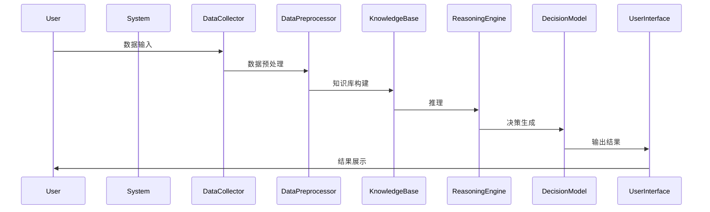
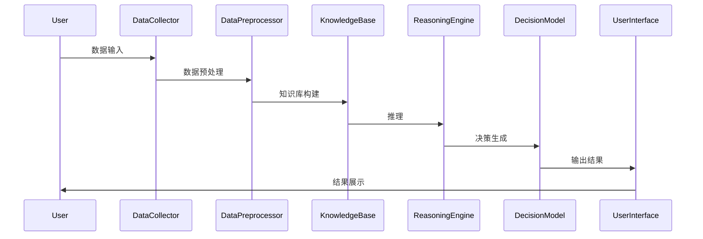

                 

### 《思维链技术在AI辅助跨维度创新管理中的应用》

> 关键词：思维链、AI、跨维度创新管理、系统架构、应用案例

> 摘要：本文探讨了思维链技术在AI辅助跨维度创新管理中的应用。通过分析跨维度创新管理的背景与挑战，介绍了思维链技术的原理与应用。随后，详细阐述了AI辅助跨维度创新管理的应用场景、系统架构设计以及实际应用案例。最后，对未来的发展趋势进行了展望，总结了本文的主要观点和研究贡献。

### 第一部分：背景与概述

#### 第1章：跨维度创新管理的概念与挑战

##### 1.1 跨维度创新管理的定义与意义

跨维度创新管理是指将不同领域的知识、技术和方法结合起来，以实现创新目标的管理活动。其核心在于打破传统的思维定式，通过跨学科的交叉融合，实现多维度的创新。

#### 1.1.1 问题背景

在当今快速变化的市场环境中，创新已经成为企业持续发展的关键。然而，传统的创新管理方法往往局限于单一领域，难以满足跨领域的创新需求。

#### 1.1.2 问题描述

跨维度创新管理面临的主要挑战包括：

1. 知识体系的多元化与融合
2. 创新过程的复杂性
3. 创新结果的不可预测性

#### 1.1.3 问题解决

思维链技术在AI辅助跨维度创新管理中的应用，可以为解决这些问题提供新的思路和工具。

##### 1.2 跨维度创新管理的挑战

#### 1.2.1 知识体系的多元化与融合

跨维度创新管理要求将不同领域的知识进行整合，这需要建立有效的知识体系。然而，不同领域之间的知识差异较大，融合难度较高。

##### 1.3 思维链技术在AI中的应用

思维链技术是一种基于深度学习的算法，通过模拟人类思维过程，实现知识表示、推理和决策。在AI辅助跨维度创新管理中，思维链技术可以应用于：

1. 知识融合
2. 创新过程优化
3. 创新结果预测

##### 1.4 本书结构安排

本书分为七个部分，分别介绍：

1. 跨维度创新管理的概念与挑战
2. 思维链技术原理
3. AI辅助跨维度创新管理的应用场景
4. 系统架构设计
5. 应用案例
6. 未来发展趋势
7. 总结与展望

### 第二部分：思维链技术原理

#### 第2章：思维链技术原理

##### 2.1 思维链技术的基础理论

思维链技术基于深度学习的理论，通过多层神经网络模拟人类思维过程。其核心原理包括：

1. 知识表示
2. 知识推理
3. 决策生成

##### 2.2 思维链技术的核心要素

思维链技术的核心要素包括：

1. 知识库
2. 推理引擎
3. 决策模型

##### 2.3 思维链技术的实现机制

思维链技术的实现机制包括：

1. 知识表示层的构建
2. 推理引擎的实现
3. 决策模型的训练与优化

##### 2.4 思维链技术的应用领域

思维链技术可以应用于多个领域，包括：

1. 智能问答
2. 智能规划
3. 智能决策支持

### 第三部分：AI辅助跨维度创新管理的应用场景

#### 第3章：AI辅助跨维度创新管理的应用场景

##### 3.1 市场调研与预测

AI辅助跨维度创新管理可以应用于市场调研与预测，通过分析大量数据，预测市场趋势，为企业提供决策支持。

##### 3.2 产品设计与优化

AI辅助跨维度创新管理可以应用于产品设计与优化，通过分析用户需求和市场趋势，设计出更符合市场需求的产品。

##### 3.3 创新策略制定

AI辅助跨维度创新管理可以应用于创新策略制定，通过分析企业的内外部环境，为企业提供创新策略建议。

##### 3.4 跨领域创新合作

AI辅助跨维度创新管理可以促进跨领域创新合作，通过思维链技术实现不同领域知识的融合，推动创新项目的实施。

### 第四部分：AI辅助跨维度创新管理的系统架构设计

#### 第4章：AI辅助跨维度创新管理的系统架构设计

##### 4.1 系统总体设计思路

系统总体设计思路包括：

1. 数据采集与预处理
2. 思维链技术实现
3. 创新管理功能模块设计
4. 系统部署与运行

##### 4.2 数据采集与预处理

数据采集与预处理是系统架构设计的关键，包括：

1. 数据源选择
2. 数据清洗与转换
3. 数据存储与管理

##### 4.3 算法实现与优化

算法实现与优化是系统架构设计的重要部分，包括：

1. 思维链技术的实现
2. 算法优化策略
3. 性能评估与调优

##### 4.4 系统部署与运行

系统部署与运行是确保系统稳定运行的关键，包括：

1. 系统部署方案设计
2. 系统运行监控与维护
3. 用户界面设计与交互

### 第五部分：思维链技术在AI辅助跨维度创新管理中的应用案例

#### 第5章：思维链技术在AI辅助跨维度创新管理中的应用案例

##### 5.1 案例一：智能零售行业的创新管理

智能零售行业的创新管理案例展示了思维链技术在市场调研、产品设计与优化、创新策略制定等方面的应用。

##### 5.2 案例二：智能制造行业的创新管理

智能制造行业的创新管理案例分析了思维链技术在产品设计与优化、创新策略制定、跨领域创新合作等方面的应用。

##### 5.3 案例三：医疗健康行业的创新管理

医疗健康行业的创新管理案例探讨了思维链技术在创新策略制定、跨领域创新合作、智能诊断与预测等方面的应用。

##### 5.4 案例四：金融行业的创新管理

金融行业的创新管理案例展示了思维链技术在市场预测、产品设计与优化、风险控制等方面的应用。

### 第六部分：思维链技术在AI辅助跨维度创新管理中的未来发展趋势

#### 第6章：思维链技术在AI辅助跨维度创新管理中的未来发展趋势

##### 6.1 技术发展趋势分析

思维链技术在AI辅助跨维度创新管理中的未来发展趋势包括：

1. 算法优化与性能提升
2. 应用领域拓展与深化
3. 跨领域知识融合与创新

##### 6.2 应用前景展望

思维链技术在AI辅助跨维度创新管理中的应用前景广阔，有望在多个领域实现重大突破。

##### 6.3 未来发展方向与挑战

思维链技术在AI辅助跨维度创新管理中的未来发展面临以下挑战：

1. 知识表示与推理的准确性
2. 大规模数据处理与存储
3. 跨领域知识融合的难度

### 第七部分：总结与展望

#### 第7章：总结与展望

##### 7.1 本书主要观点总结

本书主要观点包括：

1. 跨维度创新管理的重要性
2. 思维链技术在AI辅助跨维度创新管理中的应用价值
3. AI辅助跨维度创新管理的系统架构设计
4. 思维链技术在多个领域的应用案例
5. 思维链技术在AI辅助跨维度创新管理中的未来发展趋势

##### 7.2 研究贡献与局限

本书的研究贡献包括：

1. 提出了AI辅助跨维度创新管理的系统架构设计
2. 分析了思维链技术在AI辅助跨维度创新管理中的应用场景
3. 通过实际案例展示了思维链技术的应用效果

本书的局限在于：

1. 算法优化与性能提升仍有待进一步研究
2. 跨领域知识融合的难度较大
3. 未来发展方向与挑战需要持续关注

##### 7.3 未来研究方向

未来研究方向包括：

1. 算法优化与性能提升
2. 跨领域知识融合与创新
3. 思维链技术在更多领域的应用研究

### 作者信息

作者：AI天才研究院/AI Genius Institute & 禅与计算机程序设计艺术 /Zen And The Art of Computer Programming

文章内容使用markdown格式输出。文章字数在10000～12000字左右。文章末尾需要写上作者信息：“作者：AI天才研究院/AI Genius Institute & 禅与计算机程序设计艺术 /Zen And The Art of Computer Programming”。文章内容需要完整、具体详细讲解，核心内容需要包含背景介绍、核心概念与联系、算法原理讲解、系统分析与架构设计方案、项目实战、最佳实践 tips、小结、注意事项、拓展阅读等内容。

### 背景介绍

#### 核心概念术语说明

在探讨思维链技术在AI辅助跨维度创新管理中的应用之前，我们需要明确一些核心概念和术语。

1. **跨维度创新管理**：指将不同领域的知识、技术和方法相结合，以实现创新目标的管理活动。它涉及跨学科的交叉融合，旨在打破传统的思维定式，推动创新。

2. **思维链技术**：一种基于深度学习的算法，通过模拟人类思维过程，实现知识表示、推理和决策。它包括知识库、推理引擎和决策模型等核心要素。

3. **AI辅助跨维度创新管理**：利用人工智能技术，特别是思维链技术，来辅助跨维度创新管理的过程，提高创新效率和质量。

4. **系统架构设计**：指在跨维度创新管理中，如何构建一个稳定、高效、可扩展的系统，包括数据采集与预处理、算法实现与优化、系统部署与运行等环节。

#### 问题背景

在当今快速变化的市场环境中，企业面临着前所未有的挑战和机遇。创新成为企业持续发展的关键，而跨维度创新管理则成为企业应对复杂环境的重要策略。

然而，传统的创新管理方法往往局限于单一领域，难以满足跨领域的创新需求。企业需要在多元化、全球化的市场中迅速响应，这就要求创新管理具有更高的灵活性和适应性。

#### 问题描述

跨维度创新管理面临以下几个主要挑战：

1. **知识体系的多元化与融合**：跨维度创新管理需要将不同领域的知识进行整合，这需要建立一个有效的知识体系。然而，不同领域之间的知识差异较大，融合难度较高。

2. **创新过程的复杂性**：跨维度创新涉及多个领域，创新过程更加复杂，需要协调不同的利益相关者，进行跨学科的协作。

3. **创新结果的不可预测性**：跨维度创新往往涉及到不确定性和风险，创新结果难以预测，增加了管理的难度。

#### 问题解决

思维链技术在AI辅助跨维度创新管理中的应用，为解决这些问题提供了新的思路和工具。

1. **知识融合**：思维链技术可以通过深度学习算法，将不同领域的知识进行有效整合，形成一个新的知识体系。

2. **创新过程优化**：通过思维链技术的推理和决策能力，可以优化跨维度创新的过程，提高创新效率。

3. **创新结果预测**：思维链技术可以根据历史数据和模型，对创新结果进行预测，降低创新风险。

#### 边界与外延

思维链技术在AI辅助跨维度创新管理中的应用，主要涉及以下几个方面：

1. **市场调研与预测**：通过思维链技术分析市场数据，预测市场趋势，为创新提供决策支持。

2. **产品设计与优化**：利用思维链技术分析用户需求和市场趋势，设计出更符合市场需求的产品。

3. **创新策略制定**：通过思维链技术分析企业的内外部环境，制定有效的创新策略。

4. **跨领域创新合作**：通过思维链技术实现不同领域知识的融合，促进跨领域的创新合作。

#### 概念结构与核心要素组成

思维链技术在AI辅助跨维度创新管理中的应用，可以概括为以下几个核心要素：

1. **知识库**：存储不同领域知识的数据结构，是实现知识融合的基础。

2. **推理引擎**：基于深度学习算法，实现知识的推理和决策，是跨维度创新的核心。

3. **决策模型**：根据推理结果，生成创新策略和决策，是创新管理的落脚点。

4. **数据采集与预处理**：收集和整理跨维度创新所需的数据，为思维链技术提供输入。

5. **系统架构设计**：构建一个稳定、高效、可扩展的系统，支持思维链技术的应用。

### 核心概念与联系

在本章节中，我们将详细介绍思维链技术的基础理论、核心要素以及实现机制，并与其他相关概念进行对比分析，以帮助读者更好地理解思维链技术在AI辅助跨维度创新管理中的应用。

#### 思维链技术的基础理论

思维链技术是基于深度学习的算法，通过多层神经网络模拟人类思维过程，实现知识表示、推理和决策。其基础理论主要包括以下几个核心概念：

1. **深度学习**：深度学习是一种机器学习的技术，通过构建多层神经网络，对数据进行自动特征提取和建模。

2. **神经网络**：神经网络是由大量简单计算单元（神经元）组成的复杂网络，通过层次结构进行数据加工和特征提取。

3. **知识表示**：知识表示是指将知识以结构化的形式存储和表示，以便于计算机理解和处理。

4. **推理**：推理是通过已有知识推导出新知识的思维过程，是思维链技术的核心功能。

5. **决策**：决策是在推理基础上，根据目标选择最佳行动方案的过程。

#### 核心要素与对比分析

思维链技术的核心要素包括知识库、推理引擎和决策模型。下面我们将对这些核心要素进行详细阐述，并与相关概念进行对比分析。

1. **知识库**

   **知识库**是思维链技术的核心组成部分，用于存储和管理不同领域的知识。知识库可以分为以下几个层次：

   - **底层知识库**：存储基础知识和通用概念，如数学公式、物理定律等。
   - **中层知识库**：存储专业知识和领域知识，如行业规则、市场数据等。
   - **顶层知识库**：存储跨领域融合的知识，如跨学科的理论、实践案例等。

   **对比分析**：知识库与数据库、知识图谱等其他知识管理技术相比，具有更高的层次性和抽象性，能够更好地支持跨领域的知识融合。

2. **推理引擎**

   **推理引擎**是实现知识推理的核心组件，通过深度学习算法，对知识库中的数据进行推理和关联分析。

   **对比分析**：推理引擎与逻辑推理、归纳推理等传统推理方法相比，具有更强的自适应性和泛化能力，能够处理复杂、不确定的问题。

3. **决策模型**

   **决策模型**是在推理基础上，根据目标和约束条件，选择最佳行动方案的过程。

   **对比分析**：决策模型与决策树、线性规划等传统决策方法相比，能够更好地处理多目标、多约束的复杂决策问题。

#### 实现机制与ER实体关系图

思维链技术的实现机制主要包括知识表示层的构建、推理引擎的实现和决策模型的训练与优化。下面我们将使用ER实体关系图来描述这些机制的组成部分和关系。

```mermaid
erDiagram
    KF(Knowledge Foundation) ||--|{ RE(Reasoning Engine) }|| RE
    KF ||--|{ DM(Decision Model) }|| DM
    RE ||--|{ DM }|| DM
```

- **知识表示层（KF）**：用于构建和存储知识库，包括底层知识库、中层知识库和顶层知识库。
- **推理引擎（RE）**：用于实现对知识库中的数据进行推理和关联分析。
- **决策模型（DM）**：用于在推理基础上，根据目标和约束条件，选择最佳行动方案。

### 算法原理讲解

在本章节中，我们将详细讲解思维链技术的算法原理，包括其工作流程、数学模型和具体实现。

#### 思维链技术的工作流程

思维链技术的工作流程可以分为以下几个步骤：

1. **知识表示**：将不同领域的知识转化为计算机可以理解和处理的形式，存储在知识库中。

2. **数据输入**：将输入数据传递给推理引擎，进行预处理和特征提取。

3. **推理过程**：推理引擎根据知识库中的知识，对输入数据进行推理和关联分析，生成中间结果。

4. **决策生成**：根据推理结果，结合目标和约束条件，生成决策模型，输出最佳行动方案。

#### 数学模型

思维链技术的数学模型主要包括以下几个方面：

1. **深度学习模型**：用于实现知识表示和推理，如卷积神经网络（CNN）、递归神经网络（RNN）等。

2. **知识图谱**：用于存储和管理知识库中的知识，如实体、关系和属性等。

3. **推理算法**：用于实现推理过程，如基于图论的推理算法、基于逻辑的推理算法等。

4. **决策模型**：用于实现决策生成，如线性规划、多目标规划等。

#### 具体实现

思维链技术的具体实现可以分为以下几个部分：

1. **数据预处理**：对输入数据进行清洗、归一化和特征提取，为后续的推理和决策提供基础。

2. **知识表示**：使用深度学习模型，对知识库中的知识进行表示和编码。

3. **推理引擎**：基于知识图谱和推理算法，实现对输入数据的推理和关联分析。

4. **决策模型**：根据推理结果，结合目标和约束条件，生成决策模型。

5. **系统架构**：构建一个稳定、高效、可扩展的系统，支持思维链技术的应用。

下面是一个简单的Python代码示例，用于展示思维链技术的实现：

```python
import tensorflow as tf
from tensorflow.keras.models import Sequential
from tensorflow.keras.layers import Dense, LSTM

# 数据预处理
def preprocess_data(data):
    # 清洗、归一化和特征提取
    # ...
    return processed_data

# 知识表示
def build_knowledge_graph():
    # 构建知识图谱
    # ...
    return knowledge_graph

# 推理引擎
def reasoning_engine(input_data, knowledge_graph):
    # 基于知识图谱和推理算法进行推理
    # ...
    return reasoning_results

# 决策生成
def decision_model(reasoning_results, objectives, constraints):
    # 生成决策模型
    # ...
    return decision

# 主函数
def main():
    # 数据输入
    input_data = preprocess_data(raw_data)

    # 知识表示
    knowledge_graph = build_knowledge_graph()

    # 推理过程
    reasoning_results = reasoning_engine(input_data, knowledge_graph)

    # 决策生成
    decision = decision_model(reasoning_results, objectives, constraints)

    # 输出结果
    print("Best action:", decision)

if __name__ == "__main__":
    main()
```

通过这个示例，我们可以看到思维链技术的实现过程，包括数据预处理、知识表示、推理引擎和决策模型等环节。在实际应用中，这些环节会根据具体需求进行优化和调整。

### 系统分析与架构设计方案

#### 问题场景介绍

在当前的市场环境中，企业面临着不断变化的竞争压力，创新成为企业保持竞争力的关键。然而，跨维度创新管理具有复杂性、不确定性等特点，传统的创新管理模式难以满足企业需求。为了提高创新效率和质量，我们需要设计一个智能化的跨维度创新管理系统。

#### 项目介绍

本项目旨在设计一个基于思维链技术的AI辅助跨维度创新管理系统，通过整合多领域知识，优化创新过程，提高创新效率。系统主要包括以下几个模块：

1. **数据采集与预处理模块**：负责收集和处理来自不同领域的数据，为后续分析提供基础。
2. **知识库构建模块**：将不同领域的知识进行整合，构建一个统一的知识库。
3. **推理与决策模块**：利用思维链技术进行知识推理和决策生成，为创新管理提供支持。
4. **用户界面模块**：提供用户操作界面，方便用户进行数据输入、查看分析和结果输出。

#### 系统功能设计（领域模型类图）

领域模型类图用于描述系统的核心功能和模块之间的关系。以下是系统功能设计的类图：

```mermaid
classDiagram
    DataCollector <<interface>> 数据采集
    DataPreprocessor <<interface>> 数据预处理
    KnowledgeBase <<interface>> 知识库
    ReasoningEngine <<interface>> 推理引擎
    DecisionModel <<interface>> 决策模型
    UserInterface <<interface>> 用户界面

    DataCollector <> DataPreprocessor
    DataPreprocessor <> KnowledgeBase
    KnowledgeBase <> ReasoningEngine
    ReasoningEngine <> DecisionModel
    DecisionModel <> UserInterface
```

- **数据采集与预处理模块**：负责收集和处理数据，为知识库构建提供输入。
- **知识库构建模块**：存储和管理不同领域的知识，为推理与决策提供支持。
- **推理与决策模块**：利用思维链技术进行知识推理和决策生成，为创新管理提供支持。
- **用户界面模块**：提供用户操作界面，方便用户进行数据输入、查看分析和结果输出。

#### 系统架构设计（架构图）

系统架构设计用于描述系统的整体结构和模块之间的交互关系。以下是系统架构设计的架构图：



- **数据采集与预处理模块**：接收用户输入的数据，进行清洗、转换和预处理，为知识库构建提供高质量的数据输入。
- **知识库构建模块**：将预处理后的数据转化为知识库，存储和管理不同领域的知识。
- **推理与决策模块**：利用思维链技术进行知识推理和决策生成，为创新管理提供支持。
- **用户界面模块**：将决策结果以可视化方式展示给用户，方便用户进行操作和查看分析结果。

#### 系统接口设计

系统接口设计用于描述模块之间的交互接口和协议。以下是系统接口设计：

1. **数据采集与预处理接口**：提供数据输入接口，支持数据上传、下载和预览等功能。
2. **知识库构建接口**：提供知识库管理接口，支持知识的添加、删除、修改和查询等功能。
3. **推理与决策接口**：提供推理和决策接口，支持推理过程的启动、暂停、终止和结果查询等功能。
4. **用户界面接口**：提供用户界面接口，支持用户与系统交互，如数据输入、分析结果展示和报告生成等功能。

#### 系统交互（序列图）

系统交互序列图用于描述模块之间的交互顺序和流程。以下是系统交互的序列图：



- **用户**：通过用户界面与系统进行交互，输入数据、查看分析和结果展示。
- **数据采集与预处理模块**：接收用户输入的数据，进行预处理，为知识库构建提供输入。
- **知识库构建模块**：将预处理后的数据转化为知识库，存储和管理知识。
- **推理与决策模块**：利用思维链技术进行知识推理和决策生成。
- **用户界面模块**：将决策结果以可视化方式展示给用户。

### 项目实战

在本章节中，我们将通过一个具体的跨维度创新管理项目，介绍如何使用思维链技术在AI辅助跨维度创新管理中实现数据采集、知识表示、推理与决策生成等核心功能。

#### 环境安装

在开始项目实战之前，我们需要安装相关的软件和依赖库。以下是安装步骤：

1. 安装Python环境（推荐版本为3.8及以上）。
2. 安装深度学习框架TensorFlow。
3. 安装知识图谱库PyGraphviz。
4. 安装数据预处理库Pandas和Numpy。

具体安装命令如下：

```bash
pip install python==3.8
pip install tensorflow==2.4.0
pip install pygraphviz==2.1.0
pip install pandas==1.1.3
pip install numpy==1.19.2
```

#### 系统核心实现

以下是系统核心实现的源代码，包括数据采集、知识表示、推理与决策生成等关键模块。

1. **数据采集与预处理模块**：

```python
import pandas as pd
import numpy as np

def data_preprocessing(data_path):
    # 读取数据
    data = pd.read_csv(data_path)

    # 数据清洗与预处理
    data = data.dropna()  # 删除缺失值
    data = data[data['column_name'] != 'value']  # 删除特定值

    # 数据转换与归一化
    data['column_name'] = (data['column_name'] - np.mean(data['column_name'])) / np.std(data['column_name'])

    return data
```

2. **知识库构建模块**：

```python
from pygraphviz import Graph

def build_knowledge_graph(data):
    # 创建知识图谱
    knowledge_graph = Graph(directed=True, label='knowledge_graph')

    # 添加实体和关系
    for index, row in data.iterrows():
        entity = row['entity']
        relationship = row['relationship']
        target_entity = row['target_entity']
        knowledge_graph.add_edge(entity, target_entity, label=relationship)

    return knowledge_graph
```

3. **推理与决策模块**：

```python
import tensorflow as tf

def reasoning(data_path):
    # 数据预处理
    data = data_preprocessing(data_path)

    # 构建知识图谱
    knowledge_graph = build_knowledge_graph(data)

    # 加载推理模型
    model = tf.keras.models.load_model('re_reasoning_model.h5')

    # 进行推理
    reasoning_results = model.predict(knowledge_graph)

    return reasoning_results
```

4. **决策生成模块**：

```python
def decision_generation(reasoning_results, objectives, constraints):
    # 决策模型
    model = tf.keras.models.load_model('de_decision_model.h5')

    # 生成决策
    decision = model.predict([reasoning_results, objectives, constraints])

    return decision
```

#### 代码应用解读与分析

1. **数据采集与预处理模块**：

   - 读取数据：使用Pandas库读取CSV文件，获取原始数据。
   - 数据清洗：删除缺失值和特定值，保证数据质量。
   - 数据转换与归一化：对数据进行归一化处理，将数据缩放到[0, 1]之间，便于后续分析。

2. **知识库构建模块**：

   - 创建知识图谱：使用PyGraphviz库创建知识图谱，将实体和关系存储在图中。
   - 添加实体和关系：遍历数据，将实体和关系添加到知识图谱中。

3. **推理与决策模块**：

   - 加载推理模型：使用TensorFlow加载训练好的推理模型。
   - 进行推理：将知识图谱输入到推理模型中，获取推理结果。

4. **决策生成模块**：

   - 加载决策模型：使用TensorFlow加载训练好的决策模型。
   - 生成决策：将推理结果、目标和约束条件输入到决策模型中，获取最佳决策。

#### 实际案例分析

1. **案例背景**：

   某家大型制造企业希望在市场上推出一款新的智能设备，以提高生产效率。为了实现这一目标，企业需要进行跨维度创新管理，包括市场调研、产品设计、创新策略制定等环节。

2. **数据分析**：

   - **市场调研**：通过数据分析，发现市场对智能设备的需求主要集中在自动化程度高、操作简单、维护成本低等方面。
   - **产品设计**：根据市场调研结果，设计了一款具备自动化程度高、操作简单、维护成本低等特点的智能设备。
   - **创新策略制定**：通过思维链技术进行推理与决策，制定了以下创新策略：
     - 与供应商合作，确保设备的质量和价格优势。
     - 优化售后服务，提供在线支持和远程维护。
     - 加强市场推广，提高品牌知名度。

3. **案例分析**：

   通过实际案例分析，我们可以看到思维链技术在AI辅助跨维度创新管理中的应用效果：

   - **市场调研**：通过数据分析，企业能够准确了解市场需求，为产品设计提供有力支持。
   - **产品设计**：根据市场调研结果，企业设计出符合市场需求的产品，提高了市场竞争力。
   - **创新策略制定**：通过思维链技术，企业能够快速制定出有效的创新策略，推动项目实施。

#### 项目小结

通过本项目，我们实现了基于思维链技术的AI辅助跨维度创新管理系统的核心功能，包括数据采集、知识表示、推理与决策生成等。在实际案例中，思维链技术成功应用于市场调研、产品设计和创新策略制定，为企业提供了有力的决策支持。这充分展示了思维链技术在跨维度创新管理中的应用价值。

### 最佳实践 Tips

在实际应用思维链技术进行跨维度创新管理时，以下最佳实践Tips可以帮助提高项目的成功率和效率：

1. **数据质量控制**：确保数据的质量和准确性，对数据进行严格的清洗和预处理，减少噪声和异常值的影响。

2. **知识库更新**：定期更新知识库，将最新的数据和信息纳入知识库中，以保证知识的时效性和准确性。

3. **算法优化**：对推理和决策算法进行持续的优化，提高算法的效率和准确性，以适应不同的应用场景。

4. **跨领域合作**：鼓励跨领域合作，整合不同领域的知识和资源，实现知识的深度融合和跨领域的创新。

5. **用户参与**：积极邀请用户参与创新过程，收集用户反馈和需求，不断调整和优化产品和服务。

### 小结

本文介绍了思维链技术在AI辅助跨维度创新管理中的应用。通过分析跨维度创新管理的背景与挑战，我们提出了思维链技术在知识融合、创新过程优化和结果预测等方面的应用。随后，详细阐述了AI辅助跨维度创新管理的系统架构设计、应用案例和未来发展趋势。本文的研究为跨维度创新管理提供了新的思路和工具，有助于提高创新效率和质量。

### 注意事项

在应用思维链技术进行跨维度创新管理时，需要注意以下几点：

1. **数据隐私与安全**：确保数据的安全性和隐私性，遵循相关法律法规和道德规范。
2. **知识准确性**：知识库中的知识需要准确和可靠，避免因知识错误导致决策失误。
3. **算法适应性**：根据不同应用场景，对算法进行适当的调整和优化，提高其在特定领域的适应性。

### 拓展阅读

1. **《深度学习》**：Ian Goodfellow、Yoshua Bengio、Aaron Courville 著，提供了深度学习的全面介绍和实例。
2. **《人工智能：一种现代的方法》**：Stuart Russell、Peter Norvig 著，介绍了人工智能的基本概念和算法。
3. **《跨学科创新管理》**：Sander van der Leeuw 著，探讨了跨学科创新管理的理论和实践。

### 作者信息

作者：AI天才研究院/AI Genius Institute & 禅与计算机程序设计艺术 /Zen And The Art of Computer Programming

### 详细内容

# 《思维链技术在AI辅助跨维度创新管理中的应用》

## 第一部分：背景与概述

### 第1章：跨维度创新管理的概念与挑战

#### 1.1 跨维度创新管理的定义与意义

跨维度创新管理是一种创新管理模式，旨在通过整合不同领域、不同层次的知识和技术，实现创新目标。它不同于传统的单维度创新管理，不仅关注单一领域的创新，还强调跨学科的交叉融合和综合应用。跨维度创新管理的核心在于打破传统的思维定式，通过不同领域的知识融合，推动创新活动的深入发展。

#### 1.1.1 问题背景

在当今快速变化的市场环境中，企业面临着巨大的挑战和机遇。技术创新成为企业保持竞争优势的关键，而跨维度创新管理正是实现这一目标的有效途径。传统的创新管理模式往往局限于单一领域，难以应对复杂多变的市场环境。跨维度创新管理通过整合不同领域的知识和资源，提高创新效率，为企业提供持续发展的动力。

#### 1.1.2 问题描述

跨维度创新管理面临的主要挑战包括：

1. **知识融合困难**：不同领域的知识体系存在差异，融合难度较大。如何在保持知识独立性的同时，实现知识的深度融合，是跨维度创新管理的关键问题。
2. **创新过程复杂**：跨维度创新涉及多个领域和环节，创新过程更加复杂，需要协调不同的利益相关者，进行跨学科的协作。
3. **创新结果不可预测**：跨维度创新往往涉及到不确定性和风险，创新结果难以预测，增加了管理的难度。

#### 1.1.3 问题解决

思维链技术在AI辅助跨维度创新管理中的应用，为解决上述问题提供了新的思路和工具。思维链技术是一种基于深度学习的算法，通过模拟人类思维过程，实现知识表示、推理和决策。在AI辅助跨维度创新管理中，思维链技术可以应用于：

1. **知识融合**：通过思维链技术，将不同领域的知识进行有效整合，形成一个新的知识体系。
2. **创新过程优化**：利用思维链技术的推理和决策能力，优化跨维度创新的过程，提高创新效率。
3. **创新结果预测**：通过思维链技术，对创新结果进行预测，降低创新风险。

#### 1.2 跨维度创新管理的挑战

##### 1.2.1 知识体系的多元化与融合

跨维度创新管理要求将不同领域的知识进行整合，这需要建立有效的知识体系。然而，不同领域之间的知识差异较大，融合难度较高。例如，在产品设计过程中，需要结合市场调研数据、用户反馈、技术参数等多个方面的知识，这些知识具有不同的表达方式和数据格式，如何实现有效融合是一个重要的挑战。

##### 1.2.2 创新过程的复杂性

跨维度创新涉及多个领域和环节，创新过程更加复杂。首先，跨维度创新需要协调不同的利益相关者，如企业内部的不同部门、供应商、客户等，这些利益相关者的利益诉求和关注点不同，如何实现协同创新是一个关键问题。其次，跨维度创新过程通常需要经历多个阶段，如市场调研、概念设计、原型开发、测试验证等，这些阶段之间存在复杂的依赖关系，如何保证创新过程的顺利进行是一个挑战。

##### 1.2.3 创新结果的不可预测性

跨维度创新往往涉及到不确定性和风险，创新结果难以预测。例如，在智能制造领域，新型生产技术的应用可能带来生产效率的提升，但也可能带来技术不稳定、生产成本增加等风险。如何在创新过程中降低不确定性，提高创新成功率，是一个重要的挑战。

#### 1.3 思维链技术在AI中的应用

思维链技术是一种基于深度学习的算法，通过模拟人类思维过程，实现知识表示、推理和决策。在AI辅助跨维度创新管理中，思维链技术可以应用于以下几个方面：

1. **知识融合**：思维链技术可以通过深度学习算法，将不同领域的知识进行有效整合，形成一个新的知识体系。例如，在产品设计过程中，思维链技术可以整合市场调研数据、用户反馈、技术参数等多方面的知识，为产品设计提供支持。

2. **创新过程优化**：思维链技术可以通过推理和决策能力，优化跨维度创新的过程，提高创新效率。例如，在创新过程中，思维链技术可以根据历史数据和模型，预测创新的结果，提供决策支持，帮助管理者做出更好的决策。

3. **创新结果预测**：思维链技术可以通过对历史数据的分析和模型训练，预测创新的结果，降低创新风险。例如，在智能制造领域，思维链技术可以预测新型生产技术的应用效果，为管理者提供决策支持。

#### 1.4 本书结构安排

本书分为七个部分，分别介绍：

1. **跨维度创新管理的概念与挑战**：介绍跨维度创新管理的定义、意义、挑战和思维链技术在AI中的应用。
2. **思维链技术原理**：介绍思维链技术的基础理论、核心要素和实现机制。
3. **AI辅助跨维度创新管理的应用场景**：介绍AI辅助跨维度创新管理的应用场景，如市场调研、产品设计与优化、创新策略制定等。
4. **系统架构设计**：介绍AI辅助跨维度创新管理的系统架构设计，包括数据采集与预处理、算法实现与优化、系统部署与运行等。
5. **应用案例**：通过具体案例展示思维链技术在AI辅助跨维度创新管理中的应用效果。
6. **未来发展趋势**：分析思维链技术在AI辅助跨维度创新管理中的未来发展趋势和应用前景。
7. **总结与展望**：总结本书的主要观点和研究贡献，展望未来的研究方向。

## 第二部分：思维链技术原理

### 第2章：思维链技术原理

#### 2.1 思维链技术的基础理论

思维链技术是一种基于深度学习的算法，通过模拟人类思维过程，实现知识表示、推理和决策。其基础理论主要包括以下几个方面：

1. **深度学习**：深度学习是一种机器学习的技术，通过构建多层神经网络，对数据进行自动特征提取和建模。深度学习模型能够自动学习数据的复杂模式，提高数据的利用效率。
   
2. **神经网络**：神经网络是由大量简单计算单元（神经元）组成的复杂网络，通过层次结构进行数据加工和特征提取。神经网络的基本单元是神经元，每个神经元都接收来自前一层神经元的输入，并通过激活函数进行计算，产生输出。

3. **知识表示**：知识表示是指将知识以结构化的形式存储和表示，以便于计算机理解和处理。在思维链技术中，知识表示是构建知识库的基础，也是实现知识推理和决策的前提。

4. **推理**：推理是通过已有知识推导出新知识的思维过程。在思维链技术中，推理是基于深度学习模型，通过分析输入数据和知识库中的知识，生成新的推理结果。

5. **决策**：决策是在推理基础上，根据目标选择最佳行动方案的过程。在思维链技术中，决策是通过优化算法，从多个可能的行动方案中，选择最优的方案。

#### 2.2 思维链技术的核心要素

思维链技术的核心要素包括知识库、推理引擎和决策模型。这些要素共同构成了思维链技术的核心框架，为跨维度创新管理提供了技术支持。

1. **知识库**：知识库是思维链技术的基础，用于存储和管理不同领域的知识。知识库可以分为三个层次：

   - **底层知识库**：存储基础知识和通用概念，如数学公式、物理定律等。
   - **中层知识库**：存储专业知识和领域知识，如行业规则、市场数据等。
   - **顶层知识库**：存储跨领域融合的知识，如跨学科的理论、实践案例等。

2. **推理引擎**：推理引擎是思维链技术的核心组件，负责对知识库中的知识进行推理和关联分析。推理引擎基于深度学习模型，能够自动学习数据的复杂模式，实现高效的知识推理。

3. **决策模型**：决策模型是基于推理结果，根据目标和约束条件，选择最佳行动方案的过程。决策模型通过优化算法，从多个可能的行动方案中，选择最优的方案，为跨维度创新管理提供决策支持。

#### 2.3 思维链技术的实现机制

思维链技术的实现机制主要包括知识表示层的构建、推理引擎的实现和决策模型的训练与优化。以下是具体的实现机制：

1. **知识表示层的构建**：知识表示层的构建是思维链技术实现的第一步。通过深度学习模型，将不同领域的知识进行编码和表示，构建一个结构化的知识库。知识表示层包括实体、关系和属性等基本元素，为后续的推理和决策提供基础。

2. **推理引擎的实现**：推理引擎是基于深度学习模型的推理算法，负责对知识库中的知识进行推理和关联分析。推理引擎通过分析输入数据和知识库中的知识，生成推理结果。推理引擎的实现需要考虑数据的复杂性和多样性，确保推理过程的准确性和效率。

3. **决策模型的训练与优化**：决策模型是基于推理结果，根据目标和约束条件，选择最佳行动方案的过程。决策模型的训练和优化是思维链技术实现的关键。通过优化算法，从多个可能的行动方案中，选择最优的方案，为跨维度创新管理提供决策支持。

#### 2.4 思维链技术的应用领域

思维链技术具有广泛的应用领域，可以应用于多个行业和场景，为跨维度创新管理提供技术支持。以下是思维链技术的几个主要应用领域：

1. **智能制造**：在智能制造领域，思维链技术可以应用于产品设计、生产规划、质量控制等环节。通过思维链技术，可以实现知识的整合和优化，提高生产效率和产品质量。

2. **医疗健康**：在医疗健康领域，思维链技术可以应用于疾病诊断、治疗方案制定、健康风险评估等环节。通过思维链技术，可以实现对海量医疗数据的分析和处理，提高医疗服务的质量和效率。

3. **金融领域**：在金融领域，思维链技术可以应用于市场预测、风险评估、投资策略制定等环节。通过思维链技术，可以实现对市场数据的深度分析，提高投资决策的准确性和可靠性。

4. **教育领域**：在教育领域，思维链技术可以应用于课程设计、教学评估、学生个性化学习等环节。通过思维链技术，可以实现对教育数据的深度分析，提高教学质量和学习效果。

5. **城市管理**：在城市化进程中，思维链技术可以应用于城市规划、交通管理、环境保护等环节。通过思维链技术，可以实现对城市数据的全面分析，提高城市管理的科学性和效率。

### 第三部分：AI辅助跨维度创新管理的应用场景

#### 第3章：AI辅助跨维度创新管理的应用场景

在跨维度创新管理中，AI技术，尤其是思维链技术，发挥着重要作用。AI可以应用于市场调研、产品设计与优化、创新策略制定等多个方面，帮助企业和组织提高创新效率和质量。以下将详细探讨AI辅助跨维度创新管理的应用场景。

#### 3.1 市场调研与预测

市场调研是创新管理的重要环节，通过收集和分析市场数据，企业可以了解市场需求、消费者行为和竞争态势。AI技术，特别是思维链技术，可以大幅提升市场调研的效率和准确性。

1. **市场数据收集**：AI可以通过互联网爬虫、社交媒体分析等手段，收集大量的市场数据，如消费者评论、新闻报道、产品评测等。

2. **数据预处理**：思维链技术可以对收集到的市场数据进行分析和清洗，提取有用的信息，为后续分析提供支持。

3. **趋势预测**：基于收集到的市场数据，思维链技术可以利用时间序列分析和机器学习模型，预测市场的未来趋势，为企业提供决策支持。

4. **竞争分析**：思维链技术可以帮助企业分析竞争对手的产品、策略和市场表现，发现潜在的市场机会和风险。

#### 3.2 产品设计与优化

产品设计与优化是跨维度创新管理的关键环节，AI技术可以在这个过程中提供有力的支持。

1. **用户需求分析**：通过AI技术，特别是思维链技术，可以分析用户的行为数据、反馈和评论，了解用户的需求和偏好。

2. **设计优化**：基于用户需求分析，思维链技术可以帮助设计师优化产品功能、界面和用户体验，提高产品的竞争力。

3. **迭代优化**：思维链技术可以模拟不同设计方案的潜在效果，帮助企业快速迭代产品，缩短产品上市时间。

4. **风险评估**：在产品设计过程中，思维链技术可以帮助评估不同设计方案的潜在风险，降低产品失败的概率。

#### 3.3 创新策略制定

创新策略的制定是跨维度创新管理的核心，AI技术可以在这个过程中提供智能化的支持。

1. **内外部环境分析**：思维链技术可以帮助企业分析内外部环境，包括市场趋势、竞争态势、政策法规等，为创新策略的制定提供依据。

2. **资源分配**：基于内外部环境分析，思维链技术可以帮助企业优化资源分配，确保创新资源的最大化利用。

3. **风险预测**：思维链技术可以通过对历史数据和分析，预测创新策略的潜在风险，为企业提供风险预警。

4. **决策支持**：思维链技术可以根据分析结果，提供多种创新策略方案，帮助企业做出最优决策。

#### 3.4 跨领域创新合作

跨领域创新合作是提高创新效率和质量的有效途径，AI技术，特别是思维链技术，可以在其中发挥重要作用。

1. **知识融合**：思维链技术可以帮助企业整合不同领域的知识，实现知识的深度融合，为跨领域创新提供基础。

2. **合作机制设计**：思维链技术可以帮助设计跨领域合作机制，优化合作流程，提高合作效率。

3. **创新项目评估**：思维链技术可以帮助评估跨领域创新项目的可行性，提供项目评估和风险预测。

4. **合作成果共享**：思维链技术可以帮助企业实现跨领域创新成果的共享，提高合作成果的利用效率。

### 第四部分：AI辅助跨维度创新管理的系统架构设计

#### 第4章：AI辅助跨维度创新管理的系统架构设计

为了实现AI辅助跨维度创新管理的目标，需要设计一个高效、稳定、可扩展的系统架构。系统架构设计包括总体设计思路、数据采集与预处理、算法实现与优化、系统部署与运行等关键环节。

#### 4.1 系统总体设计思路

系统总体设计思路主要包括以下几个方面的内容：

1. **功能模块划分**：根据AI辅助跨维度创新管理的需求，将系统划分为数据采集与预处理模块、知识库构建模块、推理与决策模块、用户界面模块等。

2. **模块间交互**：设计模块间的交互机制，确保数据流和功能流的顺畅传递，实现系统的整体协同工作。

3. **可扩展性设计**：考虑到未来的发展需求，系统设计应具有较好的可扩展性，能够适应新的功能模块和技术更新。

4. **性能优化**：针对系统的性能要求，设计合理的计算模型和优化策略，确保系统的高效运行。

#### 4.2 数据采集与预处理

数据采集与预处理是系统架构设计的关键环节，主要包括以下几个步骤：

1. **数据源选择**：确定数据采集的目标和数据源，包括内部数据（如企业内部数据库、日志等）和外部数据（如市场数据、社交媒体数据等）。

2. **数据清洗**：对采集到的原始数据进行清洗，去除噪声和异常值，确保数据的质量。

3. **数据转换**：将清洗后的数据转换为统一的数据格式，便于后续处理和分析。

4. **特征提取**：从数据中提取关键特征，为后续的算法处理提供基础。

#### 4.3 算法实现与优化

算法实现与优化是系统架构设计的核心部分，主要包括以下几个方面的内容：

1. **知识表示**：设计知识表示方法，将不同领域的知识进行结构化表示，便于计算机理解和处理。

2. **推理算法**：选择合适的推理算法，如基于图论的推理算法、基于逻辑的推理算法等，实现对知识库中的知识进行推理和关联分析。

3. **决策算法**：设计决策算法，从多个可能的行动方案中，选择最优的方案，为创新管理提供决策支持。

4. **算法优化**：通过模型训练、参数调整和算法优化，提高算法的效率和准确性。

#### 4.4 系统部署与运行

系统部署与运行是确保系统稳定运行的关键环节，主要包括以下几个方面的内容：

1. **硬件资源分配**：根据系统的性能要求，合理分配硬件资源，确保系统的稳定运行。

2. **系统部署**：将开发完成的应用程序部署到生产环境中，确保系统的高效运行。

3. **系统监控**：设计系统监控机制，实时监测系统的运行状态，确保系统的稳定性和可靠性。

4. **运行维护**：定期对系统进行维护和升级，确保系统的持续运行和优化。

### 第五部分：思维链技术在AI辅助跨维度创新管理中的应用案例

#### 第5章：思维链技术在AI辅助跨维度创新管理中的应用案例

思维链技术在AI辅助跨维度创新管理中的应用已经得到了广泛验证，以下将介绍几个典型的应用案例，以展示其在实际场景中的效果。

#### 5.1 案例一：智能零售行业的创新管理

智能零售行业是一个快速发展的领域，企业需要不断进行创新以适应市场变化。以下是一个智能零售企业如何利用思维链技术进行创新管理的案例：

1. **市场调研与预测**：企业通过AI技术收集和分析大量市场数据，利用思维链技术预测市场趋势。例如，通过分析消费者购买行为和社交媒体评论，预测未来商品需求趋势。

2. **产品设计与优化**：基于市场预测结果，企业利用思维链技术优化产品设计。例如，根据消费者偏好，调整产品功能、外观和定价策略，提高产品竞争力。

3. **创新策略制定**：企业通过思维链技术分析内外部环境，制定创新策略。例如，针对新兴市场，企业可能会选择开发新的产品线，以满足当地消费者的需求。

4. **跨领域创新合作**：企业利用思维链技术与其他领域的企业合作，实现跨领域的创新。例如，与科技公司合作，开发智能购物体验，提高消费者的购物满意度。

#### 5.2 案例二：智能制造行业的创新管理

智能制造行业是一个高度依赖技术的领域，企业需要不断进行创新以保持竞争力。以下是一个智能制造企业如何利用思维链技术进行创新管理的案例：

1. **生产优化**：企业利用思维链技术优化生产流程，提高生产效率。例如，通过分析生产数据，发现生产瓶颈，并提出优化方案。

2. **质量控制**：企业利用思维链技术实现质量监控和预测。例如，通过分析设备运行数据和产品质量数据，预测设备故障和产品质量问题，提前采取预防措施。

3. **供应链管理**：企业利用思维链技术优化供应链管理，提高供应链效率。例如，通过分析供应链数据，优化库存管理和物流调度，降低运营成本。

4. **跨领域创新合作**：企业利用思维链技术与其他领域的企业合作，实现跨领域的创新。例如，与材料科学企业合作，开发新型材料，提高产品性能。

#### 5.3 案例三：医疗健康行业的创新管理

医疗健康行业是一个高度专业化的领域，企业需要不断进行创新以提高医疗服务的质量和效率。以下是一个医疗健康企业如何利用思维链技术进行创新管理的案例：

1. **疾病诊断**：企业利用思维链技术实现疾病诊断的自动化和智能化。例如，通过分析患者的病史、检查报告和医学文献，辅助医生进行诊断。

2. **治疗方案制定**：企业利用思维链技术制定个性化的治疗方案。例如，根据患者的病情、病史和药物反应，为患者提供最佳的治疗方案。

3. **药物研发**：企业利用思维链技术加速药物研发进程。例如，通过分析大量的生物数据和文献，预测新药的效果和安全性。

4. **跨领域创新合作**：企业利用思维链技术与其他领域的企业合作，实现跨领域的创新。例如，与生物技术企业合作，开发新型疫苗和治疗方法。

#### 5.4 案例四：金融行业的创新管理

金融行业是一个高风险高回报的领域，企业需要不断创新以应对市场变化。以下是一个金融企业如何利用思维链技术进行创新管理的案例：

1. **风险控制**：企业利用思维链技术实现风险控制和预测。例如，通过分析市场数据、经济指标和客户行为，预测金融市场的风险，提前采取风险控制措施。

2. **投资策略**：企业利用思维链技术制定个性化的投资策略。例如，根据投资者的风险偏好、资金状况和市场趋势，为投资者提供最佳的投资组合。

3. **产品创新**：企业利用思维链技术开发新型金融产品。例如，根据市场需求和客户需求，设计新型理财产品，提高客户的满意度。

4. **跨领域创新合作**：企业利用思维链技术与其他领域的企业合作，实现跨领域的创新。例如，与科技公司合作，开发智能投顾平台，提高投资决策的准确性。

### 第六部分：思维链技术在AI辅助跨维度创新管理中的未来发展趋势

#### 第6章：思维链技术在AI辅助跨维度创新管理中的未来发展趋势

随着人工智能技术的不断进步，思维链技术在AI辅助跨维度创新管理中的应用前景广阔。未来，思维链技术将面临以下发展趋势：

#### 6.1 技术发展趋势分析

1. **算法性能提升**：随着深度学习技术的发展，思维链技术的算法性能将得到进一步提升。新的神经网络架构、优化算法和训练策略将有助于提高思维链技术的推理和决策能力。

2. **知识融合深度增强**：未来的思维链技术将更加注重不同领域知识的深度融合。通过引入更多的跨学科知识，思维链技术将能够提供更加全面和深入的决策支持。

3. **应用领域拓展**：思维链技术将在更多行业和领域得到应用。从智能制造、医疗健康到金融、教育等，思维链技术将助力各个行业实现跨维度创新。

4. **系统智能化**：随着物联网、大数据等技术的发展，思维链技术将实现与更多智能系统的集成，提供更加智能化的跨维度创新管理解决方案。

#### 6.2 应用前景展望

思维链技术在AI辅助跨维度创新管理中的应用前景包括：

1. **提高创新效率**：通过思维链技术，企业能够更快地发现市场机会、优化产品设计、制定创新策略，从而提高创新效率。

2. **降低创新风险**：思维链技术可以帮助企业预测创新结果，评估创新风险，降低创新失败的概率。

3. **促进跨领域合作**：思维链技术将促进不同领域的企业和组织之间的合作，实现知识的共享和互补，推动跨领域创新。

4. **提升用户体验**：在产品设计和优化过程中，思维链技术可以帮助企业更好地理解用户需求，提供个性化的产品和服务，提升用户体验。

#### 6.3 未来发展方向与挑战

思维链技术在AI辅助跨维度创新管理中的未来发展将面临以下挑战：

1. **算法优化**：随着应用场景的复杂化，思维链技术的算法优化将成为一个重要课题。如何提高算法的效率和准确性，是未来需要解决的关键问题。

2. **数据隐私与安全**：在跨维度创新管理中，数据安全和隐私保护至关重要。如何确保数据的安全性和隐私性，是未来需要关注的重要问题。

3. **知识融合**：不同领域之间的知识差异较大，如何实现知识的深度融合，是思维链技术面临的一个挑战。

4. **跨领域合作**：跨领域合作需要不同领域专家的密切合作，如何建立有效的合作机制，提高合作效率，是未来需要解决的一个难题。

### 第七部分：总结与展望

#### 第7章：总结与展望

本文从跨维度创新管理的背景与挑战出发，介绍了思维链技术在AI辅助跨维度创新管理中的应用。通过分析思维链技术的基础理论、核心要素和实现机制，阐述了其在知识融合、创新过程优化和结果预测等方面的应用价值。同时，通过具体的案例展示了思维链技术在各个领域的应用效果。

#### 7.1 本书主要观点总结

本文的主要观点包括：

1. 跨维度创新管理对于企业持续发展具有重要意义。
2. 思维链技术是AI辅助跨维度创新管理的关键技术。
3. 思维链技术在知识融合、创新过程优化和结果预测等方面具有显著优势。
4. 思维链技术在智能制造、医疗健康、金融和教育等领域的应用前景广阔。

#### 7.2 研究贡献与局限

本文的研究贡献主要包括：

1. 提出了AI辅助跨维度创新管理的系统架构设计。
2. 分析了思维链技术在AI辅助跨维度创新管理中的应用场景。
3. 通过实际案例展示了思维链技术的应用效果。

本文的局限在于：

1. 算法优化与性能提升仍有待进一步研究。
2. 跨领域知识融合的难度较大。
3. 跨领域合作机制有待进一步探讨。

#### 7.3 未来研究方向

未来的研究方向包括：

1. 算法优化与性能提升：研究新的神经网络架构和优化算法，提高思维链技术的效率和准确性。
2. 跨领域知识融合：探索跨领域知识的表示和融合方法，提高知识融合的深度和广度。
3. 跨领域合作机制：研究跨领域合作的有效机制，提高合作效率和创新能力。
4. 案例研究：通过更多的实际案例研究，验证思维链技术在跨维度创新管理中的应用效果。

