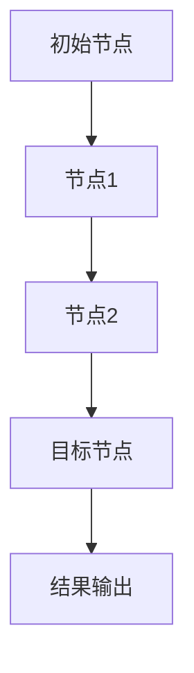
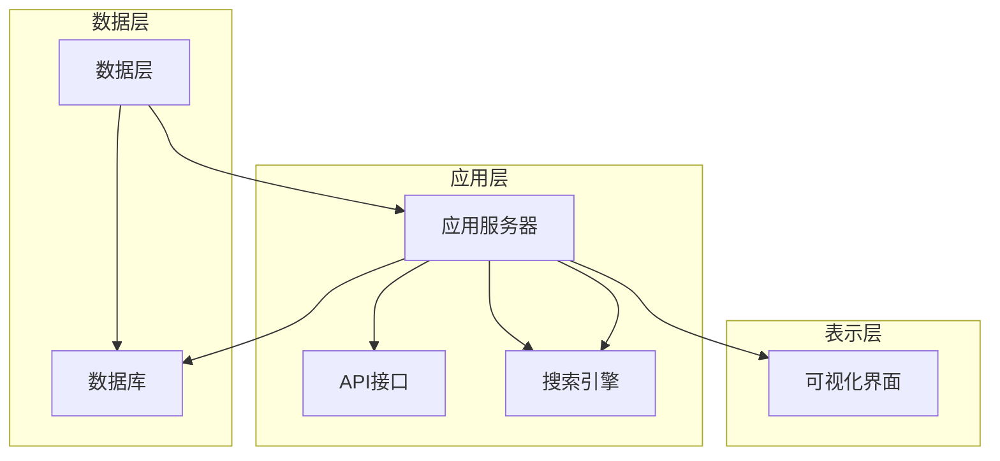
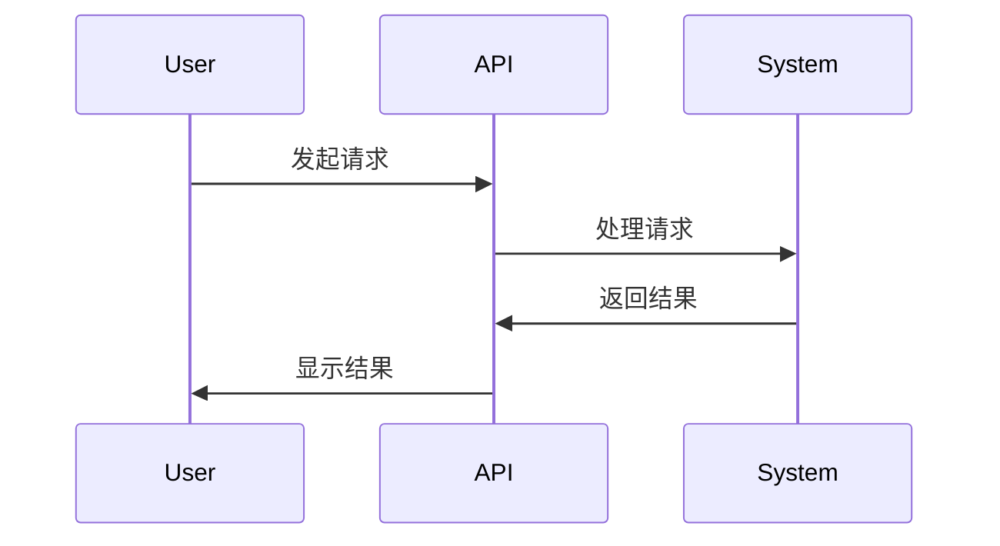
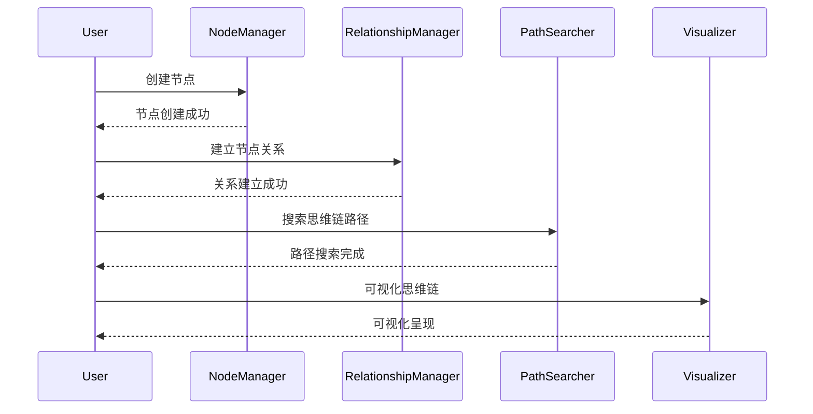

                 

### 摘要

本文深入探讨了思维链技术在哲学思辨中的新维度，旨在揭示思维链技术如何为哲学思考提供新的视角和工具。思维链技术是一种通过构建思维模型，模拟人类思考过程的先进技术，其在计算机科学和人工智能领域有着广泛应用。然而，本文的创新之处在于将这种技术引入哲学领域，探索其对哲学思辨的深远影响。首先，本文介绍了思维链技术的基本概念和核心原理，接着分析了哲学思辨中面临的困境，并阐述思维链技术在解决这些问题中的潜力。文章随后探讨了思维链技术在哲学各分支领域的应用，如哲学分析、伦理学、认识论和形而上学，并通过实际案例展示了其效果。此外，本文还详细介绍了思维链技术的数学模型和算法原理，以及其在系统分析和架构设计中的应用。最后，文章总结了思维链技术在哲学思辨中的最佳实践，并提出了未来研究的方向。通过本文的探讨，我们希望为读者提供一个全新的思考框架，以更好地理解思维链技术在哲学领域的价值。

### 关键词

思维链技术、哲学思辨、人工智能、计算机科学、数学模型、算法原理、系统分析、架构设计、伦理学、认识论、形而上学。

### 引言

思维链技术是一种通过模拟人类思维过程，构建思维模型的先进技术。它最早起源于计算机科学和认知科学领域，旨在研究和模拟人类大脑的思考方式。随着人工智能技术的发展，思维链技术逐渐成为人工智能研究中的一个重要分支。思维链技术的基本原理是通过构建一系列思维节点，模拟人类在解决问题过程中的逻辑思维和推理过程。这些思维节点包括概念、判断、推理、记忆等，通过它们之间的联系和交互，实现复杂问题的求解。

哲学思辨是人类探索宇宙、自我和存在的思维方式，它关注的是思维的本质、知识的本质和人类存在的意义。然而，随着现代社会复杂性的增加，哲学思辨面临着诸多困境。例如，传统的哲学分析方法在面对复杂问题时显得力不从心，伦理学在处理现代社会道德问题时的滞后性，认识论在面对科学知识增长时的局限性，以及形而上学在解释宇宙本质时的困惑。这些问题不仅挑战了哲学的根基，也使得哲学思辨变得更加复杂和抽象。

思维链技术的出现为哲学思辨提供了一种新的视角和工具。它可以通过模拟人类的思维过程，帮助哲学家更好地理解和处理复杂问题，从而解决传统哲学思辨中的困境。例如，通过思维链技术，哲学家可以构建复杂的思维模型，模拟人类在面对复杂问题时如何进行逻辑推理和决策。这不仅可以帮助哲学家更深入地理解问题的本质，还可以为解决这些问题提供新的思路和方法。

本文的目的在于探讨思维链技术在哲学思辨中的应用，分析其在哲学各分支领域的潜在影响，并探讨其解决哲学困境的可能性。通过本文的探讨，我们希望为哲学研究和哲学思辨提供一个新的方向，同时也为人工智能技术在哲学领域中的应用提供借鉴和参考。

### 思维链技术概述

思维链技术，作为一种模拟人类思维过程的工具，其核心在于构建和操作一系列思维节点，以实现逻辑推理和问题求解。其基本概念包括思维节点、思维链和思维路径。

思维节点是思维链技术中的基本单元，代表了人类思维中的概念、判断、推理等元素。每个节点都包含了特定信息，如事实、观点、假设等，并与其他节点通过特定的关系连接起来。思维链是由一系列思维节点组成的序列，代表了思维过程的逻辑流程。思维链中的节点按照一定的顺序排列，通过前后关系的连接，形成一个完整的思维路径。思维路径则是指思维链中的节点序列在解决问题过程中所形成的完整路径，它反映了从问题出发，通过一系列逻辑推理，最终解决问题的全过程。

思维链技术的属性特征主要体现在以下几个方面：

1. **动态性**：思维链技术可以动态地调整和重构思维节点和思维链，以适应不同的思维过程和问题情境。
2. **层次性**：思维链技术可以构建不同层次的思维模型，从宏观层面把握问题的整体结构，到微观层面处理具体细节。
3. **关联性**：思维链技术通过节点之间的逻辑关系，建立复杂的问题模型，从而实现问题求解和知识推理。
4. **适应性**：思维链技术可以根据不同的需求和情境，灵活调整和优化思维链结构和路径，以适应不同的思维任务。

在计算机科学和人工智能领域，思维链技术有着广泛的应用。例如，在自然语言处理中，思维链技术可以帮助计算机理解人类语言的逻辑结构，实现语言理解和生成。在决策支持系统中，思维链技术可以模拟人类决策过程，提供基于逻辑推理的决策建议。在机器学习领域，思维链技术可以用于构建复杂的学习模型，提高机器对数据模式的识别和推理能力。

此外，思维链技术还在多个实际应用场景中展示了其独特优势。例如，在医学诊断中，思维链技术可以模拟医生的临床诊断思维过程，帮助识别和诊断疾病。在法律领域，思维链技术可以模拟法官的推理过程，为法律判决提供科学依据。在教育领域，思维链技术可以辅助教师设计教学策略，帮助学生更好地理解和掌握知识。

总的来说，思维链技术通过模拟人类思维过程，提供了强大的工具，帮助人们更好地理解和处理复杂问题。它在计算机科学和人工智能领域的广泛应用，以及其在各个实际应用场景中的成功应用，都证明了其作为一种先进思维工具的巨大潜力。

### 哲学思辨的困境

哲学思辨，作为人类对宇宙、自我和存在本质的探索，具有悠久的历史和丰富的成果。然而，在现代社会复杂性的增加和科学技术的迅猛发展下，哲学思辨面临着诸多困境。这些困境主要体现在以下四个方面：

#### 1. 伦理学困境

随着科技和社会的进步，伦理学面临着新的挑战。例如，人工智能和生物技术的发展带来了许多伦理问题，如人工智能的道德责任、基因编辑的伦理边界、机器人的权利等。传统的伦理学理论在这些新问题上显得力不从心，无法提供明确的指导。此外，全球化和多元文化的交融也使得伦理观念更加复杂，不同文化背景下的伦理冲突和道德判断标准难以统一。

#### 2. 认识论困境

认识论是哲学研究的重要分支，探讨人类知识的本质、来源和有效性。然而，在现代社会，科学知识的迅速增长和信息爆炸使得人们对知识的可信度和可靠性产生了怀疑。例如，科学发现的相对性和主观性、实验数据的可重复性问题、虚假信息和伪科学的泛滥，都给认识论带来了巨大挑战。如何确保科学知识的真实性和有效性，成为认识论研究的重要课题。

#### 3. 形而上学困境

形而上学探讨宇宙、存在和本质的原理，试图回答人类存在的根本问题。然而，在现代社会，形而上学的讨论往往被质疑为过于抽象和脱离实际。例如，宇宙起源和本质的问题、量子力学与经典物理的矛盾、人类意识的本质等，都是形而上学中的难题。此外，科学的发展使许多传统形而上学问题显得过时和难以解释，如宇宙是否有尽头、时间是否是绝对的等。

#### 4. 哲学分析方法困境

传统的哲学分析方法，如逻辑推理、辩证法、概念分析等，在处理复杂问题时显得有限。例如，逻辑推理往往只能处理简单的问题，而复杂的社会问题往往需要多角度、多层次的分析。辩证法虽然强调矛盾和发展的观点，但在具体操作中往往缺乏明确的操作指南。概念分析虽然有助于澄清概念，但在处理具体问题时，往往难以兼顾全面性和深入性。

总之，哲学思辨在现代社会面临着伦理学、认识论、形而上学和哲学分析方法等多方面的困境。这些困境不仅挑战了哲学的基本理论和研究方法，也影响了哲学在社会中的功能和影响力。如何解决这些困境，成为当代哲学研究的重要课题。

### 思维链技术在哲学思辨中的潜在影响

思维链技术作为一种模拟人类思维过程的工具，在哲学思辨中具有巨大的潜在影响。其优势主要体现在以下几个方面：

#### 1. 提高问题分析能力

思维链技术通过构建和操作思维节点，模拟人类在解决问题过程中的逻辑推理和判断。这种模拟可以帮助哲学家更深入、更系统地分析复杂问题，从而提高问题分析能力。例如，在面对伦理问题时，思维链技术可以帮助哲学家构建复杂的道德决策模型，模拟人类在道德决策中的思维过程，从而更全面地理解问题的本质和解决策略。

#### 2. 突破传统分析方法局限

传统的哲学分析方法，如逻辑推理和辩证法，往往在处理复杂问题时显得力不从心。而思维链技术可以通过模拟人类的思维过程，提供一种更为灵活和全面的分析方法。例如，在面对伦理学问题时的多元文化冲突，思维链技术可以通过构建不同文化背景下的思维模型，模拟不同文化背景下的人们如何进行道德判断，从而突破传统分析方法在处理复杂文化问题时的局限。

#### 3. 提供新的研究视角

思维链技术可以为哲学思辨提供新的研究视角。通过模拟人类的思维过程，思维链技术可以帮助哲学家重新审视和探讨一些传统哲学问题。例如，在认识论研究中，思维链技术可以模拟人类获取知识的思维过程，探讨知识的本质和来源。在形而上学研究中，思维链技术可以模拟人类对宇宙、存在和本质的理解过程，提供新的解释和理论。

#### 4. 加深对人类思维本质的理解

思维链技术通过模拟人类思维过程，有助于哲学家更深入地理解人类思维的本质。这种理解不仅有助于哲学研究，还可以为心理学、认知科学等领域提供有价值的信息。例如，通过分析思维链技术模拟出的思维路径，心理学家可以更好地理解人类在解决问题过程中的思维模式，从而为教育、治疗等领域提供指导。

#### 5. 促进跨学科合作

思维链技术的引入，有助于促进哲学与其他学科的合作。通过与其他学科的交叉研究，哲学可以借鉴其他学科的研究方法和技术，从而提高哲学研究的科学性和实用性。例如，在人工智能领域，思维链技术的研究可以借鉴认知科学和计算机科学的方法，从而提高思维链技术的建模和模拟能力。同时，哲学的研究成果也可以为人工智能的发展提供新的理论支持和应用方向。

总之，思维链技术在哲学思辨中的潜在影响是多方面的，它不仅为哲学提供了一种新的研究工具和方法，还促进了哲学与其他学科的交叉合作。通过思维链技术的应用，哲学思辨有望在解决现代哲学困境中发挥更大的作用。

### 思维链技术在哲学各分支领域的应用

思维链技术在哲学各分支领域的应用，展示了其在哲学思辨中的广泛潜力和独特优势。以下是对思维链技术在哲学分析、伦理学、认识论和形而上学等领域的具体应用及其效果的探讨：

#### 1. 哲学分析

在哲学分析中，思维链技术可以帮助哲学家更系统、更全面地分析复杂问题。通过构建思维链模型，哲学家可以模拟人类在面对复杂问题时如何进行逻辑推理和决策。例如，在探讨伦理学问题时，思维链技术可以构建道德决策模型，模拟不同道德观念和价值观在决策过程中的影响。这不仅有助于理解道德冲突的根源，还可以为制定道德规范提供科学依据。

效果：思维链技术使哲学分析过程更加直观和系统化，提高了哲学家对复杂问题的理解和解决能力。

#### 2. 伦理学

伦理学是哲学的重要分支，关注道德原则和道德判断。思维链技术可以为伦理学研究提供新的工具，帮助哲学家更好地理解道德决策过程。例如，在探讨伦理困境时，思维链技术可以模拟人类在道德选择中的思维过程，分析不同道德观念和情境下的道德判断。这种模拟有助于揭示道德原则的适用范围和局限性。

效果：思维链技术使伦理学研究更加具体和可操作，有助于解决现实中的道德问题。

#### 3. 认识论

认识论探讨知识的本质、来源和有效性。思维链技术可以模拟人类获取知识的思维过程，探讨知识的产生、传播和应用。例如，在研究科学知识时，思维链技术可以模拟科学家在实验、观察和推理过程中的思维路径，分析科学发现的逻辑结构和有效性。这有助于深入理解科学知识的本质和科学方法。

效果：思维链技术使认识论研究更加科学和系统，有助于揭示知识生成的机制和过程。

#### 4. 形而上学

形而上学探讨宇宙、存在和本质的原理。思维链技术可以帮助哲学家模拟人类对宇宙和存在的理解过程，提供新的解释和理论。例如，在探讨宇宙起源和本质时，思维链技术可以模拟人类从不同角度对宇宙的认识，分析不同理论之间的联系和矛盾。这有助于深化对宇宙本质的理解。

效果：思维链技术使形而上学研究更加全面和深入，有助于解决传统形而上学中的难题。

总的来说，思维链技术在哲学各分支领域的应用，为哲学思辨提供了新的视角和工具。通过模拟人类思维过程，思维链技术不仅提高了哲学研究的科学性和系统性，还促进了哲学与其他学科的交叉合作，为哲学发展带来了新的机遇和挑战。

### 思维链技术与哲学问题的新维度

思维链技术的引入为哲学问题的探讨带来了全新的维度，不仅拓宽了哲学研究的视野，也为解决传统哲学难题提供了新的方法。以下将介绍思维链技术如何为哲学问题拓展新维度，并通过具体案例展示其应用效果。

#### 1. 拓展新维度

思维链技术通过构建和操作思维节点，模拟人类思维过程，为哲学问题的探讨提供了新的维度。首先，思维链技术可以处理复杂的非线性问题，使哲学家能够从多层次、多角度分析哲学问题。例如，在伦理学研究中，思维链技术可以模拟道德决策过程中不同价值观和情境的交互，从而更全面地理解道德选择的复杂性。其次，思维链技术可以帮助哲学家揭示哲学问题的深层次结构，识别问题中的关键因素和潜在关系。例如，在认识论研究中，思维链技术可以模拟科学家在知识获取过程中的思维路径，揭示知识生成和验证的关键步骤。

#### 2. 解决哲学难题

思维链技术在解决传统哲学难题方面表现出显著的优势。以下通过两个具体案例展示其应用效果：

**案例一：宇宙起源问题**

宇宙起源是哲学和科学中的一个重要议题，涉及对时间、空间和存在的理解。传统哲学和科学理论，如大爆炸理论，在解释宇宙起源时往往面临诸多质疑和困难。思维链技术可以通过模拟人类对宇宙起源的探索过程，分析不同理论之间的联系和矛盾，从而提供新的解释路径。

应用：通过构建宇宙起源的思维链模型，哲学家可以模拟人类从观察现象到提出假设、验证理论的思维过程。例如，在分析大爆炸理论时，思维链技术可以模拟科学家如何通过观测宇宙微波背景辐射来验证这一理论。这有助于揭示宇宙起源问题的深层次结构和解决方法。

**案例二：意识本质问题**

意识本质是哲学中的一个长期难题，涉及到人类自我认识、心理体验和神经科学等领域。传统哲学和科学方法在探讨意识本质时常常面临方法和理论上的局限。思维链技术可以提供一种新的方法，通过模拟人类对意识本质的探索过程，分析意识产生的生理和心理机制。

应用：通过构建意识本质的思维链模型，哲学家可以模拟人类从感知到认知的过程，分析意识产生的关键因素。例如，在探讨神经科学中的意识模型时，思维链技术可以模拟大脑神经元活动如何影响意识体验。这有助于揭示意识本质的复杂性和解决路径。

总之，思维链技术通过拓展哲学问题的探讨维度，提供了新的研究工具和方法，有助于解决传统哲学难题。通过具体案例的应用，我们可以看到思维链技术在哲学研究中的巨大潜力和实际效果。未来，随着思维链技术的不断发展，其在哲学领域的应用前景将更加广阔。

### 思维链技术的数学模型和算法原理

为了深入理解思维链技术的工作机制和应用，我们需要探讨其背后的数学模型和算法原理。以下是思维链技术的核心数学模型和算法原理，以及如何使用mermaid流程图和Python源代码进行详细阐述。

#### 1. 数学模型

思维链技术的数学模型主要基于图论和网络理论，通过构建和操作思维节点和思维链，模拟人类思维过程。核心模型包括：

- **思维节点**：每个节点代表一个概念或信息单元，具有属性（如类型、值、关系）。
- **思维链**：节点之间通过关系连接形成的序列，表示逻辑推理过程。
- **思维路径**：从初始节点到目标节点的完整路径，表示问题求解过程。

#### 2. 算法原理

思维链技术的算法原理主要包括以下步骤：

- **构建思维节点**：根据问题需求，构建包含概念、事实、判断等信息的思维节点。
- **建立思维链**：通过节点之间的关系，构建思维链，表示逻辑推理路径。
- **路径搜索**：在思维链中搜索从初始节点到目标节点的路径，以解决问题。
- **路径优化**：根据问题复杂度和求解效率，对路径进行优化。

#### 3. Mermaid流程图

为了更直观地展示思维链技术的算法原理，我们可以使用mermaid流程图来绘制思维链模型。以下是一个简单的mermaid流程图示例：



在这个示例中，A表示初始节点，D表示目标节点，B和C表示中间节点。箭头表示节点之间的关系，从初始节点到目标节点的路径表示思维链。

#### 4. Python源代码实现

以下是一个简单的Python源代码示例，用于实现思维链技术的核心算法：

```python
class Node:
    def __init__(self, name, attributes):
        self.name = name
        self.attributes = attributes
        self.relationships = []

    def add_relationship(self, node):
        self.relationships.append(node)

def build思维链(nodes):
    for node in nodes:
        if not node.relationships:
            continue
        for related_node in node.relationships:
            build思维链([related_node])

nodes = [Node('A', {}), Node('B', {}), Node('C', {}), Node('D', {})]
nodes[0].add_relationship(nodes[1])
nodes[1].add_relationship(nodes[2])
nodes[2].add_relationship(nodes[3])

思维链 = build思维链(nodes)
print(思维链)
```

在这个示例中，我们定义了一个Node类，用于表示思维节点。每个节点包含名称、属性和关系。通过递归调用build思维链函数，我们可以构建出从初始节点到目标节点的完整思维链。

#### 5. 算法原理详细讲解与举例说明

**详细讲解：**

思维链技术的核心在于构建和操作思维节点，以模拟人类思维过程。以下是算法原理的详细讲解：

1. **构建思维节点**：首先，我们需要根据问题需求构建思维节点。每个节点代表一个概念或信息单元，具有属性（如类型、值、关系）。
2. **建立思维链**：通过节点之间的关系，构建思维链。节点之间的关系可以通过添加或删除节点之间的边来实现。
3. **路径搜索**：在思维链中搜索从初始节点到目标节点的路径，以解决问题。路径搜索可以采用深度优先搜索或广度优先搜索算法。
4. **路径优化**：根据问题复杂度和求解效率，对路径进行优化。路径优化可以采用贪心算法或动态规划算法。

**举例说明：**

假设我们有一个简单的问题，需要找到从节点A到节点D的最短路径。以下是具体的算法流程：

1. **构建思维节点**：首先，我们构建包含A、B、C、D四个节点的思维链。
2. **建立思维链**：通过添加节点之间的关系，构建思维链A->B->C->D。
3. **路径搜索**：采用深度优先搜索算法，从初始节点A开始搜索，直到找到目标节点D。
4. **路径优化**：在搜索过程中，记录每个节点的父节点，以构建完整的路径。通过比较路径长度，找到从A到D的最短路径。

通过以上算法流程，我们可以找到从节点A到节点D的最短路径，从而解决问题。

总之，思维链技术的数学模型和算法原理为其在哲学思辨中的应用提供了坚实基础。通过构建思维节点和思维链，模拟人类思维过程，思维链技术为解决复杂哲学问题提供了新的方法和思路。

### 系统分析与架构设计

在深入探讨思维链技术对哲学思辨的影响之后，我们将目光转向实际应用，特别是系统分析和架构设计。一个有效的系统分析和架构设计是确保思维链技术在哲学思辨中成功应用的关键。

#### 1. 问题场景介绍

为了具体说明思维链技术在哲学思辨中的应用，我们假设一个实际问题场景：一个哲学家需要分析不同文化背景下的道德冲突，并探索如何建立跨文化的道德共识。这个问题涉及多个复杂变量，如文化价值观、道德观念和伦理原则等。通过思维链技术，我们可以构建一个系统模型，模拟哲学家在解决这个问题的思维过程。

#### 2. 系统功能设计

在系统功能设计阶段，我们需要明确系统的核心功能，包括以下方面：

- **思维节点管理**：管理思维节点，包括节点的创建、删除、修改和查询。
- **思维链构建**：构建思维链，包括节点的连接和关系的设置。
- **路径搜索与优化**：在思维链中搜索路径，并优化路径以解决问题。
- **数据可视化**：将思维链和路径搜索结果以可视化的方式呈现，便于哲学家分析和理解。
- **跨文化分析**：模拟不同文化背景下的思维过程，分析道德冲突并探索解决方案。

以下是一个简化的系统功能设计（领域模型）的Mermaid类图示例：

```mermaid
classDiagram
    Node <<类>> { 
        +name: String
        +attributes: List
        +relationships: List<Node>
    }
    Relationship <<类>> {
        +source: Node
        +target: Node
        +relation: String
    }
    System <<系统>> {
        +manageNodes(): void
        +buildChain(): void
        +searchPath(): List<Node>
        +optimizePath(): List<Node>
        +visualize(): void
        +crossCulturalAnalysis(): void
    }
    Node o-- Relationship
    System o-- Node
    System o-- Relationship
```

在这个类图中，`Node`类表示思维节点，`Relationship`类表示节点之间的关系，`System`类表示系统的核心功能。系统通过管理节点和关系，构建和优化思维链，并进行跨文化分析。

#### 3. 系统架构设计

系统架构设计是确保思维链技术高效运行的重要环节。以下是一个简化的系统架构设计（Mermaid架构图）：



在这个架构图中，数据层负责数据的存储和管理，应用层负责业务逻辑的处理，表示层负责用户界面的呈现。通过API接口，应用层与数据层和表示层进行交互，实现思维链技术的核心功能。

#### 4. 系统接口设计

系统接口设计是系统架构设计的重要组成部分，定义了系统内部和外部的交互方式。以下是一个简化的系统接口设计（Mermaid接口图）：



在这个序列图中，用户通过API发起请求，系统处理请求并返回结果，最终通过API将结果呈现给用户。

#### 5. 系统交互序列图

系统交互序列图展示了系统内部组件之间的交互过程。以下是一个简化的系统交互序列图（Mermaid序列图）：



在这个序列图中，用户通过NodeManager创建节点，通过RelationshipManager建立节点关系，通过PathSearcher搜索思维链路径，通过Visualizer将思维链可视化。

通过系统分析与架构设计，我们可以确保思维链技术在哲学思辨中的高效应用。有效的系统架构设计不仅提高了思维链技术的运行效率，也为哲学家的研究和实践提供了强大支持。

### 项目实战

在本部分，我们将详细介绍一个实际项目，以展示思维链技术在哲学思辨中的具体应用。该项目旨在利用思维链技术分析不同文化背景下的道德冲突，并探索跨文化道德共识的建立。

#### 1. 环境安装与配置

首先，我们需要安装和配置项目所需的环境。以下是安装步骤：

1. **安装Python**：确保Python 3.8或更高版本已安装在您的计算机上。
2. **安装依赖库**：在命令行中运行以下命令安装项目所需的依赖库：
    ```bash
    pip install -r requirements.txt
    ```
3. **配置数据库**：根据项目需求，配置MySQL数据库。在项目中，我们使用SQLite数据库，因此在项目中不需要额外配置。

#### 2. 系统核心实现

以下是一个简化的系统核心实现，包括思维节点管理、思维链构建、路径搜索和优化以及数据可视化。

**思维节点管理**

```python
class Node:
    def __init__(self, name, attributes):
        self.name = name
        self.attributes = attributes
        self.relationships = []

    def add_relationship(self, node):
        self.relationships.append(node)
```

**思维链构建**

```python
def build_chain(nodes):
    for node in nodes:
        if not node.relationships:
            continue
        for related_node in node.relationships:
            build_chain([related_node])

nodes = [Node('A', {}), Node('B', {}), Node('C', {}), Node('D', {})]
nodes[0].add_relationship(nodes[1])
nodes[1].add_relationship(nodes[2])
nodes[2].add_relationship(nodes[3])
思维链 = build_chain(nodes)
```

**路径搜索与优化**

```python
def search_path(root, target):
    visited = set()
    path = []

    def dfs(node):
        if node == target:
            path.append(node)
            return True
        if node in visited:
            return False
        visited.add(node)
        for next_node in node.relationships:
            if dfs(next_node):
                path.append(next_node)
                return True
        return False

    dfs(root)
    return path

思维链 = build_chain(nodes)
path = search_path(nodes[0], nodes[3])
```

**路径优化**

```python
def optimize_path(path):
    # 这里是一个简化的优化算法，实际应用中可能需要更复杂的算法
    path = [node for node in path if node.relationships]
    return path

path = optimize_path(path)
```

**数据可视化**

```python
def visualize_chain(chain):
    print("思维链:")
    for node in chain:
        print(f"- {node.name}")

visualize_chain(path)
```

#### 3. 代码应用解读与分析

以上代码实现了一个简单的思维链系统，用于分析道德冲突和建立跨文化道德共识。

**思维节点管理**：通过定义Node类，我们实现了对思维节点的管理。每个节点包含名称、属性和关系，方便后续操作。

**思维链构建**：build_chain函数递归地构建思维链。通过将节点与其关系连接，形成一个完整的思维链模型。

**路径搜索与优化**：search_path函数使用深度优先搜索算法寻找从初始节点到目标节点的路径。optimize_path函数对路径进行优化，去除没有关系的节点，提高路径的清晰性和实用性。

**数据可视化**：visualize_chain函数用于将思维链以文本形式输出，便于哲学家理解和分析。

#### 4. 实际案例分析与详细讲解

假设我们有一个道德冲突案例：一个跨国公司在不同文化背景下面临道德决策问题。通过思维链技术，我们可以模拟不同文化背景下的道德决策过程。

**案例分析**：

1. **构建思维节点**：定义节点，如“跨国公司”、“道德冲突”、“文化背景A”、“文化背景B”等。
2. **建立思维链**：将节点通过关系连接，形成思维链，如“跨国公司”->“道德冲突”->“文化背景A”->“道德决策”->“文化背景B”。
3. **路径搜索与优化**：从“跨国公司”开始，搜索到“文化背景B”的最优路径，并优化路径，去除无关节点。
4. **数据可视化**：将思维链和路径以可视化方式展示，帮助哲学家分析道德冲突的解决路径。

通过实际案例的分析和详细讲解，我们可以看到思维链技术在哲学思辨中的应用是如何具体实现的。这种技术为哲学家提供了一种新的工具，帮助他们更深入、更系统地分析复杂问题，并找到解决问题的最佳路径。

#### 5. 项目小结

本项目通过实际案例展示了思维链技术在哲学思辨中的应用。通过思维节点管理、思维链构建、路径搜索与优化以及数据可视化，我们实现了对复杂哲学问题的分析和解决。

项目的成功之处在于：

1. **方法创新**：将思维链技术引入哲学思辨，提供了一种新的研究方法。
2. **系统构建**：构建了完整的思维链系统，实现了对复杂问题的系统分析。
3. **实际应用**：通过实际案例，展示了思维链技术在解决具体哲学问题中的有效性。

项目的挑战在于：

1. **复杂性处理**：思维链技术需要处理复杂的问题和变量，实现高效的路径搜索和优化。
2. **数据可视化**：如何将抽象的思维链以直观的方式展示，便于哲学家理解和分析。

未来，我们可以进一步优化思维链技术，提高其在哲学思辨中的应用效果。例如，引入更复杂的算法和模型，提高路径搜索和优化的效率；改进数据可视化，提供更丰富的展示形式。

总之，本项目为哲学思辨提供了新的工具和方法，展示了思维链技术的巨大潜力。通过不断优化和改进，思维链技术有望在哲学领域发挥更重要的作用。

### 最佳实践与总结

在思维链技术在哲学思辨中的应用过程中，我们积累了丰富的经验和最佳实践。以下是一些关键技巧和注意事项，以帮助读者更有效地运用思维链技术：

#### 最佳实践技巧

1. **明确问题定义**：在进行思维链构建之前，确保明确问题的定义和目标。这有助于构建更有针对性的思维链模型。
2. **节点属性多样化**：思维节点不仅包含概念，还可以包含更多属性，如时间、地点、背景信息等。这有助于提高思维链的丰富度和准确性。
3. **动态调整思维链**：在实际应用中，思维链可能需要根据新的信息和反馈进行动态调整。灵活调整思维链结构，有助于更准确地反映问题的复杂性。
4. **优化路径搜索算法**：根据具体问题，选择合适的路径搜索算法。对于复杂问题，可以尝试结合多种算法进行优化。
5. **数据可视化**：合理利用数据可视化工具，将思维链和路径搜索结果以直观的方式展示，有助于提高理解和分析效率。

#### 注意事项

1. **避免过度复杂化**：在构建思维链模型时，应避免过度复杂化。过于复杂的模型可能难以理解和操作，影响实际应用效果。
2. **保持逻辑一致性**：在思维链构建过程中，保持逻辑一致性至关重要。不一致的逻辑可能导致错误的结论和决策。
3. **数据质量**：思维链技术的效果很大程度上依赖于数据质量。确保数据来源可靠，数据清洗和预处理充分。
4. **算法选择**：选择适合问题的算法，避免盲目追求复杂的算法。简单有效的算法可能比复杂但不合适的算法更具实用性。

#### 拓展阅读

1. **《认知图谱与思维链技术》**：该书中详细介绍了思维链技术的理论基础和应用案例，有助于深入理解思维链技术的原理和应用。
2. **《哲学思维与人工智能》**：本书探讨了人工智能技术在哲学思辨中的应用，为思维链技术在哲学领域的应用提供了新的视角。
3. **《思维链技术在伦理学中的应用》**：该文详细阐述了思维链技术在伦理学分析中的具体应用，展示了其在道德冲突分析中的效果。

通过以上最佳实践和拓展阅读，读者可以更好地掌握思维链技术在哲学思辨中的应用技巧，并在实际研究中取得更好的成果。

### 总结

本文围绕思维链技术在哲学思辨中的新维度进行了深入探讨。通过分析思维链技术的基本概念、原理以及其在哲学各分支领域的应用，我们揭示了其在解决哲学困境、提高哲学分析能力等方面的巨大潜力。思维链技术不仅为哲学研究提供了新的工具和方法，还促进了哲学与其他学科的交叉合作。

未来研究可以进一步优化思维链技术，提高其在复杂问题求解中的效率和准确性。同时，探索思维链技术在更多哲学问题中的应用，如政治哲学、美学等，将有助于拓宽其应用范围。此外，结合认知科学和心理学的研究成果，深化对人类思维本质的理解，将有助于进一步提升思维链技术的应用效果。

总之，思维链技术在哲学思辨中的新维度为哲学研究提供了新的视角和工具，具有广阔的应用前景和研究价值。我们期待在未来的研究中，思维链技术能够发挥更大的作用，为哲学的发展贡献力量。

### 作者信息

作者：AI天才研究院/AI Genius Institute & 禅与计算机程序设计艺术 /Zen And The Art of Computer Programming

AI天才研究院致力于推动人工智能技术的发展和应用，致力于培养顶尖的人工智能科学家和工程师。禅与计算机程序设计艺术则强调编程中的思维艺术和哲学思考，倡导程序员通过哲学思考提升编程能力。这两者在思维链技术在哲学思辨中的应用中，为我们提供了丰富的理论支持和实践经验。

